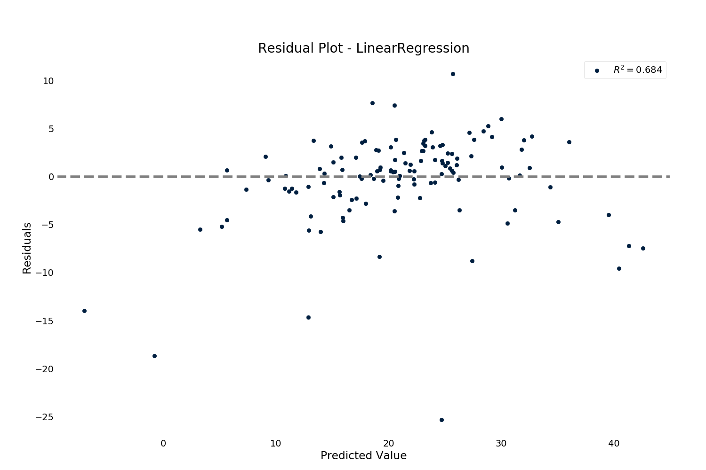

.. currentmodule:: ml_tooling.result.viz
.. _plotting:

Plotting
========

When a model is trained, it returns a :class:`~ml_tooling.result.Result` object.
That object has number of visualization options depending on the type of model.

To use the visualizations, access them using the `.plot` accessor on the
:class:`~ml_tooling.result.Result` object::

>> result = model.score_estimator()
>> result.plot.residuals()

Any visualizer listed here also has a functional counterpart in :mod:`ml_tooling.plots`.
E.g if you want to use the function for plotting a confusion matrix without using
the ml_tooling ModelData approach, you can instead do::

    from ml_tooling.plots import plot_confusion_matrix

These functional counterparts all mirror sklearn metrics api, taking y_target and y_pred
as arguments::

>>> from ml_tooling.plots import plot_confusion_matrix
>>> import numpy as np
>>>
>>> y_true = np.array([1, 0, 1, 0])
>>> y_pred = np.array([1, 0, 0, 0])
>>> plot_confusion_matrix(y_true, y_pred)

Available Classifier plots
--------------------------
- :meth:`~ClassificationVisualize.roc_curve`
    Visualize a ROC curve for a classification model.
    Shows the relationship between the True Positive Rate and the False Positive Rate.

- :meth:`~ClassificationVisualize.confusion_matrix`:
    Visualize a confusion matrix for a classification model.
    Shows the distribution of predicted labels vs actual labels

- :meth:`~ClassificationVisualize.feature_importance`
    Uses random permutation to calculate feature importance.
    By randomly permuting each column and measuring the difference in the model metric against the baseline.

- :meth:`~ClassificationVisualize.lift_curve`
    Visualizes how much of the target class we capture by setting different thresholds for probability

Available Regression Plots
--------------------------

- :meth:`~RegressionVisualize.prediction_error`:
    Visualizes prediction error of a regression model. Shows how far away each prediction is
    from the correct prediction for that point

- :meth:`~RegressionVisualize.residuals`:
    Visualizes residuals of a regression model. Shows the distribution of noise that couldn't be
    fitted.

- :meth:`~RegressionVisualize.feature_importance`
    Uses random permutation to calculate feature importance. By randomly permuting each column
    and measuring the difference in the model metric against the baseline.

Continue to :doc:`transformers`
