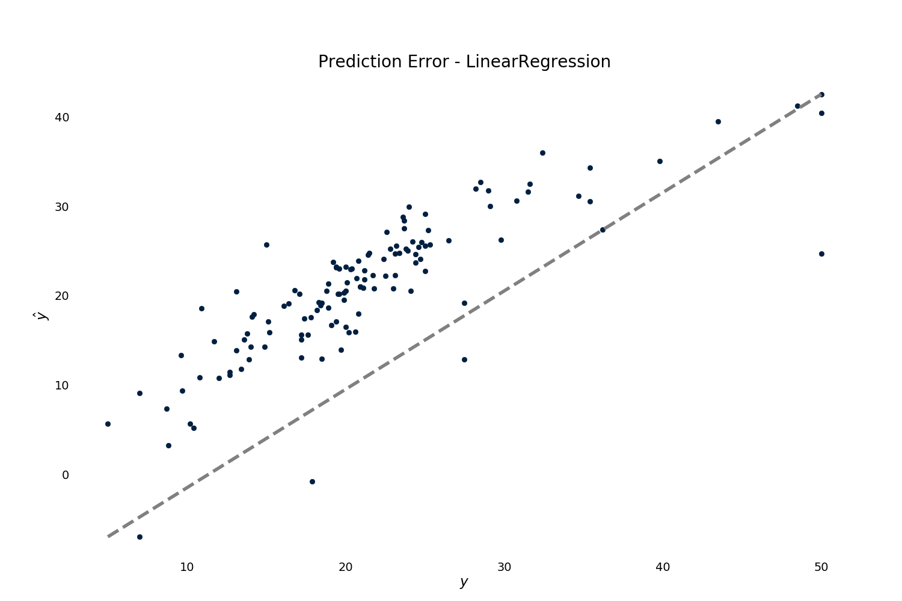

.. py:currentmodule:: ml_tooling.baseclass.ModelData
.. _quickstart:

Quickstart
==========
ML Tooling requires you to create your own DataModel inheriting from ModelData.
You have to define two methods in your class:

* :meth:`get_training_data`

How to load in your training data - whether it's reading from an excel file or loading from a database.
This method should read in your data and return a DataFrame containing your features and a target
- usually as a numpy array.
This method is called the first time ML Tooling needs to gather data and is only called once.

* :meth:`get_prediction_data`

How to load in your prediction data. When predicting, you have to tell ML Tooling what data to load in.
Usually this takes an argument to

All you have to do to get started is to define your input data::

    from ml_tooling import ModelData
    from sklearn.linear_model import LinearRegression
    from sklearn.datasets import load_boston
    import pandas as pd

    class BostonData(ModelData):
    # Define where to get training time data - always return a DataFrame for X
    def get_training_data(self):
        data = load_boston()
        return pd.DataFrame(data.data, columns=data.feature_names), data.target

    # Define where to get prediction time data - returning a DataFrame
    def get_prediction_data(self, idx):
        data = load_boston()
        x = pd.DataFrame(data.data, labels=data.feature_names)
        return x.loc[idx] # Return given observation

    # Use your data with a given model
    regression = BostonData(LinearRegression())

Now we can start training our model:

>>> result = regression.score_estimator()
[16:30:31] - Scoring model...
[16:30:31] - LinearRegression - r2: 0.6844267283527068
>>> print(result)
<Result LinearRegression: r2: 0.68 >

We can get some pretty plots:

>>> results.plot.residuals()

>>> result = regression.score_estimator()
[16:30:31] - Scoring model...
[16:30:31] - LinearRegression - r2: 0.6844267283527068
>>> print(result)
<Result LinearRegression: r2: 0.68 >

We can get some pretty plots:

>>> results.plot.residuals()

>>> result = regression.score_estimator()
[16:30:31] - Scoring model...
[16:30:31] - LinearRegression - r2: 0.6844267283527068
>>> print(result)
<Result LinearRegression: r2: 0.68 >

We can get some pretty plots:

>>> results.plot.residuals()

.. figure:: plots/residualplot.png
    :alt: Plot of residuals from Linear Regression

>>> results.plot.prediction_error()

We can save and load our model:

>>> regression.save_model()
>>> my_new_model = BostonData.load_estimator('.')

We can try out many different models:

>>> from sklearn.linear_model import Ridge, LassoLars
>>> models_to_try = [LinearRegression(), Ridge(), LassoLars()]
>>> best_model, all_results = BostonModel.test_models(models_to_try, metric='neg_mean_squared_error')
[17:43:11] - Training model 1/3: LinearRegression
[17:43:11] - Scoring model...
[17:43:11] - LinearRegression - neg_mean_squared_error: -22.098694827098424
[17:43:11] - Training model 2/3: Ridge
[17:43:11] - Scoring model...
[17:43:11] - Ridge - neg_mean_squared_error: -22.480475501233876
[17:43:11] - Training model 3/3: LassoLars
[17:43:11] - Scoring model...
[17:43:11] - LassoLars - neg_mean_squared_error: -72.2607627995582
[17:43:11] - Best model: LinearRegression - neg_mean_squared_error: -22.098694827098424
>>> print(all_results)
[<Result LinearRegression: neg_mean_squared_error: -22.1 >
<Result Ridge: neg_mean_squared_error: -22.48 >
<Result LassoLars: neg_mean_squared_error: -72.26 >]

We get the results in sorted order for each model and see that LinearRegression gives us the best result!

Continue to

>>> regression.save_estimator()
>>> my_new_model = BostonData.load_estimator('.')

We can try out many different models:

>>> from sklearn.linear_model import Ridge, LassoLars
>>> models_to_try = [LinearRegression(), Ridge(), LassoLars()]
>>> best_model, all_results = BostonModel.test_models(models_to_try, metric='neg_mean_squared_error')
[17:43:11] - Training model 1/3: LinearRegression
[17:43:11] - Scoring model...
[17:43:11] - LinearRegression - neg_mean_squared_error: -22.098694827098424
[17:43:11] - Training model 2/3: Ridge
[17:43:11] - Scoring model...
[17:43:11] - Ridge - neg_mean_squared_error: -22.480475501233876
[17:43:11] - Training model 3/3: LassoLars
[17:43:11] - Scoring model...
[17:43:11] - LassoLars - neg_mean_squared_error: -72.2607627995582
[17:43:11] - Best model: LinearRegression - neg_mean_squared_error: -22.098694827098424
>>> print(all_results)
[<Result LinearRegression: neg_mean_squared_error: -22.1 >
<Result Ridge: neg_mean_squared_error: -22.48 >
<Result LassoLars: neg_mean_squared_error: -72.26 >]

We get the results in sorted order for each model and see that LinearRegression gives us the best result!

Continue to

>>> regression.save_model()
>>> my_new_model = BostonData.load_estimator('.')

We can try out many different models:

>>> from sklearn.linear_model import Ridge, LassoLars
>>> models_to_try = [LinearRegression(), Ridge(), LassoLars()]
>>> best_model, all_results = BostonModel.test_models(models_to_try, metric='neg_mean_squared_error')
[17:43:11] - Training model 1/3: LinearRegression
[17:43:11] - Scoring model...
[17:43:11] - LinearRegression - neg_mean_squared_error: -22.098694827098424
[17:43:11] - Training model 2/3: Ridge
[17:43:11] - Scoring model...
[17:43:11] - Ridge - neg_mean_squared_error: -22.480475501233876
[17:43:11] - Training model 3/3: LassoLars
[17:43:11] - Scoring model...
[17:43:11] - LassoLars - neg_mean_squared_error: -72.2607627995582
[17:43:11] - Best model: LinearRegression - neg_mean_squared_error: -22.098694827098424
>>> print(all_results)
[<Result LinearRegression: neg_mean_squared_error: -22.1 >
<Result Ridge: neg_mean_squared_error: -22.48 >
<Result LassoLars: neg_mean_squared_error: -72.26 >]

We get the results in sorted order for each model and see that LinearRegression gives us the best result!

Continue to

>>> regression.save_model()
>>> my_new_model = BostonData.load_estimator('.')

We can try out many different models:

>>> from sklearn.linear_model import Ridge, LassoLars
>>> models_to_try = [LinearRegression(), Ridge(), LassoLars()]
>>> best_model, all_results = BostonModel.test_models(models_to_try, metric='neg_mean_squared_error')
[17:43:11] - Training model 1/3: LinearRegression
[17:43:11] - Scoring model...
[17:43:11] - LinearRegression - neg_mean_squared_error: -22.098694827098424
[17:43:11] - Training model 2/3: Ridge
[17:43:11] - Scoring model...
[17:43:11] - Ridge - neg_mean_squared_error: -22.480475501233876
[17:43:11] - Training model 3/3: LassoLars
[17:43:11] - Scoring model...
[17:43:11] - LassoLars - neg_mean_squared_error: -72.2607627995582
[17:43:11] - Best model: LinearRegression - neg_mean_squared_error: -22.098694827098424
>>> print(all_results)
[<Result LinearRegression: neg_mean_squared_error: -22.1 >
<Result Ridge: neg_mean_squared_error: -22.48 >
<Result LassoLars: neg_mean_squared_error: -72.26 >]

We get the results in sorted order for each model and see that LinearRegression gives us the best result!

Continue to

>>> regression.save_estimator()
>>> my_new_model = BostonData.load_estimator('.')

We can try out many different models:

>>> from sklearn.linear_model import Ridge, LassoLars
>>> models_to_try = [LinearRegression(), Ridge(), LassoLars()]
>>> best_model, all_results = BostonModel.test_models(models_to_try, metric='neg_mean_squared_error')
[17:43:11] - Training model 1/3: LinearRegression
[17:43:11] - Scoring model...
[17:43:11] - LinearRegression - neg_mean_squared_error: -22.098694827098424
[17:43:11] - Training model 2/3: Ridge
[17:43:11] - Scoring model...
[17:43:11] - Ridge - neg_mean_squared_error: -22.480475501233876
[17:43:11] - Training model 3/3: LassoLars
[17:43:11] - Scoring model...
[17:43:11] - LassoLars - neg_mean_squared_error: -72.2607627995582
[17:43:11] - Best model: LinearRegression - neg_mean_squared_error: -22.098694827098424
>>> print(all_results)
[<Result LinearRegression: neg_mean_squared_error: -22.1 >
<Result Ridge: neg_mean_squared_error: -22.48 >
<Result LassoLars: neg_mean_squared_error: -72.26 >]

We get the results in sorted order for each model and see that LinearRegression gives us the best result!

Continue to

>>> regression.save_model()
>>> my_new_model = BostonData.load_estimator('.')

We can try out many different models:

>>> from sklearn.linear_model import Ridge, LassoLars
>>> models_to_try = [LinearRegression(), Ridge(), LassoLars()]
>>> best_model, all_results = BostonModel.test_models(models_to_try, metric='neg_mean_squared_error')
[17:43:11] - Training model 1/3: LinearRegression
[17:43:11] - Scoring model...
[17:43:11] - LinearRegression - neg_mean_squared_error: -22.098694827098424
[17:43:11] - Training model 2/3: Ridge
[17:43:11] - Scoring model...
[17:43:11] - Ridge - neg_mean_squared_error: -22.480475501233876
[17:43:11] - Training model 3/3: LassoLars
[17:43:11] - Scoring model...
[17:43:11] - LassoLars - neg_mean_squared_error: -72.2607627995582
[17:43:11] - Best model: LinearRegression - neg_mean_squared_error: -22.098694827098424
>>> print(all_results)
[<Result LinearRegression: neg_mean_squared_error: -22.1 >
<Result Ridge: neg_mean_squared_error: -22.48 >
<Result LassoLars: neg_mean_squared_error: -72.26 >]

We get the results in sorted order for each model and see that LinearRegression gives us the best result!

Continue to

>>> regression.save_model()
>>> my_new_model = BostonData.load_estimator('.')

We can try out many different models:

>>> from sklearn.linear_model import Ridge, LassoLars
>>> models_to_try = [LinearRegression(), Ridge(), LassoLars()]
>>> best_model, all_results = BostonModel.test_models(models_to_try, metric='neg_mean_squared_error')
[17:43:11] - Training model 1/3: LinearRegression
[17:43:11] - Scoring model...
[17:43:11] - LinearRegression - neg_mean_squared_error: -22.098694827098424
[17:43:11] - Training model 2/3: Ridge
[17:43:11] - Scoring model...
[17:43:11] - Ridge - neg_mean_squared_error: -22.480475501233876
[17:43:11] - Training model 3/3: LassoLars
[17:43:11] - Scoring model...
[17:43:11] - LassoLars - neg_mean_squared_error: -72.2607627995582
[17:43:11] - Best model: LinearRegression - neg_mean_squared_error: -22.098694827098424
>>> print(all_results)
[<Result LinearRegression: neg_mean_squared_error: -22.1 >
<Result Ridge: neg_mean_squared_error: -22.48 >
<Result LassoLars: neg_mean_squared_error: -72.26 >]

We get the results in sorted order for each model and see that LinearRegression gives us the best result!

Continue to

>>> regression.save_model()
>>> my_new_model = BostonData.load_estimator('.')

We can try out many different models:

>>> from sklearn.linear_model import Ridge, LassoLars
>>> models_to_try = [LinearRegression(), Ridge(), LassoLars()]
>>> best_model, all_results = BostonModel.test_models(models_to_try, metric='neg_mean_squared_error')
[17:43:11] - Training model 1/3: LinearRegression
[17:43:11] - Scoring model...
[17:43:11] - LinearRegression - neg_mean_squared_error: -22.098694827098424
[17:43:11] - Training model 2/3: Ridge
[17:43:11] - Scoring model...
[17:43:11] - Ridge - neg_mean_squared_error: -22.480475501233876
[17:43:11] - Training model 3/3: LassoLars
[17:43:11] - Scoring model...
[17:43:11] - LassoLars - neg_mean_squared_error: -72.2607627995582
[17:43:11] - Best model: LinearRegression - neg_mean_squared_error: -22.098694827098424
>>> print(all_results)
[<Result LinearRegression: neg_mean_squared_error: -22.1 >
<Result Ridge: neg_mean_squared_error: -22.48 >
<Result LassoLars: neg_mean_squared_error: -72.26 >]

We get the results in sorted order for each model and see that LinearRegression gives us the best result!

Continue to

>>> regression.save_estimator()
>>> my_new_model = BostonData.load_estimator('.')

We can try out many different models:

>>> from sklearn.linear_model import Ridge, LassoLars
>>> models_to_try = [LinearRegression(), Ridge(), LassoLars()]
>>> best_model, all_results = BostonModel.test_models(models_to_try, metric='neg_mean_squared_error')
[17:43:11] - Training model 1/3: LinearRegression
[17:43:11] - Scoring model...
[17:43:11] - LinearRegression - neg_mean_squared_error: -22.098694827098424
[17:43:11] - Training model 2/3: Ridge
[17:43:11] - Scoring model...
[17:43:11] - Ridge - neg_mean_squared_error: -22.480475501233876
[17:43:11] - Training model 3/3: LassoLars
[17:43:11] - Scoring model...
[17:43:11] - LassoLars - neg_mean_squared_error: -72.2607627995582
[17:43:11] - Best model: LinearRegression - neg_mean_squared_error: -22.098694827098424
>>> print(all_results)
[<Result LinearRegression: neg_mean_squared_error: -22.1 >
<Result Ridge: neg_mean_squared_error: -22.48 >
<Result LassoLars: neg_mean_squared_error: -72.26 >]

We get the results in sorted order for each model and see that LinearRegression gives us the best result!

Continue to

>>> regression.save_model()
>>> my_new_model = BostonData.load_estimator('.')

We can try out many different models:

>>> from sklearn.linear_model import Ridge, LassoLars
>>> models_to_try = [LinearRegression(), Ridge(), LassoLars()]
>>> best_model, all_results = BostonModel.test_models(models_to_try, metric='neg_mean_squared_error')
[17:43:11] - Training model 1/3: LinearRegression
[17:43:11] - Scoring model...
[17:43:11] - LinearRegression - neg_mean_squared_error: -22.098694827098424
[17:43:11] - Training model 2/3: Ridge
[17:43:11] - Scoring model...
[17:43:11] - Ridge - neg_mean_squared_error: -22.480475501233876
[17:43:11] - Training model 3/3: LassoLars
[17:43:11] - Scoring model...
[17:43:11] - LassoLars - neg_mean_squared_error: -72.2607627995582
[17:43:11] - Best model: LinearRegression - neg_mean_squared_error: -22.098694827098424
>>> print(all_results)
[<Result LinearRegression: neg_mean_squared_error: -22.1 >
<Result Ridge: neg_mean_squared_error: -22.48 >
<Result LassoLars: neg_mean_squared_error: -72.26 >]

We get the results in sorted order for each model and see that LinearRegression gives us the best result!

Continue to

>>> regression.save_model()
>>> my_new_model = BostonData.load_estimator('.')

We can try out many different models:

>>> from sklearn.linear_model import Ridge, LassoLars
>>> models_to_try = [LinearRegression(), Ridge(), LassoLars()]
>>> best_model, all_results = BostonModel.test_estimators(models_to_try, metric='neg_mean_squared_error')
[17:43:11] - Training model 1/3: LinearRegression
[17:43:11] - Scoring model...
[17:43:11] - LinearRegression - neg_mean_squared_error: -22.098694827098424
[17:43:11] - Training model 2/3: Ridge
[17:43:11] - Scoring model...
[17:43:11] - Ridge - neg_mean_squared_error: -22.480475501233876
[17:43:11] - Training model 3/3: LassoLars
[17:43:11] - Scoring model...
[17:43:11] - LassoLars - neg_mean_squared_error: -72.2607627995582
[17:43:11] - Best model: LinearRegression - neg_mean_squared_error: -22.098694827098424
>>> print(all_results)
[<Result LinearRegression: neg_mean_squared_error: -22.1 >
<Result Ridge: neg_mean_squared_error: -22.48 >
<Result LassoLars: neg_mean_squared_error: -72.26 >]

We get the results in sorted order for each model and see that LinearRegression gives us the best result!

Continue to

>>> regression.save_estimator()
>>> my_new_model = BostonData.load_estimator('.')

We can try out many different models:

>>> from sklearn.linear_model import Ridge, LassoLars
>>> models_to_try = [LinearRegression(), Ridge(), LassoLars()]
>>> best_model, all_results = BostonModel.test_models(models_to_try, metric='neg_mean_squared_error')
[17:43:11] - Training model 1/3: LinearRegression
[17:43:11] - Scoring model...
[17:43:11] - LinearRegression - neg_mean_squared_error: -22.098694827098424
[17:43:11] - Training model 2/3: Ridge
[17:43:11] - Scoring model...
[17:43:11] - Ridge - neg_mean_squared_error: -22.480475501233876
[17:43:11] - Training model 3/3: LassoLars
[17:43:11] - Scoring model...
[17:43:11] - LassoLars - neg_mean_squared_error: -72.2607627995582
[17:43:11] - Best model: LinearRegression - neg_mean_squared_error: -22.098694827098424
>>> print(all_results)
[<Result LinearRegression: neg_mean_squared_error: -22.1 >
<Result Ridge: neg_mean_squared_error: -22.48 >
<Result LassoLars: neg_mean_squared_error: -72.26 >]

We get the results in sorted order for each model and see that LinearRegression gives us the best result!

Continue to

>>> regression.save_estimator()
>>> my_new_model = BostonData.load_estimator('.')

We can try out many different models:

>>> from sklearn.linear_model import Ridge, LassoLars
>>> models_to_try = [LinearRegression(), Ridge(), LassoLars()]
>>> best_model, all_results = BostonModel.test_models(models_to_try, metric='neg_mean_squared_error')
[17:43:11] - Training model 1/3: LinearRegression
[17:43:11] - Scoring model...
[17:43:11] - LinearRegression - neg_mean_squared_error: -22.098694827098424
[17:43:11] - Training model 2/3: Ridge
[17:43:11] - Scoring model...
[17:43:11] - Ridge - neg_mean_squared_error: -22.480475501233876
[17:43:11] - Training model 3/3: LassoLars
[17:43:11] - Scoring model...
[17:43:11] - LassoLars - neg_mean_squared_error: -72.2607627995582
[17:43:11] - Best model: LinearRegression - neg_mean_squared_error: -22.098694827098424
>>> print(all_results)
[<Result LinearRegression: neg_mean_squared_error: -22.1 >
<Result Ridge: neg_mean_squared_error: -22.48 >
<Result LassoLars: neg_mean_squared_error: -72.26 >]

We get the results in sorted order for each model and see that LinearRegression gives us the best result!

Continue to

>>> regression.save_model()
>>> my_new_model = BostonData.load_estimator('.')

We can try out many different models:

>>> from sklearn.linear_model import Ridge, LassoLars
>>> models_to_try = [LinearRegression(), Ridge(), LassoLars()]
>>> best_model, all_results = BostonModel.test_models(models_to_try, metric='neg_mean_squared_error')
[17:43:11] - Training model 1/3: LinearRegression
[17:43:11] - Scoring model...
[17:43:11] - LinearRegression - neg_mean_squared_error: -22.098694827098424
[17:43:11] - Training model 2/3: Ridge
[17:43:11] - Scoring model...
[17:43:11] - Ridge - neg_mean_squared_error: -22.480475501233876
[17:43:11] - Training model 3/3: LassoLars
[17:43:11] - Scoring model...
[17:43:11] - LassoLars - neg_mean_squared_error: -72.2607627995582
[17:43:11] - Best model: LinearRegression - neg_mean_squared_error: -22.098694827098424
>>> print(all_results)
[<Result LinearRegression: neg_mean_squared_error: -22.1 >
<Result Ridge: neg_mean_squared_error: -22.48 >
<Result LassoLars: neg_mean_squared_error: -72.26 >]

We get the results in sorted order for each model and see that LinearRegression gives us the best result!

Continue to

>>> regression.save_model()
>>> my_new_model = BostonData.load_estimator('.')

We can try out many different models:

>>> from sklearn.linear_model import Ridge, LassoLars
>>> models_to_try = [LinearRegression(), Ridge(), LassoLars()]
>>> best_model, all_results = BostonModel.test_models(models_to_try, metric='neg_mean_squared_error')
[17:43:11] - Training model 1/3: LinearRegression
[17:43:11] - Scoring model...
[17:43:11] - LinearRegression - neg_mean_squared_error: -22.098694827098424
[17:43:11] - Training model 2/3: Ridge
[17:43:11] - Scoring model...
[17:43:11] - Ridge - neg_mean_squared_error: -22.480475501233876
[17:43:11] - Training model 3/3: LassoLars
[17:43:11] - Scoring model...
[17:43:11] - LassoLars - neg_mean_squared_error: -72.2607627995582
[17:43:11] - Best model: LinearRegression - neg_mean_squared_error: -22.098694827098424
>>> print(all_results)
[<Result LinearRegression: neg_mean_squared_error: -22.1 >
<Result Ridge: neg_mean_squared_error: -22.48 >
<Result LassoLars: neg_mean_squared_error: -72.26 >]

We get the results in sorted order for each model and see that LinearRegression gives us the best result!

Continue to

>>> regression.save_estimator()
>>> my_new_model = BostonData.load_estimator('.')

We can try out many different models:

>>> from sklearn.linear_model import Ridge, LassoLars
>>> models_to_try = [LinearRegression(), Ridge(), LassoLars()]
>>> best_model, all_results = BostonModel.test_models(models_to_try, metric='neg_mean_squared_error')
[17:43:11] - Training model 1/3: LinearRegression
[17:43:11] - Scoring model...
[17:43:11] - LinearRegression - neg_mean_squared_error: -22.098694827098424
[17:43:11] - Training model 2/3: Ridge
[17:43:11] - Scoring model...
[17:43:11] - Ridge - neg_mean_squared_error: -22.480475501233876
[17:43:11] - Training model 3/3: LassoLars
[17:43:11] - Scoring model...
[17:43:11] - LassoLars - neg_mean_squared_error: -72.2607627995582
[17:43:11] - Best model: LinearRegression - neg_mean_squared_error: -22.098694827098424
>>> print(all_results)
[<Result LinearRegression: neg_mean_squared_error: -22.1 >
<Result Ridge: neg_mean_squared_error: -22.48 >
<Result LassoLars: neg_mean_squared_error: -72.26 >]

We get the results in sorted order for each model and see that LinearRegression gives us the best result!

Continue to

>>> regression.save_model()
>>> my_new_model = BostonData.load_estimator('.')

We can try out many different models:

>>> from sklearn.linear_model import Ridge, LassoLars
>>> models_to_try = [LinearRegression(), Ridge(), LassoLars()]
>>> best_model, all_results = BostonModel.test_models(models_to_try, metric='neg_mean_squared_error')
[17:43:11] - Training model 1/3: LinearRegression
[17:43:11] - Scoring model...
[17:43:11] - LinearRegression - neg_mean_squared_error: -22.098694827098424
[17:43:11] - Training model 2/3: Ridge
[17:43:11] - Scoring model...
[17:43:11] - Ridge - neg_mean_squared_error: -22.480475501233876
[17:43:11] - Training model 3/3: LassoLars
[17:43:11] - Scoring model...
[17:43:11] - LassoLars - neg_mean_squared_error: -72.2607627995582
[17:43:11] - Best model: LinearRegression - neg_mean_squared_error: -22.098694827098424
>>> print(all_results)
[<Result LinearRegression: neg_mean_squared_error: -22.1 >
<Result Ridge: neg_mean_squared_error: -22.48 >
<Result LassoLars: neg_mean_squared_error: -72.26 >]

We get the results in sorted order for each model and see that LinearRegression gives us the best result!

Continue to

>>> regression.save_model()
>>> my_new_model = BostonData.load_estimator('.')

We can try out many different models:

>>> from sklearn.linear_model import Ridge, LassoLars
>>> models_to_try = [LinearRegression(), Ridge(), LassoLars()]
>>> best_model, all_results = BostonModel.test_models(models_to_try, metric='neg_mean_squared_error')
[17:43:11] - Training model 1/3: LinearRegression
[17:43:11] - Scoring model...
[17:43:11] - LinearRegression - neg_mean_squared_error: -22.098694827098424
[17:43:11] - Training model 2/3: Ridge
[17:43:11] - Scoring model...
[17:43:11] - Ridge - neg_mean_squared_error: -22.480475501233876
[17:43:11] - Training model 3/3: LassoLars
[17:43:11] - Scoring model...
[17:43:11] - LassoLars - neg_mean_squared_error: -72.2607627995582
[17:43:11] - Best model: LinearRegression - neg_mean_squared_error: -22.098694827098424
>>> print(all_results)
[<Result LinearRegression: neg_mean_squared_error: -22.1 >
<Result Ridge: neg_mean_squared_error: -22.48 >
<Result LassoLars: neg_mean_squared_error: -72.26 >]

We get the results in sorted order for each model and see that LinearRegression gives us the best result!

Continue to

>>> regression.save_estimator()
>>> my_new_model = BostonData.load_estimator('.')

We can try out many different models:

>>> from sklearn.linear_model import Ridge, LassoLars
>>> models_to_try = [LinearRegression(), Ridge(), LassoLars()]
>>> best_model, all_results = BostonModel.test_models(models_to_try, metric='neg_mean_squared_error')
[17:43:11] - Training model 1/3: LinearRegression
[17:43:11] - Scoring model...
[17:43:11] - LinearRegression - neg_mean_squared_error: -22.098694827098424
[17:43:11] - Training model 2/3: Ridge
[17:43:11] - Scoring model...
[17:43:11] - Ridge - neg_mean_squared_error: -22.480475501233876
[17:43:11] - Training model 3/3: LassoLars
[17:43:11] - Scoring model...
[17:43:11] - LassoLars - neg_mean_squared_error: -72.2607627995582
[17:43:11] - Best model: LinearRegression - neg_mean_squared_error: -22.098694827098424
>>> print(all_results)
[<Result LinearRegression: neg_mean_squared_error: -22.1 >
<Result Ridge: neg_mean_squared_error: -22.48 >
<Result LassoLars: neg_mean_squared_error: -72.26 >]

We get the results in sorted order for each model and see that LinearRegression gives us the best result!

Continue to

>>> regression.save_estimator()
>>> my_new_model = BostonData.load_estimator('.')

We can try out many different models:

>>> from sklearn.linear_model import Ridge, LassoLars
>>> models_to_try = [LinearRegression(), Ridge(), LassoLars()]
>>> best_model, all_results = BostonModel.test_models(models_to_try, metric='neg_mean_squared_error')
[17:43:11] - Training model 1/3: LinearRegression
[17:43:11] - Scoring model...
[17:43:11] - LinearRegression - neg_mean_squared_error: -22.098694827098424
[17:43:11] - Training model 2/3: Ridge
[17:43:11] - Scoring model...
[17:43:11] - Ridge - neg_mean_squared_error: -22.480475501233876
[17:43:11] - Training model 3/3: LassoLars
[17:43:11] - Scoring model...
[17:43:11] - LassoLars - neg_mean_squared_error: -72.2607627995582
[17:43:11] - Best model: LinearRegression - neg_mean_squared_error: -22.098694827098424
>>> print(all_results)
[<Result LinearRegression: neg_mean_squared_error: -22.1 >
<Result Ridge: neg_mean_squared_error: -22.48 >
<Result LassoLars: neg_mean_squared_error: -72.26 >]

We get the results in sorted order for each model and see that LinearRegression gives us the best result!

Continue to

>>> regression.save_estimator()
>>> my_new_model = BostonData.load_estimator('.')

We can try out many different models:

>>> from sklearn.linear_model import Ridge, LassoLars
>>> models_to_try = [LinearRegression(), Ridge(), LassoLars()]
>>> best_model, all_results = BostonModel.test_models(models_to_try, metric='neg_mean_squared_error')
[17:43:11] - Training model 1/3: LinearRegression
[17:43:11] - Scoring model...
[17:43:11] - LinearRegression - neg_mean_squared_error: -22.098694827098424
[17:43:11] - Training model 2/3: Ridge
[17:43:11] - Scoring model...
[17:43:11] - Ridge - neg_mean_squared_error: -22.480475501233876
[17:43:11] - Training model 3/3: LassoLars
[17:43:11] - Scoring model...
[17:43:11] - LassoLars - neg_mean_squared_error: -72.2607627995582
[17:43:11] - Best model: LinearRegression - neg_mean_squared_error: -22.098694827098424
>>> print(all_results)
[<Result LinearRegression: neg_mean_squared_error: -22.1 >
<Result Ridge: neg_mean_squared_error: -22.48 >
<Result LassoLars: neg_mean_squared_error: -72.26 >]

We get the results in sorted order for each model and see that LinearRegression gives us the best result!

Continue to

>>> regression.save_model()
>>> my_new_model = BostonData.load_estimator('.')

We can try out many different models:

>>> from sklearn.linear_model import Ridge, LassoLars
>>> models_to_try = [LinearRegression(), Ridge(), LassoLars()]
>>> best_model, all_results = BostonModel.test_models(models_to_try, metric='neg_mean_squared_error')
[17:43:11] - Training model 1/3: LinearRegression
[17:43:11] - Scoring model...
[17:43:11] - LinearRegression - neg_mean_squared_error: -22.098694827098424
[17:43:11] - Training model 2/3: Ridge
[17:43:11] - Scoring model...
[17:43:11] - Ridge - neg_mean_squared_error: -22.480475501233876
[17:43:11] - Training model 3/3: LassoLars
[17:43:11] - Scoring model...
[17:43:11] - LassoLars - neg_mean_squared_error: -72.2607627995582
[17:43:11] - Best model: LinearRegression - neg_mean_squared_error: -22.098694827098424
>>> print(all_results)
[<Result LinearRegression: neg_mean_squared_error: -22.1 >
<Result Ridge: neg_mean_squared_error: -22.48 >
<Result LassoLars: neg_mean_squared_error: -72.26 >]

We get the results in sorted order for each model and see that LinearRegression gives us the best result!

Continue to

>>> regression.save_estimator()
>>> my_new_model = BostonData.load_estimator('.')

We can try out many different models:

>>> from sklearn.linear_model import Ridge, LassoLars
>>> models_to_try = [LinearRegression(), Ridge(), LassoLars()]
>>> best_model, all_results = BostonModel.test_models(models_to_try, metric='neg_mean_squared_error')
[17:43:11] - Training model 1/3: LinearRegression
[17:43:11] - Scoring model...
[17:43:11] - LinearRegression - neg_mean_squared_error: -22.098694827098424
[17:43:11] - Training model 2/3: Ridge
[17:43:11] - Scoring model...
[17:43:11] - Ridge - neg_mean_squared_error: -22.480475501233876
[17:43:11] - Training model 3/3: LassoLars
[17:43:11] - Scoring model...
[17:43:11] - LassoLars - neg_mean_squared_error: -72.2607627995582
[17:43:11] - Best model: LinearRegression - neg_mean_squared_error: -22.098694827098424
>>> print(all_results)
[<Result LinearRegression: neg_mean_squared_error: -22.1 >
<Result Ridge: neg_mean_squared_error: -22.48 >
<Result LassoLars: neg_mean_squared_error: -72.26 >]

We get the results in sorted order for each model and see that LinearRegression gives us the best result!

Continue to

>>> regression.save_model()
>>> my_new_model = BostonData.load_estimator('.')

We can try out many different models:

>>> from sklearn.linear_model import Ridge, LassoLars
>>> models_to_try = [LinearRegression(), Ridge(), LassoLars()]
>>> best_model, all_results = BostonModel.test_models(models_to_try, metric='neg_mean_squared_error')
[17:43:11] - Training model 1/3: LinearRegression
[17:43:11] - Scoring model...
[17:43:11] - LinearRegression - neg_mean_squared_error: -22.098694827098424
[17:43:11] - Training model 2/3: Ridge
[17:43:11] - Scoring model...
[17:43:11] - Ridge - neg_mean_squared_error: -22.480475501233876
[17:43:11] - Training model 3/3: LassoLars
[17:43:11] - Scoring model...
[17:43:11] - LassoLars - neg_mean_squared_error: -72.2607627995582
[17:43:11] - Best model: LinearRegression - neg_mean_squared_error: -22.098694827098424
>>> print(all_results)
[<Result LinearRegression: neg_mean_squared_error: -22.1 >
<Result Ridge: neg_mean_squared_error: -22.48 >
<Result LassoLars: neg_mean_squared_error: -72.26 >]

We get the results in sorted order for each model and see that LinearRegression gives us the best result!

Continue to

>>> regression.save_model()
>>> my_new_model = BostonData.load_estimator('.')

We can try out many different models:

>>> from sklearn.linear_model import Ridge, LassoLars
>>> models_to_try = [LinearRegression(), Ridge(), LassoLars()]
>>> best_model, all_results = BostonModel.test_models(models_to_try, metric='neg_mean_squared_error')
[17:43:11] - Training model 1/3: LinearRegression
[17:43:11] - Scoring model...
[17:43:11] - LinearRegression - neg_mean_squared_error: -22.098694827098424
[17:43:11] - Training model 2/3: Ridge
[17:43:11] - Scoring model...
[17:43:11] - Ridge - neg_mean_squared_error: -22.480475501233876
[17:43:11] - Training model 3/3: LassoLars
[17:43:11] - Scoring model...
[17:43:11] - LassoLars - neg_mean_squared_error: -72.2607627995582
[17:43:11] - Best model: LinearRegression - neg_mean_squared_error: -22.098694827098424
>>> print(all_results)
[<Result LinearRegression: neg_mean_squared_error: -22.1 >
<Result Ridge: neg_mean_squared_error: -22.48 >
<Result LassoLars: neg_mean_squared_error: -72.26 >]

We get the results in sorted order for each model and see that LinearRegression gives us the best result!

Continue to

>>> regression.save_estimator()
>>> my_new_model = BostonData.load_estimator('.')

We can try out many different models:

>>> from sklearn.linear_model import Ridge, LassoLars
>>> models_to_try = [LinearRegression(), Ridge(), LassoLars()]
>>> best_model, all_results = BostonModel.test_models(models_to_try, metric='neg_mean_squared_error')
[17:43:11] - Training model 1/3: LinearRegression
[17:43:11] - Scoring model...
[17:43:11] - LinearRegression - neg_mean_squared_error: -22.098694827098424
[17:43:11] - Training model 2/3: Ridge
[17:43:11] - Scoring model...
[17:43:11] - Ridge - neg_mean_squared_error: -22.480475501233876
[17:43:11] - Training model 3/3: LassoLars
[17:43:11] - Scoring model...
[17:43:11] - LassoLars - neg_mean_squared_error: -72.2607627995582
[17:43:11] - Best model: LinearRegression - neg_mean_squared_error: -22.098694827098424
>>> print(all_results)
[<Result LinearRegression: neg_mean_squared_error: -22.1 >
<Result Ridge: neg_mean_squared_error: -22.48 >
<Result LassoLars: neg_mean_squared_error: -72.26 >]

We get the results in sorted order for each model and see that LinearRegression gives us the best result!

Continue to

>>> regression.save_model()
>>> my_new_model = BostonData.load_estimator('.')

We can try out many different models:

>>> from sklearn.linear_model import Ridge, LassoLars
>>> models_to_try = [LinearRegression(), Ridge(), LassoLars()]
>>> best_model, all_results = BostonModel.test_models(models_to_try, metric='neg_mean_squared_error')
[17:43:11] - Training model 1/3: LinearRegression
[17:43:11] - Scoring model...
[17:43:11] - LinearRegression - neg_mean_squared_error: -22.098694827098424
[17:43:11] - Training model 2/3: Ridge
[17:43:11] - Scoring model...
[17:43:11] - Ridge - neg_mean_squared_error: -22.480475501233876
[17:43:11] - Training model 3/3: LassoLars
[17:43:11] - Scoring model...
[17:43:11] - LassoLars - neg_mean_squared_error: -72.2607627995582
[17:43:11] - Best model: LinearRegression - neg_mean_squared_error: -22.098694827098424
>>> print(all_results)
[<Result LinearRegression: neg_mean_squared_error: -22.1 >
<Result Ridge: neg_mean_squared_error: -22.48 >
<Result LassoLars: neg_mean_squared_error: -72.26 >]

We get the results in sorted order for each model and see that LinearRegression gives us the best result!

Continue to

>>> regression.save_model()
>>> my_new_model = BostonData.load_estimator('.')

We can try out many different models:

>>> from sklearn.linear_model import Ridge, LassoLars
>>> models_to_try = [LinearRegression(), Ridge(), LassoLars()]
>>> best_model, all_results = BostonModel.test_models(models_to_try, metric='neg_mean_squared_error')
[17:43:11] - Training model 1/3: LinearRegression
[17:43:11] - Scoring model...
[17:43:11] - LinearRegression - neg_mean_squared_error: -22.098694827098424
[17:43:11] - Training model 2/3: Ridge
[17:43:11] - Scoring model...
[17:43:11] - Ridge - neg_mean_squared_error: -22.480475501233876
[17:43:11] - Training model 3/3: LassoLars
[17:43:11] - Scoring model...
[17:43:11] - LassoLars - neg_mean_squared_error: -72.2607627995582
[17:43:11] - Best model: LinearRegression - neg_mean_squared_error: -22.098694827098424
>>> print(all_results)
[<Result LinearRegression: neg_mean_squared_error: -22.1 >
<Result Ridge: neg_mean_squared_error: -22.48 >
<Result LassoLars: neg_mean_squared_error: -72.26 >]

We get the results in sorted order for each model and see that LinearRegression gives us the best result!

Continue to

>>> regression.save_model()
>>> my_new_model = BostonData.load_estimator('.')

We can try out many different models:

>>> from sklearn.linear_model import Ridge, LassoLars
>>> models_to_try = [LinearRegression(), Ridge(), LassoLars()]
>>> best_model, all_results = BostonModel.test_models(models_to_try, metric='neg_mean_squared_error')
[17:43:11] - Training model 1/3: LinearRegression
[17:43:11] - Scoring model...
[17:43:11] - LinearRegression - neg_mean_squared_error: -22.098694827098424
[17:43:11] - Training model 2/3: Ridge
[17:43:11] - Scoring model...
[17:43:11] - Ridge - neg_mean_squared_error: -22.480475501233876
[17:43:11] - Training model 3/3: LassoLars
[17:43:11] - Scoring model...
[17:43:11] - LassoLars - neg_mean_squared_error: -72.2607627995582
[17:43:11] - Best model: LinearRegression - neg_mean_squared_error: -22.098694827098424
>>> print(all_results)
[<Result LinearRegression: neg_mean_squared_error: -22.1 >
<Result Ridge: neg_mean_squared_error: -22.48 >
<Result LassoLars: neg_mean_squared_error: -72.26 >]

We get the results in sorted order for each model and see that LinearRegression gives us the best result!

Continue to

>>> regression.save_estimator()
>>> my_new_model = BostonData.load_estimator('.')

We can try out many different models:

>>> from sklearn.linear_model import Ridge, LassoLars
>>> models_to_try = [LinearRegression(), Ridge(), LassoLars()]
>>> best_model, all_results = BostonModel.test_models(models_to_try, metric='neg_mean_squared_error')
[17:43:11] - Training model 1/3: LinearRegression
[17:43:11] - Scoring model...
[17:43:11] - LinearRegression - neg_mean_squared_error: -22.098694827098424
[17:43:11] - Training model 2/3: Ridge
[17:43:11] - Scoring model...
[17:43:11] - Ridge - neg_mean_squared_error: -22.480475501233876
[17:43:11] - Training model 3/3: LassoLars
[17:43:11] - Scoring model...
[17:43:11] - LassoLars - neg_mean_squared_error: -72.2607627995582
[17:43:11] - Best model: LinearRegression - neg_mean_squared_error: -22.098694827098424
>>> print(all_results)
[<Result LinearRegression: neg_mean_squared_error: -22.1 >
<Result Ridge: neg_mean_squared_error: -22.48 >
<Result LassoLars: neg_mean_squared_error: -72.26 >]

We get the results in sorted order for each model and see that LinearRegression gives us the best result!

Continue to

>>> regression.save_model()
>>> my_new_model = BostonData.load_estimator('.')

We can try out many different models:

>>> from sklearn.linear_model import Ridge, LassoLars
>>> models_to_try = [LinearRegression(), Ridge(), LassoLars()]
>>> best_model, all_results = BostonModel.test_models(models_to_try, metric='neg_mean_squared_error')
[17:43:11] - Training model 1/3: LinearRegression
[17:43:11] - Scoring model...
[17:43:11] - LinearRegression - neg_mean_squared_error: -22.098694827098424
[17:43:11] - Training model 2/3: Ridge
[17:43:11] - Scoring model...
[17:43:11] - Ridge - neg_mean_squared_error: -22.480475501233876
[17:43:11] - Training model 3/3: LassoLars
[17:43:11] - Scoring model...
[17:43:11] - LassoLars - neg_mean_squared_error: -72.2607627995582
[17:43:11] - Best model: LinearRegression - neg_mean_squared_error: -22.098694827098424
>>> print(all_results)
[<Result LinearRegression: neg_mean_squared_error: -22.1 >
<Result Ridge: neg_mean_squared_error: -22.48 >
<Result LassoLars: neg_mean_squared_error: -72.26 >]

We get the results in sorted order for each model and see that LinearRegression gives us the best result!

Continue to

>>> regression.save_model()
>>> my_new_model = BostonData.load_estimator('.')

We can try out many different models:

>>> from sklearn.linear_model import Ridge, LassoLars
>>> models_to_try = [LinearRegression(), Ridge(), LassoLars()]
>>> best_model, all_results = BostonModel.test_estimators(models_to_try, metric='neg_mean_squared_error')
[17:43:11] - Training model 1/3: LinearRegression
[17:43:11] - Scoring model...
[17:43:11] - LinearRegression - neg_mean_squared_error: -22.098694827098424
[17:43:11] - Training model 2/3: Ridge
[17:43:11] - Scoring model...
[17:43:11] - Ridge - neg_mean_squared_error: -22.480475501233876
[17:43:11] - Training model 3/3: LassoLars
[17:43:11] - Scoring model...
[17:43:11] - LassoLars - neg_mean_squared_error: -72.2607627995582
[17:43:11] - Best model: LinearRegression - neg_mean_squared_error: -22.098694827098424
>>> print(all_results)
[<Result LinearRegression: neg_mean_squared_error: -22.1 >
<Result Ridge: neg_mean_squared_error: -22.48 >
<Result LassoLars: neg_mean_squared_error: -72.26 >]

We get the results in sorted order for each model and see that LinearRegression gives us the best result!

Continue to

>>> regression.save_estimator()
>>> my_new_model = BostonData.load_estimator('.')

We can try out many different models:

>>> from sklearn.linear_model import Ridge, LassoLars
>>> models_to_try = [LinearRegression(), Ridge(), LassoLars()]
>>> best_model, all_results = BostonModel.test_models(models_to_try, metric='neg_mean_squared_error')
[17:43:11] - Training model 1/3: LinearRegression
[17:43:11] - Scoring model...
[17:43:11] - LinearRegression - neg_mean_squared_error: -22.098694827098424
[17:43:11] - Training model 2/3: Ridge
[17:43:11] - Scoring model...
[17:43:11] - Ridge - neg_mean_squared_error: -22.480475501233876
[17:43:11] - Training model 3/3: LassoLars
[17:43:11] - Scoring model...
[17:43:11] - LassoLars - neg_mean_squared_error: -72.2607627995582
[17:43:11] - Best model: LinearRegression - neg_mean_squared_error: -22.098694827098424
>>> print(all_results)
[<Result LinearRegression: neg_mean_squared_error: -22.1 >
<Result Ridge: neg_mean_squared_error: -22.48 >
<Result LassoLars: neg_mean_squared_error: -72.26 >]

We get the results in sorted order for each model and see that LinearRegression gives us the best result!

Continue to

>>> regression.save_estimator()
>>> my_new_model = BostonData.load_estimator('.')

We can try out many different models:

>>> from sklearn.linear_model import Ridge, LassoLars
>>> models_to_try = [LinearRegression(), Ridge(), LassoLars()]
>>> best_model, all_results = BostonModel.test_models(models_to_try, metric='neg_mean_squared_error')
[17:43:11] - Training model 1/3: LinearRegression
[17:43:11] - Scoring model...
[17:43:11] - LinearRegression - neg_mean_squared_error: -22.098694827098424
[17:43:11] - Training model 2/3: Ridge
[17:43:11] - Scoring model...
[17:43:11] - Ridge - neg_mean_squared_error: -22.480475501233876
[17:43:11] - Training model 3/3: LassoLars
[17:43:11] - Scoring model...
[17:43:11] - LassoLars - neg_mean_squared_error: -72.2607627995582
[17:43:11] - Best model: LinearRegression - neg_mean_squared_error: -22.098694827098424
>>> print(all_results)
[<Result LinearRegression: neg_mean_squared_error: -22.1 >
<Result Ridge: neg_mean_squared_error: -22.48 >
<Result LassoLars: neg_mean_squared_error: -72.26 >]

We get the results in sorted order for each model and see that LinearRegression gives us the best result!

Continue to

>>> regression.save_model()
>>> my_new_model = BostonData.load_estimator('.')

We can try out many different models:

>>> from sklearn.linear_model import Ridge, LassoLars
>>> models_to_try = [LinearRegression(), Ridge(), LassoLars()]
>>> best_model, all_results = BostonModel.test_models(models_to_try, metric='neg_mean_squared_error')
[17:43:11] - Training model 1/3: LinearRegression
[17:43:11] - Scoring model...
[17:43:11] - LinearRegression - neg_mean_squared_error: -22.098694827098424
[17:43:11] - Training model 2/3: Ridge
[17:43:11] - Scoring model...
[17:43:11] - Ridge - neg_mean_squared_error: -22.480475501233876
[17:43:11] - Training model 3/3: LassoLars
[17:43:11] - Scoring model...
[17:43:11] - LassoLars - neg_mean_squared_error: -72.2607627995582
[17:43:11] - Best model: LinearRegression - neg_mean_squared_error: -22.098694827098424
>>> print(all_results)
[<Result LinearRegression: neg_mean_squared_error: -22.1 >
<Result Ridge: neg_mean_squared_error: -22.48 >
<Result LassoLars: neg_mean_squared_error: -72.26 >]

We get the results in sorted order for each model and see that LinearRegression gives us the best result!

Continue to

>>> regression.save_model()
>>> my_new_model = BostonData.load_estimator('.')

We can try out many different models:

>>> from sklearn.linear_model import Ridge, LassoLars
>>> models_to_try = [LinearRegression(), Ridge(), LassoLars()]
>>> best_model, all_results = BostonModel.test_models(models_to_try, metric='neg_mean_squared_error')
[17:43:11] - Training model 1/3: LinearRegression
[17:43:11] - Scoring model...
[17:43:11] - LinearRegression - neg_mean_squared_error: -22.098694827098424
[17:43:11] - Training model 2/3: Ridge
[17:43:11] - Scoring model...
[17:43:11] - Ridge - neg_mean_squared_error: -22.480475501233876
[17:43:11] - Training model 3/3: LassoLars
[17:43:11] - Scoring model...
[17:43:11] - LassoLars - neg_mean_squared_error: -72.2607627995582
[17:43:11] - Best model: LinearRegression - neg_mean_squared_error: -22.098694827098424
>>> print(all_results)
[<Result LinearRegression: neg_mean_squared_error: -22.1 >
<Result Ridge: neg_mean_squared_error: -22.48 >
<Result LassoLars: neg_mean_squared_error: -72.26 >]

We get the results in sorted order for each model and see that LinearRegression gives us the best result!

Continue to

>>> regression.save_estimator()
>>> my_new_model = BostonData.load_estimator('.')

We can try out many different models:

>>> from sklearn.linear_model import Ridge, LassoLars
>>> models_to_try = [LinearRegression(), Ridge(), LassoLars()]
>>> best_model, all_results = BostonModel.test_models(models_to_try, metric='neg_mean_squared_error')
[17:43:11] - Training model 1/3: LinearRegression
[17:43:11] - Scoring model...
[17:43:11] - LinearRegression - neg_mean_squared_error: -22.098694827098424
[17:43:11] - Training model 2/3: Ridge
[17:43:11] - Scoring model...
[17:43:11] - Ridge - neg_mean_squared_error: -22.480475501233876
[17:43:11] - Training model 3/3: LassoLars
[17:43:11] - Scoring model...
[17:43:11] - LassoLars - neg_mean_squared_error: -72.2607627995582
[17:43:11] - Best model: LinearRegression - neg_mean_squared_error: -22.098694827098424
>>> print(all_results)
[<Result LinearRegression: neg_mean_squared_error: -22.1 >
<Result Ridge: neg_mean_squared_error: -22.48 >
<Result LassoLars: neg_mean_squared_error: -72.26 >]

We get the results in sorted order for each model and see that LinearRegression gives us the best result!

Continue to

>>> regression.save_model()
>>> my_new_model = BostonData.load_estimator('.')

We can try out many different models:

>>> from sklearn.linear_model import Ridge, LassoLars
>>> models_to_try = [LinearRegression(), Ridge(), LassoLars()]
>>> best_model, all_results = BostonModel.test_models(models_to_try, metric='neg_mean_squared_error')
[17:43:11] - Training model 1/3: LinearRegression
[17:43:11] - Scoring model...
[17:43:11] - LinearRegression - neg_mean_squared_error: -22.098694827098424
[17:43:11] - Training model 2/3: Ridge
[17:43:11] - Scoring model...
[17:43:11] - Ridge - neg_mean_squared_error: -22.480475501233876
[17:43:11] - Training model 3/3: LassoLars
[17:43:11] - Scoring model...
[17:43:11] - LassoLars - neg_mean_squared_error: -72.2607627995582
[17:43:11] - Best model: LinearRegression - neg_mean_squared_error: -22.098694827098424
>>> print(all_results)
[<Result LinearRegression: neg_mean_squared_error: -22.1 >
<Result Ridge: neg_mean_squared_error: -22.48 >
<Result LassoLars: neg_mean_squared_error: -72.26 >]

We get the results in sorted order for each model and see that LinearRegression gives us the best result!

Continue to

>>> regression.save_model()
>>> my_new_model = BostonData.load_estimator('.')

We can try out many different models:

>>> from sklearn.linear_model import Ridge, LassoLars
>>> models_to_try = [LinearRegression(), Ridge(), LassoLars()]
>>> best_model, all_results = BostonModel.test_models(models_to_try, metric='neg_mean_squared_error')
[17:43:11] - Training model 1/3: LinearRegression
[17:43:11] - Scoring model...
[17:43:11] - LinearRegression - neg_mean_squared_error: -22.098694827098424
[17:43:11] - Training model 2/3: Ridge
[17:43:11] - Scoring model...
[17:43:11] - Ridge - neg_mean_squared_error: -22.480475501233876
[17:43:11] - Training model 3/3: LassoLars
[17:43:11] - Scoring model...
[17:43:11] - LassoLars - neg_mean_squared_error: -72.2607627995582
[17:43:11] - Best model: LinearRegression - neg_mean_squared_error: -22.098694827098424
>>> print(all_results)
[<Result LinearRegression: neg_mean_squared_error: -22.1 >
<Result Ridge: neg_mean_squared_error: -22.48 >
<Result LassoLars: neg_mean_squared_error: -72.26 >]

We get the results in sorted order for each model and see that LinearRegression gives us the best result!

Continue to

>>> regression.save_estimator()
>>> my_new_model = BostonData.load_estimator('.')

We can try out many different models:

>>> from sklearn.linear_model import Ridge, LassoLars
>>> models_to_try = [LinearRegression(), Ridge(), LassoLars()]
>>> best_model, all_results = BostonModel.test_models(models_to_try, metric='neg_mean_squared_error')
[17:43:11] - Training model 1/3: LinearRegression
[17:43:11] - Scoring model...
[17:43:11] - LinearRegression - neg_mean_squared_error: -22.098694827098424
[17:43:11] - Training model 2/3: Ridge
[17:43:11] - Scoring model...
[17:43:11] - Ridge - neg_mean_squared_error: -22.480475501233876
[17:43:11] - Training model 3/3: LassoLars
[17:43:11] - Scoring model...
[17:43:11] - LassoLars - neg_mean_squared_error: -72.2607627995582
[17:43:11] - Best model: LinearRegression - neg_mean_squared_error: -22.098694827098424
>>> print(all_results)
[<Result LinearRegression: neg_mean_squared_error: -22.1 >
<Result Ridge: neg_mean_squared_error: -22.48 >
<Result LassoLars: neg_mean_squared_error: -72.26 >]

We get the results in sorted order for each model and see that LinearRegression gives us the best result!

Continue to

>>> regression.save_estimator()
>>> my_new_model = BostonData.load_estimator('.')

We can try out many different models:

>>> from sklearn.linear_model import Ridge, LassoLars
>>> models_to_try = [LinearRegression(), Ridge(), LassoLars()]
>>> best_model, all_results = BostonModel.test_models(models_to_try, metric='neg_mean_squared_error')
[17:43:11] - Training model 1/3: LinearRegression
[17:43:11] - Scoring model...
[17:43:11] - LinearRegression - neg_mean_squared_error: -22.098694827098424
[17:43:11] - Training model 2/3: Ridge
[17:43:11] - Scoring model...
[17:43:11] - Ridge - neg_mean_squared_error: -22.480475501233876
[17:43:11] - Training model 3/3: LassoLars
[17:43:11] - Scoring model...
[17:43:11] - LassoLars - neg_mean_squared_error: -72.2607627995582
[17:43:11] - Best model: LinearRegression - neg_mean_squared_error: -22.098694827098424
>>> print(all_results)
[<Result LinearRegression: neg_mean_squared_error: -22.1 >
<Result Ridge: neg_mean_squared_error: -22.48 >
<Result LassoLars: neg_mean_squared_error: -72.26 >]

We get the results in sorted order for each model and see that LinearRegression gives us the best result!

Continue to

>>> regression.save_estimator()
>>> my_new_model = BostonData.load_estimator('.')

We can try out many different models:

>>> from sklearn.linear_model import Ridge, LassoLars
>>> models_to_try = [LinearRegression(), Ridge(), LassoLars()]
>>> best_model, all_results = BostonModel.test_models(models_to_try, metric='neg_mean_squared_error')
[17:43:11] - Training model 1/3: LinearRegression
[17:43:11] - Scoring model...
[17:43:11] - LinearRegression - neg_mean_squared_error: -22.098694827098424
[17:43:11] - Training model 2/3: Ridge
[17:43:11] - Scoring model...
[17:43:11] - Ridge - neg_mean_squared_error: -22.480475501233876
[17:43:11] - Training model 3/3: LassoLars
[17:43:11] - Scoring model...
[17:43:11] - LassoLars - neg_mean_squared_error: -72.2607627995582
[17:43:11] - Best model: LinearRegression - neg_mean_squared_error: -22.098694827098424
>>> print(all_results)
[<Result LinearRegression: neg_mean_squared_error: -22.1 >
<Result Ridge: neg_mean_squared_error: -22.48 >
<Result LassoLars: neg_mean_squared_error: -72.26 >]

We get the results in sorted order for each model and see that LinearRegression gives us the best result!

Continue to

>>> regression.save_model()
>>> my_new_model = BostonData.load_estimator('.')

We can try out many different models:

>>> from sklearn.linear_model import Ridge, LassoLars
>>> models_to_try = [LinearRegression(), Ridge(), LassoLars()]
>>> best_model, all_results = BostonModel.test_models(models_to_try, metric='neg_mean_squared_error')
[17:43:11] - Training model 1/3: LinearRegression
[17:43:11] - Scoring model...
[17:43:11] - LinearRegression - neg_mean_squared_error: -22.098694827098424
[17:43:11] - Training model 2/3: Ridge
[17:43:11] - Scoring model...
[17:43:11] - Ridge - neg_mean_squared_error: -22.480475501233876
[17:43:11] - Training model 3/3: LassoLars
[17:43:11] - Scoring model...
[17:43:11] - LassoLars - neg_mean_squared_error: -72.2607627995582
[17:43:11] - Best model: LinearRegression - neg_mean_squared_error: -22.098694827098424
>>> print(all_results)
[<Result LinearRegression: neg_mean_squared_error: -22.1 >
<Result Ridge: neg_mean_squared_error: -22.48 >
<Result LassoLars: neg_mean_squared_error: -72.26 >]

We get the results in sorted order for each model and see that LinearRegression gives us the best result!

Continue to

>>> regression.save_estimator()
>>> my_new_model = BostonData.load_estimator('.')

We can try out many different models:

>>> from sklearn.linear_model import Ridge, LassoLars
>>> models_to_try = [LinearRegression(), Ridge(), LassoLars()]
>>> best_model, all_results = BostonModel.test_models(models_to_try, metric='neg_mean_squared_error')
[17:43:11] - Training model 1/3: LinearRegression
[17:43:11] - Scoring model...
[17:43:11] - LinearRegression - neg_mean_squared_error: -22.098694827098424
[17:43:11] - Training model 2/3: Ridge
[17:43:11] - Scoring model...
[17:43:11] - Ridge - neg_mean_squared_error: -22.480475501233876
[17:43:11] - Training model 3/3: LassoLars
[17:43:11] - Scoring model...
[17:43:11] - LassoLars - neg_mean_squared_error: -72.2607627995582
[17:43:11] - Best model: LinearRegression - neg_mean_squared_error: -22.098694827098424
>>> print(all_results)
[<Result LinearRegression: neg_mean_squared_error: -22.1 >
<Result Ridge: neg_mean_squared_error: -22.48 >
<Result LassoLars: neg_mean_squared_error: -72.26 >]

We get the results in sorted order for each model and see that LinearRegression gives us the best result!

Continue to

>>> regression.save_model()
>>> my_new_model = BostonData.load_estimator('.')

We can try out many different models:

>>> from sklearn.linear_model import Ridge, LassoLars
>>> models_to_try = [LinearRegression(), Ridge(), LassoLars()]
>>> best_model, all_results = BostonModel.test_models(models_to_try, metric='neg_mean_squared_error')
[17:43:11] - Training model 1/3: LinearRegression
[17:43:11] - Scoring model...
[17:43:11] - LinearRegression - neg_mean_squared_error: -22.098694827098424
[17:43:11] - Training model 2/3: Ridge
[17:43:11] - Scoring model...
[17:43:11] - Ridge - neg_mean_squared_error: -22.480475501233876
[17:43:11] - Training model 3/3: LassoLars
[17:43:11] - Scoring model...
[17:43:11] - LassoLars - neg_mean_squared_error: -72.2607627995582
[17:43:11] - Best model: LinearRegression - neg_mean_squared_error: -22.098694827098424
>>> print(all_results)
[<Result LinearRegression: neg_mean_squared_error: -22.1 >
<Result Ridge: neg_mean_squared_error: -22.48 >
<Result LassoLars: neg_mean_squared_error: -72.26 >]

We get the results in sorted order for each model and see that LinearRegression gives us the best result!

Continue to

>>> regression.save_model()
>>> my_new_model = BostonData.load_estimator('.')

We can try out many different models:

>>> from sklearn.linear_model import Ridge, LassoLars
>>> models_to_try = [LinearRegression(), Ridge(), LassoLars()]
>>> best_model, all_results = BostonModel.test_models(models_to_try, metric='neg_mean_squared_error')
[17:43:11] - Training model 1/3: LinearRegression
[17:43:11] - Scoring model...
[17:43:11] - LinearRegression - neg_mean_squared_error: -22.098694827098424
[17:43:11] - Training model 2/3: Ridge
[17:43:11] - Scoring model...
[17:43:11] - Ridge - neg_mean_squared_error: -22.480475501233876
[17:43:11] - Training model 3/3: LassoLars
[17:43:11] - Scoring model...
[17:43:11] - LassoLars - neg_mean_squared_error: -72.2607627995582
[17:43:11] - Best model: LinearRegression - neg_mean_squared_error: -22.098694827098424
>>> print(all_results)
[<Result LinearRegression: neg_mean_squared_error: -22.1 >
<Result Ridge: neg_mean_squared_error: -22.48 >
<Result LassoLars: neg_mean_squared_error: -72.26 >]

We get the results in sorted order for each model and see that LinearRegression gives us the best result!

Continue to

>>> regression.save_estimator()
>>> my_new_model = BostonData.load_estimator('.')

We can try out many different models:

>>> from sklearn.linear_model import Ridge, LassoLars
>>> models_to_try = [LinearRegression(), Ridge(), LassoLars()]
>>> best_model, all_results = BostonModel.test_models(models_to_try, metric='neg_mean_squared_error')
[17:43:11] - Training model 1/3: LinearRegression
[17:43:11] - Scoring model...
[17:43:11] - LinearRegression - neg_mean_squared_error: -22.098694827098424
[17:43:11] - Training model 2/3: Ridge
[17:43:11] - Scoring model...
[17:43:11] - Ridge - neg_mean_squared_error: -22.480475501233876
[17:43:11] - Training model 3/3: LassoLars
[17:43:11] - Scoring model...
[17:43:11] - LassoLars - neg_mean_squared_error: -72.2607627995582
[17:43:11] - Best model: LinearRegression - neg_mean_squared_error: -22.098694827098424
>>> print(all_results)
[<Result LinearRegression: neg_mean_squared_error: -22.1 >
<Result Ridge: neg_mean_squared_error: -22.48 >
<Result LassoLars: neg_mean_squared_error: -72.26 >]

We get the results in sorted order for each model and see that LinearRegression gives us the best result!

Continue to

>>> regression.save_model()
>>> my_new_model = BostonData.load_estimator('.')

We can try out many different models:

>>> from sklearn.linear_model import Ridge, LassoLars
>>> models_to_try = [LinearRegression(), Ridge(), LassoLars()]
>>> best_model, all_results = BostonModel.test_estimators(models_to_try, metric='neg_mean_squared_error')
[17:43:11] - Training model 1/3: LinearRegression
[17:43:11] - Scoring model...
[17:43:11] - LinearRegression - neg_mean_squared_error: -22.098694827098424
[17:43:11] - Training model 2/3: Ridge
[17:43:11] - Scoring model...
[17:43:11] - Ridge - neg_mean_squared_error: -22.480475501233876
[17:43:11] - Training model 3/3: LassoLars
[17:43:11] - Scoring model...
[17:43:11] - LassoLars - neg_mean_squared_error: -72.2607627995582
[17:43:11] - Best model: LinearRegression - neg_mean_squared_error: -22.098694827098424
>>> print(all_results)
[<Result LinearRegression: neg_mean_squared_error: -22.1 >
<Result Ridge: neg_mean_squared_error: -22.48 >
<Result LassoLars: neg_mean_squared_error: -72.26 >]

We get the results in sorted order for each model and see that LinearRegression gives us the best result!

Continue to

>>> regression.save_model()
>>> my_new_model = BostonData.load_estimator('.')

We can try out many different models:

>>> from sklearn.linear_model import Ridge, LassoLars
>>> models_to_try = [LinearRegression(), Ridge(), LassoLars()]
>>> best_model, all_results = BostonModel.test_models(models_to_try, metric='neg_mean_squared_error')
[17:43:11] - Training model 1/3: LinearRegression
[17:43:11] - Scoring model...
[17:43:11] - LinearRegression - neg_mean_squared_error: -22.098694827098424
[17:43:11] - Training model 2/3: Ridge
[17:43:11] - Scoring model...
[17:43:11] - Ridge - neg_mean_squared_error: -22.480475501233876
[17:43:11] - Training model 3/3: LassoLars
[17:43:11] - Scoring model...
[17:43:11] - LassoLars - neg_mean_squared_error: -72.2607627995582
[17:43:11] - Best model: LinearRegression - neg_mean_squared_error: -22.098694827098424
>>> print(all_results)
[<Result LinearRegression: neg_mean_squared_error: -22.1 >
<Result Ridge: neg_mean_squared_error: -22.48 >
<Result LassoLars: neg_mean_squared_error: -72.26 >]

We get the results in sorted order for each model and see that LinearRegression gives us the best result!

Continue to

>>> regression.save_model()
>>> my_new_model = BostonData.load_estimator('.')

We can try out many different models:

>>> from sklearn.linear_model import Ridge, LassoLars
>>> models_to_try = [LinearRegression(), Ridge(), LassoLars()]
>>> best_model, all_results = BostonModel.test_models(models_to_try, metric='neg_mean_squared_error')
[17:43:11] - Training model 1/3: LinearRegression
[17:43:11] - Scoring model...
[17:43:11] - LinearRegression - neg_mean_squared_error: -22.098694827098424
[17:43:11] - Training model 2/3: Ridge
[17:43:11] - Scoring model...
[17:43:11] - Ridge - neg_mean_squared_error: -22.480475501233876
[17:43:11] - Training model 3/3: LassoLars
[17:43:11] - Scoring model...
[17:43:11] - LassoLars - neg_mean_squared_error: -72.2607627995582
[17:43:11] - Best model: LinearRegression - neg_mean_squared_error: -22.098694827098424
>>> print(all_results)
[<Result LinearRegression: neg_mean_squared_error: -22.1 >
<Result Ridge: neg_mean_squared_error: -22.48 >
<Result LassoLars: neg_mean_squared_error: -72.26 >]

We get the results in sorted order for each model and see that LinearRegression gives us the best result!

Continue to

>>> regression.save_estimator()
>>> my_new_model = BostonData.load_estimator('.')

We can try out many different models:

>>> from sklearn.linear_model import Ridge, LassoLars
>>> models_to_try = [LinearRegression(), Ridge(), LassoLars()]
>>> best_model, all_results = BostonModel.test_models(models_to_try, metric='neg_mean_squared_error')
[17:43:11] - Training model 1/3: LinearRegression
[17:43:11] - Scoring model...
[17:43:11] - LinearRegression - neg_mean_squared_error: -22.098694827098424
[17:43:11] - Training model 2/3: Ridge
[17:43:11] - Scoring model...
[17:43:11] - Ridge - neg_mean_squared_error: -22.480475501233876
[17:43:11] - Training model 3/3: LassoLars
[17:43:11] - Scoring model...
[17:43:11] - LassoLars - neg_mean_squared_error: -72.2607627995582
[17:43:11] - Best model: LinearRegression - neg_mean_squared_error: -22.098694827098424
>>> print(all_results)
[<Result LinearRegression: neg_mean_squared_error: -22.1 >
<Result Ridge: neg_mean_squared_error: -22.48 >
<Result LassoLars: neg_mean_squared_error: -72.26 >]

We get the results in sorted order for each model and see that LinearRegression gives us the best result!

Continue to

>>> regression.save_model()
>>> my_new_model = BostonData.load_estimator('.')

We can try out many different models:

>>> from sklearn.linear_model import Ridge, LassoLars
>>> models_to_try = [LinearRegression(), Ridge(), LassoLars()]
>>> best_model, all_results = BostonModel.test_models(models_to_try, metric='neg_mean_squared_error')
[17:43:11] - Training model 1/3: LinearRegression
[17:43:11] - Scoring model...
[17:43:11] - LinearRegression - neg_mean_squared_error: -22.098694827098424
[17:43:11] - Training model 2/3: Ridge
[17:43:11] - Scoring model...
[17:43:11] - Ridge - neg_mean_squared_error: -22.480475501233876
[17:43:11] - Training model 3/3: LassoLars
[17:43:11] - Scoring model...
[17:43:11] - LassoLars - neg_mean_squared_error: -72.2607627995582
[17:43:11] - Best model: LinearRegression - neg_mean_squared_error: -22.098694827098424
>>> print(all_results)
[<Result LinearRegression: neg_mean_squared_error: -22.1 >
<Result Ridge: neg_mean_squared_error: -22.48 >
<Result LassoLars: neg_mean_squared_error: -72.26 >]

We get the results in sorted order for each model and see that LinearRegression gives us the best result!

Continue to

>>> regression.save_model()
>>> my_new_model = BostonData.load_estimator('.')

We can try out many different models:

>>> from sklearn.linear_model import Ridge, LassoLars
>>> models_to_try = [LinearRegression(), Ridge(), LassoLars()]
>>> best_model, all_results = BostonModel.test_models(models_to_try, metric='neg_mean_squared_error')
[17:43:11] - Training model 1/3: LinearRegression
[17:43:11] - Scoring model...
[17:43:11] - LinearRegression - neg_mean_squared_error: -22.098694827098424
[17:43:11] - Training model 2/3: Ridge
[17:43:11] - Scoring model...
[17:43:11] - Ridge - neg_mean_squared_error: -22.480475501233876
[17:43:11] - Training model 3/3: LassoLars
[17:43:11] - Scoring model...
[17:43:11] - LassoLars - neg_mean_squared_error: -72.2607627995582
[17:43:11] - Best model: LinearRegression - neg_mean_squared_error: -22.098694827098424
>>> print(all_results)
[<Result LinearRegression: neg_mean_squared_error: -22.1 >
<Result Ridge: neg_mean_squared_error: -22.48 >
<Result LassoLars: neg_mean_squared_error: -72.26 >]

We get the results in sorted order for each model and see that LinearRegression gives us the best result!

Continue to

>>> regression.save_estimator()
>>> my_new_model = BostonData.load_estimator('.')

We can try out many different models:

>>> from sklearn.linear_model import Ridge, LassoLars
>>> models_to_try = [LinearRegression(), Ridge(), LassoLars()]
>>> best_model, all_results = BostonModel.test_models(models_to_try, metric='neg_mean_squared_error')
[17:43:11] - Training model 1/3: LinearRegression
[17:43:11] - Scoring model...
[17:43:11] - LinearRegression - neg_mean_squared_error: -22.098694827098424
[17:43:11] - Training model 2/3: Ridge
[17:43:11] - Scoring model...
[17:43:11] - Ridge - neg_mean_squared_error: -22.480475501233876
[17:43:11] - Training model 3/3: LassoLars
[17:43:11] - Scoring model...
[17:43:11] - LassoLars - neg_mean_squared_error: -72.2607627995582
[17:43:11] - Best model: LinearRegression - neg_mean_squared_error: -22.098694827098424
>>> print(all_results)
[<Result LinearRegression: neg_mean_squared_error: -22.1 >
<Result Ridge: neg_mean_squared_error: -22.48 >
<Result LassoLars: neg_mean_squared_error: -72.26 >]

We get the results in sorted order for each model and see that LinearRegression gives us the best result!

Continue to

>>> regression.save_estimator()
>>> my_new_model = BostonData.load_estimator('.')

We can try out many different models:

>>> from sklearn.linear_model import Ridge, LassoLars
>>> models_to_try = [LinearRegression(), Ridge(), LassoLars()]
>>> best_model, all_results = BostonModel.test_models(models_to_try, metric='neg_mean_squared_error')
[17:43:11] - Training model 1/3: LinearRegression
[17:43:11] - Scoring model...
[17:43:11] - LinearRegression - neg_mean_squared_error: -22.098694827098424
[17:43:11] - Training model 2/3: Ridge
[17:43:11] - Scoring model...
[17:43:11] - Ridge - neg_mean_squared_error: -22.480475501233876
[17:43:11] - Training model 3/3: LassoLars
[17:43:11] - Scoring model...
[17:43:11] - LassoLars - neg_mean_squared_error: -72.2607627995582
[17:43:11] - Best model: LinearRegression - neg_mean_squared_error: -22.098694827098424
>>> print(all_results)
[<Result LinearRegression: neg_mean_squared_error: -22.1 >
<Result Ridge: neg_mean_squared_error: -22.48 >
<Result LassoLars: neg_mean_squared_error: -72.26 >]

We get the results in sorted order for each model and see that LinearRegression gives us the best result!

Continue to

>>> regression.save_model()
>>> my_new_model = BostonData.load_estimator('.')

We can try out many different models:

>>> from sklearn.linear_model import Ridge, LassoLars
>>> models_to_try = [LinearRegression(), Ridge(), LassoLars()]
>>> best_model, all_results = BostonModel.test_models(models_to_try, metric='neg_mean_squared_error')
[17:43:11] - Training model 1/3: LinearRegression
[17:43:11] - Scoring model...
[17:43:11] - LinearRegression - neg_mean_squared_error: -22.098694827098424
[17:43:11] - Training model 2/3: Ridge
[17:43:11] - Scoring model...
[17:43:11] - Ridge - neg_mean_squared_error: -22.480475501233876
[17:43:11] - Training model 3/3: LassoLars
[17:43:11] - Scoring model...
[17:43:11] - LassoLars - neg_mean_squared_error: -72.2607627995582
[17:43:11] - Best model: LinearRegression - neg_mean_squared_error: -22.098694827098424
>>> print(all_results)
[<Result LinearRegression: neg_mean_squared_error: -22.1 >
<Result Ridge: neg_mean_squared_error: -22.48 >
<Result LassoLars: neg_mean_squared_error: -72.26 >]

We get the results in sorted order for each model and see that LinearRegression gives us the best result!

Continue to

>>> regression.save_model()
>>> my_new_model = BostonData.load_estimator('.')

We can try out many different models:

>>> from sklearn.linear_model import Ridge, LassoLars
>>> models_to_try = [LinearRegression(), Ridge(), LassoLars()]
>>> best_model, all_results = BostonModel.test_models(models_to_try, metric='neg_mean_squared_error')
[17:43:11] - Training model 1/3: LinearRegression
[17:43:11] - Scoring model...
[17:43:11] - LinearRegression - neg_mean_squared_error: -22.098694827098424
[17:43:11] - Training model 2/3: Ridge
[17:43:11] - Scoring model...
[17:43:11] - Ridge - neg_mean_squared_error: -22.480475501233876
[17:43:11] - Training model 3/3: LassoLars
[17:43:11] - Scoring model...
[17:43:11] - LassoLars - neg_mean_squared_error: -72.2607627995582
[17:43:11] - Best model: LinearRegression - neg_mean_squared_error: -22.098694827098424
>>> print(all_results)
[<Result LinearRegression: neg_mean_squared_error: -22.1 >
<Result Ridge: neg_mean_squared_error: -22.48 >
<Result LassoLars: neg_mean_squared_error: -72.26 >]

We get the results in sorted order for each model and see that LinearRegression gives us the best result!

Continue to

>>> regression.save_estimator()
>>> my_new_model = BostonData.load_estimator('.')

We can try out many different models:

>>> from sklearn.linear_model import Ridge, LassoLars
>>> models_to_try = [LinearRegression(), Ridge(), LassoLars()]
>>> best_model, all_results = BostonModel.test_models(models_to_try, metric='neg_mean_squared_error')
[17:43:11] - Training model 1/3: LinearRegression
[17:43:11] - Scoring model...
[17:43:11] - LinearRegression - neg_mean_squared_error: -22.098694827098424
[17:43:11] - Training model 2/3: Ridge
[17:43:11] - Scoring model...
[17:43:11] - Ridge - neg_mean_squared_error: -22.480475501233876
[17:43:11] - Training model 3/3: LassoLars
[17:43:11] - Scoring model...
[17:43:11] - LassoLars - neg_mean_squared_error: -72.2607627995582
[17:43:11] - Best model: LinearRegression - neg_mean_squared_error: -22.098694827098424
>>> print(all_results)
[<Result LinearRegression: neg_mean_squared_error: -22.1 >
<Result Ridge: neg_mean_squared_error: -22.48 >
<Result LassoLars: neg_mean_squared_error: -72.26 >]

We get the results in sorted order for each model and see that LinearRegression gives us the best result!

Continue to

>>> regression.save_model()
>>> my_new_model = BostonData.load_estimator('.')

We can try out many different models:

>>> from sklearn.linear_model import Ridge, LassoLars
>>> models_to_try = [LinearRegression(), Ridge(), LassoLars()]
>>> best_model, all_results = BostonModel.test_models(models_to_try, metric='neg_mean_squared_error')
[17:43:11] - Training model 1/3: LinearRegression
[17:43:11] - Scoring model...
[17:43:11] - LinearRegression - neg_mean_squared_error: -22.098694827098424
[17:43:11] - Training model 2/3: Ridge
[17:43:11] - Scoring model...
[17:43:11] - Ridge - neg_mean_squared_error: -22.480475501233876
[17:43:11] - Training model 3/3: LassoLars
[17:43:11] - Scoring model...
[17:43:11] - LassoLars - neg_mean_squared_error: -72.2607627995582
[17:43:11] - Best model: LinearRegression - neg_mean_squared_error: -22.098694827098424
>>> print(all_results)
[<Result LinearRegression: neg_mean_squared_error: -22.1 >
<Result Ridge: neg_mean_squared_error: -22.48 >
<Result LassoLars: neg_mean_squared_error: -72.26 >]

We get the results in sorted order for each model and see that LinearRegression gives us the best result!

Continue to

>>> regression.save_model()
>>> my_new_model = BostonData.load_estimator('.')

We can try out many different models:

>>> from sklearn.linear_model import Ridge, LassoLars
>>> models_to_try = [LinearRegression(), Ridge(), LassoLars()]
>>> best_model, all_results = BostonModel.test_models(models_to_try, metric='neg_mean_squared_error')
[17:43:11] - Training model 1/3: LinearRegression
[17:43:11] - Scoring model...
[17:43:11] - LinearRegression - neg_mean_squared_error: -22.098694827098424
[17:43:11] - Training model 2/3: Ridge
[17:43:11] - Scoring model...
[17:43:11] - Ridge - neg_mean_squared_error: -22.480475501233876
[17:43:11] - Training model 3/3: LassoLars
[17:43:11] - Scoring model...
[17:43:11] - LassoLars - neg_mean_squared_error: -72.2607627995582
[17:43:11] - Best model: LinearRegression - neg_mean_squared_error: -22.098694827098424
>>> print(all_results)
[<Result LinearRegression: neg_mean_squared_error: -22.1 >
<Result Ridge: neg_mean_squared_error: -22.48 >
<Result LassoLars: neg_mean_squared_error: -72.26 >]

We get the results in sorted order for each model and see that LinearRegression gives us the best result!

Continue to

>>> regression.save_estimator()
>>> my_new_model = BostonData.load_estimator('.')

We can try out many different models:

>>> from sklearn.linear_model import Ridge, LassoLars
>>> models_to_try = [LinearRegression(), Ridge(), LassoLars()]
>>> best_model, all_results = BostonModel.test_models(models_to_try, metric='neg_mean_squared_error')
[17:43:11] - Training model 1/3: LinearRegression
[17:43:11] - Scoring model...
[17:43:11] - LinearRegression - neg_mean_squared_error: -22.098694827098424
[17:43:11] - Training model 2/3: Ridge
[17:43:11] - Scoring model...
[17:43:11] - Ridge - neg_mean_squared_error: -22.480475501233876
[17:43:11] - Training model 3/3: LassoLars
[17:43:11] - Scoring model...
[17:43:11] - LassoLars - neg_mean_squared_error: -72.2607627995582
[17:43:11] - Best model: LinearRegression - neg_mean_squared_error: -22.098694827098424
>>> print(all_results)
[<Result LinearRegression: neg_mean_squared_error: -22.1 >
<Result Ridge: neg_mean_squared_error: -22.48 >
<Result LassoLars: neg_mean_squared_error: -72.26 >]

We get the results in sorted order for each model and see that LinearRegression gives us the best result!

Continue to

>>> regression.save_estimator()
>>> my_new_model = BostonData.load_estimator('.')

We can try out many different models:

>>> from sklearn.linear_model import Ridge, LassoLars
>>> models_to_try = [LinearRegression(), Ridge(), LassoLars()]
>>> best_model, all_results = BostonModel.test_models(models_to_try, metric='neg_mean_squared_error')
[17:43:11] - Training model 1/3: LinearRegression
[17:43:11] - Scoring model...
[17:43:11] - LinearRegression - neg_mean_squared_error: -22.098694827098424
[17:43:11] - Training model 2/3: Ridge
[17:43:11] - Scoring model...
[17:43:11] - Ridge - neg_mean_squared_error: -22.480475501233876
[17:43:11] - Training model 3/3: LassoLars
[17:43:11] - Scoring model...
[17:43:11] - LassoLars - neg_mean_squared_error: -72.2607627995582
[17:43:11] - Best model: LinearRegression - neg_mean_squared_error: -22.098694827098424
>>> print(all_results)
[<Result LinearRegression: neg_mean_squared_error: -22.1 >
<Result Ridge: neg_mean_squared_error: -22.48 >
<Result LassoLars: neg_mean_squared_error: -72.26 >]

We get the results in sorted order for each model and see that LinearRegression gives us the best result!

Continue to

>>> regression.save_estimator()
>>> my_new_model = BostonData.load_estimator('.')

We can try out many different models:

>>> from sklearn.linear_model import Ridge, LassoLars
>>> models_to_try = [LinearRegression(), Ridge(), LassoLars()]
>>> best_model, all_results = BostonModel.test_models(models_to_try, metric='neg_mean_squared_error')
[17:43:11] - Training model 1/3: LinearRegression
[17:43:11] - Scoring model...
[17:43:11] - LinearRegression - neg_mean_squared_error: -22.098694827098424
[17:43:11] - Training model 2/3: Ridge
[17:43:11] - Scoring model...
[17:43:11] - Ridge - neg_mean_squared_error: -22.480475501233876
[17:43:11] - Training model 3/3: LassoLars
[17:43:11] - Scoring model...
[17:43:11] - LassoLars - neg_mean_squared_error: -72.2607627995582
[17:43:11] - Best model: LinearRegression - neg_mean_squared_error: -22.098694827098424
>>> print(all_results)
[<Result LinearRegression: neg_mean_squared_error: -22.1 >
<Result Ridge: neg_mean_squared_error: -22.48 >
<Result LassoLars: neg_mean_squared_error: -72.26 >]

We get the results in sorted order for each model and see that LinearRegression gives us the best result!

Continue to

>>> regression.save_model()
>>> my_new_model = BostonData.load_estimator('.')

We can try out many different models:

>>> from sklearn.linear_model import Ridge, LassoLars
>>> models_to_try = [LinearRegression(), Ridge(), LassoLars()]
>>> best_model, all_results = BostonModel.test_models(models_to_try, metric='neg_mean_squared_error')
[17:43:11] - Training model 1/3: LinearRegression
[17:43:11] - Scoring model...
[17:43:11] - LinearRegression - neg_mean_squared_error: -22.098694827098424
[17:43:11] - Training model 2/3: Ridge
[17:43:11] - Scoring model...
[17:43:11] - Ridge - neg_mean_squared_error: -22.480475501233876
[17:43:11] - Training model 3/3: LassoLars
[17:43:11] - Scoring model...
[17:43:11] - LassoLars - neg_mean_squared_error: -72.2607627995582
[17:43:11] - Best model: LinearRegression - neg_mean_squared_error: -22.098694827098424
>>> print(all_results)
[<Result LinearRegression: neg_mean_squared_error: -22.1 >
<Result Ridge: neg_mean_squared_error: -22.48 >
<Result LassoLars: neg_mean_squared_error: -72.26 >]

We get the results in sorted order for each model and see that LinearRegression gives us the best result!

Continue to

>>> regression.save_estimator()
>>> my_new_model = BostonData.load_estimator('.')

We can try out many different models:

>>> from sklearn.linear_model import Ridge, LassoLars
>>> models_to_try = [LinearRegression(), Ridge(), LassoLars()]
>>> best_model, all_results = BostonModel.test_models(models_to_try, metric='neg_mean_squared_error')
[17:43:11] - Training model 1/3: LinearRegression
[17:43:11] - Scoring model...
[17:43:11] - LinearRegression - neg_mean_squared_error: -22.098694827098424
[17:43:11] - Training model 2/3: Ridge
[17:43:11] - Scoring model...
[17:43:11] - Ridge - neg_mean_squared_error: -22.480475501233876
[17:43:11] - Training model 3/3: LassoLars
[17:43:11] - Scoring model...
[17:43:11] - LassoLars - neg_mean_squared_error: -72.2607627995582
[17:43:11] - Best model: LinearRegression - neg_mean_squared_error: -22.098694827098424
>>> print(all_results)
[<Result LinearRegression: neg_mean_squared_error: -22.1 >
<Result Ridge: neg_mean_squared_error: -22.48 >
<Result LassoLars: neg_mean_squared_error: -72.26 >]

We get the results in sorted order for each model and see that LinearRegression gives us the best result!

Continue to

>>> regression.save_model()
>>> my_new_model = BostonData.load_estimator('.')

We can try out many different models:

>>> from sklearn.linear_model import Ridge, LassoLars
>>> models_to_try = [LinearRegression(), Ridge(), LassoLars()]
>>> best_model, all_results = BostonModel.test_models(models_to_try, metric='neg_mean_squared_error')
[17:43:11] - Training model 1/3: LinearRegression
[17:43:11] - Scoring model...
[17:43:11] - LinearRegression - neg_mean_squared_error: -22.098694827098424
[17:43:11] - Training model 2/3: Ridge
[17:43:11] - Scoring model...
[17:43:11] - Ridge - neg_mean_squared_error: -22.480475501233876
[17:43:11] - Training model 3/3: LassoLars
[17:43:11] - Scoring model...
[17:43:11] - LassoLars - neg_mean_squared_error: -72.2607627995582
[17:43:11] - Best model: LinearRegression - neg_mean_squared_error: -22.098694827098424
>>> print(all_results)
[<Result LinearRegression: neg_mean_squared_error: -22.1 >
<Result Ridge: neg_mean_squared_error: -22.48 >
<Result LassoLars: neg_mean_squared_error: -72.26 >]

We get the results in sorted order for each model and see that LinearRegression gives us the best result!

Continue to

>>> regression.save_model()
>>> my_new_model = BostonData.load_estimator('.')

We can try out many different models:

>>> from sklearn.linear_model import Ridge, LassoLars
>>> models_to_try = [LinearRegression(), Ridge(), LassoLars()]
>>> best_model, all_results = BostonModel.test_models(models_to_try, metric='neg_mean_squared_error')
[17:43:11] - Training model 1/3: LinearRegression
[17:43:11] - Scoring model...
[17:43:11] - LinearRegression - neg_mean_squared_error: -22.098694827098424
[17:43:11] - Training model 2/3: Ridge
[17:43:11] - Scoring model...
[17:43:11] - Ridge - neg_mean_squared_error: -22.480475501233876
[17:43:11] - Training model 3/3: LassoLars
[17:43:11] - Scoring model...
[17:43:11] - LassoLars - neg_mean_squared_error: -72.2607627995582
[17:43:11] - Best model: LinearRegression - neg_mean_squared_error: -22.098694827098424
>>> print(all_results)
[<Result LinearRegression: neg_mean_squared_error: -22.1 >
<Result Ridge: neg_mean_squared_error: -22.48 >
<Result LassoLars: neg_mean_squared_error: -72.26 >]

We get the results in sorted order for each model and see that LinearRegression gives us the best result!

Continue to

>>> regression.save_estimator()
>>> my_new_model = BostonData.load_estimator('.')

We can try out many different models:

>>> from sklearn.linear_model import Ridge, LassoLars
>>> models_to_try = [LinearRegression(), Ridge(), LassoLars()]
>>> best_model, all_results = BostonModel.test_models(models_to_try, metric='neg_mean_squared_error')
[17:43:11] - Training model 1/3: LinearRegression
[17:43:11] - Scoring model...
[17:43:11] - LinearRegression - neg_mean_squared_error: -22.098694827098424
[17:43:11] - Training model 2/3: Ridge
[17:43:11] - Scoring model...
[17:43:11] - Ridge - neg_mean_squared_error: -22.480475501233876
[17:43:11] - Training model 3/3: LassoLars
[17:43:11] - Scoring model...
[17:43:11] - LassoLars - neg_mean_squared_error: -72.2607627995582
[17:43:11] - Best model: LinearRegression - neg_mean_squared_error: -22.098694827098424
>>> print(all_results)
[<Result LinearRegression: neg_mean_squared_error: -22.1 >
<Result Ridge: neg_mean_squared_error: -22.48 >
<Result LassoLars: neg_mean_squared_error: -72.26 >]

We get the results in sorted order for each model and see that LinearRegression gives us the best result!

Continue to

>>> regression.save_model()
>>> my_new_model = BostonData.load_estimator('.')

We can try out many different models:

>>> from sklearn.linear_model import Ridge, LassoLars
>>> models_to_try = [LinearRegression(), Ridge(), LassoLars()]
>>> best_model, all_results = BostonModel.test_estimators(models_to_try, metric='neg_mean_squared_error')
[17:43:11] - Training model 1/3: LinearRegression
[17:43:11] - Scoring model...
[17:43:11] - LinearRegression - neg_mean_squared_error: -22.098694827098424
[17:43:11] - Training model 2/3: Ridge
[17:43:11] - Scoring model...
[17:43:11] - Ridge - neg_mean_squared_error: -22.480475501233876
[17:43:11] - Training model 3/3: LassoLars
[17:43:11] - Scoring model...
[17:43:11] - LassoLars - neg_mean_squared_error: -72.2607627995582
[17:43:11] - Best model: LinearRegression - neg_mean_squared_error: -22.098694827098424
>>> print(all_results)
[<Result LinearRegression: neg_mean_squared_error: -22.1 >
<Result Ridge: neg_mean_squared_error: -22.48 >
<Result LassoLars: neg_mean_squared_error: -72.26 >]

We get the results in sorted order for each model and see that LinearRegression gives us the best result!

Continue to

>>> regression.save_model()
>>> my_new_model = BostonData.load_estimator('.')

We can try out many different models:

>>> from sklearn.linear_model import Ridge, LassoLars
>>> models_to_try = [LinearRegression(), Ridge(), LassoLars()]
>>> best_model, all_results = BostonModel.test_models(models_to_try, metric='neg_mean_squared_error')
[17:43:11] - Training model 1/3: LinearRegression
[17:43:11] - Scoring model...
[17:43:11] - LinearRegression - neg_mean_squared_error: -22.098694827098424
[17:43:11] - Training model 2/3: Ridge
[17:43:11] - Scoring model...
[17:43:11] - Ridge - neg_mean_squared_error: -22.480475501233876
[17:43:11] - Training model 3/3: LassoLars
[17:43:11] - Scoring model...
[17:43:11] - LassoLars - neg_mean_squared_error: -72.2607627995582
[17:43:11] - Best model: LinearRegression - neg_mean_squared_error: -22.098694827098424
>>> print(all_results)
[<Result LinearRegression: neg_mean_squared_error: -22.1 >
<Result Ridge: neg_mean_squared_error: -22.48 >
<Result LassoLars: neg_mean_squared_error: -72.26 >]

We get the results in sorted order for each model and see that LinearRegression gives us the best result!

Continue to

>>> regression.save_model()
>>> my_new_model = BostonData.load_estimator('.')

We can try out many different models:

>>> from sklearn.linear_model import Ridge, LassoLars
>>> models_to_try = [LinearRegression(), Ridge(), LassoLars()]
>>> best_model, all_results = BostonModel.test_models(models_to_try, metric='neg_mean_squared_error')
[17:43:11] - Training model 1/3: LinearRegression
[17:43:11] - Scoring model...
[17:43:11] - LinearRegression - neg_mean_squared_error: -22.098694827098424
[17:43:11] - Training model 2/3: Ridge
[17:43:11] - Scoring model...
[17:43:11] - Ridge - neg_mean_squared_error: -22.480475501233876
[17:43:11] - Training model 3/3: LassoLars
[17:43:11] - Scoring model...
[17:43:11] - LassoLars - neg_mean_squared_error: -72.2607627995582
[17:43:11] - Best model: LinearRegression - neg_mean_squared_error: -22.098694827098424
>>> print(all_results)
[<Result LinearRegression: neg_mean_squared_error: -22.1 >
<Result Ridge: neg_mean_squared_error: -22.48 >
<Result LassoLars: neg_mean_squared_error: -72.26 >]

We get the results in sorted order for each model and see that LinearRegression gives us the best result!

Continue to

>>> regression.save_estimator()
>>> my_new_model = BostonData.load_estimator('.')

We can try out many different models:

>>> from sklearn.linear_model import Ridge, LassoLars
>>> models_to_try = [LinearRegression(), Ridge(), LassoLars()]
>>> best_model, all_results = BostonModel.test_models(models_to_try, metric='neg_mean_squared_error')
[17:43:11] - Training model 1/3: LinearRegression
[17:43:11] - Scoring model...
[17:43:11] - LinearRegression - neg_mean_squared_error: -22.098694827098424
[17:43:11] - Training model 2/3: Ridge
[17:43:11] - Scoring model...
[17:43:11] - Ridge - neg_mean_squared_error: -22.480475501233876
[17:43:11] - Training model 3/3: LassoLars
[17:43:11] - Scoring model...
[17:43:11] - LassoLars - neg_mean_squared_error: -72.2607627995582
[17:43:11] - Best model: LinearRegression - neg_mean_squared_error: -22.098694827098424
>>> print(all_results)
[<Result LinearRegression: neg_mean_squared_error: -22.1 >
<Result Ridge: neg_mean_squared_error: -22.48 >
<Result LassoLars: neg_mean_squared_error: -72.26 >]

We get the results in sorted order for each model and see that LinearRegression gives us the best result!

Continue to

>>> regression.save_model()
>>> my_new_model = BostonData.load_estimator('.')

We can try out many different models:

>>> from sklearn.linear_model import Ridge, LassoLars
>>> models_to_try = [LinearRegression(), Ridge(), LassoLars()]
>>> best_model, all_results = BostonModel.test_models(models_to_try, metric='neg_mean_squared_error')
[17:43:11] - Training model 1/3: LinearRegression
[17:43:11] - Scoring model...
[17:43:11] - LinearRegression - neg_mean_squared_error: -22.098694827098424
[17:43:11] - Training model 2/3: Ridge
[17:43:11] - Scoring model...
[17:43:11] - Ridge - neg_mean_squared_error: -22.480475501233876
[17:43:11] - Training model 3/3: LassoLars
[17:43:11] - Scoring model...
[17:43:11] - LassoLars - neg_mean_squared_error: -72.2607627995582
[17:43:11] - Best model: LinearRegression - neg_mean_squared_error: -22.098694827098424
>>> print(all_results)
[<Result LinearRegression: neg_mean_squared_error: -22.1 >
<Result Ridge: neg_mean_squared_error: -22.48 >
<Result LassoLars: neg_mean_squared_error: -72.26 >]

We get the results in sorted order for each model and see that LinearRegression gives us the best result!

Continue to

>>> regression.save_model()
>>> my_new_model = BostonData.load_estimator('.')

We can try out many different models:

>>> from sklearn.linear_model import Ridge, LassoLars
>>> models_to_try = [LinearRegression(), Ridge(), LassoLars()]
>>> best_model, all_results = BostonModel.test_models(models_to_try, metric='neg_mean_squared_error')
[17:43:11] - Training model 1/3: LinearRegression
[17:43:11] - Scoring model...
[17:43:11] - LinearRegression - neg_mean_squared_error: -22.098694827098424
[17:43:11] - Training model 2/3: Ridge
[17:43:11] - Scoring model...
[17:43:11] - Ridge - neg_mean_squared_error: -22.480475501233876
[17:43:11] - Training model 3/3: LassoLars
[17:43:11] - Scoring model...
[17:43:11] - LassoLars - neg_mean_squared_error: -72.2607627995582
[17:43:11] - Best model: LinearRegression - neg_mean_squared_error: -22.098694827098424
>>> print(all_results)
[<Result LinearRegression: neg_mean_squared_error: -22.1 >
<Result Ridge: neg_mean_squared_error: -22.48 >
<Result LassoLars: neg_mean_squared_error: -72.26 >]

We get the results in sorted order for each model and see that LinearRegression gives us the best result!

Continue to

>>> regression.save_estimator()
>>> my_new_model = BostonData.load_estimator('.')

We can try out many different models:

>>> from sklearn.linear_model import Ridge, LassoLars
>>> models_to_try = [LinearRegression(), Ridge(), LassoLars()]
>>> best_model, all_results = BostonModel.test_models(models_to_try, metric='neg_mean_squared_error')
[17:43:11] - Training model 1/3: LinearRegression
[17:43:11] - Scoring model...
[17:43:11] - LinearRegression - neg_mean_squared_error: -22.098694827098424
[17:43:11] - Training model 2/3: Ridge
[17:43:11] - Scoring model...
[17:43:11] - Ridge - neg_mean_squared_error: -22.480475501233876
[17:43:11] - Training model 3/3: LassoLars
[17:43:11] - Scoring model...
[17:43:11] - LassoLars - neg_mean_squared_error: -72.2607627995582
[17:43:11] - Best model: LinearRegression - neg_mean_squared_error: -22.098694827098424
>>> print(all_results)
[<Result LinearRegression: neg_mean_squared_error: -22.1 >
<Result Ridge: neg_mean_squared_error: -22.48 >
<Result LassoLars: neg_mean_squared_error: -72.26 >]

We get the results in sorted order for each model and see that LinearRegression gives us the best result!

Continue to

>>> regression.save_estimator()
>>> my_new_model = BostonData.load_estimator('.')

We can try out many different models:

>>> from sklearn.linear_model import Ridge, LassoLars
>>> models_to_try = [LinearRegression(), Ridge(), LassoLars()]
>>> best_model, all_results = BostonModel.test_models(models_to_try, metric='neg_mean_squared_error')
[17:43:11] - Training model 1/3: LinearRegression
[17:43:11] - Scoring model...
[17:43:11] - LinearRegression - neg_mean_squared_error: -22.098694827098424
[17:43:11] - Training model 2/3: Ridge
[17:43:11] - Scoring model...
[17:43:11] - Ridge - neg_mean_squared_error: -22.480475501233876
[17:43:11] - Training model 3/3: LassoLars
[17:43:11] - Scoring model...
[17:43:11] - LassoLars - neg_mean_squared_error: -72.2607627995582
[17:43:11] - Best model: LinearRegression - neg_mean_squared_error: -22.098694827098424
>>> print(all_results)
[<Result LinearRegression: neg_mean_squared_error: -22.1 >
<Result Ridge: neg_mean_squared_error: -22.48 >
<Result LassoLars: neg_mean_squared_error: -72.26 >]

We get the results in sorted order for each model and see that LinearRegression gives us the best result!

Continue to

>>> regression.save_model()
>>> my_new_model = BostonData.load_estimator('.')

We can try out many different models:

>>> from sklearn.linear_model import Ridge, LassoLars
>>> models_to_try = [LinearRegression(), Ridge(), LassoLars()]
>>> best_model, all_results = BostonModel.test_models(models_to_try, metric='neg_mean_squared_error')
[17:43:11] - Training model 1/3: LinearRegression
[17:43:11] - Scoring model...
[17:43:11] - LinearRegression - neg_mean_squared_error: -22.098694827098424
[17:43:11] - Training model 2/3: Ridge
[17:43:11] - Scoring model...
[17:43:11] - Ridge - neg_mean_squared_error: -22.480475501233876
[17:43:11] - Training model 3/3: LassoLars
[17:43:11] - Scoring model...
[17:43:11] - LassoLars - neg_mean_squared_error: -72.2607627995582
[17:43:11] - Best model: LinearRegression - neg_mean_squared_error: -22.098694827098424
>>> print(all_results)
[<Result LinearRegression: neg_mean_squared_error: -22.1 >
<Result Ridge: neg_mean_squared_error: -22.48 >
<Result LassoLars: neg_mean_squared_error: -72.26 >]

We get the results in sorted order for each model and see that LinearRegression gives us the best result!

Continue to

>>> regression.save_model()
>>> my_new_model = BostonData.load_estimator('.')

We can try out many different models:

>>> from sklearn.linear_model import Ridge, LassoLars
>>> models_to_try = [LinearRegression(), Ridge(), LassoLars()]
>>> best_model, all_results = BostonModel.test_models(models_to_try, metric='neg_mean_squared_error')
[17:43:11] - Training model 1/3: LinearRegression
[17:43:11] - Scoring model...
[17:43:11] - LinearRegression - neg_mean_squared_error: -22.098694827098424
[17:43:11] - Training model 2/3: Ridge
[17:43:11] - Scoring model...
[17:43:11] - Ridge - neg_mean_squared_error: -22.480475501233876
[17:43:11] - Training model 3/3: LassoLars
[17:43:11] - Scoring model...
[17:43:11] - LassoLars - neg_mean_squared_error: -72.2607627995582
[17:43:11] - Best model: LinearRegression - neg_mean_squared_error: -22.098694827098424
>>> print(all_results)
[<Result LinearRegression: neg_mean_squared_error: -22.1 >
<Result Ridge: neg_mean_squared_error: -22.48 >
<Result LassoLars: neg_mean_squared_error: -72.26 >]

We get the results in sorted order for each model and see that LinearRegression gives us the best result!

Continue to

>>> regression.save_estimator()
>>> my_new_model = BostonData.load_estimator('.')

We can try out many different models:

>>> from sklearn.linear_model import Ridge, LassoLars
>>> models_to_try = [LinearRegression(), Ridge(), LassoLars()]
>>> best_model, all_results = BostonModel.test_models(models_to_try, metric='neg_mean_squared_error')
[17:43:11] - Training model 1/3: LinearRegression
[17:43:11] - Scoring model...
[17:43:11] - LinearRegression - neg_mean_squared_error: -22.098694827098424
[17:43:11] - Training model 2/3: Ridge
[17:43:11] - Scoring model...
[17:43:11] - Ridge - neg_mean_squared_error: -22.480475501233876
[17:43:11] - Training model 3/3: LassoLars
[17:43:11] - Scoring model...
[17:43:11] - LassoLars - neg_mean_squared_error: -72.2607627995582
[17:43:11] - Best model: LinearRegression - neg_mean_squared_error: -22.098694827098424
>>> print(all_results)
[<Result LinearRegression: neg_mean_squared_error: -22.1 >
<Result Ridge: neg_mean_squared_error: -22.48 >
<Result LassoLars: neg_mean_squared_error: -72.26 >]

We get the results in sorted order for each model and see that LinearRegression gives us the best result!

Continue to

>>> regression.save_model()
>>> my_new_model = BostonData.load_estimator('.')

We can try out many different models:

>>> from sklearn.linear_model import Ridge, LassoLars
>>> models_to_try = [LinearRegression(), Ridge(), LassoLars()]
>>> best_model, all_results = BostonModel.test_models(models_to_try, metric='neg_mean_squared_error')
[17:43:11] - Training model 1/3: LinearRegression
[17:43:11] - Scoring model...
[17:43:11] - LinearRegression - neg_mean_squared_error: -22.098694827098424
[17:43:11] - Training model 2/3: Ridge
[17:43:11] - Scoring model...
[17:43:11] - Ridge - neg_mean_squared_error: -22.480475501233876
[17:43:11] - Training model 3/3: LassoLars
[17:43:11] - Scoring model...
[17:43:11] - LassoLars - neg_mean_squared_error: -72.2607627995582
[17:43:11] - Best model: LinearRegression - neg_mean_squared_error: -22.098694827098424
>>> print(all_results)
[<Result LinearRegression: neg_mean_squared_error: -22.1 >
<Result Ridge: neg_mean_squared_error: -22.48 >
<Result LassoLars: neg_mean_squared_error: -72.26 >]

We get the results in sorted order for each model and see that LinearRegression gives us the best result!

Continue to

>>> regression.save_model()
>>> my_new_model = BostonData.load_estimator('.')

We can try out many different models:

>>> from sklearn.linear_model import Ridge, LassoLars
>>> models_to_try = [LinearRegression(), Ridge(), LassoLars()]
>>> best_model, all_results = BostonModel.test_models(models_to_try, metric='neg_mean_squared_error')
[17:43:11] - Training model 1/3: LinearRegression
[17:43:11] - Scoring model...
[17:43:11] - LinearRegression - neg_mean_squared_error: -22.098694827098424
[17:43:11] - Training model 2/3: Ridge
[17:43:11] - Scoring model...
[17:43:11] - Ridge - neg_mean_squared_error: -22.480475501233876
[17:43:11] - Training model 3/3: LassoLars
[17:43:11] - Scoring model...
[17:43:11] - LassoLars - neg_mean_squared_error: -72.2607627995582
[17:43:11] - Best model: LinearRegression - neg_mean_squared_error: -22.098694827098424
>>> print(all_results)
[<Result LinearRegression: neg_mean_squared_error: -22.1 >
<Result Ridge: neg_mean_squared_error: -22.48 >
<Result LassoLars: neg_mean_squared_error: -72.26 >]

We get the results in sorted order for each model and see that LinearRegression gives us the best result!

Continue to

>>> regression.save_estimator()
>>> my_new_model = BostonData.load_estimator('.')

We can try out many different models:

>>> from sklearn.linear_model import Ridge, LassoLars
>>> models_to_try = [LinearRegression(), Ridge(), LassoLars()]
>>> best_model, all_results = BostonModel.test_models(models_to_try, metric='neg_mean_squared_error')
[17:43:11] - Training model 1/3: LinearRegression
[17:43:11] - Scoring model...
[17:43:11] - LinearRegression - neg_mean_squared_error: -22.098694827098424
[17:43:11] - Training model 2/3: Ridge
[17:43:11] - Scoring model...
[17:43:11] - Ridge - neg_mean_squared_error: -22.480475501233876
[17:43:11] - Training model 3/3: LassoLars
[17:43:11] - Scoring model...
[17:43:11] - LassoLars - neg_mean_squared_error: -72.2607627995582
[17:43:11] - Best model: LinearRegression - neg_mean_squared_error: -22.098694827098424
>>> print(all_results)
[<Result LinearRegression: neg_mean_squared_error: -22.1 >
<Result Ridge: neg_mean_squared_error: -22.48 >
<Result LassoLars: neg_mean_squared_error: -72.26 >]

We get the results in sorted order for each model and see that LinearRegression gives us the best result!

Continue to

>>> regression.save_estimator()
>>> my_new_model = BostonData.load_estimator('.')

We can try out many different models:

>>> from sklearn.linear_model import Ridge, LassoLars
>>> models_to_try = [LinearRegression(), Ridge(), LassoLars()]
>>> best_model, all_results = BostonModel.test_models(models_to_try, metric='neg_mean_squared_error')
[17:43:11] - Training model 1/3: LinearRegression
[17:43:11] - Scoring model...
[17:43:11] - LinearRegression - neg_mean_squared_error: -22.098694827098424
[17:43:11] - Training model 2/3: Ridge
[17:43:11] - Scoring model...
[17:43:11] - Ridge - neg_mean_squared_error: -22.480475501233876
[17:43:11] - Training model 3/3: LassoLars
[17:43:11] - Scoring model...
[17:43:11] - LassoLars - neg_mean_squared_error: -72.2607627995582
[17:43:11] - Best model: LinearRegression - neg_mean_squared_error: -22.098694827098424
>>> print(all_results)
[<Result LinearRegression: neg_mean_squared_error: -22.1 >
<Result Ridge: neg_mean_squared_error: -22.48 >
<Result LassoLars: neg_mean_squared_error: -72.26 >]

We get the results in sorted order for each model and see that LinearRegression gives us the best result!

Continue to

>>> regression.save_estimator()
>>> my_new_model = BostonData.load_estimator('.')

We can try out many different models:

>>> from sklearn.linear_model import Ridge, LassoLars
>>> models_to_try = [LinearRegression(), Ridge(), LassoLars()]
>>> best_model, all_results = BostonModel.test_models(models_to_try, metric='neg_mean_squared_error')
[17:43:11] - Training model 1/3: LinearRegression
[17:43:11] - Scoring model...
[17:43:11] - LinearRegression - neg_mean_squared_error: -22.098694827098424
[17:43:11] - Training model 2/3: Ridge
[17:43:11] - Scoring model...
[17:43:11] - Ridge - neg_mean_squared_error: -22.480475501233876
[17:43:11] - Training model 3/3: LassoLars
[17:43:11] - Scoring model...
[17:43:11] - LassoLars - neg_mean_squared_error: -72.2607627995582
[17:43:11] - Best model: LinearRegression - neg_mean_squared_error: -22.098694827098424
>>> print(all_results)
[<Result LinearRegression: neg_mean_squared_error: -22.1 >
<Result Ridge: neg_mean_squared_error: -22.48 >
<Result LassoLars: neg_mean_squared_error: -72.26 >]

We get the results in sorted order for each model and see that LinearRegression gives us the best result!

Continue to

>>> regression.save_model()
>>> my_new_model = BostonData.load_estimator('.')

We can try out many different models:

>>> from sklearn.linear_model import Ridge, LassoLars
>>> models_to_try = [LinearRegression(), Ridge(), LassoLars()]
>>> best_model, all_results = BostonModel.test_models(models_to_try, metric='neg_mean_squared_error')
[17:43:11] - Training model 1/3: LinearRegression
[17:43:11] - Scoring model...
[17:43:11] - LinearRegression - neg_mean_squared_error: -22.098694827098424
[17:43:11] - Training model 2/3: Ridge
[17:43:11] - Scoring model...
[17:43:11] - Ridge - neg_mean_squared_error: -22.480475501233876
[17:43:11] - Training model 3/3: LassoLars
[17:43:11] - Scoring model...
[17:43:11] - LassoLars - neg_mean_squared_error: -72.2607627995582
[17:43:11] - Best model: LinearRegression - neg_mean_squared_error: -22.098694827098424
>>> print(all_results)
[<Result LinearRegression: neg_mean_squared_error: -22.1 >
<Result Ridge: neg_mean_squared_error: -22.48 >
<Result LassoLars: neg_mean_squared_error: -72.26 >]

We get the results in sorted order for each model and see that LinearRegression gives us the best result!

Continue to

>>> regression.save_estimator()
>>> my_new_model = BostonData.load_estimator('.')

We can try out many different models:

>>> from sklearn.linear_model import Ridge, LassoLars
>>> models_to_try = [LinearRegression(), Ridge(), LassoLars()]
>>> best_model, all_results = BostonModel.test_models(models_to_try, metric='neg_mean_squared_error')
[17:43:11] - Training model 1/3: LinearRegression
[17:43:11] - Scoring model...
[17:43:11] - LinearRegression - neg_mean_squared_error: -22.098694827098424
[17:43:11] - Training model 2/3: Ridge
[17:43:11] - Scoring model...
[17:43:11] - Ridge - neg_mean_squared_error: -22.480475501233876
[17:43:11] - Training model 3/3: LassoLars
[17:43:11] - Scoring model...
[17:43:11] - LassoLars - neg_mean_squared_error: -72.2607627995582
[17:43:11] - Best model: LinearRegression - neg_mean_squared_error: -22.098694827098424
>>> print(all_results)
[<Result LinearRegression: neg_mean_squared_error: -22.1 >
<Result Ridge: neg_mean_squared_error: -22.48 >
<Result LassoLars: neg_mean_squared_error: -72.26 >]

We get the results in sorted order for each model and see that LinearRegression gives us the best result!

Continue to

>>> regression.save_model()
>>> my_new_model = BostonData.load_estimator('.')

We can try out many different models:

>>> from sklearn.linear_model import Ridge, LassoLars
>>> models_to_try = [LinearRegression(), Ridge(), LassoLars()]
>>> best_model, all_results = BostonModel.test_models(models_to_try, metric='neg_mean_squared_error')
[17:43:11] - Training model 1/3: LinearRegression
[17:43:11] - Scoring model...
[17:43:11] - LinearRegression - neg_mean_squared_error: -22.098694827098424
[17:43:11] - Training model 2/3: Ridge
[17:43:11] - Scoring model...
[17:43:11] - Ridge - neg_mean_squared_error: -22.480475501233876
[17:43:11] - Training model 3/3: LassoLars
[17:43:11] - Scoring model...
[17:43:11] - LassoLars - neg_mean_squared_error: -72.2607627995582
[17:43:11] - Best model: LinearRegression - neg_mean_squared_error: -22.098694827098424
>>> print(all_results)
[<Result LinearRegression: neg_mean_squared_error: -22.1 >
<Result Ridge: neg_mean_squared_error: -22.48 >
<Result LassoLars: neg_mean_squared_error: -72.26 >]

We get the results in sorted order for each model and see that LinearRegression gives us the best result!

Continue to

>>> regression.save_model()
>>> my_new_model = BostonData.load_estimator('.')

We can try out many different models:

>>> from sklearn.linear_model import Ridge, LassoLars
>>> models_to_try = [LinearRegression(), Ridge(), LassoLars()]
>>> best_model, all_results = BostonModel.test_models(models_to_try, metric='neg_mean_squared_error')
[17:43:11] - Training model 1/3: LinearRegression
[17:43:11] - Scoring model...
[17:43:11] - LinearRegression - neg_mean_squared_error: -22.098694827098424
[17:43:11] - Training model 2/3: Ridge
[17:43:11] - Scoring model...
[17:43:11] - Ridge - neg_mean_squared_error: -22.480475501233876
[17:43:11] - Training model 3/3: LassoLars
[17:43:11] - Scoring model...
[17:43:11] - LassoLars - neg_mean_squared_error: -72.2607627995582
[17:43:11] - Best model: LinearRegression - neg_mean_squared_error: -22.098694827098424
>>> print(all_results)
[<Result LinearRegression: neg_mean_squared_error: -22.1 >
<Result Ridge: neg_mean_squared_error: -22.48 >
<Result LassoLars: neg_mean_squared_error: -72.26 >]

We get the results in sorted order for each model and see that LinearRegression gives us the best result!

Continue to

>>> regression.save_estimator()
>>> my_new_model = BostonData.load_estimator('.')

We can try out many different models:

>>> from sklearn.linear_model import Ridge, LassoLars
>>> models_to_try = [LinearRegression(), Ridge(), LassoLars()]
>>> best_model, all_results = BostonModel.test_models(models_to_try, metric='neg_mean_squared_error')
[17:43:11] - Training model 1/3: LinearRegression
[17:43:11] - Scoring model...
[17:43:11] - LinearRegression - neg_mean_squared_error: -22.098694827098424
[17:43:11] - Training model 2/3: Ridge
[17:43:11] - Scoring model...
[17:43:11] - Ridge - neg_mean_squared_error: -22.480475501233876
[17:43:11] - Training model 3/3: LassoLars
[17:43:11] - Scoring model...
[17:43:11] - LassoLars - neg_mean_squared_error: -72.2607627995582
[17:43:11] - Best model: LinearRegression - neg_mean_squared_error: -22.098694827098424
>>> print(all_results)
[<Result LinearRegression: neg_mean_squared_error: -22.1 >
<Result Ridge: neg_mean_squared_error: -22.48 >
<Result LassoLars: neg_mean_squared_error: -72.26 >]

We get the results in sorted order for each model and see that LinearRegression gives us the best result!

Continue to

>>> regression.save_model()
>>> my_new_model = BostonData.load_estimator('.')

We can try out many different models:

>>> from sklearn.linear_model import Ridge, LassoLars
>>> models_to_try = [LinearRegression(), Ridge(), LassoLars()]
>>> best_model, all_results = BostonModel.test_models(models_to_try, metric='neg_mean_squared_error')
[17:43:11] - Training model 1/3: LinearRegression
[17:43:11] - Scoring model...
[17:43:11] - LinearRegression - neg_mean_squared_error: -22.098694827098424
[17:43:11] - Training model 2/3: Ridge
[17:43:11] - Scoring model...
[17:43:11] - Ridge - neg_mean_squared_error: -22.480475501233876
[17:43:11] - Training model 3/3: LassoLars
[17:43:11] - Scoring model...
[17:43:11] - LassoLars - neg_mean_squared_error: -72.2607627995582
[17:43:11] - Best model: LinearRegression - neg_mean_squared_error: -22.098694827098424
>>> print(all_results)
[<Result LinearRegression: neg_mean_squared_error: -22.1 >
<Result Ridge: neg_mean_squared_error: -22.48 >
<Result LassoLars: neg_mean_squared_error: -72.26 >]

We get the results in sorted order for each model and see that LinearRegression gives us the best result!

Continue to

>>> regression.save_model()
>>> my_new_model = BostonData.load_estimator('.')

We can try out many different models:

>>> from sklearn.linear_model import Ridge, LassoLars
>>> models_to_try = [LinearRegression(), Ridge(), LassoLars()]
>>> best_model, all_results = BostonModel.test_models(models_to_try, metric='neg_mean_squared_error')
[17:43:11] - Training model 1/3: LinearRegression
[17:43:11] - Scoring model...
[17:43:11] - LinearRegression - neg_mean_squared_error: -22.098694827098424
[17:43:11] - Training model 2/3: Ridge
[17:43:11] - Scoring model...
[17:43:11] - Ridge - neg_mean_squared_error: -22.480475501233876
[17:43:11] - Training model 3/3: LassoLars
[17:43:11] - Scoring model...
[17:43:11] - LassoLars - neg_mean_squared_error: -72.2607627995582
[17:43:11] - Best model: LinearRegression - neg_mean_squared_error: -22.098694827098424
>>> print(all_results)
[<Result LinearRegression: neg_mean_squared_error: -22.1 >
<Result Ridge: neg_mean_squared_error: -22.48 >
<Result LassoLars: neg_mean_squared_error: -72.26 >]

We get the results in sorted order for each model and see that LinearRegression gives us the best result!

Continue to

>>> regression.save_model()
>>> my_new_model = BostonData.load_estimator('.')

We can try out many different models:

>>> from sklearn.linear_model import Ridge, LassoLars
>>> models_to_try = [LinearRegression(), Ridge(), LassoLars()]
>>> best_model, all_results = BostonModel.test_models(models_to_try, metric='neg_mean_squared_error')
[17:43:11] - Training model 1/3: LinearRegression
[17:43:11] - Scoring model...
[17:43:11] - LinearRegression - neg_mean_squared_error: -22.098694827098424
[17:43:11] - Training model 2/3: Ridge
[17:43:11] - Scoring model...
[17:43:11] - Ridge - neg_mean_squared_error: -22.480475501233876
[17:43:11] - Training model 3/3: LassoLars
[17:43:11] - Scoring model...
[17:43:11] - LassoLars - neg_mean_squared_error: -72.2607627995582
[17:43:11] - Best model: LinearRegression - neg_mean_squared_error: -22.098694827098424
>>> print(all_results)
[<Result LinearRegression: neg_mean_squared_error: -22.1 >
<Result Ridge: neg_mean_squared_error: -22.48 >
<Result LassoLars: neg_mean_squared_error: -72.26 >]

We get the results in sorted order for each model and see that LinearRegression gives us the best result!

Continue to

>>> regression.save_estimator()
>>> my_new_model = BostonData.load_estimator('.')

We can try out many different models:

>>> from sklearn.linear_model import Ridge, LassoLars
>>> models_to_try = [LinearRegression(), Ridge(), LassoLars()]
>>> best_model, all_results = BostonModel.test_models(models_to_try, metric='neg_mean_squared_error')
[17:43:11] - Training model 1/3: LinearRegression
[17:43:11] - Scoring model...
[17:43:11] - LinearRegression - neg_mean_squared_error: -22.098694827098424
[17:43:11] - Training model 2/3: Ridge
[17:43:11] - Scoring model...
[17:43:11] - Ridge - neg_mean_squared_error: -22.480475501233876
[17:43:11] - Training model 3/3: LassoLars
[17:43:11] - Scoring model...
[17:43:11] - LassoLars - neg_mean_squared_error: -72.2607627995582
[17:43:11] - Best model: LinearRegression - neg_mean_squared_error: -22.098694827098424
>>> print(all_results)
[<Result LinearRegression: neg_mean_squared_error: -22.1 >
<Result Ridge: neg_mean_squared_error: -22.48 >
<Result LassoLars: neg_mean_squared_error: -72.26 >]

We get the results in sorted order for each model and see that LinearRegression gives us the best result!

Continue to

>>> regression.save_model()
>>> my_new_model = BostonData.load_estimator('.')

We can try out many different models:

>>> from sklearn.linear_model import Ridge, LassoLars
>>> models_to_try = [LinearRegression(), Ridge(), LassoLars()]
>>> best_model, all_results = BostonModel.test_models(models_to_try, metric='neg_mean_squared_error')
[17:43:11] - Training model 1/3: LinearRegression
[17:43:11] - Scoring model...
[17:43:11] - LinearRegression - neg_mean_squared_error: -22.098694827098424
[17:43:11] - Training model 2/3: Ridge
[17:43:11] - Scoring model...
[17:43:11] - Ridge - neg_mean_squared_error: -22.480475501233876
[17:43:11] - Training model 3/3: LassoLars
[17:43:11] - Scoring model...
[17:43:11] - LassoLars - neg_mean_squared_error: -72.2607627995582
[17:43:11] - Best model: LinearRegression - neg_mean_squared_error: -22.098694827098424
>>> print(all_results)
[<Result LinearRegression: neg_mean_squared_error: -22.1 >
<Result Ridge: neg_mean_squared_error: -22.48 >
<Result LassoLars: neg_mean_squared_error: -72.26 >]

We get the results in sorted order for each model and see that LinearRegression gives us the best result!

Continue to

>>> regression.save_model()
>>> my_new_model = BostonData.load_estimator('.')

We can try out many different models:

>>> from sklearn.linear_model import Ridge, LassoLars
>>> models_to_try = [LinearRegression(), Ridge(), LassoLars()]
>>> best_model, all_results = BostonModel.test_models(models_to_try, metric='neg_mean_squared_error')
[17:43:11] - Training model 1/3: LinearRegression
[17:43:11] - Scoring model...
[17:43:11] - LinearRegression - neg_mean_squared_error: -22.098694827098424
[17:43:11] - Training model 2/3: Ridge
[17:43:11] - Scoring model...
[17:43:11] - Ridge - neg_mean_squared_error: -22.480475501233876
[17:43:11] - Training model 3/3: LassoLars
[17:43:11] - Scoring model...
[17:43:11] - LassoLars - neg_mean_squared_error: -72.2607627995582
[17:43:11] - Best model: LinearRegression - neg_mean_squared_error: -22.098694827098424
>>> print(all_results)
[<Result LinearRegression: neg_mean_squared_error: -22.1 >
<Result Ridge: neg_mean_squared_error: -22.48 >
<Result LassoLars: neg_mean_squared_error: -72.26 >]

We get the results in sorted order for each model and see that LinearRegression gives us the best result!

Continue to

>>> regression.save_estimator()
>>> my_new_model = BostonData.load_estimator('.')

We can try out many different models:

>>> from sklearn.linear_model import Ridge, LassoLars
>>> models_to_try = [LinearRegression(), Ridge(), LassoLars()]
>>> best_model, all_results = BostonModel.test_models(models_to_try, metric='neg_mean_squared_error')
[17:43:11] - Training model 1/3: LinearRegression
[17:43:11] - Scoring model...
[17:43:11] - LinearRegression - neg_mean_squared_error: -22.098694827098424
[17:43:11] - Training model 2/3: Ridge
[17:43:11] - Scoring model...
[17:43:11] - Ridge - neg_mean_squared_error: -22.480475501233876
[17:43:11] - Training model 3/3: LassoLars
[17:43:11] - Scoring model...
[17:43:11] - LassoLars - neg_mean_squared_error: -72.2607627995582
[17:43:11] - Best model: LinearRegression - neg_mean_squared_error: -22.098694827098424
>>> print(all_results)
[<Result LinearRegression: neg_mean_squared_error: -22.1 >
<Result Ridge: neg_mean_squared_error: -22.48 >
<Result LassoLars: neg_mean_squared_error: -72.26 >]

We get the results in sorted order for each model and see that LinearRegression gives us the best result!

Continue to

>>> regression.save_estimator()
>>> my_new_model = BostonData.load_estimator('.')

We can try out many different models:

>>> from sklearn.linear_model import Ridge, LassoLars
>>> models_to_try = [LinearRegression(), Ridge(), LassoLars()]
>>> best_model, all_results = BostonModel.test_models(models_to_try, metric='neg_mean_squared_error')
[17:43:11] - Training model 1/3: LinearRegression
[17:43:11] - Scoring model...
[17:43:11] - LinearRegression - neg_mean_squared_error: -22.098694827098424
[17:43:11] - Training model 2/3: Ridge
[17:43:11] - Scoring model...
[17:43:11] - Ridge - neg_mean_squared_error: -22.480475501233876
[17:43:11] - Training model 3/3: LassoLars
[17:43:11] - Scoring model...
[17:43:11] - LassoLars - neg_mean_squared_error: -72.2607627995582
[17:43:11] - Best model: LinearRegression - neg_mean_squared_error: -22.098694827098424
>>> print(all_results)
[<Result LinearRegression: neg_mean_squared_error: -22.1 >
<Result Ridge: neg_mean_squared_error: -22.48 >
<Result LassoLars: neg_mean_squared_error: -72.26 >]

We get the results in sorted order for each model and see that LinearRegression gives us the best result!

Continue to

>>> regression.save_model()
>>> my_new_model = BostonData.load_estimator('.')

We can try out many different models:

>>> from sklearn.linear_model import Ridge, LassoLars
>>> models_to_try = [LinearRegression(), Ridge(), LassoLars()]
>>> best_model, all_results = BostonModel.test_models(models_to_try, metric='neg_mean_squared_error')
[17:43:11] - Training model 1/3: LinearRegression
[17:43:11] - Scoring model...
[17:43:11] - LinearRegression - neg_mean_squared_error: -22.098694827098424
[17:43:11] - Training model 2/3: Ridge
[17:43:11] - Scoring model...
[17:43:11] - Ridge - neg_mean_squared_error: -22.480475501233876
[17:43:11] - Training model 3/3: LassoLars
[17:43:11] - Scoring model...
[17:43:11] - LassoLars - neg_mean_squared_error: -72.2607627995582
[17:43:11] - Best model: LinearRegression - neg_mean_squared_error: -22.098694827098424
>>> print(all_results)
[<Result LinearRegression: neg_mean_squared_error: -22.1 >
<Result Ridge: neg_mean_squared_error: -22.48 >
<Result LassoLars: neg_mean_squared_error: -72.26 >]

We get the results in sorted order for each model and see that LinearRegression gives us the best result!

Continue to

>>> regression.save_model()
>>> my_new_model = BostonData.load_estimator('.')

We can try out many different models:

>>> from sklearn.linear_model import Ridge, LassoLars
>>> models_to_try = [LinearRegression(), Ridge(), LassoLars()]
>>> best_model, all_results = BostonModel.test_models(models_to_try, metric='neg_mean_squared_error')
[17:43:11] - Training model 1/3: LinearRegression
[17:43:11] - Scoring model...
[17:43:11] - LinearRegression - neg_mean_squared_error: -22.098694827098424
[17:43:11] - Training model 2/3: Ridge
[17:43:11] - Scoring model...
[17:43:11] - Ridge - neg_mean_squared_error: -22.480475501233876
[17:43:11] - Training model 3/3: LassoLars
[17:43:11] - Scoring model...
[17:43:11] - LassoLars - neg_mean_squared_error: -72.2607627995582
[17:43:11] - Best model: LinearRegression - neg_mean_squared_error: -22.098694827098424
>>> print(all_results)
[<Result LinearRegression: neg_mean_squared_error: -22.1 >
<Result Ridge: neg_mean_squared_error: -22.48 >
<Result LassoLars: neg_mean_squared_error: -72.26 >]

We get the results in sorted order for each model and see that LinearRegression gives us the best result!

Continue to

>>> regression.save_estimator()
>>> my_new_model = BostonData.load_estimator('.')

We can try out many different models:

>>> from sklearn.linear_model import Ridge, LassoLars
>>> models_to_try = [LinearRegression(), Ridge(), LassoLars()]
>>> best_model, all_results = BostonModel.test_models(models_to_try, metric='neg_mean_squared_error')
[17:43:11] - Training model 1/3: LinearRegression
[17:43:11] - Scoring model...
[17:43:11] - LinearRegression - neg_mean_squared_error: -22.098694827098424
[17:43:11] - Training model 2/3: Ridge
[17:43:11] - Scoring model...
[17:43:11] - Ridge - neg_mean_squared_error: -22.480475501233876
[17:43:11] - Training model 3/3: LassoLars
[17:43:11] - Scoring model...
[17:43:11] - LassoLars - neg_mean_squared_error: -72.2607627995582
[17:43:11] - Best model: LinearRegression - neg_mean_squared_error: -22.098694827098424
>>> print(all_results)
[<Result LinearRegression: neg_mean_squared_error: -22.1 >
<Result Ridge: neg_mean_squared_error: -22.48 >
<Result LassoLars: neg_mean_squared_error: -72.26 >]

We get the results in sorted order for each model and see that LinearRegression gives us the best result!

Continue to

>>> regression.save_model()
>>> my_new_model = BostonData.load_estimator('.')

We can try out many different models:

>>> from sklearn.linear_model import Ridge, LassoLars
>>> models_to_try = [LinearRegression(), Ridge(), LassoLars()]
>>> best_model, all_results = BostonModel.test_models(models_to_try, metric='neg_mean_squared_error')
[17:43:11] - Training model 1/3: LinearRegression
[17:43:11] - Scoring model...
[17:43:11] - LinearRegression - neg_mean_squared_error: -22.098694827098424
[17:43:11] - Training model 2/3: Ridge
[17:43:11] - Scoring model...
[17:43:11] - Ridge - neg_mean_squared_error: -22.480475501233876
[17:43:11] - Training model 3/3: LassoLars
[17:43:11] - Scoring model...
[17:43:11] - LassoLars - neg_mean_squared_error: -72.2607627995582
[17:43:11] - Best model: LinearRegression - neg_mean_squared_error: -22.098694827098424
>>> print(all_results)
[<Result LinearRegression: neg_mean_squared_error: -22.1 >
<Result Ridge: neg_mean_squared_error: -22.48 >
<Result LassoLars: neg_mean_squared_error: -72.26 >]

We get the results in sorted order for each model and see that LinearRegression gives us the best result!

Continue to

>>> regression.save_model()
>>> my_new_model = BostonData.load_estimator('.')

We can try out many different models:

>>> from sklearn.linear_model import Ridge, LassoLars
>>> models_to_try = [LinearRegression(), Ridge(), LassoLars()]
>>> best_model, all_results = BostonModel.test_models(models_to_try, metric='neg_mean_squared_error')
[17:43:11] - Training model 1/3: LinearRegression
[17:43:11] - Scoring model...
[17:43:11] - LinearRegression - neg_mean_squared_error: -22.098694827098424
[17:43:11] - Training model 2/3: Ridge
[17:43:11] - Scoring model...
[17:43:11] - Ridge - neg_mean_squared_error: -22.480475501233876
[17:43:11] - Training model 3/3: LassoLars
[17:43:11] - Scoring model...
[17:43:11] - LassoLars - neg_mean_squared_error: -72.2607627995582
[17:43:11] - Best model: LinearRegression - neg_mean_squared_error: -22.098694827098424
>>> print(all_results)
[<Result LinearRegression: neg_mean_squared_error: -22.1 >
<Result Ridge: neg_mean_squared_error: -22.48 >
<Result LassoLars: neg_mean_squared_error: -72.26 >]

We get the results in sorted order for each model and see that LinearRegression gives us the best result!

Continue to

>>> regression.save_estimator()
>>> my_new_model = BostonData.load_estimator('.')

We can try out many different models:

>>> from sklearn.linear_model import Ridge, LassoLars
>>> models_to_try = [LinearRegression(), Ridge(), LassoLars()]
>>> best_model, all_results = BostonModel.test_models(models_to_try, metric='neg_mean_squared_error')
[17:43:11] - Training model 1/3: LinearRegression
[17:43:11] - Scoring model...
[17:43:11] - LinearRegression - neg_mean_squared_error: -22.098694827098424
[17:43:11] - Training model 2/3: Ridge
[17:43:11] - Scoring model...
[17:43:11] - Ridge - neg_mean_squared_error: -22.480475501233876
[17:43:11] - Training model 3/3: LassoLars
[17:43:11] - Scoring model...
[17:43:11] - LassoLars - neg_mean_squared_error: -72.2607627995582
[17:43:11] - Best model: LinearRegression - neg_mean_squared_error: -22.098694827098424
>>> print(all_results)
[<Result LinearRegression: neg_mean_squared_error: -22.1 >
<Result Ridge: neg_mean_squared_error: -22.48 >
<Result LassoLars: neg_mean_squared_error: -72.26 >]

We get the results in sorted order for each model and see that LinearRegression gives us the best result!

Continue to

>>> regression.save_estimator()
>>> my_new_model = BostonData.load_estimator('.')

We can try out many different models:

>>> from sklearn.linear_model import Ridge, LassoLars
>>> models_to_try = [LinearRegression(), Ridge(), LassoLars()]
>>> best_model, all_results = BostonModel.test_estimators(models_to_try, metric='neg_mean_squared_error')
[17:43:11] - Training model 1/3: LinearRegression
[17:43:11] - Scoring model...
[17:43:11] - LinearRegression - neg_mean_squared_error: -22.098694827098424
[17:43:11] - Training model 2/3: Ridge
[17:43:11] - Scoring model...
[17:43:11] - Ridge - neg_mean_squared_error: -22.480475501233876
[17:43:11] - Training model 3/3: LassoLars
[17:43:11] - Scoring model...
[17:43:11] - LassoLars - neg_mean_squared_error: -72.2607627995582
[17:43:11] - Best model: LinearRegression - neg_mean_squared_error: -22.098694827098424
>>> print(all_results)
[<Result LinearRegression: neg_mean_squared_error: -22.1 >
<Result Ridge: neg_mean_squared_error: -22.48 >
<Result LassoLars: neg_mean_squared_error: -72.26 >]

We get the results in sorted order for each model and see that LinearRegression gives us the best result!

Continue to

>>> regression.save_estimator()
>>> my_new_model = BostonData.load_estimator('.')

We can try out many different models:

>>> from sklearn.linear_model import Ridge, LassoLars
>>> models_to_try = [LinearRegression(), Ridge(), LassoLars()]
>>> best_model, all_results = BostonModel.test_models(models_to_try, metric='neg_mean_squared_error')
[17:43:11] - Training model 1/3: LinearRegression
[17:43:11] - Scoring model...
[17:43:11] - LinearRegression - neg_mean_squared_error: -22.098694827098424
[17:43:11] - Training model 2/3: Ridge
[17:43:11] - Scoring model...
[17:43:11] - Ridge - neg_mean_squared_error: -22.480475501233876
[17:43:11] - Training model 3/3: LassoLars
[17:43:11] - Scoring model...
[17:43:11] - LassoLars - neg_mean_squared_error: -72.2607627995582
[17:43:11] - Best model: LinearRegression - neg_mean_squared_error: -22.098694827098424
>>> print(all_results)
[<Result LinearRegression: neg_mean_squared_error: -22.1 >
<Result Ridge: neg_mean_squared_error: -22.48 >
<Result LassoLars: neg_mean_squared_error: -72.26 >]

We get the results in sorted order for each model and see that LinearRegression gives us the best result!

Continue to

>>> regression.save_model()
>>> my_new_model = BostonData.load_estimator('.')

We can try out many different models:

>>> from sklearn.linear_model import Ridge, LassoLars
>>> models_to_try = [LinearRegression(), Ridge(), LassoLars()]
>>> best_model, all_results = BostonModel.test_models(models_to_try, metric='neg_mean_squared_error')
[17:43:11] - Training model 1/3: LinearRegression
[17:43:11] - Scoring model...
[17:43:11] - LinearRegression - neg_mean_squared_error: -22.098694827098424
[17:43:11] - Training model 2/3: Ridge
[17:43:11] - Scoring model...
[17:43:11] - Ridge - neg_mean_squared_error: -22.480475501233876
[17:43:11] - Training model 3/3: LassoLars
[17:43:11] - Scoring model...
[17:43:11] - LassoLars - neg_mean_squared_error: -72.2607627995582
[17:43:11] - Best model: LinearRegression - neg_mean_squared_error: -22.098694827098424
>>> print(all_results)
[<Result LinearRegression: neg_mean_squared_error: -22.1 >
<Result Ridge: neg_mean_squared_error: -22.48 >
<Result LassoLars: neg_mean_squared_error: -72.26 >]

We get the results in sorted order for each model and see that LinearRegression gives us the best result!

Continue to

>>> regression.save_estimator()
>>> my_new_model = BostonData.load_estimator('.')

We can try out many different models:

>>> from sklearn.linear_model import Ridge, LassoLars
>>> models_to_try = [LinearRegression(), Ridge(), LassoLars()]
>>> best_model, all_results = BostonModel.test_models(models_to_try, metric='neg_mean_squared_error')
[17:43:11] - Training model 1/3: LinearRegression
[17:43:11] - Scoring model...
[17:43:11] - LinearRegression - neg_mean_squared_error: -22.098694827098424
[17:43:11] - Training model 2/3: Ridge
[17:43:11] - Scoring model...
[17:43:11] - Ridge - neg_mean_squared_error: -22.480475501233876
[17:43:11] - Training model 3/3: LassoLars
[17:43:11] - Scoring model...
[17:43:11] - LassoLars - neg_mean_squared_error: -72.2607627995582
[17:43:11] - Best model: LinearRegression - neg_mean_squared_error: -22.098694827098424
>>> print(all_results)
[<Result LinearRegression: neg_mean_squared_error: -22.1 >
<Result Ridge: neg_mean_squared_error: -22.48 >
<Result LassoLars: neg_mean_squared_error: -72.26 >]

We get the results in sorted order for each model and see that LinearRegression gives us the best result!

Continue to

>>> regression.save_model()
>>> my_new_model = BostonData.load_estimator('.')

We can try out many different models:

>>> from sklearn.linear_model import Ridge, LassoLars
>>> models_to_try = [LinearRegression(), Ridge(), LassoLars()]
>>> best_model, all_results = BostonModel.test_models(models_to_try, metric='neg_mean_squared_error')
[17:43:11] - Training model 1/3: LinearRegression
[17:43:11] - Scoring model...
[17:43:11] - LinearRegression - neg_mean_squared_error: -22.098694827098424
[17:43:11] - Training model 2/3: Ridge
[17:43:11] - Scoring model...
[17:43:11] - Ridge - neg_mean_squared_error: -22.480475501233876
[17:43:11] - Training model 3/3: LassoLars
[17:43:11] - Scoring model...
[17:43:11] - LassoLars - neg_mean_squared_error: -72.2607627995582
[17:43:11] - Best model: LinearRegression - neg_mean_squared_error: -22.098694827098424
>>> print(all_results)
[<Result LinearRegression: neg_mean_squared_error: -22.1 >
<Result Ridge: neg_mean_squared_error: -22.48 >
<Result LassoLars: neg_mean_squared_error: -72.26 >]

We get the results in sorted order for each model and see that LinearRegression gives us the best result!

Continue to

>>> regression.save_model()
>>> my_new_model = BostonData.load_estimator('.')

We can try out many different models:

>>> from sklearn.linear_model import Ridge, LassoLars
>>> models_to_try = [LinearRegression(), Ridge(), LassoLars()]
>>> best_model, all_results = BostonModel.test_models(models_to_try, metric='neg_mean_squared_error')
[17:43:11] - Training model 1/3: LinearRegression
[17:43:11] - Scoring model...
[17:43:11] - LinearRegression - neg_mean_squared_error: -22.098694827098424
[17:43:11] - Training model 2/3: Ridge
[17:43:11] - Scoring model...
[17:43:11] - Ridge - neg_mean_squared_error: -22.480475501233876
[17:43:11] - Training model 3/3: LassoLars
[17:43:11] - Scoring model...
[17:43:11] - LassoLars - neg_mean_squared_error: -72.2607627995582
[17:43:11] - Best model: LinearRegression - neg_mean_squared_error: -22.098694827098424
>>> print(all_results)
[<Result LinearRegression: neg_mean_squared_error: -22.1 >
<Result Ridge: neg_mean_squared_error: -22.48 >
<Result LassoLars: neg_mean_squared_error: -72.26 >]

We get the results in sorted order for each model and see that LinearRegression gives us the best result!

Continue to

>>> regression.save_estimator()
>>> my_new_model = BostonData.load_estimator('.')

We can try out many different models:

>>> from sklearn.linear_model import Ridge, LassoLars
>>> models_to_try = [LinearRegression(), Ridge(), LassoLars()]
>>> best_model, all_results = BostonModel.test_models(models_to_try, metric='neg_mean_squared_error')
[17:43:11] - Training model 1/3: LinearRegression
[17:43:11] - Scoring model...
[17:43:11] - LinearRegression - neg_mean_squared_error: -22.098694827098424
[17:43:11] - Training model 2/3: Ridge
[17:43:11] - Scoring model...
[17:43:11] - Ridge - neg_mean_squared_error: -22.480475501233876
[17:43:11] - Training model 3/3: LassoLars
[17:43:11] - Scoring model...
[17:43:11] - LassoLars - neg_mean_squared_error: -72.2607627995582
[17:43:11] - Best model: LinearRegression - neg_mean_squared_error: -22.098694827098424
>>> print(all_results)
[<Result LinearRegression: neg_mean_squared_error: -22.1 >
<Result Ridge: neg_mean_squared_error: -22.48 >
<Result LassoLars: neg_mean_squared_error: -72.26 >]

We get the results in sorted order for each model and see that LinearRegression gives us the best result!

Continue to

>>> regression.save_model()
>>> my_new_model = BostonData.load_estimator('.')

We can try out many different models:

>>> from sklearn.linear_model import Ridge, LassoLars
>>> models_to_try = [LinearRegression(), Ridge(), LassoLars()]
>>> best_model, all_results = BostonModel.test_models(models_to_try, metric='neg_mean_squared_error')
[17:43:11] - Training model 1/3: LinearRegression
[17:43:11] - Scoring model...
[17:43:11] - LinearRegression - neg_mean_squared_error: -22.098694827098424
[17:43:11] - Training model 2/3: Ridge
[17:43:11] - Scoring model...
[17:43:11] - Ridge - neg_mean_squared_error: -22.480475501233876
[17:43:11] - Training model 3/3: LassoLars
[17:43:11] - Scoring model...
[17:43:11] - LassoLars - neg_mean_squared_error: -72.2607627995582
[17:43:11] - Best model: LinearRegression - neg_mean_squared_error: -22.098694827098424
>>> print(all_results)
[<Result LinearRegression: neg_mean_squared_error: -22.1 >
<Result Ridge: neg_mean_squared_error: -22.48 >
<Result LassoLars: neg_mean_squared_error: -72.26 >]

We get the results in sorted order for each model and see that LinearRegression gives us the best result!

Continue to

>>> regression.save_model()
>>> my_new_model = BostonData.load_estimator('.')

We can try out many different models:

>>> from sklearn.linear_model import Ridge, LassoLars
>>> models_to_try = [LinearRegression(), Ridge(), LassoLars()]
>>> best_model, all_results = BostonModel.test_models(models_to_try, metric='neg_mean_squared_error')
[17:43:11] - Training model 1/3: LinearRegression
[17:43:11] - Scoring model...
[17:43:11] - LinearRegression - neg_mean_squared_error: -22.098694827098424
[17:43:11] - Training model 2/3: Ridge
[17:43:11] - Scoring model...
[17:43:11] - Ridge - neg_mean_squared_error: -22.480475501233876
[17:43:11] - Training model 3/3: LassoLars
[17:43:11] - Scoring model...
[17:43:11] - LassoLars - neg_mean_squared_error: -72.2607627995582
[17:43:11] - Best model: LinearRegression - neg_mean_squared_error: -22.098694827098424
>>> print(all_results)
[<Result LinearRegression: neg_mean_squared_error: -22.1 >
<Result Ridge: neg_mean_squared_error: -22.48 >
<Result LassoLars: neg_mean_squared_error: -72.26 >]

We get the results in sorted order for each model and see that LinearRegression gives us the best result!

Continue to

>>> regression.save_model()
>>> my_new_model = BostonData.load_estimator('.')

We can try out many different models:

>>> from sklearn.linear_model import Ridge, LassoLars
>>> models_to_try = [LinearRegression(), Ridge(), LassoLars()]
>>> best_model, all_results = BostonModel.test_models(models_to_try, metric='neg_mean_squared_error')
[17:43:11] - Training model 1/3: LinearRegression
[17:43:11] - Scoring model...
[17:43:11] - LinearRegression - neg_mean_squared_error: -22.098694827098424
[17:43:11] - Training model 2/3: Ridge
[17:43:11] - Scoring model...
[17:43:11] - Ridge - neg_mean_squared_error: -22.480475501233876
[17:43:11] - Training model 3/3: LassoLars
[17:43:11] - Scoring model...
[17:43:11] - LassoLars - neg_mean_squared_error: -72.2607627995582
[17:43:11] - Best model: LinearRegression - neg_mean_squared_error: -22.098694827098424
>>> print(all_results)
[<Result LinearRegression: neg_mean_squared_error: -22.1 >
<Result Ridge: neg_mean_squared_error: -22.48 >
<Result LassoLars: neg_mean_squared_error: -72.26 >]

We get the results in sorted order for each model and see that LinearRegression gives us the best result!

Continue to

>>> regression.save_estimator()
>>> my_new_model = BostonData.load_estimator('.')

We can try out many different models:

>>> from sklearn.linear_model import Ridge, LassoLars
>>> models_to_try = [LinearRegression(), Ridge(), LassoLars()]
>>> best_model, all_results = BostonModel.test_models(models_to_try, metric='neg_mean_squared_error')
[17:43:11] - Training model 1/3: LinearRegression
[17:43:11] - Scoring model...
[17:43:11] - LinearRegression - neg_mean_squared_error: -22.098694827098424
[17:43:11] - Training model 2/3: Ridge
[17:43:11] - Scoring model...
[17:43:11] - Ridge - neg_mean_squared_error: -22.480475501233876
[17:43:11] - Training model 3/3: LassoLars
[17:43:11] - Scoring model...
[17:43:11] - LassoLars - neg_mean_squared_error: -72.2607627995582
[17:43:11] - Best model: LinearRegression - neg_mean_squared_error: -22.098694827098424
>>> print(all_results)
[<Result LinearRegression: neg_mean_squared_error: -22.1 >
<Result Ridge: neg_mean_squared_error: -22.48 >
<Result LassoLars: neg_mean_squared_error: -72.26 >]

We get the results in sorted order for each model and see that LinearRegression gives us the best result!

Continue to

>>> regression.save_model()
>>> my_new_model = BostonData.load_estimator('.')

We can try out many different models:

>>> from sklearn.linear_model import Ridge, LassoLars
>>> models_to_try = [LinearRegression(), Ridge(), LassoLars()]
>>> best_model, all_results = BostonModel.test_models(models_to_try, metric='neg_mean_squared_error')
[17:43:11] - Training model 1/3: LinearRegression
[17:43:11] - Scoring model...
[17:43:11] - LinearRegression - neg_mean_squared_error: -22.098694827098424
[17:43:11] - Training model 2/3: Ridge
[17:43:11] - Scoring model...
[17:43:11] - Ridge - neg_mean_squared_error: -22.480475501233876
[17:43:11] - Training model 3/3: LassoLars
[17:43:11] - Scoring model...
[17:43:11] - LassoLars - neg_mean_squared_error: -72.2607627995582
[17:43:11] - Best model: LinearRegression - neg_mean_squared_error: -22.098694827098424
>>> print(all_results)
[<Result LinearRegression: neg_mean_squared_error: -22.1 >
<Result Ridge: neg_mean_squared_error: -22.48 >
<Result LassoLars: neg_mean_squared_error: -72.26 >]

We get the results in sorted order for each model and see that LinearRegression gives us the best result!

Continue to

>>> regression.save_model()
>>> my_new_model = BostonData.load_estimator('.')

We can try out many different models:

>>> from sklearn.linear_model import Ridge, LassoLars
>>> models_to_try = [LinearRegression(), Ridge(), LassoLars()]
>>> best_model, all_results = BostonModel.test_models(models_to_try, metric='neg_mean_squared_error')
[17:43:11] - Training model 1/3: LinearRegression
[17:43:11] - Scoring model...
[17:43:11] - LinearRegression - neg_mean_squared_error: -22.098694827098424
[17:43:11] - Training model 2/3: Ridge
[17:43:11] - Scoring model...
[17:43:11] - Ridge - neg_mean_squared_error: -22.480475501233876
[17:43:11] - Training model 3/3: LassoLars
[17:43:11] - Scoring model...
[17:43:11] - LassoLars - neg_mean_squared_error: -72.2607627995582
[17:43:11] - Best model: LinearRegression - neg_mean_squared_error: -22.098694827098424
>>> print(all_results)
[<Result LinearRegression: neg_mean_squared_error: -22.1 >
<Result Ridge: neg_mean_squared_error: -22.48 >
<Result LassoLars: neg_mean_squared_error: -72.26 >]

We get the results in sorted order for each model and see that LinearRegression gives us the best result!

Continue to

>>> regression.save_estimator()
>>> my_new_model = BostonData.load_estimator('.')

We can try out many different models:

>>> from sklearn.linear_model import Ridge, LassoLars
>>> models_to_try = [LinearRegression(), Ridge(), LassoLars()]
>>> best_model, all_results = BostonModel.test_models(models_to_try, metric='neg_mean_squared_error')
[17:43:11] - Training model 1/3: LinearRegression
[17:43:11] - Scoring model...
[17:43:11] - LinearRegression - neg_mean_squared_error: -22.098694827098424
[17:43:11] - Training model 2/3: Ridge
[17:43:11] - Scoring model...
[17:43:11] - Ridge - neg_mean_squared_error: -22.480475501233876
[17:43:11] - Training model 3/3: LassoLars
[17:43:11] - Scoring model...
[17:43:11] - LassoLars - neg_mean_squared_error: -72.2607627995582
[17:43:11] - Best model: LinearRegression - neg_mean_squared_error: -22.098694827098424
>>> print(all_results)
[<Result LinearRegression: neg_mean_squared_error: -22.1 >
<Result Ridge: neg_mean_squared_error: -22.48 >
<Result LassoLars: neg_mean_squared_error: -72.26 >]

We get the results in sorted order for each model and see that LinearRegression gives us the best result!

Continue to

>>> regression.save_estimator()
>>> my_new_model = BostonData.load_estimator('.')

We can try out many different models:

>>> from sklearn.linear_model import Ridge, LassoLars
>>> models_to_try = [LinearRegression(), Ridge(), LassoLars()]
>>> best_model, all_results = BostonModel.test_models(models_to_try, metric='neg_mean_squared_error')
[17:43:11] - Training model 1/3: LinearRegression
[17:43:11] - Scoring model...
[17:43:11] - LinearRegression - neg_mean_squared_error: -22.098694827098424
[17:43:11] - Training model 2/3: Ridge
[17:43:11] - Scoring model...
[17:43:11] - Ridge - neg_mean_squared_error: -22.480475501233876
[17:43:11] - Training model 3/3: LassoLars
[17:43:11] - Scoring model...
[17:43:11] - LassoLars - neg_mean_squared_error: -72.2607627995582
[17:43:11] - Best model: LinearRegression - neg_mean_squared_error: -22.098694827098424
>>> print(all_results)
[<Result LinearRegression: neg_mean_squared_error: -22.1 >
<Result Ridge: neg_mean_squared_error: -22.48 >
<Result LassoLars: neg_mean_squared_error: -72.26 >]

We get the results in sorted order for each model and see that LinearRegression gives us the best result!

Continue to

>>> regression.save_model()
>>> my_new_model = BostonData.load_estimator('.')

We can try out many different models:

>>> from sklearn.linear_model import Ridge, LassoLars
>>> models_to_try = [LinearRegression(), Ridge(), LassoLars()]
>>> best_model, all_results = BostonModel.test_models(models_to_try, metric='neg_mean_squared_error')
[17:43:11] - Training model 1/3: LinearRegression
[17:43:11] - Scoring model...
[17:43:11] - LinearRegression - neg_mean_squared_error: -22.098694827098424
[17:43:11] - Training model 2/3: Ridge
[17:43:11] - Scoring model...
[17:43:11] - Ridge - neg_mean_squared_error: -22.480475501233876
[17:43:11] - Training model 3/3: LassoLars
[17:43:11] - Scoring model...
[17:43:11] - LassoLars - neg_mean_squared_error: -72.2607627995582
[17:43:11] - Best model: LinearRegression - neg_mean_squared_error: -22.098694827098424
>>> print(all_results)
[<Result LinearRegression: neg_mean_squared_error: -22.1 >
<Result Ridge: neg_mean_squared_error: -22.48 >
<Result LassoLars: neg_mean_squared_error: -72.26 >]

We get the results in sorted order for each model and see that LinearRegression gives us the best result!

Continue to

>>> regression.save_model()
>>> my_new_model = BostonData.load_estimator('.')

We can try out many different models:

>>> from sklearn.linear_model import Ridge, LassoLars
>>> models_to_try = [LinearRegression(), Ridge(), LassoLars()]
>>> best_model, all_results = BostonModel.test_models(models_to_try, metric='neg_mean_squared_error')
[17:43:11] - Training model 1/3: LinearRegression
[17:43:11] - Scoring model...
[17:43:11] - LinearRegression - neg_mean_squared_error: -22.098694827098424
[17:43:11] - Training model 2/3: Ridge
[17:43:11] - Scoring model...
[17:43:11] - Ridge - neg_mean_squared_error: -22.480475501233876
[17:43:11] - Training model 3/3: LassoLars
[17:43:11] - Scoring model...
[17:43:11] - LassoLars - neg_mean_squared_error: -72.2607627995582
[17:43:11] - Best model: LinearRegression - neg_mean_squared_error: -22.098694827098424
>>> print(all_results)
[<Result LinearRegression: neg_mean_squared_error: -22.1 >
<Result Ridge: neg_mean_squared_error: -22.48 >
<Result LassoLars: neg_mean_squared_error: -72.26 >]

We get the results in sorted order for each model and see that LinearRegression gives us the best result!

Continue to

>>> regression.save_estimator()
>>> my_new_model = BostonData.load_estimator('.')

We can try out many different models:

>>> from sklearn.linear_model import Ridge, LassoLars
>>> models_to_try = [LinearRegression(), Ridge(), LassoLars()]
>>> best_model, all_results = BostonModel.test_models(models_to_try, metric='neg_mean_squared_error')
[17:43:11] - Training model 1/3: LinearRegression
[17:43:11] - Scoring model...
[17:43:11] - LinearRegression - neg_mean_squared_error: -22.098694827098424
[17:43:11] - Training model 2/3: Ridge
[17:43:11] - Scoring model...
[17:43:11] - Ridge - neg_mean_squared_error: -22.480475501233876
[17:43:11] - Training model 3/3: LassoLars
[17:43:11] - Scoring model...
[17:43:11] - LassoLars - neg_mean_squared_error: -72.2607627995582
[17:43:11] - Best model: LinearRegression - neg_mean_squared_error: -22.098694827098424
>>> print(all_results)
[<Result LinearRegression: neg_mean_squared_error: -22.1 >
<Result Ridge: neg_mean_squared_error: -22.48 >
<Result LassoLars: neg_mean_squared_error: -72.26 >]

We get the results in sorted order for each model and see that LinearRegression gives us the best result!

Continue to

>>> regression.save_model()
>>> my_new_model = BostonData.load_estimator('.')

We can try out many different models:

>>> from sklearn.linear_model import Ridge, LassoLars
>>> models_to_try = [LinearRegression(), Ridge(), LassoLars()]
>>> best_model, all_results = BostonModel.test_models(models_to_try, metric='neg_mean_squared_error')
[17:43:11] - Training model 1/3: LinearRegression
[17:43:11] - Scoring model...
[17:43:11] - LinearRegression - neg_mean_squared_error: -22.098694827098424
[17:43:11] - Training model 2/3: Ridge
[17:43:11] - Scoring model...
[17:43:11] - Ridge - neg_mean_squared_error: -22.480475501233876
[17:43:11] - Training model 3/3: LassoLars
[17:43:11] - Scoring model...
[17:43:11] - LassoLars - neg_mean_squared_error: -72.2607627995582
[17:43:11] - Best model: LinearRegression - neg_mean_squared_error: -22.098694827098424
>>> print(all_results)
[<Result LinearRegression: neg_mean_squared_error: -22.1 >
<Result Ridge: neg_mean_squared_error: -22.48 >
<Result LassoLars: neg_mean_squared_error: -72.26 >]

We get the results in sorted order for each model and see that LinearRegression gives us the best result!

Continue to

>>> regression.save_model()
>>> my_new_model = BostonData.load_estimator('.')

We can try out many different models:

>>> from sklearn.linear_model import Ridge, LassoLars
>>> models_to_try = [LinearRegression(), Ridge(), LassoLars()]
>>> best_model, all_results = BostonModel.test_models(models_to_try, metric='neg_mean_squared_error')
[17:43:11] - Training model 1/3: LinearRegression
[17:43:11] - Scoring model...
[17:43:11] - LinearRegression - neg_mean_squared_error: -22.098694827098424
[17:43:11] - Training model 2/3: Ridge
[17:43:11] - Scoring model...
[17:43:11] - Ridge - neg_mean_squared_error: -22.480475501233876
[17:43:11] - Training model 3/3: LassoLars
[17:43:11] - Scoring model...
[17:43:11] - LassoLars - neg_mean_squared_error: -72.2607627995582
[17:43:11] - Best model: LinearRegression - neg_mean_squared_error: -22.098694827098424
>>> print(all_results)
[<Result LinearRegression: neg_mean_squared_error: -22.1 >
<Result Ridge: neg_mean_squared_error: -22.48 >
<Result LassoLars: neg_mean_squared_error: -72.26 >]

We get the results in sorted order for each model and see that LinearRegression gives us the best result!

Continue to

>>> regression.save_estimator()
>>> my_new_model = BostonData.load_estimator('.')

We can try out many different models:

>>> from sklearn.linear_model import Ridge, LassoLars
>>> models_to_try = [LinearRegression(), Ridge(), LassoLars()]
>>> best_model, all_results = BostonModel.test_models(models_to_try, metric='neg_mean_squared_error')
[17:43:11] - Training model 1/3: LinearRegression
[17:43:11] - Scoring model...
[17:43:11] - LinearRegression - neg_mean_squared_error: -22.098694827098424
[17:43:11] - Training model 2/3: Ridge
[17:43:11] - Scoring model...
[17:43:11] - Ridge - neg_mean_squared_error: -22.480475501233876
[17:43:11] - Training model 3/3: LassoLars
[17:43:11] - Scoring model...
[17:43:11] - LassoLars - neg_mean_squared_error: -72.2607627995582
[17:43:11] - Best model: LinearRegression - neg_mean_squared_error: -22.098694827098424
>>> print(all_results)
[<Result LinearRegression: neg_mean_squared_error: -22.1 >
<Result Ridge: neg_mean_squared_error: -22.48 >
<Result LassoLars: neg_mean_squared_error: -72.26 >]

We get the results in sorted order for each model and see that LinearRegression gives us the best result!

Continue to

>>> regression.save_estimator()
>>> my_new_model = BostonData.load_estimator('.')

We can try out many different models:

>>> from sklearn.linear_model import Ridge, LassoLars
>>> models_to_try = [LinearRegression(), Ridge(), LassoLars()]
>>> best_model, all_results = BostonModel.test_estimators(models_to_try, metric='neg_mean_squared_error')
[17:43:11] - Training model 1/3: LinearRegression
[17:43:11] - Scoring model...
[17:43:11] - LinearRegression - neg_mean_squared_error: -22.098694827098424
[17:43:11] - Training model 2/3: Ridge
[17:43:11] - Scoring model...
[17:43:11] - Ridge - neg_mean_squared_error: -22.480475501233876
[17:43:11] - Training model 3/3: LassoLars
[17:43:11] - Scoring model...
[17:43:11] - LassoLars - neg_mean_squared_error: -72.2607627995582
[17:43:11] - Best model: LinearRegression - neg_mean_squared_error: -22.098694827098424
>>> print(all_results)
[<Result LinearRegression: neg_mean_squared_error: -22.1 >
<Result Ridge: neg_mean_squared_error: -22.48 >
<Result LassoLars: neg_mean_squared_error: -72.26 >]

We get the results in sorted order for each model and see that LinearRegression gives us the best result!

Continue to

>>> regression.save_estimator()
>>> my_new_model = BostonData.load_estimator('.')

We can try out many different models:

>>> from sklearn.linear_model import Ridge, LassoLars
>>> models_to_try = [LinearRegression(), Ridge(), LassoLars()]
>>> best_model, all_results = BostonModel.test_models(models_to_try, metric='neg_mean_squared_error')
[17:43:11] - Training model 1/3: LinearRegression
[17:43:11] - Scoring model...
[17:43:11] - LinearRegression - neg_mean_squared_error: -22.098694827098424
[17:43:11] - Training model 2/3: Ridge
[17:43:11] - Scoring model...
[17:43:11] - Ridge - neg_mean_squared_error: -22.480475501233876
[17:43:11] - Training model 3/3: LassoLars
[17:43:11] - Scoring model...
[17:43:11] - LassoLars - neg_mean_squared_error: -72.2607627995582
[17:43:11] - Best model: LinearRegression - neg_mean_squared_error: -22.098694827098424
>>> print(all_results)
[<Result LinearRegression: neg_mean_squared_error: -22.1 >
<Result Ridge: neg_mean_squared_error: -22.48 >
<Result LassoLars: neg_mean_squared_error: -72.26 >]

We get the results in sorted order for each model and see that LinearRegression gives us the best result!

Continue to

>>> regression.save_model()
>>> my_new_model = BostonData.load_estimator('.')

We can try out many different models:

>>> from sklearn.linear_model import Ridge, LassoLars
>>> models_to_try = [LinearRegression(), Ridge(), LassoLars()]
>>> best_model, all_results = BostonModel.test_models(models_to_try, metric='neg_mean_squared_error')
[17:43:11] - Training model 1/3: LinearRegression
[17:43:11] - Scoring model...
[17:43:11] - LinearRegression - neg_mean_squared_error: -22.098694827098424
[17:43:11] - Training model 2/3: Ridge
[17:43:11] - Scoring model...
[17:43:11] - Ridge - neg_mean_squared_error: -22.480475501233876
[17:43:11] - Training model 3/3: LassoLars
[17:43:11] - Scoring model...
[17:43:11] - LassoLars - neg_mean_squared_error: -72.2607627995582
[17:43:11] - Best model: LinearRegression - neg_mean_squared_error: -22.098694827098424
>>> print(all_results)
[<Result LinearRegression: neg_mean_squared_error: -22.1 >
<Result Ridge: neg_mean_squared_error: -22.48 >
<Result LassoLars: neg_mean_squared_error: -72.26 >]

We get the results in sorted order for each model and see that LinearRegression gives us the best result!

Continue to

>>> regression.save_estimator()
>>> my_new_model = BostonData.load_estimator('.')

We can try out many different models:

>>> from sklearn.linear_model import Ridge, LassoLars
>>> models_to_try = [LinearRegression(), Ridge(), LassoLars()]
>>> best_model, all_results = BostonModel.test_models(models_to_try, metric='neg_mean_squared_error')
[17:43:11] - Training model 1/3: LinearRegression
[17:43:11] - Scoring model...
[17:43:11] - LinearRegression - neg_mean_squared_error: -22.098694827098424
[17:43:11] - Training model 2/3: Ridge
[17:43:11] - Scoring model...
[17:43:11] - Ridge - neg_mean_squared_error: -22.480475501233876
[17:43:11] - Training model 3/3: LassoLars
[17:43:11] - Scoring model...
[17:43:11] - LassoLars - neg_mean_squared_error: -72.2607627995582
[17:43:11] - Best model: LinearRegression - neg_mean_squared_error: -22.098694827098424
>>> print(all_results)
[<Result LinearRegression: neg_mean_squared_error: -22.1 >
<Result Ridge: neg_mean_squared_error: -22.48 >
<Result LassoLars: neg_mean_squared_error: -72.26 >]

We get the results in sorted order for each model and see that LinearRegression gives us the best result!

Continue to

>>> regression.save_model()
>>> my_new_model = BostonData.load_estimator('.')

We can try out many different models:

>>> from sklearn.linear_model import Ridge, LassoLars
>>> models_to_try = [LinearRegression(), Ridge(), LassoLars()]
>>> best_model, all_results = BostonModel.test_models(models_to_try, metric='neg_mean_squared_error')
[17:43:11] - Training model 1/3: LinearRegression
[17:43:11] - Scoring model...
[17:43:11] - LinearRegression - neg_mean_squared_error: -22.098694827098424
[17:43:11] - Training model 2/3: Ridge
[17:43:11] - Scoring model...
[17:43:11] - Ridge - neg_mean_squared_error: -22.480475501233876
[17:43:11] - Training model 3/3: LassoLars
[17:43:11] - Scoring model...
[17:43:11] - LassoLars - neg_mean_squared_error: -72.2607627995582
[17:43:11] - Best model: LinearRegression - neg_mean_squared_error: -22.098694827098424
>>> print(all_results)
[<Result LinearRegression: neg_mean_squared_error: -22.1 >
<Result Ridge: neg_mean_squared_error: -22.48 >
<Result LassoLars: neg_mean_squared_error: -72.26 >]

We get the results in sorted order for each model and see that LinearRegression gives us the best result!

Continue to

>>> regression.save_model()
>>> my_new_model = BostonData.load_estimator('.')

We can try out many different models:

>>> from sklearn.linear_model import Ridge, LassoLars
>>> models_to_try = [LinearRegression(), Ridge(), LassoLars()]
>>> best_model, all_results = BostonModel.test_models(models_to_try, metric='neg_mean_squared_error')
[17:43:11] - Training model 1/3: LinearRegression
[17:43:11] - Scoring model...
[17:43:11] - LinearRegression - neg_mean_squared_error: -22.098694827098424
[17:43:11] - Training model 2/3: Ridge
[17:43:11] - Scoring model...
[17:43:11] - Ridge - neg_mean_squared_error: -22.480475501233876
[17:43:11] - Training model 3/3: LassoLars
[17:43:11] - Scoring model...
[17:43:11] - LassoLars - neg_mean_squared_error: -72.2607627995582
[17:43:11] - Best model: LinearRegression - neg_mean_squared_error: -22.098694827098424
>>> print(all_results)
[<Result LinearRegression: neg_mean_squared_error: -22.1 >
<Result Ridge: neg_mean_squared_error: -22.48 >
<Result LassoLars: neg_mean_squared_error: -72.26 >]

We get the results in sorted order for each model and see that LinearRegression gives us the best result!

Continue to

>>> regression.save_estimator()
>>> my_new_model = BostonData.load_estimator('.')

We can try out many different models:

>>> from sklearn.linear_model import Ridge, LassoLars
>>> models_to_try = [LinearRegression(), Ridge(), LassoLars()]
>>> best_model, all_results = BostonModel.test_models(models_to_try, metric='neg_mean_squared_error')
[17:43:11] - Training model 1/3: LinearRegression
[17:43:11] - Scoring model...
[17:43:11] - LinearRegression - neg_mean_squared_error: -22.098694827098424
[17:43:11] - Training model 2/3: Ridge
[17:43:11] - Scoring model...
[17:43:11] - Ridge - neg_mean_squared_error: -22.480475501233876
[17:43:11] - Training model 3/3: LassoLars
[17:43:11] - Scoring model...
[17:43:11] - LassoLars - neg_mean_squared_error: -72.2607627995582
[17:43:11] - Best model: LinearRegression - neg_mean_squared_error: -22.098694827098424
>>> print(all_results)
[<Result LinearRegression: neg_mean_squared_error: -22.1 >
<Result Ridge: neg_mean_squared_error: -22.48 >
<Result LassoLars: neg_mean_squared_error: -72.26 >]

We get the results in sorted order for each model and see that LinearRegression gives us the best result!

Continue to

>>> regression.save_model()
>>> my_new_model = BostonData.load_estimator('.')

We can try out many different models:

>>> from sklearn.linear_model import Ridge, LassoLars
>>> models_to_try = [LinearRegression(), Ridge(), LassoLars()]
>>> best_model, all_results = BostonModel.test_models(models_to_try, metric='neg_mean_squared_error')
[17:43:11] - Training model 1/3: LinearRegression
[17:43:11] - Scoring model...
[17:43:11] - LinearRegression - neg_mean_squared_error: -22.098694827098424
[17:43:11] - Training model 2/3: Ridge
[17:43:11] - Scoring model...
[17:43:11] - Ridge - neg_mean_squared_error: -22.480475501233876
[17:43:11] - Training model 3/3: LassoLars
[17:43:11] - Scoring model...
[17:43:11] - LassoLars - neg_mean_squared_error: -72.2607627995582
[17:43:11] - Best model: LinearRegression - neg_mean_squared_error: -22.098694827098424
>>> print(all_results)
[<Result LinearRegression: neg_mean_squared_error: -22.1 >
<Result Ridge: neg_mean_squared_error: -22.48 >
<Result LassoLars: neg_mean_squared_error: -72.26 >]

We get the results in sorted order for each model and see that LinearRegression gives us the best result!

Continue to

>>> regression.save_model()
>>> my_new_model = BostonData.load_estimator('.')

We can try out many different models:

>>> from sklearn.linear_model import Ridge, LassoLars
>>> models_to_try = [LinearRegression(), Ridge(), LassoLars()]
>>> best_model, all_results = BostonModel.test_models(models_to_try, metric='neg_mean_squared_error')
[17:43:11] - Training model 1/3: LinearRegression
[17:43:11] - Scoring model...
[17:43:11] - LinearRegression - neg_mean_squared_error: -22.098694827098424
[17:43:11] - Training model 2/3: Ridge
[17:43:11] - Scoring model...
[17:43:11] - Ridge - neg_mean_squared_error: -22.480475501233876
[17:43:11] - Training model 3/3: LassoLars
[17:43:11] - Scoring model...
[17:43:11] - LassoLars - neg_mean_squared_error: -72.2607627995582
[17:43:11] - Best model: LinearRegression - neg_mean_squared_error: -22.098694827098424
>>> print(all_results)
[<Result LinearRegression: neg_mean_squared_error: -22.1 >
<Result Ridge: neg_mean_squared_error: -22.48 >
<Result LassoLars: neg_mean_squared_error: -72.26 >]

We get the results in sorted order for each model and see that LinearRegression gives us the best result!

Continue to

>>> regression.save_model()
>>> my_new_model = BostonData.load_estimator('.')

We can try out many different models:

>>> from sklearn.linear_model import Ridge, LassoLars
>>> models_to_try = [LinearRegression(), Ridge(), LassoLars()]
>>> best_model, all_results = BostonModel.test_models(models_to_try, metric='neg_mean_squared_error')
[17:43:11] - Training model 1/3: LinearRegression
[17:43:11] - Scoring model...
[17:43:11] - LinearRegression - neg_mean_squared_error: -22.098694827098424
[17:43:11] - Training model 2/3: Ridge
[17:43:11] - Scoring model...
[17:43:11] - Ridge - neg_mean_squared_error: -22.480475501233876
[17:43:11] - Training model 3/3: LassoLars
[17:43:11] - Scoring model...
[17:43:11] - LassoLars - neg_mean_squared_error: -72.2607627995582
[17:43:11] - Best model: LinearRegression - neg_mean_squared_error: -22.098694827098424
>>> print(all_results)
[<Result LinearRegression: neg_mean_squared_error: -22.1 >
<Result Ridge: neg_mean_squared_error: -22.48 >
<Result LassoLars: neg_mean_squared_error: -72.26 >]

We get the results in sorted order for each model and see that LinearRegression gives us the best result!

Continue to

>>> regression.save_estimator()
>>> my_new_model = BostonData.load_estimator('.')

We can try out many different models:

>>> from sklearn.linear_model import Ridge, LassoLars
>>> models_to_try = [LinearRegression(), Ridge(), LassoLars()]
>>> best_model, all_results = BostonModel.test_models(models_to_try, metric='neg_mean_squared_error')
[17:43:11] - Training model 1/3: LinearRegression
[17:43:11] - Scoring model...
[17:43:11] - LinearRegression - neg_mean_squared_error: -22.098694827098424
[17:43:11] - Training model 2/3: Ridge
[17:43:11] - Scoring model...
[17:43:11] - Ridge - neg_mean_squared_error: -22.480475501233876
[17:43:11] - Training model 3/3: LassoLars
[17:43:11] - Scoring model...
[17:43:11] - LassoLars - neg_mean_squared_error: -72.2607627995582
[17:43:11] - Best model: LinearRegression - neg_mean_squared_error: -22.098694827098424
>>> print(all_results)
[<Result LinearRegression: neg_mean_squared_error: -22.1 >
<Result Ridge: neg_mean_squared_error: -22.48 >
<Result LassoLars: neg_mean_squared_error: -72.26 >]

We get the results in sorted order for each model and see that LinearRegression gives us the best result!

Continue to

>>> regression.save_model()
>>> my_new_model = BostonData.load_estimator('.')

We can try out many different models:

>>> from sklearn.linear_model import Ridge, LassoLars
>>> models_to_try = [LinearRegression(), Ridge(), LassoLars()]
>>> best_model, all_results = BostonModel.test_models(models_to_try, metric='neg_mean_squared_error')
[17:43:11] - Training model 1/3: LinearRegression
[17:43:11] - Scoring model...
[17:43:11] - LinearRegression - neg_mean_squared_error: -22.098694827098424
[17:43:11] - Training model 2/3: Ridge
[17:43:11] - Scoring model...
[17:43:11] - Ridge - neg_mean_squared_error: -22.480475501233876
[17:43:11] - Training model 3/3: LassoLars
[17:43:11] - Scoring model...
[17:43:11] - LassoLars - neg_mean_squared_error: -72.2607627995582
[17:43:11] - Best model: LinearRegression - neg_mean_squared_error: -22.098694827098424
>>> print(all_results)
[<Result LinearRegression: neg_mean_squared_error: -22.1 >
<Result Ridge: neg_mean_squared_error: -22.48 >
<Result LassoLars: neg_mean_squared_error: -72.26 >]

We get the results in sorted order for each model and see that LinearRegression gives us the best result!

Continue to

>>> regression.save_model()
>>> my_new_model = BostonData.load_estimator('.')

We can try out many different models:

>>> from sklearn.linear_model import Ridge, LassoLars
>>> models_to_try = [LinearRegression(), Ridge(), LassoLars()]
>>> best_model, all_results = BostonModel.test_models(models_to_try, metric='neg_mean_squared_error')
[17:43:11] - Training model 1/3: LinearRegression
[17:43:11] - Scoring model...
[17:43:11] - LinearRegression - neg_mean_squared_error: -22.098694827098424
[17:43:11] - Training model 2/3: Ridge
[17:43:11] - Scoring model...
[17:43:11] - Ridge - neg_mean_squared_error: -22.480475501233876
[17:43:11] - Training model 3/3: LassoLars
[17:43:11] - Scoring model...
[17:43:11] - LassoLars - neg_mean_squared_error: -72.2607627995582
[17:43:11] - Best model: LinearRegression - neg_mean_squared_error: -22.098694827098424
>>> print(all_results)
[<Result LinearRegression: neg_mean_squared_error: -22.1 >
<Result Ridge: neg_mean_squared_error: -22.48 >
<Result LassoLars: neg_mean_squared_error: -72.26 >]

We get the results in sorted order for each model and see that LinearRegression gives us the best result!

Continue to

>>> regression.save_estimator()
>>> my_new_model = BostonData.load_estimator('.')

We can try out many different models:

>>> from sklearn.linear_model import Ridge, LassoLars
>>> models_to_try = [LinearRegression(), Ridge(), LassoLars()]
>>> best_model, all_results = BostonModel.test_models(models_to_try, metric='neg_mean_squared_error')
[17:43:11] - Training model 1/3: LinearRegression
[17:43:11] - Scoring model...
[17:43:11] - LinearRegression - neg_mean_squared_error: -22.098694827098424
[17:43:11] - Training model 2/3: Ridge
[17:43:11] - Scoring model...
[17:43:11] - Ridge - neg_mean_squared_error: -22.480475501233876
[17:43:11] - Training model 3/3: LassoLars
[17:43:11] - Scoring model...
[17:43:11] - LassoLars - neg_mean_squared_error: -72.2607627995582
[17:43:11] - Best model: LinearRegression - neg_mean_squared_error: -22.098694827098424
>>> print(all_results)
[<Result LinearRegression: neg_mean_squared_error: -22.1 >
<Result Ridge: neg_mean_squared_error: -22.48 >
<Result LassoLars: neg_mean_squared_error: -72.26 >]

We get the results in sorted order for each model and see that LinearRegression gives us the best result!

Continue to

>>> regression.save_estimator()
>>> my_new_model = BostonData.load_estimator('.')

We can try out many different models:

>>> from sklearn.linear_model import Ridge, LassoLars
>>> models_to_try = [LinearRegression(), Ridge(), LassoLars()]
>>> best_model, all_results = BostonModel.test_models(models_to_try, metric='neg_mean_squared_error')
[17:43:11] - Training model 1/3: LinearRegression
[17:43:11] - Scoring model...
[17:43:11] - LinearRegression - neg_mean_squared_error: -22.098694827098424
[17:43:11] - Training model 2/3: Ridge
[17:43:11] - Scoring model...
[17:43:11] - Ridge - neg_mean_squared_error: -22.480475501233876
[17:43:11] - Training model 3/3: LassoLars
[17:43:11] - Scoring model...
[17:43:11] - LassoLars - neg_mean_squared_error: -72.2607627995582
[17:43:11] - Best model: LinearRegression - neg_mean_squared_error: -22.098694827098424
>>> print(all_results)
[<Result LinearRegression: neg_mean_squared_error: -22.1 >
<Result Ridge: neg_mean_squared_error: -22.48 >
<Result LassoLars: neg_mean_squared_error: -72.26 >]

We get the results in sorted order for each model and see that LinearRegression gives us the best result!

Continue to

>>> regression.save_model()
>>> my_new_model = BostonData.load_estimator('.')

We can try out many different models:

>>> from sklearn.linear_model import Ridge, LassoLars
>>> models_to_try = [LinearRegression(), Ridge(), LassoLars()]
>>> best_model, all_results = BostonModel.test_models(models_to_try, metric='neg_mean_squared_error')
[17:43:11] - Training model 1/3: LinearRegression
[17:43:11] - Scoring model...
[17:43:11] - LinearRegression - neg_mean_squared_error: -22.098694827098424
[17:43:11] - Training model 2/3: Ridge
[17:43:11] - Scoring model...
[17:43:11] - Ridge - neg_mean_squared_error: -22.480475501233876
[17:43:11] - Training model 3/3: LassoLars
[17:43:11] - Scoring model...
[17:43:11] - LassoLars - neg_mean_squared_error: -72.2607627995582
[17:43:11] - Best model: LinearRegression - neg_mean_squared_error: -22.098694827098424
>>> print(all_results)
[<Result LinearRegression: neg_mean_squared_error: -22.1 >
<Result Ridge: neg_mean_squared_error: -22.48 >
<Result LassoLars: neg_mean_squared_error: -72.26 >]

We get the results in sorted order for each model and see that LinearRegression gives us the best result!

Continue to

>>> regression.save_model()
>>> my_new_model = BostonData.load_estimator('.')

We can try out many different models:

>>> from sklearn.linear_model import Ridge, LassoLars
>>> models_to_try = [LinearRegression(), Ridge(), LassoLars()]
>>> best_model, all_results = BostonModel.test_models(models_to_try, metric='neg_mean_squared_error')
[17:43:11] - Training model 1/3: LinearRegression
[17:43:11] - Scoring model...
[17:43:11] - LinearRegression - neg_mean_squared_error: -22.098694827098424
[17:43:11] - Training model 2/3: Ridge
[17:43:11] - Scoring model...
[17:43:11] - Ridge - neg_mean_squared_error: -22.480475501233876
[17:43:11] - Training model 3/3: LassoLars
[17:43:11] - Scoring model...
[17:43:11] - LassoLars - neg_mean_squared_error: -72.2607627995582
[17:43:11] - Best model: LinearRegression - neg_mean_squared_error: -22.098694827098424
>>> print(all_results)
[<Result LinearRegression: neg_mean_squared_error: -22.1 >
<Result Ridge: neg_mean_squared_error: -22.48 >
<Result LassoLars: neg_mean_squared_error: -72.26 >]

We get the results in sorted order for each model and see that LinearRegression gives us the best result!

Continue to

>>> regression.save_estimator()
>>> my_new_model = BostonData.load_estimator('.')

We can try out many different models:

>>> from sklearn.linear_model import Ridge, LassoLars
>>> models_to_try = [LinearRegression(), Ridge(), LassoLars()]
>>> best_model, all_results = BostonModel.test_models(models_to_try, metric='neg_mean_squared_error')
[17:43:11] - Training model 1/3: LinearRegression
[17:43:11] - Scoring model...
[17:43:11] - LinearRegression - neg_mean_squared_error: -22.098694827098424
[17:43:11] - Training model 2/3: Ridge
[17:43:11] - Scoring model...
[17:43:11] - Ridge - neg_mean_squared_error: -22.480475501233876
[17:43:11] - Training model 3/3: LassoLars
[17:43:11] - Scoring model...
[17:43:11] - LassoLars - neg_mean_squared_error: -72.2607627995582
[17:43:11] - Best model: LinearRegression - neg_mean_squared_error: -22.098694827098424
>>> print(all_results)
[<Result LinearRegression: neg_mean_squared_error: -22.1 >
<Result Ridge: neg_mean_squared_error: -22.48 >
<Result LassoLars: neg_mean_squared_error: -72.26 >]

We get the results in sorted order for each model and see that LinearRegression gives us the best result!

Continue to

>>> regression.save_model()
>>> my_new_model = BostonData.load_estimator('.')

We can try out many different models:

>>> from sklearn.linear_model import Ridge, LassoLars
>>> models_to_try = [LinearRegression(), Ridge(), LassoLars()]
>>> best_model, all_results = BostonModel.test_estimators(models_to_try, metric='neg_mean_squared_error')
[17:43:11] - Training model 1/3: LinearRegression
[17:43:11] - Scoring model...
[17:43:11] - LinearRegression - neg_mean_squared_error: -22.098694827098424
[17:43:11] - Training model 2/3: Ridge
[17:43:11] - Scoring model...
[17:43:11] - Ridge - neg_mean_squared_error: -22.480475501233876
[17:43:11] - Training model 3/3: LassoLars
[17:43:11] - Scoring model...
[17:43:11] - LassoLars - neg_mean_squared_error: -72.2607627995582
[17:43:11] - Best model: LinearRegression - neg_mean_squared_error: -22.098694827098424
>>> print(all_results)
[<Result LinearRegression: neg_mean_squared_error: -22.1 >
<Result Ridge: neg_mean_squared_error: -22.48 >
<Result LassoLars: neg_mean_squared_error: -72.26 >]

We get the results in sorted order for each model and see that LinearRegression gives us the best result!

Continue to

>>> regression.save_model()
>>> my_new_model = BostonData.load_estimator('.')

We can try out many different models:

>>> from sklearn.linear_model import Ridge, LassoLars
>>> models_to_try = [LinearRegression(), Ridge(), LassoLars()]
>>> best_model, all_results = BostonModel.test_models(models_to_try, metric='neg_mean_squared_error')
[17:43:11] - Training model 1/3: LinearRegression
[17:43:11] - Scoring model...
[17:43:11] - LinearRegression - neg_mean_squared_error: -22.098694827098424
[17:43:11] - Training model 2/3: Ridge
[17:43:11] - Scoring model...
[17:43:11] - Ridge - neg_mean_squared_error: -22.480475501233876
[17:43:11] - Training model 3/3: LassoLars
[17:43:11] - Scoring model...
[17:43:11] - LassoLars - neg_mean_squared_error: -72.2607627995582
[17:43:11] - Best model: LinearRegression - neg_mean_squared_error: -22.098694827098424
>>> print(all_results)
[<Result LinearRegression: neg_mean_squared_error: -22.1 >
<Result Ridge: neg_mean_squared_error: -22.48 >
<Result LassoLars: neg_mean_squared_error: -72.26 >]

We get the results in sorted order for each model and see that LinearRegression gives us the best result!

Continue to

>>> regression.save_estimator()
>>> my_new_model = BostonData.load_estimator('.')

We can try out many different models:

>>> from sklearn.linear_model import Ridge, LassoLars
>>> models_to_try = [LinearRegression(), Ridge(), LassoLars()]
>>> best_model, all_results = BostonModel.test_models(models_to_try, metric='neg_mean_squared_error')
[17:43:11] - Training model 1/3: LinearRegression
[17:43:11] - Scoring model...
[17:43:11] - LinearRegression - neg_mean_squared_error: -22.098694827098424
[17:43:11] - Training model 2/3: Ridge
[17:43:11] - Scoring model...
[17:43:11] - Ridge - neg_mean_squared_error: -22.480475501233876
[17:43:11] - Training model 3/3: LassoLars
[17:43:11] - Scoring model...
[17:43:11] - LassoLars - neg_mean_squared_error: -72.2607627995582
[17:43:11] - Best model: LinearRegression - neg_mean_squared_error: -22.098694827098424
>>> print(all_results)
[<Result LinearRegression: neg_mean_squared_error: -22.1 >
<Result Ridge: neg_mean_squared_error: -22.48 >
<Result LassoLars: neg_mean_squared_error: -72.26 >]

We get the results in sorted order for each model and see that LinearRegression gives us the best result!

Continue to

>>> regression.save_estimator()
>>> my_new_model = BostonData.load_estimator('.')

We can try out many different models:

>>> from sklearn.linear_model import Ridge, LassoLars
>>> models_to_try = [LinearRegression(), Ridge(), LassoLars()]
>>> best_model, all_results = BostonModel.test_models(models_to_try, metric='neg_mean_squared_error')
[17:43:11] - Training model 1/3: LinearRegression
[17:43:11] - Scoring model...
[17:43:11] - LinearRegression - neg_mean_squared_error: -22.098694827098424
[17:43:11] - Training model 2/3: Ridge
[17:43:11] - Scoring model...
[17:43:11] - Ridge - neg_mean_squared_error: -22.480475501233876
[17:43:11] - Training model 3/3: LassoLars
[17:43:11] - Scoring model...
[17:43:11] - LassoLars - neg_mean_squared_error: -72.2607627995582
[17:43:11] - Best model: LinearRegression - neg_mean_squared_error: -22.098694827098424
>>> print(all_results)
[<Result LinearRegression: neg_mean_squared_error: -22.1 >
<Result Ridge: neg_mean_squared_error: -22.48 >
<Result LassoLars: neg_mean_squared_error: -72.26 >]

We get the results in sorted order for each model and see that LinearRegression gives us the best result!

Continue to

>>> regression.save_estimator()
>>> my_new_model = BostonData.load_estimator('.')

We can try out many different models:

>>> from sklearn.linear_model import Ridge, LassoLars
>>> models_to_try = [LinearRegression(), Ridge(), LassoLars()]
>>> best_model, all_results = BostonModel.test_models(models_to_try, metric='neg_mean_squared_error')
[17:43:11] - Training model 1/3: LinearRegression
[17:43:11] - Scoring model...
[17:43:11] - LinearRegression - neg_mean_squared_error: -22.098694827098424
[17:43:11] - Training model 2/3: Ridge
[17:43:11] - Scoring model...
[17:43:11] - Ridge - neg_mean_squared_error: -22.480475501233876
[17:43:11] - Training model 3/3: LassoLars
[17:43:11] - Scoring model...
[17:43:11] - LassoLars - neg_mean_squared_error: -72.2607627995582
[17:43:11] - Best model: LinearRegression - neg_mean_squared_error: -22.098694827098424
>>> print(all_results)
[<Result LinearRegression: neg_mean_squared_error: -22.1 >
<Result Ridge: neg_mean_squared_error: -22.48 >
<Result LassoLars: neg_mean_squared_error: -72.26 >]

We get the results in sorted order for each model and see that LinearRegression gives us the best result!

Continue to

>>> regression.save_model()
>>> my_new_model = BostonData.load_estimator('.')

We can try out many different models:

>>> from sklearn.linear_model import Ridge, LassoLars
>>> models_to_try = [LinearRegression(), Ridge(), LassoLars()]
>>> best_model, all_results = BostonModel.test_models(models_to_try, metric='neg_mean_squared_error')
[17:43:11] - Training model 1/3: LinearRegression
[17:43:11] - Scoring model...
[17:43:11] - LinearRegression - neg_mean_squared_error: -22.098694827098424
[17:43:11] - Training model 2/3: Ridge
[17:43:11] - Scoring model...
[17:43:11] - Ridge - neg_mean_squared_error: -22.480475501233876
[17:43:11] - Training model 3/3: LassoLars
[17:43:11] - Scoring model...
[17:43:11] - LassoLars - neg_mean_squared_error: -72.2607627995582
[17:43:11] - Best model: LinearRegression - neg_mean_squared_error: -22.098694827098424
>>> print(all_results)
[<Result LinearRegression: neg_mean_squared_error: -22.1 >
<Result Ridge: neg_mean_squared_error: -22.48 >
<Result LassoLars: neg_mean_squared_error: -72.26 >]

We get the results in sorted order for each model and see that LinearRegression gives us the best result!

Continue to

>>> regression.save_estimator()
>>> my_new_model = BostonData.load_estimator('.')

We can try out many different models:

>>> from sklearn.linear_model import Ridge, LassoLars
>>> models_to_try = [LinearRegression(), Ridge(), LassoLars()]
>>> best_model, all_results = BostonModel.test_models(models_to_try, metric='neg_mean_squared_error')
[17:43:11] - Training model 1/3: LinearRegression
[17:43:11] - Scoring model...
[17:43:11] - LinearRegression - neg_mean_squared_error: -22.098694827098424
[17:43:11] - Training model 2/3: Ridge
[17:43:11] - Scoring model...
[17:43:11] - Ridge - neg_mean_squared_error: -22.480475501233876
[17:43:11] - Training model 3/3: LassoLars
[17:43:11] - Scoring model...
[17:43:11] - LassoLars - neg_mean_squared_error: -72.2607627995582
[17:43:11] - Best model: LinearRegression - neg_mean_squared_error: -22.098694827098424
>>> print(all_results)
[<Result LinearRegression: neg_mean_squared_error: -22.1 >
<Result Ridge: neg_mean_squared_error: -22.48 >
<Result LassoLars: neg_mean_squared_error: -72.26 >]

We get the results in sorted order for each model and see that LinearRegression gives us the best result!

Continue to

>>> regression.save_model()
>>> my_new_model = BostonData.load_estimator('.')

We can try out many different models:

>>> from sklearn.linear_model import Ridge, LassoLars
>>> models_to_try = [LinearRegression(), Ridge(), LassoLars()]
>>> best_model, all_results = BostonModel.test_models(models_to_try, metric='neg_mean_squared_error')
[17:43:11] - Training model 1/3: LinearRegression
[17:43:11] - Scoring model...
[17:43:11] - LinearRegression - neg_mean_squared_error: -22.098694827098424
[17:43:11] - Training model 2/3: Ridge
[17:43:11] - Scoring model...
[17:43:11] - Ridge - neg_mean_squared_error: -22.480475501233876
[17:43:11] - Training model 3/3: LassoLars
[17:43:11] - Scoring model...
[17:43:11] - LassoLars - neg_mean_squared_error: -72.2607627995582
[17:43:11] - Best model: LinearRegression - neg_mean_squared_error: -22.098694827098424
>>> print(all_results)
[<Result LinearRegression: neg_mean_squared_error: -22.1 >
<Result Ridge: neg_mean_squared_error: -22.48 >
<Result LassoLars: neg_mean_squared_error: -72.26 >]

We get the results in sorted order for each model and see that LinearRegression gives us the best result!

Continue to

>>> regression.save_model()
>>> my_new_model = BostonData.load_estimator('.')

We can try out many different models:

>>> from sklearn.linear_model import Ridge, LassoLars
>>> models_to_try = [LinearRegression(), Ridge(), LassoLars()]
>>> best_model, all_results = BostonModel.test_models(models_to_try, metric='neg_mean_squared_error')
[17:43:11] - Training model 1/3: LinearRegression
[17:43:11] - Scoring model...
[17:43:11] - LinearRegression - neg_mean_squared_error: -22.098694827098424
[17:43:11] - Training model 2/3: Ridge
[17:43:11] - Scoring model...
[17:43:11] - Ridge - neg_mean_squared_error: -22.480475501233876
[17:43:11] - Training model 3/3: LassoLars
[17:43:11] - Scoring model...
[17:43:11] - LassoLars - neg_mean_squared_error: -72.2607627995582
[17:43:11] - Best model: LinearRegression - neg_mean_squared_error: -22.098694827098424
>>> print(all_results)
[<Result LinearRegression: neg_mean_squared_error: -22.1 >
<Result Ridge: neg_mean_squared_error: -22.48 >
<Result LassoLars: neg_mean_squared_error: -72.26 >]

We get the results in sorted order for each model and see that LinearRegression gives us the best result!

Continue to

>>> regression.save_estimator()
>>> my_new_model = BostonData.load_estimator('.')

We can try out many different models:

>>> from sklearn.linear_model import Ridge, LassoLars
>>> models_to_try = [LinearRegression(), Ridge(), LassoLars()]
>>> best_model, all_results = BostonModel.test_models(models_to_try, metric='neg_mean_squared_error')
[17:43:11] - Training model 1/3: LinearRegression
[17:43:11] - Scoring model...
[17:43:11] - LinearRegression - neg_mean_squared_error: -22.098694827098424
[17:43:11] - Training model 2/3: Ridge
[17:43:11] - Scoring model...
[17:43:11] - Ridge - neg_mean_squared_error: -22.480475501233876
[17:43:11] - Training model 3/3: LassoLars
[17:43:11] - Scoring model...
[17:43:11] - LassoLars - neg_mean_squared_error: -72.2607627995582
[17:43:11] - Best model: LinearRegression - neg_mean_squared_error: -22.098694827098424
>>> print(all_results)
[<Result LinearRegression: neg_mean_squared_error: -22.1 >
<Result Ridge: neg_mean_squared_error: -22.48 >
<Result LassoLars: neg_mean_squared_error: -72.26 >]

We get the results in sorted order for each model and see that LinearRegression gives us the best result!

Continue to

>>> regression.save_model()
>>> my_new_model = BostonData.load_estimator('.')

We can try out many different models:

>>> from sklearn.linear_model import Ridge, LassoLars
>>> models_to_try = [LinearRegression(), Ridge(), LassoLars()]
>>> best_model, all_results = BostonModel.test_models(models_to_try, metric='neg_mean_squared_error')
[17:43:11] - Training model 1/3: LinearRegression
[17:43:11] - Scoring model...
[17:43:11] - LinearRegression - neg_mean_squared_error: -22.098694827098424
[17:43:11] - Training model 2/3: Ridge
[17:43:11] - Scoring model...
[17:43:11] - Ridge - neg_mean_squared_error: -22.480475501233876
[17:43:11] - Training model 3/3: LassoLars
[17:43:11] - Scoring model...
[17:43:11] - LassoLars - neg_mean_squared_error: -72.2607627995582
[17:43:11] - Best model: LinearRegression - neg_mean_squared_error: -22.098694827098424
>>> print(all_results)
[<Result LinearRegression: neg_mean_squared_error: -22.1 >
<Result Ridge: neg_mean_squared_error: -22.48 >
<Result LassoLars: neg_mean_squared_error: -72.26 >]

We get the results in sorted order for each model and see that LinearRegression gives us the best result!

Continue to

>>> regression.save_model()
>>> my_new_model = BostonData.load_estimator('.')

We can try out many different models:

>>> from sklearn.linear_model import Ridge, LassoLars
>>> models_to_try = [LinearRegression(), Ridge(), LassoLars()]
>>> best_model, all_results = BostonModel.test_models(models_to_try, metric='neg_mean_squared_error')
[17:43:11] - Training model 1/3: LinearRegression
[17:43:11] - Scoring model...
[17:43:11] - LinearRegression - neg_mean_squared_error: -22.098694827098424
[17:43:11] - Training model 2/3: Ridge
[17:43:11] - Scoring model...
[17:43:11] - Ridge - neg_mean_squared_error: -22.480475501233876
[17:43:11] - Training model 3/3: LassoLars
[17:43:11] - Scoring model...
[17:43:11] - LassoLars - neg_mean_squared_error: -72.2607627995582
[17:43:11] - Best model: LinearRegression - neg_mean_squared_error: -22.098694827098424
>>> print(all_results)
[<Result LinearRegression: neg_mean_squared_error: -22.1 >
<Result Ridge: neg_mean_squared_error: -22.48 >
<Result LassoLars: neg_mean_squared_error: -72.26 >]

We get the results in sorted order for each model and see that LinearRegression gives us the best result!

Continue to

>>> regression.save_model()
>>> my_new_model = BostonData.load_estimator('.')

We can try out many different models:

>>> from sklearn.linear_model import Ridge, LassoLars
>>> models_to_try = [LinearRegression(), Ridge(), LassoLars()]
>>> best_model, all_results = BostonModel.test_models(models_to_try, metric='neg_mean_squared_error')
[17:43:11] - Training model 1/3: LinearRegression
[17:43:11] - Scoring model...
[17:43:11] - LinearRegression - neg_mean_squared_error: -22.098694827098424
[17:43:11] - Training model 2/3: Ridge
[17:43:11] - Scoring model...
[17:43:11] - Ridge - neg_mean_squared_error: -22.480475501233876
[17:43:11] - Training model 3/3: LassoLars
[17:43:11] - Scoring model...
[17:43:11] - LassoLars - neg_mean_squared_error: -72.2607627995582
[17:43:11] - Best model: LinearRegression - neg_mean_squared_error: -22.098694827098424
>>> print(all_results)
[<Result LinearRegression: neg_mean_squared_error: -22.1 >
<Result Ridge: neg_mean_squared_error: -22.48 >
<Result LassoLars: neg_mean_squared_error: -72.26 >]

We get the results in sorted order for each model and see that LinearRegression gives us the best result!

Continue to

>>> regression.save_estimator()
>>> my_new_model = BostonData.load_estimator('.')

We can try out many different models:

>>> from sklearn.linear_model import Ridge, LassoLars
>>> models_to_try = [LinearRegression(), Ridge(), LassoLars()]
>>> best_model, all_results = BostonModel.test_models(models_to_try, metric='neg_mean_squared_error')
[17:43:11] - Training model 1/3: LinearRegression
[17:43:11] - Scoring model...
[17:43:11] - LinearRegression - neg_mean_squared_error: -22.098694827098424
[17:43:11] - Training model 2/3: Ridge
[17:43:11] - Scoring model...
[17:43:11] - Ridge - neg_mean_squared_error: -22.480475501233876
[17:43:11] - Training model 3/3: LassoLars
[17:43:11] - Scoring model...
[17:43:11] - LassoLars - neg_mean_squared_error: -72.2607627995582
[17:43:11] - Best model: LinearRegression - neg_mean_squared_error: -22.098694827098424
>>> print(all_results)
[<Result LinearRegression: neg_mean_squared_error: -22.1 >
<Result Ridge: neg_mean_squared_error: -22.48 >
<Result LassoLars: neg_mean_squared_error: -72.26 >]

We get the results in sorted order for each model and see that LinearRegression gives us the best result!

Continue to

>>> regression.save_model()
>>> my_new_model = BostonData.load_estimator('.')

We can try out many different models:

>>> from sklearn.linear_model import Ridge, LassoLars
>>> models_to_try = [LinearRegression(), Ridge(), LassoLars()]
>>> best_model, all_results = BostonModel.test_models(models_to_try, metric='neg_mean_squared_error')
[17:43:11] - Training model 1/3: LinearRegression
[17:43:11] - Scoring model...
[17:43:11] - LinearRegression - neg_mean_squared_error: -22.098694827098424
[17:43:11] - Training model 2/3: Ridge
[17:43:11] - Scoring model...
[17:43:11] - Ridge - neg_mean_squared_error: -22.480475501233876
[17:43:11] - Training model 3/3: LassoLars
[17:43:11] - Scoring model...
[17:43:11] - LassoLars - neg_mean_squared_error: -72.2607627995582
[17:43:11] - Best model: LinearRegression - neg_mean_squared_error: -22.098694827098424
>>> print(all_results)
[<Result LinearRegression: neg_mean_squared_error: -22.1 >
<Result Ridge: neg_mean_squared_error: -22.48 >
<Result LassoLars: neg_mean_squared_error: -72.26 >]

We get the results in sorted order for each model and see that LinearRegression gives us the best result!

Continue to

>>> regression.save_model()
>>> my_new_model = BostonData.load_estimator('.')

We can try out many different models:

>>> from sklearn.linear_model import Ridge, LassoLars
>>> models_to_try = [LinearRegression(), Ridge(), LassoLars()]
>>> best_model, all_results = BostonModel.test_models(models_to_try, metric='neg_mean_squared_error')
[17:43:11] - Training model 1/3: LinearRegression
[17:43:11] - Scoring model...
[17:43:11] - LinearRegression - neg_mean_squared_error: -22.098694827098424
[17:43:11] - Training model 2/3: Ridge
[17:43:11] - Scoring model...
[17:43:11] - Ridge - neg_mean_squared_error: -22.480475501233876
[17:43:11] - Training model 3/3: LassoLars
[17:43:11] - Scoring model...
[17:43:11] - LassoLars - neg_mean_squared_error: -72.2607627995582
[17:43:11] - Best model: LinearRegression - neg_mean_squared_error: -22.098694827098424
>>> print(all_results)
[<Result LinearRegression: neg_mean_squared_error: -22.1 >
<Result Ridge: neg_mean_squared_error: -22.48 >
<Result LassoLars: neg_mean_squared_error: -72.26 >]

We get the results in sorted order for each model and see that LinearRegression gives us the best result!

Continue to

>>> regression.save_estimator()
>>> my_new_model = BostonData.load_estimator('.')

We can try out many different models:

>>> from sklearn.linear_model import Ridge, LassoLars
>>> models_to_try = [LinearRegression(), Ridge(), LassoLars()]
>>> best_model, all_results = BostonModel.test_models(models_to_try, metric='neg_mean_squared_error')
[17:43:11] - Training model 1/3: LinearRegression
[17:43:11] - Scoring model...
[17:43:11] - LinearRegression - neg_mean_squared_error: -22.098694827098424
[17:43:11] - Training model 2/3: Ridge
[17:43:11] - Scoring model...
[17:43:11] - Ridge - neg_mean_squared_error: -22.480475501233876
[17:43:11] - Training model 3/3: LassoLars
[17:43:11] - Scoring model...
[17:43:11] - LassoLars - neg_mean_squared_error: -72.2607627995582
[17:43:11] - Best model: LinearRegression - neg_mean_squared_error: -22.098694827098424
>>> print(all_results)
[<Result LinearRegression: neg_mean_squared_error: -22.1 >
<Result Ridge: neg_mean_squared_error: -22.48 >
<Result LassoLars: neg_mean_squared_error: -72.26 >]

We get the results in sorted order for each model and see that LinearRegression gives us the best result!

Continue to

>>> regression.save_estimator()
>>> my_new_model = BostonData.load_estimator('.')

We can try out many different models:

>>> from sklearn.linear_model import Ridge, LassoLars
>>> models_to_try = [LinearRegression(), Ridge(), LassoLars()]
>>> best_model, all_results = BostonModel.test_models(models_to_try, metric='neg_mean_squared_error')
[17:43:11] - Training model 1/3: LinearRegression
[17:43:11] - Scoring model...
[17:43:11] - LinearRegression - neg_mean_squared_error: -22.098694827098424
[17:43:11] - Training model 2/3: Ridge
[17:43:11] - Scoring model...
[17:43:11] - Ridge - neg_mean_squared_error: -22.480475501233876
[17:43:11] - Training model 3/3: LassoLars
[17:43:11] - Scoring model...
[17:43:11] - LassoLars - neg_mean_squared_error: -72.2607627995582
[17:43:11] - Best model: LinearRegression - neg_mean_squared_error: -22.098694827098424
>>> print(all_results)
[<Result LinearRegression: neg_mean_squared_error: -22.1 >
<Result Ridge: neg_mean_squared_error: -22.48 >
<Result LassoLars: neg_mean_squared_error: -72.26 >]

We get the results in sorted order for each model and see that LinearRegression gives us the best result!

Continue to

>>> regression.save_model()
>>> my_new_model = BostonData.load_estimator('.')

We can try out many different models:

>>> from sklearn.linear_model import Ridge, LassoLars
>>> models_to_try = [LinearRegression(), Ridge(), LassoLars()]
>>> best_model, all_results = BostonModel.test_models(models_to_try, metric='neg_mean_squared_error')
[17:43:11] - Training model 1/3: LinearRegression
[17:43:11] - Scoring model...
[17:43:11] - LinearRegression - neg_mean_squared_error: -22.098694827098424
[17:43:11] - Training model 2/3: Ridge
[17:43:11] - Scoring model...
[17:43:11] - Ridge - neg_mean_squared_error: -22.480475501233876
[17:43:11] - Training model 3/3: LassoLars
[17:43:11] - Scoring model...
[17:43:11] - LassoLars - neg_mean_squared_error: -72.2607627995582
[17:43:11] - Best model: LinearRegression - neg_mean_squared_error: -22.098694827098424
>>> print(all_results)
[<Result LinearRegression: neg_mean_squared_error: -22.1 >
<Result Ridge: neg_mean_squared_error: -22.48 >
<Result LassoLars: neg_mean_squared_error: -72.26 >]

We get the results in sorted order for each model and see that LinearRegression gives us the best result!

Continue to

>>> regression.save_model()
>>> my_new_model = BostonData.load_estimator('.')

We can try out many different models:

>>> from sklearn.linear_model import Ridge, LassoLars
>>> models_to_try = [LinearRegression(), Ridge(), LassoLars()]
>>> best_model, all_results = BostonModel.test_models(models_to_try, metric='neg_mean_squared_error')
[17:43:11] - Training model 1/3: LinearRegression
[17:43:11] - Scoring model...
[17:43:11] - LinearRegression - neg_mean_squared_error: -22.098694827098424
[17:43:11] - Training model 2/3: Ridge
[17:43:11] - Scoring model...
[17:43:11] - Ridge - neg_mean_squared_error: -22.480475501233876
[17:43:11] - Training model 3/3: LassoLars
[17:43:11] - Scoring model...
[17:43:11] - LassoLars - neg_mean_squared_error: -72.2607627995582
[17:43:11] - Best model: LinearRegression - neg_mean_squared_error: -22.098694827098424
>>> print(all_results)
[<Result LinearRegression: neg_mean_squared_error: -22.1 >
<Result Ridge: neg_mean_squared_error: -22.48 >
<Result LassoLars: neg_mean_squared_error: -72.26 >]

We get the results in sorted order for each model and see that LinearRegression gives us the best result!

Continue to

>>> regression.save_estimator()
>>> my_new_model = BostonData.load_estimator('.')

We can try out many different models:

>>> from sklearn.linear_model import Ridge, LassoLars
>>> models_to_try = [LinearRegression(), Ridge(), LassoLars()]
>>> best_model, all_results = BostonModel.test_models(models_to_try, metric='neg_mean_squared_error')
[17:43:11] - Training model 1/3: LinearRegression
[17:43:11] - Scoring model...
[17:43:11] - LinearRegression - neg_mean_squared_error: -22.098694827098424
[17:43:11] - Training model 2/3: Ridge
[17:43:11] - Scoring model...
[17:43:11] - Ridge - neg_mean_squared_error: -22.480475501233876
[17:43:11] - Training model 3/3: LassoLars
[17:43:11] - Scoring model...
[17:43:11] - LassoLars - neg_mean_squared_error: -72.2607627995582
[17:43:11] - Best model: LinearRegression - neg_mean_squared_error: -22.098694827098424
>>> print(all_results)
[<Result LinearRegression: neg_mean_squared_error: -22.1 >
<Result Ridge: neg_mean_squared_error: -22.48 >
<Result LassoLars: neg_mean_squared_error: -72.26 >]

We get the results in sorted order for each model and see that LinearRegression gives us the best result!

Continue to

>>> regression.save_model()
>>> my_new_model = BostonData.load_estimator('.')

We can try out many different models:

>>> from sklearn.linear_model import Ridge, LassoLars
>>> models_to_try = [LinearRegression(), Ridge(), LassoLars()]
>>> best_model, all_results = BostonModel.test_estimators(models_to_try, metric='neg_mean_squared_error')
[17:43:11] - Training model 1/3: LinearRegression
[17:43:11] - Scoring model...
[17:43:11] - LinearRegression - neg_mean_squared_error: -22.098694827098424
[17:43:11] - Training model 2/3: Ridge
[17:43:11] - Scoring model...
[17:43:11] - Ridge - neg_mean_squared_error: -22.480475501233876
[17:43:11] - Training model 3/3: LassoLars
[17:43:11] - Scoring model...
[17:43:11] - LassoLars - neg_mean_squared_error: -72.2607627995582
[17:43:11] - Best model: LinearRegression - neg_mean_squared_error: -22.098694827098424
>>> print(all_results)
[<Result LinearRegression: neg_mean_squared_error: -22.1 >
<Result Ridge: neg_mean_squared_error: -22.48 >
<Result LassoLars: neg_mean_squared_error: -72.26 >]

We get the results in sorted order for each model and see that LinearRegression gives us the best result!

Continue to

>>> regression.save_model()
>>> my_new_model = BostonData.load_estimator('.')

We can try out many different models:

>>> from sklearn.linear_model import Ridge, LassoLars
>>> models_to_try = [LinearRegression(), Ridge(), LassoLars()]
>>> best_model, all_results = BostonModel.test_models(models_to_try, metric='neg_mean_squared_error')
[17:43:11] - Training model 1/3: LinearRegression
[17:43:11] - Scoring model...
[17:43:11] - LinearRegression - neg_mean_squared_error: -22.098694827098424
[17:43:11] - Training model 2/3: Ridge
[17:43:11] - Scoring model...
[17:43:11] - Ridge - neg_mean_squared_error: -22.480475501233876
[17:43:11] - Training model 3/3: LassoLars
[17:43:11] - Scoring model...
[17:43:11] - LassoLars - neg_mean_squared_error: -72.2607627995582
[17:43:11] - Best model: LinearRegression - neg_mean_squared_error: -22.098694827098424
>>> print(all_results)
[<Result LinearRegression: neg_mean_squared_error: -22.1 >
<Result Ridge: neg_mean_squared_error: -22.48 >
<Result LassoLars: neg_mean_squared_error: -72.26 >]

We get the results in sorted order for each model and see that LinearRegression gives us the best result!

Continue to

>>> regression.save_estimator()
>>> my_new_model = BostonData.load_estimator('.')

We can try out many different models:

>>> from sklearn.linear_model import Ridge, LassoLars
>>> models_to_try = [LinearRegression(), Ridge(), LassoLars()]
>>> best_model, all_results = BostonModel.test_models(models_to_try, metric='neg_mean_squared_error')
[17:43:11] - Training model 1/3: LinearRegression
[17:43:11] - Scoring model...
[17:43:11] - LinearRegression - neg_mean_squared_error: -22.098694827098424
[17:43:11] - Training model 2/3: Ridge
[17:43:11] - Scoring model...
[17:43:11] - Ridge - neg_mean_squared_error: -22.480475501233876
[17:43:11] - Training model 3/3: LassoLars
[17:43:11] - Scoring model...
[17:43:11] - LassoLars - neg_mean_squared_error: -72.2607627995582
[17:43:11] - Best model: LinearRegression - neg_mean_squared_error: -22.098694827098424
>>> print(all_results)
[<Result LinearRegression: neg_mean_squared_error: -22.1 >
<Result Ridge: neg_mean_squared_error: -22.48 >
<Result LassoLars: neg_mean_squared_error: -72.26 >]

We get the results in sorted order for each model and see that LinearRegression gives us the best result!

Continue to

>>> regression.save_estimator()
>>> my_new_model = BostonData.load_estimator('.')

We can try out many different models:

>>> from sklearn.linear_model import Ridge, LassoLars
>>> models_to_try = [LinearRegression(), Ridge(), LassoLars()]
>>> best_model, all_results = BostonModel.test_models(models_to_try, metric='neg_mean_squared_error')
[17:43:11] - Training model 1/3: LinearRegression
[17:43:11] - Scoring model...
[17:43:11] - LinearRegression - neg_mean_squared_error: -22.098694827098424
[17:43:11] - Training model 2/3: Ridge
[17:43:11] - Scoring model...
[17:43:11] - Ridge - neg_mean_squared_error: -22.480475501233876
[17:43:11] - Training model 3/3: LassoLars
[17:43:11] - Scoring model...
[17:43:11] - LassoLars - neg_mean_squared_error: -72.2607627995582
[17:43:11] - Best model: LinearRegression - neg_mean_squared_error: -22.098694827098424
>>> print(all_results)
[<Result LinearRegression: neg_mean_squared_error: -22.1 >
<Result Ridge: neg_mean_squared_error: -22.48 >
<Result LassoLars: neg_mean_squared_error: -72.26 >]

We get the results in sorted order for each model and see that LinearRegression gives us the best result!

Continue to

>>> regression.save_estimator()
>>> my_new_model = BostonData.load_estimator('.')

We can try out many different models:

>>> from sklearn.linear_model import Ridge, LassoLars
>>> models_to_try = [LinearRegression(), Ridge(), LassoLars()]
>>> best_model, all_results = BostonModel.test_models(models_to_try, metric='neg_mean_squared_error')
[17:43:11] - Training model 1/3: LinearRegression
[17:43:11] - Scoring model...
[17:43:11] - LinearRegression - neg_mean_squared_error: -22.098694827098424
[17:43:11] - Training model 2/3: Ridge
[17:43:11] - Scoring model...
[17:43:11] - Ridge - neg_mean_squared_error: -22.480475501233876
[17:43:11] - Training model 3/3: LassoLars
[17:43:11] - Scoring model...
[17:43:11] - LassoLars - neg_mean_squared_error: -72.2607627995582
[17:43:11] - Best model: LinearRegression - neg_mean_squared_error: -22.098694827098424
>>> print(all_results)
[<Result LinearRegression: neg_mean_squared_error: -22.1 >
<Result Ridge: neg_mean_squared_error: -22.48 >
<Result LassoLars: neg_mean_squared_error: -72.26 >]

We get the results in sorted order for each model and see that LinearRegression gives us the best result!

Continue to

>>> regression.save_model()
>>> my_new_model = BostonData.load_estimator('.')

We can try out many different models:

>>> from sklearn.linear_model import Ridge, LassoLars
>>> models_to_try = [LinearRegression(), Ridge(), LassoLars()]
>>> best_model, all_results = BostonModel.test_models(models_to_try, metric='neg_mean_squared_error')
[17:43:11] - Training model 1/3: LinearRegression
[17:43:11] - Scoring model...
[17:43:11] - LinearRegression - neg_mean_squared_error: -22.098694827098424
[17:43:11] - Training model 2/3: Ridge
[17:43:11] - Scoring model...
[17:43:11] - Ridge - neg_mean_squared_error: -22.480475501233876
[17:43:11] - Training model 3/3: LassoLars
[17:43:11] - Scoring model...
[17:43:11] - LassoLars - neg_mean_squared_error: -72.2607627995582
[17:43:11] - Best model: LinearRegression - neg_mean_squared_error: -22.098694827098424
>>> print(all_results)
[<Result LinearRegression: neg_mean_squared_error: -22.1 >
<Result Ridge: neg_mean_squared_error: -22.48 >
<Result LassoLars: neg_mean_squared_error: -72.26 >]

We get the results in sorted order for each model and see that LinearRegression gives us the best result!

Continue to

>>> regression.save_estimator()
>>> my_new_model = BostonData.load_estimator('.')

We can try out many different models:

>>> from sklearn.linear_model import Ridge, LassoLars
>>> models_to_try = [LinearRegression(), Ridge(), LassoLars()]
>>> best_model, all_results = BostonModel.test_models(models_to_try, metric='neg_mean_squared_error')
[17:43:11] - Training model 1/3: LinearRegression
[17:43:11] - Scoring model...
[17:43:11] - LinearRegression - neg_mean_squared_error: -22.098694827098424
[17:43:11] - Training model 2/3: Ridge
[17:43:11] - Scoring model...
[17:43:11] - Ridge - neg_mean_squared_error: -22.480475501233876
[17:43:11] - Training model 3/3: LassoLars
[17:43:11] - Scoring model...
[17:43:11] - LassoLars - neg_mean_squared_error: -72.2607627995582
[17:43:11] - Best model: LinearRegression - neg_mean_squared_error: -22.098694827098424
>>> print(all_results)
[<Result LinearRegression: neg_mean_squared_error: -22.1 >
<Result Ridge: neg_mean_squared_error: -22.48 >
<Result LassoLars: neg_mean_squared_error: -72.26 >]

We get the results in sorted order for each model and see that LinearRegression gives us the best result!

Continue to

>>> regression.save_model()
>>> my_new_model = BostonData.load_estimator('.')

We can try out many different models:

>>> from sklearn.linear_model import Ridge, LassoLars
>>> models_to_try = [LinearRegression(), Ridge(), LassoLars()]
>>> best_model, all_results = BostonModel.test_models(models_to_try, metric='neg_mean_squared_error')
[17:43:11] - Training model 1/3: LinearRegression
[17:43:11] - Scoring model...
[17:43:11] - LinearRegression - neg_mean_squared_error: -22.098694827098424
[17:43:11] - Training model 2/3: Ridge
[17:43:11] - Scoring model...
[17:43:11] - Ridge - neg_mean_squared_error: -22.480475501233876
[17:43:11] - Training model 3/3: LassoLars
[17:43:11] - Scoring model...
[17:43:11] - LassoLars - neg_mean_squared_error: -72.2607627995582
[17:43:11] - Best model: LinearRegression - neg_mean_squared_error: -22.098694827098424
>>> print(all_results)
[<Result LinearRegression: neg_mean_squared_error: -22.1 >
<Result Ridge: neg_mean_squared_error: -22.48 >
<Result LassoLars: neg_mean_squared_error: -72.26 >]

We get the results in sorted order for each model and see that LinearRegression gives us the best result!

Continue to

>>> regression.save_model()
>>> my_new_model = BostonData.load_estimator('.')

We can try out many different models:

>>> from sklearn.linear_model import Ridge, LassoLars
>>> models_to_try = [LinearRegression(), Ridge(), LassoLars()]
>>> best_model, all_results = BostonModel.test_models(models_to_try, metric='neg_mean_squared_error')
[17:43:11] - Training model 1/3: LinearRegression
[17:43:11] - Scoring model...
[17:43:11] - LinearRegression - neg_mean_squared_error: -22.098694827098424
[17:43:11] - Training model 2/3: Ridge
[17:43:11] - Scoring model...
[17:43:11] - Ridge - neg_mean_squared_error: -22.480475501233876
[17:43:11] - Training model 3/3: LassoLars
[17:43:11] - Scoring model...
[17:43:11] - LassoLars - neg_mean_squared_error: -72.2607627995582
[17:43:11] - Best model: LinearRegression - neg_mean_squared_error: -22.098694827098424
>>> print(all_results)
[<Result LinearRegression: neg_mean_squared_error: -22.1 >
<Result Ridge: neg_mean_squared_error: -22.48 >
<Result LassoLars: neg_mean_squared_error: -72.26 >]

We get the results in sorted order for each model and see that LinearRegression gives us the best result!

Continue to

>>> regression.save_estimator()
>>> my_new_model = BostonData.load_estimator('.')

We can try out many different models:

>>> from sklearn.linear_model import Ridge, LassoLars
>>> models_to_try = [LinearRegression(), Ridge(), LassoLars()]
>>> best_model, all_results = BostonModel.test_models(models_to_try, metric='neg_mean_squared_error')
[17:43:11] - Training model 1/3: LinearRegression
[17:43:11] - Scoring model...
[17:43:11] - LinearRegression - neg_mean_squared_error: -22.098694827098424
[17:43:11] - Training model 2/3: Ridge
[17:43:11] - Scoring model...
[17:43:11] - Ridge - neg_mean_squared_error: -22.480475501233876
[17:43:11] - Training model 3/3: LassoLars
[17:43:11] - Scoring model...
[17:43:11] - LassoLars - neg_mean_squared_error: -72.2607627995582
[17:43:11] - Best model: LinearRegression - neg_mean_squared_error: -22.098694827098424
>>> print(all_results)
[<Result LinearRegression: neg_mean_squared_error: -22.1 >
<Result Ridge: neg_mean_squared_error: -22.48 >
<Result LassoLars: neg_mean_squared_error: -72.26 >]

We get the results in sorted order for each model and see that LinearRegression gives us the best result!

Continue to

>>> regression.save_model()
>>> my_new_model = BostonData.load_estimator('.')

We can try out many different models:

>>> from sklearn.linear_model import Ridge, LassoLars
>>> models_to_try = [LinearRegression(), Ridge(), LassoLars()]
>>> best_model, all_results = BostonModel.test_models(models_to_try, metric='neg_mean_squared_error')
[17:43:11] - Training model 1/3: LinearRegression
[17:43:11] - Scoring model...
[17:43:11] - LinearRegression - neg_mean_squared_error: -22.098694827098424
[17:43:11] - Training model 2/3: Ridge
[17:43:11] - Scoring model...
[17:43:11] - Ridge - neg_mean_squared_error: -22.480475501233876
[17:43:11] - Training model 3/3: LassoLars
[17:43:11] - Scoring model...
[17:43:11] - LassoLars - neg_mean_squared_error: -72.2607627995582
[17:43:11] - Best model: LinearRegression - neg_mean_squared_error: -22.098694827098424
>>> print(all_results)
[<Result LinearRegression: neg_mean_squared_error: -22.1 >
<Result Ridge: neg_mean_squared_error: -22.48 >
<Result LassoLars: neg_mean_squared_error: -72.26 >]

We get the results in sorted order for each model and see that LinearRegression gives us the best result!

Continue to

>>> regression.save_model()
>>> my_new_model = BostonData.load_estimator('.')

We can try out many different models:

>>> from sklearn.linear_model import Ridge, LassoLars
>>> models_to_try = [LinearRegression(), Ridge(), LassoLars()]
>>> best_model, all_results = BostonModel.test_models(models_to_try, metric='neg_mean_squared_error')
[17:43:11] - Training model 1/3: LinearRegression
[17:43:11] - Scoring model...
[17:43:11] - LinearRegression - neg_mean_squared_error: -22.098694827098424
[17:43:11] - Training model 2/3: Ridge
[17:43:11] - Scoring model...
[17:43:11] - Ridge - neg_mean_squared_error: -22.480475501233876
[17:43:11] - Training model 3/3: LassoLars
[17:43:11] - Scoring model...
[17:43:11] - LassoLars - neg_mean_squared_error: -72.2607627995582
[17:43:11] - Best model: LinearRegression - neg_mean_squared_error: -22.098694827098424
>>> print(all_results)
[<Result LinearRegression: neg_mean_squared_error: -22.1 >
<Result Ridge: neg_mean_squared_error: -22.48 >
<Result LassoLars: neg_mean_squared_error: -72.26 >]

We get the results in sorted order for each model and see that LinearRegression gives us the best result!

Continue to

>>> regression.save_model()
>>> my_new_model = BostonData.load_estimator('.')

We can try out many different models:

>>> from sklearn.linear_model import Ridge, LassoLars
>>> models_to_try = [LinearRegression(), Ridge(), LassoLars()]
>>> best_model, all_results = BostonModel.test_models(models_to_try, metric='neg_mean_squared_error')
[17:43:11] - Training model 1/3: LinearRegression
[17:43:11] - Scoring model...
[17:43:11] - LinearRegression - neg_mean_squared_error: -22.098694827098424
[17:43:11] - Training model 2/3: Ridge
[17:43:11] - Scoring model...
[17:43:11] - Ridge - neg_mean_squared_error: -22.480475501233876
[17:43:11] - Training model 3/3: LassoLars
[17:43:11] - Scoring model...
[17:43:11] - LassoLars - neg_mean_squared_error: -72.2607627995582
[17:43:11] - Best model: LinearRegression - neg_mean_squared_error: -22.098694827098424
>>> print(all_results)
[<Result LinearRegression: neg_mean_squared_error: -22.1 >
<Result Ridge: neg_mean_squared_error: -22.48 >
<Result LassoLars: neg_mean_squared_error: -72.26 >]

We get the results in sorted order for each model and see that LinearRegression gives us the best result!

Continue to

>>> regression.save_estimator()
>>> my_new_model = BostonData.load_estimator('.')

We can try out many different models:

>>> from sklearn.linear_model import Ridge, LassoLars
>>> models_to_try = [LinearRegression(), Ridge(), LassoLars()]
>>> best_model, all_results = BostonModel.test_models(models_to_try, metric='neg_mean_squared_error')
[17:43:11] - Training model 1/3: LinearRegression
[17:43:11] - Scoring model...
[17:43:11] - LinearRegression - neg_mean_squared_error: -22.098694827098424
[17:43:11] - Training model 2/3: Ridge
[17:43:11] - Scoring model...
[17:43:11] - Ridge - neg_mean_squared_error: -22.480475501233876
[17:43:11] - Training model 3/3: LassoLars
[17:43:11] - Scoring model...
[17:43:11] - LassoLars - neg_mean_squared_error: -72.2607627995582
[17:43:11] - Best model: LinearRegression - neg_mean_squared_error: -22.098694827098424
>>> print(all_results)
[<Result LinearRegression: neg_mean_squared_error: -22.1 >
<Result Ridge: neg_mean_squared_error: -22.48 >
<Result LassoLars: neg_mean_squared_error: -72.26 >]

We get the results in sorted order for each model and see that LinearRegression gives us the best result!

Continue to

>>> regression.save_model()
>>> my_new_model = BostonData.load_estimator('.')

We can try out many different models:

>>> from sklearn.linear_model import Ridge, LassoLars
>>> models_to_try = [LinearRegression(), Ridge(), LassoLars()]
>>> best_model, all_results = BostonModel.test_models(models_to_try, metric='neg_mean_squared_error')
[17:43:11] - Training model 1/3: LinearRegression
[17:43:11] - Scoring model...
[17:43:11] - LinearRegression - neg_mean_squared_error: -22.098694827098424
[17:43:11] - Training model 2/3: Ridge
[17:43:11] - Scoring model...
[17:43:11] - Ridge - neg_mean_squared_error: -22.480475501233876
[17:43:11] - Training model 3/3: LassoLars
[17:43:11] - Scoring model...
[17:43:11] - LassoLars - neg_mean_squared_error: -72.2607627995582
[17:43:11] - Best model: LinearRegression - neg_mean_squared_error: -22.098694827098424
>>> print(all_results)
[<Result LinearRegression: neg_mean_squared_error: -22.1 >
<Result Ridge: neg_mean_squared_error: -22.48 >
<Result LassoLars: neg_mean_squared_error: -72.26 >]

We get the results in sorted order for each model and see that LinearRegression gives us the best result!

Continue to

>>> regression.save_model()
>>> my_new_model = BostonData.load_estimator('.')

We can try out many different models:

>>> from sklearn.linear_model import Ridge, LassoLars
>>> models_to_try = [LinearRegression(), Ridge(), LassoLars()]
>>> best_model, all_results = BostonModel.test_models(models_to_try, metric='neg_mean_squared_error')
[17:43:11] - Training model 1/3: LinearRegression
[17:43:11] - Scoring model...
[17:43:11] - LinearRegression - neg_mean_squared_error: -22.098694827098424
[17:43:11] - Training model 2/3: Ridge
[17:43:11] - Scoring model...
[17:43:11] - Ridge - neg_mean_squared_error: -22.480475501233876
[17:43:11] - Training model 3/3: LassoLars
[17:43:11] - Scoring model...
[17:43:11] - LassoLars - neg_mean_squared_error: -72.2607627995582
[17:43:11] - Best model: LinearRegression - neg_mean_squared_error: -22.098694827098424
>>> print(all_results)
[<Result LinearRegression: neg_mean_squared_error: -22.1 >
<Result Ridge: neg_mean_squared_error: -22.48 >
<Result LassoLars: neg_mean_squared_error: -72.26 >]

We get the results in sorted order for each model and see that LinearRegression gives us the best result!

Continue to

>>> regression.save_estimator()
>>> my_new_model = BostonData.load_estimator('.')

We can try out many different models:

>>> from sklearn.linear_model import Ridge, LassoLars
>>> models_to_try = [LinearRegression(), Ridge(), LassoLars()]
>>> best_model, all_results = BostonModel.test_models(models_to_try, metric='neg_mean_squared_error')
[17:43:11] - Training model 1/3: LinearRegression
[17:43:11] - Scoring model...
[17:43:11] - LinearRegression - neg_mean_squared_error: -22.098694827098424
[17:43:11] - Training model 2/3: Ridge
[17:43:11] - Scoring model...
[17:43:11] - Ridge - neg_mean_squared_error: -22.480475501233876
[17:43:11] - Training model 3/3: LassoLars
[17:43:11] - Scoring model...
[17:43:11] - LassoLars - neg_mean_squared_error: -72.2607627995582
[17:43:11] - Best model: LinearRegression - neg_mean_squared_error: -22.098694827098424
>>> print(all_results)
[<Result LinearRegression: neg_mean_squared_error: -22.1 >
<Result Ridge: neg_mean_squared_error: -22.48 >
<Result LassoLars: neg_mean_squared_error: -72.26 >]

We get the results in sorted order for each model and see that LinearRegression gives us the best result!

Continue to

>>> regression.save_estimator()
>>> my_new_model = BostonData.load_estimator('.')

We can try out many different models:

>>> from sklearn.linear_model import Ridge, LassoLars
>>> models_to_try = [LinearRegression(), Ridge(), LassoLars()]
>>> best_model, all_results = BostonModel.test_models(models_to_try, metric='neg_mean_squared_error')
[17:43:11] - Training model 1/3: LinearRegression
[17:43:11] - Scoring model...
[17:43:11] - LinearRegression - neg_mean_squared_error: -22.098694827098424
[17:43:11] - Training model 2/3: Ridge
[17:43:11] - Scoring model...
[17:43:11] - Ridge - neg_mean_squared_error: -22.480475501233876
[17:43:11] - Training model 3/3: LassoLars
[17:43:11] - Scoring model...
[17:43:11] - LassoLars - neg_mean_squared_error: -72.2607627995582
[17:43:11] - Best model: LinearRegression - neg_mean_squared_error: -22.098694827098424
>>> print(all_results)
[<Result LinearRegression: neg_mean_squared_error: -22.1 >
<Result Ridge: neg_mean_squared_error: -22.48 >
<Result LassoLars: neg_mean_squared_error: -72.26 >]

We get the results in sorted order for each model and see that LinearRegression gives us the best result!

Continue to

>>> regression.save_model()
>>> my_new_model = BostonData.load_estimator('.')

We can try out many different models:

>>> from sklearn.linear_model import Ridge, LassoLars
>>> models_to_try = [LinearRegression(), Ridge(), LassoLars()]
>>> best_model, all_results = BostonModel.test_models(models_to_try, metric='neg_mean_squared_error')
[17:43:11] - Training model 1/3: LinearRegression
[17:43:11] - Scoring model...
[17:43:11] - LinearRegression - neg_mean_squared_error: -22.098694827098424
[17:43:11] - Training model 2/3: Ridge
[17:43:11] - Scoring model...
[17:43:11] - Ridge - neg_mean_squared_error: -22.480475501233876
[17:43:11] - Training model 3/3: LassoLars
[17:43:11] - Scoring model...
[17:43:11] - LassoLars - neg_mean_squared_error: -72.2607627995582
[17:43:11] - Best model: LinearRegression - neg_mean_squared_error: -22.098694827098424
>>> print(all_results)
[<Result LinearRegression: neg_mean_squared_error: -22.1 >
<Result Ridge: neg_mean_squared_error: -22.48 >
<Result LassoLars: neg_mean_squared_error: -72.26 >]

We get the results in sorted order for each model and see that LinearRegression gives us the best result!

Continue to

>>> regression.save_model()
>>> my_new_model = BostonData.load_estimator('.')

We can try out many different models:

>>> from sklearn.linear_model import Ridge, LassoLars
>>> models_to_try = [LinearRegression(), Ridge(), LassoLars()]
>>> best_model, all_results = BostonModel.test_models(models_to_try, metric='neg_mean_squared_error')
[17:43:11] - Training model 1/3: LinearRegression
[17:43:11] - Scoring model...
[17:43:11] - LinearRegression - neg_mean_squared_error: -22.098694827098424
[17:43:11] - Training model 2/3: Ridge
[17:43:11] - Scoring model...
[17:43:11] - Ridge - neg_mean_squared_error: -22.480475501233876
[17:43:11] - Training model 3/3: LassoLars
[17:43:11] - Scoring model...
[17:43:11] - LassoLars - neg_mean_squared_error: -72.2607627995582
[17:43:11] - Best model: LinearRegression - neg_mean_squared_error: -22.098694827098424
>>> print(all_results)
[<Result LinearRegression: neg_mean_squared_error: -22.1 >
<Result Ridge: neg_mean_squared_error: -22.48 >
<Result LassoLars: neg_mean_squared_error: -72.26 >]

We get the results in sorted order for each model and see that LinearRegression gives us the best result!

Continue to

>>> regression.save_estimator()
>>> my_new_model = BostonData.load_estimator('.')

We can try out many different models:

>>> from sklearn.linear_model import Ridge, LassoLars
>>> models_to_try = [LinearRegression(), Ridge(), LassoLars()]
>>> best_model, all_results = BostonModel.test_models(models_to_try, metric='neg_mean_squared_error')
[17:43:11] - Training model 1/3: LinearRegression
[17:43:11] - Scoring model...
[17:43:11] - LinearRegression - neg_mean_squared_error: -22.098694827098424
[17:43:11] - Training model 2/3: Ridge
[17:43:11] - Scoring model...
[17:43:11] - Ridge - neg_mean_squared_error: -22.480475501233876
[17:43:11] - Training model 3/3: LassoLars
[17:43:11] - Scoring model...
[17:43:11] - LassoLars - neg_mean_squared_error: -72.2607627995582
[17:43:11] - Best model: LinearRegression - neg_mean_squared_error: -22.098694827098424
>>> print(all_results)
[<Result LinearRegression: neg_mean_squared_error: -22.1 >
<Result Ridge: neg_mean_squared_error: -22.48 >
<Result LassoLars: neg_mean_squared_error: -72.26 >]

We get the results in sorted order for each model and see that LinearRegression gives us the best result!

Continue to

>>> regression.save_model()
>>> my_new_model = BostonData.load_estimator('.')

We can try out many different models:

>>> from sklearn.linear_model import Ridge, LassoLars
>>> models_to_try = [LinearRegression(), Ridge(), LassoLars()]
>>> best_model, all_results = BostonModel.test_models(models_to_try, metric='neg_mean_squared_error')
[17:43:11] - Training model 1/3: LinearRegression
[17:43:11] - Scoring model...
[17:43:11] - LinearRegression - neg_mean_squared_error: -22.098694827098424
[17:43:11] - Training model 2/3: Ridge
[17:43:11] - Scoring model...
[17:43:11] - Ridge - neg_mean_squared_error: -22.480475501233876
[17:43:11] - Training model 3/3: LassoLars
[17:43:11] - Scoring model...
[17:43:11] - LassoLars - neg_mean_squared_error: -72.2607627995582
[17:43:11] - Best model: LinearRegression - neg_mean_squared_error: -22.098694827098424
>>> print(all_results)
[<Result LinearRegression: neg_mean_squared_error: -22.1 >
<Result Ridge: neg_mean_squared_error: -22.48 >
<Result LassoLars: neg_mean_squared_error: -72.26 >]

We get the results in sorted order for each model and see that LinearRegression gives us the best result!

Continue to

>>> regression.save_model()
>>> my_new_model = BostonData.load_estimator('.')

We can try out many different models:

>>> from sklearn.linear_model import Ridge, LassoLars
>>> models_to_try = [LinearRegression(), Ridge(), LassoLars()]
>>> best_model, all_results = BostonModel.test_models(models_to_try, metric='neg_mean_squared_error')
[17:43:11] - Training model 1/3: LinearRegression
[17:43:11] - Scoring model...
[17:43:11] - LinearRegression - neg_mean_squared_error: -22.098694827098424
[17:43:11] - Training model 2/3: Ridge
[17:43:11] - Scoring model...
[17:43:11] - Ridge - neg_mean_squared_error: -22.480475501233876
[17:43:11] - Training model 3/3: LassoLars
[17:43:11] - Scoring model...
[17:43:11] - LassoLars - neg_mean_squared_error: -72.2607627995582
[17:43:11] - Best model: LinearRegression - neg_mean_squared_error: -22.098694827098424
>>> print(all_results)
[<Result LinearRegression: neg_mean_squared_error: -22.1 >
<Result Ridge: neg_mean_squared_error: -22.48 >
<Result LassoLars: neg_mean_squared_error: -72.26 >]

We get the results in sorted order for each model and see that LinearRegression gives us the best result!

Continue to

>>> regression.save_estimator()
>>> my_new_model = BostonData.load_estimator('.')

We can try out many different models:

>>> from sklearn.linear_model import Ridge, LassoLars
>>> models_to_try = [LinearRegression(), Ridge(), LassoLars()]
>>> best_model, all_results = BostonModel.test_models(models_to_try, metric='neg_mean_squared_error')
[17:43:11] - Training model 1/3: LinearRegression
[17:43:11] - Scoring model...
[17:43:11] - LinearRegression - neg_mean_squared_error: -22.098694827098424
[17:43:11] - Training model 2/3: Ridge
[17:43:11] - Scoring model...
[17:43:11] - Ridge - neg_mean_squared_error: -22.480475501233876
[17:43:11] - Training model 3/3: LassoLars
[17:43:11] - Scoring model...
[17:43:11] - LassoLars - neg_mean_squared_error: -72.2607627995582
[17:43:11] - Best model: LinearRegression - neg_mean_squared_error: -22.098694827098424
>>> print(all_results)
[<Result LinearRegression: neg_mean_squared_error: -22.1 >
<Result Ridge: neg_mean_squared_error: -22.48 >
<Result LassoLars: neg_mean_squared_error: -72.26 >]

We get the results in sorted order for each model and see that LinearRegression gives us the best result!

Continue to

>>> regression.save_estimator()
>>> my_new_model = BostonData.load_estimator('.')

We can try out many different models:

>>> from sklearn.linear_model import Ridge, LassoLars
>>> models_to_try = [LinearRegression(), Ridge(), LassoLars()]
>>> best_model, all_results = BostonModel.test_models(models_to_try, metric='neg_mean_squared_error')
[17:43:11] - Training model 1/3: LinearRegression
[17:43:11] - Scoring model...
[17:43:11] - LinearRegression - neg_mean_squared_error: -22.098694827098424
[17:43:11] - Training model 2/3: Ridge
[17:43:11] - Scoring model...
[17:43:11] - Ridge - neg_mean_squared_error: -22.480475501233876
[17:43:11] - Training model 3/3: LassoLars
[17:43:11] - Scoring model...
[17:43:11] - LassoLars - neg_mean_squared_error: -72.2607627995582
[17:43:11] - Best model: LinearRegression - neg_mean_squared_error: -22.098694827098424
>>> print(all_results)
[<Result LinearRegression: neg_mean_squared_error: -22.1 >
<Result Ridge: neg_mean_squared_error: -22.48 >
<Result LassoLars: neg_mean_squared_error: -72.26 >]

We get the results in sorted order for each model and see that LinearRegression gives us the best result!

Continue to

>>> regression.save_estimator()
>>> my_new_model = BostonData.load_estimator('.')

We can try out many different models:

>>> from sklearn.linear_model import Ridge, LassoLars
>>> models_to_try = [LinearRegression(), Ridge(), LassoLars()]
>>> best_model, all_results = BostonModel.test_estimators(models_to_try, metric='neg_mean_squared_error')
[17:43:11] - Training model 1/3: LinearRegression
[17:43:11] - Scoring model...
[17:43:11] - LinearRegression - neg_mean_squared_error: -22.098694827098424
[17:43:11] - Training model 2/3: Ridge
[17:43:11] - Scoring model...
[17:43:11] - Ridge - neg_mean_squared_error: -22.480475501233876
[17:43:11] - Training model 3/3: LassoLars
[17:43:11] - Scoring model...
[17:43:11] - LassoLars - neg_mean_squared_error: -72.2607627995582
[17:43:11] - Best model: LinearRegression - neg_mean_squared_error: -22.098694827098424
>>> print(all_results)
[<Result LinearRegression: neg_mean_squared_error: -22.1 >
<Result Ridge: neg_mean_squared_error: -22.48 >
<Result LassoLars: neg_mean_squared_error: -72.26 >]

We get the results in sorted order for each model and see that LinearRegression gives us the best result!

Continue to

>>> regression.save_model()
>>> my_new_model = BostonData.load_estimator('.')

We can try out many different models:

>>> from sklearn.linear_model import Ridge, LassoLars
>>> models_to_try = [LinearRegression(), Ridge(), LassoLars()]
>>> best_model, all_results = BostonModel.test_models(models_to_try, metric='neg_mean_squared_error')
[17:43:11] - Training model 1/3: LinearRegression
[17:43:11] - Scoring model...
[17:43:11] - LinearRegression - neg_mean_squared_error: -22.098694827098424
[17:43:11] - Training model 2/3: Ridge
[17:43:11] - Scoring model...
[17:43:11] - Ridge - neg_mean_squared_error: -22.480475501233876
[17:43:11] - Training model 3/3: LassoLars
[17:43:11] - Scoring model...
[17:43:11] - LassoLars - neg_mean_squared_error: -72.2607627995582
[17:43:11] - Best model: LinearRegression - neg_mean_squared_error: -22.098694827098424
>>> print(all_results)
[<Result LinearRegression: neg_mean_squared_error: -22.1 >
<Result Ridge: neg_mean_squared_error: -22.48 >
<Result LassoLars: neg_mean_squared_error: -72.26 >]

We get the results in sorted order for each model and see that LinearRegression gives us the best result!

Continue to

>>> regression.save_estimator()
>>> my_new_model = BostonData.load_estimator('.')

We can try out many different models:

>>> from sklearn.linear_model import Ridge, LassoLars
>>> models_to_try = [LinearRegression(), Ridge(), LassoLars()]
>>> best_model, all_results = BostonModel.test_models(models_to_try, metric='neg_mean_squared_error')
[17:43:11] - Training model 1/3: LinearRegression
[17:43:11] - Scoring model...
[17:43:11] - LinearRegression - neg_mean_squared_error: -22.098694827098424
[17:43:11] - Training model 2/3: Ridge
[17:43:11] - Scoring model...
[17:43:11] - Ridge - neg_mean_squared_error: -22.480475501233876
[17:43:11] - Training model 3/3: LassoLars
[17:43:11] - Scoring model...
[17:43:11] - LassoLars - neg_mean_squared_error: -72.2607627995582
[17:43:11] - Best model: LinearRegression - neg_mean_squared_error: -22.098694827098424
>>> print(all_results)
[<Result LinearRegression: neg_mean_squared_error: -22.1 >
<Result Ridge: neg_mean_squared_error: -22.48 >
<Result LassoLars: neg_mean_squared_error: -72.26 >]

We get the results in sorted order for each model and see that LinearRegression gives us the best result!

Continue to

>>> regression.save_model()
>>> my_new_model = BostonData.load_estimator('.')

We can try out many different models:

>>> from sklearn.linear_model import Ridge, LassoLars
>>> models_to_try = [LinearRegression(), Ridge(), LassoLars()]
>>> best_model, all_results = BostonModel.test_models(models_to_try, metric='neg_mean_squared_error')
[17:43:11] - Training model 1/3: LinearRegression
[17:43:11] - Scoring model...
[17:43:11] - LinearRegression - neg_mean_squared_error: -22.098694827098424
[17:43:11] - Training model 2/3: Ridge
[17:43:11] - Scoring model...
[17:43:11] - Ridge - neg_mean_squared_error: -22.480475501233876
[17:43:11] - Training model 3/3: LassoLars
[17:43:11] - Scoring model...
[17:43:11] - LassoLars - neg_mean_squared_error: -72.2607627995582
[17:43:11] - Best model: LinearRegression - neg_mean_squared_error: -22.098694827098424
>>> print(all_results)
[<Result LinearRegression: neg_mean_squared_error: -22.1 >
<Result Ridge: neg_mean_squared_error: -22.48 >
<Result LassoLars: neg_mean_squared_error: -72.26 >]

We get the results in sorted order for each model and see that LinearRegression gives us the best result!

Continue to

>>> regression.save_model()
>>> my_new_model = BostonData.load_estimator('.')

We can try out many different models:

>>> from sklearn.linear_model import Ridge, LassoLars
>>> models_to_try = [LinearRegression(), Ridge(), LassoLars()]
>>> best_model, all_results = BostonModel.test_models(models_to_try, metric='neg_mean_squared_error')
[17:43:11] - Training model 1/3: LinearRegression
[17:43:11] - Scoring model...
[17:43:11] - LinearRegression - neg_mean_squared_error: -22.098694827098424
[17:43:11] - Training model 2/3: Ridge
[17:43:11] - Scoring model...
[17:43:11] - Ridge - neg_mean_squared_error: -22.480475501233876
[17:43:11] - Training model 3/3: LassoLars
[17:43:11] - Scoring model...
[17:43:11] - LassoLars - neg_mean_squared_error: -72.2607627995582
[17:43:11] - Best model: LinearRegression - neg_mean_squared_error: -22.098694827098424
>>> print(all_results)
[<Result LinearRegression: neg_mean_squared_error: -22.1 >
<Result Ridge: neg_mean_squared_error: -22.48 >
<Result LassoLars: neg_mean_squared_error: -72.26 >]

We get the results in sorted order for each model and see that LinearRegression gives us the best result!

Continue to

>>> regression.save_estimator()
>>> my_new_model = BostonData.load_estimator('.')

We can try out many different models:

>>> from sklearn.linear_model import Ridge, LassoLars
>>> models_to_try = [LinearRegression(), Ridge(), LassoLars()]
>>> best_model, all_results = BostonModel.test_models(models_to_try, metric='neg_mean_squared_error')
[17:43:11] - Training model 1/3: LinearRegression
[17:43:11] - Scoring model...
[17:43:11] - LinearRegression - neg_mean_squared_error: -22.098694827098424
[17:43:11] - Training model 2/3: Ridge
[17:43:11] - Scoring model...
[17:43:11] - Ridge - neg_mean_squared_error: -22.480475501233876
[17:43:11] - Training model 3/3: LassoLars
[17:43:11] - Scoring model...
[17:43:11] - LassoLars - neg_mean_squared_error: -72.2607627995582
[17:43:11] - Best model: LinearRegression - neg_mean_squared_error: -22.098694827098424
>>> print(all_results)
[<Result LinearRegression: neg_mean_squared_error: -22.1 >
<Result Ridge: neg_mean_squared_error: -22.48 >
<Result LassoLars: neg_mean_squared_error: -72.26 >]

We get the results in sorted order for each model and see that LinearRegression gives us the best result!

Continue to

>>> regression.save_model()
>>> my_new_model = BostonData.load_estimator('.')

We can try out many different models:

>>> from sklearn.linear_model import Ridge, LassoLars
>>> models_to_try = [LinearRegression(), Ridge(), LassoLars()]
>>> best_model, all_results = BostonModel.test_models(models_to_try, metric='neg_mean_squared_error')
[17:43:11] - Training model 1/3: LinearRegression
[17:43:11] - Scoring model...
[17:43:11] - LinearRegression - neg_mean_squared_error: -22.098694827098424
[17:43:11] - Training model 2/3: Ridge
[17:43:11] - Scoring model...
[17:43:11] - Ridge - neg_mean_squared_error: -22.480475501233876
[17:43:11] - Training model 3/3: LassoLars
[17:43:11] - Scoring model...
[17:43:11] - LassoLars - neg_mean_squared_error: -72.2607627995582
[17:43:11] - Best model: LinearRegression - neg_mean_squared_error: -22.098694827098424
>>> print(all_results)
[<Result LinearRegression: neg_mean_squared_error: -22.1 >
<Result Ridge: neg_mean_squared_error: -22.48 >
<Result LassoLars: neg_mean_squared_error: -72.26 >]

We get the results in sorted order for each model and see that LinearRegression gives us the best result!

Continue to

>>> regression.save_model()
>>> my_new_model = BostonData.load_estimator('.')

We can try out many different models:

>>> from sklearn.linear_model import Ridge, LassoLars
>>> models_to_try = [LinearRegression(), Ridge(), LassoLars()]
>>> best_model, all_results = BostonModel.test_models(models_to_try, metric='neg_mean_squared_error')
[17:43:11] - Training model 1/3: LinearRegression
[17:43:11] - Scoring model...
[17:43:11] - LinearRegression - neg_mean_squared_error: -22.098694827098424
[17:43:11] - Training model 2/3: Ridge
[17:43:11] - Scoring model...
[17:43:11] - Ridge - neg_mean_squared_error: -22.480475501233876
[17:43:11] - Training model 3/3: LassoLars
[17:43:11] - Scoring model...
[17:43:11] - LassoLars - neg_mean_squared_error: -72.2607627995582
[17:43:11] - Best model: LinearRegression - neg_mean_squared_error: -22.098694827098424
>>> print(all_results)
[<Result LinearRegression: neg_mean_squared_error: -22.1 >
<Result Ridge: neg_mean_squared_error: -22.48 >
<Result LassoLars: neg_mean_squared_error: -72.26 >]

We get the results in sorted order for each model and see that LinearRegression gives us the best result!

Continue to

>>> regression.save_model()
>>> my_new_model = BostonData.load_estimator('.')

We can try out many different models:

>>> from sklearn.linear_model import Ridge, LassoLars
>>> models_to_try = [LinearRegression(), Ridge(), LassoLars()]
>>> best_model, all_results = BostonModel.test_models(models_to_try, metric='neg_mean_squared_error')
[17:43:11] - Training model 1/3: LinearRegression
[17:43:11] - Scoring model...
[17:43:11] - LinearRegression - neg_mean_squared_error: -22.098694827098424
[17:43:11] - Training model 2/3: Ridge
[17:43:11] - Scoring model...
[17:43:11] - Ridge - neg_mean_squared_error: -22.480475501233876
[17:43:11] - Training model 3/3: LassoLars
[17:43:11] - Scoring model...
[17:43:11] - LassoLars - neg_mean_squared_error: -72.2607627995582
[17:43:11] - Best model: LinearRegression - neg_mean_squared_error: -22.098694827098424
>>> print(all_results)
[<Result LinearRegression: neg_mean_squared_error: -22.1 >
<Result Ridge: neg_mean_squared_error: -22.48 >
<Result LassoLars: neg_mean_squared_error: -72.26 >]

We get the results in sorted order for each model and see that LinearRegression gives us the best result!

Continue to

>>> regression.save_estimator()
>>> my_new_model = BostonData.load_estimator('.')

We can try out many different models:

>>> from sklearn.linear_model import Ridge, LassoLars
>>> models_to_try = [LinearRegression(), Ridge(), LassoLars()]
>>> best_model, all_results = BostonModel.test_models(models_to_try, metric='neg_mean_squared_error')
[17:43:11] - Training model 1/3: LinearRegression
[17:43:11] - Scoring model...
[17:43:11] - LinearRegression - neg_mean_squared_error: -22.098694827098424
[17:43:11] - Training model 2/3: Ridge
[17:43:11] - Scoring model...
[17:43:11] - Ridge - neg_mean_squared_error: -22.480475501233876
[17:43:11] - Training model 3/3: LassoLars
[17:43:11] - Scoring model...
[17:43:11] - LassoLars - neg_mean_squared_error: -72.2607627995582
[17:43:11] - Best model: LinearRegression - neg_mean_squared_error: -22.098694827098424
>>> print(all_results)
[<Result LinearRegression: neg_mean_squared_error: -22.1 >
<Result Ridge: neg_mean_squared_error: -22.48 >
<Result LassoLars: neg_mean_squared_error: -72.26 >]

We get the results in sorted order for each model and see that LinearRegression gives us the best result!

Continue to

>>> regression.save_model()
>>> my_new_model = BostonData.load_estimator('.')

We can try out many different models:

>>> from sklearn.linear_model import Ridge, LassoLars
>>> models_to_try = [LinearRegression(), Ridge(), LassoLars()]
>>> best_model, all_results = BostonModel.test_models(models_to_try, metric='neg_mean_squared_error')
[17:43:11] - Training model 1/3: LinearRegression
[17:43:11] - Scoring model...
[17:43:11] - LinearRegression - neg_mean_squared_error: -22.098694827098424
[17:43:11] - Training model 2/3: Ridge
[17:43:11] - Scoring model...
[17:43:11] - Ridge - neg_mean_squared_error: -22.480475501233876
[17:43:11] - Training model 3/3: LassoLars
[17:43:11] - Scoring model...
[17:43:11] - LassoLars - neg_mean_squared_error: -72.2607627995582
[17:43:11] - Best model: LinearRegression - neg_mean_squared_error: -22.098694827098424
>>> print(all_results)
[<Result LinearRegression: neg_mean_squared_error: -22.1 >
<Result Ridge: neg_mean_squared_error: -22.48 >
<Result LassoLars: neg_mean_squared_error: -72.26 >]

We get the results in sorted order for each model and see that LinearRegression gives us the best result!

Continue to

>>> regression.save_model()
>>> my_new_model = BostonData.load_estimator('.')

We can try out many different models:

>>> from sklearn.linear_model import Ridge, LassoLars
>>> models_to_try = [LinearRegression(), Ridge(), LassoLars()]
>>> best_model, all_results = BostonModel.test_models(models_to_try, metric='neg_mean_squared_error')
[17:43:11] - Training model 1/3: LinearRegression
[17:43:11] - Scoring model...
[17:43:11] - LinearRegression - neg_mean_squared_error: -22.098694827098424
[17:43:11] - Training model 2/3: Ridge
[17:43:11] - Scoring model...
[17:43:11] - Ridge - neg_mean_squared_error: -22.480475501233876
[17:43:11] - Training model 3/3: LassoLars
[17:43:11] - Scoring model...
[17:43:11] - LassoLars - neg_mean_squared_error: -72.2607627995582
[17:43:11] - Best model: LinearRegression - neg_mean_squared_error: -22.098694827098424
>>> print(all_results)
[<Result LinearRegression: neg_mean_squared_error: -22.1 >
<Result Ridge: neg_mean_squared_error: -22.48 >
<Result LassoLars: neg_mean_squared_error: -72.26 >]

We get the results in sorted order for each model and see that LinearRegression gives us the best result!

Continue to

>>> regression.save_estimator()
>>> my_new_model = BostonData.load_estimator('.')

We can try out many different models:

>>> from sklearn.linear_model import Ridge, LassoLars
>>> models_to_try = [LinearRegression(), Ridge(), LassoLars()]
>>> best_model, all_results = BostonModel.test_models(models_to_try, metric='neg_mean_squared_error')
[17:43:11] - Training model 1/3: LinearRegression
[17:43:11] - Scoring model...
[17:43:11] - LinearRegression - neg_mean_squared_error: -22.098694827098424
[17:43:11] - Training model 2/3: Ridge
[17:43:11] - Scoring model...
[17:43:11] - Ridge - neg_mean_squared_error: -22.480475501233876
[17:43:11] - Training model 3/3: LassoLars
[17:43:11] - Scoring model...
[17:43:11] - LassoLars - neg_mean_squared_error: -72.2607627995582
[17:43:11] - Best model: LinearRegression - neg_mean_squared_error: -22.098694827098424
>>> print(all_results)
[<Result LinearRegression: neg_mean_squared_error: -22.1 >
<Result Ridge: neg_mean_squared_error: -22.48 >
<Result LassoLars: neg_mean_squared_error: -72.26 >]

We get the results in sorted order for each model and see that LinearRegression gives us the best result!

Continue to

>>> regression.save_estimator()
>>> my_new_model = BostonData.load_estimator('.')

We can try out many different models:

>>> from sklearn.linear_model import Ridge, LassoLars
>>> models_to_try = [LinearRegression(), Ridge(), LassoLars()]
>>> best_model, all_results = BostonModel.test_models(models_to_try, metric='neg_mean_squared_error')
[17:43:11] - Training model 1/3: LinearRegression
[17:43:11] - Scoring model...
[17:43:11] - LinearRegression - neg_mean_squared_error: -22.098694827098424
[17:43:11] - Training model 2/3: Ridge
[17:43:11] - Scoring model...
[17:43:11] - Ridge - neg_mean_squared_error: -22.480475501233876
[17:43:11] - Training model 3/3: LassoLars
[17:43:11] - Scoring model...
[17:43:11] - LassoLars - neg_mean_squared_error: -72.2607627995582
[17:43:11] - Best model: LinearRegression - neg_mean_squared_error: -22.098694827098424
>>> print(all_results)
[<Result LinearRegression: neg_mean_squared_error: -22.1 >
<Result Ridge: neg_mean_squared_error: -22.48 >
<Result LassoLars: neg_mean_squared_error: -72.26 >]

We get the results in sorted order for each model and see that LinearRegression gives us the best result!

Continue to

>>> regression.save_model()
>>> my_new_model = BostonData.load_estimator('.')

We can try out many different models:

>>> from sklearn.linear_model import Ridge, LassoLars
>>> models_to_try = [LinearRegression(), Ridge(), LassoLars()]
>>> best_model, all_results = BostonModel.test_models(models_to_try, metric='neg_mean_squared_error')
[17:43:11] - Training model 1/3: LinearRegression
[17:43:11] - Scoring model...
[17:43:11] - LinearRegression - neg_mean_squared_error: -22.098694827098424
[17:43:11] - Training model 2/3: Ridge
[17:43:11] - Scoring model...
[17:43:11] - Ridge - neg_mean_squared_error: -22.480475501233876
[17:43:11] - Training model 3/3: LassoLars
[17:43:11] - Scoring model...
[17:43:11] - LassoLars - neg_mean_squared_error: -72.2607627995582
[17:43:11] - Best model: LinearRegression - neg_mean_squared_error: -22.098694827098424
>>> print(all_results)
[<Result LinearRegression: neg_mean_squared_error: -22.1 >
<Result Ridge: neg_mean_squared_error: -22.48 >
<Result LassoLars: neg_mean_squared_error: -72.26 >]

We get the results in sorted order for each model and see that LinearRegression gives us the best result!

Continue to

>>> regression.save_model()
>>> my_new_model = BostonData.load_estimator('.')

We can try out many different models:

>>> from sklearn.linear_model import Ridge, LassoLars
>>> models_to_try = [LinearRegression(), Ridge(), LassoLars()]
>>> best_model, all_results = BostonModel.test_models(models_to_try, metric='neg_mean_squared_error')
[17:43:11] - Training model 1/3: LinearRegression
[17:43:11] - Scoring model...
[17:43:11] - LinearRegression - neg_mean_squared_error: -22.098694827098424
[17:43:11] - Training model 2/3: Ridge
[17:43:11] - Scoring model...
[17:43:11] - Ridge - neg_mean_squared_error: -22.480475501233876
[17:43:11] - Training model 3/3: LassoLars
[17:43:11] - Scoring model...
[17:43:11] - LassoLars - neg_mean_squared_error: -72.2607627995582
[17:43:11] - Best model: LinearRegression - neg_mean_squared_error: -22.098694827098424
>>> print(all_results)
[<Result LinearRegression: neg_mean_squared_error: -22.1 >
<Result Ridge: neg_mean_squared_error: -22.48 >
<Result LassoLars: neg_mean_squared_error: -72.26 >]

We get the results in sorted order for each model and see that LinearRegression gives us the best result!

Continue to

>>> regression.save_estimator()
>>> my_new_model = BostonData.load_estimator('.')

We can try out many different models:

>>> from sklearn.linear_model import Ridge, LassoLars
>>> models_to_try = [LinearRegression(), Ridge(), LassoLars()]
>>> best_model, all_results = BostonModel.test_models(models_to_try, metric='neg_mean_squared_error')
[17:43:11] - Training model 1/3: LinearRegression
[17:43:11] - Scoring model...
[17:43:11] - LinearRegression - neg_mean_squared_error: -22.098694827098424
[17:43:11] - Training model 2/3: Ridge
[17:43:11] - Scoring model...
[17:43:11] - Ridge - neg_mean_squared_error: -22.480475501233876
[17:43:11] - Training model 3/3: LassoLars
[17:43:11] - Scoring model...
[17:43:11] - LassoLars - neg_mean_squared_error: -72.2607627995582
[17:43:11] - Best model: LinearRegression - neg_mean_squared_error: -22.098694827098424
>>> print(all_results)
[<Result LinearRegression: neg_mean_squared_error: -22.1 >
<Result Ridge: neg_mean_squared_error: -22.48 >
<Result LassoLars: neg_mean_squared_error: -72.26 >]

We get the results in sorted order for each model and see that LinearRegression gives us the best result!

Continue to

>>> regression.save_model()
>>> my_new_model = BostonData.load_estimator('.')

We can try out many different models:

>>> from sklearn.linear_model import Ridge, LassoLars
>>> models_to_try = [LinearRegression(), Ridge(), LassoLars()]
>>> best_model, all_results = BostonModel.test_models(models_to_try, metric='neg_mean_squared_error')
[17:43:11] - Training model 1/3: LinearRegression
[17:43:11] - Scoring model...
[17:43:11] - LinearRegression - neg_mean_squared_error: -22.098694827098424
[17:43:11] - Training model 2/3: Ridge
[17:43:11] - Scoring model...
[17:43:11] - Ridge - neg_mean_squared_error: -22.480475501233876
[17:43:11] - Training model 3/3: LassoLars
[17:43:11] - Scoring model...
[17:43:11] - LassoLars - neg_mean_squared_error: -72.2607627995582
[17:43:11] - Best model: LinearRegression - neg_mean_squared_error: -22.098694827098424
>>> print(all_results)
[<Result LinearRegression: neg_mean_squared_error: -22.1 >
<Result Ridge: neg_mean_squared_error: -22.48 >
<Result LassoLars: neg_mean_squared_error: -72.26 >]

We get the results in sorted order for each model and see that LinearRegression gives us the best result!

Continue to

>>> regression.save_model()
>>> my_new_model = BostonData.load_estimator('.')

We can try out many different models:

>>> from sklearn.linear_model import Ridge, LassoLars
>>> models_to_try = [LinearRegression(), Ridge(), LassoLars()]
>>> best_model, all_results = BostonModel.test_models(models_to_try, metric='neg_mean_squared_error')
[17:43:11] - Training model 1/3: LinearRegression
[17:43:11] - Scoring model...
[17:43:11] - LinearRegression - neg_mean_squared_error: -22.098694827098424
[17:43:11] - Training model 2/3: Ridge
[17:43:11] - Scoring model...
[17:43:11] - Ridge - neg_mean_squared_error: -22.480475501233876
[17:43:11] - Training model 3/3: LassoLars
[17:43:11] - Scoring model...
[17:43:11] - LassoLars - neg_mean_squared_error: -72.2607627995582
[17:43:11] - Best model: LinearRegression - neg_mean_squared_error: -22.098694827098424
>>> print(all_results)
[<Result LinearRegression: neg_mean_squared_error: -22.1 >
<Result Ridge: neg_mean_squared_error: -22.48 >
<Result LassoLars: neg_mean_squared_error: -72.26 >]

We get the results in sorted order for each model and see that LinearRegression gives us the best result!

Continue to

>>> regression.save_estimator()
>>> my_new_model = BostonData.load_estimator('.')

We can try out many different models:

>>> from sklearn.linear_model import Ridge, LassoLars
>>> models_to_try = [LinearRegression(), Ridge(), LassoLars()]
>>> best_model, all_results = BostonModel.test_models(models_to_try, metric='neg_mean_squared_error')
[17:43:11] - Training model 1/3: LinearRegression
[17:43:11] - Scoring model...
[17:43:11] - LinearRegression - neg_mean_squared_error: -22.098694827098424
[17:43:11] - Training model 2/3: Ridge
[17:43:11] - Scoring model...
[17:43:11] - Ridge - neg_mean_squared_error: -22.480475501233876
[17:43:11] - Training model 3/3: LassoLars
[17:43:11] - Scoring model...
[17:43:11] - LassoLars - neg_mean_squared_error: -72.2607627995582
[17:43:11] - Best model: LinearRegression - neg_mean_squared_error: -22.098694827098424
>>> print(all_results)
[<Result LinearRegression: neg_mean_squared_error: -22.1 >
<Result Ridge: neg_mean_squared_error: -22.48 >
<Result LassoLars: neg_mean_squared_error: -72.26 >]

We get the results in sorted order for each model and see that LinearRegression gives us the best result!

Continue to

>>> regression.save_estimator()
>>> my_new_model = BostonData.load_estimator('.')

We can try out many different models:

>>> from sklearn.linear_model import Ridge, LassoLars
>>> models_to_try = [LinearRegression(), Ridge(), LassoLars()]
>>> best_model, all_results = BostonModel.test_models(models_to_try, metric='neg_mean_squared_error')
[17:43:11] - Training model 1/3: LinearRegression
[17:43:11] - Scoring model...
[17:43:11] - LinearRegression - neg_mean_squared_error: -22.098694827098424
[17:43:11] - Training model 2/3: Ridge
[17:43:11] - Scoring model...
[17:43:11] - Ridge - neg_mean_squared_error: -22.480475501233876
[17:43:11] - Training model 3/3: LassoLars
[17:43:11] - Scoring model...
[17:43:11] - LassoLars - neg_mean_squared_error: -72.2607627995582
[17:43:11] - Best model: LinearRegression - neg_mean_squared_error: -22.098694827098424
>>> print(all_results)
[<Result LinearRegression: neg_mean_squared_error: -22.1 >
<Result Ridge: neg_mean_squared_error: -22.48 >
<Result LassoLars: neg_mean_squared_error: -72.26 >]

We get the results in sorted order for each model and see that LinearRegression gives us the best result!

Continue to

>>> regression.save_estimator()
>>> my_new_model = BostonData.load_estimator('.')

We can try out many different models:

>>> from sklearn.linear_model import Ridge, LassoLars
>>> models_to_try = [LinearRegression(), Ridge(), LassoLars()]
>>> best_model, all_results = BostonModel.test_estimators(models_to_try, metric='neg_mean_squared_error')
[17:43:11] - Training model 1/3: LinearRegression
[17:43:11] - Scoring model...
[17:43:11] - LinearRegression - neg_mean_squared_error: -22.098694827098424
[17:43:11] - Training model 2/3: Ridge
[17:43:11] - Scoring model...
[17:43:11] - Ridge - neg_mean_squared_error: -22.480475501233876
[17:43:11] - Training model 3/3: LassoLars
[17:43:11] - Scoring model...
[17:43:11] - LassoLars - neg_mean_squared_error: -72.2607627995582
[17:43:11] - Best model: LinearRegression - neg_mean_squared_error: -22.098694827098424
>>> print(all_results)
[<Result LinearRegression: neg_mean_squared_error: -22.1 >
<Result Ridge: neg_mean_squared_error: -22.48 >
<Result LassoLars: neg_mean_squared_error: -72.26 >]

We get the results in sorted order for each model and see that LinearRegression gives us the best result!

Continue to

>>> regression.save_model()
>>> my_new_model = BostonData.load_estimator('.')

We can try out many different models:

>>> from sklearn.linear_model import Ridge, LassoLars
>>> models_to_try = [LinearRegression(), Ridge(), LassoLars()]
>>> best_model, all_results = BostonModel.test_models(models_to_try, metric='neg_mean_squared_error')
[17:43:11] - Training model 1/3: LinearRegression
[17:43:11] - Scoring model...
[17:43:11] - LinearRegression - neg_mean_squared_error: -22.098694827098424
[17:43:11] - Training model 2/3: Ridge
[17:43:11] - Scoring model...
[17:43:11] - Ridge - neg_mean_squared_error: -22.480475501233876
[17:43:11] - Training model 3/3: LassoLars
[17:43:11] - Scoring model...
[17:43:11] - LassoLars - neg_mean_squared_error: -72.2607627995582
[17:43:11] - Best model: LinearRegression - neg_mean_squared_error: -22.098694827098424
>>> print(all_results)
[<Result LinearRegression: neg_mean_squared_error: -22.1 >
<Result Ridge: neg_mean_squared_error: -22.48 >
<Result LassoLars: neg_mean_squared_error: -72.26 >]

We get the results in sorted order for each model and see that LinearRegression gives us the best result!

Continue to

>>> regression.save_estimator()
>>> my_new_model = BostonData.load_estimator('.')

We can try out many different models:

>>> from sklearn.linear_model import Ridge, LassoLars
>>> models_to_try = [LinearRegression(), Ridge(), LassoLars()]
>>> best_model, all_results = BostonModel.test_models(models_to_try, metric='neg_mean_squared_error')
[17:43:11] - Training model 1/3: LinearRegression
[17:43:11] - Scoring model...
[17:43:11] - LinearRegression - neg_mean_squared_error: -22.098694827098424
[17:43:11] - Training model 2/3: Ridge
[17:43:11] - Scoring model...
[17:43:11] - Ridge - neg_mean_squared_error: -22.480475501233876
[17:43:11] - Training model 3/3: LassoLars
[17:43:11] - Scoring model...
[17:43:11] - LassoLars - neg_mean_squared_error: -72.2607627995582
[17:43:11] - Best model: LinearRegression - neg_mean_squared_error: -22.098694827098424
>>> print(all_results)
[<Result LinearRegression: neg_mean_squared_error: -22.1 >
<Result Ridge: neg_mean_squared_error: -22.48 >
<Result LassoLars: neg_mean_squared_error: -72.26 >]

We get the results in sorted order for each model and see that LinearRegression gives us the best result!

Continue to

>>> regression.save_model()
>>> my_new_model = BostonData.load_estimator('.')

We can try out many different models:

>>> from sklearn.linear_model import Ridge, LassoLars
>>> models_to_try = [LinearRegression(), Ridge(), LassoLars()]
>>> best_model, all_results = BostonModel.test_models(models_to_try, metric='neg_mean_squared_error')
[17:43:11] - Training model 1/3: LinearRegression
[17:43:11] - Scoring model...
[17:43:11] - LinearRegression - neg_mean_squared_error: -22.098694827098424
[17:43:11] - Training model 2/3: Ridge
[17:43:11] - Scoring model...
[17:43:11] - Ridge - neg_mean_squared_error: -22.480475501233876
[17:43:11] - Training model 3/3: LassoLars
[17:43:11] - Scoring model...
[17:43:11] - LassoLars - neg_mean_squared_error: -72.2607627995582
[17:43:11] - Best model: LinearRegression - neg_mean_squared_error: -22.098694827098424
>>> print(all_results)
[<Result LinearRegression: neg_mean_squared_error: -22.1 >
<Result Ridge: neg_mean_squared_error: -22.48 >
<Result LassoLars: neg_mean_squared_error: -72.26 >]

We get the results in sorted order for each model and see that LinearRegression gives us the best result!

Continue to

>>> regression.save_model()
>>> my_new_model = BostonData.load_estimator('.')

We can try out many different models:

>>> from sklearn.linear_model import Ridge, LassoLars
>>> models_to_try = [LinearRegression(), Ridge(), LassoLars()]
>>> best_model, all_results = BostonModel.test_models(models_to_try, metric='neg_mean_squared_error')
[17:43:11] - Training model 1/3: LinearRegression
[17:43:11] - Scoring model...
[17:43:11] - LinearRegression - neg_mean_squared_error: -22.098694827098424
[17:43:11] - Training model 2/3: Ridge
[17:43:11] - Scoring model...
[17:43:11] - Ridge - neg_mean_squared_error: -22.480475501233876
[17:43:11] - Training model 3/3: LassoLars
[17:43:11] - Scoring model...
[17:43:11] - LassoLars - neg_mean_squared_error: -72.2607627995582
[17:43:11] - Best model: LinearRegression - neg_mean_squared_error: -22.098694827098424
>>> print(all_results)
[<Result LinearRegression: neg_mean_squared_error: -22.1 >
<Result Ridge: neg_mean_squared_error: -22.48 >
<Result LassoLars: neg_mean_squared_error: -72.26 >]

We get the results in sorted order for each model and see that LinearRegression gives us the best result!

Continue to

>>> regression.save_estimator()
>>> my_new_model = BostonData.load_estimator('.')

We can try out many different models:

>>> from sklearn.linear_model import Ridge, LassoLars
>>> models_to_try = [LinearRegression(), Ridge(), LassoLars()]
>>> best_model, all_results = BostonModel.test_models(models_to_try, metric='neg_mean_squared_error')
[17:43:11] - Training model 1/3: LinearRegression
[17:43:11] - Scoring model...
[17:43:11] - LinearRegression - neg_mean_squared_error: -22.098694827098424
[17:43:11] - Training model 2/3: Ridge
[17:43:11] - Scoring model...
[17:43:11] - Ridge - neg_mean_squared_error: -22.480475501233876
[17:43:11] - Training model 3/3: LassoLars
[17:43:11] - Scoring model...
[17:43:11] - LassoLars - neg_mean_squared_error: -72.2607627995582
[17:43:11] - Best model: LinearRegression - neg_mean_squared_error: -22.098694827098424
>>> print(all_results)
[<Result LinearRegression: neg_mean_squared_error: -22.1 >
<Result Ridge: neg_mean_squared_error: -22.48 >
<Result LassoLars: neg_mean_squared_error: -72.26 >]

We get the results in sorted order for each model and see that LinearRegression gives us the best result!

Continue to

>>> regression.save_model()
>>> my_new_model = BostonData.load_estimator('.')

We can try out many different models:

>>> from sklearn.linear_model import Ridge, LassoLars
>>> models_to_try = [LinearRegression(), Ridge(), LassoLars()]
>>> best_model, all_results = BostonModel.test_models(models_to_try, metric='neg_mean_squared_error')
[17:43:11] - Training model 1/3: LinearRegression
[17:43:11] - Scoring model...
[17:43:11] - LinearRegression - neg_mean_squared_error: -22.098694827098424
[17:43:11] - Training model 2/3: Ridge
[17:43:11] - Scoring model...
[17:43:11] - Ridge - neg_mean_squared_error: -22.480475501233876
[17:43:11] - Training model 3/3: LassoLars
[17:43:11] - Scoring model...
[17:43:11] - LassoLars - neg_mean_squared_error: -72.2607627995582
[17:43:11] - Best model: LinearRegression - neg_mean_squared_error: -22.098694827098424
>>> print(all_results)
[<Result LinearRegression: neg_mean_squared_error: -22.1 >
<Result Ridge: neg_mean_squared_error: -22.48 >
<Result LassoLars: neg_mean_squared_error: -72.26 >]

We get the results in sorted order for each model and see that LinearRegression gives us the best result!

Continue to

>>> regression.save_model()
>>> my_new_model = BostonData.load_estimator('.')

We can try out many different models:

>>> from sklearn.linear_model import Ridge, LassoLars
>>> models_to_try = [LinearRegression(), Ridge(), LassoLars()]
>>> best_model, all_results = BostonModel.test_models(models_to_try, metric='neg_mean_squared_error')
[17:43:11] - Training model 1/3: LinearRegression
[17:43:11] - Scoring model...
[17:43:11] - LinearRegression - neg_mean_squared_error: -22.098694827098424
[17:43:11] - Training model 2/3: Ridge
[17:43:11] - Scoring model...
[17:43:11] - Ridge - neg_mean_squared_error: -22.480475501233876
[17:43:11] - Training model 3/3: LassoLars
[17:43:11] - Scoring model...
[17:43:11] - LassoLars - neg_mean_squared_error: -72.2607627995582
[17:43:11] - Best model: LinearRegression - neg_mean_squared_error: -22.098694827098424
>>> print(all_results)
[<Result LinearRegression: neg_mean_squared_error: -22.1 >
<Result Ridge: neg_mean_squared_error: -22.48 >
<Result LassoLars: neg_mean_squared_error: -72.26 >]

We get the results in sorted order for each model and see that LinearRegression gives us the best result!

Continue to

>>> regression.save_model()
>>> my_new_model = BostonData.load_estimator('.')

We can try out many different models:

>>> from sklearn.linear_model import Ridge, LassoLars
>>> models_to_try = [LinearRegression(), Ridge(), LassoLars()]
>>> best_model, all_results = BostonModel.test_models(models_to_try, metric='neg_mean_squared_error')
[17:43:11] - Training model 1/3: LinearRegression
[17:43:11] - Scoring model...
[17:43:11] - LinearRegression - neg_mean_squared_error: -22.098694827098424
[17:43:11] - Training model 2/3: Ridge
[17:43:11] - Scoring model...
[17:43:11] - Ridge - neg_mean_squared_error: -22.480475501233876
[17:43:11] - Training model 3/3: LassoLars
[17:43:11] - Scoring model...
[17:43:11] - LassoLars - neg_mean_squared_error: -72.2607627995582
[17:43:11] - Best model: LinearRegression - neg_mean_squared_error: -22.098694827098424
>>> print(all_results)
[<Result LinearRegression: neg_mean_squared_error: -22.1 >
<Result Ridge: neg_mean_squared_error: -22.48 >
<Result LassoLars: neg_mean_squared_error: -72.26 >]

We get the results in sorted order for each model and see that LinearRegression gives us the best result!

Continue to

>>> regression.save_estimator()
>>> my_new_model = BostonData.load_estimator('.')

We can try out many different models:

>>> from sklearn.linear_model import Ridge, LassoLars
>>> models_to_try = [LinearRegression(), Ridge(), LassoLars()]
>>> best_model, all_results = BostonModel.test_models(models_to_try, metric='neg_mean_squared_error')
[17:43:11] - Training model 1/3: LinearRegression
[17:43:11] - Scoring model...
[17:43:11] - LinearRegression - neg_mean_squared_error: -22.098694827098424
[17:43:11] - Training model 2/3: Ridge
[17:43:11] - Scoring model...
[17:43:11] - Ridge - neg_mean_squared_error: -22.480475501233876
[17:43:11] - Training model 3/3: LassoLars
[17:43:11] - Scoring model...
[17:43:11] - LassoLars - neg_mean_squared_error: -72.2607627995582
[17:43:11] - Best model: LinearRegression - neg_mean_squared_error: -22.098694827098424
>>> print(all_results)
[<Result LinearRegression: neg_mean_squared_error: -22.1 >
<Result Ridge: neg_mean_squared_error: -22.48 >
<Result LassoLars: neg_mean_squared_error: -72.26 >]

We get the results in sorted order for each model and see that LinearRegression gives us the best result!

Continue to

>>> regression.save_model()
>>> my_new_model = BostonData.load_estimator('.')

We can try out many different models:

>>> from sklearn.linear_model import Ridge, LassoLars
>>> models_to_try = [LinearRegression(), Ridge(), LassoLars()]
>>> best_model, all_results = BostonModel.test_models(models_to_try, metric='neg_mean_squared_error')
[17:43:11] - Training model 1/3: LinearRegression
[17:43:11] - Scoring model...
[17:43:11] - LinearRegression - neg_mean_squared_error: -22.098694827098424
[17:43:11] - Training model 2/3: Ridge
[17:43:11] - Scoring model...
[17:43:11] - Ridge - neg_mean_squared_error: -22.480475501233876
[17:43:11] - Training model 3/3: LassoLars
[17:43:11] - Scoring model...
[17:43:11] - LassoLars - neg_mean_squared_error: -72.2607627995582
[17:43:11] - Best model: LinearRegression - neg_mean_squared_error: -22.098694827098424
>>> print(all_results)
[<Result LinearRegression: neg_mean_squared_error: -22.1 >
<Result Ridge: neg_mean_squared_error: -22.48 >
<Result LassoLars: neg_mean_squared_error: -72.26 >]

We get the results in sorted order for each model and see that LinearRegression gives us the best result!

Continue to

>>> regression.save_model()
>>> my_new_model = BostonData.load_estimator('.')

We can try out many different models:

>>> from sklearn.linear_model import Ridge, LassoLars
>>> models_to_try = [LinearRegression(), Ridge(), LassoLars()]
>>> best_model, all_results = BostonModel.test_models(models_to_try, metric='neg_mean_squared_error')
[17:43:11] - Training model 1/3: LinearRegression
[17:43:11] - Scoring model...
[17:43:11] - LinearRegression - neg_mean_squared_error: -22.098694827098424
[17:43:11] - Training model 2/3: Ridge
[17:43:11] - Scoring model...
[17:43:11] - Ridge - neg_mean_squared_error: -22.480475501233876
[17:43:11] - Training model 3/3: LassoLars
[17:43:11] - Scoring model...
[17:43:11] - LassoLars - neg_mean_squared_error: -72.2607627995582
[17:43:11] - Best model: LinearRegression - neg_mean_squared_error: -22.098694827098424
>>> print(all_results)
[<Result LinearRegression: neg_mean_squared_error: -22.1 >
<Result Ridge: neg_mean_squared_error: -22.48 >
<Result LassoLars: neg_mean_squared_error: -72.26 >]

We get the results in sorted order for each model and see that LinearRegression gives us the best result!

Continue to

>>> regression.save_estimator()
>>> my_new_model = BostonData.load_estimator('.')

We can try out many different models:

>>> from sklearn.linear_model import Ridge, LassoLars
>>> models_to_try = [LinearRegression(), Ridge(), LassoLars()]
>>> best_model, all_results = BostonModel.test_models(models_to_try, metric='neg_mean_squared_error')
[17:43:11] - Training model 1/3: LinearRegression
[17:43:11] - Scoring model...
[17:43:11] - LinearRegression - neg_mean_squared_error: -22.098694827098424
[17:43:11] - Training model 2/3: Ridge
[17:43:11] - Scoring model...
[17:43:11] - Ridge - neg_mean_squared_error: -22.480475501233876
[17:43:11] - Training model 3/3: LassoLars
[17:43:11] - Scoring model...
[17:43:11] - LassoLars - neg_mean_squared_error: -72.2607627995582
[17:43:11] - Best model: LinearRegression - neg_mean_squared_error: -22.098694827098424
>>> print(all_results)
[<Result LinearRegression: neg_mean_squared_error: -22.1 >
<Result Ridge: neg_mean_squared_error: -22.48 >
<Result LassoLars: neg_mean_squared_error: -72.26 >]

We get the results in sorted order for each model and see that LinearRegression gives us the best result!

Continue to

>>> regression.save_estimator()
>>> my_new_model = BostonData.load_estimator('.')

We can try out many different models:

>>> from sklearn.linear_model import Ridge, LassoLars
>>> models_to_try = [LinearRegression(), Ridge(), LassoLars()]
>>> best_model, all_results = BostonModel.test_models(models_to_try, metric='neg_mean_squared_error')
[17:43:11] - Training model 1/3: LinearRegression
[17:43:11] - Scoring model...
[17:43:11] - LinearRegression - neg_mean_squared_error: -22.098694827098424
[17:43:11] - Training model 2/3: Ridge
[17:43:11] - Scoring model...
[17:43:11] - Ridge - neg_mean_squared_error: -22.480475501233876
[17:43:11] - Training model 3/3: LassoLars
[17:43:11] - Scoring model...
[17:43:11] - LassoLars - neg_mean_squared_error: -72.2607627995582
[17:43:11] - Best model: LinearRegression - neg_mean_squared_error: -22.098694827098424
>>> print(all_results)
[<Result LinearRegression: neg_mean_squared_error: -22.1 >
<Result Ridge: neg_mean_squared_error: -22.48 >
<Result LassoLars: neg_mean_squared_error: -72.26 >]

We get the results in sorted order for each model and see that LinearRegression gives us the best result!

Continue to

>>> regression.save_model()
>>> my_new_model = BostonData.load_estimator('.')

We can try out many different models:

>>> from sklearn.linear_model import Ridge, LassoLars
>>> models_to_try = [LinearRegression(), Ridge(), LassoLars()]
>>> best_model, all_results = BostonModel.test_models(models_to_try, metric='neg_mean_squared_error')
[17:43:11] - Training model 1/3: LinearRegression
[17:43:11] - Scoring model...
[17:43:11] - LinearRegression - neg_mean_squared_error: -22.098694827098424
[17:43:11] - Training model 2/3: Ridge
[17:43:11] - Scoring model...
[17:43:11] - Ridge - neg_mean_squared_error: -22.480475501233876
[17:43:11] - Training model 3/3: LassoLars
[17:43:11] - Scoring model...
[17:43:11] - LassoLars - neg_mean_squared_error: -72.2607627995582
[17:43:11] - Best model: LinearRegression - neg_mean_squared_error: -22.098694827098424
>>> print(all_results)
[<Result LinearRegression: neg_mean_squared_error: -22.1 >
<Result Ridge: neg_mean_squared_error: -22.48 >
<Result LassoLars: neg_mean_squared_error: -72.26 >]

We get the results in sorted order for each model and see that LinearRegression gives us the best result!

Continue to

>>> regression.save_model()
>>> my_new_model = BostonData.load_estimator('.')

We can try out many different models:

>>> from sklearn.linear_model import Ridge, LassoLars
>>> models_to_try = [LinearRegression(), Ridge(), LassoLars()]
>>> best_model, all_results = BostonModel.test_models(models_to_try, metric='neg_mean_squared_error')
[17:43:11] - Training model 1/3: LinearRegression
[17:43:11] - Scoring model...
[17:43:11] - LinearRegression - neg_mean_squared_error: -22.098694827098424
[17:43:11] - Training model 2/3: Ridge
[17:43:11] - Scoring model...
[17:43:11] - Ridge - neg_mean_squared_error: -22.480475501233876
[17:43:11] - Training model 3/3: LassoLars
[17:43:11] - Scoring model...
[17:43:11] - LassoLars - neg_mean_squared_error: -72.2607627995582
[17:43:11] - Best model: LinearRegression - neg_mean_squared_error: -22.098694827098424
>>> print(all_results)
[<Result LinearRegression: neg_mean_squared_error: -22.1 >
<Result Ridge: neg_mean_squared_error: -22.48 >
<Result LassoLars: neg_mean_squared_error: -72.26 >]

We get the results in sorted order for each model and see that LinearRegression gives us the best result!

Continue to

>>> regression.save_estimator()
>>> my_new_model = BostonData.load_estimator('.')

We can try out many different models:

>>> from sklearn.linear_model import Ridge, LassoLars
>>> models_to_try = [LinearRegression(), Ridge(), LassoLars()]
>>> best_model, all_results = BostonModel.test_estimators(models_to_try, metric='neg_mean_squared_error')
[17:43:11] - Training model 1/3: LinearRegression
[17:43:11] - Scoring model...
[17:43:11] - LinearRegression - neg_mean_squared_error: -22.098694827098424
[17:43:11] - Training model 2/3: Ridge
[17:43:11] - Scoring model...
[17:43:11] - Ridge - neg_mean_squared_error: -22.480475501233876
[17:43:11] - Training model 3/3: LassoLars
[17:43:11] - Scoring model...
[17:43:11] - LassoLars - neg_mean_squared_error: -72.2607627995582
[17:43:11] - Best model: LinearRegression - neg_mean_squared_error: -22.098694827098424
>>> print(all_results)
[<Result LinearRegression: neg_mean_squared_error: -22.1 >
<Result Ridge: neg_mean_squared_error: -22.48 >
<Result LassoLars: neg_mean_squared_error: -72.26 >]

We get the results in sorted order for each model and see that LinearRegression gives us the best result!

Continue to

>>> regression.save_model()
>>> my_new_model = BostonData.load_estimator('.')

We can try out many different models:

>>> from sklearn.linear_model import Ridge, LassoLars
>>> models_to_try = [LinearRegression(), Ridge(), LassoLars()]
>>> best_model, all_results = BostonModel.test_models(models_to_try, metric='neg_mean_squared_error')
[17:43:11] - Training model 1/3: LinearRegression
[17:43:11] - Scoring model...
[17:43:11] - LinearRegression - neg_mean_squared_error: -22.098694827098424
[17:43:11] - Training model 2/3: Ridge
[17:43:11] - Scoring model...
[17:43:11] - Ridge - neg_mean_squared_error: -22.480475501233876
[17:43:11] - Training model 3/3: LassoLars
[17:43:11] - Scoring model...
[17:43:11] - LassoLars - neg_mean_squared_error: -72.2607627995582
[17:43:11] - Best model: LinearRegression - neg_mean_squared_error: -22.098694827098424
>>> print(all_results)
[<Result LinearRegression: neg_mean_squared_error: -22.1 >
<Result Ridge: neg_mean_squared_error: -22.48 >
<Result LassoLars: neg_mean_squared_error: -72.26 >]

We get the results in sorted order for each model and see that LinearRegression gives us the best result!

Continue to

>>> regression.save_model()
>>> my_new_model = BostonData.load_estimator('.')

We can try out many different models:

>>> from sklearn.linear_model import Ridge, LassoLars
>>> models_to_try = [LinearRegression(), Ridge(), LassoLars()]
>>> best_model, all_results = BostonModel.test_models(models_to_try, metric='neg_mean_squared_error')
[17:43:11] - Training model 1/3: LinearRegression
[17:43:11] - Scoring model...
[17:43:11] - LinearRegression - neg_mean_squared_error: -22.098694827098424
[17:43:11] - Training model 2/3: Ridge
[17:43:11] - Scoring model...
[17:43:11] - Ridge - neg_mean_squared_error: -22.480475501233876
[17:43:11] - Training model 3/3: LassoLars
[17:43:11] - Scoring model...
[17:43:11] - LassoLars - neg_mean_squared_error: -72.2607627995582
[17:43:11] - Best model: LinearRegression - neg_mean_squared_error: -22.098694827098424
>>> print(all_results)
[<Result LinearRegression: neg_mean_squared_error: -22.1 >
<Result Ridge: neg_mean_squared_error: -22.48 >
<Result LassoLars: neg_mean_squared_error: -72.26 >]

We get the results in sorted order for each model and see that LinearRegression gives us the best result!

Continue to

>>> regression.save_estimator()
>>> my_new_model = BostonData.load_estimator('.')

We can try out many different models:

>>> from sklearn.linear_model import Ridge, LassoLars
>>> models_to_try = [LinearRegression(), Ridge(), LassoLars()]
>>> best_model, all_results = BostonModel.test_models(models_to_try, metric='neg_mean_squared_error')
[17:43:11] - Training model 1/3: LinearRegression
[17:43:11] - Scoring model...
[17:43:11] - LinearRegression - neg_mean_squared_error: -22.098694827098424
[17:43:11] - Training model 2/3: Ridge
[17:43:11] - Scoring model...
[17:43:11] - Ridge - neg_mean_squared_error: -22.480475501233876
[17:43:11] - Training model 3/3: LassoLars
[17:43:11] - Scoring model...
[17:43:11] - LassoLars - neg_mean_squared_error: -72.2607627995582
[17:43:11] - Best model: LinearRegression - neg_mean_squared_error: -22.098694827098424
>>> print(all_results)
[<Result LinearRegression: neg_mean_squared_error: -22.1 >
<Result Ridge: neg_mean_squared_error: -22.48 >
<Result LassoLars: neg_mean_squared_error: -72.26 >]

We get the results in sorted order for each model and see that LinearRegression gives us the best result!

Continue to

>>> regression.save_estimator()
>>> my_new_model = BostonData.load_estimator('.')

We can try out many different models:

>>> from sklearn.linear_model import Ridge, LassoLars
>>> models_to_try = [LinearRegression(), Ridge(), LassoLars()]
>>> best_model, all_results = BostonModel.test_models(models_to_try, metric='neg_mean_squared_error')
[17:43:11] - Training model 1/3: LinearRegression
[17:43:11] - Scoring model...
[17:43:11] - LinearRegression - neg_mean_squared_error: -22.098694827098424
[17:43:11] - Training model 2/3: Ridge
[17:43:11] - Scoring model...
[17:43:11] - Ridge - neg_mean_squared_error: -22.480475501233876
[17:43:11] - Training model 3/3: LassoLars
[17:43:11] - Scoring model...
[17:43:11] - LassoLars - neg_mean_squared_error: -72.2607627995582
[17:43:11] - Best model: LinearRegression - neg_mean_squared_error: -22.098694827098424
>>> print(all_results)
[<Result LinearRegression: neg_mean_squared_error: -22.1 >
<Result Ridge: neg_mean_squared_error: -22.48 >
<Result LassoLars: neg_mean_squared_error: -72.26 >]

We get the results in sorted order for each model and see that LinearRegression gives us the best result!

Continue to

>>> regression.save_estimator()
>>> my_new_model = BostonData.load_estimator('.')

We can try out many different models:

>>> from sklearn.linear_model import Ridge, LassoLars
>>> models_to_try = [LinearRegression(), Ridge(), LassoLars()]
>>> best_model, all_results = BostonModel.test_models(models_to_try, metric='neg_mean_squared_error')
[17:43:11] - Training model 1/3: LinearRegression
[17:43:11] - Scoring model...
[17:43:11] - LinearRegression - neg_mean_squared_error: -22.098694827098424
[17:43:11] - Training model 2/3: Ridge
[17:43:11] - Scoring model...
[17:43:11] - Ridge - neg_mean_squared_error: -22.480475501233876
[17:43:11] - Training model 3/3: LassoLars
[17:43:11] - Scoring model...
[17:43:11] - LassoLars - neg_mean_squared_error: -72.2607627995582
[17:43:11] - Best model: LinearRegression - neg_mean_squared_error: -22.098694827098424
>>> print(all_results)
[<Result LinearRegression: neg_mean_squared_error: -22.1 >
<Result Ridge: neg_mean_squared_error: -22.48 >
<Result LassoLars: neg_mean_squared_error: -72.26 >]

We get the results in sorted order for each model and see that LinearRegression gives us the best result!

Continue to

>>> regression.save_model()
>>> my_new_model = BostonData.load_estimator('.')

We can try out many different models:

>>> from sklearn.linear_model import Ridge, LassoLars
>>> models_to_try = [LinearRegression(), Ridge(), LassoLars()]
>>> best_model, all_results = BostonModel.test_models(models_to_try, metric='neg_mean_squared_error')
[17:43:11] - Training model 1/3: LinearRegression
[17:43:11] - Scoring model...
[17:43:11] - LinearRegression - neg_mean_squared_error: -22.098694827098424
[17:43:11] - Training model 2/3: Ridge
[17:43:11] - Scoring model...
[17:43:11] - Ridge - neg_mean_squared_error: -22.480475501233876
[17:43:11] - Training model 3/3: LassoLars
[17:43:11] - Scoring model...
[17:43:11] - LassoLars - neg_mean_squared_error: -72.2607627995582
[17:43:11] - Best model: LinearRegression - neg_mean_squared_error: -22.098694827098424
>>> print(all_results)
[<Result LinearRegression: neg_mean_squared_error: -22.1 >
<Result Ridge: neg_mean_squared_error: -22.48 >
<Result LassoLars: neg_mean_squared_error: -72.26 >]

We get the results in sorted order for each model and see that LinearRegression gives us the best result!

Continue to

>>> regression.save_estimator()
>>> my_new_model = BostonData.load_estimator('.')

We can try out many different models:

>>> from sklearn.linear_model import Ridge, LassoLars
>>> models_to_try = [LinearRegression(), Ridge(), LassoLars()]
>>> best_model, all_results = BostonModel.test_models(models_to_try, metric='neg_mean_squared_error')
[17:43:11] - Training model 1/3: LinearRegression
[17:43:11] - Scoring model...
[17:43:11] - LinearRegression - neg_mean_squared_error: -22.098694827098424
[17:43:11] - Training model 2/3: Ridge
[17:43:11] - Scoring model...
[17:43:11] - Ridge - neg_mean_squared_error: -22.480475501233876
[17:43:11] - Training model 3/3: LassoLars
[17:43:11] - Scoring model...
[17:43:11] - LassoLars - neg_mean_squared_error: -72.2607627995582
[17:43:11] - Best model: LinearRegression - neg_mean_squared_error: -22.098694827098424
>>> print(all_results)
[<Result LinearRegression: neg_mean_squared_error: -22.1 >
<Result Ridge: neg_mean_squared_error: -22.48 >
<Result LassoLars: neg_mean_squared_error: -72.26 >]

We get the results in sorted order for each model and see that LinearRegression gives us the best result!

Continue to

>>> regression.save_model()
>>> my_new_model = BostonData.load_estimator('.')

We can try out many different models:

>>> from sklearn.linear_model import Ridge, LassoLars
>>> models_to_try = [LinearRegression(), Ridge(), LassoLars()]
>>> best_model, all_results = BostonModel.test_models(models_to_try, metric='neg_mean_squared_error')
[17:43:11] - Training model 1/3: LinearRegression
[17:43:11] - Scoring model...
[17:43:11] - LinearRegression - neg_mean_squared_error: -22.098694827098424
[17:43:11] - Training model 2/3: Ridge
[17:43:11] - Scoring model...
[17:43:11] - Ridge - neg_mean_squared_error: -22.480475501233876
[17:43:11] - Training model 3/3: LassoLars
[17:43:11] - Scoring model...
[17:43:11] - LassoLars - neg_mean_squared_error: -72.2607627995582
[17:43:11] - Best model: LinearRegression - neg_mean_squared_error: -22.098694827098424
>>> print(all_results)
[<Result LinearRegression: neg_mean_squared_error: -22.1 >
<Result Ridge: neg_mean_squared_error: -22.48 >
<Result LassoLars: neg_mean_squared_error: -72.26 >]

We get the results in sorted order for each model and see that LinearRegression gives us the best result!

Continue to

>>> regression.save_model()
>>> my_new_model = BostonData.load_estimator('.')

We can try out many different models:

>>> from sklearn.linear_model import Ridge, LassoLars
>>> models_to_try = [LinearRegression(), Ridge(), LassoLars()]
>>> best_model, all_results = BostonModel.test_models(models_to_try, metric='neg_mean_squared_error')
[17:43:11] - Training model 1/3: LinearRegression
[17:43:11] - Scoring model...
[17:43:11] - LinearRegression - neg_mean_squared_error: -22.098694827098424
[17:43:11] - Training model 2/3: Ridge
[17:43:11] - Scoring model...
[17:43:11] - Ridge - neg_mean_squared_error: -22.480475501233876
[17:43:11] - Training model 3/3: LassoLars
[17:43:11] - Scoring model...
[17:43:11] - LassoLars - neg_mean_squared_error: -72.2607627995582
[17:43:11] - Best model: LinearRegression - neg_mean_squared_error: -22.098694827098424
>>> print(all_results)
[<Result LinearRegression: neg_mean_squared_error: -22.1 >
<Result Ridge: neg_mean_squared_error: -22.48 >
<Result LassoLars: neg_mean_squared_error: -72.26 >]

We get the results in sorted order for each model and see that LinearRegression gives us the best result!

Continue to

>>> regression.save_estimator()
>>> my_new_model = BostonData.load_estimator('.')

We can try out many different models:

>>> from sklearn.linear_model import Ridge, LassoLars
>>> models_to_try = [LinearRegression(), Ridge(), LassoLars()]
>>> best_model, all_results = BostonModel.test_models(models_to_try, metric='neg_mean_squared_error')
[17:43:11] - Training model 1/3: LinearRegression
[17:43:11] - Scoring model...
[17:43:11] - LinearRegression - neg_mean_squared_error: -22.098694827098424
[17:43:11] - Training model 2/3: Ridge
[17:43:11] - Scoring model...
[17:43:11] - Ridge - neg_mean_squared_error: -22.480475501233876
[17:43:11] - Training model 3/3: LassoLars
[17:43:11] - Scoring model...
[17:43:11] - LassoLars - neg_mean_squared_error: -72.2607627995582
[17:43:11] - Best model: LinearRegression - neg_mean_squared_error: -22.098694827098424
>>> print(all_results)
[<Result LinearRegression: neg_mean_squared_error: -22.1 >
<Result Ridge: neg_mean_squared_error: -22.48 >
<Result LassoLars: neg_mean_squared_error: -72.26 >]

We get the results in sorted order for each model and see that LinearRegression gives us the best result!

Continue to

>>> regression.save_model()
>>> my_new_model = BostonData.load_estimator('.')

We can try out many different models:

>>> from sklearn.linear_model import Ridge, LassoLars
>>> models_to_try = [LinearRegression(), Ridge(), LassoLars()]
>>> best_model, all_results = BostonModel.test_models(models_to_try, metric='neg_mean_squared_error')
[17:43:11] - Training model 1/3: LinearRegression
[17:43:11] - Scoring model...
[17:43:11] - LinearRegression - neg_mean_squared_error: -22.098694827098424
[17:43:11] - Training model 2/3: Ridge
[17:43:11] - Scoring model...
[17:43:11] - Ridge - neg_mean_squared_error: -22.480475501233876
[17:43:11] - Training model 3/3: LassoLars
[17:43:11] - Scoring model...
[17:43:11] - LassoLars - neg_mean_squared_error: -72.2607627995582
[17:43:11] - Best model: LinearRegression - neg_mean_squared_error: -22.098694827098424
>>> print(all_results)
[<Result LinearRegression: neg_mean_squared_error: -22.1 >
<Result Ridge: neg_mean_squared_error: -22.48 >
<Result LassoLars: neg_mean_squared_error: -72.26 >]

We get the results in sorted order for each model and see that LinearRegression gives us the best result!

Continue to

>>> regression.save_model()
>>> my_new_model = BostonData.load_estimator('.')

We can try out many different models:

>>> from sklearn.linear_model import Ridge, LassoLars
>>> models_to_try = [LinearRegression(), Ridge(), LassoLars()]
>>> best_model, all_results = BostonModel.test_models(models_to_try, metric='neg_mean_squared_error')
[17:43:11] - Training model 1/3: LinearRegression
[17:43:11] - Scoring model...
[17:43:11] - LinearRegression - neg_mean_squared_error: -22.098694827098424
[17:43:11] - Training model 2/3: Ridge
[17:43:11] - Scoring model...
[17:43:11] - Ridge - neg_mean_squared_error: -22.480475501233876
[17:43:11] - Training model 3/3: LassoLars
[17:43:11] - Scoring model...
[17:43:11] - LassoLars - neg_mean_squared_error: -72.2607627995582
[17:43:11] - Best model: LinearRegression - neg_mean_squared_error: -22.098694827098424
>>> print(all_results)
[<Result LinearRegression: neg_mean_squared_error: -22.1 >
<Result Ridge: neg_mean_squared_error: -22.48 >
<Result LassoLars: neg_mean_squared_error: -72.26 >]

We get the results in sorted order for each model and see that LinearRegression gives us the best result!

Continue to

>>> regression.save_model()
>>> my_new_model = BostonData.load_estimator('.')

We can try out many different models:

>>> from sklearn.linear_model import Ridge, LassoLars
>>> models_to_try = [LinearRegression(), Ridge(), LassoLars()]
>>> best_model, all_results = BostonModel.test_models(models_to_try, metric='neg_mean_squared_error')
[17:43:11] - Training model 1/3: LinearRegression
[17:43:11] - Scoring model...
[17:43:11] - LinearRegression - neg_mean_squared_error: -22.098694827098424
[17:43:11] - Training model 2/3: Ridge
[17:43:11] - Scoring model...
[17:43:11] - Ridge - neg_mean_squared_error: -22.480475501233876
[17:43:11] - Training model 3/3: LassoLars
[17:43:11] - Scoring model...
[17:43:11] - LassoLars - neg_mean_squared_error: -72.2607627995582
[17:43:11] - Best model: LinearRegression - neg_mean_squared_error: -22.098694827098424
>>> print(all_results)
[<Result LinearRegression: neg_mean_squared_error: -22.1 >
<Result Ridge: neg_mean_squared_error: -22.48 >
<Result LassoLars: neg_mean_squared_error: -72.26 >]

We get the results in sorted order for each model and see that LinearRegression gives us the best result!

Continue to

>>> regression.save_estimator()
>>> my_new_model = BostonData.load_estimator('.')

We can try out many different models:

>>> from sklearn.linear_model import Ridge, LassoLars
>>> models_to_try = [LinearRegression(), Ridge(), LassoLars()]
>>> best_model, all_results = BostonModel.test_models(models_to_try, metric='neg_mean_squared_error')
[17:43:11] - Training model 1/3: LinearRegression
[17:43:11] - Scoring model...
[17:43:11] - LinearRegression - neg_mean_squared_error: -22.098694827098424
[17:43:11] - Training model 2/3: Ridge
[17:43:11] - Scoring model...
[17:43:11] - Ridge - neg_mean_squared_error: -22.480475501233876
[17:43:11] - Training model 3/3: LassoLars
[17:43:11] - Scoring model...
[17:43:11] - LassoLars - neg_mean_squared_error: -72.2607627995582
[17:43:11] - Best model: LinearRegression - neg_mean_squared_error: -22.098694827098424
>>> print(all_results)
[<Result LinearRegression: neg_mean_squared_error: -22.1 >
<Result Ridge: neg_mean_squared_error: -22.48 >
<Result LassoLars: neg_mean_squared_error: -72.26 >]

We get the results in sorted order for each model and see that LinearRegression gives us the best result!

Continue to

>>> regression.save_model()
>>> my_new_model = BostonData.load_estimator('.')

We can try out many different models:

>>> from sklearn.linear_model import Ridge, LassoLars
>>> models_to_try = [LinearRegression(), Ridge(), LassoLars()]
>>> best_model, all_results = BostonModel.test_models(models_to_try, metric='neg_mean_squared_error')
[17:43:11] - Training model 1/3: LinearRegression
[17:43:11] - Scoring model...
[17:43:11] - LinearRegression - neg_mean_squared_error: -22.098694827098424
[17:43:11] - Training model 2/3: Ridge
[17:43:11] - Scoring model...
[17:43:11] - Ridge - neg_mean_squared_error: -22.480475501233876
[17:43:11] - Training model 3/3: LassoLars
[17:43:11] - Scoring model...
[17:43:11] - LassoLars - neg_mean_squared_error: -72.2607627995582
[17:43:11] - Best model: LinearRegression - neg_mean_squared_error: -22.098694827098424
>>> print(all_results)
[<Result LinearRegression: neg_mean_squared_error: -22.1 >
<Result Ridge: neg_mean_squared_error: -22.48 >
<Result LassoLars: neg_mean_squared_error: -72.26 >]

We get the results in sorted order for each model and see that LinearRegression gives us the best result!

Continue to

>>> regression.save_model()
>>> my_new_model = BostonData.load_estimator('.')

We can try out many different models:

>>> from sklearn.linear_model import Ridge, LassoLars
>>> models_to_try = [LinearRegression(), Ridge(), LassoLars()]
>>> best_model, all_results = BostonModel.test_models(models_to_try, metric='neg_mean_squared_error')
[17:43:11] - Training model 1/3: LinearRegression
[17:43:11] - Scoring model...
[17:43:11] - LinearRegression - neg_mean_squared_error: -22.098694827098424
[17:43:11] - Training model 2/3: Ridge
[17:43:11] - Scoring model...
[17:43:11] - Ridge - neg_mean_squared_error: -22.480475501233876
[17:43:11] - Training model 3/3: LassoLars
[17:43:11] - Scoring model...
[17:43:11] - LassoLars - neg_mean_squared_error: -72.2607627995582
[17:43:11] - Best model: LinearRegression - neg_mean_squared_error: -22.098694827098424
>>> print(all_results)
[<Result LinearRegression: neg_mean_squared_error: -22.1 >
<Result Ridge: neg_mean_squared_error: -22.48 >
<Result LassoLars: neg_mean_squared_error: -72.26 >]

We get the results in sorted order for each model and see that LinearRegression gives us the best result!

Continue to

>>> regression.save_estimator()
>>> my_new_model = BostonData.load_estimator('.')

We can try out many different models:

>>> from sklearn.linear_model import Ridge, LassoLars
>>> models_to_try = [LinearRegression(), Ridge(), LassoLars()]
>>> best_model, all_results = BostonModel.test_models(models_to_try, metric='neg_mean_squared_error')
[17:43:11] - Training model 1/3: LinearRegression
[17:43:11] - Scoring model...
[17:43:11] - LinearRegression - neg_mean_squared_error: -22.098694827098424
[17:43:11] - Training model 2/3: Ridge
[17:43:11] - Scoring model...
[17:43:11] - Ridge - neg_mean_squared_error: -22.480475501233876
[17:43:11] - Training model 3/3: LassoLars
[17:43:11] - Scoring model...
[17:43:11] - LassoLars - neg_mean_squared_error: -72.2607627995582
[17:43:11] - Best model: LinearRegression - neg_mean_squared_error: -22.098694827098424
>>> print(all_results)
[<Result LinearRegression: neg_mean_squared_error: -22.1 >
<Result Ridge: neg_mean_squared_error: -22.48 >
<Result LassoLars: neg_mean_squared_error: -72.26 >]

We get the results in sorted order for each model and see that LinearRegression gives us the best result!

Continue to

>>> regression.save_estimator()
>>> my_new_model = BostonData.load_estimator('.')

We can try out many different models:

>>> from sklearn.linear_model import Ridge, LassoLars
>>> models_to_try = [LinearRegression(), Ridge(), LassoLars()]
>>> best_model, all_results = BostonModel.test_models(models_to_try, metric='neg_mean_squared_error')
[17:43:11] - Training model 1/3: LinearRegression
[17:43:11] - Scoring model...
[17:43:11] - LinearRegression - neg_mean_squared_error: -22.098694827098424
[17:43:11] - Training model 2/3: Ridge
[17:43:11] - Scoring model...
[17:43:11] - Ridge - neg_mean_squared_error: -22.480475501233876
[17:43:11] - Training model 3/3: LassoLars
[17:43:11] - Scoring model...
[17:43:11] - LassoLars - neg_mean_squared_error: -72.2607627995582
[17:43:11] - Best model: LinearRegression - neg_mean_squared_error: -22.098694827098424
>>> print(all_results)
[<Result LinearRegression: neg_mean_squared_error: -22.1 >
<Result Ridge: neg_mean_squared_error: -22.48 >
<Result LassoLars: neg_mean_squared_error: -72.26 >]

We get the results in sorted order for each model and see that LinearRegression gives us the best result!

Continue to

>>> regression.save_model()
>>> my_new_model = BostonData.load_estimator('.')

We can try out many different models:

>>> from sklearn.linear_model import Ridge, LassoLars
>>> models_to_try = [LinearRegression(), Ridge(), LassoLars()]
>>> best_model, all_results = BostonModel.test_models(models_to_try, metric='neg_mean_squared_error')
[17:43:11] - Training model 1/3: LinearRegression
[17:43:11] - Scoring model...
[17:43:11] - LinearRegression - neg_mean_squared_error: -22.098694827098424
[17:43:11] - Training model 2/3: Ridge
[17:43:11] - Scoring model...
[17:43:11] - Ridge - neg_mean_squared_error: -22.480475501233876
[17:43:11] - Training model 3/3: LassoLars
[17:43:11] - Scoring model...
[17:43:11] - LassoLars - neg_mean_squared_error: -72.2607627995582
[17:43:11] - Best model: LinearRegression - neg_mean_squared_error: -22.098694827098424
>>> print(all_results)
[<Result LinearRegression: neg_mean_squared_error: -22.1 >
<Result Ridge: neg_mean_squared_error: -22.48 >
<Result LassoLars: neg_mean_squared_error: -72.26 >]

We get the results in sorted order for each model and see that LinearRegression gives us the best result!

Continue to

>>> regression.save_model()
>>> my_new_model = BostonData.load_estimator('.')

We can try out many different models:

>>> from sklearn.linear_model import Ridge, LassoLars
>>> models_to_try = [LinearRegression(), Ridge(), LassoLars()]
>>> best_model, all_results = BostonModel.test_models(models_to_try, metric='neg_mean_squared_error')
[17:43:11] - Training model 1/3: LinearRegression
[17:43:11] - Scoring model...
[17:43:11] - LinearRegression - neg_mean_squared_error: -22.098694827098424
[17:43:11] - Training model 2/3: Ridge
[17:43:11] - Scoring model...
[17:43:11] - Ridge - neg_mean_squared_error: -22.480475501233876
[17:43:11] - Training model 3/3: LassoLars
[17:43:11] - Scoring model...
[17:43:11] - LassoLars - neg_mean_squared_error: -72.2607627995582
[17:43:11] - Best model: LinearRegression - neg_mean_squared_error: -22.098694827098424
>>> print(all_results)
[<Result LinearRegression: neg_mean_squared_error: -22.1 >
<Result Ridge: neg_mean_squared_error: -22.48 >
<Result LassoLars: neg_mean_squared_error: -72.26 >]

We get the results in sorted order for each model and see that LinearRegression gives us the best result!

Continue to

>>> regression.save_estimator()
>>> my_new_model = BostonData.load_estimator('.')

We can try out many different models:

>>> from sklearn.linear_model import Ridge, LassoLars
>>> models_to_try = [LinearRegression(), Ridge(), LassoLars()]
>>> best_model, all_results = BostonModel.test_estimators(models_to_try, metric='neg_mean_squared_error')
[17:43:11] - Training model 1/3: LinearRegression
[17:43:11] - Scoring model...
[17:43:11] - LinearRegression - neg_mean_squared_error: -22.098694827098424
[17:43:11] - Training model 2/3: Ridge
[17:43:11] - Scoring model...
[17:43:11] - Ridge - neg_mean_squared_error: -22.480475501233876
[17:43:11] - Training model 3/3: LassoLars
[17:43:11] - Scoring model...
[17:43:11] - LassoLars - neg_mean_squared_error: -72.2607627995582
[17:43:11] - Best model: LinearRegression - neg_mean_squared_error: -22.098694827098424
>>> print(all_results)
[<Result LinearRegression: neg_mean_squared_error: -22.1 >
<Result Ridge: neg_mean_squared_error: -22.48 >
<Result LassoLars: neg_mean_squared_error: -72.26 >]

We get the results in sorted order for each model and see that LinearRegression gives us the best result!

Continue to

>>> regression.save_model()
>>> my_new_model = BostonData.load_estimator('.')

We can try out many different models:

>>> from sklearn.linear_model import Ridge, LassoLars
>>> models_to_try = [LinearRegression(), Ridge(), LassoLars()]
>>> best_model, all_results = BostonModel.test_models(models_to_try, metric='neg_mean_squared_error')
[17:43:11] - Training model 1/3: LinearRegression
[17:43:11] - Scoring model...
[17:43:11] - LinearRegression - neg_mean_squared_error: -22.098694827098424
[17:43:11] - Training model 2/3: Ridge
[17:43:11] - Scoring model...
[17:43:11] - Ridge - neg_mean_squared_error: -22.480475501233876
[17:43:11] - Training model 3/3: LassoLars
[17:43:11] - Scoring model...
[17:43:11] - LassoLars - neg_mean_squared_error: -72.2607627995582
[17:43:11] - Best model: LinearRegression - neg_mean_squared_error: -22.098694827098424
>>> print(all_results)
[<Result LinearRegression: neg_mean_squared_error: -22.1 >
<Result Ridge: neg_mean_squared_error: -22.48 >
<Result LassoLars: neg_mean_squared_error: -72.26 >]

We get the results in sorted order for each model and see that LinearRegression gives us the best result!

Continue to

>>> regression.save_model()
>>> my_new_model = BostonData.load_estimator('.')

We can try out many different models:

>>> from sklearn.linear_model import Ridge, LassoLars
>>> models_to_try = [LinearRegression(), Ridge(), LassoLars()]
>>> best_model, all_results = BostonModel.test_models(models_to_try, metric='neg_mean_squared_error')
[17:43:11] - Training model 1/3: LinearRegression
[17:43:11] - Scoring model...
[17:43:11] - LinearRegression - neg_mean_squared_error: -22.098694827098424
[17:43:11] - Training model 2/3: Ridge
[17:43:11] - Scoring model...
[17:43:11] - Ridge - neg_mean_squared_error: -22.480475501233876
[17:43:11] - Training model 3/3: LassoLars
[17:43:11] - Scoring model...
[17:43:11] - LassoLars - neg_mean_squared_error: -72.2607627995582
[17:43:11] - Best model: LinearRegression - neg_mean_squared_error: -22.098694827098424
>>> print(all_results)
[<Result LinearRegression: neg_mean_squared_error: -22.1 >
<Result Ridge: neg_mean_squared_error: -22.48 >
<Result LassoLars: neg_mean_squared_error: -72.26 >]

We get the results in sorted order for each model and see that LinearRegression gives us the best result!

Continue to

>>> regression.save_estimator()
>>> my_new_model = BostonData.load_estimator('.')

We can try out many different models:

>>> from sklearn.linear_model import Ridge, LassoLars
>>> models_to_try = [LinearRegression(), Ridge(), LassoLars()]
>>> best_model, all_results = BostonModel.test_models(models_to_try, metric='neg_mean_squared_error')
[17:43:11] - Training model 1/3: LinearRegression
[17:43:11] - Scoring model...
[17:43:11] - LinearRegression - neg_mean_squared_error: -22.098694827098424
[17:43:11] - Training model 2/3: Ridge
[17:43:11] - Scoring model...
[17:43:11] - Ridge - neg_mean_squared_error: -22.480475501233876
[17:43:11] - Training model 3/3: LassoLars
[17:43:11] - Scoring model...
[17:43:11] - LassoLars - neg_mean_squared_error: -72.2607627995582
[17:43:11] - Best model: LinearRegression - neg_mean_squared_error: -22.098694827098424
>>> print(all_results)
[<Result LinearRegression: neg_mean_squared_error: -22.1 >
<Result Ridge: neg_mean_squared_error: -22.48 >
<Result LassoLars: neg_mean_squared_error: -72.26 >]

We get the results in sorted order for each model and see that LinearRegression gives us the best result!

Continue to

>>> regression.save_estimator()
>>> my_new_model = BostonData.load_estimator('.')

We can try out many different models:

>>> from sklearn.linear_model import Ridge, LassoLars
>>> models_to_try = [LinearRegression(), Ridge(), LassoLars()]
>>> best_model, all_results = BostonModel.test_models(models_to_try, metric='neg_mean_squared_error')
[17:43:11] - Training model 1/3: LinearRegression
[17:43:11] - Scoring model...
[17:43:11] - LinearRegression - neg_mean_squared_error: -22.098694827098424
[17:43:11] - Training model 2/3: Ridge
[17:43:11] - Scoring model...
[17:43:11] - Ridge - neg_mean_squared_error: -22.480475501233876
[17:43:11] - Training model 3/3: LassoLars
[17:43:11] - Scoring model...
[17:43:11] - LassoLars - neg_mean_squared_error: -72.2607627995582
[17:43:11] - Best model: LinearRegression - neg_mean_squared_error: -22.098694827098424
>>> print(all_results)
[<Result LinearRegression: neg_mean_squared_error: -22.1 >
<Result Ridge: neg_mean_squared_error: -22.48 >
<Result LassoLars: neg_mean_squared_error: -72.26 >]

We get the results in sorted order for each model and see that LinearRegression gives us the best result!

Continue to

>>> regression.save_estimator()
>>> my_new_model = BostonData.load_estimator('.')

We can try out many different models:

>>> from sklearn.linear_model import Ridge, LassoLars
>>> models_to_try = [LinearRegression(), Ridge(), LassoLars()]
>>> best_model, all_results = BostonModel.test_models(models_to_try, metric='neg_mean_squared_error')
[17:43:11] - Training model 1/3: LinearRegression
[17:43:11] - Scoring model...
[17:43:11] - LinearRegression - neg_mean_squared_error: -22.098694827098424
[17:43:11] - Training model 2/3: Ridge
[17:43:11] - Scoring model...
[17:43:11] - Ridge - neg_mean_squared_error: -22.480475501233876
[17:43:11] - Training model 3/3: LassoLars
[17:43:11] - Scoring model...
[17:43:11] - LassoLars - neg_mean_squared_error: -72.2607627995582
[17:43:11] - Best model: LinearRegression - neg_mean_squared_error: -22.098694827098424
>>> print(all_results)
[<Result LinearRegression: neg_mean_squared_error: -22.1 >
<Result Ridge: neg_mean_squared_error: -22.48 >
<Result LassoLars: neg_mean_squared_error: -72.26 >]

We get the results in sorted order for each model and see that LinearRegression gives us the best result!

Continue to

>>> regression.save_model()
>>> my_new_model = BostonData.load_estimator('.')

We can try out many different models:

>>> from sklearn.linear_model import Ridge, LassoLars
>>> models_to_try = [LinearRegression(), Ridge(), LassoLars()]
>>> best_model, all_results = BostonModel.test_models(models_to_try, metric='neg_mean_squared_error')
[17:43:11] - Training model 1/3: LinearRegression
[17:43:11] - Scoring model...
[17:43:11] - LinearRegression - neg_mean_squared_error: -22.098694827098424
[17:43:11] - Training model 2/3: Ridge
[17:43:11] - Scoring model...
[17:43:11] - Ridge - neg_mean_squared_error: -22.480475501233876
[17:43:11] - Training model 3/3: LassoLars
[17:43:11] - Scoring model...
[17:43:11] - LassoLars - neg_mean_squared_error: -72.2607627995582
[17:43:11] - Best model: LinearRegression - neg_mean_squared_error: -22.098694827098424
>>> print(all_results)
[<Result LinearRegression: neg_mean_squared_error: -22.1 >
<Result Ridge: neg_mean_squared_error: -22.48 >
<Result LassoLars: neg_mean_squared_error: -72.26 >]

We get the results in sorted order for each model and see that LinearRegression gives us the best result!

Continue to

>>> regression.save_estimator()
>>> my_new_model = BostonData.load_estimator('.')

We can try out many different models:

>>> from sklearn.linear_model import Ridge, LassoLars
>>> models_to_try = [LinearRegression(), Ridge(), LassoLars()]
>>> best_model, all_results = BostonModel.test_models(models_to_try, metric='neg_mean_squared_error')
[17:43:11] - Training model 1/3: LinearRegression
[17:43:11] - Scoring model...
[17:43:11] - LinearRegression - neg_mean_squared_error: -22.098694827098424
[17:43:11] - Training model 2/3: Ridge
[17:43:11] - Scoring model...
[17:43:11] - Ridge - neg_mean_squared_error: -22.480475501233876
[17:43:11] - Training model 3/3: LassoLars
[17:43:11] - Scoring model...
[17:43:11] - LassoLars - neg_mean_squared_error: -72.2607627995582
[17:43:11] - Best model: LinearRegression - neg_mean_squared_error: -22.098694827098424
>>> print(all_results)
[<Result LinearRegression: neg_mean_squared_error: -22.1 >
<Result Ridge: neg_mean_squared_error: -22.48 >
<Result LassoLars: neg_mean_squared_error: -72.26 >]

We get the results in sorted order for each model and see that LinearRegression gives us the best result!

Continue to

>>> regression.save_model()
>>> my_new_model = BostonData.load_estimator('.')

We can try out many different models:

>>> from sklearn.linear_model import Ridge, LassoLars
>>> models_to_try = [LinearRegression(), Ridge(), LassoLars()]
>>> best_model, all_results = BostonModel.test_estimators(models_to_try, metric='neg_mean_squared_error')
[17:43:11] - Training model 1/3: LinearRegression
[17:43:11] - Scoring model...
[17:43:11] - LinearRegression - neg_mean_squared_error: -22.098694827098424
[17:43:11] - Training model 2/3: Ridge
[17:43:11] - Scoring model...
[17:43:11] - Ridge - neg_mean_squared_error: -22.480475501233876
[17:43:11] - Training model 3/3: LassoLars
[17:43:11] - Scoring model...
[17:43:11] - LassoLars - neg_mean_squared_error: -72.2607627995582
[17:43:11] - Best model: LinearRegression - neg_mean_squared_error: -22.098694827098424
>>> print(all_results)
[<Result LinearRegression: neg_mean_squared_error: -22.1 >
<Result Ridge: neg_mean_squared_error: -22.48 >
<Result LassoLars: neg_mean_squared_error: -72.26 >]

We get the results in sorted order for each model and see that LinearRegression gives us the best result!

Continue to

>>> regression.save_model()
>>> my_new_model = BostonData.load_estimator('.')

We can try out many different models:

>>> from sklearn.linear_model import Ridge, LassoLars
>>> models_to_try = [LinearRegression(), Ridge(), LassoLars()]
>>> best_model, all_results = BostonModel.test_models(models_to_try, metric='neg_mean_squared_error')
[17:43:11] - Training model 1/3: LinearRegression
[17:43:11] - Scoring model...
[17:43:11] - LinearRegression - neg_mean_squared_error: -22.098694827098424
[17:43:11] - Training model 2/3: Ridge
[17:43:11] - Scoring model...
[17:43:11] - Ridge - neg_mean_squared_error: -22.480475501233876
[17:43:11] - Training model 3/3: LassoLars
[17:43:11] - Scoring model...
[17:43:11] - LassoLars - neg_mean_squared_error: -72.2607627995582
[17:43:11] - Best model: LinearRegression - neg_mean_squared_error: -22.098694827098424
>>> print(all_results)
[<Result LinearRegression: neg_mean_squared_error: -22.1 >
<Result Ridge: neg_mean_squared_error: -22.48 >
<Result LassoLars: neg_mean_squared_error: -72.26 >]

We get the results in sorted order for each model and see that LinearRegression gives us the best result!

Continue to

>>> regression.save_estimator()
>>> my_new_model = BostonData.load_estimator('.')

We can try out many different models:

>>> from sklearn.linear_model import Ridge, LassoLars
>>> models_to_try = [LinearRegression(), Ridge(), LassoLars()]
>>> best_model, all_results = BostonModel.test_models(models_to_try, metric='neg_mean_squared_error')
[17:43:11] - Training model 1/3: LinearRegression
[17:43:11] - Scoring model...
[17:43:11] - LinearRegression - neg_mean_squared_error: -22.098694827098424
[17:43:11] - Training model 2/3: Ridge
[17:43:11] - Scoring model...
[17:43:11] - Ridge - neg_mean_squared_error: -22.480475501233876
[17:43:11] - Training model 3/3: LassoLars
[17:43:11] - Scoring model...
[17:43:11] - LassoLars - neg_mean_squared_error: -72.2607627995582
[17:43:11] - Best model: LinearRegression - neg_mean_squared_error: -22.098694827098424
>>> print(all_results)
[<Result LinearRegression: neg_mean_squared_error: -22.1 >
<Result Ridge: neg_mean_squared_error: -22.48 >
<Result LassoLars: neg_mean_squared_error: -72.26 >]

We get the results in sorted order for each model and see that LinearRegression gives us the best result!

Continue to

>>> regression.save_model()
>>> my_new_model = BostonData.load_estimator('.')

We can try out many different models:

>>> from sklearn.linear_model import Ridge, LassoLars
>>> models_to_try = [LinearRegression(), Ridge(), LassoLars()]
>>> best_model, all_results = BostonModel.test_models(models_to_try, metric='neg_mean_squared_error')
[17:43:11] - Training model 1/3: LinearRegression
[17:43:11] - Scoring model...
[17:43:11] - LinearRegression - neg_mean_squared_error: -22.098694827098424
[17:43:11] - Training model 2/3: Ridge
[17:43:11] - Scoring model...
[17:43:11] - Ridge - neg_mean_squared_error: -22.480475501233876
[17:43:11] - Training model 3/3: LassoLars
[17:43:11] - Scoring model...
[17:43:11] - LassoLars - neg_mean_squared_error: -72.2607627995582
[17:43:11] - Best model: LinearRegression - neg_mean_squared_error: -22.098694827098424
>>> print(all_results)
[<Result LinearRegression: neg_mean_squared_error: -22.1 >
<Result Ridge: neg_mean_squared_error: -22.48 >
<Result LassoLars: neg_mean_squared_error: -72.26 >]

We get the results in sorted order for each model and see that LinearRegression gives us the best result!

Continue to

>>> regression.save_model()
>>> my_new_model = BostonData.load_estimator('.')

We can try out many different models:

>>> from sklearn.linear_model import Ridge, LassoLars
>>> models_to_try = [LinearRegression(), Ridge(), LassoLars()]
>>> best_model, all_results = BostonModel.test_models(models_to_try, metric='neg_mean_squared_error')
[17:43:11] - Training model 1/3: LinearRegression
[17:43:11] - Scoring model...
[17:43:11] - LinearRegression - neg_mean_squared_error: -22.098694827098424
[17:43:11] - Training model 2/3: Ridge
[17:43:11] - Scoring model...
[17:43:11] - Ridge - neg_mean_squared_error: -22.480475501233876
[17:43:11] - Training model 3/3: LassoLars
[17:43:11] - Scoring model...
[17:43:11] - LassoLars - neg_mean_squared_error: -72.2607627995582
[17:43:11] - Best model: LinearRegression - neg_mean_squared_error: -22.098694827098424
>>> print(all_results)
[<Result LinearRegression: neg_mean_squared_error: -22.1 >
<Result Ridge: neg_mean_squared_error: -22.48 >
<Result LassoLars: neg_mean_squared_error: -72.26 >]

We get the results in sorted order for each model and see that LinearRegression gives us the best result!

Continue to

>>> regression.save_model()
>>> my_new_model = BostonData.load_estimator('.')

We can try out many different models:

>>> from sklearn.linear_model import Ridge, LassoLars
>>> models_to_try = [LinearRegression(), Ridge(), LassoLars()]
>>> best_model, all_results = BostonModel.test_models(models_to_try, metric='neg_mean_squared_error')
[17:43:11] - Training model 1/3: LinearRegression
[17:43:11] - Scoring model...
[17:43:11] - LinearRegression - neg_mean_squared_error: -22.098694827098424
[17:43:11] - Training model 2/3: Ridge
[17:43:11] - Scoring model...
[17:43:11] - Ridge - neg_mean_squared_error: -22.480475501233876
[17:43:11] - Training model 3/3: LassoLars
[17:43:11] - Scoring model...
[17:43:11] - LassoLars - neg_mean_squared_error: -72.2607627995582
[17:43:11] - Best model: LinearRegression - neg_mean_squared_error: -22.098694827098424
>>> print(all_results)
[<Result LinearRegression: neg_mean_squared_error: -22.1 >
<Result Ridge: neg_mean_squared_error: -22.48 >
<Result LassoLars: neg_mean_squared_error: -72.26 >]

We get the results in sorted order for each model and see that LinearRegression gives us the best result!

Continue to

>>> regression.save_estimator()
>>> my_new_model = BostonData.load_estimator('.')

We can try out many different models:

>>> from sklearn.linear_model import Ridge, LassoLars
>>> models_to_try = [LinearRegression(), Ridge(), LassoLars()]
>>> best_model, all_results = BostonModel.test_models(models_to_try, metric='neg_mean_squared_error')
[17:43:11] - Training model 1/3: LinearRegression
[17:43:11] - Scoring model...
[17:43:11] - LinearRegression - neg_mean_squared_error: -22.098694827098424
[17:43:11] - Training model 2/3: Ridge
[17:43:11] - Scoring model...
[17:43:11] - Ridge - neg_mean_squared_error: -22.480475501233876
[17:43:11] - Training model 3/3: LassoLars
[17:43:11] - Scoring model...
[17:43:11] - LassoLars - neg_mean_squared_error: -72.2607627995582
[17:43:11] - Best model: LinearRegression - neg_mean_squared_error: -22.098694827098424
>>> print(all_results)
[<Result LinearRegression: neg_mean_squared_error: -22.1 >
<Result Ridge: neg_mean_squared_error: -22.48 >
<Result LassoLars: neg_mean_squared_error: -72.26 >]

We get the results in sorted order for each model and see that LinearRegression gives us the best result!

Continue to

>>> regression.save_model()
>>> my_new_model = BostonData.load_estimator('.')

We can try out many different models:

>>> from sklearn.linear_model import Ridge, LassoLars
>>> models_to_try = [LinearRegression(), Ridge(), LassoLars()]
>>> best_model, all_results = BostonModel.test_models(models_to_try, metric='neg_mean_squared_error')
[17:43:11] - Training model 1/3: LinearRegression
[17:43:11] - Scoring model...
[17:43:11] - LinearRegression - neg_mean_squared_error: -22.098694827098424
[17:43:11] - Training model 2/3: Ridge
[17:43:11] - Scoring model...
[17:43:11] - Ridge - neg_mean_squared_error: -22.480475501233876
[17:43:11] - Training model 3/3: LassoLars
[17:43:11] - Scoring model...
[17:43:11] - LassoLars - neg_mean_squared_error: -72.2607627995582
[17:43:11] - Best model: LinearRegression - neg_mean_squared_error: -22.098694827098424
>>> print(all_results)
[<Result LinearRegression: neg_mean_squared_error: -22.1 >
<Result Ridge: neg_mean_squared_error: -22.48 >
<Result LassoLars: neg_mean_squared_error: -72.26 >]

We get the results in sorted order for each model and see that LinearRegression gives us the best result!

Continue to

>>> regression.save_model()
>>> my_new_model = BostonData.load_estimator('.')

We can try out many different models:

>>> from sklearn.linear_model import Ridge, LassoLars
>>> models_to_try = [LinearRegression(), Ridge(), LassoLars()]
>>> best_model, all_results = BostonModel.test_models(models_to_try, metric='neg_mean_squared_error')
[17:43:11] - Training model 1/3: LinearRegression
[17:43:11] - Scoring model...
[17:43:11] - LinearRegression - neg_mean_squared_error: -22.098694827098424
[17:43:11] - Training model 2/3: Ridge
[17:43:11] - Scoring model...
[17:43:11] - Ridge - neg_mean_squared_error: -22.480475501233876
[17:43:11] - Training model 3/3: LassoLars
[17:43:11] - Scoring model...
[17:43:11] - LassoLars - neg_mean_squared_error: -72.2607627995582
[17:43:11] - Best model: LinearRegression - neg_mean_squared_error: -22.098694827098424
>>> print(all_results)
[<Result LinearRegression: neg_mean_squared_error: -22.1 >
<Result Ridge: neg_mean_squared_error: -22.48 >
<Result LassoLars: neg_mean_squared_error: -72.26 >]

We get the results in sorted order for each model and see that LinearRegression gives us the best result!

Continue to

>>> regression.save_estimator()
>>> my_new_model = BostonData.load_estimator('.')

We can try out many different models:

>>> from sklearn.linear_model import Ridge, LassoLars
>>> models_to_try = [LinearRegression(), Ridge(), LassoLars()]
>>> best_model, all_results = BostonModel.test_models(models_to_try, metric='neg_mean_squared_error')
[17:43:11] - Training model 1/3: LinearRegression
[17:43:11] - Scoring model...
[17:43:11] - LinearRegression - neg_mean_squared_error: -22.098694827098424
[17:43:11] - Training model 2/3: Ridge
[17:43:11] - Scoring model...
[17:43:11] - Ridge - neg_mean_squared_error: -22.480475501233876
[17:43:11] - Training model 3/3: LassoLars
[17:43:11] - Scoring model...
[17:43:11] - LassoLars - neg_mean_squared_error: -72.2607627995582
[17:43:11] - Best model: LinearRegression - neg_mean_squared_error: -22.098694827098424
>>> print(all_results)
[<Result LinearRegression: neg_mean_squared_error: -22.1 >
<Result Ridge: neg_mean_squared_error: -22.48 >
<Result LassoLars: neg_mean_squared_error: -72.26 >]

We get the results in sorted order for each model and see that LinearRegression gives us the best result!

Continue to

>>> regression.save_estimator()
>>> my_new_model = BostonData.load_estimator('.')

We can try out many different models:

>>> from sklearn.linear_model import Ridge, LassoLars
>>> models_to_try = [LinearRegression(), Ridge(), LassoLars()]
>>> best_model, all_results = BostonModel.test_models(models_to_try, metric='neg_mean_squared_error')
[17:43:11] - Training model 1/3: LinearRegression
[17:43:11] - Scoring model...
[17:43:11] - LinearRegression - neg_mean_squared_error: -22.098694827098424
[17:43:11] - Training model 2/3: Ridge
[17:43:11] - Scoring model...
[17:43:11] - Ridge - neg_mean_squared_error: -22.480475501233876
[17:43:11] - Training model 3/3: LassoLars
[17:43:11] - Scoring model...
[17:43:11] - LassoLars - neg_mean_squared_error: -72.2607627995582
[17:43:11] - Best model: LinearRegression - neg_mean_squared_error: -22.098694827098424
>>> print(all_results)
[<Result LinearRegression: neg_mean_squared_error: -22.1 >
<Result Ridge: neg_mean_squared_error: -22.48 >
<Result LassoLars: neg_mean_squared_error: -72.26 >]

We get the results in sorted order for each model and see that LinearRegression gives us the best result!

Continue to

>>> regression.save_model()
>>> my_new_model = BostonData.load_estimator('.')

We can try out many different models:

>>> from sklearn.linear_model import Ridge, LassoLars
>>> models_to_try = [LinearRegression(), Ridge(), LassoLars()]
>>> best_model, all_results = BostonModel.test_models(models_to_try, metric='neg_mean_squared_error')
[17:43:11] - Training model 1/3: LinearRegression
[17:43:11] - Scoring model...
[17:43:11] - LinearRegression - neg_mean_squared_error: -22.098694827098424
[17:43:11] - Training model 2/3: Ridge
[17:43:11] - Scoring model...
[17:43:11] - Ridge - neg_mean_squared_error: -22.480475501233876
[17:43:11] - Training model 3/3: LassoLars
[17:43:11] - Scoring model...
[17:43:11] - LassoLars - neg_mean_squared_error: -72.2607627995582
[17:43:11] - Best model: LinearRegression - neg_mean_squared_error: -22.098694827098424
>>> print(all_results)
[<Result LinearRegression: neg_mean_squared_error: -22.1 >
<Result Ridge: neg_mean_squared_error: -22.48 >
<Result LassoLars: neg_mean_squared_error: -72.26 >]

We get the results in sorted order for each model and see that LinearRegression gives us the best result!

Continue to

>>> regression.save_model()
>>> my_new_model = BostonData.load_estimator('.')

We can try out many different models:

>>> from sklearn.linear_model import Ridge, LassoLars
>>> models_to_try = [LinearRegression(), Ridge(), LassoLars()]
>>> best_model, all_results = BostonModel.test_models(models_to_try, metric='neg_mean_squared_error')
[17:43:11] - Training model 1/3: LinearRegression
[17:43:11] - Scoring model...
[17:43:11] - LinearRegression - neg_mean_squared_error: -22.098694827098424
[17:43:11] - Training model 2/3: Ridge
[17:43:11] - Scoring model...
[17:43:11] - Ridge - neg_mean_squared_error: -22.480475501233876
[17:43:11] - Training model 3/3: LassoLars
[17:43:11] - Scoring model...
[17:43:11] - LassoLars - neg_mean_squared_error: -72.2607627995582
[17:43:11] - Best model: LinearRegression - neg_mean_squared_error: -22.098694827098424
>>> print(all_results)
[<Result LinearRegression: neg_mean_squared_error: -22.1 >
<Result Ridge: neg_mean_squared_error: -22.48 >
<Result LassoLars: neg_mean_squared_error: -72.26 >]

We get the results in sorted order for each model and see that LinearRegression gives us the best result!

Continue to

>>> regression.save_estimator()
>>> my_new_model = BostonData.load_estimator('.')

We can try out many different models:

>>> from sklearn.linear_model import Ridge, LassoLars
>>> models_to_try = [LinearRegression(), Ridge(), LassoLars()]
>>> best_model, all_results = BostonModel.test_models(models_to_try, metric='neg_mean_squared_error')
[17:43:11] - Training model 1/3: LinearRegression
[17:43:11] - Scoring model...
[17:43:11] - LinearRegression - neg_mean_squared_error: -22.098694827098424
[17:43:11] - Training model 2/3: Ridge
[17:43:11] - Scoring model...
[17:43:11] - Ridge - neg_mean_squared_error: -22.480475501233876
[17:43:11] - Training model 3/3: LassoLars
[17:43:11] - Scoring model...
[17:43:11] - LassoLars - neg_mean_squared_error: -72.2607627995582
[17:43:11] - Best model: LinearRegression - neg_mean_squared_error: -22.098694827098424
>>> print(all_results)
[<Result LinearRegression: neg_mean_squared_error: -22.1 >
<Result Ridge: neg_mean_squared_error: -22.48 >
<Result LassoLars: neg_mean_squared_error: -72.26 >]

We get the results in sorted order for each model and see that LinearRegression gives us the best result!

Continue to

>>> regression.save_model()
>>> my_new_model = BostonData.load_estimator('.')

We can try out many different models:

>>> from sklearn.linear_model import Ridge, LassoLars
>>> models_to_try = [LinearRegression(), Ridge(), LassoLars()]
>>> best_model, all_results = BostonModel.test_models(models_to_try, metric='neg_mean_squared_error')
[17:43:11] - Training model 1/3: LinearRegression
[17:43:11] - Scoring model...
[17:43:11] - LinearRegression - neg_mean_squared_error: -22.098694827098424
[17:43:11] - Training model 2/3: Ridge
[17:43:11] - Scoring model...
[17:43:11] - Ridge - neg_mean_squared_error: -22.480475501233876
[17:43:11] - Training model 3/3: LassoLars
[17:43:11] - Scoring model...
[17:43:11] - LassoLars - neg_mean_squared_error: -72.2607627995582
[17:43:11] - Best model: LinearRegression - neg_mean_squared_error: -22.098694827098424
>>> print(all_results)
[<Result LinearRegression: neg_mean_squared_error: -22.1 >
<Result Ridge: neg_mean_squared_error: -22.48 >
<Result LassoLars: neg_mean_squared_error: -72.26 >]

We get the results in sorted order for each model and see that LinearRegression gives us the best result!

Continue to

>>> regression.save_model()
>>> my_new_model = BostonData.load_estimator('.')

We can try out many different models:

>>> from sklearn.linear_model import Ridge, LassoLars
>>> models_to_try = [LinearRegression(), Ridge(), LassoLars()]
>>> best_model, all_results = BostonModel.test_models(models_to_try, metric='neg_mean_squared_error')
[17:43:11] - Training model 1/3: LinearRegression
[17:43:11] - Scoring model...
[17:43:11] - LinearRegression - neg_mean_squared_error: -22.098694827098424
[17:43:11] - Training model 2/3: Ridge
[17:43:11] - Scoring model...
[17:43:11] - Ridge - neg_mean_squared_error: -22.480475501233876
[17:43:11] - Training model 3/3: LassoLars
[17:43:11] - Scoring model...
[17:43:11] - LassoLars - neg_mean_squared_error: -72.2607627995582
[17:43:11] - Best model: LinearRegression - neg_mean_squared_error: -22.098694827098424
>>> print(all_results)
[<Result LinearRegression: neg_mean_squared_error: -22.1 >
<Result Ridge: neg_mean_squared_error: -22.48 >
<Result LassoLars: neg_mean_squared_error: -72.26 >]

We get the results in sorted order for each model and see that LinearRegression gives us the best result!

Continue to

>>> regression.save_estimator()
>>> my_new_model = BostonData.load_estimator('.')

We can try out many different models:

>>> from sklearn.linear_model import Ridge, LassoLars
>>> models_to_try = [LinearRegression(), Ridge(), LassoLars()]
>>> best_model, all_results = BostonModel.test_models(models_to_try, metric='neg_mean_squared_error')
[17:43:11] - Training model 1/3: LinearRegression
[17:43:11] - Scoring model...
[17:43:11] - LinearRegression - neg_mean_squared_error: -22.098694827098424
[17:43:11] - Training model 2/3: Ridge
[17:43:11] - Scoring model...
[17:43:11] - Ridge - neg_mean_squared_error: -22.480475501233876
[17:43:11] - Training model 3/3: LassoLars
[17:43:11] - Scoring model...
[17:43:11] - LassoLars - neg_mean_squared_error: -72.2607627995582
[17:43:11] - Best model: LinearRegression - neg_mean_squared_error: -22.098694827098424
>>> print(all_results)
[<Result LinearRegression: neg_mean_squared_error: -22.1 >
<Result Ridge: neg_mean_squared_error: -22.48 >
<Result LassoLars: neg_mean_squared_error: -72.26 >]

We get the results in sorted order for each model and see that LinearRegression gives us the best result!

Continue to

>>> regression.save_estimator()
>>> my_new_model = BostonData.load_estimator('.')

We can try out many different models:

>>> from sklearn.linear_model import Ridge, LassoLars
>>> models_to_try = [LinearRegression(), Ridge(), LassoLars()]
>>> best_model, all_results = BostonModel.test_models(models_to_try, metric='neg_mean_squared_error')
[17:43:11] - Training model 1/3: LinearRegression
[17:43:11] - Scoring model...
[17:43:11] - LinearRegression - neg_mean_squared_error: -22.098694827098424
[17:43:11] - Training model 2/3: Ridge
[17:43:11] - Scoring model...
[17:43:11] - Ridge - neg_mean_squared_error: -22.480475501233876
[17:43:11] - Training model 3/3: LassoLars
[17:43:11] - Scoring model...
[17:43:11] - LassoLars - neg_mean_squared_error: -72.2607627995582
[17:43:11] - Best model: LinearRegression - neg_mean_squared_error: -22.098694827098424
>>> print(all_results)
[<Result LinearRegression: neg_mean_squared_error: -22.1 >
<Result Ridge: neg_mean_squared_error: -22.48 >
<Result LassoLars: neg_mean_squared_error: -72.26 >]

We get the results in sorted order for each model and see that LinearRegression gives us the best result!

Continue to

>>> regression.save_estimator()
>>> my_new_model = BostonData.load_estimator('.')

We can try out many different models:

>>> from sklearn.linear_model import Ridge, LassoLars
>>> models_to_try = [LinearRegression(), Ridge(), LassoLars()]
>>> best_model, all_results = BostonModel.test_models(models_to_try, metric='neg_mean_squared_error')
[17:43:11] - Training model 1/3: LinearRegression
[17:43:11] - Scoring model...
[17:43:11] - LinearRegression - neg_mean_squared_error: -22.098694827098424
[17:43:11] - Training model 2/3: Ridge
[17:43:11] - Scoring model...
[17:43:11] - Ridge - neg_mean_squared_error: -22.480475501233876
[17:43:11] - Training model 3/3: LassoLars
[17:43:11] - Scoring model...
[17:43:11] - LassoLars - neg_mean_squared_error: -72.2607627995582
[17:43:11] - Best model: LinearRegression - neg_mean_squared_error: -22.098694827098424
>>> print(all_results)
[<Result LinearRegression: neg_mean_squared_error: -22.1 >
<Result Ridge: neg_mean_squared_error: -22.48 >
<Result LassoLars: neg_mean_squared_error: -72.26 >]

We get the results in sorted order for each model and see that LinearRegression gives us the best result!

Continue to

>>> regression.save_model()
>>> my_new_model = BostonData.load_estimator('.')

We can try out many different models:

>>> from sklearn.linear_model import Ridge, LassoLars
>>> models_to_try = [LinearRegression(), Ridge(), LassoLars()]
>>> best_model, all_results = BostonModel.test_models(models_to_try, metric='neg_mean_squared_error')
[17:43:11] - Training model 1/3: LinearRegression
[17:43:11] - Scoring model...
[17:43:11] - LinearRegression - neg_mean_squared_error: -22.098694827098424
[17:43:11] - Training model 2/3: Ridge
[17:43:11] - Scoring model...
[17:43:11] - Ridge - neg_mean_squared_error: -22.480475501233876
[17:43:11] - Training model 3/3: LassoLars
[17:43:11] - Scoring model...
[17:43:11] - LassoLars - neg_mean_squared_error: -72.2607627995582
[17:43:11] - Best model: LinearRegression - neg_mean_squared_error: -22.098694827098424
>>> print(all_results)
[<Result LinearRegression: neg_mean_squared_error: -22.1 >
<Result Ridge: neg_mean_squared_error: -22.48 >
<Result LassoLars: neg_mean_squared_error: -72.26 >]

We get the results in sorted order for each model and see that LinearRegression gives us the best result!

Continue to

>>> regression.save_estimator()
>>> my_new_model = BostonData.load_estimator('.')

We can try out many different models:

>>> from sklearn.linear_model import Ridge, LassoLars
>>> models_to_try = [LinearRegression(), Ridge(), LassoLars()]
>>> best_model, all_results = BostonModel.test_models(models_to_try, metric='neg_mean_squared_error')
[17:43:11] - Training model 1/3: LinearRegression
[17:43:11] - Scoring model...
[17:43:11] - LinearRegression - neg_mean_squared_error: -22.098694827098424
[17:43:11] - Training model 2/3: Ridge
[17:43:11] - Scoring model...
[17:43:11] - Ridge - neg_mean_squared_error: -22.480475501233876
[17:43:11] - Training model 3/3: LassoLars
[17:43:11] - Scoring model...
[17:43:11] - LassoLars - neg_mean_squared_error: -72.2607627995582
[17:43:11] - Best model: LinearRegression - neg_mean_squared_error: -22.098694827098424
>>> print(all_results)
[<Result LinearRegression: neg_mean_squared_error: -22.1 >
<Result Ridge: neg_mean_squared_error: -22.48 >
<Result LassoLars: neg_mean_squared_error: -72.26 >]

We get the results in sorted order for each model and see that LinearRegression gives us the best result!

Continue to

>>> regression.save_model()
>>> my_new_model = BostonData.load_estimator('.')

We can try out many different models:

>>> from sklearn.linear_model import Ridge, LassoLars
>>> models_to_try = [LinearRegression(), Ridge(), LassoLars()]
>>> best_model, all_results = BostonModel.test_estimators(models_to_try, metric='neg_mean_squared_error')
[17:43:11] - Training model 1/3: LinearRegression
[17:43:11] - Scoring model...
[17:43:11] - LinearRegression - neg_mean_squared_error: -22.098694827098424
[17:43:11] - Training model 2/3: Ridge
[17:43:11] - Scoring model...
[17:43:11] - Ridge - neg_mean_squared_error: -22.480475501233876
[17:43:11] - Training model 3/3: LassoLars
[17:43:11] - Scoring model...
[17:43:11] - LassoLars - neg_mean_squared_error: -72.2607627995582
[17:43:11] - Best model: LinearRegression - neg_mean_squared_error: -22.098694827098424
>>> print(all_results)
[<Result LinearRegression: neg_mean_squared_error: -22.1 >
<Result Ridge: neg_mean_squared_error: -22.48 >
<Result LassoLars: neg_mean_squared_error: -72.26 >]

We get the results in sorted order for each model and see that LinearRegression gives us the best result!

Continue to

>>> regression.save_model()
>>> my_new_model = BostonData.load_estimator('.')

We can try out many different models:

>>> from sklearn.linear_model import Ridge, LassoLars
>>> models_to_try = [LinearRegression(), Ridge(), LassoLars()]
>>> best_model, all_results = BostonModel.test_models(models_to_try, metric='neg_mean_squared_error')
[17:43:11] - Training model 1/3: LinearRegression
[17:43:11] - Scoring model...
[17:43:11] - LinearRegression - neg_mean_squared_error: -22.098694827098424
[17:43:11] - Training model 2/3: Ridge
[17:43:11] - Scoring model...
[17:43:11] - Ridge - neg_mean_squared_error: -22.480475501233876
[17:43:11] - Training model 3/3: LassoLars
[17:43:11] - Scoring model...
[17:43:11] - LassoLars - neg_mean_squared_error: -72.2607627995582
[17:43:11] - Best model: LinearRegression - neg_mean_squared_error: -22.098694827098424
>>> print(all_results)
[<Result LinearRegression: neg_mean_squared_error: -22.1 >
<Result Ridge: neg_mean_squared_error: -22.48 >
<Result LassoLars: neg_mean_squared_error: -72.26 >]

We get the results in sorted order for each model and see that LinearRegression gives us the best result!

Continue to

>>> regression.save_estimator()
>>> my_new_model = BostonData.load_estimator('.')

We can try out many different models:

>>> from sklearn.linear_model import Ridge, LassoLars
>>> models_to_try = [LinearRegression(), Ridge(), LassoLars()]
>>> best_model, all_results = BostonModel.test_models(models_to_try, metric='neg_mean_squared_error')
[17:43:11] - Training model 1/3: LinearRegression
[17:43:11] - Scoring model...
[17:43:11] - LinearRegression - neg_mean_squared_error: -22.098694827098424
[17:43:11] - Training model 2/3: Ridge
[17:43:11] - Scoring model...
[17:43:11] - Ridge - neg_mean_squared_error: -22.480475501233876
[17:43:11] - Training model 3/3: LassoLars
[17:43:11] - Scoring model...
[17:43:11] - LassoLars - neg_mean_squared_error: -72.2607627995582
[17:43:11] - Best model: LinearRegression - neg_mean_squared_error: -22.098694827098424
>>> print(all_results)
[<Result LinearRegression: neg_mean_squared_error: -22.1 >
<Result Ridge: neg_mean_squared_error: -22.48 >
<Result LassoLars: neg_mean_squared_error: -72.26 >]

We get the results in sorted order for each model and see that LinearRegression gives us the best result!

Continue to

>>> regression.save_model()
>>> my_new_model = BostonData.load_estimator('.')

We can try out many different models:

>>> from sklearn.linear_model import Ridge, LassoLars
>>> models_to_try = [LinearRegression(), Ridge(), LassoLars()]
>>> best_model, all_results = BostonModel.test_models(models_to_try, metric='neg_mean_squared_error')
[17:43:11] - Training model 1/3: LinearRegression
[17:43:11] - Scoring model...
[17:43:11] - LinearRegression - neg_mean_squared_error: -22.098694827098424
[17:43:11] - Training model 2/3: Ridge
[17:43:11] - Scoring model...
[17:43:11] - Ridge - neg_mean_squared_error: -22.480475501233876
[17:43:11] - Training model 3/3: LassoLars
[17:43:11] - Scoring model...
[17:43:11] - LassoLars - neg_mean_squared_error: -72.2607627995582
[17:43:11] - Best model: LinearRegression - neg_mean_squared_error: -22.098694827098424
>>> print(all_results)
[<Result LinearRegression: neg_mean_squared_error: -22.1 >
<Result Ridge: neg_mean_squared_error: -22.48 >
<Result LassoLars: neg_mean_squared_error: -72.26 >]

We get the results in sorted order for each model and see that LinearRegression gives us the best result!

Continue to

>>> regression.save_model()
>>> my_new_model = BostonData.load_estimator('.')

We can try out many different models:

>>> from sklearn.linear_model import Ridge, LassoLars
>>> models_to_try = [LinearRegression(), Ridge(), LassoLars()]
>>> best_model, all_results = BostonModel.test_models(models_to_try, metric='neg_mean_squared_error')
[17:43:11] - Training model 1/3: LinearRegression
[17:43:11] - Scoring model...
[17:43:11] - LinearRegression - neg_mean_squared_error: -22.098694827098424
[17:43:11] - Training model 2/3: Ridge
[17:43:11] - Scoring model...
[17:43:11] - Ridge - neg_mean_squared_error: -22.480475501233876
[17:43:11] - Training model 3/3: LassoLars
[17:43:11] - Scoring model...
[17:43:11] - LassoLars - neg_mean_squared_error: -72.2607627995582
[17:43:11] - Best model: LinearRegression - neg_mean_squared_error: -22.098694827098424
>>> print(all_results)
[<Result LinearRegression: neg_mean_squared_error: -22.1 >
<Result Ridge: neg_mean_squared_error: -22.48 >
<Result LassoLars: neg_mean_squared_error: -72.26 >]

We get the results in sorted order for each model and see that LinearRegression gives us the best result!

Continue to

>>> regression.save_model()
>>> my_new_model = BostonData.load_estimator('.')

We can try out many different models:

>>> from sklearn.linear_model import Ridge, LassoLars
>>> models_to_try = [LinearRegression(), Ridge(), LassoLars()]
>>> best_model, all_results = BostonModel.test_models(models_to_try, metric='neg_mean_squared_error')
[17:43:11] - Training model 1/3: LinearRegression
[17:43:11] - Scoring model...
[17:43:11] - LinearRegression - neg_mean_squared_error: -22.098694827098424
[17:43:11] - Training model 2/3: Ridge
[17:43:11] - Scoring model...
[17:43:11] - Ridge - neg_mean_squared_error: -22.480475501233876
[17:43:11] - Training model 3/3: LassoLars
[17:43:11] - Scoring model...
[17:43:11] - LassoLars - neg_mean_squared_error: -72.2607627995582
[17:43:11] - Best model: LinearRegression - neg_mean_squared_error: -22.098694827098424
>>> print(all_results)
[<Result LinearRegression: neg_mean_squared_error: -22.1 >
<Result Ridge: neg_mean_squared_error: -22.48 >
<Result LassoLars: neg_mean_squared_error: -72.26 >]

We get the results in sorted order for each model and see that LinearRegression gives us the best result!

Continue to

>>> regression.save_estimator()
>>> my_new_model = BostonData.load_estimator('.')

We can try out many different models:

>>> from sklearn.linear_model import Ridge, LassoLars
>>> models_to_try = [LinearRegression(), Ridge(), LassoLars()]
>>> best_model, all_results = BostonModel.test_models(models_to_try, metric='neg_mean_squared_error')
[17:43:11] - Training model 1/3: LinearRegression
[17:43:11] - Scoring model...
[17:43:11] - LinearRegression - neg_mean_squared_error: -22.098694827098424
[17:43:11] - Training model 2/3: Ridge
[17:43:11] - Scoring model...
[17:43:11] - Ridge - neg_mean_squared_error: -22.480475501233876
[17:43:11] - Training model 3/3: LassoLars
[17:43:11] - Scoring model...
[17:43:11] - LassoLars - neg_mean_squared_error: -72.2607627995582
[17:43:11] - Best model: LinearRegression - neg_mean_squared_error: -22.098694827098424
>>> print(all_results)
[<Result LinearRegression: neg_mean_squared_error: -22.1 >
<Result Ridge: neg_mean_squared_error: -22.48 >
<Result LassoLars: neg_mean_squared_error: -72.26 >]

We get the results in sorted order for each model and see that LinearRegression gives us the best result!

Continue to

>>> regression.save_model()
>>> my_new_model = BostonData.load_estimator('.')

We can try out many different models:

>>> from sklearn.linear_model import Ridge, LassoLars
>>> models_to_try = [LinearRegression(), Ridge(), LassoLars()]
>>> best_model, all_results = BostonModel.test_models(models_to_try, metric='neg_mean_squared_error')
[17:43:11] - Training model 1/3: LinearRegression
[17:43:11] - Scoring model...
[17:43:11] - LinearRegression - neg_mean_squared_error: -22.098694827098424
[17:43:11] - Training model 2/3: Ridge
[17:43:11] - Scoring model...
[17:43:11] - Ridge - neg_mean_squared_error: -22.480475501233876
[17:43:11] - Training model 3/3: LassoLars
[17:43:11] - Scoring model...
[17:43:11] - LassoLars - neg_mean_squared_error: -72.2607627995582
[17:43:11] - Best model: LinearRegression - neg_mean_squared_error: -22.098694827098424
>>> print(all_results)
[<Result LinearRegression: neg_mean_squared_error: -22.1 >
<Result Ridge: neg_mean_squared_error: -22.48 >
<Result LassoLars: neg_mean_squared_error: -72.26 >]

We get the results in sorted order for each model and see that LinearRegression gives us the best result!

Continue to

>>> regression.save_model()
>>> my_new_model = BostonData.load_estimator('.')

We can try out many different models:

>>> from sklearn.linear_model import Ridge, LassoLars
>>> models_to_try = [LinearRegression(), Ridge(), LassoLars()]
>>> best_model, all_results = BostonModel.test_models(models_to_try, metric='neg_mean_squared_error')
[17:43:11] - Training model 1/3: LinearRegression
[17:43:11] - Scoring model...
[17:43:11] - LinearRegression - neg_mean_squared_error: -22.098694827098424
[17:43:11] - Training model 2/3: Ridge
[17:43:11] - Scoring model...
[17:43:11] - Ridge - neg_mean_squared_error: -22.480475501233876
[17:43:11] - Training model 3/3: LassoLars
[17:43:11] - Scoring model...
[17:43:11] - LassoLars - neg_mean_squared_error: -72.2607627995582
[17:43:11] - Best model: LinearRegression - neg_mean_squared_error: -22.098694827098424
>>> print(all_results)
[<Result LinearRegression: neg_mean_squared_error: -22.1 >
<Result Ridge: neg_mean_squared_error: -22.48 >
<Result LassoLars: neg_mean_squared_error: -72.26 >]

We get the results in sorted order for each model and see that LinearRegression gives us the best result!

Continue to

>>> regression.save_estimator()
>>> my_new_model = BostonData.load_estimator('.')

We can try out many different models:

>>> from sklearn.linear_model import Ridge, LassoLars
>>> models_to_try = [LinearRegression(), Ridge(), LassoLars()]
>>> best_model, all_results = BostonModel.test_models(models_to_try, metric='neg_mean_squared_error')
[17:43:11] - Training model 1/3: LinearRegression
[17:43:11] - Scoring model...
[17:43:11] - LinearRegression - neg_mean_squared_error: -22.098694827098424
[17:43:11] - Training model 2/3: Ridge
[17:43:11] - Scoring model...
[17:43:11] - Ridge - neg_mean_squared_error: -22.480475501233876
[17:43:11] - Training model 3/3: LassoLars
[17:43:11] - Scoring model...
[17:43:11] - LassoLars - neg_mean_squared_error: -72.2607627995582
[17:43:11] - Best model: LinearRegression - neg_mean_squared_error: -22.098694827098424
>>> print(all_results)
[<Result LinearRegression: neg_mean_squared_error: -22.1 >
<Result Ridge: neg_mean_squared_error: -22.48 >
<Result LassoLars: neg_mean_squared_error: -72.26 >]

We get the results in sorted order for each model and see that LinearRegression gives us the best result!

Continue to

>>> regression.save_estimator()
>>> my_new_model = BostonData.load_estimator('.')

We can try out many different models:

>>> from sklearn.linear_model import Ridge, LassoLars
>>> models_to_try = [LinearRegression(), Ridge(), LassoLars()]
>>> best_model, all_results = BostonModel.test_models(models_to_try, metric='neg_mean_squared_error')
[17:43:11] - Training model 1/3: LinearRegression
[17:43:11] - Scoring model...
[17:43:11] - LinearRegression - neg_mean_squared_error: -22.098694827098424
[17:43:11] - Training model 2/3: Ridge
[17:43:11] - Scoring model...
[17:43:11] - Ridge - neg_mean_squared_error: -22.480475501233876
[17:43:11] - Training model 3/3: LassoLars
[17:43:11] - Scoring model...
[17:43:11] - LassoLars - neg_mean_squared_error: -72.2607627995582
[17:43:11] - Best model: LinearRegression - neg_mean_squared_error: -22.098694827098424
>>> print(all_results)
[<Result LinearRegression: neg_mean_squared_error: -22.1 >
<Result Ridge: neg_mean_squared_error: -22.48 >
<Result LassoLars: neg_mean_squared_error: -72.26 >]

We get the results in sorted order for each model and see that LinearRegression gives us the best result!

Continue to

>>> regression.save_model()
>>> my_new_model = BostonData.load_estimator('.')

We can try out many different models:

>>> from sklearn.linear_model import Ridge, LassoLars
>>> models_to_try = [LinearRegression(), Ridge(), LassoLars()]
>>> best_model, all_results = BostonModel.test_models(models_to_try, metric='neg_mean_squared_error')
[17:43:11] - Training model 1/3: LinearRegression
[17:43:11] - Scoring model...
[17:43:11] - LinearRegression - neg_mean_squared_error: -22.098694827098424
[17:43:11] - Training model 2/3: Ridge
[17:43:11] - Scoring model...
[17:43:11] - Ridge - neg_mean_squared_error: -22.480475501233876
[17:43:11] - Training model 3/3: LassoLars
[17:43:11] - Scoring model...
[17:43:11] - LassoLars - neg_mean_squared_error: -72.2607627995582
[17:43:11] - Best model: LinearRegression - neg_mean_squared_error: -22.098694827098424
>>> print(all_results)
[<Result LinearRegression: neg_mean_squared_error: -22.1 >
<Result Ridge: neg_mean_squared_error: -22.48 >
<Result LassoLars: neg_mean_squared_error: -72.26 >]

We get the results in sorted order for each model and see that LinearRegression gives us the best result!

Continue to

>>> regression.save_model()
>>> my_new_model = BostonData.load_estimator('.')

We can try out many different models:

>>> from sklearn.linear_model import Ridge, LassoLars
>>> models_to_try = [LinearRegression(), Ridge(), LassoLars()]
>>> best_model, all_results = BostonModel.test_models(models_to_try, metric='neg_mean_squared_error')
[17:43:11] - Training model 1/3: LinearRegression
[17:43:11] - Scoring model...
[17:43:11] - LinearRegression - neg_mean_squared_error: -22.098694827098424
[17:43:11] - Training model 2/3: Ridge
[17:43:11] - Scoring model...
[17:43:11] - Ridge - neg_mean_squared_error: -22.480475501233876
[17:43:11] - Training model 3/3: LassoLars
[17:43:11] - Scoring model...
[17:43:11] - LassoLars - neg_mean_squared_error: -72.2607627995582
[17:43:11] - Best model: LinearRegression - neg_mean_squared_error: -22.098694827098424
>>> print(all_results)
[<Result LinearRegression: neg_mean_squared_error: -22.1 >
<Result Ridge: neg_mean_squared_error: -22.48 >
<Result LassoLars: neg_mean_squared_error: -72.26 >]

We get the results in sorted order for each model and see that LinearRegression gives us the best result!

Continue to

>>> regression.save_estimator()
>>> my_new_model = BostonData.load_estimator('.')

We can try out many different models:

>>> from sklearn.linear_model import Ridge, LassoLars
>>> models_to_try = [LinearRegression(), Ridge(), LassoLars()]
>>> best_model, all_results = BostonModel.test_models(models_to_try, metric='neg_mean_squared_error')
[17:43:11] - Training model 1/3: LinearRegression
[17:43:11] - Scoring model...
[17:43:11] - LinearRegression - neg_mean_squared_error: -22.098694827098424
[17:43:11] - Training model 2/3: Ridge
[17:43:11] - Scoring model...
[17:43:11] - Ridge - neg_mean_squared_error: -22.480475501233876
[17:43:11] - Training model 3/3: LassoLars
[17:43:11] - Scoring model...
[17:43:11] - LassoLars - neg_mean_squared_error: -72.2607627995582
[17:43:11] - Best model: LinearRegression - neg_mean_squared_error: -22.098694827098424
>>> print(all_results)
[<Result LinearRegression: neg_mean_squared_error: -22.1 >
<Result Ridge: neg_mean_squared_error: -22.48 >
<Result LassoLars: neg_mean_squared_error: -72.26 >]

We get the results in sorted order for each model and see that LinearRegression gives us the best result!

Continue to

>>> regression.save_model()
>>> my_new_model = BostonData.load_estimator('.')

We can try out many different models:

>>> from sklearn.linear_model import Ridge, LassoLars
>>> models_to_try = [LinearRegression(), Ridge(), LassoLars()]
>>> best_model, all_results = BostonModel.test_models(models_to_try, metric='neg_mean_squared_error')
[17:43:11] - Training model 1/3: LinearRegression
[17:43:11] - Scoring model...
[17:43:11] - LinearRegression - neg_mean_squared_error: -22.098694827098424
[17:43:11] - Training model 2/3: Ridge
[17:43:11] - Scoring model...
[17:43:11] - Ridge - neg_mean_squared_error: -22.480475501233876
[17:43:11] - Training model 3/3: LassoLars
[17:43:11] - Scoring model...
[17:43:11] - LassoLars - neg_mean_squared_error: -72.2607627995582
[17:43:11] - Best model: LinearRegression - neg_mean_squared_error: -22.098694827098424
>>> print(all_results)
[<Result LinearRegression: neg_mean_squared_error: -22.1 >
<Result Ridge: neg_mean_squared_error: -22.48 >
<Result LassoLars: neg_mean_squared_error: -72.26 >]

We get the results in sorted order for each model and see that LinearRegression gives us the best result!

Continue to

>>> regression.save_model()
>>> my_new_model = BostonData.load_estimator('.')

We can try out many different models:

>>> from sklearn.linear_model import Ridge, LassoLars
>>> models_to_try = [LinearRegression(), Ridge(), LassoLars()]
>>> best_model, all_results = BostonModel.test_models(models_to_try, metric='neg_mean_squared_error')
[17:43:11] - Training model 1/3: LinearRegression
[17:43:11] - Scoring model...
[17:43:11] - LinearRegression - neg_mean_squared_error: -22.098694827098424
[17:43:11] - Training model 2/3: Ridge
[17:43:11] - Scoring model...
[17:43:11] - Ridge - neg_mean_squared_error: -22.480475501233876
[17:43:11] - Training model 3/3: LassoLars
[17:43:11] - Scoring model...
[17:43:11] - LassoLars - neg_mean_squared_error: -72.2607627995582
[17:43:11] - Best model: LinearRegression - neg_mean_squared_error: -22.098694827098424
>>> print(all_results)
[<Result LinearRegression: neg_mean_squared_error: -22.1 >
<Result Ridge: neg_mean_squared_error: -22.48 >
<Result LassoLars: neg_mean_squared_error: -72.26 >]

We get the results in sorted order for each model and see that LinearRegression gives us the best result!

Continue to

>>> regression.save_estimator()
>>> my_new_model = BostonData.load_estimator('.')

We can try out many different models:

>>> from sklearn.linear_model import Ridge, LassoLars
>>> models_to_try = [LinearRegression(), Ridge(), LassoLars()]
>>> best_model, all_results = BostonModel.test_models(models_to_try, metric='neg_mean_squared_error')
[17:43:11] - Training model 1/3: LinearRegression
[17:43:11] - Scoring model...
[17:43:11] - LinearRegression - neg_mean_squared_error: -22.098694827098424
[17:43:11] - Training model 2/3: Ridge
[17:43:11] - Scoring model...
[17:43:11] - Ridge - neg_mean_squared_error: -22.480475501233876
[17:43:11] - Training model 3/3: LassoLars
[17:43:11] - Scoring model...
[17:43:11] - LassoLars - neg_mean_squared_error: -72.2607627995582
[17:43:11] - Best model: LinearRegression - neg_mean_squared_error: -22.098694827098424
>>> print(all_results)
[<Result LinearRegression: neg_mean_squared_error: -22.1 >
<Result Ridge: neg_mean_squared_error: -22.48 >
<Result LassoLars: neg_mean_squared_error: -72.26 >]

We get the results in sorted order for each model and see that LinearRegression gives us the best result!

Continue to

>>> regression.save_estimator()
>>> my_new_model = BostonData.load_estimator('.')

We can try out many different models:

>>> from sklearn.linear_model import Ridge, LassoLars
>>> models_to_try = [LinearRegression(), Ridge(), LassoLars()]
>>> best_model, all_results = BostonModel.test_models(models_to_try, metric='neg_mean_squared_error')
[17:43:11] - Training model 1/3: LinearRegression
[17:43:11] - Scoring model...
[17:43:11] - LinearRegression - neg_mean_squared_error: -22.098694827098424
[17:43:11] - Training model 2/3: Ridge
[17:43:11] - Scoring model...
[17:43:11] - Ridge - neg_mean_squared_error: -22.480475501233876
[17:43:11] - Training model 3/3: LassoLars
[17:43:11] - Scoring model...
[17:43:11] - LassoLars - neg_mean_squared_error: -72.2607627995582
[17:43:11] - Best model: LinearRegression - neg_mean_squared_error: -22.098694827098424
>>> print(all_results)
[<Result LinearRegression: neg_mean_squared_error: -22.1 >
<Result Ridge: neg_mean_squared_error: -22.48 >
<Result LassoLars: neg_mean_squared_error: -72.26 >]

We get the results in sorted order for each model and see that LinearRegression gives us the best result!

Continue to

>>> regression.save_estimator()
>>> my_new_model = BostonData.load_estimator('.')

We can try out many different models:

>>> from sklearn.linear_model import Ridge, LassoLars
>>> models_to_try = [LinearRegression(), Ridge(), LassoLars()]
>>> best_model, all_results = BostonModel.test_models(models_to_try, metric='neg_mean_squared_error')
[17:43:11] - Training model 1/3: LinearRegression
[17:43:11] - Scoring model...
[17:43:11] - LinearRegression - neg_mean_squared_error: -22.098694827098424
[17:43:11] - Training model 2/3: Ridge
[17:43:11] - Scoring model...
[17:43:11] - Ridge - neg_mean_squared_error: -22.480475501233876
[17:43:11] - Training model 3/3: LassoLars
[17:43:11] - Scoring model...
[17:43:11] - LassoLars - neg_mean_squared_error: -72.2607627995582
[17:43:11] - Best model: LinearRegression - neg_mean_squared_error: -22.098694827098424
>>> print(all_results)
[<Result LinearRegression: neg_mean_squared_error: -22.1 >
<Result Ridge: neg_mean_squared_error: -22.48 >
<Result LassoLars: neg_mean_squared_error: -72.26 >]

We get the results in sorted order for each model and see that LinearRegression gives us the best result!

Continue to

>>> regression.save_model()
>>> my_new_model = BostonData.load_estimator('.')

We can try out many different models:

>>> from sklearn.linear_model import Ridge, LassoLars
>>> models_to_try = [LinearRegression(), Ridge(), LassoLars()]
>>> best_model, all_results = BostonModel.test_models(models_to_try, metric='neg_mean_squared_error')
[17:43:11] - Training model 1/3: LinearRegression
[17:43:11] - Scoring model...
[17:43:11] - LinearRegression - neg_mean_squared_error: -22.098694827098424
[17:43:11] - Training model 2/3: Ridge
[17:43:11] - Scoring model...
[17:43:11] - Ridge - neg_mean_squared_error: -22.480475501233876
[17:43:11] - Training model 3/3: LassoLars
[17:43:11] - Scoring model...
[17:43:11] - LassoLars - neg_mean_squared_error: -72.2607627995582
[17:43:11] - Best model: LinearRegression - neg_mean_squared_error: -22.098694827098424
>>> print(all_results)
[<Result LinearRegression: neg_mean_squared_error: -22.1 >
<Result Ridge: neg_mean_squared_error: -22.48 >
<Result LassoLars: neg_mean_squared_error: -72.26 >]

We get the results in sorted order for each model and see that LinearRegression gives us the best result!

Continue to

>>> regression.save_estimator()
>>> my_new_model = BostonData.load_estimator('.')

We can try out many different models:

>>> from sklearn.linear_model import Ridge, LassoLars
>>> models_to_try = [LinearRegression(), Ridge(), LassoLars()]
>>> best_model, all_results = BostonModel.test_models(models_to_try, metric='neg_mean_squared_error')
[17:43:11] - Training model 1/3: LinearRegression
[17:43:11] - Scoring model...
[17:43:11] - LinearRegression - neg_mean_squared_error: -22.098694827098424
[17:43:11] - Training model 2/3: Ridge
[17:43:11] - Scoring model...
[17:43:11] - Ridge - neg_mean_squared_error: -22.480475501233876
[17:43:11] - Training model 3/3: LassoLars
[17:43:11] - Scoring model...
[17:43:11] - LassoLars - neg_mean_squared_error: -72.2607627995582
[17:43:11] - Best model: LinearRegression - neg_mean_squared_error: -22.098694827098424
>>> print(all_results)
[<Result LinearRegression: neg_mean_squared_error: -22.1 >
<Result Ridge: neg_mean_squared_error: -22.48 >
<Result LassoLars: neg_mean_squared_error: -72.26 >]

We get the results in sorted order for each model and see that LinearRegression gives us the best result!

Continue to

>>> regression.save_model()
>>> my_new_model = BostonData.load_estimator('.')

We can try out many different models:

>>> from sklearn.linear_model import Ridge, LassoLars
>>> models_to_try = [LinearRegression(), Ridge(), LassoLars()]
>>> best_model, all_results = BostonModel.test_models(models_to_try, metric='neg_mean_squared_error')
[17:43:11] - Training model 1/3: LinearRegression
[17:43:11] - Scoring model...
[17:43:11] - LinearRegression - neg_mean_squared_error: -22.098694827098424
[17:43:11] - Training model 2/3: Ridge
[17:43:11] - Scoring model...
[17:43:11] - Ridge - neg_mean_squared_error: -22.480475501233876
[17:43:11] - Training model 3/3: LassoLars
[17:43:11] - Scoring model...
[17:43:11] - LassoLars - neg_mean_squared_error: -72.2607627995582
[17:43:11] - Best model: LinearRegression - neg_mean_squared_error: -22.098694827098424
>>> print(all_results)
[<Result LinearRegression: neg_mean_squared_error: -22.1 >
<Result Ridge: neg_mean_squared_error: -22.48 >
<Result LassoLars: neg_mean_squared_error: -72.26 >]

We get the results in sorted order for each model and see that LinearRegression gives us the best result!

Continue to

>>> regression.save_model()
>>> my_new_model = BostonData.load_estimator('.')

We can try out many different models:

>>> from sklearn.linear_model import Ridge, LassoLars
>>> models_to_try = [LinearRegression(), Ridge(), LassoLars()]
>>> best_model, all_results = BostonModel.test_models(models_to_try, metric='neg_mean_squared_error')
[17:43:11] - Training model 1/3: LinearRegression
[17:43:11] - Scoring model...
[17:43:11] - LinearRegression - neg_mean_squared_error: -22.098694827098424
[17:43:11] - Training model 2/3: Ridge
[17:43:11] - Scoring model...
[17:43:11] - Ridge - neg_mean_squared_error: -22.480475501233876
[17:43:11] - Training model 3/3: LassoLars
[17:43:11] - Scoring model...
[17:43:11] - LassoLars - neg_mean_squared_error: -72.2607627995582
[17:43:11] - Best model: LinearRegression - neg_mean_squared_error: -22.098694827098424
>>> print(all_results)
[<Result LinearRegression: neg_mean_squared_error: -22.1 >
<Result Ridge: neg_mean_squared_error: -22.48 >
<Result LassoLars: neg_mean_squared_error: -72.26 >]

We get the results in sorted order for each model and see that LinearRegression gives us the best result!

Continue to

>>> regression.save_estimator()
>>> my_new_model = BostonData.load_estimator('.')

We can try out many different models:

>>> from sklearn.linear_model import Ridge, LassoLars
>>> models_to_try = [LinearRegression(), Ridge(), LassoLars()]
>>> best_model, all_results = BostonModel.test_models(models_to_try, metric='neg_mean_squared_error')
[17:43:11] - Training model 1/3: LinearRegression
[17:43:11] - Scoring model...
[17:43:11] - LinearRegression - neg_mean_squared_error: -22.098694827098424
[17:43:11] - Training model 2/3: Ridge
[17:43:11] - Scoring model...
[17:43:11] - Ridge - neg_mean_squared_error: -22.480475501233876
[17:43:11] - Training model 3/3: LassoLars
[17:43:11] - Scoring model...
[17:43:11] - LassoLars - neg_mean_squared_error: -72.2607627995582
[17:43:11] - Best model: LinearRegression - neg_mean_squared_error: -22.098694827098424
>>> print(all_results)
[<Result LinearRegression: neg_mean_squared_error: -22.1 >
<Result Ridge: neg_mean_squared_error: -22.48 >
<Result LassoLars: neg_mean_squared_error: -72.26 >]

We get the results in sorted order for each model and see that LinearRegression gives us the best result!

Continue to

>>> regression.save_model()
>>> my_new_model = BostonData.load_estimator('.')

We can try out many different models:

>>> from sklearn.linear_model import Ridge, LassoLars
>>> models_to_try = [LinearRegression(), Ridge(), LassoLars()]
>>> best_model, all_results = BostonModel.test_models(models_to_try, metric='neg_mean_squared_error')
[17:43:11] - Training model 1/3: LinearRegression
[17:43:11] - Scoring model...
[17:43:11] - LinearRegression - neg_mean_squared_error: -22.098694827098424
[17:43:11] - Training model 2/3: Ridge
[17:43:11] - Scoring model...
[17:43:11] - Ridge - neg_mean_squared_error: -22.480475501233876
[17:43:11] - Training model 3/3: LassoLars
[17:43:11] - Scoring model...
[17:43:11] - LassoLars - neg_mean_squared_error: -72.2607627995582
[17:43:11] - Best model: LinearRegression - neg_mean_squared_error: -22.098694827098424
>>> print(all_results)
[<Result LinearRegression: neg_mean_squared_error: -22.1 >
<Result Ridge: neg_mean_squared_error: -22.48 >
<Result LassoLars: neg_mean_squared_error: -72.26 >]

We get the results in sorted order for each model and see that LinearRegression gives us the best result!

Continue to

>>> regression.save_model()
>>> my_new_model = BostonData.load_estimator('.')

We can try out many different models:

>>> from sklearn.linear_model import Ridge, LassoLars
>>> models_to_try = [LinearRegression(), Ridge(), LassoLars()]
>>> best_model, all_results = BostonModel.test_models(models_to_try, metric='neg_mean_squared_error')
[17:43:11] - Training model 1/3: LinearRegression
[17:43:11] - Scoring model...
[17:43:11] - LinearRegression - neg_mean_squared_error: -22.098694827098424
[17:43:11] - Training model 2/3: Ridge
[17:43:11] - Scoring model...
[17:43:11] - Ridge - neg_mean_squared_error: -22.480475501233876
[17:43:11] - Training model 3/3: LassoLars
[17:43:11] - Scoring model...
[17:43:11] - LassoLars - neg_mean_squared_error: -72.2607627995582
[17:43:11] - Best model: LinearRegression - neg_mean_squared_error: -22.098694827098424
>>> print(all_results)
[<Result LinearRegression: neg_mean_squared_error: -22.1 >
<Result Ridge: neg_mean_squared_error: -22.48 >
<Result LassoLars: neg_mean_squared_error: -72.26 >]

We get the results in sorted order for each model and see that LinearRegression gives us the best result!

Continue to

>>> regression.save_model()
>>> my_new_model = BostonData.load_estimator('.')

We can try out many different models:

>>> from sklearn.linear_model import Ridge, LassoLars
>>> models_to_try = [LinearRegression(), Ridge(), LassoLars()]
>>> best_model, all_results = BostonModel.test_models(models_to_try, metric='neg_mean_squared_error')
[17:43:11] - Training model 1/3: LinearRegression
[17:43:11] - Scoring model...
[17:43:11] - LinearRegression - neg_mean_squared_error: -22.098694827098424
[17:43:11] - Training model 2/3: Ridge
[17:43:11] - Scoring model...
[17:43:11] - Ridge - neg_mean_squared_error: -22.480475501233876
[17:43:11] - Training model 3/3: LassoLars
[17:43:11] - Scoring model...
[17:43:11] - LassoLars - neg_mean_squared_error: -72.2607627995582
[17:43:11] - Best model: LinearRegression - neg_mean_squared_error: -22.098694827098424
>>> print(all_results)
[<Result LinearRegression: neg_mean_squared_error: -22.1 >
<Result Ridge: neg_mean_squared_error: -22.48 >
<Result LassoLars: neg_mean_squared_error: -72.26 >]

We get the results in sorted order for each model and see that LinearRegression gives us the best result!

Continue to

>>> regression.save_estimator()
>>> my_new_model = BostonData.load_estimator('.')

We can try out many different models:

>>> from sklearn.linear_model import Ridge, LassoLars
>>> models_to_try = [LinearRegression(), Ridge(), LassoLars()]
>>> best_model, all_results = BostonModel.test_models(models_to_try, metric='neg_mean_squared_error')
[17:43:11] - Training model 1/3: LinearRegression
[17:43:11] - Scoring model...
[17:43:11] - LinearRegression - neg_mean_squared_error: -22.098694827098424
[17:43:11] - Training model 2/3: Ridge
[17:43:11] - Scoring model...
[17:43:11] - Ridge - neg_mean_squared_error: -22.480475501233876
[17:43:11] - Training model 3/3: LassoLars
[17:43:11] - Scoring model...
[17:43:11] - LassoLars - neg_mean_squared_error: -72.2607627995582
[17:43:11] - Best model: LinearRegression - neg_mean_squared_error: -22.098694827098424
>>> print(all_results)
[<Result LinearRegression: neg_mean_squared_error: -22.1 >
<Result Ridge: neg_mean_squared_error: -22.48 >
<Result LassoLars: neg_mean_squared_error: -72.26 >]

We get the results in sorted order for each model and see that LinearRegression gives us the best result!

Continue to

>>> regression.save_model()
>>> my_new_model = BostonData.load_estimator('.')

We can try out many different models:

>>> from sklearn.linear_model import Ridge, LassoLars
>>> models_to_try = [LinearRegression(), Ridge(), LassoLars()]
>>> best_model, all_results = BostonModel.test_models(models_to_try, metric='neg_mean_squared_error')
[17:43:11] - Training model 1/3: LinearRegression
[17:43:11] - Scoring model...
[17:43:11] - LinearRegression - neg_mean_squared_error: -22.098694827098424
[17:43:11] - Training model 2/3: Ridge
[17:43:11] - Scoring model...
[17:43:11] - Ridge - neg_mean_squared_error: -22.480475501233876
[17:43:11] - Training model 3/3: LassoLars
[17:43:11] - Scoring model...
[17:43:11] - LassoLars - neg_mean_squared_error: -72.2607627995582
[17:43:11] - Best model: LinearRegression - neg_mean_squared_error: -22.098694827098424
>>> print(all_results)
[<Result LinearRegression: neg_mean_squared_error: -22.1 >
<Result Ridge: neg_mean_squared_error: -22.48 >
<Result LassoLars: neg_mean_squared_error: -72.26 >]

We get the results in sorted order for each model and see that LinearRegression gives us the best result!

Continue to

>>> regression.save_model()
>>> my_new_model = BostonData.load_estimator('.')

We can try out many different models:

>>> from sklearn.linear_model import Ridge, LassoLars
>>> models_to_try = [LinearRegression(), Ridge(), LassoLars()]
>>> best_model, all_results = BostonModel.test_models(models_to_try, metric='neg_mean_squared_error')
[17:43:11] - Training model 1/3: LinearRegression
[17:43:11] - Scoring model...
[17:43:11] - LinearRegression - neg_mean_squared_error: -22.098694827098424
[17:43:11] - Training model 2/3: Ridge
[17:43:11] - Scoring model...
[17:43:11] - Ridge - neg_mean_squared_error: -22.480475501233876
[17:43:11] - Training model 3/3: LassoLars
[17:43:11] - Scoring model...
[17:43:11] - LassoLars - neg_mean_squared_error: -72.2607627995582
[17:43:11] - Best model: LinearRegression - neg_mean_squared_error: -22.098694827098424
>>> print(all_results)
[<Result LinearRegression: neg_mean_squared_error: -22.1 >
<Result Ridge: neg_mean_squared_error: -22.48 >
<Result LassoLars: neg_mean_squared_error: -72.26 >]

We get the results in sorted order for each model and see that LinearRegression gives us the best result!

Continue to

>>> regression.save_estimator()
>>> my_new_model = BostonData.load_estimator('.')

We can try out many different models:

>>> from sklearn.linear_model import Ridge, LassoLars
>>> models_to_try = [LinearRegression(), Ridge(), LassoLars()]
>>> best_model, all_results = BostonModel.test_estimators(models_to_try, metric='neg_mean_squared_error')
[17:43:11] - Training model 1/3: LinearRegression
[17:43:11] - Scoring model...
[17:43:11] - LinearRegression - neg_mean_squared_error: -22.098694827098424
[17:43:11] - Training model 2/3: Ridge
[17:43:11] - Scoring model...
[17:43:11] - Ridge - neg_mean_squared_error: -22.480475501233876
[17:43:11] - Training model 3/3: LassoLars
[17:43:11] - Scoring model...
[17:43:11] - LassoLars - neg_mean_squared_error: -72.2607627995582
[17:43:11] - Best model: LinearRegression - neg_mean_squared_error: -22.098694827098424
>>> print(all_results)
[<Result LinearRegression: neg_mean_squared_error: -22.1 >
<Result Ridge: neg_mean_squared_error: -22.48 >
<Result LassoLars: neg_mean_squared_error: -72.26 >]

We get the results in sorted order for each model and see that LinearRegression gives us the best result!

Continue to

>>> regression.save_estimator()
>>> my_new_model = BostonData.load_estimator('.')

We can try out many different models:

>>> from sklearn.linear_model import Ridge, LassoLars
>>> models_to_try = [LinearRegression(), Ridge(), LassoLars()]
>>> best_model, all_results = BostonModel.test_models(models_to_try, metric='neg_mean_squared_error')
[17:43:11] - Training model 1/3: LinearRegression
[17:43:11] - Scoring model...
[17:43:11] - LinearRegression - neg_mean_squared_error: -22.098694827098424
[17:43:11] - Training model 2/3: Ridge
[17:43:11] - Scoring model...
[17:43:11] - Ridge - neg_mean_squared_error: -22.480475501233876
[17:43:11] - Training model 3/3: LassoLars
[17:43:11] - Scoring model...
[17:43:11] - LassoLars - neg_mean_squared_error: -72.2607627995582
[17:43:11] - Best model: LinearRegression - neg_mean_squared_error: -22.098694827098424
>>> print(all_results)
[<Result LinearRegression: neg_mean_squared_error: -22.1 >
<Result Ridge: neg_mean_squared_error: -22.48 >
<Result LassoLars: neg_mean_squared_error: -72.26 >]

We get the results in sorted order for each model and see that LinearRegression gives us the best result!

Continue to

>>> regression.save_model()
>>> my_new_model = BostonData.load_estimator('.')

We can try out many different models:

>>> from sklearn.linear_model import Ridge, LassoLars
>>> models_to_try = [LinearRegression(), Ridge(), LassoLars()]
>>> best_model, all_results = BostonModel.test_models(models_to_try, metric='neg_mean_squared_error')
[17:43:11] - Training model 1/3: LinearRegression
[17:43:11] - Scoring model...
[17:43:11] - LinearRegression - neg_mean_squared_error: -22.098694827098424
[17:43:11] - Training model 2/3: Ridge
[17:43:11] - Scoring model...
[17:43:11] - Ridge - neg_mean_squared_error: -22.480475501233876
[17:43:11] - Training model 3/3: LassoLars
[17:43:11] - Scoring model...
[17:43:11] - LassoLars - neg_mean_squared_error: -72.2607627995582
[17:43:11] - Best model: LinearRegression - neg_mean_squared_error: -22.098694827098424
>>> print(all_results)
[<Result LinearRegression: neg_mean_squared_error: -22.1 >
<Result Ridge: neg_mean_squared_error: -22.48 >
<Result LassoLars: neg_mean_squared_error: -72.26 >]

We get the results in sorted order for each model and see that LinearRegression gives us the best result!

Continue to

>>> regression.save_model()
>>> my_new_model = BostonData.load_estimator('.')

We can try out many different models:

>>> from sklearn.linear_model import Ridge, LassoLars
>>> models_to_try = [LinearRegression(), Ridge(), LassoLars()]
>>> best_model, all_results = BostonModel.test_models(models_to_try, metric='neg_mean_squared_error')
[17:43:11] - Training model 1/3: LinearRegression
[17:43:11] - Scoring model...
[17:43:11] - LinearRegression - neg_mean_squared_error: -22.098694827098424
[17:43:11] - Training model 2/3: Ridge
[17:43:11] - Scoring model...
[17:43:11] - Ridge - neg_mean_squared_error: -22.480475501233876
[17:43:11] - Training model 3/3: LassoLars
[17:43:11] - Scoring model...
[17:43:11] - LassoLars - neg_mean_squared_error: -72.2607627995582
[17:43:11] - Best model: LinearRegression - neg_mean_squared_error: -22.098694827098424
>>> print(all_results)
[<Result LinearRegression: neg_mean_squared_error: -22.1 >
<Result Ridge: neg_mean_squared_error: -22.48 >
<Result LassoLars: neg_mean_squared_error: -72.26 >]

We get the results in sorted order for each model and see that LinearRegression gives us the best result!

Continue to

>>> regression.save_estimator()
>>> my_new_model = BostonData.load_estimator('.')

We can try out many different models:

>>> from sklearn.linear_model import Ridge, LassoLars
>>> models_to_try = [LinearRegression(), Ridge(), LassoLars()]
>>> best_model, all_results = BostonModel.test_models(models_to_try, metric='neg_mean_squared_error')
[17:43:11] - Training model 1/3: LinearRegression
[17:43:11] - Scoring model...
[17:43:11] - LinearRegression - neg_mean_squared_error: -22.098694827098424
[17:43:11] - Training model 2/3: Ridge
[17:43:11] - Scoring model...
[17:43:11] - Ridge - neg_mean_squared_error: -22.480475501233876
[17:43:11] - Training model 3/3: LassoLars
[17:43:11] - Scoring model...
[17:43:11] - LassoLars - neg_mean_squared_error: -72.2607627995582
[17:43:11] - Best model: LinearRegression - neg_mean_squared_error: -22.098694827098424
>>> print(all_results)
[<Result LinearRegression: neg_mean_squared_error: -22.1 >
<Result Ridge: neg_mean_squared_error: -22.48 >
<Result LassoLars: neg_mean_squared_error: -72.26 >]

We get the results in sorted order for each model and see that LinearRegression gives us the best result!

Continue to

>>> regression.save_model()
>>> my_new_model = BostonData.load_estimator('.')

We can try out many different models:

>>> from sklearn.linear_model import Ridge, LassoLars
>>> models_to_try = [LinearRegression(), Ridge(), LassoLars()]
>>> best_model, all_results = BostonModel.test_models(models_to_try, metric='neg_mean_squared_error')
[17:43:11] - Training model 1/3: LinearRegression
[17:43:11] - Scoring model...
[17:43:11] - LinearRegression - neg_mean_squared_error: -22.098694827098424
[17:43:11] - Training model 2/3: Ridge
[17:43:11] - Scoring model...
[17:43:11] - Ridge - neg_mean_squared_error: -22.480475501233876
[17:43:11] - Training model 3/3: LassoLars
[17:43:11] - Scoring model...
[17:43:11] - LassoLars - neg_mean_squared_error: -72.2607627995582
[17:43:11] - Best model: LinearRegression - neg_mean_squared_error: -22.098694827098424
>>> print(all_results)
[<Result LinearRegression: neg_mean_squared_error: -22.1 >
<Result Ridge: neg_mean_squared_error: -22.48 >
<Result LassoLars: neg_mean_squared_error: -72.26 >]

We get the results in sorted order for each model and see that LinearRegression gives us the best result!

Continue to

>>> regression.save_model()
>>> my_new_model = BostonData.load_estimator('.')

We can try out many different models:

>>> from sklearn.linear_model import Ridge, LassoLars
>>> models_to_try = [LinearRegression(), Ridge(), LassoLars()]
>>> best_model, all_results = BostonModel.test_models(models_to_try, metric='neg_mean_squared_error')
[17:43:11] - Training model 1/3: LinearRegression
[17:43:11] - Scoring model...
[17:43:11] - LinearRegression - neg_mean_squared_error: -22.098694827098424
[17:43:11] - Training model 2/3: Ridge
[17:43:11] - Scoring model...
[17:43:11] - Ridge - neg_mean_squared_error: -22.480475501233876
[17:43:11] - Training model 3/3: LassoLars
[17:43:11] - Scoring model...
[17:43:11] - LassoLars - neg_mean_squared_error: -72.2607627995582
[17:43:11] - Best model: LinearRegression - neg_mean_squared_error: -22.098694827098424
>>> print(all_results)
[<Result LinearRegression: neg_mean_squared_error: -22.1 >
<Result Ridge: neg_mean_squared_error: -22.48 >
<Result LassoLars: neg_mean_squared_error: -72.26 >]

We get the results in sorted order for each model and see that LinearRegression gives us the best result!

Continue to

>>> regression.save_estimator()
>>> my_new_model = BostonData.load_estimator('.')

We can try out many different models:

>>> from sklearn.linear_model import Ridge, LassoLars
>>> models_to_try = [LinearRegression(), Ridge(), LassoLars()]
>>> best_model, all_results = BostonModel.test_models(models_to_try, metric='neg_mean_squared_error')
[17:43:11] - Training model 1/3: LinearRegression
[17:43:11] - Scoring model...
[17:43:11] - LinearRegression - neg_mean_squared_error: -22.098694827098424
[17:43:11] - Training model 2/3: Ridge
[17:43:11] - Scoring model...
[17:43:11] - Ridge - neg_mean_squared_error: -22.480475501233876
[17:43:11] - Training model 3/3: LassoLars
[17:43:11] - Scoring model...
[17:43:11] - LassoLars - neg_mean_squared_error: -72.2607627995582
[17:43:11] - Best model: LinearRegression - neg_mean_squared_error: -22.098694827098424
>>> print(all_results)
[<Result LinearRegression: neg_mean_squared_error: -22.1 >
<Result Ridge: neg_mean_squared_error: -22.48 >
<Result LassoLars: neg_mean_squared_error: -72.26 >]

We get the results in sorted order for each model and see that LinearRegression gives us the best result!

Continue to

>>> regression.save_estimator()
>>> my_new_model = BostonData.load_estimator('.')

We can try out many different models:

>>> from sklearn.linear_model import Ridge, LassoLars
>>> models_to_try = [LinearRegression(), Ridge(), LassoLars()]
>>> best_model, all_results = BostonModel.test_models(models_to_try, metric='neg_mean_squared_error')
[17:43:11] - Training model 1/3: LinearRegression
[17:43:11] - Scoring model...
[17:43:11] - LinearRegression - neg_mean_squared_error: -22.098694827098424
[17:43:11] - Training model 2/3: Ridge
[17:43:11] - Scoring model...
[17:43:11] - Ridge - neg_mean_squared_error: -22.480475501233876
[17:43:11] - Training model 3/3: LassoLars
[17:43:11] - Scoring model...
[17:43:11] - LassoLars - neg_mean_squared_error: -72.2607627995582
[17:43:11] - Best model: LinearRegression - neg_mean_squared_error: -22.098694827098424
>>> print(all_results)
[<Result LinearRegression: neg_mean_squared_error: -22.1 >
<Result Ridge: neg_mean_squared_error: -22.48 >
<Result LassoLars: neg_mean_squared_error: -72.26 >]

We get the results in sorted order for each model and see that LinearRegression gives us the best result!

Continue to

>>> regression.save_estimator()
>>> my_new_model = BostonData.load_estimator('.')

We can try out many different models:

>>> from sklearn.linear_model import Ridge, LassoLars
>>> models_to_try = [LinearRegression(), Ridge(), LassoLars()]
>>> best_model, all_results = BostonModel.test_models(models_to_try, metric='neg_mean_squared_error')
[17:43:11] - Training model 1/3: LinearRegression
[17:43:11] - Scoring model...
[17:43:11] - LinearRegression - neg_mean_squared_error: -22.098694827098424
[17:43:11] - Training model 2/3: Ridge
[17:43:11] - Scoring model...
[17:43:11] - Ridge - neg_mean_squared_error: -22.480475501233876
[17:43:11] - Training model 3/3: LassoLars
[17:43:11] - Scoring model...
[17:43:11] - LassoLars - neg_mean_squared_error: -72.2607627995582
[17:43:11] - Best model: LinearRegression - neg_mean_squared_error: -22.098694827098424
>>> print(all_results)
[<Result LinearRegression: neg_mean_squared_error: -22.1 >
<Result Ridge: neg_mean_squared_error: -22.48 >
<Result LassoLars: neg_mean_squared_error: -72.26 >]

We get the results in sorted order for each model and see that LinearRegression gives us the best result!

Continue to

>>> regression.save_model()
>>> my_new_model = BostonData.load_estimator('.')

We can try out many different models:

>>> from sklearn.linear_model import Ridge, LassoLars
>>> models_to_try = [LinearRegression(), Ridge(), LassoLars()]
>>> best_model, all_results = BostonModel.test_models(models_to_try, metric='neg_mean_squared_error')
[17:43:11] - Training model 1/3: LinearRegression
[17:43:11] - Scoring model...
[17:43:11] - LinearRegression - neg_mean_squared_error: -22.098694827098424
[17:43:11] - Training model 2/3: Ridge
[17:43:11] - Scoring model...
[17:43:11] - Ridge - neg_mean_squared_error: -22.480475501233876
[17:43:11] - Training model 3/3: LassoLars
[17:43:11] - Scoring model...
[17:43:11] - LassoLars - neg_mean_squared_error: -72.2607627995582
[17:43:11] - Best model: LinearRegression - neg_mean_squared_error: -22.098694827098424
>>> print(all_results)
[<Result LinearRegression: neg_mean_squared_error: -22.1 >
<Result Ridge: neg_mean_squared_error: -22.48 >
<Result LassoLars: neg_mean_squared_error: -72.26 >]

We get the results in sorted order for each model and see that LinearRegression gives us the best result!

Continue to

>>> regression.save_estimator()
>>> my_new_model = BostonData.load_estimator('.')

We can try out many different models:

>>> from sklearn.linear_model import Ridge, LassoLars
>>> models_to_try = [LinearRegression(), Ridge(), LassoLars()]
>>> best_model, all_results = BostonModel.test_models(models_to_try, metric='neg_mean_squared_error')
[17:43:11] - Training model 1/3: LinearRegression
[17:43:11] - Scoring model...
[17:43:11] - LinearRegression - neg_mean_squared_error: -22.098694827098424
[17:43:11] - Training model 2/3: Ridge
[17:43:11] - Scoring model...
[17:43:11] - Ridge - neg_mean_squared_error: -22.480475501233876
[17:43:11] - Training model 3/3: LassoLars
[17:43:11] - Scoring model...
[17:43:11] - LassoLars - neg_mean_squared_error: -72.2607627995582
[17:43:11] - Best model: LinearRegression - neg_mean_squared_error: -22.098694827098424
>>> print(all_results)
[<Result LinearRegression: neg_mean_squared_error: -22.1 >
<Result Ridge: neg_mean_squared_error: -22.48 >
<Result LassoLars: neg_mean_squared_error: -72.26 >]

We get the results in sorted order for each model and see that LinearRegression gives us the best result!

Continue to

>>> regression.save_model()
>>> my_new_model = BostonData.load_estimator('.')

We can try out many different models:

>>> from sklearn.linear_model import Ridge, LassoLars
>>> models_to_try = [LinearRegression(), Ridge(), LassoLars()]
>>> best_model, all_results = BostonModel.test_models(models_to_try, metric='neg_mean_squared_error')
[17:43:11] - Training model 1/3: LinearRegression
[17:43:11] - Scoring model...
[17:43:11] - LinearRegression - neg_mean_squared_error: -22.098694827098424
[17:43:11] - Training model 2/3: Ridge
[17:43:11] - Scoring model...
[17:43:11] - Ridge - neg_mean_squared_error: -22.480475501233876
[17:43:11] - Training model 3/3: LassoLars
[17:43:11] - Scoring model...
[17:43:11] - LassoLars - neg_mean_squared_error: -72.2607627995582
[17:43:11] - Best model: LinearRegression - neg_mean_squared_error: -22.098694827098424
>>> print(all_results)
[<Result LinearRegression: neg_mean_squared_error: -22.1 >
<Result Ridge: neg_mean_squared_error: -22.48 >
<Result LassoLars: neg_mean_squared_error: -72.26 >]

We get the results in sorted order for each model and see that LinearRegression gives us the best result!

Continue to

>>> regression.save_model()
>>> my_new_model = BostonData.load_estimator('.')

We can try out many different models:

>>> from sklearn.linear_model import Ridge, LassoLars
>>> models_to_try = [LinearRegression(), Ridge(), LassoLars()]
>>> best_model, all_results = BostonModel.test_models(models_to_try, metric='neg_mean_squared_error')
[17:43:11] - Training model 1/3: LinearRegression
[17:43:11] - Scoring model...
[17:43:11] - LinearRegression - neg_mean_squared_error: -22.098694827098424
[17:43:11] - Training model 2/3: Ridge
[17:43:11] - Scoring model...
[17:43:11] - Ridge - neg_mean_squared_error: -22.480475501233876
[17:43:11] - Training model 3/3: LassoLars
[17:43:11] - Scoring model...
[17:43:11] - LassoLars - neg_mean_squared_error: -72.2607627995582
[17:43:11] - Best model: LinearRegression - neg_mean_squared_error: -22.098694827098424
>>> print(all_results)
[<Result LinearRegression: neg_mean_squared_error: -22.1 >
<Result Ridge: neg_mean_squared_error: -22.48 >
<Result LassoLars: neg_mean_squared_error: -72.26 >]

We get the results in sorted order for each model and see that LinearRegression gives us the best result!

Continue to

>>> regression.save_estimator()
>>> my_new_model = BostonData.load_estimator('.')

We can try out many different models:

>>> from sklearn.linear_model import Ridge, LassoLars
>>> models_to_try = [LinearRegression(), Ridge(), LassoLars()]
>>> best_model, all_results = BostonModel.test_models(models_to_try, metric='neg_mean_squared_error')
[17:43:11] - Training model 1/3: LinearRegression
[17:43:11] - Scoring model...
[17:43:11] - LinearRegression - neg_mean_squared_error: -22.098694827098424
[17:43:11] - Training model 2/3: Ridge
[17:43:11] - Scoring model...
[17:43:11] - Ridge - neg_mean_squared_error: -22.480475501233876
[17:43:11] - Training model 3/3: LassoLars
[17:43:11] - Scoring model...
[17:43:11] - LassoLars - neg_mean_squared_error: -72.2607627995582
[17:43:11] - Best model: LinearRegression - neg_mean_squared_error: -22.098694827098424
>>> print(all_results)
[<Result LinearRegression: neg_mean_squared_error: -22.1 >
<Result Ridge: neg_mean_squared_error: -22.48 >
<Result LassoLars: neg_mean_squared_error: -72.26 >]

We get the results in sorted order for each model and see that LinearRegression gives us the best result!

Continue to

>>> regression.save_model()
>>> my_new_model = BostonData.load_estimator('.')

We can try out many different models:

>>> from sklearn.linear_model import Ridge, LassoLars
>>> models_to_try = [LinearRegression(), Ridge(), LassoLars()]
>>> best_model, all_results = BostonModel.test_models(models_to_try, metric='neg_mean_squared_error')
[17:43:11] - Training model 1/3: LinearRegression
[17:43:11] - Scoring model...
[17:43:11] - LinearRegression - neg_mean_squared_error: -22.098694827098424
[17:43:11] - Training model 2/3: Ridge
[17:43:11] - Scoring model...
[17:43:11] - Ridge - neg_mean_squared_error: -22.480475501233876
[17:43:11] - Training model 3/3: LassoLars
[17:43:11] - Scoring model...
[17:43:11] - LassoLars - neg_mean_squared_error: -72.2607627995582
[17:43:11] - Best model: LinearRegression - neg_mean_squared_error: -22.098694827098424
>>> print(all_results)
[<Result LinearRegression: neg_mean_squared_error: -22.1 >
<Result Ridge: neg_mean_squared_error: -22.48 >
<Result LassoLars: neg_mean_squared_error: -72.26 >]

We get the results in sorted order for each model and see that LinearRegression gives us the best result!

Continue to

>>> regression.save_model()
>>> my_new_model = BostonData.load_estimator('.')

We can try out many different models:

>>> from sklearn.linear_model import Ridge, LassoLars
>>> models_to_try = [LinearRegression(), Ridge(), LassoLars()]
>>> best_model, all_results = BostonModel.test_models(models_to_try, metric='neg_mean_squared_error')
[17:43:11] - Training model 1/3: LinearRegression
[17:43:11] - Scoring model...
[17:43:11] - LinearRegression - neg_mean_squared_error: -22.098694827098424
[17:43:11] - Training model 2/3: Ridge
[17:43:11] - Scoring model...
[17:43:11] - Ridge - neg_mean_squared_error: -22.480475501233876
[17:43:11] - Training model 3/3: LassoLars
[17:43:11] - Scoring model...
[17:43:11] - LassoLars - neg_mean_squared_error: -72.2607627995582
[17:43:11] - Best model: LinearRegression - neg_mean_squared_error: -22.098694827098424
>>> print(all_results)
[<Result LinearRegression: neg_mean_squared_error: -22.1 >
<Result Ridge: neg_mean_squared_error: -22.48 >
<Result LassoLars: neg_mean_squared_error: -72.26 >]

We get the results in sorted order for each model and see that LinearRegression gives us the best result!

Continue to

>>> regression.save_model()
>>> my_new_model = BostonData.load_estimator('.')

We can try out many different models:

>>> from sklearn.linear_model import Ridge, LassoLars
>>> models_to_try = [LinearRegression(), Ridge(), LassoLars()]
>>> best_model, all_results = BostonModel.test_models(models_to_try, metric='neg_mean_squared_error')
[17:43:11] - Training model 1/3: LinearRegression
[17:43:11] - Scoring model...
[17:43:11] - LinearRegression - neg_mean_squared_error: -22.098694827098424
[17:43:11] - Training model 2/3: Ridge
[17:43:11] - Scoring model...
[17:43:11] - Ridge - neg_mean_squared_error: -22.480475501233876
[17:43:11] - Training model 3/3: LassoLars
[17:43:11] - Scoring model...
[17:43:11] - LassoLars - neg_mean_squared_error: -72.2607627995582
[17:43:11] - Best model: LinearRegression - neg_mean_squared_error: -22.098694827098424
>>> print(all_results)
[<Result LinearRegression: neg_mean_squared_error: -22.1 >
<Result Ridge: neg_mean_squared_error: -22.48 >
<Result LassoLars: neg_mean_squared_error: -72.26 >]

We get the results in sorted order for each model and see that LinearRegression gives us the best result!

Continue to

>>> regression.save_estimator()
>>> my_new_model = BostonData.load_estimator('.')

We can try out many different models:

>>> from sklearn.linear_model import Ridge, LassoLars
>>> models_to_try = [LinearRegression(), Ridge(), LassoLars()]
>>> best_model, all_results = BostonModel.test_models(models_to_try, metric='neg_mean_squared_error')
[17:43:11] - Training model 1/3: LinearRegression
[17:43:11] - Scoring model...
[17:43:11] - LinearRegression - neg_mean_squared_error: -22.098694827098424
[17:43:11] - Training model 2/3: Ridge
[17:43:11] - Scoring model...
[17:43:11] - Ridge - neg_mean_squared_error: -22.480475501233876
[17:43:11] - Training model 3/3: LassoLars
[17:43:11] - Scoring model...
[17:43:11] - LassoLars - neg_mean_squared_error: -72.2607627995582
[17:43:11] - Best model: LinearRegression - neg_mean_squared_error: -22.098694827098424
>>> print(all_results)
[<Result LinearRegression: neg_mean_squared_error: -22.1 >
<Result Ridge: neg_mean_squared_error: -22.48 >
<Result LassoLars: neg_mean_squared_error: -72.26 >]

We get the results in sorted order for each model and see that LinearRegression gives us the best result!

Continue to

>>> regression.save_model()
>>> my_new_model = BostonData.load_estimator('.')

We can try out many different models:

>>> from sklearn.linear_model import Ridge, LassoLars
>>> models_to_try = [LinearRegression(), Ridge(), LassoLars()]
>>> best_model, all_results = BostonModel.test_models(models_to_try, metric='neg_mean_squared_error')
[17:43:11] - Training model 1/3: LinearRegression
[17:43:11] - Scoring model...
[17:43:11] - LinearRegression - neg_mean_squared_error: -22.098694827098424
[17:43:11] - Training model 2/3: Ridge
[17:43:11] - Scoring model...
[17:43:11] - Ridge - neg_mean_squared_error: -22.480475501233876
[17:43:11] - Training model 3/3: LassoLars
[17:43:11] - Scoring model...
[17:43:11] - LassoLars - neg_mean_squared_error: -72.2607627995582
[17:43:11] - Best model: LinearRegression - neg_mean_squared_error: -22.098694827098424
>>> print(all_results)
[<Result LinearRegression: neg_mean_squared_error: -22.1 >
<Result Ridge: neg_mean_squared_error: -22.48 >
<Result LassoLars: neg_mean_squared_error: -72.26 >]

We get the results in sorted order for each model and see that LinearRegression gives us the best result!

Continue to

>>> regression.save_model()
>>> my_new_model = BostonData.load_estimator('.')

We can try out many different models:

>>> from sklearn.linear_model import Ridge, LassoLars
>>> models_to_try = [LinearRegression(), Ridge(), LassoLars()]
>>> best_model, all_results = BostonModel.test_models(models_to_try, metric='neg_mean_squared_error')
[17:43:11] - Training model 1/3: LinearRegression
[17:43:11] - Scoring model...
[17:43:11] - LinearRegression - neg_mean_squared_error: -22.098694827098424
[17:43:11] - Training model 2/3: Ridge
[17:43:11] - Scoring model...
[17:43:11] - Ridge - neg_mean_squared_error: -22.480475501233876
[17:43:11] - Training model 3/3: LassoLars
[17:43:11] - Scoring model...
[17:43:11] - LassoLars - neg_mean_squared_error: -72.2607627995582
[17:43:11] - Best model: LinearRegression - neg_mean_squared_error: -22.098694827098424
>>> print(all_results)
[<Result LinearRegression: neg_mean_squared_error: -22.1 >
<Result Ridge: neg_mean_squared_error: -22.48 >
<Result LassoLars: neg_mean_squared_error: -72.26 >]

We get the results in sorted order for each model and see that LinearRegression gives us the best result!

Continue to

>>> regression.save_estimator()
>>> my_new_model = BostonData.load_estimator('.')

We can try out many different models:

>>> from sklearn.linear_model import Ridge, LassoLars
>>> models_to_try = [LinearRegression(), Ridge(), LassoLars()]
>>> best_model, all_results = BostonModel.test_estimators(models_to_try, metric='neg_mean_squared_error')
[17:43:11] - Training model 1/3: LinearRegression
[17:43:11] - Scoring model...
[17:43:11] - LinearRegression - neg_mean_squared_error: -22.098694827098424
[17:43:11] - Training model 2/3: Ridge
[17:43:11] - Scoring model...
[17:43:11] - Ridge - neg_mean_squared_error: -22.480475501233876
[17:43:11] - Training model 3/3: LassoLars
[17:43:11] - Scoring model...
[17:43:11] - LassoLars - neg_mean_squared_error: -72.2607627995582
[17:43:11] - Best model: LinearRegression - neg_mean_squared_error: -22.098694827098424
>>> print(all_results)
[<Result LinearRegression: neg_mean_squared_error: -22.1 >
<Result Ridge: neg_mean_squared_error: -22.48 >
<Result LassoLars: neg_mean_squared_error: -72.26 >]

We get the results in sorted order for each model and see that LinearRegression gives us the best result!

Continue to

>>> regression.save_estimator()
>>> my_new_model = BostonData.load_estimator('.')

We can try out many different models:

>>> from sklearn.linear_model import Ridge, LassoLars
>>> models_to_try = [LinearRegression(), Ridge(), LassoLars()]
>>> best_model, all_results = BostonModel.test_models(models_to_try, metric='neg_mean_squared_error')
[17:43:11] - Training model 1/3: LinearRegression
[17:43:11] - Scoring model...
[17:43:11] - LinearRegression - neg_mean_squared_error: -22.098694827098424
[17:43:11] - Training model 2/3: Ridge
[17:43:11] - Scoring model...
[17:43:11] - Ridge - neg_mean_squared_error: -22.480475501233876
[17:43:11] - Training model 3/3: LassoLars
[17:43:11] - Scoring model...
[17:43:11] - LassoLars - neg_mean_squared_error: -72.2607627995582
[17:43:11] - Best model: LinearRegression - neg_mean_squared_error: -22.098694827098424
>>> print(all_results)
[<Result LinearRegression: neg_mean_squared_error: -22.1 >
<Result Ridge: neg_mean_squared_error: -22.48 >
<Result LassoLars: neg_mean_squared_error: -72.26 >]

We get the results in sorted order for each model and see that LinearRegression gives us the best result!

Continue to

>>> regression.save_model()
>>> my_new_model = BostonData.load_estimator('.')

We can try out many different models:

>>> from sklearn.linear_model import Ridge, LassoLars
>>> models_to_try = [LinearRegression(), Ridge(), LassoLars()]
>>> best_model, all_results = BostonModel.test_models(models_to_try, metric='neg_mean_squared_error')
[17:43:11] - Training model 1/3: LinearRegression
[17:43:11] - Scoring model...
[17:43:11] - LinearRegression - neg_mean_squared_error: -22.098694827098424
[17:43:11] - Training model 2/3: Ridge
[17:43:11] - Scoring model...
[17:43:11] - Ridge - neg_mean_squared_error: -22.480475501233876
[17:43:11] - Training model 3/3: LassoLars
[17:43:11] - Scoring model...
[17:43:11] - LassoLars - neg_mean_squared_error: -72.2607627995582
[17:43:11] - Best model: LinearRegression - neg_mean_squared_error: -22.098694827098424
>>> print(all_results)
[<Result LinearRegression: neg_mean_squared_error: -22.1 >
<Result Ridge: neg_mean_squared_error: -22.48 >
<Result LassoLars: neg_mean_squared_error: -72.26 >]

We get the results in sorted order for each model and see that LinearRegression gives us the best result!

Continue to

>>> regression.save_model()
>>> my_new_model = BostonData.load_estimator('.')

We can try out many different models:

>>> from sklearn.linear_model import Ridge, LassoLars
>>> models_to_try = [LinearRegression(), Ridge(), LassoLars()]
>>> best_model, all_results = BostonModel.test_models(models_to_try, metric='neg_mean_squared_error')
[17:43:11] - Training model 1/3: LinearRegression
[17:43:11] - Scoring model...
[17:43:11] - LinearRegression - neg_mean_squared_error: -22.098694827098424
[17:43:11] - Training model 2/3: Ridge
[17:43:11] - Scoring model...
[17:43:11] - Ridge - neg_mean_squared_error: -22.480475501233876
[17:43:11] - Training model 3/3: LassoLars
[17:43:11] - Scoring model...
[17:43:11] - LassoLars - neg_mean_squared_error: -72.2607627995582
[17:43:11] - Best model: LinearRegression - neg_mean_squared_error: -22.098694827098424
>>> print(all_results)
[<Result LinearRegression: neg_mean_squared_error: -22.1 >
<Result Ridge: neg_mean_squared_error: -22.48 >
<Result LassoLars: neg_mean_squared_error: -72.26 >]

We get the results in sorted order for each model and see that LinearRegression gives us the best result!

Continue to

>>> regression.save_estimator()
>>> my_new_model = BostonData.load_estimator('.')

We can try out many different models:

>>> from sklearn.linear_model import Ridge, LassoLars
>>> models_to_try = [LinearRegression(), Ridge(), LassoLars()]
>>> best_model, all_results = BostonModel.test_models(models_to_try, metric='neg_mean_squared_error')
[17:43:11] - Training model 1/3: LinearRegression
[17:43:11] - Scoring model...
[17:43:11] - LinearRegression - neg_mean_squared_error: -22.098694827098424
[17:43:11] - Training model 2/3: Ridge
[17:43:11] - Scoring model...
[17:43:11] - Ridge - neg_mean_squared_error: -22.480475501233876
[17:43:11] - Training model 3/3: LassoLars
[17:43:11] - Scoring model...
[17:43:11] - LassoLars - neg_mean_squared_error: -72.2607627995582
[17:43:11] - Best model: LinearRegression - neg_mean_squared_error: -22.098694827098424
>>> print(all_results)
[<Result LinearRegression: neg_mean_squared_error: -22.1 >
<Result Ridge: neg_mean_squared_error: -22.48 >
<Result LassoLars: neg_mean_squared_error: -72.26 >]

We get the results in sorted order for each model and see that LinearRegression gives us the best result!

Continue to

>>> regression.save_model()
>>> my_new_model = BostonData.load_estimator('.')

We can try out many different models:

>>> from sklearn.linear_model import Ridge, LassoLars
>>> models_to_try = [LinearRegression(), Ridge(), LassoLars()]
>>> best_model, all_results = BostonModel.test_models(models_to_try, metric='neg_mean_squared_error')
[17:43:11] - Training model 1/3: LinearRegression
[17:43:11] - Scoring model...
[17:43:11] - LinearRegression - neg_mean_squared_error: -22.098694827098424
[17:43:11] - Training model 2/3: Ridge
[17:43:11] - Scoring model...
[17:43:11] - Ridge - neg_mean_squared_error: -22.480475501233876
[17:43:11] - Training model 3/3: LassoLars
[17:43:11] - Scoring model...
[17:43:11] - LassoLars - neg_mean_squared_error: -72.2607627995582
[17:43:11] - Best model: LinearRegression - neg_mean_squared_error: -22.098694827098424
>>> print(all_results)
[<Result LinearRegression: neg_mean_squared_error: -22.1 >
<Result Ridge: neg_mean_squared_error: -22.48 >
<Result LassoLars: neg_mean_squared_error: -72.26 >]

We get the results in sorted order for each model and see that LinearRegression gives us the best result!

Continue to

>>> regression.save_model()
>>> my_new_model = BostonData.load_estimator('.')

We can try out many different models:

>>> from sklearn.linear_model import Ridge, LassoLars
>>> models_to_try = [LinearRegression(), Ridge(), LassoLars()]
>>> best_model, all_results = BostonModel.test_models(models_to_try, metric='neg_mean_squared_error')
[17:43:11] - Training model 1/3: LinearRegression
[17:43:11] - Scoring model...
[17:43:11] - LinearRegression - neg_mean_squared_error: -22.098694827098424
[17:43:11] - Training model 2/3: Ridge
[17:43:11] - Scoring model...
[17:43:11] - Ridge - neg_mean_squared_error: -22.480475501233876
[17:43:11] - Training model 3/3: LassoLars
[17:43:11] - Scoring model...
[17:43:11] - LassoLars - neg_mean_squared_error: -72.2607627995582
[17:43:11] - Best model: LinearRegression - neg_mean_squared_error: -22.098694827098424
>>> print(all_results)
[<Result LinearRegression: neg_mean_squared_error: -22.1 >
<Result Ridge: neg_mean_squared_error: -22.48 >
<Result LassoLars: neg_mean_squared_error: -72.26 >]

We get the results in sorted order for each model and see that LinearRegression gives us the best result!

Continue to

>>> regression.save_estimator()
>>> my_new_model = BostonData.load_estimator('.')

We can try out many different models:

>>> from sklearn.linear_model import Ridge, LassoLars
>>> models_to_try = [LinearRegression(), Ridge(), LassoLars()]
>>> best_model, all_results = BostonModel.test_models(models_to_try, metric='neg_mean_squared_error')
[17:43:11] - Training model 1/3: LinearRegression
[17:43:11] - Scoring model...
[17:43:11] - LinearRegression - neg_mean_squared_error: -22.098694827098424
[17:43:11] - Training model 2/3: Ridge
[17:43:11] - Scoring model...
[17:43:11] - Ridge - neg_mean_squared_error: -22.480475501233876
[17:43:11] - Training model 3/3: LassoLars
[17:43:11] - Scoring model...
[17:43:11] - LassoLars - neg_mean_squared_error: -72.2607627995582
[17:43:11] - Best model: LinearRegression - neg_mean_squared_error: -22.098694827098424
>>> print(all_results)
[<Result LinearRegression: neg_mean_squared_error: -22.1 >
<Result Ridge: neg_mean_squared_error: -22.48 >
<Result LassoLars: neg_mean_squared_error: -72.26 >]

We get the results in sorted order for each model and see that LinearRegression gives us the best result!

Continue to

>>> regression.save_estimator()
>>> my_new_model = BostonData.load_estimator('.')

We can try out many different models:

>>> from sklearn.linear_model import Ridge, LassoLars
>>> models_to_try = [LinearRegression(), Ridge(), LassoLars()]
>>> best_model, all_results = BostonModel.test_models(models_to_try, metric='neg_mean_squared_error')
[17:43:11] - Training model 1/3: LinearRegression
[17:43:11] - Scoring model...
[17:43:11] - LinearRegression - neg_mean_squared_error: -22.098694827098424
[17:43:11] - Training model 2/3: Ridge
[17:43:11] - Scoring model...
[17:43:11] - Ridge - neg_mean_squared_error: -22.480475501233876
[17:43:11] - Training model 3/3: LassoLars
[17:43:11] - Scoring model...
[17:43:11] - LassoLars - neg_mean_squared_error: -72.2607627995582
[17:43:11] - Best model: LinearRegression - neg_mean_squared_error: -22.098694827098424
>>> print(all_results)
[<Result LinearRegression: neg_mean_squared_error: -22.1 >
<Result Ridge: neg_mean_squared_error: -22.48 >
<Result LassoLars: neg_mean_squared_error: -72.26 >]

We get the results in sorted order for each model and see that LinearRegression gives us the best result!

Continue to

>>> regression.save_estimator()
>>> my_new_model = BostonData.load_estimator('.')

We can try out many different models:

>>> from sklearn.linear_model import Ridge, LassoLars
>>> models_to_try = [LinearRegression(), Ridge(), LassoLars()]
>>> best_model, all_results = BostonModel.test_models(models_to_try, metric='neg_mean_squared_error')
[17:43:11] - Training model 1/3: LinearRegression
[17:43:11] - Scoring model...
[17:43:11] - LinearRegression - neg_mean_squared_error: -22.098694827098424
[17:43:11] - Training model 2/3: Ridge
[17:43:11] - Scoring model...
[17:43:11] - Ridge - neg_mean_squared_error: -22.480475501233876
[17:43:11] - Training model 3/3: LassoLars
[17:43:11] - Scoring model...
[17:43:11] - LassoLars - neg_mean_squared_error: -72.2607627995582
[17:43:11] - Best model: LinearRegression - neg_mean_squared_error: -22.098694827098424
>>> print(all_results)
[<Result LinearRegression: neg_mean_squared_error: -22.1 >
<Result Ridge: neg_mean_squared_error: -22.48 >
<Result LassoLars: neg_mean_squared_error: -72.26 >]

We get the results in sorted order for each model and see that LinearRegression gives us the best result!

Continue to

>>> regression.save_model()
>>> my_new_model = BostonData.load_estimator('.')

We can try out many different models:

>>> from sklearn.linear_model import Ridge, LassoLars
>>> models_to_try = [LinearRegression(), Ridge(), LassoLars()]
>>> best_model, all_results = BostonModel.test_models(models_to_try, metric='neg_mean_squared_error')
[17:43:11] - Training model 1/3: LinearRegression
[17:43:11] - Scoring model...
[17:43:11] - LinearRegression - neg_mean_squared_error: -22.098694827098424
[17:43:11] - Training model 2/3: Ridge
[17:43:11] - Scoring model...
[17:43:11] - Ridge - neg_mean_squared_error: -22.480475501233876
[17:43:11] - Training model 3/3: LassoLars
[17:43:11] - Scoring model...
[17:43:11] - LassoLars - neg_mean_squared_error: -72.2607627995582
[17:43:11] - Best model: LinearRegression - neg_mean_squared_error: -22.098694827098424
>>> print(all_results)
[<Result LinearRegression: neg_mean_squared_error: -22.1 >
<Result Ridge: neg_mean_squared_error: -22.48 >
<Result LassoLars: neg_mean_squared_error: -72.26 >]

We get the results in sorted order for each model and see that LinearRegression gives us the best result!

Continue to

>>> regression.save_estimator()
>>> my_new_model = BostonData.load_estimator('.')

We can try out many different models:

>>> from sklearn.linear_model import Ridge, LassoLars
>>> models_to_try = [LinearRegression(), Ridge(), LassoLars()]
>>> best_model, all_results = BostonModel.test_models(models_to_try, metric='neg_mean_squared_error')
[17:43:11] - Training model 1/3: LinearRegression
[17:43:11] - Scoring model...
[17:43:11] - LinearRegression - neg_mean_squared_error: -22.098694827098424
[17:43:11] - Training model 2/3: Ridge
[17:43:11] - Scoring model...
[17:43:11] - Ridge - neg_mean_squared_error: -22.480475501233876
[17:43:11] - Training model 3/3: LassoLars
[17:43:11] - Scoring model...
[17:43:11] - LassoLars - neg_mean_squared_error: -72.2607627995582
[17:43:11] - Best model: LinearRegression - neg_mean_squared_error: -22.098694827098424
>>> print(all_results)
[<Result LinearRegression: neg_mean_squared_error: -22.1 >
<Result Ridge: neg_mean_squared_error: -22.48 >
<Result LassoLars: neg_mean_squared_error: -72.26 >]

We get the results in sorted order for each model and see that LinearRegression gives us the best result!

Continue to

>>> regression.save_model()
>>> my_new_model = BostonData.load_estimator('.')

We can try out many different models:

>>> from sklearn.linear_model import Ridge, LassoLars
>>> models_to_try = [LinearRegression(), Ridge(), LassoLars()]
>>> best_model, all_results = BostonModel.test_models(models_to_try, metric='neg_mean_squared_error')
[17:43:11] - Training model 1/3: LinearRegression
[17:43:11] - Scoring model...
[17:43:11] - LinearRegression - neg_mean_squared_error: -22.098694827098424
[17:43:11] - Training model 2/3: Ridge
[17:43:11] - Scoring model...
[17:43:11] - Ridge - neg_mean_squared_error: -22.480475501233876
[17:43:11] - Training model 3/3: LassoLars
[17:43:11] - Scoring model...
[17:43:11] - LassoLars - neg_mean_squared_error: -72.2607627995582
[17:43:11] - Best model: LinearRegression - neg_mean_squared_error: -22.098694827098424
>>> print(all_results)
[<Result LinearRegression: neg_mean_squared_error: -22.1 >
<Result Ridge: neg_mean_squared_error: -22.48 >
<Result LassoLars: neg_mean_squared_error: -72.26 >]

We get the results in sorted order for each model and see that LinearRegression gives us the best result!

Continue to

>>> regression.save_model()
>>> my_new_model = BostonData.load_estimator('.')

We can try out many different models:

>>> from sklearn.linear_model import Ridge, LassoLars
>>> models_to_try = [LinearRegression(), Ridge(), LassoLars()]
>>> best_model, all_results = BostonModel.test_models(models_to_try, metric='neg_mean_squared_error')
[17:43:11] - Training model 1/3: LinearRegression
[17:43:11] - Scoring model...
[17:43:11] - LinearRegression - neg_mean_squared_error: -22.098694827098424
[17:43:11] - Training model 2/3: Ridge
[17:43:11] - Scoring model...
[17:43:11] - Ridge - neg_mean_squared_error: -22.480475501233876
[17:43:11] - Training model 3/3: LassoLars
[17:43:11] - Scoring model...
[17:43:11] - LassoLars - neg_mean_squared_error: -72.2607627995582
[17:43:11] - Best model: LinearRegression - neg_mean_squared_error: -22.098694827098424
>>> print(all_results)
[<Result LinearRegression: neg_mean_squared_error: -22.1 >
<Result Ridge: neg_mean_squared_error: -22.48 >
<Result LassoLars: neg_mean_squared_error: -72.26 >]

We get the results in sorted order for each model and see that LinearRegression gives us the best result!

Continue to

>>> regression.save_estimator()
>>> my_new_model = BostonData.load_estimator('.')

We can try out many different models:

>>> from sklearn.linear_model import Ridge, LassoLars
>>> models_to_try = [LinearRegression(), Ridge(), LassoLars()]
>>> best_model, all_results = BostonModel.test_estimators(models_to_try, metric='neg_mean_squared_error')
[17:43:11] - Training model 1/3: LinearRegression
[17:43:11] - Scoring model...
[17:43:11] - LinearRegression - neg_mean_squared_error: -22.098694827098424
[17:43:11] - Training model 2/3: Ridge
[17:43:11] - Scoring model...
[17:43:11] - Ridge - neg_mean_squared_error: -22.480475501233876
[17:43:11] - Training model 3/3: LassoLars
[17:43:11] - Scoring model...
[17:43:11] - LassoLars - neg_mean_squared_error: -72.2607627995582
[17:43:11] - Best model: LinearRegression - neg_mean_squared_error: -22.098694827098424
>>> print(all_results)
[<Result LinearRegression: neg_mean_squared_error: -22.1 >
<Result Ridge: neg_mean_squared_error: -22.48 >
<Result LassoLars: neg_mean_squared_error: -72.26 >]

We get the results in sorted order for each model and see that LinearRegression gives us the best result!

Continue to

>>> regression.save_model()
>>> my_new_model = BostonData.load_estimator('.')

We can try out many different models:

>>> from sklearn.linear_model import Ridge, LassoLars
>>> models_to_try = [LinearRegression(), Ridge(), LassoLars()]
>>> best_model, all_results = BostonModel.test_models(models_to_try, metric='neg_mean_squared_error')
[17:43:11] - Training model 1/3: LinearRegression
[17:43:11] - Scoring model...
[17:43:11] - LinearRegression - neg_mean_squared_error: -22.098694827098424
[17:43:11] - Training model 2/3: Ridge
[17:43:11] - Scoring model...
[17:43:11] - Ridge - neg_mean_squared_error: -22.480475501233876
[17:43:11] - Training model 3/3: LassoLars
[17:43:11] - Scoring model...
[17:43:11] - LassoLars - neg_mean_squared_error: -72.2607627995582
[17:43:11] - Best model: LinearRegression - neg_mean_squared_error: -22.098694827098424
>>> print(all_results)
[<Result LinearRegression: neg_mean_squared_error: -22.1 >
<Result Ridge: neg_mean_squared_error: -22.48 >
<Result LassoLars: neg_mean_squared_error: -72.26 >]

We get the results in sorted order for each model and see that LinearRegression gives us the best result!

Continue to

>>> regression.save_model()
>>> my_new_model = BostonData.load_estimator('.')

We can try out many different models:

>>> from sklearn.linear_model import Ridge, LassoLars
>>> models_to_try = [LinearRegression(), Ridge(), LassoLars()]
>>> best_model, all_results = BostonModel.test_models(models_to_try, metric='neg_mean_squared_error')
[17:43:11] - Training model 1/3: LinearRegression
[17:43:11] - Scoring model...
[17:43:11] - LinearRegression - neg_mean_squared_error: -22.098694827098424
[17:43:11] - Training model 2/3: Ridge
[17:43:11] - Scoring model...
[17:43:11] - Ridge - neg_mean_squared_error: -22.480475501233876
[17:43:11] - Training model 3/3: LassoLars
[17:43:11] - Scoring model...
[17:43:11] - LassoLars - neg_mean_squared_error: -72.2607627995582
[17:43:11] - Best model: LinearRegression - neg_mean_squared_error: -22.098694827098424
>>> print(all_results)
[<Result LinearRegression: neg_mean_squared_error: -22.1 >
<Result Ridge: neg_mean_squared_error: -22.48 >
<Result LassoLars: neg_mean_squared_error: -72.26 >]

We get the results in sorted order for each model and see that LinearRegression gives us the best result!

Continue to

>>> regression.save_model()
>>> my_new_model = BostonData.load_estimator('.')

We can try out many different models:

>>> from sklearn.linear_model import Ridge, LassoLars
>>> models_to_try = [LinearRegression(), Ridge(), LassoLars()]
>>> best_model, all_results = BostonModel.test_models(models_to_try, metric='neg_mean_squared_error')
[17:43:11] - Training model 1/3: LinearRegression
[17:43:11] - Scoring model...
[17:43:11] - LinearRegression - neg_mean_squared_error: -22.098694827098424
[17:43:11] - Training model 2/3: Ridge
[17:43:11] - Scoring model...
[17:43:11] - Ridge - neg_mean_squared_error: -22.480475501233876
[17:43:11] - Training model 3/3: LassoLars
[17:43:11] - Scoring model...
[17:43:11] - LassoLars - neg_mean_squared_error: -72.2607627995582
[17:43:11] - Best model: LinearRegression - neg_mean_squared_error: -22.098694827098424
>>> print(all_results)
[<Result LinearRegression: neg_mean_squared_error: -22.1 >
<Result Ridge: neg_mean_squared_error: -22.48 >
<Result LassoLars: neg_mean_squared_error: -72.26 >]

We get the results in sorted order for each model and see that LinearRegression gives us the best result!

Continue to

>>> regression.save_estimator()
>>> my_new_model = BostonData.load_estimator('.')

We can try out many different models:

>>> from sklearn.linear_model import Ridge, LassoLars
>>> models_to_try = [LinearRegression(), Ridge(), LassoLars()]
>>> best_model, all_results = BostonModel.test_models(models_to_try, metric='neg_mean_squared_error')
[17:43:11] - Training model 1/3: LinearRegression
[17:43:11] - Scoring model...
[17:43:11] - LinearRegression - neg_mean_squared_error: -22.098694827098424
[17:43:11] - Training model 2/3: Ridge
[17:43:11] - Scoring model...
[17:43:11] - Ridge - neg_mean_squared_error: -22.480475501233876
[17:43:11] - Training model 3/3: LassoLars
[17:43:11] - Scoring model...
[17:43:11] - LassoLars - neg_mean_squared_error: -72.2607627995582
[17:43:11] - Best model: LinearRegression - neg_mean_squared_error: -22.098694827098424
>>> print(all_results)
[<Result LinearRegression: neg_mean_squared_error: -22.1 >
<Result Ridge: neg_mean_squared_error: -22.48 >
<Result LassoLars: neg_mean_squared_error: -72.26 >]

We get the results in sorted order for each model and see that LinearRegression gives us the best result!

Continue to

>>> regression.save_model()
>>> my_new_model = BostonData.load_estimator('.')

We can try out many different models:

>>> from sklearn.linear_model import Ridge, LassoLars
>>> models_to_try = [LinearRegression(), Ridge(), LassoLars()]
>>> best_model, all_results = BostonModel.test_models(models_to_try, metric='neg_mean_squared_error')
[17:43:11] - Training model 1/3: LinearRegression
[17:43:11] - Scoring model...
[17:43:11] - LinearRegression - neg_mean_squared_error: -22.098694827098424
[17:43:11] - Training model 2/3: Ridge
[17:43:11] - Scoring model...
[17:43:11] - Ridge - neg_mean_squared_error: -22.480475501233876
[17:43:11] - Training model 3/3: LassoLars
[17:43:11] - Scoring model...
[17:43:11] - LassoLars - neg_mean_squared_error: -72.2607627995582
[17:43:11] - Best model: LinearRegression - neg_mean_squared_error: -22.098694827098424
>>> print(all_results)
[<Result LinearRegression: neg_mean_squared_error: -22.1 >
<Result Ridge: neg_mean_squared_error: -22.48 >
<Result LassoLars: neg_mean_squared_error: -72.26 >]

We get the results in sorted order for each model and see that LinearRegression gives us the best result!

Continue to

>>> regression.save_model()
>>> my_new_model = BostonData.load_estimator('.')

We can try out many different models:

>>> from sklearn.linear_model import Ridge, LassoLars
>>> models_to_try = [LinearRegression(), Ridge(), LassoLars()]
>>> best_model, all_results = BostonModel.test_models(models_to_try, metric='neg_mean_squared_error')
[17:43:11] - Training model 1/3: LinearRegression
[17:43:11] - Scoring model...
[17:43:11] - LinearRegression - neg_mean_squared_error: -22.098694827098424
[17:43:11] - Training model 2/3: Ridge
[17:43:11] - Scoring model...
[17:43:11] - Ridge - neg_mean_squared_error: -22.480475501233876
[17:43:11] - Training model 3/3: LassoLars
[17:43:11] - Scoring model...
[17:43:11] - LassoLars - neg_mean_squared_error: -72.2607627995582
[17:43:11] - Best model: LinearRegression - neg_mean_squared_error: -22.098694827098424
>>> print(all_results)
[<Result LinearRegression: neg_mean_squared_error: -22.1 >
<Result Ridge: neg_mean_squared_error: -22.48 >
<Result LassoLars: neg_mean_squared_error: -72.26 >]

We get the results in sorted order for each model and see that LinearRegression gives us the best result!

Continue to

>>> regression.save_estimator()
>>> my_new_model = BostonData.load_estimator('.')

We can try out many different models:

>>> from sklearn.linear_model import Ridge, LassoLars
>>> models_to_try = [LinearRegression(), Ridge(), LassoLars()]
>>> best_model, all_results = BostonModel.test_models(models_to_try, metric='neg_mean_squared_error')
[17:43:11] - Training model 1/3: LinearRegression
[17:43:11] - Scoring model...
[17:43:11] - LinearRegression - neg_mean_squared_error: -22.098694827098424
[17:43:11] - Training model 2/3: Ridge
[17:43:11] - Scoring model...
[17:43:11] - Ridge - neg_mean_squared_error: -22.480475501233876
[17:43:11] - Training model 3/3: LassoLars
[17:43:11] - Scoring model...
[17:43:11] - LassoLars - neg_mean_squared_error: -72.2607627995582
[17:43:11] - Best model: LinearRegression - neg_mean_squared_error: -22.098694827098424
>>> print(all_results)
[<Result LinearRegression: neg_mean_squared_error: -22.1 >
<Result Ridge: neg_mean_squared_error: -22.48 >
<Result LassoLars: neg_mean_squared_error: -72.26 >]

We get the results in sorted order for each model and see that LinearRegression gives us the best result!

Continue to

>>> regression.save_estimator()
>>> my_new_model = BostonData.load_estimator('.')

We can try out many different models:

>>> from sklearn.linear_model import Ridge, LassoLars
>>> models_to_try = [LinearRegression(), Ridge(), LassoLars()]
>>> best_model, all_results = BostonModel.test_models(models_to_try, metric='neg_mean_squared_error')
[17:43:11] - Training model 1/3: LinearRegression
[17:43:11] - Scoring model...
[17:43:11] - LinearRegression - neg_mean_squared_error: -22.098694827098424
[17:43:11] - Training model 2/3: Ridge
[17:43:11] - Scoring model...
[17:43:11] - Ridge - neg_mean_squared_error: -22.480475501233876
[17:43:11] - Training model 3/3: LassoLars
[17:43:11] - Scoring model...
[17:43:11] - LassoLars - neg_mean_squared_error: -72.2607627995582
[17:43:11] - Best model: LinearRegression - neg_mean_squared_error: -22.098694827098424
>>> print(all_results)
[<Result LinearRegression: neg_mean_squared_error: -22.1 >
<Result Ridge: neg_mean_squared_error: -22.48 >
<Result LassoLars: neg_mean_squared_error: -72.26 >]

We get the results in sorted order for each model and see that LinearRegression gives us the best result!

Continue to

>>> regression.save_model()
>>> my_new_model = BostonData.load_estimator('.')

We can try out many different models:

>>> from sklearn.linear_model import Ridge, LassoLars
>>> models_to_try = [LinearRegression(), Ridge(), LassoLars()]
>>> best_model, all_results = BostonModel.test_models(models_to_try, metric='neg_mean_squared_error')
[17:43:11] - Training model 1/3: LinearRegression
[17:43:11] - Scoring model...
[17:43:11] - LinearRegression - neg_mean_squared_error: -22.098694827098424
[17:43:11] - Training model 2/3: Ridge
[17:43:11] - Scoring model...
[17:43:11] - Ridge - neg_mean_squared_error: -22.480475501233876
[17:43:11] - Training model 3/3: LassoLars
[17:43:11] - Scoring model...
[17:43:11] - LassoLars - neg_mean_squared_error: -72.2607627995582
[17:43:11] - Best model: LinearRegression - neg_mean_squared_error: -22.098694827098424
>>> print(all_results)
[<Result LinearRegression: neg_mean_squared_error: -22.1 >
<Result Ridge: neg_mean_squared_error: -22.48 >
<Result LassoLars: neg_mean_squared_error: -72.26 >]

We get the results in sorted order for each model and see that LinearRegression gives us the best result!

Continue to

>>> regression.save_model()
>>> my_new_model = BostonData.load_estimator('.')

We can try out many different models:

>>> from sklearn.linear_model import Ridge, LassoLars
>>> models_to_try = [LinearRegression(), Ridge(), LassoLars()]
>>> best_model, all_results = BostonModel.test_models(models_to_try, metric='neg_mean_squared_error')
[17:43:11] - Training model 1/3: LinearRegression
[17:43:11] - Scoring model...
[17:43:11] - LinearRegression - neg_mean_squared_error: -22.098694827098424
[17:43:11] - Training model 2/3: Ridge
[17:43:11] - Scoring model...
[17:43:11] - Ridge - neg_mean_squared_error: -22.480475501233876
[17:43:11] - Training model 3/3: LassoLars
[17:43:11] - Scoring model...
[17:43:11] - LassoLars - neg_mean_squared_error: -72.2607627995582
[17:43:11] - Best model: LinearRegression - neg_mean_squared_error: -22.098694827098424
>>> print(all_results)
[<Result LinearRegression: neg_mean_squared_error: -22.1 >
<Result Ridge: neg_mean_squared_error: -22.48 >
<Result LassoLars: neg_mean_squared_error: -72.26 >]

We get the results in sorted order for each model and see that LinearRegression gives us the best result!

Continue to

>>> regression.save_estimator()
>>> my_new_model = BostonData.load_estimator('.')

We can try out many different models:

>>> from sklearn.linear_model import Ridge, LassoLars
>>> models_to_try = [LinearRegression(), Ridge(), LassoLars()]
>>> best_model, all_results = BostonModel.test_models(models_to_try, metric='neg_mean_squared_error')
[17:43:11] - Training model 1/3: LinearRegression
[17:43:11] - Scoring model...
[17:43:11] - LinearRegression - neg_mean_squared_error: -22.098694827098424
[17:43:11] - Training model 2/3: Ridge
[17:43:11] - Scoring model...
[17:43:11] - Ridge - neg_mean_squared_error: -22.480475501233876
[17:43:11] - Training model 3/3: LassoLars
[17:43:11] - Scoring model...
[17:43:11] - LassoLars - neg_mean_squared_error: -72.2607627995582
[17:43:11] - Best model: LinearRegression - neg_mean_squared_error: -22.098694827098424
>>> print(all_results)
[<Result LinearRegression: neg_mean_squared_error: -22.1 >
<Result Ridge: neg_mean_squared_error: -22.48 >
<Result LassoLars: neg_mean_squared_error: -72.26 >]

We get the results in sorted order for each model and see that LinearRegression gives us the best result!

Continue to

>>> regression.save_model()
>>> my_new_model = BostonData.load_estimator('.')

We can try out many different models:

>>> from sklearn.linear_model import Ridge, LassoLars
>>> models_to_try = [LinearRegression(), Ridge(), LassoLars()]
>>> best_model, all_results = BostonModel.test_models(models_to_try, metric='neg_mean_squared_error')
[17:43:11] - Training model 1/3: LinearRegression
[17:43:11] - Scoring model...
[17:43:11] - LinearRegression - neg_mean_squared_error: -22.098694827098424
[17:43:11] - Training model 2/3: Ridge
[17:43:11] - Scoring model...
[17:43:11] - Ridge - neg_mean_squared_error: -22.480475501233876
[17:43:11] - Training model 3/3: LassoLars
[17:43:11] - Scoring model...
[17:43:11] - LassoLars - neg_mean_squared_error: -72.2607627995582
[17:43:11] - Best model: LinearRegression - neg_mean_squared_error: -22.098694827098424
>>> print(all_results)
[<Result LinearRegression: neg_mean_squared_error: -22.1 >
<Result Ridge: neg_mean_squared_error: -22.48 >
<Result LassoLars: neg_mean_squared_error: -72.26 >]

We get the results in sorted order for each model and see that LinearRegression gives us the best result!

Continue to

>>> regression.save_model()
>>> my_new_model = BostonData.load_estimator('.')

We can try out many different models:

>>> from sklearn.linear_model import Ridge, LassoLars
>>> models_to_try = [LinearRegression(), Ridge(), LassoLars()]
>>> best_model, all_results = BostonModel.test_models(models_to_try, metric='neg_mean_squared_error')
[17:43:11] - Training model 1/3: LinearRegression
[17:43:11] - Scoring model...
[17:43:11] - LinearRegression - neg_mean_squared_error: -22.098694827098424
[17:43:11] - Training model 2/3: Ridge
[17:43:11] - Scoring model...
[17:43:11] - Ridge - neg_mean_squared_error: -22.480475501233876
[17:43:11] - Training model 3/3: LassoLars
[17:43:11] - Scoring model...
[17:43:11] - LassoLars - neg_mean_squared_error: -72.2607627995582
[17:43:11] - Best model: LinearRegression - neg_mean_squared_error: -22.098694827098424
>>> print(all_results)
[<Result LinearRegression: neg_mean_squared_error: -22.1 >
<Result Ridge: neg_mean_squared_error: -22.48 >
<Result LassoLars: neg_mean_squared_error: -72.26 >]

We get the results in sorted order for each model and see that LinearRegression gives us the best result!

Continue to

>>> regression.save_estimator()
>>> my_new_model = BostonData.load_estimator('.')

We can try out many different models:

>>> from sklearn.linear_model import Ridge, LassoLars
>>> models_to_try = [LinearRegression(), Ridge(), LassoLars()]
>>> best_model, all_results = BostonModel.test_models(models_to_try, metric='neg_mean_squared_error')
[17:43:11] - Training model 1/3: LinearRegression
[17:43:11] - Scoring model...
[17:43:11] - LinearRegression - neg_mean_squared_error: -22.098694827098424
[17:43:11] - Training model 2/3: Ridge
[17:43:11] - Scoring model...
[17:43:11] - Ridge - neg_mean_squared_error: -22.480475501233876
[17:43:11] - Training model 3/3: LassoLars
[17:43:11] - Scoring model...
[17:43:11] - LassoLars - neg_mean_squared_error: -72.2607627995582
[17:43:11] - Best model: LinearRegression - neg_mean_squared_error: -22.098694827098424
>>> print(all_results)
[<Result LinearRegression: neg_mean_squared_error: -22.1 >
<Result Ridge: neg_mean_squared_error: -22.48 >
<Result LassoLars: neg_mean_squared_error: -72.26 >]

We get the results in sorted order for each model and see that LinearRegression gives us the best result!

Continue to

>>> regression.save_estimator()
>>> my_new_model = BostonData.load_estimator('.')

We can try out many different models:

>>> from sklearn.linear_model import Ridge, LassoLars
>>> models_to_try = [LinearRegression(), Ridge(), LassoLars()]
>>> best_model, all_results = BostonModel.test_models(models_to_try, metric='neg_mean_squared_error')
[17:43:11] - Training model 1/3: LinearRegression
[17:43:11] - Scoring model...
[17:43:11] - LinearRegression - neg_mean_squared_error: -22.098694827098424
[17:43:11] - Training model 2/3: Ridge
[17:43:11] - Scoring model...
[17:43:11] - Ridge - neg_mean_squared_error: -22.480475501233876
[17:43:11] - Training model 3/3: LassoLars
[17:43:11] - Scoring model...
[17:43:11] - LassoLars - neg_mean_squared_error: -72.2607627995582
[17:43:11] - Best model: LinearRegression - neg_mean_squared_error: -22.098694827098424
>>> print(all_results)
[<Result LinearRegression: neg_mean_squared_error: -22.1 >
<Result Ridge: neg_mean_squared_error: -22.48 >
<Result LassoLars: neg_mean_squared_error: -72.26 >]

We get the results in sorted order for each model and see that LinearRegression gives us the best result!

Continue to

>>> regression.save_estimator()
>>> my_new_model = BostonData.load_estimator('.')

We can try out many different models:

>>> from sklearn.linear_model import Ridge, LassoLars
>>> models_to_try = [LinearRegression(), Ridge(), LassoLars()]
>>> best_model, all_results = BostonModel.test_models(models_to_try, metric='neg_mean_squared_error')
[17:43:11] - Training model 1/3: LinearRegression
[17:43:11] - Scoring model...
[17:43:11] - LinearRegression - neg_mean_squared_error: -22.098694827098424
[17:43:11] - Training model 2/3: Ridge
[17:43:11] - Scoring model...
[17:43:11] - Ridge - neg_mean_squared_error: -22.480475501233876
[17:43:11] - Training model 3/3: LassoLars
[17:43:11] - Scoring model...
[17:43:11] - LassoLars - neg_mean_squared_error: -72.2607627995582
[17:43:11] - Best model: LinearRegression - neg_mean_squared_error: -22.098694827098424
>>> print(all_results)
[<Result LinearRegression: neg_mean_squared_error: -22.1 >
<Result Ridge: neg_mean_squared_error: -22.48 >
<Result LassoLars: neg_mean_squared_error: -72.26 >]

We get the results in sorted order for each model and see that LinearRegression gives us the best result!

Continue to

>>> regression.save_model()
>>> my_new_model = BostonData.load_estimator('.')

We can try out many different models:

>>> from sklearn.linear_model import Ridge, LassoLars
>>> models_to_try = [LinearRegression(), Ridge(), LassoLars()]
>>> best_model, all_results = BostonModel.test_models(models_to_try, metric='neg_mean_squared_error')
[17:43:11] - Training model 1/3: LinearRegression
[17:43:11] - Scoring model...
[17:43:11] - LinearRegression - neg_mean_squared_error: -22.098694827098424
[17:43:11] - Training model 2/3: Ridge
[17:43:11] - Scoring model...
[17:43:11] - Ridge - neg_mean_squared_error: -22.480475501233876
[17:43:11] - Training model 3/3: LassoLars
[17:43:11] - Scoring model...
[17:43:11] - LassoLars - neg_mean_squared_error: -72.2607627995582
[17:43:11] - Best model: LinearRegression - neg_mean_squared_error: -22.098694827098424
>>> print(all_results)
[<Result LinearRegression: neg_mean_squared_error: -22.1 >
<Result Ridge: neg_mean_squared_error: -22.48 >
<Result LassoLars: neg_mean_squared_error: -72.26 >]

We get the results in sorted order for each model and see that LinearRegression gives us the best result!

Continue to

>>> regression.save_estimator()
>>> my_new_model = BostonData.load_estimator('.')

We can try out many different models:

>>> from sklearn.linear_model import Ridge, LassoLars
>>> models_to_try = [LinearRegression(), Ridge(), LassoLars()]
>>> best_model, all_results = BostonModel.test_models(models_to_try, metric='neg_mean_squared_error')
[17:43:11] - Training model 1/3: LinearRegression
[17:43:11] - Scoring model...
[17:43:11] - LinearRegression - neg_mean_squared_error: -22.098694827098424
[17:43:11] - Training model 2/3: Ridge
[17:43:11] - Scoring model...
[17:43:11] - Ridge - neg_mean_squared_error: -22.480475501233876
[17:43:11] - Training model 3/3: LassoLars
[17:43:11] - Scoring model...
[17:43:11] - LassoLars - neg_mean_squared_error: -72.2607627995582
[17:43:11] - Best model: LinearRegression - neg_mean_squared_error: -22.098694827098424
>>> print(all_results)
[<Result LinearRegression: neg_mean_squared_error: -22.1 >
<Result Ridge: neg_mean_squared_error: -22.48 >
<Result LassoLars: neg_mean_squared_error: -72.26 >]

We get the results in sorted order for each model and see that LinearRegression gives us the best result!

Continue to

>>> regression.save_model()
>>> my_new_model = BostonData.load_estimator('.')

We can try out many different models:

>>> from sklearn.linear_model import Ridge, LassoLars
>>> models_to_try = [LinearRegression(), Ridge(), LassoLars()]
>>> best_model, all_results = BostonModel.test_models(models_to_try, metric='neg_mean_squared_error')
[17:43:11] - Training model 1/3: LinearRegression
[17:43:11] - Scoring model...
[17:43:11] - LinearRegression - neg_mean_squared_error: -22.098694827098424
[17:43:11] - Training model 2/3: Ridge
[17:43:11] - Scoring model...
[17:43:11] - Ridge - neg_mean_squared_error: -22.480475501233876
[17:43:11] - Training model 3/3: LassoLars
[17:43:11] - Scoring model...
[17:43:11] - LassoLars - neg_mean_squared_error: -72.2607627995582
[17:43:11] - Best model: LinearRegression - neg_mean_squared_error: -22.098694827098424
>>> print(all_results)
[<Result LinearRegression: neg_mean_squared_error: -22.1 >
<Result Ridge: neg_mean_squared_error: -22.48 >
<Result LassoLars: neg_mean_squared_error: -72.26 >]

We get the results in sorted order for each model and see that LinearRegression gives us the best result!

Continue to

>>> regression.save_model()
>>> my_new_model = BostonData.load_estimator('.')

We can try out many different models:

>>> from sklearn.linear_model import Ridge, LassoLars
>>> models_to_try = [LinearRegression(), Ridge(), LassoLars()]
>>> best_model, all_results = BostonModel.test_models(models_to_try, metric='neg_mean_squared_error')
[17:43:11] - Training model 1/3: LinearRegression
[17:43:11] - Scoring model...
[17:43:11] - LinearRegression - neg_mean_squared_error: -22.098694827098424
[17:43:11] - Training model 2/3: Ridge
[17:43:11] - Scoring model...
[17:43:11] - Ridge - neg_mean_squared_error: -22.480475501233876
[17:43:11] - Training model 3/3: LassoLars
[17:43:11] - Scoring model...
[17:43:11] - LassoLars - neg_mean_squared_error: -72.2607627995582
[17:43:11] - Best model: LinearRegression - neg_mean_squared_error: -22.098694827098424
>>> print(all_results)
[<Result LinearRegression: neg_mean_squared_error: -22.1 >
<Result Ridge: neg_mean_squared_error: -22.48 >
<Result LassoLars: neg_mean_squared_error: -72.26 >]

We get the results in sorted order for each model and see that LinearRegression gives us the best result!

Continue to

>>> regression.save_estimator()
>>> my_new_model = BostonData.load_estimator('.')

We can try out many different models:

>>> from sklearn.linear_model import Ridge, LassoLars
>>> models_to_try = [LinearRegression(), Ridge(), LassoLars()]
>>> best_model, all_results = BostonModel.test_estimators(models_to_try, metric='neg_mean_squared_error')
[17:43:11] - Training model 1/3: LinearRegression
[17:43:11] - Scoring model...
[17:43:11] - LinearRegression - neg_mean_squared_error: -22.098694827098424
[17:43:11] - Training model 2/3: Ridge
[17:43:11] - Scoring model...
[17:43:11] - Ridge - neg_mean_squared_error: -22.480475501233876
[17:43:11] - Training model 3/3: LassoLars
[17:43:11] - Scoring model...
[17:43:11] - LassoLars - neg_mean_squared_error: -72.2607627995582
[17:43:11] - Best model: LinearRegression - neg_mean_squared_error: -22.098694827098424
>>> print(all_results)
[<Result LinearRegression: neg_mean_squared_error: -22.1 >
<Result Ridge: neg_mean_squared_error: -22.48 >
<Result LassoLars: neg_mean_squared_error: -72.26 >]

We get the results in sorted order for each model and see that LinearRegression gives us the best result!

Continue to

>>> regression.save_model()
>>> my_new_model = BostonData.load_estimator('.')

We can try out many different models:

>>> from sklearn.linear_model import Ridge, LassoLars
>>> models_to_try = [LinearRegression(), Ridge(), LassoLars()]
>>> best_model, all_results = BostonModel.test_models(models_to_try, metric='neg_mean_squared_error')
[17:43:11] - Training model 1/3: LinearRegression
[17:43:11] - Scoring model...
[17:43:11] - LinearRegression - neg_mean_squared_error: -22.098694827098424
[17:43:11] - Training model 2/3: Ridge
[17:43:11] - Scoring model...
[17:43:11] - Ridge - neg_mean_squared_error: -22.480475501233876
[17:43:11] - Training model 3/3: LassoLars
[17:43:11] - Scoring model...
[17:43:11] - LassoLars - neg_mean_squared_error: -72.2607627995582
[17:43:11] - Best model: LinearRegression - neg_mean_squared_error: -22.098694827098424
>>> print(all_results)
[<Result LinearRegression: neg_mean_squared_error: -22.1 >
<Result Ridge: neg_mean_squared_error: -22.48 >
<Result LassoLars: neg_mean_squared_error: -72.26 >]

We get the results in sorted order for each model and see that LinearRegression gives us the best result!

Continue to

>>> regression.save_model()
>>> my_new_model = BostonData.load_estimator('.')

We can try out many different models:

>>> from sklearn.linear_model import Ridge, LassoLars
>>> models_to_try = [LinearRegression(), Ridge(), LassoLars()]
>>> best_model, all_results = BostonModel.test_models(models_to_try, metric='neg_mean_squared_error')
[17:43:11] - Training model 1/3: LinearRegression
[17:43:11] - Scoring model...
[17:43:11] - LinearRegression - neg_mean_squared_error: -22.098694827098424
[17:43:11] - Training model 2/3: Ridge
[17:43:11] - Scoring model...
[17:43:11] - Ridge - neg_mean_squared_error: -22.480475501233876
[17:43:11] - Training model 3/3: LassoLars
[17:43:11] - Scoring model...
[17:43:11] - LassoLars - neg_mean_squared_error: -72.2607627995582
[17:43:11] - Best model: LinearRegression - neg_mean_squared_error: -22.098694827098424
>>> print(all_results)
[<Result LinearRegression: neg_mean_squared_error: -22.1 >
<Result Ridge: neg_mean_squared_error: -22.48 >
<Result LassoLars: neg_mean_squared_error: -72.26 >]

We get the results in sorted order for each model and see that LinearRegression gives us the best result!

Continue to

>>> regression.save_model()
>>> my_new_model = BostonData.load_estimator('.')

We can try out many different models:

>>> from sklearn.linear_model import Ridge, LassoLars
>>> models_to_try = [LinearRegression(), Ridge(), LassoLars()]
>>> best_model, all_results = BostonModel.test_models(models_to_try, metric='neg_mean_squared_error')
[17:43:11] - Training model 1/3: LinearRegression
[17:43:11] - Scoring model...
[17:43:11] - LinearRegression - neg_mean_squared_error: -22.098694827098424
[17:43:11] - Training model 2/3: Ridge
[17:43:11] - Scoring model...
[17:43:11] - Ridge - neg_mean_squared_error: -22.480475501233876
[17:43:11] - Training model 3/3: LassoLars
[17:43:11] - Scoring model...
[17:43:11] - LassoLars - neg_mean_squared_error: -72.2607627995582
[17:43:11] - Best model: LinearRegression - neg_mean_squared_error: -22.098694827098424
>>> print(all_results)
[<Result LinearRegression: neg_mean_squared_error: -22.1 >
<Result Ridge: neg_mean_squared_error: -22.48 >
<Result LassoLars: neg_mean_squared_error: -72.26 >]

We get the results in sorted order for each model and see that LinearRegression gives us the best result!

Continue to

>>> regression.save_estimator()
>>> my_new_model = BostonData.load_estimator('.')

We can try out many different models:

>>> from sklearn.linear_model import Ridge, LassoLars
>>> models_to_try = [LinearRegression(), Ridge(), LassoLars()]
>>> best_model, all_results = BostonModel.test_models(models_to_try, metric='neg_mean_squared_error')
[17:43:11] - Training model 1/3: LinearRegression
[17:43:11] - Scoring model...
[17:43:11] - LinearRegression - neg_mean_squared_error: -22.098694827098424
[17:43:11] - Training model 2/3: Ridge
[17:43:11] - Scoring model...
[17:43:11] - Ridge - neg_mean_squared_error: -22.480475501233876
[17:43:11] - Training model 3/3: LassoLars
[17:43:11] - Scoring model...
[17:43:11] - LassoLars - neg_mean_squared_error: -72.2607627995582
[17:43:11] - Best model: LinearRegression - neg_mean_squared_error: -22.098694827098424
>>> print(all_results)
[<Result LinearRegression: neg_mean_squared_error: -22.1 >
<Result Ridge: neg_mean_squared_error: -22.48 >
<Result LassoLars: neg_mean_squared_error: -72.26 >]

We get the results in sorted order for each model and see that LinearRegression gives us the best result!

Continue to

>>> regression.save_model()
>>> my_new_model = BostonData.load_estimator('.')

We can try out many different models:

>>> from sklearn.linear_model import Ridge, LassoLars
>>> models_to_try = [LinearRegression(), Ridge(), LassoLars()]
>>> best_model, all_results = BostonModel.test_models(models_to_try, metric='neg_mean_squared_error')
[17:43:11] - Training model 1/3: LinearRegression
[17:43:11] - Scoring model...
[17:43:11] - LinearRegression - neg_mean_squared_error: -22.098694827098424
[17:43:11] - Training model 2/3: Ridge
[17:43:11] - Scoring model...
[17:43:11] - Ridge - neg_mean_squared_error: -22.480475501233876
[17:43:11] - Training model 3/3: LassoLars
[17:43:11] - Scoring model...
[17:43:11] - LassoLars - neg_mean_squared_error: -72.2607627995582
[17:43:11] - Best model: LinearRegression - neg_mean_squared_error: -22.098694827098424
>>> print(all_results)
[<Result LinearRegression: neg_mean_squared_error: -22.1 >
<Result Ridge: neg_mean_squared_error: -22.48 >
<Result LassoLars: neg_mean_squared_error: -72.26 >]

We get the results in sorted order for each model and see that LinearRegression gives us the best result!

Continue to

>>> regression.save_model()
>>> my_new_model = BostonData.load_estimator('.')

We can try out many different models:

>>> from sklearn.linear_model import Ridge, LassoLars
>>> models_to_try = [LinearRegression(), Ridge(), LassoLars()]
>>> best_model, all_results = BostonModel.test_models(models_to_try, metric='neg_mean_squared_error')
[17:43:11] - Training model 1/3: LinearRegression
[17:43:11] - Scoring model...
[17:43:11] - LinearRegression - neg_mean_squared_error: -22.098694827098424
[17:43:11] - Training model 2/3: Ridge
[17:43:11] - Scoring model...
[17:43:11] - Ridge - neg_mean_squared_error: -22.480475501233876
[17:43:11] - Training model 3/3: LassoLars
[17:43:11] - Scoring model...
[17:43:11] - LassoLars - neg_mean_squared_error: -72.2607627995582
[17:43:11] - Best model: LinearRegression - neg_mean_squared_error: -22.098694827098424
>>> print(all_results)
[<Result LinearRegression: neg_mean_squared_error: -22.1 >
<Result Ridge: neg_mean_squared_error: -22.48 >
<Result LassoLars: neg_mean_squared_error: -72.26 >]

We get the results in sorted order for each model and see that LinearRegression gives us the best result!

Continue to

>>> regression.save_estimator()
>>> my_new_model = BostonData.load_estimator('.')

We can try out many different models:

>>> from sklearn.linear_model import Ridge, LassoLars
>>> models_to_try = [LinearRegression(), Ridge(), LassoLars()]
>>> best_model, all_results = BostonModel.test_models(models_to_try, metric='neg_mean_squared_error')
[17:43:11] - Training model 1/3: LinearRegression
[17:43:11] - Scoring model...
[17:43:11] - LinearRegression - neg_mean_squared_error: -22.098694827098424
[17:43:11] - Training model 2/3: Ridge
[17:43:11] - Scoring model...
[17:43:11] - Ridge - neg_mean_squared_error: -22.480475501233876
[17:43:11] - Training model 3/3: LassoLars
[17:43:11] - Scoring model...
[17:43:11] - LassoLars - neg_mean_squared_error: -72.2607627995582
[17:43:11] - Best model: LinearRegression - neg_mean_squared_error: -22.098694827098424
>>> print(all_results)
[<Result LinearRegression: neg_mean_squared_error: -22.1 >
<Result Ridge: neg_mean_squared_error: -22.48 >
<Result LassoLars: neg_mean_squared_error: -72.26 >]

We get the results in sorted order for each model and see that LinearRegression gives us the best result!

Continue to

>>> regression.save_estimator()
>>> my_new_model = BostonData.load_estimator('.')

We can try out many different models:

>>> from sklearn.linear_model import Ridge, LassoLars
>>> models_to_try = [LinearRegression(), Ridge(), LassoLars()]
>>> best_model, all_results = BostonModel.test_models(models_to_try, metric='neg_mean_squared_error')
[17:43:11] - Training model 1/3: LinearRegression
[17:43:11] - Scoring model...
[17:43:11] - LinearRegression - neg_mean_squared_error: -22.098694827098424
[17:43:11] - Training model 2/3: Ridge
[17:43:11] - Scoring model...
[17:43:11] - Ridge - neg_mean_squared_error: -22.480475501233876
[17:43:11] - Training model 3/3: LassoLars
[17:43:11] - Scoring model...
[17:43:11] - LassoLars - neg_mean_squared_error: -72.2607627995582
[17:43:11] - Best model: LinearRegression - neg_mean_squared_error: -22.098694827098424
>>> print(all_results)
[<Result LinearRegression: neg_mean_squared_error: -22.1 >
<Result Ridge: neg_mean_squared_error: -22.48 >
<Result LassoLars: neg_mean_squared_error: -72.26 >]

We get the results in sorted order for each model and see that LinearRegression gives us the best result!

Continue to

>>> regression.save_model()
>>> my_new_model = BostonData.load_estimator('.')

We can try out many different models:

>>> from sklearn.linear_model import Ridge, LassoLars
>>> models_to_try = [LinearRegression(), Ridge(), LassoLars()]
>>> best_model, all_results = BostonModel.test_models(models_to_try, metric='neg_mean_squared_error')
[17:43:11] - Training model 1/3: LinearRegression
[17:43:11] - Scoring model...
[17:43:11] - LinearRegression - neg_mean_squared_error: -22.098694827098424
[17:43:11] - Training model 2/3: Ridge
[17:43:11] - Scoring model...
[17:43:11] - Ridge - neg_mean_squared_error: -22.480475501233876
[17:43:11] - Training model 3/3: LassoLars
[17:43:11] - Scoring model...
[17:43:11] - LassoLars - neg_mean_squared_error: -72.2607627995582
[17:43:11] - Best model: LinearRegression - neg_mean_squared_error: -22.098694827098424
>>> print(all_results)
[<Result LinearRegression: neg_mean_squared_error: -22.1 >
<Result Ridge: neg_mean_squared_error: -22.48 >
<Result LassoLars: neg_mean_squared_error: -72.26 >]

We get the results in sorted order for each model and see that LinearRegression gives us the best result!

Continue to

>>> regression.save_model()
>>> my_new_model = BostonData.load_estimator('.')

We can try out many different models:

>>> from sklearn.linear_model import Ridge, LassoLars
>>> models_to_try = [LinearRegression(), Ridge(), LassoLars()]
>>> best_model, all_results = BostonModel.test_models(models_to_try, metric='neg_mean_squared_error')
[17:43:11] - Training model 1/3: LinearRegression
[17:43:11] - Scoring model...
[17:43:11] - LinearRegression - neg_mean_squared_error: -22.098694827098424
[17:43:11] - Training model 2/3: Ridge
[17:43:11] - Scoring model...
[17:43:11] - Ridge - neg_mean_squared_error: -22.480475501233876
[17:43:11] - Training model 3/3: LassoLars
[17:43:11] - Scoring model...
[17:43:11] - LassoLars - neg_mean_squared_error: -72.2607627995582
[17:43:11] - Best model: LinearRegression - neg_mean_squared_error: -22.098694827098424
>>> print(all_results)
[<Result LinearRegression: neg_mean_squared_error: -22.1 >
<Result Ridge: neg_mean_squared_error: -22.48 >
<Result LassoLars: neg_mean_squared_error: -72.26 >]

We get the results in sorted order for each model and see that LinearRegression gives us the best result!

Continue to

>>> regression.save_estimator()
>>> my_new_model = BostonData.load_estimator('.')

We can try out many different models:

>>> from sklearn.linear_model import Ridge, LassoLars
>>> models_to_try = [LinearRegression(), Ridge(), LassoLars()]
>>> best_model, all_results = BostonModel.test_models(models_to_try, metric='neg_mean_squared_error')
[17:43:11] - Training model 1/3: LinearRegression
[17:43:11] - Scoring model...
[17:43:11] - LinearRegression - neg_mean_squared_error: -22.098694827098424
[17:43:11] - Training model 2/3: Ridge
[17:43:11] - Scoring model...
[17:43:11] - Ridge - neg_mean_squared_error: -22.480475501233876
[17:43:11] - Training model 3/3: LassoLars
[17:43:11] - Scoring model...
[17:43:11] - LassoLars - neg_mean_squared_error: -72.2607627995582
[17:43:11] - Best model: LinearRegression - neg_mean_squared_error: -22.098694827098424
>>> print(all_results)
[<Result LinearRegression: neg_mean_squared_error: -22.1 >
<Result Ridge: neg_mean_squared_error: -22.48 >
<Result LassoLars: neg_mean_squared_error: -72.26 >]

We get the results in sorted order for each model and see that LinearRegression gives us the best result!

Continue to

>>> regression.save_model()
>>> my_new_model = BostonData.load_estimator('.')

We can try out many different models:

>>> from sklearn.linear_model import Ridge, LassoLars
>>> models_to_try = [LinearRegression(), Ridge(), LassoLars()]
>>> best_model, all_results = BostonModel.test_models(models_to_try, metric='neg_mean_squared_error')
[17:43:11] - Training model 1/3: LinearRegression
[17:43:11] - Scoring model...
[17:43:11] - LinearRegression - neg_mean_squared_error: -22.098694827098424
[17:43:11] - Training model 2/3: Ridge
[17:43:11] - Scoring model...
[17:43:11] - Ridge - neg_mean_squared_error: -22.480475501233876
[17:43:11] - Training model 3/3: LassoLars
[17:43:11] - Scoring model...
[17:43:11] - LassoLars - neg_mean_squared_error: -72.2607627995582
[17:43:11] - Best model: LinearRegression - neg_mean_squared_error: -22.098694827098424
>>> print(all_results)
[<Result LinearRegression: neg_mean_squared_error: -22.1 >
<Result Ridge: neg_mean_squared_error: -22.48 >
<Result LassoLars: neg_mean_squared_error: -72.26 >]

We get the results in sorted order for each model and see that LinearRegression gives us the best result!

Continue to

>>> regression.save_model()
>>> my_new_model = BostonData.load_estimator('.')

We can try out many different models:

>>> from sklearn.linear_model import Ridge, LassoLars
>>> models_to_try = [LinearRegression(), Ridge(), LassoLars()]
>>> best_model, all_results = BostonModel.test_models(models_to_try, metric='neg_mean_squared_error')
[17:43:11] - Training model 1/3: LinearRegression
[17:43:11] - Scoring model...
[17:43:11] - LinearRegression - neg_mean_squared_error: -22.098694827098424
[17:43:11] - Training model 2/3: Ridge
[17:43:11] - Scoring model...
[17:43:11] - Ridge - neg_mean_squared_error: -22.480475501233876
[17:43:11] - Training model 3/3: LassoLars
[17:43:11] - Scoring model...
[17:43:11] - LassoLars - neg_mean_squared_error: -72.2607627995582
[17:43:11] - Best model: LinearRegression - neg_mean_squared_error: -22.098694827098424
>>> print(all_results)
[<Result LinearRegression: neg_mean_squared_error: -22.1 >
<Result Ridge: neg_mean_squared_error: -22.48 >
<Result LassoLars: neg_mean_squared_error: -72.26 >]

We get the results in sorted order for each model and see that LinearRegression gives us the best result!

Continue to

>>> regression.save_estimator()
>>> my_new_model = BostonData.load_estimator('.')

We can try out many different models:

>>> from sklearn.linear_model import Ridge, LassoLars
>>> models_to_try = [LinearRegression(), Ridge(), LassoLars()]
>>> best_model, all_results = BostonModel.test_models(models_to_try, metric='neg_mean_squared_error')
[17:43:11] - Training model 1/3: LinearRegression
[17:43:11] - Scoring model...
[17:43:11] - LinearRegression - neg_mean_squared_error: -22.098694827098424
[17:43:11] - Training model 2/3: Ridge
[17:43:11] - Scoring model...
[17:43:11] - Ridge - neg_mean_squared_error: -22.480475501233876
[17:43:11] - Training model 3/3: LassoLars
[17:43:11] - Scoring model...
[17:43:11] - LassoLars - neg_mean_squared_error: -72.2607627995582
[17:43:11] - Best model: LinearRegression - neg_mean_squared_error: -22.098694827098424
>>> print(all_results)
[<Result LinearRegression: neg_mean_squared_error: -22.1 >
<Result Ridge: neg_mean_squared_error: -22.48 >
<Result LassoLars: neg_mean_squared_error: -72.26 >]

We get the results in sorted order for each model and see that LinearRegression gives us the best result!

Continue to

>>> regression.save_estimator()
>>> my_new_model = BostonData.load_estimator('.')

We can try out many different models:

>>> from sklearn.linear_model import Ridge, LassoLars
>>> models_to_try = [LinearRegression(), Ridge(), LassoLars()]
>>> best_model, all_results = BostonModel.test_models(models_to_try, metric='neg_mean_squared_error')
[17:43:11] - Training model 1/3: LinearRegression
[17:43:11] - Scoring model...
[17:43:11] - LinearRegression - neg_mean_squared_error: -22.098694827098424
[17:43:11] - Training model 2/3: Ridge
[17:43:11] - Scoring model...
[17:43:11] - Ridge - neg_mean_squared_error: -22.480475501233876
[17:43:11] - Training model 3/3: LassoLars
[17:43:11] - Scoring model...
[17:43:11] - LassoLars - neg_mean_squared_error: -72.2607627995582
[17:43:11] - Best model: LinearRegression - neg_mean_squared_error: -22.098694827098424
>>> print(all_results)
[<Result LinearRegression: neg_mean_squared_error: -22.1 >
<Result Ridge: neg_mean_squared_error: -22.48 >
<Result LassoLars: neg_mean_squared_error: -72.26 >]

We get the results in sorted order for each model and see that LinearRegression gives us the best result!

Continue to

>>> regression.save_estimator()
>>> my_new_model = BostonData.load_estimator('.')

We can try out many different models:

>>> from sklearn.linear_model import Ridge, LassoLars
>>> models_to_try = [LinearRegression(), Ridge(), LassoLars()]
>>> best_model, all_results = BostonModel.test_models(models_to_try, metric='neg_mean_squared_error')
[17:43:11] - Training model 1/3: LinearRegression
[17:43:11] - Scoring model...
[17:43:11] - LinearRegression - neg_mean_squared_error: -22.098694827098424
[17:43:11] - Training model 2/3: Ridge
[17:43:11] - Scoring model...
[17:43:11] - Ridge - neg_mean_squared_error: -22.480475501233876
[17:43:11] - Training model 3/3: LassoLars
[17:43:11] - Scoring model...
[17:43:11] - LassoLars - neg_mean_squared_error: -72.2607627995582
[17:43:11] - Best model: LinearRegression - neg_mean_squared_error: -22.098694827098424
>>> print(all_results)
[<Result LinearRegression: neg_mean_squared_error: -22.1 >
<Result Ridge: neg_mean_squared_error: -22.48 >
<Result LassoLars: neg_mean_squared_error: -72.26 >]

We get the results in sorted order for each model and see that LinearRegression gives us the best result!

Continue to

>>> regression.save_model()
>>> my_new_model = BostonData.load_estimator('.')

We can try out many different models:

>>> from sklearn.linear_model import Ridge, LassoLars
>>> models_to_try = [LinearRegression(), Ridge(), LassoLars()]
>>> best_model, all_results = BostonModel.test_models(models_to_try, metric='neg_mean_squared_error')
[17:43:11] - Training model 1/3: LinearRegression
[17:43:11] - Scoring model...
[17:43:11] - LinearRegression - neg_mean_squared_error: -22.098694827098424
[17:43:11] - Training model 2/3: Ridge
[17:43:11] - Scoring model...
[17:43:11] - Ridge - neg_mean_squared_error: -22.480475501233876
[17:43:11] - Training model 3/3: LassoLars
[17:43:11] - Scoring model...
[17:43:11] - LassoLars - neg_mean_squared_error: -72.2607627995582
[17:43:11] - Best model: LinearRegression - neg_mean_squared_error: -22.098694827098424
>>> print(all_results)
[<Result LinearRegression: neg_mean_squared_error: -22.1 >
<Result Ridge: neg_mean_squared_error: -22.48 >
<Result LassoLars: neg_mean_squared_error: -72.26 >]

We get the results in sorted order for each model and see that LinearRegression gives us the best result!

Continue to

>>> regression.save_estimator()
>>> my_new_model = BostonData.load_estimator('.')

We can try out many different models:

>>> from sklearn.linear_model import Ridge, LassoLars
>>> models_to_try = [LinearRegression(), Ridge(), LassoLars()]
>>> best_model, all_results = BostonModel.test_models(models_to_try, metric='neg_mean_squared_error')
[17:43:11] - Training model 1/3: LinearRegression
[17:43:11] - Scoring model...
[17:43:11] - LinearRegression - neg_mean_squared_error: -22.098694827098424
[17:43:11] - Training model 2/3: Ridge
[17:43:11] - Scoring model...
[17:43:11] - Ridge - neg_mean_squared_error: -22.480475501233876
[17:43:11] - Training model 3/3: LassoLars
[17:43:11] - Scoring model...
[17:43:11] - LassoLars - neg_mean_squared_error: -72.2607627995582
[17:43:11] - Best model: LinearRegression - neg_mean_squared_error: -22.098694827098424
>>> print(all_results)
[<Result LinearRegression: neg_mean_squared_error: -22.1 >
<Result Ridge: neg_mean_squared_error: -22.48 >
<Result LassoLars: neg_mean_squared_error: -72.26 >]

We get the results in sorted order for each model and see that LinearRegression gives us the best result!

Continue to

>>> regression.save_model()
>>> my_new_model = BostonData.load_estimator('.')

We can try out many different models:

>>> from sklearn.linear_model import Ridge, LassoLars
>>> models_to_try = [LinearRegression(), Ridge(), LassoLars()]
>>> best_model, all_results = BostonModel.test_models(models_to_try, metric='neg_mean_squared_error')
[17:43:11] - Training model 1/3: LinearRegression
[17:43:11] - Scoring model...
[17:43:11] - LinearRegression - neg_mean_squared_error: -22.098694827098424
[17:43:11] - Training model 2/3: Ridge
[17:43:11] - Scoring model...
[17:43:11] - Ridge - neg_mean_squared_error: -22.480475501233876
[17:43:11] - Training model 3/3: LassoLars
[17:43:11] - Scoring model...
[17:43:11] - LassoLars - neg_mean_squared_error: -72.2607627995582
[17:43:11] - Best model: LinearRegression - neg_mean_squared_error: -22.098694827098424
>>> print(all_results)
[<Result LinearRegression: neg_mean_squared_error: -22.1 >
<Result Ridge: neg_mean_squared_error: -22.48 >
<Result LassoLars: neg_mean_squared_error: -72.26 >]

We get the results in sorted order for each model and see that LinearRegression gives us the best result!

Continue to

>>> regression.save_model()
>>> my_new_model = BostonData.load_estimator('.')

We can try out many different models:

>>> from sklearn.linear_model import Ridge, LassoLars
>>> models_to_try = [LinearRegression(), Ridge(), LassoLars()]
>>> best_model, all_results = BostonModel.test_models(models_to_try, metric='neg_mean_squared_error')
[17:43:11] - Training model 1/3: LinearRegression
[17:43:11] - Scoring model...
[17:43:11] - LinearRegression - neg_mean_squared_error: -22.098694827098424
[17:43:11] - Training model 2/3: Ridge
[17:43:11] - Scoring model...
[17:43:11] - Ridge - neg_mean_squared_error: -22.480475501233876
[17:43:11] - Training model 3/3: LassoLars
[17:43:11] - Scoring model...
[17:43:11] - LassoLars - neg_mean_squared_error: -72.2607627995582
[17:43:11] - Best model: LinearRegression - neg_mean_squared_error: -22.098694827098424
>>> print(all_results)
[<Result LinearRegression: neg_mean_squared_error: -22.1 >
<Result Ridge: neg_mean_squared_error: -22.48 >
<Result LassoLars: neg_mean_squared_error: -72.26 >]

We get the results in sorted order for each model and see that LinearRegression gives us the best result!

Continue to

>>> regression.save_estimator()
>>> my_new_model = BostonData.load_estimator('.')

We can try out many different models:

>>> from sklearn.linear_model import Ridge, LassoLars
>>> models_to_try = [LinearRegression(), Ridge(), LassoLars()]
>>> best_model, all_results = BostonModel.test_models(models_to_try, metric='neg_mean_squared_error')
[17:43:11] - Training model 1/3: LinearRegression
[17:43:11] - Scoring model...
[17:43:11] - LinearRegression - neg_mean_squared_error: -22.098694827098424
[17:43:11] - Training model 2/3: Ridge
[17:43:11] - Scoring model...
[17:43:11] - Ridge - neg_mean_squared_error: -22.480475501233876
[17:43:11] - Training model 3/3: LassoLars
[17:43:11] - Scoring model...
[17:43:11] - LassoLars - neg_mean_squared_error: -72.2607627995582
[17:43:11] - Best model: LinearRegression - neg_mean_squared_error: -22.098694827098424
>>> print(all_results)
[<Result LinearRegression: neg_mean_squared_error: -22.1 >
<Result Ridge: neg_mean_squared_error: -22.48 >
<Result LassoLars: neg_mean_squared_error: -72.26 >]

We get the results in sorted order for each model and see that LinearRegression gives us the best result!

Continue to

>>> regression.save_model()
>>> my_new_model = BostonData.load_estimator('.')

We can try out many different models:

>>> from sklearn.linear_model import Ridge, LassoLars
>>> models_to_try = [LinearRegression(), Ridge(), LassoLars()]
>>> best_model, all_results = BostonModel.test_models(models_to_try, metric='neg_mean_squared_error')
[17:43:11] - Training model 1/3: LinearRegression
[17:43:11] - Scoring model...
[17:43:11] - LinearRegression - neg_mean_squared_error: -22.098694827098424
[17:43:11] - Training model 2/3: Ridge
[17:43:11] - Scoring model...
[17:43:11] - Ridge - neg_mean_squared_error: -22.480475501233876
[17:43:11] - Training model 3/3: LassoLars
[17:43:11] - Scoring model...
[17:43:11] - LassoLars - neg_mean_squared_error: -72.2607627995582
[17:43:11] - Best model: LinearRegression - neg_mean_squared_error: -22.098694827098424
>>> print(all_results)
[<Result LinearRegression: neg_mean_squared_error: -22.1 >
<Result Ridge: neg_mean_squared_error: -22.48 >
<Result LassoLars: neg_mean_squared_error: -72.26 >]

We get the results in sorted order for each model and see that LinearRegression gives us the best result!

Continue to

>>> regression.save_model()
>>> my_new_model = BostonData.load_estimator('.')

We can try out many different models:

>>> from sklearn.linear_model import Ridge, LassoLars
>>> models_to_try = [LinearRegression(), Ridge(), LassoLars()]
>>> best_model, all_results = BostonModel.test_models(models_to_try, metric='neg_mean_squared_error')
[17:43:11] - Training model 1/3: LinearRegression
[17:43:11] - Scoring model...
[17:43:11] - LinearRegression - neg_mean_squared_error: -22.098694827098424
[17:43:11] - Training model 2/3: Ridge
[17:43:11] - Scoring model...
[17:43:11] - Ridge - neg_mean_squared_error: -22.480475501233876
[17:43:11] - Training model 3/3: LassoLars
[17:43:11] - Scoring model...
[17:43:11] - LassoLars - neg_mean_squared_error: -72.2607627995582
[17:43:11] - Best model: LinearRegression - neg_mean_squared_error: -22.098694827098424
>>> print(all_results)
[<Result LinearRegression: neg_mean_squared_error: -22.1 >
<Result Ridge: neg_mean_squared_error: -22.48 >
<Result LassoLars: neg_mean_squared_error: -72.26 >]

We get the results in sorted order for each model and see that LinearRegression gives us the best result!

Continue to

>>> regression.save_model()
>>> my_new_model = BostonData.load_estimator('.')

We can try out many different models:

>>> from sklearn.linear_model import Ridge, LassoLars
>>> models_to_try = [LinearRegression(), Ridge(), LassoLars()]
>>> best_model, all_results = BostonModel.test_models(models_to_try, metric='neg_mean_squared_error')
[17:43:11] - Training model 1/3: LinearRegression
[17:43:11] - Scoring model...
[17:43:11] - LinearRegression - neg_mean_squared_error: -22.098694827098424
[17:43:11] - Training model 2/3: Ridge
[17:43:11] - Scoring model...
[17:43:11] - Ridge - neg_mean_squared_error: -22.480475501233876
[17:43:11] - Training model 3/3: LassoLars
[17:43:11] - Scoring model...
[17:43:11] - LassoLars - neg_mean_squared_error: -72.2607627995582
[17:43:11] - Best model: LinearRegression - neg_mean_squared_error: -22.098694827098424
>>> print(all_results)
[<Result LinearRegression: neg_mean_squared_error: -22.1 >
<Result Ridge: neg_mean_squared_error: -22.48 >
<Result LassoLars: neg_mean_squared_error: -72.26 >]

We get the results in sorted order for each model and see that LinearRegression gives us the best result!

Continue to

>>> regression.save_estimator()
>>> my_new_model = BostonData.load_estimator('.')

We can try out many different models:

>>> from sklearn.linear_model import Ridge, LassoLars
>>> models_to_try = [LinearRegression(), Ridge(), LassoLars()]
>>> best_model, all_results = BostonModel.test_estimators(models_to_try, metric='neg_mean_squared_error')
[17:43:11] - Training model 1/3: LinearRegression
[17:43:11] - Scoring model...
[17:43:11] - LinearRegression - neg_mean_squared_error: -22.098694827098424
[17:43:11] - Training model 2/3: Ridge
[17:43:11] - Scoring model...
[17:43:11] - Ridge - neg_mean_squared_error: -22.480475501233876
[17:43:11] - Training model 3/3: LassoLars
[17:43:11] - Scoring model...
[17:43:11] - LassoLars - neg_mean_squared_error: -72.2607627995582
[17:43:11] - Best model: LinearRegression - neg_mean_squared_error: -22.098694827098424
>>> print(all_results)
[<Result LinearRegression: neg_mean_squared_error: -22.1 >
<Result Ridge: neg_mean_squared_error: -22.48 >
<Result LassoLars: neg_mean_squared_error: -72.26 >]

We get the results in sorted order for each model and see that LinearRegression gives us the best result!

Continue to

>>> regression.save_model()
>>> my_new_model = BostonData.load_estimator('.')

We can try out many different models:

>>> from sklearn.linear_model import Ridge, LassoLars
>>> models_to_try = [LinearRegression(), Ridge(), LassoLars()]
>>> best_model, all_results = BostonModel.test_models(models_to_try, metric='neg_mean_squared_error')
[17:43:11] - Training model 1/3: LinearRegression
[17:43:11] - Scoring model...
[17:43:11] - LinearRegression - neg_mean_squared_error: -22.098694827098424
[17:43:11] - Training model 2/3: Ridge
[17:43:11] - Scoring model...
[17:43:11] - Ridge - neg_mean_squared_error: -22.480475501233876
[17:43:11] - Training model 3/3: LassoLars
[17:43:11] - Scoring model...
[17:43:11] - LassoLars - neg_mean_squared_error: -72.2607627995582
[17:43:11] - Best model: LinearRegression - neg_mean_squared_error: -22.098694827098424
>>> print(all_results)
[<Result LinearRegression: neg_mean_squared_error: -22.1 >
<Result Ridge: neg_mean_squared_error: -22.48 >
<Result LassoLars: neg_mean_squared_error: -72.26 >]

We get the results in sorted order for each model and see that LinearRegression gives us the best result!

Continue to

>>> regression.save_model()
>>> my_new_model = BostonData.load_estimator('.')

We can try out many different models:

>>> from sklearn.linear_model import Ridge, LassoLars
>>> models_to_try = [LinearRegression(), Ridge(), LassoLars()]
>>> best_model, all_results = BostonModel.test_models(models_to_try, metric='neg_mean_squared_error')
[17:43:11] - Training model 1/3: LinearRegression
[17:43:11] - Scoring model...
[17:43:11] - LinearRegression - neg_mean_squared_error: -22.098694827098424
[17:43:11] - Training model 2/3: Ridge
[17:43:11] - Scoring model...
[17:43:11] - Ridge - neg_mean_squared_error: -22.480475501233876
[17:43:11] - Training model 3/3: LassoLars
[17:43:11] - Scoring model...
[17:43:11] - LassoLars - neg_mean_squared_error: -72.2607627995582
[17:43:11] - Best model: LinearRegression - neg_mean_squared_error: -22.098694827098424
>>> print(all_results)
[<Result LinearRegression: neg_mean_squared_error: -22.1 >
<Result Ridge: neg_mean_squared_error: -22.48 >
<Result LassoLars: neg_mean_squared_error: -72.26 >]

We get the results in sorted order for each model and see that LinearRegression gives us the best result!

Continue to

>>> regression.save_estimator()
>>> my_new_model = BostonData.load_estimator('.')

We can try out many different models:

>>> from sklearn.linear_model import Ridge, LassoLars
>>> models_to_try = [LinearRegression(), Ridge(), LassoLars()]
>>> best_model, all_results = BostonModel.test_models(models_to_try, metric='neg_mean_squared_error')
[17:43:11] - Training model 1/3: LinearRegression
[17:43:11] - Scoring model...
[17:43:11] - LinearRegression - neg_mean_squared_error: -22.098694827098424
[17:43:11] - Training model 2/3: Ridge
[17:43:11] - Scoring model...
[17:43:11] - Ridge - neg_mean_squared_error: -22.480475501233876
[17:43:11] - Training model 3/3: LassoLars
[17:43:11] - Scoring model...
[17:43:11] - LassoLars - neg_mean_squared_error: -72.2607627995582
[17:43:11] - Best model: LinearRegression - neg_mean_squared_error: -22.098694827098424
>>> print(all_results)
[<Result LinearRegression: neg_mean_squared_error: -22.1 >
<Result Ridge: neg_mean_squared_error: -22.48 >
<Result LassoLars: neg_mean_squared_error: -72.26 >]

We get the results in sorted order for each model and see that LinearRegression gives us the best result!

Continue to

>>> regression.save_estimator()
>>> my_new_model = BostonData.load_estimator('.')

We can try out many different models:

>>> from sklearn.linear_model import Ridge, LassoLars
>>> models_to_try = [LinearRegression(), Ridge(), LassoLars()]
>>> best_model, all_results = BostonModel.test_models(models_to_try, metric='neg_mean_squared_error')
[17:43:11] - Training model 1/3: LinearRegression
[17:43:11] - Scoring model...
[17:43:11] - LinearRegression - neg_mean_squared_error: -22.098694827098424
[17:43:11] - Training model 2/3: Ridge
[17:43:11] - Scoring model...
[17:43:11] - Ridge - neg_mean_squared_error: -22.480475501233876
[17:43:11] - Training model 3/3: LassoLars
[17:43:11] - Scoring model...
[17:43:11] - LassoLars - neg_mean_squared_error: -72.2607627995582
[17:43:11] - Best model: LinearRegression - neg_mean_squared_error: -22.098694827098424
>>> print(all_results)
[<Result LinearRegression: neg_mean_squared_error: -22.1 >
<Result Ridge: neg_mean_squared_error: -22.48 >
<Result LassoLars: neg_mean_squared_error: -72.26 >]

We get the results in sorted order for each model and see that LinearRegression gives us the best result!

Continue to

>>> regression.save_model()
>>> my_new_model = BostonData.load_estimator('.')

We can try out many different models:

>>> from sklearn.linear_model import Ridge, LassoLars
>>> models_to_try = [LinearRegression(), Ridge(), LassoLars()]
>>> best_model, all_results = BostonModel.test_models(models_to_try, metric='neg_mean_squared_error')
[17:43:11] - Training model 1/3: LinearRegression
[17:43:11] - Scoring model...
[17:43:11] - LinearRegression - neg_mean_squared_error: -22.098694827098424
[17:43:11] - Training model 2/3: Ridge
[17:43:11] - Scoring model...
[17:43:11] - Ridge - neg_mean_squared_error: -22.480475501233876
[17:43:11] - Training model 3/3: LassoLars
[17:43:11] - Scoring model...
[17:43:11] - LassoLars - neg_mean_squared_error: -72.2607627995582
[17:43:11] - Best model: LinearRegression - neg_mean_squared_error: -22.098694827098424
>>> print(all_results)
[<Result LinearRegression: neg_mean_squared_error: -22.1 >
<Result Ridge: neg_mean_squared_error: -22.48 >
<Result LassoLars: neg_mean_squared_error: -72.26 >]

We get the results in sorted order for each model and see that LinearRegression gives us the best result!

Continue to

>>> regression.save_model()
>>> my_new_model = BostonData.load_estimator('.')

We can try out many different models:

>>> from sklearn.linear_model import Ridge, LassoLars
>>> models_to_try = [LinearRegression(), Ridge(), LassoLars()]
>>> best_model, all_results = BostonModel.test_models(models_to_try, metric='neg_mean_squared_error')
[17:43:11] - Training model 1/3: LinearRegression
[17:43:11] - Scoring model...
[17:43:11] - LinearRegression - neg_mean_squared_error: -22.098694827098424
[17:43:11] - Training model 2/3: Ridge
[17:43:11] - Scoring model...
[17:43:11] - Ridge - neg_mean_squared_error: -22.480475501233876
[17:43:11] - Training model 3/3: LassoLars
[17:43:11] - Scoring model...
[17:43:11] - LassoLars - neg_mean_squared_error: -72.2607627995582
[17:43:11] - Best model: LinearRegression - neg_mean_squared_error: -22.098694827098424
>>> print(all_results)
[<Result LinearRegression: neg_mean_squared_error: -22.1 >
<Result Ridge: neg_mean_squared_error: -22.48 >
<Result LassoLars: neg_mean_squared_error: -72.26 >]

We get the results in sorted order for each model and see that LinearRegression gives us the best result!

Continue to

>>> regression.save_estimator()
>>> my_new_model = BostonData.load_estimator('.')

We can try out many different models:

>>> from sklearn.linear_model import Ridge, LassoLars
>>> models_to_try = [LinearRegression(), Ridge(), LassoLars()]
>>> best_model, all_results = BostonModel.test_models(models_to_try, metric='neg_mean_squared_error')
[17:43:11] - Training model 1/3: LinearRegression
[17:43:11] - Scoring model...
[17:43:11] - LinearRegression - neg_mean_squared_error: -22.098694827098424
[17:43:11] - Training model 2/3: Ridge
[17:43:11] - Scoring model...
[17:43:11] - Ridge - neg_mean_squared_error: -22.480475501233876
[17:43:11] - Training model 3/3: LassoLars
[17:43:11] - Scoring model...
[17:43:11] - LassoLars - neg_mean_squared_error: -72.2607627995582
[17:43:11] - Best model: LinearRegression - neg_mean_squared_error: -22.098694827098424
>>> print(all_results)
[<Result LinearRegression: neg_mean_squared_error: -22.1 >
<Result Ridge: neg_mean_squared_error: -22.48 >
<Result LassoLars: neg_mean_squared_error: -72.26 >]

We get the results in sorted order for each model and see that LinearRegression gives us the best result!

Continue to

>>> regression.save_model()
>>> my_new_model = BostonData.load_estimator('.')

We can try out many different models:

>>> from sklearn.linear_model import Ridge, LassoLars
>>> models_to_try = [LinearRegression(), Ridge(), LassoLars()]
>>> best_model, all_results = BostonModel.test_models(models_to_try, metric='neg_mean_squared_error')
[17:43:11] - Training model 1/3: LinearRegression
[17:43:11] - Scoring model...
[17:43:11] - LinearRegression - neg_mean_squared_error: -22.098694827098424
[17:43:11] - Training model 2/3: Ridge
[17:43:11] - Scoring model...
[17:43:11] - Ridge - neg_mean_squared_error: -22.480475501233876
[17:43:11] - Training model 3/3: LassoLars
[17:43:11] - Scoring model...
[17:43:11] - LassoLars - neg_mean_squared_error: -72.2607627995582
[17:43:11] - Best model: LinearRegression - neg_mean_squared_error: -22.098694827098424
>>> print(all_results)
[<Result LinearRegression: neg_mean_squared_error: -22.1 >
<Result Ridge: neg_mean_squared_error: -22.48 >
<Result LassoLars: neg_mean_squared_error: -72.26 >]

We get the results in sorted order for each model and see that LinearRegression gives us the best result!

Continue to

>>> regression.save_model()
>>> my_new_model = BostonData.load_estimator('.')

We can try out many different models:

>>> from sklearn.linear_model import Ridge, LassoLars
>>> models_to_try = [LinearRegression(), Ridge(), LassoLars()]
>>> best_model, all_results = BostonModel.test_models(models_to_try, metric='neg_mean_squared_error')
[17:43:11] - Training model 1/3: LinearRegression
[17:43:11] - Scoring model...
[17:43:11] - LinearRegression - neg_mean_squared_error: -22.098694827098424
[17:43:11] - Training model 2/3: Ridge
[17:43:11] - Scoring model...
[17:43:11] - Ridge - neg_mean_squared_error: -22.480475501233876
[17:43:11] - Training model 3/3: LassoLars
[17:43:11] - Scoring model...
[17:43:11] - LassoLars - neg_mean_squared_error: -72.2607627995582
[17:43:11] - Best model: LinearRegression - neg_mean_squared_error: -22.098694827098424
>>> print(all_results)
[<Result LinearRegression: neg_mean_squared_error: -22.1 >
<Result Ridge: neg_mean_squared_error: -22.48 >
<Result LassoLars: neg_mean_squared_error: -72.26 >]

We get the results in sorted order for each model and see that LinearRegression gives us the best result!

Continue to

>>> regression.save_estimator()
>>> my_new_model = BostonData.load_estimator('.')

We can try out many different models:

>>> from sklearn.linear_model import Ridge, LassoLars
>>> models_to_try = [LinearRegression(), Ridge(), LassoLars()]
>>> best_model, all_results = BostonModel.test_models(models_to_try, metric='neg_mean_squared_error')
[17:43:11] - Training model 1/3: LinearRegression
[17:43:11] - Scoring model...
[17:43:11] - LinearRegression - neg_mean_squared_error: -22.098694827098424
[17:43:11] - Training model 2/3: Ridge
[17:43:11] - Scoring model...
[17:43:11] - Ridge - neg_mean_squared_error: -22.480475501233876
[17:43:11] - Training model 3/3: LassoLars
[17:43:11] - Scoring model...
[17:43:11] - LassoLars - neg_mean_squared_error: -72.2607627995582
[17:43:11] - Best model: LinearRegression - neg_mean_squared_error: -22.098694827098424
>>> print(all_results)
[<Result LinearRegression: neg_mean_squared_error: -22.1 >
<Result Ridge: neg_mean_squared_error: -22.48 >
<Result LassoLars: neg_mean_squared_error: -72.26 >]

We get the results in sorted order for each model and see that LinearRegression gives us the best result!

Continue to

>>> regression.save_estimator()
>>> my_new_model = BostonData.load_estimator('.')

We can try out many different models:

>>> from sklearn.linear_model import Ridge, LassoLars
>>> models_to_try = [LinearRegression(), Ridge(), LassoLars()]
>>> best_model, all_results = BostonModel.test_models(models_to_try, metric='neg_mean_squared_error')
[17:43:11] - Training model 1/3: LinearRegression
[17:43:11] - Scoring model...
[17:43:11] - LinearRegression - neg_mean_squared_error: -22.098694827098424
[17:43:11] - Training model 2/3: Ridge
[17:43:11] - Scoring model...
[17:43:11] - Ridge - neg_mean_squared_error: -22.480475501233876
[17:43:11] - Training model 3/3: LassoLars
[17:43:11] - Scoring model...
[17:43:11] - LassoLars - neg_mean_squared_error: -72.2607627995582
[17:43:11] - Best model: LinearRegression - neg_mean_squared_error: -22.098694827098424
>>> print(all_results)
[<Result LinearRegression: neg_mean_squared_error: -22.1 >
<Result Ridge: neg_mean_squared_error: -22.48 >
<Result LassoLars: neg_mean_squared_error: -72.26 >]

We get the results in sorted order for each model and see that LinearRegression gives us the best result!

Continue to

>>> regression.save_estimator()
>>> my_new_model = BostonData.load_estimator('.')

We can try out many different models:

>>> from sklearn.linear_model import Ridge, LassoLars
>>> models_to_try = [LinearRegression(), Ridge(), LassoLars()]
>>> best_model, all_results = BostonModel.test_models(models_to_try, metric='neg_mean_squared_error')
[17:43:11] - Training model 1/3: LinearRegression
[17:43:11] - Scoring model...
[17:43:11] - LinearRegression - neg_mean_squared_error: -22.098694827098424
[17:43:11] - Training model 2/3: Ridge
[17:43:11] - Scoring model...
[17:43:11] - Ridge - neg_mean_squared_error: -22.480475501233876
[17:43:11] - Training model 3/3: LassoLars
[17:43:11] - Scoring model...
[17:43:11] - LassoLars - neg_mean_squared_error: -72.2607627995582
[17:43:11] - Best model: LinearRegression - neg_mean_squared_error: -22.098694827098424
>>> print(all_results)
[<Result LinearRegression: neg_mean_squared_error: -22.1 >
<Result Ridge: neg_mean_squared_error: -22.48 >
<Result LassoLars: neg_mean_squared_error: -72.26 >]

We get the results in sorted order for each model and see that LinearRegression gives us the best result!

Continue to

>>> regression.save_model()
>>> my_new_model = BostonData.load_estimator('.')

We can try out many different models:

>>> from sklearn.linear_model import Ridge, LassoLars
>>> models_to_try = [LinearRegression(), Ridge(), LassoLars()]
>>> best_model, all_results = BostonModel.test_models(models_to_try, metric='neg_mean_squared_error')
[17:43:11] - Training model 1/3: LinearRegression
[17:43:11] - Scoring model...
[17:43:11] - LinearRegression - neg_mean_squared_error: -22.098694827098424
[17:43:11] - Training model 2/3: Ridge
[17:43:11] - Scoring model...
[17:43:11] - Ridge - neg_mean_squared_error: -22.480475501233876
[17:43:11] - Training model 3/3: LassoLars
[17:43:11] - Scoring model...
[17:43:11] - LassoLars - neg_mean_squared_error: -72.2607627995582
[17:43:11] - Best model: LinearRegression - neg_mean_squared_error: -22.098694827098424
>>> print(all_results)
[<Result LinearRegression: neg_mean_squared_error: -22.1 >
<Result Ridge: neg_mean_squared_error: -22.48 >
<Result LassoLars: neg_mean_squared_error: -72.26 >]

We get the results in sorted order for each model and see that LinearRegression gives us the best result!

Continue to

>>> regression.save_estimator()
>>> my_new_model = BostonData.load_estimator('.')

We can try out many different models:

>>> from sklearn.linear_model import Ridge, LassoLars
>>> models_to_try = [LinearRegression(), Ridge(), LassoLars()]
>>> best_model, all_results = BostonModel.test_models(models_to_try, metric='neg_mean_squared_error')
[17:43:11] - Training model 1/3: LinearRegression
[17:43:11] - Scoring model...
[17:43:11] - LinearRegression - neg_mean_squared_error: -22.098694827098424
[17:43:11] - Training model 2/3: Ridge
[17:43:11] - Scoring model...
[17:43:11] - Ridge - neg_mean_squared_error: -22.480475501233876
[17:43:11] - Training model 3/3: LassoLars
[17:43:11] - Scoring model...
[17:43:11] - LassoLars - neg_mean_squared_error: -72.2607627995582
[17:43:11] - Best model: LinearRegression - neg_mean_squared_error: -22.098694827098424
>>> print(all_results)
[<Result LinearRegression: neg_mean_squared_error: -22.1 >
<Result Ridge: neg_mean_squared_error: -22.48 >
<Result LassoLars: neg_mean_squared_error: -72.26 >]

We get the results in sorted order for each model and see that LinearRegression gives us the best result!

Continue to

>>> regression.save_model()
>>> my_new_model = BostonData.load_estimator('.')

We can try out many different models:

>>> from sklearn.linear_model import Ridge, LassoLars
>>> models_to_try = [LinearRegression(), Ridge(), LassoLars()]
>>> best_model, all_results = BostonModel.test_models(models_to_try, metric='neg_mean_squared_error')
[17:43:11] - Training model 1/3: LinearRegression
[17:43:11] - Scoring model...
[17:43:11] - LinearRegression - neg_mean_squared_error: -22.098694827098424
[17:43:11] - Training model 2/3: Ridge
[17:43:11] - Scoring model...
[17:43:11] - Ridge - neg_mean_squared_error: -22.480475501233876
[17:43:11] - Training model 3/3: LassoLars
[17:43:11] - Scoring model...
[17:43:11] - LassoLars - neg_mean_squared_error: -72.2607627995582
[17:43:11] - Best model: LinearRegression - neg_mean_squared_error: -22.098694827098424
>>> print(all_results)
[<Result LinearRegression: neg_mean_squared_error: -22.1 >
<Result Ridge: neg_mean_squared_error: -22.48 >
<Result LassoLars: neg_mean_squared_error: -72.26 >]

We get the results in sorted order for each model and see that LinearRegression gives us the best result!

Continue to

>>> regression.save_model()
>>> my_new_model = BostonData.load_estimator('.')

We can try out many different models:

>>> from sklearn.linear_model import Ridge, LassoLars
>>> models_to_try = [LinearRegression(), Ridge(), LassoLars()]
>>> best_model, all_results = BostonModel.test_models(models_to_try, metric='neg_mean_squared_error')
[17:43:11] - Training model 1/3: LinearRegression
[17:43:11] - Scoring model...
[17:43:11] - LinearRegression - neg_mean_squared_error: -22.098694827098424
[17:43:11] - Training model 2/3: Ridge
[17:43:11] - Scoring model...
[17:43:11] - Ridge - neg_mean_squared_error: -22.480475501233876
[17:43:11] - Training model 3/3: LassoLars
[17:43:11] - Scoring model...
[17:43:11] - LassoLars - neg_mean_squared_error: -72.2607627995582
[17:43:11] - Best model: LinearRegression - neg_mean_squared_error: -22.098694827098424
>>> print(all_results)
[<Result LinearRegression: neg_mean_squared_error: -22.1 >
<Result Ridge: neg_mean_squared_error: -22.48 >
<Result LassoLars: neg_mean_squared_error: -72.26 >]

We get the results in sorted order for each model and see that LinearRegression gives us the best result!

Continue to

>>> regression.save_estimator()
>>> my_new_model = BostonData.load_estimator('.')

We can try out many different models:

>>> from sklearn.linear_model import Ridge, LassoLars
>>> models_to_try = [LinearRegression(), Ridge(), LassoLars()]
>>> best_model, all_results = BostonModel.test_models(models_to_try, metric='neg_mean_squared_error')
[17:43:11] - Training model 1/3: LinearRegression
[17:43:11] - Scoring model...
[17:43:11] - LinearRegression - neg_mean_squared_error: -22.098694827098424
[17:43:11] - Training model 2/3: Ridge
[17:43:11] - Scoring model...
[17:43:11] - Ridge - neg_mean_squared_error: -22.480475501233876
[17:43:11] - Training model 3/3: LassoLars
[17:43:11] - Scoring model...
[17:43:11] - LassoLars - neg_mean_squared_error: -72.2607627995582
[17:43:11] - Best model: LinearRegression - neg_mean_squared_error: -22.098694827098424
>>> print(all_results)
[<Result LinearRegression: neg_mean_squared_error: -22.1 >
<Result Ridge: neg_mean_squared_error: -22.48 >
<Result LassoLars: neg_mean_squared_error: -72.26 >]

We get the results in sorted order for each model and see that LinearRegression gives us the best result!

Continue to

>>> regression.save_model()
>>> my_new_model = BostonData.load_estimator('.')

We can try out many different models:

>>> from sklearn.linear_model import Ridge, LassoLars
>>> models_to_try = [LinearRegression(), Ridge(), LassoLars()]
>>> best_model, all_results = BostonModel.test_models(models_to_try, metric='neg_mean_squared_error')
[17:43:11] - Training model 1/3: LinearRegression
[17:43:11] - Scoring model...
[17:43:11] - LinearRegression - neg_mean_squared_error: -22.098694827098424
[17:43:11] - Training model 2/3: Ridge
[17:43:11] - Scoring model...
[17:43:11] - Ridge - neg_mean_squared_error: -22.480475501233876
[17:43:11] - Training model 3/3: LassoLars
[17:43:11] - Scoring model...
[17:43:11] - LassoLars - neg_mean_squared_error: -72.2607627995582
[17:43:11] - Best model: LinearRegression - neg_mean_squared_error: -22.098694827098424
>>> print(all_results)
[<Result LinearRegression: neg_mean_squared_error: -22.1 >
<Result Ridge: neg_mean_squared_error: -22.48 >
<Result LassoLars: neg_mean_squared_error: -72.26 >]

We get the results in sorted order for each model and see that LinearRegression gives us the best result!

Continue to

>>> regression.save_model()
>>> my_new_model = BostonData.load_estimator('.')

We can try out many different models:

>>> from sklearn.linear_model import Ridge, LassoLars
>>> models_to_try = [LinearRegression(), Ridge(), LassoLars()]
>>> best_model, all_results = BostonModel.test_models(models_to_try, metric='neg_mean_squared_error')
[17:43:11] - Training model 1/3: LinearRegression
[17:43:11] - Scoring model...
[17:43:11] - LinearRegression - neg_mean_squared_error: -22.098694827098424
[17:43:11] - Training model 2/3: Ridge
[17:43:11] - Scoring model...
[17:43:11] - Ridge - neg_mean_squared_error: -22.480475501233876
[17:43:11] - Training model 3/3: LassoLars
[17:43:11] - Scoring model...
[17:43:11] - LassoLars - neg_mean_squared_error: -72.2607627995582
[17:43:11] - Best model: LinearRegression - neg_mean_squared_error: -22.098694827098424
>>> print(all_results)
[<Result LinearRegression: neg_mean_squared_error: -22.1 >
<Result Ridge: neg_mean_squared_error: -22.48 >
<Result LassoLars: neg_mean_squared_error: -72.26 >]

We get the results in sorted order for each model and see that LinearRegression gives us the best result!

Continue to

>>> regression.save_model()
>>> my_new_model = BostonData.load_estimator('.')

We can try out many different models:

>>> from sklearn.linear_model import Ridge, LassoLars
>>> models_to_try = [LinearRegression(), Ridge(), LassoLars()]
>>> best_model, all_results = BostonModel.test_models(models_to_try, metric='neg_mean_squared_error')
[17:43:11] - Training model 1/3: LinearRegression
[17:43:11] - Scoring model...
[17:43:11] - LinearRegression - neg_mean_squared_error: -22.098694827098424
[17:43:11] - Training model 2/3: Ridge
[17:43:11] - Scoring model...
[17:43:11] - Ridge - neg_mean_squared_error: -22.480475501233876
[17:43:11] - Training model 3/3: LassoLars
[17:43:11] - Scoring model...
[17:43:11] - LassoLars - neg_mean_squared_error: -72.2607627995582
[17:43:11] - Best model: LinearRegression - neg_mean_squared_error: -22.098694827098424
>>> print(all_results)
[<Result LinearRegression: neg_mean_squared_error: -22.1 >
<Result Ridge: neg_mean_squared_error: -22.48 >
<Result LassoLars: neg_mean_squared_error: -72.26 >]

We get the results in sorted order for each model and see that LinearRegression gives us the best result!

Continue to

>>> regression.save_estimator()
>>> my_new_model = BostonData.load_estimator('.')

We can try out many different models:

>>> from sklearn.linear_model import Ridge, LassoLars
>>> models_to_try = [LinearRegression(), Ridge(), LassoLars()]
>>> best_model, all_results = BostonModel.test_estimators(models_to_try, metric='neg_mean_squared_error')
[17:43:11] - Training model 1/3: LinearRegression
[17:43:11] - Scoring model...
[17:43:11] - LinearRegression - neg_mean_squared_error: -22.098694827098424
[17:43:11] - Training model 2/3: Ridge
[17:43:11] - Scoring model...
[17:43:11] - Ridge - neg_mean_squared_error: -22.480475501233876
[17:43:11] - Training model 3/3: LassoLars
[17:43:11] - Scoring model...
[17:43:11] - LassoLars - neg_mean_squared_error: -72.2607627995582
[17:43:11] - Best model: LinearRegression - neg_mean_squared_error: -22.098694827098424
>>> print(all_results)
[<Result LinearRegression: neg_mean_squared_error: -22.1 >
<Result Ridge: neg_mean_squared_error: -22.48 >
<Result LassoLars: neg_mean_squared_error: -72.26 >]

We get the results in sorted order for each model and see that LinearRegression gives us the best result!

Continue to

>>> regression.save_model()
>>> my_new_model = BostonData.load_estimator('.')

We can try out many different models:

>>> from sklearn.linear_model import Ridge, LassoLars
>>> models_to_try = [LinearRegression(), Ridge(), LassoLars()]
>>> best_model, all_results = BostonModel.test_models(models_to_try, metric='neg_mean_squared_error')
[17:43:11] - Training model 1/3: LinearRegression
[17:43:11] - Scoring model...
[17:43:11] - LinearRegression - neg_mean_squared_error: -22.098694827098424
[17:43:11] - Training model 2/3: Ridge
[17:43:11] - Scoring model...
[17:43:11] - Ridge - neg_mean_squared_error: -22.480475501233876
[17:43:11] - Training model 3/3: LassoLars
[17:43:11] - Scoring model...
[17:43:11] - LassoLars - neg_mean_squared_error: -72.2607627995582
[17:43:11] - Best model: LinearRegression - neg_mean_squared_error: -22.098694827098424
>>> print(all_results)
[<Result LinearRegression: neg_mean_squared_error: -22.1 >
<Result Ridge: neg_mean_squared_error: -22.48 >
<Result LassoLars: neg_mean_squared_error: -72.26 >]

We get the results in sorted order for each model and see that LinearRegression gives us the best result!

Continue to

>>> regression.save_model()
>>> my_new_model = BostonData.load_estimator('.')

We can try out many different models:

>>> from sklearn.linear_model import Ridge, LassoLars
>>> models_to_try = [LinearRegression(), Ridge(), LassoLars()]
>>> best_model, all_results = BostonModel.test_models(models_to_try, metric='neg_mean_squared_error')
[17:43:11] - Training model 1/3: LinearRegression
[17:43:11] - Scoring model...
[17:43:11] - LinearRegression - neg_mean_squared_error: -22.098694827098424
[17:43:11] - Training model 2/3: Ridge
[17:43:11] - Scoring model...
[17:43:11] - Ridge - neg_mean_squared_error: -22.480475501233876
[17:43:11] - Training model 3/3: LassoLars
[17:43:11] - Scoring model...
[17:43:11] - LassoLars - neg_mean_squared_error: -72.2607627995582
[17:43:11] - Best model: LinearRegression - neg_mean_squared_error: -22.098694827098424
>>> print(all_results)
[<Result LinearRegression: neg_mean_squared_error: -22.1 >
<Result Ridge: neg_mean_squared_error: -22.48 >
<Result LassoLars: neg_mean_squared_error: -72.26 >]

We get the results in sorted order for each model and see that LinearRegression gives us the best result!

Continue to

>>> regression.save_estimator()
>>> my_new_model = BostonData.load_estimator('.')

We can try out many different models:

>>> from sklearn.linear_model import Ridge, LassoLars
>>> models_to_try = [LinearRegression(), Ridge(), LassoLars()]
>>> best_model, all_results = BostonModel.test_models(models_to_try, metric='neg_mean_squared_error')
[17:43:11] - Training model 1/3: LinearRegression
[17:43:11] - Scoring model...
[17:43:11] - LinearRegression - neg_mean_squared_error: -22.098694827098424
[17:43:11] - Training model 2/3: Ridge
[17:43:11] - Scoring model...
[17:43:11] - Ridge - neg_mean_squared_error: -22.480475501233876
[17:43:11] - Training model 3/3: LassoLars
[17:43:11] - Scoring model...
[17:43:11] - LassoLars - neg_mean_squared_error: -72.2607627995582
[17:43:11] - Best model: LinearRegression - neg_mean_squared_error: -22.098694827098424
>>> print(all_results)
[<Result LinearRegression: neg_mean_squared_error: -22.1 >
<Result Ridge: neg_mean_squared_error: -22.48 >
<Result LassoLars: neg_mean_squared_error: -72.26 >]

We get the results in sorted order for each model and see that LinearRegression gives us the best result!

Continue to

>>> regression.save_estimator()
>>> my_new_model = BostonData.load_estimator('.')

We can try out many different models:

>>> from sklearn.linear_model import Ridge, LassoLars
>>> models_to_try = [LinearRegression(), Ridge(), LassoLars()]
>>> best_model, all_results = BostonModel.test_models(models_to_try, metric='neg_mean_squared_error')
[17:43:11] - Training model 1/3: LinearRegression
[17:43:11] - Scoring model...
[17:43:11] - LinearRegression - neg_mean_squared_error: -22.098694827098424
[17:43:11] - Training model 2/3: Ridge
[17:43:11] - Scoring model...
[17:43:11] - Ridge - neg_mean_squared_error: -22.480475501233876
[17:43:11] - Training model 3/3: LassoLars
[17:43:11] - Scoring model...
[17:43:11] - LassoLars - neg_mean_squared_error: -72.2607627995582
[17:43:11] - Best model: LinearRegression - neg_mean_squared_error: -22.098694827098424
>>> print(all_results)
[<Result LinearRegression: neg_mean_squared_error: -22.1 >
<Result Ridge: neg_mean_squared_error: -22.48 >
<Result LassoLars: neg_mean_squared_error: -72.26 >]

We get the results in sorted order for each model and see that LinearRegression gives us the best result!

Continue to

>>> regression.save_model()
>>> my_new_model = BostonData.load_estimator('.')

We can try out many different models:

>>> from sklearn.linear_model import Ridge, LassoLars
>>> models_to_try = [LinearRegression(), Ridge(), LassoLars()]
>>> best_model, all_results = BostonModel.test_models(models_to_try, metric='neg_mean_squared_error')
[17:43:11] - Training model 1/3: LinearRegression
[17:43:11] - Scoring model...
[17:43:11] - LinearRegression - neg_mean_squared_error: -22.098694827098424
[17:43:11] - Training model 2/3: Ridge
[17:43:11] - Scoring model...
[17:43:11] - Ridge - neg_mean_squared_error: -22.480475501233876
[17:43:11] - Training model 3/3: LassoLars
[17:43:11] - Scoring model...
[17:43:11] - LassoLars - neg_mean_squared_error: -72.2607627995582
[17:43:11] - Best model: LinearRegression - neg_mean_squared_error: -22.098694827098424
>>> print(all_results)
[<Result LinearRegression: neg_mean_squared_error: -22.1 >
<Result Ridge: neg_mean_squared_error: -22.48 >
<Result LassoLars: neg_mean_squared_error: -72.26 >]

We get the results in sorted order for each model and see that LinearRegression gives us the best result!

Continue to

>>> regression.save_model()
>>> my_new_model = BostonData.load_estimator('.')

We can try out many different models:

>>> from sklearn.linear_model import Ridge, LassoLars
>>> models_to_try = [LinearRegression(), Ridge(), LassoLars()]
>>> best_model, all_results = BostonModel.test_models(models_to_try, metric='neg_mean_squared_error')
[17:43:11] - Training model 1/3: LinearRegression
[17:43:11] - Scoring model...
[17:43:11] - LinearRegression - neg_mean_squared_error: -22.098694827098424
[17:43:11] - Training model 2/3: Ridge
[17:43:11] - Scoring model...
[17:43:11] - Ridge - neg_mean_squared_error: -22.480475501233876
[17:43:11] - Training model 3/3: LassoLars
[17:43:11] - Scoring model...
[17:43:11] - LassoLars - neg_mean_squared_error: -72.2607627995582
[17:43:11] - Best model: LinearRegression - neg_mean_squared_error: -22.098694827098424
>>> print(all_results)
[<Result LinearRegression: neg_mean_squared_error: -22.1 >
<Result Ridge: neg_mean_squared_error: -22.48 >
<Result LassoLars: neg_mean_squared_error: -72.26 >]

We get the results in sorted order for each model and see that LinearRegression gives us the best result!

Continue to

>>> regression.save_estimator()
>>> my_new_model = BostonData.load_estimator('.')

We can try out many different models:

>>> from sklearn.linear_model import Ridge, LassoLars
>>> models_to_try = [LinearRegression(), Ridge(), LassoLars()]
>>> best_model, all_results = BostonModel.test_models(models_to_try, metric='neg_mean_squared_error')
[17:43:11] - Training model 1/3: LinearRegression
[17:43:11] - Scoring model...
[17:43:11] - LinearRegression - neg_mean_squared_error: -22.098694827098424
[17:43:11] - Training model 2/3: Ridge
[17:43:11] - Scoring model...
[17:43:11] - Ridge - neg_mean_squared_error: -22.480475501233876
[17:43:11] - Training model 3/3: LassoLars
[17:43:11] - Scoring model...
[17:43:11] - LassoLars - neg_mean_squared_error: -72.2607627995582
[17:43:11] - Best model: LinearRegression - neg_mean_squared_error: -22.098694827098424
>>> print(all_results)
[<Result LinearRegression: neg_mean_squared_error: -22.1 >
<Result Ridge: neg_mean_squared_error: -22.48 >
<Result LassoLars: neg_mean_squared_error: -72.26 >]

We get the results in sorted order for each model and see that LinearRegression gives us the best result!

Continue to

>>> regression.save_model()
>>> my_new_model = BostonData.load_estimator('.')

We can try out many different models:

>>> from sklearn.linear_model import Ridge, LassoLars
>>> models_to_try = [LinearRegression(), Ridge(), LassoLars()]
>>> best_model, all_results = BostonModel.test_models(models_to_try, metric='neg_mean_squared_error')
[17:43:11] - Training model 1/3: LinearRegression
[17:43:11] - Scoring model...
[17:43:11] - LinearRegression - neg_mean_squared_error: -22.098694827098424
[17:43:11] - Training model 2/3: Ridge
[17:43:11] - Scoring model...
[17:43:11] - Ridge - neg_mean_squared_error: -22.480475501233876
[17:43:11] - Training model 3/3: LassoLars
[17:43:11] - Scoring model...
[17:43:11] - LassoLars - neg_mean_squared_error: -72.2607627995582
[17:43:11] - Best model: LinearRegression - neg_mean_squared_error: -22.098694827098424
>>> print(all_results)
[<Result LinearRegression: neg_mean_squared_error: -22.1 >
<Result Ridge: neg_mean_squared_error: -22.48 >
<Result LassoLars: neg_mean_squared_error: -72.26 >]

We get the results in sorted order for each model and see that LinearRegression gives us the best result!

Continue to

>>> regression.save_model()
>>> my_new_model = BostonData.load_estimator('.')

We can try out many different models:

>>> from sklearn.linear_model import Ridge, LassoLars
>>> models_to_try = [LinearRegression(), Ridge(), LassoLars()]
>>> best_model, all_results = BostonModel.test_models(models_to_try, metric='neg_mean_squared_error')
[17:43:11] - Training model 1/3: LinearRegression
[17:43:11] - Scoring model...
[17:43:11] - LinearRegression - neg_mean_squared_error: -22.098694827098424
[17:43:11] - Training model 2/3: Ridge
[17:43:11] - Scoring model...
[17:43:11] - Ridge - neg_mean_squared_error: -22.480475501233876
[17:43:11] - Training model 3/3: LassoLars
[17:43:11] - Scoring model...
[17:43:11] - LassoLars - neg_mean_squared_error: -72.2607627995582
[17:43:11] - Best model: LinearRegression - neg_mean_squared_error: -22.098694827098424
>>> print(all_results)
[<Result LinearRegression: neg_mean_squared_error: -22.1 >
<Result Ridge: neg_mean_squared_error: -22.48 >
<Result LassoLars: neg_mean_squared_error: -72.26 >]

We get the results in sorted order for each model and see that LinearRegression gives us the best result!

Continue to

>>> regression.save_estimator()
>>> my_new_model = BostonData.load_estimator('.')

We can try out many different models:

>>> from sklearn.linear_model import Ridge, LassoLars
>>> models_to_try = [LinearRegression(), Ridge(), LassoLars()]
>>> best_model, all_results = BostonModel.test_models(models_to_try, metric='neg_mean_squared_error')
[17:43:11] - Training model 1/3: LinearRegression
[17:43:11] - Scoring model...
[17:43:11] - LinearRegression - neg_mean_squared_error: -22.098694827098424
[17:43:11] - Training model 2/3: Ridge
[17:43:11] - Scoring model...
[17:43:11] - Ridge - neg_mean_squared_error: -22.480475501233876
[17:43:11] - Training model 3/3: LassoLars
[17:43:11] - Scoring model...
[17:43:11] - LassoLars - neg_mean_squared_error: -72.2607627995582
[17:43:11] - Best model: LinearRegression - neg_mean_squared_error: -22.098694827098424
>>> print(all_results)
[<Result LinearRegression: neg_mean_squared_error: -22.1 >
<Result Ridge: neg_mean_squared_error: -22.48 >
<Result LassoLars: neg_mean_squared_error: -72.26 >]

We get the results in sorted order for each model and see that LinearRegression gives us the best result!

Continue to

>>> regression.save_estimator()
>>> my_new_model = BostonData.load_estimator('.')

We can try out many different models:

>>> from sklearn.linear_model import Ridge, LassoLars
>>> models_to_try = [LinearRegression(), Ridge(), LassoLars()]
>>> best_model, all_results = BostonModel.test_models(models_to_try, metric='neg_mean_squared_error')
[17:43:11] - Training model 1/3: LinearRegression
[17:43:11] - Scoring model...
[17:43:11] - LinearRegression - neg_mean_squared_error: -22.098694827098424
[17:43:11] - Training model 2/3: Ridge
[17:43:11] - Scoring model...
[17:43:11] - Ridge - neg_mean_squared_error: -22.480475501233876
[17:43:11] - Training model 3/3: LassoLars
[17:43:11] - Scoring model...
[17:43:11] - LassoLars - neg_mean_squared_error: -72.2607627995582
[17:43:11] - Best model: LinearRegression - neg_mean_squared_error: -22.098694827098424
>>> print(all_results)
[<Result LinearRegression: neg_mean_squared_error: -22.1 >
<Result Ridge: neg_mean_squared_error: -22.48 >
<Result LassoLars: neg_mean_squared_error: -72.26 >]

We get the results in sorted order for each model and see that LinearRegression gives us the best result!

Continue to

>>> regression.save_estimator()
>>> my_new_model = BostonData.load_estimator('.')

We can try out many different models:

>>> from sklearn.linear_model import Ridge, LassoLars
>>> models_to_try = [LinearRegression(), Ridge(), LassoLars()]
>>> best_model, all_results = BostonModel.test_models(models_to_try, metric='neg_mean_squared_error')
[17:43:11] - Training model 1/3: LinearRegression
[17:43:11] - Scoring model...
[17:43:11] - LinearRegression - neg_mean_squared_error: -22.098694827098424
[17:43:11] - Training model 2/3: Ridge
[17:43:11] - Scoring model...
[17:43:11] - Ridge - neg_mean_squared_error: -22.480475501233876
[17:43:11] - Training model 3/3: LassoLars
[17:43:11] - Scoring model...
[17:43:11] - LassoLars - neg_mean_squared_error: -72.2607627995582
[17:43:11] - Best model: LinearRegression - neg_mean_squared_error: -22.098694827098424
>>> print(all_results)
[<Result LinearRegression: neg_mean_squared_error: -22.1 >
<Result Ridge: neg_mean_squared_error: -22.48 >
<Result LassoLars: neg_mean_squared_error: -72.26 >]

We get the results in sorted order for each model and see that LinearRegression gives us the best result!

Continue to

>>> regression.save_model()
>>> my_new_model = BostonData.load_estimator('.')

We can try out many different models:

>>> from sklearn.linear_model import Ridge, LassoLars
>>> models_to_try = [LinearRegression(), Ridge(), LassoLars()]
>>> best_model, all_results = BostonModel.test_models(models_to_try, metric='neg_mean_squared_error')
[17:43:11] - Training model 1/3: LinearRegression
[17:43:11] - Scoring model...
[17:43:11] - LinearRegression - neg_mean_squared_error: -22.098694827098424
[17:43:11] - Training model 2/3: Ridge
[17:43:11] - Scoring model...
[17:43:11] - Ridge - neg_mean_squared_error: -22.480475501233876
[17:43:11] - Training model 3/3: LassoLars
[17:43:11] - Scoring model...
[17:43:11] - LassoLars - neg_mean_squared_error: -72.2607627995582
[17:43:11] - Best model: LinearRegression - neg_mean_squared_error: -22.098694827098424
>>> print(all_results)
[<Result LinearRegression: neg_mean_squared_error: -22.1 >
<Result Ridge: neg_mean_squared_error: -22.48 >
<Result LassoLars: neg_mean_squared_error: -72.26 >]

We get the results in sorted order for each model and see that LinearRegression gives us the best result!

Continue to

>>> regression.save_estimator()
>>> my_new_model = BostonData.load_estimator('.')

We can try out many different models:

>>> from sklearn.linear_model import Ridge, LassoLars
>>> models_to_try = [LinearRegression(), Ridge(), LassoLars()]
>>> best_model, all_results = BostonModel.test_models(models_to_try, metric='neg_mean_squared_error')
[17:43:11] - Training model 1/3: LinearRegression
[17:43:11] - Scoring model...
[17:43:11] - LinearRegression - neg_mean_squared_error: -22.098694827098424
[17:43:11] - Training model 2/3: Ridge
[17:43:11] - Scoring model...
[17:43:11] - Ridge - neg_mean_squared_error: -22.480475501233876
[17:43:11] - Training model 3/3: LassoLars
[17:43:11] - Scoring model...
[17:43:11] - LassoLars - neg_mean_squared_error: -72.2607627995582
[17:43:11] - Best model: LinearRegression - neg_mean_squared_error: -22.098694827098424
>>> print(all_results)
[<Result LinearRegression: neg_mean_squared_error: -22.1 >
<Result Ridge: neg_mean_squared_error: -22.48 >
<Result LassoLars: neg_mean_squared_error: -72.26 >]

We get the results in sorted order for each model and see that LinearRegression gives us the best result!

Continue to

>>> regression.save_model()
>>> my_new_model = BostonData.load_estimator('.')

We can try out many different models:

>>> from sklearn.linear_model import Ridge, LassoLars
>>> models_to_try = [LinearRegression(), Ridge(), LassoLars()]
>>> best_model, all_results = BostonModel.test_models(models_to_try, metric='neg_mean_squared_error')
[17:43:11] - Training model 1/3: LinearRegression
[17:43:11] - Scoring model...
[17:43:11] - LinearRegression - neg_mean_squared_error: -22.098694827098424
[17:43:11] - Training model 2/3: Ridge
[17:43:11] - Scoring model...
[17:43:11] - Ridge - neg_mean_squared_error: -22.480475501233876
[17:43:11] - Training model 3/3: LassoLars
[17:43:11] - Scoring model...
[17:43:11] - LassoLars - neg_mean_squared_error: -72.2607627995582
[17:43:11] - Best model: LinearRegression - neg_mean_squared_error: -22.098694827098424
>>> print(all_results)
[<Result LinearRegression: neg_mean_squared_error: -22.1 >
<Result Ridge: neg_mean_squared_error: -22.48 >
<Result LassoLars: neg_mean_squared_error: -72.26 >]

We get the results in sorted order for each model and see that LinearRegression gives us the best result!

Continue to

>>> regression.save_model()
>>> my_new_model = BostonData.load_estimator('.')

We can try out many different models:

>>> from sklearn.linear_model import Ridge, LassoLars
>>> models_to_try = [LinearRegression(), Ridge(), LassoLars()]
>>> best_model, all_results = BostonModel.test_models(models_to_try, metric='neg_mean_squared_error')
[17:43:11] - Training model 1/3: LinearRegression
[17:43:11] - Scoring model...
[17:43:11] - LinearRegression - neg_mean_squared_error: -22.098694827098424
[17:43:11] - Training model 2/3: Ridge
[17:43:11] - Scoring model...
[17:43:11] - Ridge - neg_mean_squared_error: -22.480475501233876
[17:43:11] - Training model 3/3: LassoLars
[17:43:11] - Scoring model...
[17:43:11] - LassoLars - neg_mean_squared_error: -72.2607627995582
[17:43:11] - Best model: LinearRegression - neg_mean_squared_error: -22.098694827098424
>>> print(all_results)
[<Result LinearRegression: neg_mean_squared_error: -22.1 >
<Result Ridge: neg_mean_squared_error: -22.48 >
<Result LassoLars: neg_mean_squared_error: -72.26 >]

We get the results in sorted order for each model and see that LinearRegression gives us the best result!

Continue to

>>> regression.save_estimator()
>>> my_new_model = BostonData.load_estimator('.')

We can try out many different models:

>>> from sklearn.linear_model import Ridge, LassoLars
>>> models_to_try = [LinearRegression(), Ridge(), LassoLars()]
>>> best_model, all_results = BostonModel.test_models(models_to_try, metric='neg_mean_squared_error')
[17:43:11] - Training model 1/3: LinearRegression
[17:43:11] - Scoring model...
[17:43:11] - LinearRegression - neg_mean_squared_error: -22.098694827098424
[17:43:11] - Training model 2/3: Ridge
[17:43:11] - Scoring model...
[17:43:11] - Ridge - neg_mean_squared_error: -22.480475501233876
[17:43:11] - Training model 3/3: LassoLars
[17:43:11] - Scoring model...
[17:43:11] - LassoLars - neg_mean_squared_error: -72.2607627995582
[17:43:11] - Best model: LinearRegression - neg_mean_squared_error: -22.098694827098424
>>> print(all_results)
[<Result LinearRegression: neg_mean_squared_error: -22.1 >
<Result Ridge: neg_mean_squared_error: -22.48 >
<Result LassoLars: neg_mean_squared_error: -72.26 >]

We get the results in sorted order for each model and see that LinearRegression gives us the best result!

Continue to

>>> regression.save_model()
>>> my_new_model = BostonData.load_estimator('.')

We can try out many different models:

>>> from sklearn.linear_model import Ridge, LassoLars
>>> models_to_try = [LinearRegression(), Ridge(), LassoLars()]
>>> best_model, all_results = BostonModel.test_models(models_to_try, metric='neg_mean_squared_error')
[17:43:11] - Training model 1/3: LinearRegression
[17:43:11] - Scoring model...
[17:43:11] - LinearRegression - neg_mean_squared_error: -22.098694827098424
[17:43:11] - Training model 2/3: Ridge
[17:43:11] - Scoring model...
[17:43:11] - Ridge - neg_mean_squared_error: -22.480475501233876
[17:43:11] - Training model 3/3: LassoLars
[17:43:11] - Scoring model...
[17:43:11] - LassoLars - neg_mean_squared_error: -72.2607627995582
[17:43:11] - Best model: LinearRegression - neg_mean_squared_error: -22.098694827098424
>>> print(all_results)
[<Result LinearRegression: neg_mean_squared_error: -22.1 >
<Result Ridge: neg_mean_squared_error: -22.48 >
<Result LassoLars: neg_mean_squared_error: -72.26 >]

We get the results in sorted order for each model and see that LinearRegression gives us the best result!

Continue to

>>> regression.save_model()
>>> my_new_model = BostonData.load_estimator('.')

We can try out many different models:

>>> from sklearn.linear_model import Ridge, LassoLars
>>> models_to_try = [LinearRegression(), Ridge(), LassoLars()]
>>> best_model, all_results = BostonModel.test_models(models_to_try, metric='neg_mean_squared_error')
[17:43:11] - Training model 1/3: LinearRegression
[17:43:11] - Scoring model...
[17:43:11] - LinearRegression - neg_mean_squared_error: -22.098694827098424
[17:43:11] - Training model 2/3: Ridge
[17:43:11] - Scoring model...
[17:43:11] - Ridge - neg_mean_squared_error: -22.480475501233876
[17:43:11] - Training model 3/3: LassoLars
[17:43:11] - Scoring model...
[17:43:11] - LassoLars - neg_mean_squared_error: -72.2607627995582
[17:43:11] - Best model: LinearRegression - neg_mean_squared_error: -22.098694827098424
>>> print(all_results)
[<Result LinearRegression: neg_mean_squared_error: -22.1 >
<Result Ridge: neg_mean_squared_error: -22.48 >
<Result LassoLars: neg_mean_squared_error: -72.26 >]

We get the results in sorted order for each model and see that LinearRegression gives us the best result!

Continue to

>>> regression.save_model()
>>> my_new_model = BostonData.load_estimator('.')

We can try out many different models:

>>> from sklearn.linear_model import Ridge, LassoLars
>>> models_to_try = [LinearRegression(), Ridge(), LassoLars()]
>>> best_model, all_results = BostonModel.test_models(models_to_try, metric='neg_mean_squared_error')
[17:43:11] - Training model 1/3: LinearRegression
[17:43:11] - Scoring model...
[17:43:11] - LinearRegression - neg_mean_squared_error: -22.098694827098424
[17:43:11] - Training model 2/3: Ridge
[17:43:11] - Scoring model...
[17:43:11] - Ridge - neg_mean_squared_error: -22.480475501233876
[17:43:11] - Training model 3/3: LassoLars
[17:43:11] - Scoring model...
[17:43:11] - LassoLars - neg_mean_squared_error: -72.2607627995582
[17:43:11] - Best model: LinearRegression - neg_mean_squared_error: -22.098694827098424
>>> print(all_results)
[<Result LinearRegression: neg_mean_squared_error: -22.1 >
<Result Ridge: neg_mean_squared_error: -22.48 >
<Result LassoLars: neg_mean_squared_error: -72.26 >]

We get the results in sorted order for each model and see that LinearRegression gives us the best result!

Continue to

>>> regression.save_estimator()
>>> my_new_model = BostonData.load_estimator('.')

We can try out many different models:

>>> from sklearn.linear_model import Ridge, LassoLars
>>> models_to_try = [LinearRegression(), Ridge(), LassoLars()]
>>> best_model, all_results = BostonModel.test_models(models_to_try, metric='neg_mean_squared_error')
[17:43:11] - Training model 1/3: LinearRegression
[17:43:11] - Scoring model...
[17:43:11] - LinearRegression - neg_mean_squared_error: -22.098694827098424
[17:43:11] - Training model 2/3: Ridge
[17:43:11] - Scoring model...
[17:43:11] - Ridge - neg_mean_squared_error: -22.480475501233876
[17:43:11] - Training model 3/3: LassoLars
[17:43:11] - Scoring model...
[17:43:11] - LassoLars - neg_mean_squared_error: -72.2607627995582
[17:43:11] - Best model: LinearRegression - neg_mean_squared_error: -22.098694827098424
>>> print(all_results)
[<Result LinearRegression: neg_mean_squared_error: -22.1 >
<Result Ridge: neg_mean_squared_error: -22.48 >
<Result LassoLars: neg_mean_squared_error: -72.26 >]

We get the results in sorted order for each model and see that LinearRegression gives us the best result!

Continue to

>>> regression.save_model()
>>> my_new_model = BostonData.load_estimator('.')

We can try out many different models:

>>> from sklearn.linear_model import Ridge, LassoLars
>>> models_to_try = [LinearRegression(), Ridge(), LassoLars()]
>>> best_model, all_results = BostonModel.test_models(models_to_try, metric='neg_mean_squared_error')
[17:43:11] - Training model 1/3: LinearRegression
[17:43:11] - Scoring model...
[17:43:11] - LinearRegression - neg_mean_squared_error: -22.098694827098424
[17:43:11] - Training model 2/3: Ridge
[17:43:11] - Scoring model...
[17:43:11] - Ridge - neg_mean_squared_error: -22.480475501233876
[17:43:11] - Training model 3/3: LassoLars
[17:43:11] - Scoring model...
[17:43:11] - LassoLars - neg_mean_squared_error: -72.2607627995582
[17:43:11] - Best model: LinearRegression - neg_mean_squared_error: -22.098694827098424
>>> print(all_results)
[<Result LinearRegression: neg_mean_squared_error: -22.1 >
<Result Ridge: neg_mean_squared_error: -22.48 >
<Result LassoLars: neg_mean_squared_error: -72.26 >]

We get the results in sorted order for each model and see that LinearRegression gives us the best result!

Continue to

>>> regression.save_model()
>>> my_new_model = BostonData.load_estimator('.')

We can try out many different models:

>>> from sklearn.linear_model import Ridge, LassoLars
>>> models_to_try = [LinearRegression(), Ridge(), LassoLars()]
>>> best_model, all_results = BostonModel.test_models(models_to_try, metric='neg_mean_squared_error')
[17:43:11] - Training model 1/3: LinearRegression
[17:43:11] - Scoring model...
[17:43:11] - LinearRegression - neg_mean_squared_error: -22.098694827098424
[17:43:11] - Training model 2/3: Ridge
[17:43:11] - Scoring model...
[17:43:11] - Ridge - neg_mean_squared_error: -22.480475501233876
[17:43:11] - Training model 3/3: LassoLars
[17:43:11] - Scoring model...
[17:43:11] - LassoLars - neg_mean_squared_error: -72.2607627995582
[17:43:11] - Best model: LinearRegression - neg_mean_squared_error: -22.098694827098424
>>> print(all_results)
[<Result LinearRegression: neg_mean_squared_error: -22.1 >
<Result Ridge: neg_mean_squared_error: -22.48 >
<Result LassoLars: neg_mean_squared_error: -72.26 >]

We get the results in sorted order for each model and see that LinearRegression gives us the best result!

Continue to

>>> regression.save_estimator()
>>> my_new_model = BostonData.load_estimator('.')

We can try out many different models:

>>> from sklearn.linear_model import Ridge, LassoLars
>>> models_to_try = [LinearRegression(), Ridge(), LassoLars()]
>>> best_model, all_results = BostonModel.test_models(models_to_try, metric='neg_mean_squared_error')
[17:43:11] - Training model 1/3: LinearRegression
[17:43:11] - Scoring model...
[17:43:11] - LinearRegression - neg_mean_squared_error: -22.098694827098424
[17:43:11] - Training model 2/3: Ridge
[17:43:11] - Scoring model...
[17:43:11] - Ridge - neg_mean_squared_error: -22.480475501233876
[17:43:11] - Training model 3/3: LassoLars
[17:43:11] - Scoring model...
[17:43:11] - LassoLars - neg_mean_squared_error: -72.2607627995582
[17:43:11] - Best model: LinearRegression - neg_mean_squared_error: -22.098694827098424
>>> print(all_results)
[<Result LinearRegression: neg_mean_squared_error: -22.1 >
<Result Ridge: neg_mean_squared_error: -22.48 >
<Result LassoLars: neg_mean_squared_error: -72.26 >]

We get the results in sorted order for each model and see that LinearRegression gives us the best result!

Continue to

>>> regression.save_estimator()
>>> my_new_model = BostonData.load_estimator('.')

We can try out many different models:

>>> from sklearn.linear_model import Ridge, LassoLars
>>> models_to_try = [LinearRegression(), Ridge(), LassoLars()]
>>> best_model, all_results = BostonModel.test_models(models_to_try, metric='neg_mean_squared_error')
[17:43:11] - Training model 1/3: LinearRegression
[17:43:11] - Scoring model...
[17:43:11] - LinearRegression - neg_mean_squared_error: -22.098694827098424
[17:43:11] - Training model 2/3: Ridge
[17:43:11] - Scoring model...
[17:43:11] - Ridge - neg_mean_squared_error: -22.480475501233876
[17:43:11] - Training model 3/3: LassoLars
[17:43:11] - Scoring model...
[17:43:11] - LassoLars - neg_mean_squared_error: -72.2607627995582
[17:43:11] - Best model: LinearRegression - neg_mean_squared_error: -22.098694827098424
>>> print(all_results)
[<Result LinearRegression: neg_mean_squared_error: -22.1 >
<Result Ridge: neg_mean_squared_error: -22.48 >
<Result LassoLars: neg_mean_squared_error: -72.26 >]

We get the results in sorted order for each model and see that LinearRegression gives us the best result!

Continue to

>>> regression.save_model()
>>> my_new_model = BostonData.load_estimator('.')

We can try out many different models:

>>> from sklearn.linear_model import Ridge, LassoLars
>>> models_to_try = [LinearRegression(), Ridge(), LassoLars()]
>>> best_model, all_results = BostonModel.test_models(models_to_try, metric='neg_mean_squared_error')
[17:43:11] - Training model 1/3: LinearRegression
[17:43:11] - Scoring model...
[17:43:11] - LinearRegression - neg_mean_squared_error: -22.098694827098424
[17:43:11] - Training model 2/3: Ridge
[17:43:11] - Scoring model...
[17:43:11] - Ridge - neg_mean_squared_error: -22.480475501233876
[17:43:11] - Training model 3/3: LassoLars
[17:43:11] - Scoring model...
[17:43:11] - LassoLars - neg_mean_squared_error: -72.2607627995582
[17:43:11] - Best model: LinearRegression - neg_mean_squared_error: -22.098694827098424
>>> print(all_results)
[<Result LinearRegression: neg_mean_squared_error: -22.1 >
<Result Ridge: neg_mean_squared_error: -22.48 >
<Result LassoLars: neg_mean_squared_error: -72.26 >]

We get the results in sorted order for each model and see that LinearRegression gives us the best result!

Continue to

>>> regression.save_model()
>>> my_new_model = BostonData.load_estimator('.')

We can try out many different models:

>>> from sklearn.linear_model import Ridge, LassoLars
>>> models_to_try = [LinearRegression(), Ridge(), LassoLars()]
>>> best_model, all_results = BostonModel.test_models(models_to_try, metric='neg_mean_squared_error')
[17:43:11] - Training model 1/3: LinearRegression
[17:43:11] - Scoring model...
[17:43:11] - LinearRegression - neg_mean_squared_error: -22.098694827098424
[17:43:11] - Training model 2/3: Ridge
[17:43:11] - Scoring model...
[17:43:11] - Ridge - neg_mean_squared_error: -22.480475501233876
[17:43:11] - Training model 3/3: LassoLars
[17:43:11] - Scoring model...
[17:43:11] - LassoLars - neg_mean_squared_error: -72.2607627995582
[17:43:11] - Best model: LinearRegression - neg_mean_squared_error: -22.098694827098424
>>> print(all_results)
[<Result LinearRegression: neg_mean_squared_error: -22.1 >
<Result Ridge: neg_mean_squared_error: -22.48 >
<Result LassoLars: neg_mean_squared_error: -72.26 >]

We get the results in sorted order for each model and see that LinearRegression gives us the best result!

Continue to

>>> regression.save_estimator()
>>> my_new_model = BostonData.load_estimator('.')

We can try out many different models:

>>> from sklearn.linear_model import Ridge, LassoLars
>>> models_to_try = [LinearRegression(), Ridge(), LassoLars()]
>>> best_model, all_results = BostonModel.test_models(models_to_try, metric='neg_mean_squared_error')
[17:43:11] - Training model 1/3: LinearRegression
[17:43:11] - Scoring model...
[17:43:11] - LinearRegression - neg_mean_squared_error: -22.098694827098424
[17:43:11] - Training model 2/3: Ridge
[17:43:11] - Scoring model...
[17:43:11] - Ridge - neg_mean_squared_error: -22.480475501233876
[17:43:11] - Training model 3/3: LassoLars
[17:43:11] - Scoring model...
[17:43:11] - LassoLars - neg_mean_squared_error: -72.2607627995582
[17:43:11] - Best model: LinearRegression - neg_mean_squared_error: -22.098694827098424
>>> print(all_results)
[<Result LinearRegression: neg_mean_squared_error: -22.1 >
<Result Ridge: neg_mean_squared_error: -22.48 >
<Result LassoLars: neg_mean_squared_error: -72.26 >]

We get the results in sorted order for each model and see that LinearRegression gives us the best result!

Continue to

>>> regression.save_model()
>>> my_new_model = BostonData.load_estimator('.')

We can try out many different models:

>>> from sklearn.linear_model import Ridge, LassoLars
>>> models_to_try = [LinearRegression(), Ridge(), LassoLars()]
>>> best_model, all_results = BostonModel.test_models(models_to_try, metric='neg_mean_squared_error')
[17:43:11] - Training model 1/3: LinearRegression
[17:43:11] - Scoring model...
[17:43:11] - LinearRegression - neg_mean_squared_error: -22.098694827098424
[17:43:11] - Training model 2/3: Ridge
[17:43:11] - Scoring model...
[17:43:11] - Ridge - neg_mean_squared_error: -22.480475501233876
[17:43:11] - Training model 3/3: LassoLars
[17:43:11] - Scoring model...
[17:43:11] - LassoLars - neg_mean_squared_error: -72.2607627995582
[17:43:11] - Best model: LinearRegression - neg_mean_squared_error: -22.098694827098424
>>> print(all_results)
[<Result LinearRegression: neg_mean_squared_error: -22.1 >
<Result Ridge: neg_mean_squared_error: -22.48 >
<Result LassoLars: neg_mean_squared_error: -72.26 >]

We get the results in sorted order for each model and see that LinearRegression gives us the best result!

Continue to

>>> regression.save_model()
>>> my_new_model = BostonData.load_estimator('.')

We can try out many different models:

>>> from sklearn.linear_model import Ridge, LassoLars
>>> models_to_try = [LinearRegression(), Ridge(), LassoLars()]
>>> best_model, all_results = BostonModel.test_models(models_to_try, metric='neg_mean_squared_error')
[17:43:11] - Training model 1/3: LinearRegression
[17:43:11] - Scoring model...
[17:43:11] - LinearRegression - neg_mean_squared_error: -22.098694827098424
[17:43:11] - Training model 2/3: Ridge
[17:43:11] - Scoring model...
[17:43:11] - Ridge - neg_mean_squared_error: -22.480475501233876
[17:43:11] - Training model 3/3: LassoLars
[17:43:11] - Scoring model...
[17:43:11] - LassoLars - neg_mean_squared_error: -72.2607627995582
[17:43:11] - Best model: LinearRegression - neg_mean_squared_error: -22.098694827098424
>>> print(all_results)
[<Result LinearRegression: neg_mean_squared_error: -22.1 >
<Result Ridge: neg_mean_squared_error: -22.48 >
<Result LassoLars: neg_mean_squared_error: -72.26 >]

We get the results in sorted order for each model and see that LinearRegression gives us the best result!

Continue to

>>> regression.save_estimator()
>>> my_new_model = BostonData.load_estimator('.')

We can try out many different models:

>>> from sklearn.linear_model import Ridge, LassoLars
>>> models_to_try = [LinearRegression(), Ridge(), LassoLars()]
>>> best_model, all_results = BostonModel.test_estimators(models_to_try, metric='neg_mean_squared_error')
[17:43:11] - Training model 1/3: LinearRegression
[17:43:11] - Scoring model...
[17:43:11] - LinearRegression - neg_mean_squared_error: -22.098694827098424
[17:43:11] - Training model 2/3: Ridge
[17:43:11] - Scoring model...
[17:43:11] - Ridge - neg_mean_squared_error: -22.480475501233876
[17:43:11] - Training model 3/3: LassoLars
[17:43:11] - Scoring model...
[17:43:11] - LassoLars - neg_mean_squared_error: -72.2607627995582
[17:43:11] - Best model: LinearRegression - neg_mean_squared_error: -22.098694827098424
>>> print(all_results)
[<Result LinearRegression: neg_mean_squared_error: -22.1 >
<Result Ridge: neg_mean_squared_error: -22.48 >
<Result LassoLars: neg_mean_squared_error: -72.26 >]

We get the results in sorted order for each model and see that LinearRegression gives us the best result!

Continue to

>>> regression.save_estimator()
>>> my_new_model = BostonData.load_estimator('.')

We can try out many different models:

>>> from sklearn.linear_model import Ridge, LassoLars
>>> models_to_try = [LinearRegression(), Ridge(), LassoLars()]
>>> best_model, all_results = BostonModel.test_models(models_to_try, metric='neg_mean_squared_error')
[17:43:11] - Training model 1/3: LinearRegression
[17:43:11] - Scoring model...
[17:43:11] - LinearRegression - neg_mean_squared_error: -22.098694827098424
[17:43:11] - Training model 2/3: Ridge
[17:43:11] - Scoring model...
[17:43:11] - Ridge - neg_mean_squared_error: -22.480475501233876
[17:43:11] - Training model 3/3: LassoLars
[17:43:11] - Scoring model...
[17:43:11] - LassoLars - neg_mean_squared_error: -72.2607627995582
[17:43:11] - Best model: LinearRegression - neg_mean_squared_error: -22.098694827098424
>>> print(all_results)
[<Result LinearRegression: neg_mean_squared_error: -22.1 >
<Result Ridge: neg_mean_squared_error: -22.48 >
<Result LassoLars: neg_mean_squared_error: -72.26 >]

We get the results in sorted order for each model and see that LinearRegression gives us the best result!

Continue to

>>> regression.save_estimator()
>>> my_new_model = BostonData.load_estimator('.')

We can try out many different models:

>>> from sklearn.linear_model import Ridge, LassoLars
>>> models_to_try = [LinearRegression(), Ridge(), LassoLars()]
>>> best_model, all_results = BostonModel.test_models(models_to_try, metric='neg_mean_squared_error')
[17:43:11] - Training model 1/3: LinearRegression
[17:43:11] - Scoring model...
[17:43:11] - LinearRegression - neg_mean_squared_error: -22.098694827098424
[17:43:11] - Training model 2/3: Ridge
[17:43:11] - Scoring model...
[17:43:11] - Ridge - neg_mean_squared_error: -22.480475501233876
[17:43:11] - Training model 3/3: LassoLars
[17:43:11] - Scoring model...
[17:43:11] - LassoLars - neg_mean_squared_error: -72.2607627995582
[17:43:11] - Best model: LinearRegression - neg_mean_squared_error: -22.098694827098424
>>> print(all_results)
[<Result LinearRegression: neg_mean_squared_error: -22.1 >
<Result Ridge: neg_mean_squared_error: -22.48 >
<Result LassoLars: neg_mean_squared_error: -72.26 >]

We get the results in sorted order for each model and see that LinearRegression gives us the best result!

Continue to

>>> regression.save_model()
>>> my_new_model = BostonData.load_estimator('.')

We can try out many different models:

>>> from sklearn.linear_model import Ridge, LassoLars
>>> models_to_try = [LinearRegression(), Ridge(), LassoLars()]
>>> best_model, all_results = BostonModel.test_models(models_to_try, metric='neg_mean_squared_error')
[17:43:11] - Training model 1/3: LinearRegression
[17:43:11] - Scoring model...
[17:43:11] - LinearRegression - neg_mean_squared_error: -22.098694827098424
[17:43:11] - Training model 2/3: Ridge
[17:43:11] - Scoring model...
[17:43:11] - Ridge - neg_mean_squared_error: -22.480475501233876
[17:43:11] - Training model 3/3: LassoLars
[17:43:11] - Scoring model...
[17:43:11] - LassoLars - neg_mean_squared_error: -72.2607627995582
[17:43:11] - Best model: LinearRegression - neg_mean_squared_error: -22.098694827098424
>>> print(all_results)
[<Result LinearRegression: neg_mean_squared_error: -22.1 >
<Result Ridge: neg_mean_squared_error: -22.48 >
<Result LassoLars: neg_mean_squared_error: -72.26 >]

We get the results in sorted order for each model and see that LinearRegression gives us the best result!

Continue to

>>> regression.save_estimator()
>>> my_new_model = BostonData.load_estimator('.')

We can try out many different models:

>>> from sklearn.linear_model import Ridge, LassoLars
>>> models_to_try = [LinearRegression(), Ridge(), LassoLars()]
>>> best_model, all_results = BostonModel.test_models(models_to_try, metric='neg_mean_squared_error')
[17:43:11] - Training model 1/3: LinearRegression
[17:43:11] - Scoring model...
[17:43:11] - LinearRegression - neg_mean_squared_error: -22.098694827098424
[17:43:11] - Training model 2/3: Ridge
[17:43:11] - Scoring model...
[17:43:11] - Ridge - neg_mean_squared_error: -22.480475501233876
[17:43:11] - Training model 3/3: LassoLars
[17:43:11] - Scoring model...
[17:43:11] - LassoLars - neg_mean_squared_error: -72.2607627995582
[17:43:11] - Best model: LinearRegression - neg_mean_squared_error: -22.098694827098424
>>> print(all_results)
[<Result LinearRegression: neg_mean_squared_error: -22.1 >
<Result Ridge: neg_mean_squared_error: -22.48 >
<Result LassoLars: neg_mean_squared_error: -72.26 >]

We get the results in sorted order for each model and see that LinearRegression gives us the best result!

Continue to

>>> regression.save_model()
>>> my_new_model = BostonData.load_estimator('.')

We can try out many different models:

>>> from sklearn.linear_model import Ridge, LassoLars
>>> models_to_try = [LinearRegression(), Ridge(), LassoLars()]
>>> best_model, all_results = BostonModel.test_models(models_to_try, metric='neg_mean_squared_error')
[17:43:11] - Training model 1/3: LinearRegression
[17:43:11] - Scoring model...
[17:43:11] - LinearRegression - neg_mean_squared_error: -22.098694827098424
[17:43:11] - Training model 2/3: Ridge
[17:43:11] - Scoring model...
[17:43:11] - Ridge - neg_mean_squared_error: -22.480475501233876
[17:43:11] - Training model 3/3: LassoLars
[17:43:11] - Scoring model...
[17:43:11] - LassoLars - neg_mean_squared_error: -72.2607627995582
[17:43:11] - Best model: LinearRegression - neg_mean_squared_error: -22.098694827098424
>>> print(all_results)
[<Result LinearRegression: neg_mean_squared_error: -22.1 >
<Result Ridge: neg_mean_squared_error: -22.48 >
<Result LassoLars: neg_mean_squared_error: -72.26 >]

We get the results in sorted order for each model and see that LinearRegression gives us the best result!

Continue to

>>> regression.save_model()
>>> my_new_model = BostonData.load_estimator('.')

We can try out many different models:

>>> from sklearn.linear_model import Ridge, LassoLars
>>> models_to_try = [LinearRegression(), Ridge(), LassoLars()]
>>> best_model, all_results = BostonModel.test_models(models_to_try, metric='neg_mean_squared_error')
[17:43:11] - Training model 1/3: LinearRegression
[17:43:11] - Scoring model...
[17:43:11] - LinearRegression - neg_mean_squared_error: -22.098694827098424
[17:43:11] - Training model 2/3: Ridge
[17:43:11] - Scoring model...
[17:43:11] - Ridge - neg_mean_squared_error: -22.480475501233876
[17:43:11] - Training model 3/3: LassoLars
[17:43:11] - Scoring model...
[17:43:11] - LassoLars - neg_mean_squared_error: -72.2607627995582
[17:43:11] - Best model: LinearRegression - neg_mean_squared_error: -22.098694827098424
>>> print(all_results)
[<Result LinearRegression: neg_mean_squared_error: -22.1 >
<Result Ridge: neg_mean_squared_error: -22.48 >
<Result LassoLars: neg_mean_squared_error: -72.26 >]

We get the results in sorted order for each model and see that LinearRegression gives us the best result!

Continue to

>>> regression.save_estimator()
>>> my_new_model = BostonData.load_estimator('.')

We can try out many different models:

>>> from sklearn.linear_model import Ridge, LassoLars
>>> models_to_try = [LinearRegression(), Ridge(), LassoLars()]
>>> best_model, all_results = BostonModel.test_models(models_to_try, metric='neg_mean_squared_error')
[17:43:11] - Training model 1/3: LinearRegression
[17:43:11] - Scoring model...
[17:43:11] - LinearRegression - neg_mean_squared_error: -22.098694827098424
[17:43:11] - Training model 2/3: Ridge
[17:43:11] - Scoring model...
[17:43:11] - Ridge - neg_mean_squared_error: -22.480475501233876
[17:43:11] - Training model 3/3: LassoLars
[17:43:11] - Scoring model...
[17:43:11] - LassoLars - neg_mean_squared_error: -72.2607627995582
[17:43:11] - Best model: LinearRegression - neg_mean_squared_error: -22.098694827098424
>>> print(all_results)
[<Result LinearRegression: neg_mean_squared_error: -22.1 >
<Result Ridge: neg_mean_squared_error: -22.48 >
<Result LassoLars: neg_mean_squared_error: -72.26 >]

We get the results in sorted order for each model and see that LinearRegression gives us the best result!

Continue to

>>> regression.save_model()
>>> my_new_model = BostonData.load_estimator('.')

We can try out many different models:

>>> from sklearn.linear_model import Ridge, LassoLars
>>> models_to_try = [LinearRegression(), Ridge(), LassoLars()]
>>> best_model, all_results = BostonModel.test_models(models_to_try, metric='neg_mean_squared_error')
[17:43:11] - Training model 1/3: LinearRegression
[17:43:11] - Scoring model...
[17:43:11] - LinearRegression - neg_mean_squared_error: -22.098694827098424
[17:43:11] - Training model 2/3: Ridge
[17:43:11] - Scoring model...
[17:43:11] - Ridge - neg_mean_squared_error: -22.480475501233876
[17:43:11] - Training model 3/3: LassoLars
[17:43:11] - Scoring model...
[17:43:11] - LassoLars - neg_mean_squared_error: -72.2607627995582
[17:43:11] - Best model: LinearRegression - neg_mean_squared_error: -22.098694827098424
>>> print(all_results)
[<Result LinearRegression: neg_mean_squared_error: -22.1 >
<Result Ridge: neg_mean_squared_error: -22.48 >
<Result LassoLars: neg_mean_squared_error: -72.26 >]

We get the results in sorted order for each model and see that LinearRegression gives us the best result!

Continue to

>>> regression.save_model()
>>> my_new_model = BostonData.load_estimator('.')

We can try out many different models:

>>> from sklearn.linear_model import Ridge, LassoLars
>>> models_to_try = [LinearRegression(), Ridge(), LassoLars()]
>>> best_model, all_results = BostonModel.test_models(models_to_try, metric='neg_mean_squared_error')
[17:43:11] - Training model 1/3: LinearRegression
[17:43:11] - Scoring model...
[17:43:11] - LinearRegression - neg_mean_squared_error: -22.098694827098424
[17:43:11] - Training model 2/3: Ridge
[17:43:11] - Scoring model...
[17:43:11] - Ridge - neg_mean_squared_error: -22.480475501233876
[17:43:11] - Training model 3/3: LassoLars
[17:43:11] - Scoring model...
[17:43:11] - LassoLars - neg_mean_squared_error: -72.2607627995582
[17:43:11] - Best model: LinearRegression - neg_mean_squared_error: -22.098694827098424
>>> print(all_results)
[<Result LinearRegression: neg_mean_squared_error: -22.1 >
<Result Ridge: neg_mean_squared_error: -22.48 >
<Result LassoLars: neg_mean_squared_error: -72.26 >]

We get the results in sorted order for each model and see that LinearRegression gives us the best result!

Continue to

>>> regression.save_model()
>>> my_new_model = BostonData.load_estimator('.')

We can try out many different models:

>>> from sklearn.linear_model import Ridge, LassoLars
>>> models_to_try = [LinearRegression(), Ridge(), LassoLars()]
>>> best_model, all_results = BostonModel.test_models(models_to_try, metric='neg_mean_squared_error')
[17:43:11] - Training model 1/3: LinearRegression
[17:43:11] - Scoring model...
[17:43:11] - LinearRegression - neg_mean_squared_error: -22.098694827098424
[17:43:11] - Training model 2/3: Ridge
[17:43:11] - Scoring model...
[17:43:11] - Ridge - neg_mean_squared_error: -22.480475501233876
[17:43:11] - Training model 3/3: LassoLars
[17:43:11] - Scoring model...
[17:43:11] - LassoLars - neg_mean_squared_error: -72.2607627995582
[17:43:11] - Best model: LinearRegression - neg_mean_squared_error: -22.098694827098424
>>> print(all_results)
[<Result LinearRegression: neg_mean_squared_error: -22.1 >
<Result Ridge: neg_mean_squared_error: -22.48 >
<Result LassoLars: neg_mean_squared_error: -72.26 >]

We get the results in sorted order for each model and see that LinearRegression gives us the best result!

Continue to

>>> regression.save_estimator()
>>> my_new_model = BostonData.load_estimator('.')

We can try out many different models:

>>> from sklearn.linear_model import Ridge, LassoLars
>>> models_to_try = [LinearRegression(), Ridge(), LassoLars()]
>>> best_model, all_results = BostonModel.test_models(models_to_try, metric='neg_mean_squared_error')
[17:43:11] - Training model 1/3: LinearRegression
[17:43:11] - Scoring model...
[17:43:11] - LinearRegression - neg_mean_squared_error: -22.098694827098424
[17:43:11] - Training model 2/3: Ridge
[17:43:11] - Scoring model...
[17:43:11] - Ridge - neg_mean_squared_error: -22.480475501233876
[17:43:11] - Training model 3/3: LassoLars
[17:43:11] - Scoring model...
[17:43:11] - LassoLars - neg_mean_squared_error: -72.2607627995582
[17:43:11] - Best model: LinearRegression - neg_mean_squared_error: -22.098694827098424
>>> print(all_results)
[<Result LinearRegression: neg_mean_squared_error: -22.1 >
<Result Ridge: neg_mean_squared_error: -22.48 >
<Result LassoLars: neg_mean_squared_error: -72.26 >]

We get the results in sorted order for each model and see that LinearRegression gives us the best result!

Continue to

>>> regression.save_model()
>>> my_new_model = BostonData.load_estimator('.')

We can try out many different models:

>>> from sklearn.linear_model import Ridge, LassoLars
>>> models_to_try = [LinearRegression(), Ridge(), LassoLars()]
>>> best_model, all_results = BostonModel.test_models(models_to_try, metric='neg_mean_squared_error')
[17:43:11] - Training model 1/3: LinearRegression
[17:43:11] - Scoring model...
[17:43:11] - LinearRegression - neg_mean_squared_error: -22.098694827098424
[17:43:11] - Training model 2/3: Ridge
[17:43:11] - Scoring model...
[17:43:11] - Ridge - neg_mean_squared_error: -22.480475501233876
[17:43:11] - Training model 3/3: LassoLars
[17:43:11] - Scoring model...
[17:43:11] - LassoLars - neg_mean_squared_error: -72.2607627995582
[17:43:11] - Best model: LinearRegression - neg_mean_squared_error: -22.098694827098424
>>> print(all_results)
[<Result LinearRegression: neg_mean_squared_error: -22.1 >
<Result Ridge: neg_mean_squared_error: -22.48 >
<Result LassoLars: neg_mean_squared_error: -72.26 >]

We get the results in sorted order for each model and see that LinearRegression gives us the best result!

Continue to

>>> regression.save_model()
>>> my_new_model = BostonData.load_estimator('.')

We can try out many different models:

>>> from sklearn.linear_model import Ridge, LassoLars
>>> models_to_try = [LinearRegression(), Ridge(), LassoLars()]
>>> best_model, all_results = BostonModel.test_models(models_to_try, metric='neg_mean_squared_error')
[17:43:11] - Training model 1/3: LinearRegression
[17:43:11] - Scoring model...
[17:43:11] - LinearRegression - neg_mean_squared_error: -22.098694827098424
[17:43:11] - Training model 2/3: Ridge
[17:43:11] - Scoring model...
[17:43:11] - Ridge - neg_mean_squared_error: -22.480475501233876
[17:43:11] - Training model 3/3: LassoLars
[17:43:11] - Scoring model...
[17:43:11] - LassoLars - neg_mean_squared_error: -72.2607627995582
[17:43:11] - Best model: LinearRegression - neg_mean_squared_error: -22.098694827098424
>>> print(all_results)
[<Result LinearRegression: neg_mean_squared_error: -22.1 >
<Result Ridge: neg_mean_squared_error: -22.48 >
<Result LassoLars: neg_mean_squared_error: -72.26 >]

We get the results in sorted order for each model and see that LinearRegression gives us the best result!

Continue to

>>> regression.save_estimator()
>>> my_new_model = BostonData.load_estimator('.')

We can try out many different models:

>>> from sklearn.linear_model import Ridge, LassoLars
>>> models_to_try = [LinearRegression(), Ridge(), LassoLars()]
>>> best_model, all_results = BostonModel.test_models(models_to_try, metric='neg_mean_squared_error')
[17:43:11] - Training model 1/3: LinearRegression
[17:43:11] - Scoring model...
[17:43:11] - LinearRegression - neg_mean_squared_error: -22.098694827098424
[17:43:11] - Training model 2/3: Ridge
[17:43:11] - Scoring model...
[17:43:11] - Ridge - neg_mean_squared_error: -22.480475501233876
[17:43:11] - Training model 3/3: LassoLars
[17:43:11] - Scoring model...
[17:43:11] - LassoLars - neg_mean_squared_error: -72.2607627995582
[17:43:11] - Best model: LinearRegression - neg_mean_squared_error: -22.098694827098424
>>> print(all_results)
[<Result LinearRegression: neg_mean_squared_error: -22.1 >
<Result Ridge: neg_mean_squared_error: -22.48 >
<Result LassoLars: neg_mean_squared_error: -72.26 >]

We get the results in sorted order for each model and see that LinearRegression gives us the best result!

Continue to

>>> regression.save_estimator()
>>> my_new_model = BostonData.load_estimator('.')

We can try out many different models:

>>> from sklearn.linear_model import Ridge, LassoLars
>>> models_to_try = [LinearRegression(), Ridge(), LassoLars()]
>>> best_model, all_results = BostonModel.test_models(models_to_try, metric='neg_mean_squared_error')
[17:43:11] - Training model 1/3: LinearRegression
[17:43:11] - Scoring model...
[17:43:11] - LinearRegression - neg_mean_squared_error: -22.098694827098424
[17:43:11] - Training model 2/3: Ridge
[17:43:11] - Scoring model...
[17:43:11] - Ridge - neg_mean_squared_error: -22.480475501233876
[17:43:11] - Training model 3/3: LassoLars
[17:43:11] - Scoring model...
[17:43:11] - LassoLars - neg_mean_squared_error: -72.2607627995582
[17:43:11] - Best model: LinearRegression - neg_mean_squared_error: -22.098694827098424
>>> print(all_results)
[<Result LinearRegression: neg_mean_squared_error: -22.1 >
<Result Ridge: neg_mean_squared_error: -22.48 >
<Result LassoLars: neg_mean_squared_error: -72.26 >]

We get the results in sorted order for each model and see that LinearRegression gives us the best result!

Continue to

>>> regression.save_model()
>>> my_new_model = BostonData.load_estimator('.')

We can try out many different models:

>>> from sklearn.linear_model import Ridge, LassoLars
>>> models_to_try = [LinearRegression(), Ridge(), LassoLars()]
>>> best_model, all_results = BostonModel.test_models(models_to_try, metric='neg_mean_squared_error')
[17:43:11] - Training model 1/3: LinearRegression
[17:43:11] - Scoring model...
[17:43:11] - LinearRegression - neg_mean_squared_error: -22.098694827098424
[17:43:11] - Training model 2/3: Ridge
[17:43:11] - Scoring model...
[17:43:11] - Ridge - neg_mean_squared_error: -22.480475501233876
[17:43:11] - Training model 3/3: LassoLars
[17:43:11] - Scoring model...
[17:43:11] - LassoLars - neg_mean_squared_error: -72.2607627995582
[17:43:11] - Best model: LinearRegression - neg_mean_squared_error: -22.098694827098424
>>> print(all_results)
[<Result LinearRegression: neg_mean_squared_error: -22.1 >
<Result Ridge: neg_mean_squared_error: -22.48 >
<Result LassoLars: neg_mean_squared_error: -72.26 >]

We get the results in sorted order for each model and see that LinearRegression gives us the best result!

Continue to

>>> regression.save_model()
>>> my_new_model = BostonData.load_estimator('.')

We can try out many different models:

>>> from sklearn.linear_model import Ridge, LassoLars
>>> models_to_try = [LinearRegression(), Ridge(), LassoLars()]
>>> best_model, all_results = BostonModel.test_models(models_to_try, metric='neg_mean_squared_error')
[17:43:11] - Training model 1/3: LinearRegression
[17:43:11] - Scoring model...
[17:43:11] - LinearRegression - neg_mean_squared_error: -22.098694827098424
[17:43:11] - Training model 2/3: Ridge
[17:43:11] - Scoring model...
[17:43:11] - Ridge - neg_mean_squared_error: -22.480475501233876
[17:43:11] - Training model 3/3: LassoLars
[17:43:11] - Scoring model...
[17:43:11] - LassoLars - neg_mean_squared_error: -72.2607627995582
[17:43:11] - Best model: LinearRegression - neg_mean_squared_error: -22.098694827098424
>>> print(all_results)
[<Result LinearRegression: neg_mean_squared_error: -22.1 >
<Result Ridge: neg_mean_squared_error: -22.48 >
<Result LassoLars: neg_mean_squared_error: -72.26 >]

We get the results in sorted order for each model and see that LinearRegression gives us the best result!

Continue to

>>> regression.save_estimator()
>>> my_new_model = BostonData.load_estimator('.')

We can try out many different models:

>>> from sklearn.linear_model import Ridge, LassoLars
>>> models_to_try = [LinearRegression(), Ridge(), LassoLars()]
>>> best_model, all_results = BostonModel.test_models(models_to_try, metric='neg_mean_squared_error')
[17:43:11] - Training model 1/3: LinearRegression
[17:43:11] - Scoring model...
[17:43:11] - LinearRegression - neg_mean_squared_error: -22.098694827098424
[17:43:11] - Training model 2/3: Ridge
[17:43:11] - Scoring model...
[17:43:11] - Ridge - neg_mean_squared_error: -22.480475501233876
[17:43:11] - Training model 3/3: LassoLars
[17:43:11] - Scoring model...
[17:43:11] - LassoLars - neg_mean_squared_error: -72.2607627995582
[17:43:11] - Best model: LinearRegression - neg_mean_squared_error: -22.098694827098424
>>> print(all_results)
[<Result LinearRegression: neg_mean_squared_error: -22.1 >
<Result Ridge: neg_mean_squared_error: -22.48 >
<Result LassoLars: neg_mean_squared_error: -72.26 >]

We get the results in sorted order for each model and see that LinearRegression gives us the best result!

Continue to

>>> regression.save_model()
>>> my_new_model = BostonData.load_estimator('.')

We can try out many different models:

>>> from sklearn.linear_model import Ridge, LassoLars
>>> models_to_try = [LinearRegression(), Ridge(), LassoLars()]
>>> best_model, all_results = BostonModel.test_models(models_to_try, metric='neg_mean_squared_error')
[17:43:11] - Training model 1/3: LinearRegression
[17:43:11] - Scoring model...
[17:43:11] - LinearRegression - neg_mean_squared_error: -22.098694827098424
[17:43:11] - Training model 2/3: Ridge
[17:43:11] - Scoring model...
[17:43:11] - Ridge - neg_mean_squared_error: -22.480475501233876
[17:43:11] - Training model 3/3: LassoLars
[17:43:11] - Scoring model...
[17:43:11] - LassoLars - neg_mean_squared_error: -72.2607627995582
[17:43:11] - Best model: LinearRegression - neg_mean_squared_error: -22.098694827098424
>>> print(all_results)
[<Result LinearRegression: neg_mean_squared_error: -22.1 >
<Result Ridge: neg_mean_squared_error: -22.48 >
<Result LassoLars: neg_mean_squared_error: -72.26 >]

We get the results in sorted order for each model and see that LinearRegression gives us the best result!

Continue to

>>> regression.save_model()
>>> my_new_model = BostonData.load_estimator('.')

We can try out many different models:

>>> from sklearn.linear_model import Ridge, LassoLars
>>> models_to_try = [LinearRegression(), Ridge(), LassoLars()]
>>> best_model, all_results = BostonModel.test_models(models_to_try, metric='neg_mean_squared_error')
[17:43:11] - Training model 1/3: LinearRegression
[17:43:11] - Scoring model...
[17:43:11] - LinearRegression - neg_mean_squared_error: -22.098694827098424
[17:43:11] - Training model 2/3: Ridge
[17:43:11] - Scoring model...
[17:43:11] - Ridge - neg_mean_squared_error: -22.480475501233876
[17:43:11] - Training model 3/3: LassoLars
[17:43:11] - Scoring model...
[17:43:11] - LassoLars - neg_mean_squared_error: -72.2607627995582
[17:43:11] - Best model: LinearRegression - neg_mean_squared_error: -22.098694827098424
>>> print(all_results)
[<Result LinearRegression: neg_mean_squared_error: -22.1 >
<Result Ridge: neg_mean_squared_error: -22.48 >
<Result LassoLars: neg_mean_squared_error: -72.26 >]

We get the results in sorted order for each model and see that LinearRegression gives us the best result!

Continue to

>>> regression.save_estimator()
>>> my_new_model = BostonData.load_estimator('.')

We can try out many different models:

>>> from sklearn.linear_model import Ridge, LassoLars
>>> models_to_try = [LinearRegression(), Ridge(), LassoLars()]
>>> best_model, all_results = BostonModel.test_estimators(models_to_try, metric='neg_mean_squared_error')
[17:43:11] - Training model 1/3: LinearRegression
[17:43:11] - Scoring model...
[17:43:11] - LinearRegression - neg_mean_squared_error: -22.098694827098424
[17:43:11] - Training model 2/3: Ridge
[17:43:11] - Scoring model...
[17:43:11] - Ridge - neg_mean_squared_error: -22.480475501233876
[17:43:11] - Training model 3/3: LassoLars
[17:43:11] - Scoring model...
[17:43:11] - LassoLars - neg_mean_squared_error: -72.2607627995582
[17:43:11] - Best model: LinearRegression - neg_mean_squared_error: -22.098694827098424
>>> print(all_results)
[<Result LinearRegression: neg_mean_squared_error: -22.1 >
<Result Ridge: neg_mean_squared_error: -22.48 >
<Result LassoLars: neg_mean_squared_error: -72.26 >]

We get the results in sorted order for each model and see that LinearRegression gives us the best result!

Continue to

>>> regression.save_estimator()
>>> my_new_model = BostonData.load_estimator('.')

We can try out many different models:

>>> from sklearn.linear_model import Ridge, LassoLars
>>> models_to_try = [LinearRegression(), Ridge(), LassoLars()]
>>> best_model, all_results = BostonModel.test_models(models_to_try, metric='neg_mean_squared_error')
[17:43:11] - Training model 1/3: LinearRegression
[17:43:11] - Scoring model...
[17:43:11] - LinearRegression - neg_mean_squared_error: -22.098694827098424
[17:43:11] - Training model 2/3: Ridge
[17:43:11] - Scoring model...
[17:43:11] - Ridge - neg_mean_squared_error: -22.480475501233876
[17:43:11] - Training model 3/3: LassoLars
[17:43:11] - Scoring model...
[17:43:11] - LassoLars - neg_mean_squared_error: -72.2607627995582
[17:43:11] - Best model: LinearRegression - neg_mean_squared_error: -22.098694827098424
>>> print(all_results)
[<Result LinearRegression: neg_mean_squared_error: -22.1 >
<Result Ridge: neg_mean_squared_error: -22.48 >
<Result LassoLars: neg_mean_squared_error: -72.26 >]

We get the results in sorted order for each model and see that LinearRegression gives us the best result!

Continue to

>>> regression.save_estimator()
>>> my_new_model = BostonData.load_estimator('.')

We can try out many different models:

>>> from sklearn.linear_model import Ridge, LassoLars
>>> models_to_try = [LinearRegression(), Ridge(), LassoLars()]
>>> best_model, all_results = BostonModel.test_models(models_to_try, metric='neg_mean_squared_error')
[17:43:11] - Training model 1/3: LinearRegression
[17:43:11] - Scoring model...
[17:43:11] - LinearRegression - neg_mean_squared_error: -22.098694827098424
[17:43:11] - Training model 2/3: Ridge
[17:43:11] - Scoring model...
[17:43:11] - Ridge - neg_mean_squared_error: -22.480475501233876
[17:43:11] - Training model 3/3: LassoLars
[17:43:11] - Scoring model...
[17:43:11] - LassoLars - neg_mean_squared_error: -72.2607627995582
[17:43:11] - Best model: LinearRegression - neg_mean_squared_error: -22.098694827098424
>>> print(all_results)
[<Result LinearRegression: neg_mean_squared_error: -22.1 >
<Result Ridge: neg_mean_squared_error: -22.48 >
<Result LassoLars: neg_mean_squared_error: -72.26 >]

We get the results in sorted order for each model and see that LinearRegression gives us the best result!

Continue to

>>> regression.save_model()
>>> my_new_model = BostonData.load_estimator('.')

We can try out many different models:

>>> from sklearn.linear_model import Ridge, LassoLars
>>> models_to_try = [LinearRegression(), Ridge(), LassoLars()]
>>> best_model, all_results = BostonModel.test_models(models_to_try, metric='neg_mean_squared_error')
[17:43:11] - Training model 1/3: LinearRegression
[17:43:11] - Scoring model...
[17:43:11] - LinearRegression - neg_mean_squared_error: -22.098694827098424
[17:43:11] - Training model 2/3: Ridge
[17:43:11] - Scoring model...
[17:43:11] - Ridge - neg_mean_squared_error: -22.480475501233876
[17:43:11] - Training model 3/3: LassoLars
[17:43:11] - Scoring model...
[17:43:11] - LassoLars - neg_mean_squared_error: -72.2607627995582
[17:43:11] - Best model: LinearRegression - neg_mean_squared_error: -22.098694827098424
>>> print(all_results)
[<Result LinearRegression: neg_mean_squared_error: -22.1 >
<Result Ridge: neg_mean_squared_error: -22.48 >
<Result LassoLars: neg_mean_squared_error: -72.26 >]

We get the results in sorted order for each model and see that LinearRegression gives us the best result!

Continue to

>>> regression.save_estimator()
>>> my_new_model = BostonData.load_estimator('.')

We can try out many different models:

>>> from sklearn.linear_model import Ridge, LassoLars
>>> models_to_try = [LinearRegression(), Ridge(), LassoLars()]
>>> best_model, all_results = BostonModel.test_models(models_to_try, metric='neg_mean_squared_error')
[17:43:11] - Training model 1/3: LinearRegression
[17:43:11] - Scoring model...
[17:43:11] - LinearRegression - neg_mean_squared_error: -22.098694827098424
[17:43:11] - Training model 2/3: Ridge
[17:43:11] - Scoring model...
[17:43:11] - Ridge - neg_mean_squared_error: -22.480475501233876
[17:43:11] - Training model 3/3: LassoLars
[17:43:11] - Scoring model...
[17:43:11] - LassoLars - neg_mean_squared_error: -72.2607627995582
[17:43:11] - Best model: LinearRegression - neg_mean_squared_error: -22.098694827098424
>>> print(all_results)
[<Result LinearRegression: neg_mean_squared_error: -22.1 >
<Result Ridge: neg_mean_squared_error: -22.48 >
<Result LassoLars: neg_mean_squared_error: -72.26 >]

We get the results in sorted order for each model and see that LinearRegression gives us the best result!

Continue to

>>> regression.save_model()
>>> my_new_model = BostonData.load_estimator('.')

We can try out many different models:

>>> from sklearn.linear_model import Ridge, LassoLars
>>> models_to_try = [LinearRegression(), Ridge(), LassoLars()]
>>> best_model, all_results = BostonModel.test_models(models_to_try, metric='neg_mean_squared_error')
[17:43:11] - Training model 1/3: LinearRegression
[17:43:11] - Scoring model...
[17:43:11] - LinearRegression - neg_mean_squared_error: -22.098694827098424
[17:43:11] - Training model 2/3: Ridge
[17:43:11] - Scoring model...
[17:43:11] - Ridge - neg_mean_squared_error: -22.480475501233876
[17:43:11] - Training model 3/3: LassoLars
[17:43:11] - Scoring model...
[17:43:11] - LassoLars - neg_mean_squared_error: -72.2607627995582
[17:43:11] - Best model: LinearRegression - neg_mean_squared_error: -22.098694827098424
>>> print(all_results)
[<Result LinearRegression: neg_mean_squared_error: -22.1 >
<Result Ridge: neg_mean_squared_error: -22.48 >
<Result LassoLars: neg_mean_squared_error: -72.26 >]

We get the results in sorted order for each model and see that LinearRegression gives us the best result!

Continue to

>>> regression.save_model()
>>> my_new_model = BostonData.load_estimator('.')

We can try out many different models:

>>> from sklearn.linear_model import Ridge, LassoLars
>>> models_to_try = [LinearRegression(), Ridge(), LassoLars()]
>>> best_model, all_results = BostonModel.test_estimators(models_to_try, metric='neg_mean_squared_error')
[17:43:11] - Training model 1/3: LinearRegression
[17:43:11] - Scoring model...
[17:43:11] - LinearRegression - neg_mean_squared_error: -22.098694827098424
[17:43:11] - Training model 2/3: Ridge
[17:43:11] - Scoring model...
[17:43:11] - Ridge - neg_mean_squared_error: -22.480475501233876
[17:43:11] - Training model 3/3: LassoLars
[17:43:11] - Scoring model...
[17:43:11] - LassoLars - neg_mean_squared_error: -72.2607627995582
[17:43:11] - Best model: LinearRegression - neg_mean_squared_error: -22.098694827098424
>>> print(all_results)
[<Result LinearRegression: neg_mean_squared_error: -22.1 >
<Result Ridge: neg_mean_squared_error: -22.48 >
<Result LassoLars: neg_mean_squared_error: -72.26 >]

We get the results in sorted order for each model and see that LinearRegression gives us the best result!

Continue to

>>> regression.save_estimator()
>>> my_new_model = BostonData.load_estimator('.')

We can try out many different models:

>>> from sklearn.linear_model import Ridge, LassoLars
>>> models_to_try = [LinearRegression(), Ridge(), LassoLars()]
>>> best_model, all_results = BostonModel.test_models(models_to_try, metric='neg_mean_squared_error')
[17:43:11] - Training model 1/3: LinearRegression
[17:43:11] - Scoring model...
[17:43:11] - LinearRegression - neg_mean_squared_error: -22.098694827098424
[17:43:11] - Training model 2/3: Ridge
[17:43:11] - Scoring model...
[17:43:11] - Ridge - neg_mean_squared_error: -22.480475501233876
[17:43:11] - Training model 3/3: LassoLars
[17:43:11] - Scoring model...
[17:43:11] - LassoLars - neg_mean_squared_error: -72.2607627995582
[17:43:11] - Best model: LinearRegression - neg_mean_squared_error: -22.098694827098424
>>> print(all_results)
[<Result LinearRegression: neg_mean_squared_error: -22.1 >
<Result Ridge: neg_mean_squared_error: -22.48 >
<Result LassoLars: neg_mean_squared_error: -72.26 >]

We get the results in sorted order for each model and see that LinearRegression gives us the best result!

Continue to

>>> regression.save_model()
>>> my_new_model = BostonData.load_estimator('.')

We can try out many different models:

>>> from sklearn.linear_model import Ridge, LassoLars
>>> models_to_try = [LinearRegression(), Ridge(), LassoLars()]
>>> best_model, all_results = BostonModel.test_models(models_to_try, metric='neg_mean_squared_error')
[17:43:11] - Training model 1/3: LinearRegression
[17:43:11] - Scoring model...
[17:43:11] - LinearRegression - neg_mean_squared_error: -22.098694827098424
[17:43:11] - Training model 2/3: Ridge
[17:43:11] - Scoring model...
[17:43:11] - Ridge - neg_mean_squared_error: -22.480475501233876
[17:43:11] - Training model 3/3: LassoLars
[17:43:11] - Scoring model...
[17:43:11] - LassoLars - neg_mean_squared_error: -72.2607627995582
[17:43:11] - Best model: LinearRegression - neg_mean_squared_error: -22.098694827098424
>>> print(all_results)
[<Result LinearRegression: neg_mean_squared_error: -22.1 >
<Result Ridge: neg_mean_squared_error: -22.48 >
<Result LassoLars: neg_mean_squared_error: -72.26 >]

We get the results in sorted order for each model and see that LinearRegression gives us the best result!

Continue to

>>> regression.save_model()
>>> my_new_model = BostonData.load_estimator('.')

We can try out many different models:

>>> from sklearn.linear_model import Ridge, LassoLars
>>> models_to_try = [LinearRegression(), Ridge(), LassoLars()]
>>> best_model, all_results = BostonModel.test_models(models_to_try, metric='neg_mean_squared_error')
[17:43:11] - Training model 1/3: LinearRegression
[17:43:11] - Scoring model...
[17:43:11] - LinearRegression - neg_mean_squared_error: -22.098694827098424
[17:43:11] - Training model 2/3: Ridge
[17:43:11] - Scoring model...
[17:43:11] - Ridge - neg_mean_squared_error: -22.480475501233876
[17:43:11] - Training model 3/3: LassoLars
[17:43:11] - Scoring model...
[17:43:11] - LassoLars - neg_mean_squared_error: -72.2607627995582
[17:43:11] - Best model: LinearRegression - neg_mean_squared_error: -22.098694827098424
>>> print(all_results)
[<Result LinearRegression: neg_mean_squared_error: -22.1 >
<Result Ridge: neg_mean_squared_error: -22.48 >
<Result LassoLars: neg_mean_squared_error: -72.26 >]

We get the results in sorted order for each model and see that LinearRegression gives us the best result!

Continue to

>>> regression.save_model()
>>> my_new_model = BostonData.load_estimator('.')

We can try out many different models:

>>> from sklearn.linear_model import Ridge, LassoLars
>>> models_to_try = [LinearRegression(), Ridge(), LassoLars()]
>>> best_model, all_results = BostonModel.test_models(models_to_try, metric='neg_mean_squared_error')
[17:43:11] - Training model 1/3: LinearRegression
[17:43:11] - Scoring model...
[17:43:11] - LinearRegression - neg_mean_squared_error: -22.098694827098424
[17:43:11] - Training model 2/3: Ridge
[17:43:11] - Scoring model...
[17:43:11] - Ridge - neg_mean_squared_error: -22.480475501233876
[17:43:11] - Training model 3/3: LassoLars
[17:43:11] - Scoring model...
[17:43:11] - LassoLars - neg_mean_squared_error: -72.2607627995582
[17:43:11] - Best model: LinearRegression - neg_mean_squared_error: -22.098694827098424
>>> print(all_results)
[<Result LinearRegression: neg_mean_squared_error: -22.1 >
<Result Ridge: neg_mean_squared_error: -22.48 >
<Result LassoLars: neg_mean_squared_error: -72.26 >]

We get the results in sorted order for each model and see that LinearRegression gives us the best result!

Continue to

>>> regression.save_estimator()
>>> my_new_model = BostonData.load_estimator('.')

We can try out many different models:

>>> from sklearn.linear_model import Ridge, LassoLars
>>> models_to_try = [LinearRegression(), Ridge(), LassoLars()]
>>> best_model, all_results = BostonModel.test_models(models_to_try, metric='neg_mean_squared_error')
[17:43:11] - Training model 1/3: LinearRegression
[17:43:11] - Scoring model...
[17:43:11] - LinearRegression - neg_mean_squared_error: -22.098694827098424
[17:43:11] - Training model 2/3: Ridge
[17:43:11] - Scoring model...
[17:43:11] - Ridge - neg_mean_squared_error: -22.480475501233876
[17:43:11] - Training model 3/3: LassoLars
[17:43:11] - Scoring model...
[17:43:11] - LassoLars - neg_mean_squared_error: -72.2607627995582
[17:43:11] - Best model: LinearRegression - neg_mean_squared_error: -22.098694827098424
>>> print(all_results)
[<Result LinearRegression: neg_mean_squared_error: -22.1 >
<Result Ridge: neg_mean_squared_error: -22.48 >
<Result LassoLars: neg_mean_squared_error: -72.26 >]

We get the results in sorted order for each model and see that LinearRegression gives us the best result!

Continue to

>>> regression.save_model()
>>> my_new_model = BostonData.load_estimator('.')

We can try out many different models:

>>> from sklearn.linear_model import Ridge, LassoLars
>>> models_to_try = [LinearRegression(), Ridge(), LassoLars()]
>>> best_model, all_results = BostonModel.test_models(models_to_try, metric='neg_mean_squared_error')
[17:43:11] - Training model 1/3: LinearRegression
[17:43:11] - Scoring model...
[17:43:11] - LinearRegression - neg_mean_squared_error: -22.098694827098424
[17:43:11] - Training model 2/3: Ridge
[17:43:11] - Scoring model...
[17:43:11] - Ridge - neg_mean_squared_error: -22.480475501233876
[17:43:11] - Training model 3/3: LassoLars
[17:43:11] - Scoring model...
[17:43:11] - LassoLars - neg_mean_squared_error: -72.2607627995582
[17:43:11] - Best model: LinearRegression - neg_mean_squared_error: -22.098694827098424
>>> print(all_results)
[<Result LinearRegression: neg_mean_squared_error: -22.1 >
<Result Ridge: neg_mean_squared_error: -22.48 >
<Result LassoLars: neg_mean_squared_error: -72.26 >]

We get the results in sorted order for each model and see that LinearRegression gives us the best result!

Continue to

>>> regression.save_model()
>>> my_new_model = BostonData.load_estimator('.')

We can try out many different models:

>>> from sklearn.linear_model import Ridge, LassoLars
>>> models_to_try = [LinearRegression(), Ridge(), LassoLars()]
>>> best_model, all_results = BostonModel.test_models(models_to_try, metric='neg_mean_squared_error')
[17:43:11] - Training model 1/3: LinearRegression
[17:43:11] - Scoring model...
[17:43:11] - LinearRegression - neg_mean_squared_error: -22.098694827098424
[17:43:11] - Training model 2/3: Ridge
[17:43:11] - Scoring model...
[17:43:11] - Ridge - neg_mean_squared_error: -22.480475501233876
[17:43:11] - Training model 3/3: LassoLars
[17:43:11] - Scoring model...
[17:43:11] - LassoLars - neg_mean_squared_error: -72.2607627995582
[17:43:11] - Best model: LinearRegression - neg_mean_squared_error: -22.098694827098424
>>> print(all_results)
[<Result LinearRegression: neg_mean_squared_error: -22.1 >
<Result Ridge: neg_mean_squared_error: -22.48 >
<Result LassoLars: neg_mean_squared_error: -72.26 >]

We get the results in sorted order for each model and see that LinearRegression gives us the best result!

Continue to

>>> regression.save_estimator()
>>> my_new_model = BostonData.load_estimator('.')

We can try out many different models:

>>> from sklearn.linear_model import Ridge, LassoLars
>>> models_to_try = [LinearRegression(), Ridge(), LassoLars()]
>>> best_model, all_results = BostonModel.test_models(models_to_try, metric='neg_mean_squared_error')
[17:43:11] - Training model 1/3: LinearRegression
[17:43:11] - Scoring model...
[17:43:11] - LinearRegression - neg_mean_squared_error: -22.098694827098424
[17:43:11] - Training model 2/3: Ridge
[17:43:11] - Scoring model...
[17:43:11] - Ridge - neg_mean_squared_error: -22.480475501233876
[17:43:11] - Training model 3/3: LassoLars
[17:43:11] - Scoring model...
[17:43:11] - LassoLars - neg_mean_squared_error: -72.2607627995582
[17:43:11] - Best model: LinearRegression - neg_mean_squared_error: -22.098694827098424
>>> print(all_results)
[<Result LinearRegression: neg_mean_squared_error: -22.1 >
<Result Ridge: neg_mean_squared_error: -22.48 >
<Result LassoLars: neg_mean_squared_error: -72.26 >]

We get the results in sorted order for each model and see that LinearRegression gives us the best result!

Continue to

>>> regression.save_estimator()
>>> my_new_model = BostonData.load_estimator('.')

We can try out many different models:

>>> from sklearn.linear_model import Ridge, LassoLars
>>> models_to_try = [LinearRegression(), Ridge(), LassoLars()]
>>> best_model, all_results = BostonModel.test_models(models_to_try, metric='neg_mean_squared_error')
[17:43:11] - Training model 1/3: LinearRegression
[17:43:11] - Scoring model...
[17:43:11] - LinearRegression - neg_mean_squared_error: -22.098694827098424
[17:43:11] - Training model 2/3: Ridge
[17:43:11] - Scoring model...
[17:43:11] - Ridge - neg_mean_squared_error: -22.480475501233876
[17:43:11] - Training model 3/3: LassoLars
[17:43:11] - Scoring model...
[17:43:11] - LassoLars - neg_mean_squared_error: -72.2607627995582
[17:43:11] - Best model: LinearRegression - neg_mean_squared_error: -22.098694827098424
>>> print(all_results)
[<Result LinearRegression: neg_mean_squared_error: -22.1 >
<Result Ridge: neg_mean_squared_error: -22.48 >
<Result LassoLars: neg_mean_squared_error: -72.26 >]

We get the results in sorted order for each model and see that LinearRegression gives us the best result!

Continue to

>>> regression.save_model()
>>> my_new_model = BostonData.load_estimator('.')

We can try out many different models:

>>> from sklearn.linear_model import Ridge, LassoLars
>>> models_to_try = [LinearRegression(), Ridge(), LassoLars()]
>>> best_model, all_results = BostonModel.test_models(models_to_try, metric='neg_mean_squared_error')
[17:43:11] - Training model 1/3: LinearRegression
[17:43:11] - Scoring model...
[17:43:11] - LinearRegression - neg_mean_squared_error: -22.098694827098424
[17:43:11] - Training model 2/3: Ridge
[17:43:11] - Scoring model...
[17:43:11] - Ridge - neg_mean_squared_error: -22.480475501233876
[17:43:11] - Training model 3/3: LassoLars
[17:43:11] - Scoring model...
[17:43:11] - LassoLars - neg_mean_squared_error: -72.2607627995582
[17:43:11] - Best model: LinearRegression - neg_mean_squared_error: -22.098694827098424
>>> print(all_results)
[<Result LinearRegression: neg_mean_squared_error: -22.1 >
<Result Ridge: neg_mean_squared_error: -22.48 >
<Result LassoLars: neg_mean_squared_error: -72.26 >]

We get the results in sorted order for each model and see that LinearRegression gives us the best result!

Continue to

>>> regression.save_model()
>>> my_new_model = BostonData.load_estimator('.')

We can try out many different models:

>>> from sklearn.linear_model import Ridge, LassoLars
>>> models_to_try = [LinearRegression(), Ridge(), LassoLars()]
>>> best_model, all_results = BostonModel.test_models(models_to_try, metric='neg_mean_squared_error')
[17:43:11] - Training model 1/3: LinearRegression
[17:43:11] - Scoring model...
[17:43:11] - LinearRegression - neg_mean_squared_error: -22.098694827098424
[17:43:11] - Training model 2/3: Ridge
[17:43:11] - Scoring model...
[17:43:11] - Ridge - neg_mean_squared_error: -22.480475501233876
[17:43:11] - Training model 3/3: LassoLars
[17:43:11] - Scoring model...
[17:43:11] - LassoLars - neg_mean_squared_error: -72.2607627995582
[17:43:11] - Best model: LinearRegression - neg_mean_squared_error: -22.098694827098424
>>> print(all_results)
[<Result LinearRegression: neg_mean_squared_error: -22.1 >
<Result Ridge: neg_mean_squared_error: -22.48 >
<Result LassoLars: neg_mean_squared_error: -72.26 >]

We get the results in sorted order for each model and see that LinearRegression gives us the best result!

Continue to

>>> regression.save_estimator()
>>> my_new_model = BostonData.load_estimator('.')

We can try out many different models:

>>> from sklearn.linear_model import Ridge, LassoLars
>>> models_to_try = [LinearRegression(), Ridge(), LassoLars()]
>>> best_model, all_results = BostonModel.test_models(models_to_try, metric='neg_mean_squared_error')
[17:43:11] - Training model 1/3: LinearRegression
[17:43:11] - Scoring model...
[17:43:11] - LinearRegression - neg_mean_squared_error: -22.098694827098424
[17:43:11] - Training model 2/3: Ridge
[17:43:11] - Scoring model...
[17:43:11] - Ridge - neg_mean_squared_error: -22.480475501233876
[17:43:11] - Training model 3/3: LassoLars
[17:43:11] - Scoring model...
[17:43:11] - LassoLars - neg_mean_squared_error: -72.2607627995582
[17:43:11] - Best model: LinearRegression - neg_mean_squared_error: -22.098694827098424
>>> print(all_results)
[<Result LinearRegression: neg_mean_squared_error: -22.1 >
<Result Ridge: neg_mean_squared_error: -22.48 >
<Result LassoLars: neg_mean_squared_error: -72.26 >]

We get the results in sorted order for each model and see that LinearRegression gives us the best result!

Continue to

>>> regression.save_model()
>>> my_new_model = BostonData.load_estimator('.')

We can try out many different models:

>>> from sklearn.linear_model import Ridge, LassoLars
>>> models_to_try = [LinearRegression(), Ridge(), LassoLars()]
>>> best_model, all_results = BostonModel.test_models(models_to_try, metric='neg_mean_squared_error')
[17:43:11] - Training model 1/3: LinearRegression
[17:43:11] - Scoring model...
[17:43:11] - LinearRegression - neg_mean_squared_error: -22.098694827098424
[17:43:11] - Training model 2/3: Ridge
[17:43:11] - Scoring model...
[17:43:11] - Ridge - neg_mean_squared_error: -22.480475501233876
[17:43:11] - Training model 3/3: LassoLars
[17:43:11] - Scoring model...
[17:43:11] - LassoLars - neg_mean_squared_error: -72.2607627995582
[17:43:11] - Best model: LinearRegression - neg_mean_squared_error: -22.098694827098424
>>> print(all_results)
[<Result LinearRegression: neg_mean_squared_error: -22.1 >
<Result Ridge: neg_mean_squared_error: -22.48 >
<Result LassoLars: neg_mean_squared_error: -72.26 >]

We get the results in sorted order for each model and see that LinearRegression gives us the best result!

Continue to

>>> regression.save_model()
>>> my_new_model = BostonData.load_estimator('.')

We can try out many different models:

>>> from sklearn.linear_model import Ridge, LassoLars
>>> models_to_try = [LinearRegression(), Ridge(), LassoLars()]
>>> best_model, all_results = BostonModel.test_models(models_to_try, metric='neg_mean_squared_error')
[17:43:11] - Training model 1/3: LinearRegression
[17:43:11] - Scoring model...
[17:43:11] - LinearRegression - neg_mean_squared_error: -22.098694827098424
[17:43:11] - Training model 2/3: Ridge
[17:43:11] - Scoring model...
[17:43:11] - Ridge - neg_mean_squared_error: -22.480475501233876
[17:43:11] - Training model 3/3: LassoLars
[17:43:11] - Scoring model...
[17:43:11] - LassoLars - neg_mean_squared_error: -72.2607627995582
[17:43:11] - Best model: LinearRegression - neg_mean_squared_error: -22.098694827098424
>>> print(all_results)
[<Result LinearRegression: neg_mean_squared_error: -22.1 >
<Result Ridge: neg_mean_squared_error: -22.48 >
<Result LassoLars: neg_mean_squared_error: -72.26 >]

We get the results in sorted order for each model and see that LinearRegression gives us the best result!

Continue to

>>> regression.save_estimator()
>>> my_new_model = BostonData.load_estimator('.')

We can try out many different models:

>>> from sklearn.linear_model import Ridge, LassoLars
>>> models_to_try = [LinearRegression(), Ridge(), LassoLars()]
>>> best_model, all_results = BostonModel.test_models(models_to_try, metric='neg_mean_squared_error')
[17:43:11] - Training model 1/3: LinearRegression
[17:43:11] - Scoring model...
[17:43:11] - LinearRegression - neg_mean_squared_error: -22.098694827098424
[17:43:11] - Training model 2/3: Ridge
[17:43:11] - Scoring model...
[17:43:11] - Ridge - neg_mean_squared_error: -22.480475501233876
[17:43:11] - Training model 3/3: LassoLars
[17:43:11] - Scoring model...
[17:43:11] - LassoLars - neg_mean_squared_error: -72.2607627995582
[17:43:11] - Best model: LinearRegression - neg_mean_squared_error: -22.098694827098424
>>> print(all_results)
[<Result LinearRegression: neg_mean_squared_error: -22.1 >
<Result Ridge: neg_mean_squared_error: -22.48 >
<Result LassoLars: neg_mean_squared_error: -72.26 >]

We get the results in sorted order for each model and see that LinearRegression gives us the best result!

Continue to

>>> regression.save_estimator()
>>> my_new_model = BostonData.load_estimator('.')

We can try out many different models:

>>> from sklearn.linear_model import Ridge, LassoLars
>>> models_to_try = [LinearRegression(), Ridge(), LassoLars()]
>>> best_model, all_results = BostonModel.test_models(models_to_try, metric='neg_mean_squared_error')
[17:43:11] - Training model 1/3: LinearRegression
[17:43:11] - Scoring model...
[17:43:11] - LinearRegression - neg_mean_squared_error: -22.098694827098424
[17:43:11] - Training model 2/3: Ridge
[17:43:11] - Scoring model...
[17:43:11] - Ridge - neg_mean_squared_error: -22.480475501233876
[17:43:11] - Training model 3/3: LassoLars
[17:43:11] - Scoring model...
[17:43:11] - LassoLars - neg_mean_squared_error: -72.2607627995582
[17:43:11] - Best model: LinearRegression - neg_mean_squared_error: -22.098694827098424
>>> print(all_results)
[<Result LinearRegression: neg_mean_squared_error: -22.1 >
<Result Ridge: neg_mean_squared_error: -22.48 >
<Result LassoLars: neg_mean_squared_error: -72.26 >]

We get the results in sorted order for each model and see that LinearRegression gives us the best result!

Continue to

>>> regression.save_estimator()
>>> my_new_model = BostonData.load_estimator('.')

We can try out many different models:

>>> from sklearn.linear_model import Ridge, LassoLars
>>> models_to_try = [LinearRegression(), Ridge(), LassoLars()]
>>> best_model, all_results = BostonModel.test_models(models_to_try, metric='neg_mean_squared_error')
[17:43:11] - Training model 1/3: LinearRegression
[17:43:11] - Scoring model...
[17:43:11] - LinearRegression - neg_mean_squared_error: -22.098694827098424
[17:43:11] - Training model 2/3: Ridge
[17:43:11] - Scoring model...
[17:43:11] - Ridge - neg_mean_squared_error: -22.480475501233876
[17:43:11] - Training model 3/3: LassoLars
[17:43:11] - Scoring model...
[17:43:11] - LassoLars - neg_mean_squared_error: -72.2607627995582
[17:43:11] - Best model: LinearRegression - neg_mean_squared_error: -22.098694827098424
>>> print(all_results)
[<Result LinearRegression: neg_mean_squared_error: -22.1 >
<Result Ridge: neg_mean_squared_error: -22.48 >
<Result LassoLars: neg_mean_squared_error: -72.26 >]

We get the results in sorted order for each model and see that LinearRegression gives us the best result!

Continue to

>>> regression.save_model()
>>> my_new_model = BostonData.load_estimator('.')

We can try out many different models:

>>> from sklearn.linear_model import Ridge, LassoLars
>>> models_to_try = [LinearRegression(), Ridge(), LassoLars()]
>>> best_model, all_results = BostonModel.test_models(models_to_try, metric='neg_mean_squared_error')
[17:43:11] - Training model 1/3: LinearRegression
[17:43:11] - Scoring model...
[17:43:11] - LinearRegression - neg_mean_squared_error: -22.098694827098424
[17:43:11] - Training model 2/3: Ridge
[17:43:11] - Scoring model...
[17:43:11] - Ridge - neg_mean_squared_error: -22.480475501233876
[17:43:11] - Training model 3/3: LassoLars
[17:43:11] - Scoring model...
[17:43:11] - LassoLars - neg_mean_squared_error: -72.2607627995582
[17:43:11] - Best model: LinearRegression - neg_mean_squared_error: -22.098694827098424
>>> print(all_results)
[<Result LinearRegression: neg_mean_squared_error: -22.1 >
<Result Ridge: neg_mean_squared_error: -22.48 >
<Result LassoLars: neg_mean_squared_error: -72.26 >]

We get the results in sorted order for each model and see that LinearRegression gives us the best result!

Continue to

>>> regression.save_estimator()
>>> my_new_model = BostonData.load_estimator('.')

We can try out many different models:

>>> from sklearn.linear_model import Ridge, LassoLars
>>> models_to_try = [LinearRegression(), Ridge(), LassoLars()]
>>> best_model, all_results = BostonModel.test_models(models_to_try, metric='neg_mean_squared_error')
[17:43:11] - Training model 1/3: LinearRegression
[17:43:11] - Scoring model...
[17:43:11] - LinearRegression - neg_mean_squared_error: -22.098694827098424
[17:43:11] - Training model 2/3: Ridge
[17:43:11] - Scoring model...
[17:43:11] - Ridge - neg_mean_squared_error: -22.480475501233876
[17:43:11] - Training model 3/3: LassoLars
[17:43:11] - Scoring model...
[17:43:11] - LassoLars - neg_mean_squared_error: -72.2607627995582
[17:43:11] - Best model: LinearRegression - neg_mean_squared_error: -22.098694827098424
>>> print(all_results)
[<Result LinearRegression: neg_mean_squared_error: -22.1 >
<Result Ridge: neg_mean_squared_error: -22.48 >
<Result LassoLars: neg_mean_squared_error: -72.26 >]

We get the results in sorted order for each model and see that LinearRegression gives us the best result!

Continue to

>>> regression.save_model()
>>> my_new_model = BostonData.load_estimator('.')

We can try out many different models:

>>> from sklearn.linear_model import Ridge, LassoLars
>>> models_to_try = [LinearRegression(), Ridge(), LassoLars()]
>>> best_model, all_results = BostonModel.test_models(models_to_try, metric='neg_mean_squared_error')
[17:43:11] - Training model 1/3: LinearRegression
[17:43:11] - Scoring model...
[17:43:11] - LinearRegression - neg_mean_squared_error: -22.098694827098424
[17:43:11] - Training model 2/3: Ridge
[17:43:11] - Scoring model...
[17:43:11] - Ridge - neg_mean_squared_error: -22.480475501233876
[17:43:11] - Training model 3/3: LassoLars
[17:43:11] - Scoring model...
[17:43:11] - LassoLars - neg_mean_squared_error: -72.2607627995582
[17:43:11] - Best model: LinearRegression - neg_mean_squared_error: -22.098694827098424
>>> print(all_results)
[<Result LinearRegression: neg_mean_squared_error: -22.1 >
<Result Ridge: neg_mean_squared_error: -22.48 >
<Result LassoLars: neg_mean_squared_error: -72.26 >]

We get the results in sorted order for each model and see that LinearRegression gives us the best result!

Continue to

>>> regression.save_model()
>>> my_new_model = BostonData.load_estimator('.')

We can try out many different models:

>>> from sklearn.linear_model import Ridge, LassoLars
>>> models_to_try = [LinearRegression(), Ridge(), LassoLars()]
>>> best_model, all_results = BostonModel.test_estimators(models_to_try, metric='neg_mean_squared_error')
[17:43:11] - Training model 1/3: LinearRegression
[17:43:11] - Scoring model...
[17:43:11] - LinearRegression - neg_mean_squared_error: -22.098694827098424
[17:43:11] - Training model 2/3: Ridge
[17:43:11] - Scoring model...
[17:43:11] - Ridge - neg_mean_squared_error: -22.480475501233876
[17:43:11] - Training model 3/3: LassoLars
[17:43:11] - Scoring model...
[17:43:11] - LassoLars - neg_mean_squared_error: -72.2607627995582
[17:43:11] - Best model: LinearRegression - neg_mean_squared_error: -22.098694827098424
>>> print(all_results)
[<Result LinearRegression: neg_mean_squared_error: -22.1 >
<Result Ridge: neg_mean_squared_error: -22.48 >
<Result LassoLars: neg_mean_squared_error: -72.26 >]

We get the results in sorted order for each model and see that LinearRegression gives us the best result!

Continue to

>>> regression.save_estimator()
>>> my_new_model = BostonData.load_estimator('.')

We can try out many different models:

>>> from sklearn.linear_model import Ridge, LassoLars
>>> models_to_try = [LinearRegression(), Ridge(), LassoLars()]
>>> best_model, all_results = BostonModel.test_models(models_to_try, metric='neg_mean_squared_error')
[17:43:11] - Training model 1/3: LinearRegression
[17:43:11] - Scoring model...
[17:43:11] - LinearRegression - neg_mean_squared_error: -22.098694827098424
[17:43:11] - Training model 2/3: Ridge
[17:43:11] - Scoring model...
[17:43:11] - Ridge - neg_mean_squared_error: -22.480475501233876
[17:43:11] - Training model 3/3: LassoLars
[17:43:11] - Scoring model...
[17:43:11] - LassoLars - neg_mean_squared_error: -72.2607627995582
[17:43:11] - Best model: LinearRegression - neg_mean_squared_error: -22.098694827098424
>>> print(all_results)
[<Result LinearRegression: neg_mean_squared_error: -22.1 >
<Result Ridge: neg_mean_squared_error: -22.48 >
<Result LassoLars: neg_mean_squared_error: -72.26 >]

We get the results in sorted order for each model and see that LinearRegression gives us the best result!

Continue to

>>> regression.save_model()
>>> my_new_model = BostonData.load_estimator('.')

We can try out many different models:

>>> from sklearn.linear_model import Ridge, LassoLars
>>> models_to_try = [LinearRegression(), Ridge(), LassoLars()]
>>> best_model, all_results = BostonModel.test_models(models_to_try, metric='neg_mean_squared_error')
[17:43:11] - Training model 1/3: LinearRegression
[17:43:11] - Scoring model...
[17:43:11] - LinearRegression - neg_mean_squared_error: -22.098694827098424
[17:43:11] - Training model 2/3: Ridge
[17:43:11] - Scoring model...
[17:43:11] - Ridge - neg_mean_squared_error: -22.480475501233876
[17:43:11] - Training model 3/3: LassoLars
[17:43:11] - Scoring model...
[17:43:11] - LassoLars - neg_mean_squared_error: -72.2607627995582
[17:43:11] - Best model: LinearRegression - neg_mean_squared_error: -22.098694827098424
>>> print(all_results)
[<Result LinearRegression: neg_mean_squared_error: -22.1 >
<Result Ridge: neg_mean_squared_error: -22.48 >
<Result LassoLars: neg_mean_squared_error: -72.26 >]

We get the results in sorted order for each model and see that LinearRegression gives us the best result!

Continue to

>>> regression.save_model()
>>> my_new_model = BostonData.load_estimator('.')

We can try out many different models:

>>> from sklearn.linear_model import Ridge, LassoLars
>>> models_to_try = [LinearRegression(), Ridge(), LassoLars()]
>>> best_model, all_results = BostonModel.test_models(models_to_try, metric='neg_mean_squared_error')
[17:43:11] - Training model 1/3: LinearRegression
[17:43:11] - Scoring model...
[17:43:11] - LinearRegression - neg_mean_squared_error: -22.098694827098424
[17:43:11] - Training model 2/3: Ridge
[17:43:11] - Scoring model...
[17:43:11] - Ridge - neg_mean_squared_error: -22.480475501233876
[17:43:11] - Training model 3/3: LassoLars
[17:43:11] - Scoring model...
[17:43:11] - LassoLars - neg_mean_squared_error: -72.2607627995582
[17:43:11] - Best model: LinearRegression - neg_mean_squared_error: -22.098694827098424
>>> print(all_results)
[<Result LinearRegression: neg_mean_squared_error: -22.1 >
<Result Ridge: neg_mean_squared_error: -22.48 >
<Result LassoLars: neg_mean_squared_error: -72.26 >]

We get the results in sorted order for each model and see that LinearRegression gives us the best result!

Continue to

>>> regression.save_model()
>>> my_new_model = BostonData.load_estimator('.')

We can try out many different models:

>>> from sklearn.linear_model import Ridge, LassoLars
>>> models_to_try = [LinearRegression(), Ridge(), LassoLars()]
>>> best_model, all_results = BostonModel.test_models(models_to_try, metric='neg_mean_squared_error')
[17:43:11] - Training model 1/3: LinearRegression
[17:43:11] - Scoring model...
[17:43:11] - LinearRegression - neg_mean_squared_error: -22.098694827098424
[17:43:11] - Training model 2/3: Ridge
[17:43:11] - Scoring model...
[17:43:11] - Ridge - neg_mean_squared_error: -22.480475501233876
[17:43:11] - Training model 3/3: LassoLars
[17:43:11] - Scoring model...
[17:43:11] - LassoLars - neg_mean_squared_error: -72.2607627995582
[17:43:11] - Best model: LinearRegression - neg_mean_squared_error: -22.098694827098424
>>> print(all_results)
[<Result LinearRegression: neg_mean_squared_error: -22.1 >
<Result Ridge: neg_mean_squared_error: -22.48 >
<Result LassoLars: neg_mean_squared_error: -72.26 >]

We get the results in sorted order for each model and see that LinearRegression gives us the best result!

Continue to

>>> regression.save_estimator()
>>> my_new_model = BostonData.load_estimator('.')

We can try out many different models:

>>> from sklearn.linear_model import Ridge, LassoLars
>>> models_to_try = [LinearRegression(), Ridge(), LassoLars()]
>>> best_model, all_results = BostonModel.test_models(models_to_try, metric='neg_mean_squared_error')
[17:43:11] - Training model 1/3: LinearRegression
[17:43:11] - Scoring model...
[17:43:11] - LinearRegression - neg_mean_squared_error: -22.098694827098424
[17:43:11] - Training model 2/3: Ridge
[17:43:11] - Scoring model...
[17:43:11] - Ridge - neg_mean_squared_error: -22.480475501233876
[17:43:11] - Training model 3/3: LassoLars
[17:43:11] - Scoring model...
[17:43:11] - LassoLars - neg_mean_squared_error: -72.2607627995582
[17:43:11] - Best model: LinearRegression - neg_mean_squared_error: -22.098694827098424
>>> print(all_results)
[<Result LinearRegression: neg_mean_squared_error: -22.1 >
<Result Ridge: neg_mean_squared_error: -22.48 >
<Result LassoLars: neg_mean_squared_error: -72.26 >]

We get the results in sorted order for each model and see that LinearRegression gives us the best result!

Continue to

>>> regression.save_model()
>>> my_new_model = BostonData.load_estimator('.')

We can try out many different models:

>>> from sklearn.linear_model import Ridge, LassoLars
>>> models_to_try = [LinearRegression(), Ridge(), LassoLars()]
>>> best_model, all_results = BostonModel.test_models(models_to_try, metric='neg_mean_squared_error')
[17:43:11] - Training model 1/3: LinearRegression
[17:43:11] - Scoring model...
[17:43:11] - LinearRegression - neg_mean_squared_error: -22.098694827098424
[17:43:11] - Training model 2/3: Ridge
[17:43:11] - Scoring model...
[17:43:11] - Ridge - neg_mean_squared_error: -22.480475501233876
[17:43:11] - Training model 3/3: LassoLars
[17:43:11] - Scoring model...
[17:43:11] - LassoLars - neg_mean_squared_error: -72.2607627995582
[17:43:11] - Best model: LinearRegression - neg_mean_squared_error: -22.098694827098424
>>> print(all_results)
[<Result LinearRegression: neg_mean_squared_error: -22.1 >
<Result Ridge: neg_mean_squared_error: -22.48 >
<Result LassoLars: neg_mean_squared_error: -72.26 >]

We get the results in sorted order for each model and see that LinearRegression gives us the best result!

Continue to

>>> regression.save_model()
>>> my_new_model = BostonData.load_estimator('.')

We can try out many different models:

>>> from sklearn.linear_model import Ridge, LassoLars
>>> models_to_try = [LinearRegression(), Ridge(), LassoLars()]
>>> best_model, all_results = BostonModel.test_models(models_to_try, metric='neg_mean_squared_error')
[17:43:11] - Training model 1/3: LinearRegression
[17:43:11] - Scoring model...
[17:43:11] - LinearRegression - neg_mean_squared_error: -22.098694827098424
[17:43:11] - Training model 2/3: Ridge
[17:43:11] - Scoring model...
[17:43:11] - Ridge - neg_mean_squared_error: -22.480475501233876
[17:43:11] - Training model 3/3: LassoLars
[17:43:11] - Scoring model...
[17:43:11] - LassoLars - neg_mean_squared_error: -72.2607627995582
[17:43:11] - Best model: LinearRegression - neg_mean_squared_error: -22.098694827098424
>>> print(all_results)
[<Result LinearRegression: neg_mean_squared_error: -22.1 >
<Result Ridge: neg_mean_squared_error: -22.48 >
<Result LassoLars: neg_mean_squared_error: -72.26 >]

We get the results in sorted order for each model and see that LinearRegression gives us the best result!

Continue to

>>> regression.save_estimator()
>>> my_new_model = BostonData.load_estimator('.')

We can try out many different models:

>>> from sklearn.linear_model import Ridge, LassoLars
>>> models_to_try = [LinearRegression(), Ridge(), LassoLars()]
>>> best_model, all_results = BostonModel.test_models(models_to_try, metric='neg_mean_squared_error')
[17:43:11] - Training model 1/3: LinearRegression
[17:43:11] - Scoring model...
[17:43:11] - LinearRegression - neg_mean_squared_error: -22.098694827098424
[17:43:11] - Training model 2/3: Ridge
[17:43:11] - Scoring model...
[17:43:11] - Ridge - neg_mean_squared_error: -22.480475501233876
[17:43:11] - Training model 3/3: LassoLars
[17:43:11] - Scoring model...
[17:43:11] - LassoLars - neg_mean_squared_error: -72.2607627995582
[17:43:11] - Best model: LinearRegression - neg_mean_squared_error: -22.098694827098424
>>> print(all_results)
[<Result LinearRegression: neg_mean_squared_error: -22.1 >
<Result Ridge: neg_mean_squared_error: -22.48 >
<Result LassoLars: neg_mean_squared_error: -72.26 >]

We get the results in sorted order for each model and see that LinearRegression gives us the best result!

Continue to

>>> regression.save_estimator()
>>> my_new_model = BostonData.load_estimator('.')

We can try out many different models:

>>> from sklearn.linear_model import Ridge, LassoLars
>>> models_to_try = [LinearRegression(), Ridge(), LassoLars()]
>>> best_model, all_results = BostonModel.test_models(models_to_try, metric='neg_mean_squared_error')
[17:43:11] - Training model 1/3: LinearRegression
[17:43:11] - Scoring model...
[17:43:11] - LinearRegression - neg_mean_squared_error: -22.098694827098424
[17:43:11] - Training model 2/3: Ridge
[17:43:11] - Scoring model...
[17:43:11] - Ridge - neg_mean_squared_error: -22.480475501233876
[17:43:11] - Training model 3/3: LassoLars
[17:43:11] - Scoring model...
[17:43:11] - LassoLars - neg_mean_squared_error: -72.2607627995582
[17:43:11] - Best model: LinearRegression - neg_mean_squared_error: -22.098694827098424
>>> print(all_results)
[<Result LinearRegression: neg_mean_squared_error: -22.1 >
<Result Ridge: neg_mean_squared_error: -22.48 >
<Result LassoLars: neg_mean_squared_error: -72.26 >]

We get the results in sorted order for each model and see that LinearRegression gives us the best result!

Continue to

>>> regression.save_model()
>>> my_new_model = BostonData.load_estimator('.')

We can try out many different models:

>>> from sklearn.linear_model import Ridge, LassoLars
>>> models_to_try = [LinearRegression(), Ridge(), LassoLars()]
>>> best_model, all_results = BostonModel.test_models(models_to_try, metric='neg_mean_squared_error')
[17:43:11] - Training model 1/3: LinearRegression
[17:43:11] - Scoring model...
[17:43:11] - LinearRegression - neg_mean_squared_error: -22.098694827098424
[17:43:11] - Training model 2/3: Ridge
[17:43:11] - Scoring model...
[17:43:11] - Ridge - neg_mean_squared_error: -22.480475501233876
[17:43:11] - Training model 3/3: LassoLars
[17:43:11] - Scoring model...
[17:43:11] - LassoLars - neg_mean_squared_error: -72.2607627995582
[17:43:11] - Best model: LinearRegression - neg_mean_squared_error: -22.098694827098424
>>> print(all_results)
[<Result LinearRegression: neg_mean_squared_error: -22.1 >
<Result Ridge: neg_mean_squared_error: -22.48 >
<Result LassoLars: neg_mean_squared_error: -72.26 >]

We get the results in sorted order for each model and see that LinearRegression gives us the best result!

Continue to

>>> regression.save_model()
>>> my_new_model = BostonData.load_estimator('.')

We can try out many different models:

>>> from sklearn.linear_model import Ridge, LassoLars
>>> models_to_try = [LinearRegression(), Ridge(), LassoLars()]
>>> best_model, all_results = BostonModel.test_models(models_to_try, metric='neg_mean_squared_error')
[17:43:11] - Training model 1/3: LinearRegression
[17:43:11] - Scoring model...
[17:43:11] - LinearRegression - neg_mean_squared_error: -22.098694827098424
[17:43:11] - Training model 2/3: Ridge
[17:43:11] - Scoring model...
[17:43:11] - Ridge - neg_mean_squared_error: -22.480475501233876
[17:43:11] - Training model 3/3: LassoLars
[17:43:11] - Scoring model...
[17:43:11] - LassoLars - neg_mean_squared_error: -72.2607627995582
[17:43:11] - Best model: LinearRegression - neg_mean_squared_error: -22.098694827098424
>>> print(all_results)
[<Result LinearRegression: neg_mean_squared_error: -22.1 >
<Result Ridge: neg_mean_squared_error: -22.48 >
<Result LassoLars: neg_mean_squared_error: -72.26 >]

We get the results in sorted order for each model and see that LinearRegression gives us the best result!

Continue to

>>> regression.save_estimator()
>>> my_new_model = BostonData.load_estimator('.')

We can try out many different models:

>>> from sklearn.linear_model import Ridge, LassoLars
>>> models_to_try = [LinearRegression(), Ridge(), LassoLars()]
>>> best_model, all_results = BostonModel.test_models(models_to_try, metric='neg_mean_squared_error')
[17:43:11] - Training model 1/3: LinearRegression
[17:43:11] - Scoring model...
[17:43:11] - LinearRegression - neg_mean_squared_error: -22.098694827098424
[17:43:11] - Training model 2/3: Ridge
[17:43:11] - Scoring model...
[17:43:11] - Ridge - neg_mean_squared_error: -22.480475501233876
[17:43:11] - Training model 3/3: LassoLars
[17:43:11] - Scoring model...
[17:43:11] - LassoLars - neg_mean_squared_error: -72.2607627995582
[17:43:11] - Best model: LinearRegression - neg_mean_squared_error: -22.098694827098424
>>> print(all_results)
[<Result LinearRegression: neg_mean_squared_error: -22.1 >
<Result Ridge: neg_mean_squared_error: -22.48 >
<Result LassoLars: neg_mean_squared_error: -72.26 >]

We get the results in sorted order for each model and see that LinearRegression gives us the best result!

Continue to

>>> regression.save_model()
>>> my_new_model = BostonData.load_estimator('.')

We can try out many different models:

>>> from sklearn.linear_model import Ridge, LassoLars
>>> models_to_try = [LinearRegression(), Ridge(), LassoLars()]
>>> best_model, all_results = BostonModel.test_models(models_to_try, metric='neg_mean_squared_error')
[17:43:11] - Training model 1/3: LinearRegression
[17:43:11] - Scoring model...
[17:43:11] - LinearRegression - neg_mean_squared_error: -22.098694827098424
[17:43:11] - Training model 2/3: Ridge
[17:43:11] - Scoring model...
[17:43:11] - Ridge - neg_mean_squared_error: -22.480475501233876
[17:43:11] - Training model 3/3: LassoLars
[17:43:11] - Scoring model...
[17:43:11] - LassoLars - neg_mean_squared_error: -72.2607627995582
[17:43:11] - Best model: LinearRegression - neg_mean_squared_error: -22.098694827098424
>>> print(all_results)
[<Result LinearRegression: neg_mean_squared_error: -22.1 >
<Result Ridge: neg_mean_squared_error: -22.48 >
<Result LassoLars: neg_mean_squared_error: -72.26 >]

We get the results in sorted order for each model and see that LinearRegression gives us the best result!

Continue to

>>> regression.save_model()
>>> my_new_model = BostonData.load_estimator('.')

We can try out many different models:

>>> from sklearn.linear_model import Ridge, LassoLars
>>> models_to_try = [LinearRegression(), Ridge(), LassoLars()]
>>> best_model, all_results = BostonModel.test_models(models_to_try, metric='neg_mean_squared_error')
[17:43:11] - Training model 1/3: LinearRegression
[17:43:11] - Scoring model...
[17:43:11] - LinearRegression - neg_mean_squared_error: -22.098694827098424
[17:43:11] - Training model 2/3: Ridge
[17:43:11] - Scoring model...
[17:43:11] - Ridge - neg_mean_squared_error: -22.480475501233876
[17:43:11] - Training model 3/3: LassoLars
[17:43:11] - Scoring model...
[17:43:11] - LassoLars - neg_mean_squared_error: -72.2607627995582
[17:43:11] - Best model: LinearRegression - neg_mean_squared_error: -22.098694827098424
>>> print(all_results)
[<Result LinearRegression: neg_mean_squared_error: -22.1 >
<Result Ridge: neg_mean_squared_error: -22.48 >
<Result LassoLars: neg_mean_squared_error: -72.26 >]

We get the results in sorted order for each model and see that LinearRegression gives us the best result!

Continue to

>>> regression.save_estimator()
>>> my_new_model = BostonData.load_estimator('.')

We can try out many different models:

>>> from sklearn.linear_model import Ridge, LassoLars
>>> models_to_try = [LinearRegression(), Ridge(), LassoLars()]
>>> best_model, all_results = BostonModel.test_models(models_to_try, metric='neg_mean_squared_error')
[17:43:11] - Training model 1/3: LinearRegression
[17:43:11] - Scoring model...
[17:43:11] - LinearRegression - neg_mean_squared_error: -22.098694827098424
[17:43:11] - Training model 2/3: Ridge
[17:43:11] - Scoring model...
[17:43:11] - Ridge - neg_mean_squared_error: -22.480475501233876
[17:43:11] - Training model 3/3: LassoLars
[17:43:11] - Scoring model...
[17:43:11] - LassoLars - neg_mean_squared_error: -72.2607627995582
[17:43:11] - Best model: LinearRegression - neg_mean_squared_error: -22.098694827098424
>>> print(all_results)
[<Result LinearRegression: neg_mean_squared_error: -22.1 >
<Result Ridge: neg_mean_squared_error: -22.48 >
<Result LassoLars: neg_mean_squared_error: -72.26 >]

We get the results in sorted order for each model and see that LinearRegression gives us the best result!

Continue to

>>> regression.save_estimator()
>>> my_new_model = BostonData.load_estimator('.')

We can try out many different models:

>>> from sklearn.linear_model import Ridge, LassoLars
>>> models_to_try = [LinearRegression(), Ridge(), LassoLars()]
>>> best_model, all_results = BostonModel.test_models(models_to_try, metric='neg_mean_squared_error')
[17:43:11] - Training model 1/3: LinearRegression
[17:43:11] - Scoring model...
[17:43:11] - LinearRegression - neg_mean_squared_error: -22.098694827098424
[17:43:11] - Training model 2/3: Ridge
[17:43:11] - Scoring model...
[17:43:11] - Ridge - neg_mean_squared_error: -22.480475501233876
[17:43:11] - Training model 3/3: LassoLars
[17:43:11] - Scoring model...
[17:43:11] - LassoLars - neg_mean_squared_error: -72.2607627995582
[17:43:11] - Best model: LinearRegression - neg_mean_squared_error: -22.098694827098424
>>> print(all_results)
[<Result LinearRegression: neg_mean_squared_error: -22.1 >
<Result Ridge: neg_mean_squared_error: -22.48 >
<Result LassoLars: neg_mean_squared_error: -72.26 >]

We get the results in sorted order for each model and see that LinearRegression gives us the best result!

Continue to

>>> regression.save_estimator()
>>> my_new_model = BostonData.load_estimator('.')

We can try out many different models:

>>> from sklearn.linear_model import Ridge, LassoLars
>>> models_to_try = [LinearRegression(), Ridge(), LassoLars()]
>>> best_model, all_results = BostonModel.test_models(models_to_try, metric='neg_mean_squared_error')
[17:43:11] - Training model 1/3: LinearRegression
[17:43:11] - Scoring model...
[17:43:11] - LinearRegression - neg_mean_squared_error: -22.098694827098424
[17:43:11] - Training model 2/3: Ridge
[17:43:11] - Scoring model...
[17:43:11] - Ridge - neg_mean_squared_error: -22.480475501233876
[17:43:11] - Training model 3/3: LassoLars
[17:43:11] - Scoring model...
[17:43:11] - LassoLars - neg_mean_squared_error: -72.2607627995582
[17:43:11] - Best model: LinearRegression - neg_mean_squared_error: -22.098694827098424
>>> print(all_results)
[<Result LinearRegression: neg_mean_squared_error: -22.1 >
<Result Ridge: neg_mean_squared_error: -22.48 >
<Result LassoLars: neg_mean_squared_error: -72.26 >]

We get the results in sorted order for each model and see that LinearRegression gives us the best result!

Continue to

>>> regression.save_model()
>>> my_new_model = BostonData.load_estimator('.')

We can try out many different models:

>>> from sklearn.linear_model import Ridge, LassoLars
>>> models_to_try = [LinearRegression(), Ridge(), LassoLars()]
>>> best_model, all_results = BostonModel.test_models(models_to_try, metric='neg_mean_squared_error')
[17:43:11] - Training model 1/3: LinearRegression
[17:43:11] - Scoring model...
[17:43:11] - LinearRegression - neg_mean_squared_error: -22.098694827098424
[17:43:11] - Training model 2/3: Ridge
[17:43:11] - Scoring model...
[17:43:11] - Ridge - neg_mean_squared_error: -22.480475501233876
[17:43:11] - Training model 3/3: LassoLars
[17:43:11] - Scoring model...
[17:43:11] - LassoLars - neg_mean_squared_error: -72.2607627995582
[17:43:11] - Best model: LinearRegression - neg_mean_squared_error: -22.098694827098424
>>> print(all_results)
[<Result LinearRegression: neg_mean_squared_error: -22.1 >
<Result Ridge: neg_mean_squared_error: -22.48 >
<Result LassoLars: neg_mean_squared_error: -72.26 >]

We get the results in sorted order for each model and see that LinearRegression gives us the best result!

Continue to

>>> regression.save_estimator()
>>> my_new_model = BostonData.load_estimator('.')

We can try out many different models:

>>> from sklearn.linear_model import Ridge, LassoLars
>>> models_to_try = [LinearRegression(), Ridge(), LassoLars()]
>>> best_model, all_results = BostonModel.test_models(models_to_try, metric='neg_mean_squared_error')
[17:43:11] - Training model 1/3: LinearRegression
[17:43:11] - Scoring model...
[17:43:11] - LinearRegression - neg_mean_squared_error: -22.098694827098424
[17:43:11] - Training model 2/3: Ridge
[17:43:11] - Scoring model...
[17:43:11] - Ridge - neg_mean_squared_error: -22.480475501233876
[17:43:11] - Training model 3/3: LassoLars
[17:43:11] - Scoring model...
[17:43:11] - LassoLars - neg_mean_squared_error: -72.2607627995582
[17:43:11] - Best model: LinearRegression - neg_mean_squared_error: -22.098694827098424
>>> print(all_results)
[<Result LinearRegression: neg_mean_squared_error: -22.1 >
<Result Ridge: neg_mean_squared_error: -22.48 >
<Result LassoLars: neg_mean_squared_error: -72.26 >]

We get the results in sorted order for each model and see that LinearRegression gives us the best result!

Continue to

>>> regression.save_model()
>>> my_new_model = BostonData.load_estimator('.')

We can try out many different models:

>>> from sklearn.linear_model import Ridge, LassoLars
>>> models_to_try = [LinearRegression(), Ridge(), LassoLars()]
>>> best_model, all_results = BostonModel.test_models(models_to_try, metric='neg_mean_squared_error')
[17:43:11] - Training model 1/3: LinearRegression
[17:43:11] - Scoring model...
[17:43:11] - LinearRegression - neg_mean_squared_error: -22.098694827098424
[17:43:11] - Training model 2/3: Ridge
[17:43:11] - Scoring model...
[17:43:11] - Ridge - neg_mean_squared_error: -22.480475501233876
[17:43:11] - Training model 3/3: LassoLars
[17:43:11] - Scoring model...
[17:43:11] - LassoLars - neg_mean_squared_error: -72.2607627995582
[17:43:11] - Best model: LinearRegression - neg_mean_squared_error: -22.098694827098424
>>> print(all_results)
[<Result LinearRegression: neg_mean_squared_error: -22.1 >
<Result Ridge: neg_mean_squared_error: -22.48 >
<Result LassoLars: neg_mean_squared_error: -72.26 >]

We get the results in sorted order for each model and see that LinearRegression gives us the best result!

Continue to

>>> regression.save_model()
>>> my_new_model = BostonData.load_estimator('.')

We can try out many different models:

>>> from sklearn.linear_model import Ridge, LassoLars
>>> models_to_try = [LinearRegression(), Ridge(), LassoLars()]
>>> best_model, all_results = BostonModel.test_models(models_to_try, metric='neg_mean_squared_error')
[17:43:11] - Training model 1/3: LinearRegression
[17:43:11] - Scoring model...
[17:43:11] - LinearRegression - neg_mean_squared_error: -22.098694827098424
[17:43:11] - Training model 2/3: Ridge
[17:43:11] - Scoring model...
[17:43:11] - Ridge - neg_mean_squared_error: -22.480475501233876
[17:43:11] - Training model 3/3: LassoLars
[17:43:11] - Scoring model...
[17:43:11] - LassoLars - neg_mean_squared_error: -72.2607627995582
[17:43:11] - Best model: LinearRegression - neg_mean_squared_error: -22.098694827098424
>>> print(all_results)
[<Result LinearRegression: neg_mean_squared_error: -22.1 >
<Result Ridge: neg_mean_squared_error: -22.48 >
<Result LassoLars: neg_mean_squared_error: -72.26 >]

We get the results in sorted order for each model and see that LinearRegression gives us the best result!

Continue to

>>> regression.save_estimator()
>>> my_new_model = BostonData.load_estimator('.')

We can try out many different models:

>>> from sklearn.linear_model import Ridge, LassoLars
>>> models_to_try = [LinearRegression(), Ridge(), LassoLars()]
>>> best_model, all_results = BostonModel.test_models(models_to_try, metric='neg_mean_squared_error')
[17:43:11] - Training model 1/3: LinearRegression
[17:43:11] - Scoring model...
[17:43:11] - LinearRegression - neg_mean_squared_error: -22.098694827098424
[17:43:11] - Training model 2/3: Ridge
[17:43:11] - Scoring model...
[17:43:11] - Ridge - neg_mean_squared_error: -22.480475501233876
[17:43:11] - Training model 3/3: LassoLars
[17:43:11] - Scoring model...
[17:43:11] - LassoLars - neg_mean_squared_error: -72.2607627995582
[17:43:11] - Best model: LinearRegression - neg_mean_squared_error: -22.098694827098424
>>> print(all_results)
[<Result LinearRegression: neg_mean_squared_error: -22.1 >
<Result Ridge: neg_mean_squared_error: -22.48 >
<Result LassoLars: neg_mean_squared_error: -72.26 >]

We get the results in sorted order for each model and see that LinearRegression gives us the best result!

Continue to

>>> regression.save_model()
>>> my_new_model = BostonData.load_estimator('.')

We can try out many different models:

>>> from sklearn.linear_model import Ridge, LassoLars
>>> models_to_try = [LinearRegression(), Ridge(), LassoLars()]
>>> best_model, all_results = BostonModel.test_models(models_to_try, metric='neg_mean_squared_error')
[17:43:11] - Training model 1/3: LinearRegression
[17:43:11] - Scoring model...
[17:43:11] - LinearRegression - neg_mean_squared_error: -22.098694827098424
[17:43:11] - Training model 2/3: Ridge
[17:43:11] - Scoring model...
[17:43:11] - Ridge - neg_mean_squared_error: -22.480475501233876
[17:43:11] - Training model 3/3: LassoLars
[17:43:11] - Scoring model...
[17:43:11] - LassoLars - neg_mean_squared_error: -72.2607627995582
[17:43:11] - Best model: LinearRegression - neg_mean_squared_error: -22.098694827098424
>>> print(all_results)
[<Result LinearRegression: neg_mean_squared_error: -22.1 >
<Result Ridge: neg_mean_squared_error: -22.48 >
<Result LassoLars: neg_mean_squared_error: -72.26 >]

We get the results in sorted order for each model and see that LinearRegression gives us the best result!

Continue to

>>> regression.save_model()
>>> my_new_model = BostonData.load_estimator('.')

We can try out many different models:

>>> from sklearn.linear_model import Ridge, LassoLars
>>> models_to_try = [LinearRegression(), Ridge(), LassoLars()]
>>> best_model, all_results = BostonModel.test_models(models_to_try, metric='neg_mean_squared_error')
[17:43:11] - Training model 1/3: LinearRegression
[17:43:11] - Scoring model...
[17:43:11] - LinearRegression - neg_mean_squared_error: -22.098694827098424
[17:43:11] - Training model 2/3: Ridge
[17:43:11] - Scoring model...
[17:43:11] - Ridge - neg_mean_squared_error: -22.480475501233876
[17:43:11] - Training model 3/3: LassoLars
[17:43:11] - Scoring model...
[17:43:11] - LassoLars - neg_mean_squared_error: -72.2607627995582
[17:43:11] - Best model: LinearRegression - neg_mean_squared_error: -22.098694827098424
>>> print(all_results)
[<Result LinearRegression: neg_mean_squared_error: -22.1 >
<Result Ridge: neg_mean_squared_error: -22.48 >
<Result LassoLars: neg_mean_squared_error: -72.26 >]

We get the results in sorted order for each model and see that LinearRegression gives us the best result!

Continue to

>>> regression.save_model()
>>> my_new_model = BostonData.load_estimator('.')

We can try out many different models:

>>> from sklearn.linear_model import Ridge, LassoLars
>>> models_to_try = [LinearRegression(), Ridge(), LassoLars()]
>>> best_model, all_results = BostonModel.test_models(models_to_try, metric='neg_mean_squared_error')
[17:43:11] - Training model 1/3: LinearRegression
[17:43:11] - Scoring model...
[17:43:11] - LinearRegression - neg_mean_squared_error: -22.098694827098424
[17:43:11] - Training model 2/3: Ridge
[17:43:11] - Scoring model...
[17:43:11] - Ridge - neg_mean_squared_error: -22.480475501233876
[17:43:11] - Training model 3/3: LassoLars
[17:43:11] - Scoring model...
[17:43:11] - LassoLars - neg_mean_squared_error: -72.2607627995582
[17:43:11] - Best model: LinearRegression - neg_mean_squared_error: -22.098694827098424
>>> print(all_results)
[<Result LinearRegression: neg_mean_squared_error: -22.1 >
<Result Ridge: neg_mean_squared_error: -22.48 >
<Result LassoLars: neg_mean_squared_error: -72.26 >]

We get the results in sorted order for each model and see that LinearRegression gives us the best result!

Continue to

>>> regression.save_estimator()
>>> my_new_model = BostonData.load_estimator('.')

We can try out many different models:

>>> from sklearn.linear_model import Ridge, LassoLars
>>> models_to_try = [LinearRegression(), Ridge(), LassoLars()]
>>> best_model, all_results = BostonModel.test_models(models_to_try, metric='neg_mean_squared_error')
[17:43:11] - Training model 1/3: LinearRegression
[17:43:11] - Scoring model...
[17:43:11] - LinearRegression - neg_mean_squared_error: -22.098694827098424
[17:43:11] - Training model 2/3: Ridge
[17:43:11] - Scoring model...
[17:43:11] - Ridge - neg_mean_squared_error: -22.480475501233876
[17:43:11] - Training model 3/3: LassoLars
[17:43:11] - Scoring model...
[17:43:11] - LassoLars - neg_mean_squared_error: -72.2607627995582
[17:43:11] - Best model: LinearRegression - neg_mean_squared_error: -22.098694827098424
>>> print(all_results)
[<Result LinearRegression: neg_mean_squared_error: -22.1 >
<Result Ridge: neg_mean_squared_error: -22.48 >
<Result LassoLars: neg_mean_squared_error: -72.26 >]

We get the results in sorted order for each model and see that LinearRegression gives us the best result!

Continue to

>>> regression.save_model()
>>> my_new_model = BostonData.load_estimator('.')

We can try out many different models:

>>> from sklearn.linear_model import Ridge, LassoLars
>>> models_to_try = [LinearRegression(), Ridge(), LassoLars()]
>>> best_model, all_results = BostonModel.test_models(models_to_try, metric='neg_mean_squared_error')
[17:43:11] - Training model 1/3: LinearRegression
[17:43:11] - Scoring model...
[17:43:11] - LinearRegression - neg_mean_squared_error: -22.098694827098424
[17:43:11] - Training model 2/3: Ridge
[17:43:11] - Scoring model...
[17:43:11] - Ridge - neg_mean_squared_error: -22.480475501233876
[17:43:11] - Training model 3/3: LassoLars
[17:43:11] - Scoring model...
[17:43:11] - LassoLars - neg_mean_squared_error: -72.2607627995582
[17:43:11] - Best model: LinearRegression - neg_mean_squared_error: -22.098694827098424
>>> print(all_results)
[<Result LinearRegression: neg_mean_squared_error: -22.1 >
<Result Ridge: neg_mean_squared_error: -22.48 >
<Result LassoLars: neg_mean_squared_error: -72.26 >]

We get the results in sorted order for each model and see that LinearRegression gives us the best result!

Continue to

>>> regression.save_model()
>>> my_new_model = BostonData.load_estimator('.')

We can try out many different models:

>>> from sklearn.linear_model import Ridge, LassoLars
>>> models_to_try = [LinearRegression(), Ridge(), LassoLars()]
>>> best_model, all_results = BostonModel.test_models(models_to_try, metric='neg_mean_squared_error')
[17:43:11] - Training model 1/3: LinearRegression
[17:43:11] - Scoring model...
[17:43:11] - LinearRegression - neg_mean_squared_error: -22.098694827098424
[17:43:11] - Training model 2/3: Ridge
[17:43:11] - Scoring model...
[17:43:11] - Ridge - neg_mean_squared_error: -22.480475501233876
[17:43:11] - Training model 3/3: LassoLars
[17:43:11] - Scoring model...
[17:43:11] - LassoLars - neg_mean_squared_error: -72.2607627995582
[17:43:11] - Best model: LinearRegression - neg_mean_squared_error: -22.098694827098424
>>> print(all_results)
[<Result LinearRegression: neg_mean_squared_error: -22.1 >
<Result Ridge: neg_mean_squared_error: -22.48 >
<Result LassoLars: neg_mean_squared_error: -72.26 >]

We get the results in sorted order for each model and see that LinearRegression gives us the best result!

Continue to

>>> regression.save_estimator()
>>> my_new_model = BostonData.load_estimator('.')

We can try out many different models:

>>> from sklearn.linear_model import Ridge, LassoLars
>>> models_to_try = [LinearRegression(), Ridge(), LassoLars()]
>>> best_model, all_results = BostonModel.test_models(models_to_try, metric='neg_mean_squared_error')
[17:43:11] - Training model 1/3: LinearRegression
[17:43:11] - Scoring model...
[17:43:11] - LinearRegression - neg_mean_squared_error: -22.098694827098424
[17:43:11] - Training model 2/3: Ridge
[17:43:11] - Scoring model...
[17:43:11] - Ridge - neg_mean_squared_error: -22.480475501233876
[17:43:11] - Training model 3/3: LassoLars
[17:43:11] - Scoring model...
[17:43:11] - LassoLars - neg_mean_squared_error: -72.2607627995582
[17:43:11] - Best model: LinearRegression - neg_mean_squared_error: -22.098694827098424
>>> print(all_results)
[<Result LinearRegression: neg_mean_squared_error: -22.1 >
<Result Ridge: neg_mean_squared_error: -22.48 >
<Result LassoLars: neg_mean_squared_error: -72.26 >]

We get the results in sorted order for each model and see that LinearRegression gives us the best result!

Continue to

>>> regression.save_estimator()
>>> my_new_model = BostonData.load_estimator('.')

We can try out many different models:

>>> from sklearn.linear_model import Ridge, LassoLars
>>> models_to_try = [LinearRegression(), Ridge(), LassoLars()]
>>> best_model, all_results = BostonModel.test_models(models_to_try, metric='neg_mean_squared_error')
[17:43:11] - Training model 1/3: LinearRegression
[17:43:11] - Scoring model...
[17:43:11] - LinearRegression - neg_mean_squared_error: -22.098694827098424
[17:43:11] - Training model 2/3: Ridge
[17:43:11] - Scoring model...
[17:43:11] - Ridge - neg_mean_squared_error: -22.480475501233876
[17:43:11] - Training model 3/3: LassoLars
[17:43:11] - Scoring model...
[17:43:11] - LassoLars - neg_mean_squared_error: -72.2607627995582
[17:43:11] - Best model: LinearRegression - neg_mean_squared_error: -22.098694827098424
>>> print(all_results)
[<Result LinearRegression: neg_mean_squared_error: -22.1 >
<Result Ridge: neg_mean_squared_error: -22.48 >
<Result LassoLars: neg_mean_squared_error: -72.26 >]

We get the results in sorted order for each model and see that LinearRegression gives us the best result!

Continue to

>>> regression.save_model()
>>> my_new_model = BostonData.load_estimator('.')

We can try out many different models:

>>> from sklearn.linear_model import Ridge, LassoLars
>>> models_to_try = [LinearRegression(), Ridge(), LassoLars()]
>>> best_model, all_results = BostonModel.test_estimators(models_to_try, metric='neg_mean_squared_error')
[17:43:11] - Training model 1/3: LinearRegression
[17:43:11] - Scoring model...
[17:43:11] - LinearRegression - neg_mean_squared_error: -22.098694827098424
[17:43:11] - Training model 2/3: Ridge
[17:43:11] - Scoring model...
[17:43:11] - Ridge - neg_mean_squared_error: -22.480475501233876
[17:43:11] - Training model 3/3: LassoLars
[17:43:11] - Scoring model...
[17:43:11] - LassoLars - neg_mean_squared_error: -72.2607627995582
[17:43:11] - Best model: LinearRegression - neg_mean_squared_error: -22.098694827098424
>>> print(all_results)
[<Result LinearRegression: neg_mean_squared_error: -22.1 >
<Result Ridge: neg_mean_squared_error: -22.48 >
<Result LassoLars: neg_mean_squared_error: -72.26 >]

We get the results in sorted order for each model and see that LinearRegression gives us the best result!

Continue to

>>> regression.save_model()
>>> my_new_model = BostonData.load_estimator('.')

We can try out many different models:

>>> from sklearn.linear_model import Ridge, LassoLars
>>> models_to_try = [LinearRegression(), Ridge(), LassoLars()]
>>> best_model, all_results = BostonModel.test_models(models_to_try, metric='neg_mean_squared_error')
[17:43:11] - Training model 1/3: LinearRegression
[17:43:11] - Scoring model...
[17:43:11] - LinearRegression - neg_mean_squared_error: -22.098694827098424
[17:43:11] - Training model 2/3: Ridge
[17:43:11] - Scoring model...
[17:43:11] - Ridge - neg_mean_squared_error: -22.480475501233876
[17:43:11] - Training model 3/3: LassoLars
[17:43:11] - Scoring model...
[17:43:11] - LassoLars - neg_mean_squared_error: -72.2607627995582
[17:43:11] - Best model: LinearRegression - neg_mean_squared_error: -22.098694827098424
>>> print(all_results)
[<Result LinearRegression: neg_mean_squared_error: -22.1 >
<Result Ridge: neg_mean_squared_error: -22.48 >
<Result LassoLars: neg_mean_squared_error: -72.26 >]

We get the results in sorted order for each model and see that LinearRegression gives us the best result!

Continue to

>>> regression.save_estimator()
>>> my_new_model = BostonData.load_estimator('.')

We can try out many different models:

>>> from sklearn.linear_model import Ridge, LassoLars
>>> models_to_try = [LinearRegression(), Ridge(), LassoLars()]
>>> best_model, all_results = BostonModel.test_models(models_to_try, metric='neg_mean_squared_error')
[17:43:11] - Training model 1/3: LinearRegression
[17:43:11] - Scoring model...
[17:43:11] - LinearRegression - neg_mean_squared_error: -22.098694827098424
[17:43:11] - Training model 2/3: Ridge
[17:43:11] - Scoring model...
[17:43:11] - Ridge - neg_mean_squared_error: -22.480475501233876
[17:43:11] - Training model 3/3: LassoLars
[17:43:11] - Scoring model...
[17:43:11] - LassoLars - neg_mean_squared_error: -72.2607627995582
[17:43:11] - Best model: LinearRegression - neg_mean_squared_error: -22.098694827098424
>>> print(all_results)
[<Result LinearRegression: neg_mean_squared_error: -22.1 >
<Result Ridge: neg_mean_squared_error: -22.48 >
<Result LassoLars: neg_mean_squared_error: -72.26 >]

We get the results in sorted order for each model and see that LinearRegression gives us the best result!

Continue to

>>> regression.save_model()
>>> my_new_model = BostonData.load_estimator('.')

We can try out many different models:

>>> from sklearn.linear_model import Ridge, LassoLars
>>> models_to_try = [LinearRegression(), Ridge(), LassoLars()]
>>> best_model, all_results = BostonModel.test_models(models_to_try, metric='neg_mean_squared_error')
[17:43:11] - Training model 1/3: LinearRegression
[17:43:11] - Scoring model...
[17:43:11] - LinearRegression - neg_mean_squared_error: -22.098694827098424
[17:43:11] - Training model 2/3: Ridge
[17:43:11] - Scoring model...
[17:43:11] - Ridge - neg_mean_squared_error: -22.480475501233876
[17:43:11] - Training model 3/3: LassoLars
[17:43:11] - Scoring model...
[17:43:11] - LassoLars - neg_mean_squared_error: -72.2607627995582
[17:43:11] - Best model: LinearRegression - neg_mean_squared_error: -22.098694827098424
>>> print(all_results)
[<Result LinearRegression: neg_mean_squared_error: -22.1 >
<Result Ridge: neg_mean_squared_error: -22.48 >
<Result LassoLars: neg_mean_squared_error: -72.26 >]

We get the results in sorted order for each model and see that LinearRegression gives us the best result!

Continue to

>>> regression.save_model()
>>> my_new_model = BostonData.load_estimator('.')

We can try out many different models:

>>> from sklearn.linear_model import Ridge, LassoLars
>>> models_to_try = [LinearRegression(), Ridge(), LassoLars()]
>>> best_model, all_results = BostonModel.test_models(models_to_try, metric='neg_mean_squared_error')
[17:43:11] - Training model 1/3: LinearRegression
[17:43:11] - Scoring model...
[17:43:11] - LinearRegression - neg_mean_squared_error: -22.098694827098424
[17:43:11] - Training model 2/3: Ridge
[17:43:11] - Scoring model...
[17:43:11] - Ridge - neg_mean_squared_error: -22.480475501233876
[17:43:11] - Training model 3/3: LassoLars
[17:43:11] - Scoring model...
[17:43:11] - LassoLars - neg_mean_squared_error: -72.2607627995582
[17:43:11] - Best model: LinearRegression - neg_mean_squared_error: -22.098694827098424
>>> print(all_results)
[<Result LinearRegression: neg_mean_squared_error: -22.1 >
<Result Ridge: neg_mean_squared_error: -22.48 >
<Result LassoLars: neg_mean_squared_error: -72.26 >]

We get the results in sorted order for each model and see that LinearRegression gives us the best result!

Continue to

>>> regression.save_estimator()
>>> my_new_model = BostonData.load_estimator('.')

We can try out many different models:

>>> from sklearn.linear_model import Ridge, LassoLars
>>> models_to_try = [LinearRegression(), Ridge(), LassoLars()]
>>> best_model, all_results = BostonModel.test_models(models_to_try, metric='neg_mean_squared_error')
[17:43:11] - Training model 1/3: LinearRegression
[17:43:11] - Scoring model...
[17:43:11] - LinearRegression - neg_mean_squared_error: -22.098694827098424
[17:43:11] - Training model 2/3: Ridge
[17:43:11] - Scoring model...
[17:43:11] - Ridge - neg_mean_squared_error: -22.480475501233876
[17:43:11] - Training model 3/3: LassoLars
[17:43:11] - Scoring model...
[17:43:11] - LassoLars - neg_mean_squared_error: -72.2607627995582
[17:43:11] - Best model: LinearRegression - neg_mean_squared_error: -22.098694827098424
>>> print(all_results)
[<Result LinearRegression: neg_mean_squared_error: -22.1 >
<Result Ridge: neg_mean_squared_error: -22.48 >
<Result LassoLars: neg_mean_squared_error: -72.26 >]

We get the results in sorted order for each model and see that LinearRegression gives us the best result!

Continue to

>>> regression.save_estimator()
>>> my_new_model = BostonData.load_estimator('.')

We can try out many different models:

>>> from sklearn.linear_model import Ridge, LassoLars
>>> models_to_try = [LinearRegression(), Ridge(), LassoLars()]
>>> best_model, all_results = BostonModel.test_models(models_to_try, metric='neg_mean_squared_error')
[17:43:11] - Training model 1/3: LinearRegression
[17:43:11] - Scoring model...
[17:43:11] - LinearRegression - neg_mean_squared_error: -22.098694827098424
[17:43:11] - Training model 2/3: Ridge
[17:43:11] - Scoring model...
[17:43:11] - Ridge - neg_mean_squared_error: -22.480475501233876
[17:43:11] - Training model 3/3: LassoLars
[17:43:11] - Scoring model...
[17:43:11] - LassoLars - neg_mean_squared_error: -72.2607627995582
[17:43:11] - Best model: LinearRegression - neg_mean_squared_error: -22.098694827098424
>>> print(all_results)
[<Result LinearRegression: neg_mean_squared_error: -22.1 >
<Result Ridge: neg_mean_squared_error: -22.48 >
<Result LassoLars: neg_mean_squared_error: -72.26 >]

We get the results in sorted order for each model and see that LinearRegression gives us the best result!

Continue to

>>> regression.save_estimator()
>>> my_new_model = BostonData.load_estimator('.')

We can try out many different models:

>>> from sklearn.linear_model import Ridge, LassoLars
>>> models_to_try = [LinearRegression(), Ridge(), LassoLars()]
>>> best_model, all_results = BostonModel.test_models(models_to_try, metric='neg_mean_squared_error')
[17:43:11] - Training model 1/3: LinearRegression
[17:43:11] - Scoring model...
[17:43:11] - LinearRegression - neg_mean_squared_error: -22.098694827098424
[17:43:11] - Training model 2/3: Ridge
[17:43:11] - Scoring model...
[17:43:11] - Ridge - neg_mean_squared_error: -22.480475501233876
[17:43:11] - Training model 3/3: LassoLars
[17:43:11] - Scoring model...
[17:43:11] - LassoLars - neg_mean_squared_error: -72.2607627995582
[17:43:11] - Best model: LinearRegression - neg_mean_squared_error: -22.098694827098424
>>> print(all_results)
[<Result LinearRegression: neg_mean_squared_error: -22.1 >
<Result Ridge: neg_mean_squared_error: -22.48 >
<Result LassoLars: neg_mean_squared_error: -72.26 >]

We get the results in sorted order for each model and see that LinearRegression gives us the best result!

Continue to

>>> regression.save_model()
>>> my_new_model = BostonData.load_estimator('.')

We can try out many different models:

>>> from sklearn.linear_model import Ridge, LassoLars
>>> models_to_try = [LinearRegression(), Ridge(), LassoLars()]
>>> best_model, all_results = BostonModel.test_models(models_to_try, metric='neg_mean_squared_error')
[17:43:11] - Training model 1/3: LinearRegression
[17:43:11] - Scoring model...
[17:43:11] - LinearRegression - neg_mean_squared_error: -22.098694827098424
[17:43:11] - Training model 2/3: Ridge
[17:43:11] - Scoring model...
[17:43:11] - Ridge - neg_mean_squared_error: -22.480475501233876
[17:43:11] - Training model 3/3: LassoLars
[17:43:11] - Scoring model...
[17:43:11] - LassoLars - neg_mean_squared_error: -72.2607627995582
[17:43:11] - Best model: LinearRegression - neg_mean_squared_error: -22.098694827098424
>>> print(all_results)
[<Result LinearRegression: neg_mean_squared_error: -22.1 >
<Result Ridge: neg_mean_squared_error: -22.48 >
<Result LassoLars: neg_mean_squared_error: -72.26 >]

We get the results in sorted order for each model and see that LinearRegression gives us the best result!

Continue to

>>> regression.save_estimator()
>>> my_new_model = BostonData.load_estimator('.')

We can try out many different models:

>>> from sklearn.linear_model import Ridge, LassoLars
>>> models_to_try = [LinearRegression(), Ridge(), LassoLars()]
>>> best_model, all_results = BostonModel.test_models(models_to_try, metric='neg_mean_squared_error')
[17:43:11] - Training model 1/3: LinearRegression
[17:43:11] - Scoring model...
[17:43:11] - LinearRegression - neg_mean_squared_error: -22.098694827098424
[17:43:11] - Training model 2/3: Ridge
[17:43:11] - Scoring model...
[17:43:11] - Ridge - neg_mean_squared_error: -22.480475501233876
[17:43:11] - Training model 3/3: LassoLars
[17:43:11] - Scoring model...
[17:43:11] - LassoLars - neg_mean_squared_error: -72.2607627995582
[17:43:11] - Best model: LinearRegression - neg_mean_squared_error: -22.098694827098424
>>> print(all_results)
[<Result LinearRegression: neg_mean_squared_error: -22.1 >
<Result Ridge: neg_mean_squared_error: -22.48 >
<Result LassoLars: neg_mean_squared_error: -72.26 >]

We get the results in sorted order for each model and see that LinearRegression gives us the best result!

Continue to

>>> regression.save_model()
>>> my_new_model = BostonData.load_estimator('.')

We can try out many different models:

>>> from sklearn.linear_model import Ridge, LassoLars
>>> models_to_try = [LinearRegression(), Ridge(), LassoLars()]
>>> best_model, all_results = BostonModel.test_models(models_to_try, metric='neg_mean_squared_error')
[17:43:11] - Training model 1/3: LinearRegression
[17:43:11] - Scoring model...
[17:43:11] - LinearRegression - neg_mean_squared_error: -22.098694827098424
[17:43:11] - Training model 2/3: Ridge
[17:43:11] - Scoring model...
[17:43:11] - Ridge - neg_mean_squared_error: -22.480475501233876
[17:43:11] - Training model 3/3: LassoLars
[17:43:11] - Scoring model...
[17:43:11] - LassoLars - neg_mean_squared_error: -72.2607627995582
[17:43:11] - Best model: LinearRegression - neg_mean_squared_error: -22.098694827098424
>>> print(all_results)
[<Result LinearRegression: neg_mean_squared_error: -22.1 >
<Result Ridge: neg_mean_squared_error: -22.48 >
<Result LassoLars: neg_mean_squared_error: -72.26 >]

We get the results in sorted order for each model and see that LinearRegression gives us the best result!

Continue to

>>> regression.save_model()
>>> my_new_model = BostonData.load_estimator('.')

We can try out many different models:

>>> from sklearn.linear_model import Ridge, LassoLars
>>> models_to_try = [LinearRegression(), Ridge(), LassoLars()]
>>> best_model, all_results = BostonModel.test_models(models_to_try, metric='neg_mean_squared_error')
[17:43:11] - Training model 1/3: LinearRegression
[17:43:11] - Scoring model...
[17:43:11] - LinearRegression - neg_mean_squared_error: -22.098694827098424
[17:43:11] - Training model 2/3: Ridge
[17:43:11] - Scoring model...
[17:43:11] - Ridge - neg_mean_squared_error: -22.480475501233876
[17:43:11] - Training model 3/3: LassoLars
[17:43:11] - Scoring model...
[17:43:11] - LassoLars - neg_mean_squared_error: -72.2607627995582
[17:43:11] - Best model: LinearRegression - neg_mean_squared_error: -22.098694827098424
>>> print(all_results)
[<Result LinearRegression: neg_mean_squared_error: -22.1 >
<Result Ridge: neg_mean_squared_error: -22.48 >
<Result LassoLars: neg_mean_squared_error: -72.26 >]

We get the results in sorted order for each model and see that LinearRegression gives us the best result!

Continue to

>>> regression.save_estimator()
>>> my_new_model = BostonData.load_estimator('.')

We can try out many different models:

>>> from sklearn.linear_model import Ridge, LassoLars
>>> models_to_try = [LinearRegression(), Ridge(), LassoLars()]
>>> best_model, all_results = BostonModel.test_models(models_to_try, metric='neg_mean_squared_error')
[17:43:11] - Training model 1/3: LinearRegression
[17:43:11] - Scoring model...
[17:43:11] - LinearRegression - neg_mean_squared_error: -22.098694827098424
[17:43:11] - Training model 2/3: Ridge
[17:43:11] - Scoring model...
[17:43:11] - Ridge - neg_mean_squared_error: -22.480475501233876
[17:43:11] - Training model 3/3: LassoLars
[17:43:11] - Scoring model...
[17:43:11] - LassoLars - neg_mean_squared_error: -72.2607627995582
[17:43:11] - Best model: LinearRegression - neg_mean_squared_error: -22.098694827098424
>>> print(all_results)
[<Result LinearRegression: neg_mean_squared_error: -22.1 >
<Result Ridge: neg_mean_squared_error: -22.48 >
<Result LassoLars: neg_mean_squared_error: -72.26 >]

We get the results in sorted order for each model and see that LinearRegression gives us the best result!

Continue to

>>> regression.save_model()
>>> my_new_model = BostonData.load_estimator('.')

We can try out many different models:

>>> from sklearn.linear_model import Ridge, LassoLars
>>> models_to_try = [LinearRegression(), Ridge(), LassoLars()]
>>> best_model, all_results = BostonModel.test_models(models_to_try, metric='neg_mean_squared_error')
[17:43:11] - Training model 1/3: LinearRegression
[17:43:11] - Scoring model...
[17:43:11] - LinearRegression - neg_mean_squared_error: -22.098694827098424
[17:43:11] - Training model 2/3: Ridge
[17:43:11] - Scoring model...
[17:43:11] - Ridge - neg_mean_squared_error: -22.480475501233876
[17:43:11] - Training model 3/3: LassoLars
[17:43:11] - Scoring model...
[17:43:11] - LassoLars - neg_mean_squared_error: -72.2607627995582
[17:43:11] - Best model: LinearRegression - neg_mean_squared_error: -22.098694827098424
>>> print(all_results)
[<Result LinearRegression: neg_mean_squared_error: -22.1 >
<Result Ridge: neg_mean_squared_error: -22.48 >
<Result LassoLars: neg_mean_squared_error: -72.26 >]

We get the results in sorted order for each model and see that LinearRegression gives us the best result!

Continue to

>>> regression.save_model()
>>> my_new_model = BostonData.load_estimator('.')

We can try out many different models:

>>> from sklearn.linear_model import Ridge, LassoLars
>>> models_to_try = [LinearRegression(), Ridge(), LassoLars()]
>>> best_model, all_results = BostonModel.test_models(models_to_try, metric='neg_mean_squared_error')
[17:43:11] - Training model 1/3: LinearRegression
[17:43:11] - Scoring model...
[17:43:11] - LinearRegression - neg_mean_squared_error: -22.098694827098424
[17:43:11] - Training model 2/3: Ridge
[17:43:11] - Scoring model...
[17:43:11] - Ridge - neg_mean_squared_error: -22.480475501233876
[17:43:11] - Training model 3/3: LassoLars
[17:43:11] - Scoring model...
[17:43:11] - LassoLars - neg_mean_squared_error: -72.2607627995582
[17:43:11] - Best model: LinearRegression - neg_mean_squared_error: -22.098694827098424
>>> print(all_results)
[<Result LinearRegression: neg_mean_squared_error: -22.1 >
<Result Ridge: neg_mean_squared_error: -22.48 >
<Result LassoLars: neg_mean_squared_error: -72.26 >]

We get the results in sorted order for each model and see that LinearRegression gives us the best result!

Continue to

>>> regression.save_model()
>>> my_new_model = BostonData.load_estimator('.')

We can try out many different models:

>>> from sklearn.linear_model import Ridge, LassoLars
>>> models_to_try = [LinearRegression(), Ridge(), LassoLars()]
>>> best_model, all_results = BostonModel.test_models(models_to_try, metric='neg_mean_squared_error')
[17:43:11] - Training model 1/3: LinearRegression
[17:43:11] - Scoring model...
[17:43:11] - LinearRegression - neg_mean_squared_error: -22.098694827098424
[17:43:11] - Training model 2/3: Ridge
[17:43:11] - Scoring model...
[17:43:11] - Ridge - neg_mean_squared_error: -22.480475501233876
[17:43:11] - Training model 3/3: LassoLars
[17:43:11] - Scoring model...
[17:43:11] - LassoLars - neg_mean_squared_error: -72.2607627995582
[17:43:11] - Best model: LinearRegression - neg_mean_squared_error: -22.098694827098424
>>> print(all_results)
[<Result LinearRegression: neg_mean_squared_error: -22.1 >
<Result Ridge: neg_mean_squared_error: -22.48 >
<Result LassoLars: neg_mean_squared_error: -72.26 >]

We get the results in sorted order for each model and see that LinearRegression gives us the best result!

Continue to

>>> regression.save_estimator()
>>> my_new_model = BostonData.load_estimator('.')

We can try out many different models:

>>> from sklearn.linear_model import Ridge, LassoLars
>>> models_to_try = [LinearRegression(), Ridge(), LassoLars()]
>>> best_model, all_results = BostonModel.test_models(models_to_try, metric='neg_mean_squared_error')
[17:43:11] - Training model 1/3: LinearRegression
[17:43:11] - Scoring model...
[17:43:11] - LinearRegression - neg_mean_squared_error: -22.098694827098424
[17:43:11] - Training model 2/3: Ridge
[17:43:11] - Scoring model...
[17:43:11] - Ridge - neg_mean_squared_error: -22.480475501233876
[17:43:11] - Training model 3/3: LassoLars
[17:43:11] - Scoring model...
[17:43:11] - LassoLars - neg_mean_squared_error: -72.2607627995582
[17:43:11] - Best model: LinearRegression - neg_mean_squared_error: -22.098694827098424
>>> print(all_results)
[<Result LinearRegression: neg_mean_squared_error: -22.1 >
<Result Ridge: neg_mean_squared_error: -22.48 >
<Result LassoLars: neg_mean_squared_error: -72.26 >]

We get the results in sorted order for each model and see that LinearRegression gives us the best result!

Continue to

>>> regression.save_model()
>>> my_new_model = BostonData.load_estimator('.')

We can try out many different models:

>>> from sklearn.linear_model import Ridge, LassoLars
>>> models_to_try = [LinearRegression(), Ridge(), LassoLars()]
>>> best_model, all_results = BostonModel.test_models(models_to_try, metric='neg_mean_squared_error')
[17:43:11] - Training model 1/3: LinearRegression
[17:43:11] - Scoring model...
[17:43:11] - LinearRegression - neg_mean_squared_error: -22.098694827098424
[17:43:11] - Training model 2/3: Ridge
[17:43:11] - Scoring model...
[17:43:11] - Ridge - neg_mean_squared_error: -22.480475501233876
[17:43:11] - Training model 3/3: LassoLars
[17:43:11] - Scoring model...
[17:43:11] - LassoLars - neg_mean_squared_error: -72.2607627995582
[17:43:11] - Best model: LinearRegression - neg_mean_squared_error: -22.098694827098424
>>> print(all_results)
[<Result LinearRegression: neg_mean_squared_error: -22.1 >
<Result Ridge: neg_mean_squared_error: -22.48 >
<Result LassoLars: neg_mean_squared_error: -72.26 >]

We get the results in sorted order for each model and see that LinearRegression gives us the best result!

Continue to

>>> regression.save_model()
>>> my_new_model = BostonData.load_estimator('.')

We can try out many different models:

>>> from sklearn.linear_model import Ridge, LassoLars
>>> models_to_try = [LinearRegression(), Ridge(), LassoLars()]
>>> best_model, all_results = BostonModel.test_models(models_to_try, metric='neg_mean_squared_error')
[17:43:11] - Training model 1/3: LinearRegression
[17:43:11] - Scoring model...
[17:43:11] - LinearRegression - neg_mean_squared_error: -22.098694827098424
[17:43:11] - Training model 2/3: Ridge
[17:43:11] - Scoring model...
[17:43:11] - Ridge - neg_mean_squared_error: -22.480475501233876
[17:43:11] - Training model 3/3: LassoLars
[17:43:11] - Scoring model...
[17:43:11] - LassoLars - neg_mean_squared_error: -72.2607627995582
[17:43:11] - Best model: LinearRegression - neg_mean_squared_error: -22.098694827098424
>>> print(all_results)
[<Result LinearRegression: neg_mean_squared_error: -22.1 >
<Result Ridge: neg_mean_squared_error: -22.48 >
<Result LassoLars: neg_mean_squared_error: -72.26 >]

We get the results in sorted order for each model and see that LinearRegression gives us the best result!

Continue to

>>> regression.save_estimator()
>>> my_new_model = BostonData.load_estimator('.')

We can try out many different models:

>>> from sklearn.linear_model import Ridge, LassoLars
>>> models_to_try = [LinearRegression(), Ridge(), LassoLars()]
>>> best_model, all_results = BostonModel.test_models(models_to_try, metric='neg_mean_squared_error')
[17:43:11] - Training model 1/3: LinearRegression
[17:43:11] - Scoring model...
[17:43:11] - LinearRegression - neg_mean_squared_error: -22.098694827098424
[17:43:11] - Training model 2/3: Ridge
[17:43:11] - Scoring model...
[17:43:11] - Ridge - neg_mean_squared_error: -22.480475501233876
[17:43:11] - Training model 3/3: LassoLars
[17:43:11] - Scoring model...
[17:43:11] - LassoLars - neg_mean_squared_error: -72.2607627995582
[17:43:11] - Best model: LinearRegression - neg_mean_squared_error: -22.098694827098424
>>> print(all_results)
[<Result LinearRegression: neg_mean_squared_error: -22.1 >
<Result Ridge: neg_mean_squared_error: -22.48 >
<Result LassoLars: neg_mean_squared_error: -72.26 >]

We get the results in sorted order for each model and see that LinearRegression gives us the best result!

Continue to

>>> regression.save_estimator()
>>> my_new_model = BostonData.load_estimator('.')

We can try out many different models:

>>> from sklearn.linear_model import Ridge, LassoLars
>>> models_to_try = [LinearRegression(), Ridge(), LassoLars()]
>>> best_model, all_results = BostonModel.test_models(models_to_try, metric='neg_mean_squared_error')
[17:43:11] - Training model 1/3: LinearRegression
[17:43:11] - Scoring model...
[17:43:11] - LinearRegression - neg_mean_squared_error: -22.098694827098424
[17:43:11] - Training model 2/3: Ridge
[17:43:11] - Scoring model...
[17:43:11] - Ridge - neg_mean_squared_error: -22.480475501233876
[17:43:11] - Training model 3/3: LassoLars
[17:43:11] - Scoring model...
[17:43:11] - LassoLars - neg_mean_squared_error: -72.2607627995582
[17:43:11] - Best model: LinearRegression - neg_mean_squared_error: -22.098694827098424
>>> print(all_results)
[<Result LinearRegression: neg_mean_squared_error: -22.1 >
<Result Ridge: neg_mean_squared_error: -22.48 >
<Result LassoLars: neg_mean_squared_error: -72.26 >]

We get the results in sorted order for each model and see that LinearRegression gives us the best result!

Continue to

>>> regression.save_model()
>>> my_new_model = BostonData.load_estimator('.')

We can try out many different models:

>>> from sklearn.linear_model import Ridge, LassoLars
>>> models_to_try = [LinearRegression(), Ridge(), LassoLars()]
>>> best_model, all_results = BostonModel.test_estimators(models_to_try, metric='neg_mean_squared_error')
[17:43:11] - Training model 1/3: LinearRegression
[17:43:11] - Scoring model...
[17:43:11] - LinearRegression - neg_mean_squared_error: -22.098694827098424
[17:43:11] - Training model 2/3: Ridge
[17:43:11] - Scoring model...
[17:43:11] - Ridge - neg_mean_squared_error: -22.480475501233876
[17:43:11] - Training model 3/3: LassoLars
[17:43:11] - Scoring model...
[17:43:11] - LassoLars - neg_mean_squared_error: -72.2607627995582
[17:43:11] - Best model: LinearRegression - neg_mean_squared_error: -22.098694827098424
>>> print(all_results)
[<Result LinearRegression: neg_mean_squared_error: -22.1 >
<Result Ridge: neg_mean_squared_error: -22.48 >
<Result LassoLars: neg_mean_squared_error: -72.26 >]

We get the results in sorted order for each model and see that LinearRegression gives us the best result!

Continue to

>>> regression.save_model()
>>> my_new_model = BostonData.load_estimator('.')

We can try out many different models:

>>> from sklearn.linear_model import Ridge, LassoLars
>>> models_to_try = [LinearRegression(), Ridge(), LassoLars()]
>>> best_model, all_results = BostonModel.test_models(models_to_try, metric='neg_mean_squared_error')
[17:43:11] - Training model 1/3: LinearRegression
[17:43:11] - Scoring model...
[17:43:11] - LinearRegression - neg_mean_squared_error: -22.098694827098424
[17:43:11] - Training model 2/3: Ridge
[17:43:11] - Scoring model...
[17:43:11] - Ridge - neg_mean_squared_error: -22.480475501233876
[17:43:11] - Training model 3/3: LassoLars
[17:43:11] - Scoring model...
[17:43:11] - LassoLars - neg_mean_squared_error: -72.2607627995582
[17:43:11] - Best model: LinearRegression - neg_mean_squared_error: -22.098694827098424
>>> print(all_results)
[<Result LinearRegression: neg_mean_squared_error: -22.1 >
<Result Ridge: neg_mean_squared_error: -22.48 >
<Result LassoLars: neg_mean_squared_error: -72.26 >]

We get the results in sorted order for each model and see that LinearRegression gives us the best result!

Continue to

>>> regression.save_estimator()
>>> my_new_model = BostonData.load_estimator('.')

We can try out many different models:

>>> from sklearn.linear_model import Ridge, LassoLars
>>> models_to_try = [LinearRegression(), Ridge(), LassoLars()]
>>> best_model, all_results = BostonModel.test_models(models_to_try, metric='neg_mean_squared_error')
[17:43:11] - Training model 1/3: LinearRegression
[17:43:11] - Scoring model...
[17:43:11] - LinearRegression - neg_mean_squared_error: -22.098694827098424
[17:43:11] - Training model 2/3: Ridge
[17:43:11] - Scoring model...
[17:43:11] - Ridge - neg_mean_squared_error: -22.480475501233876
[17:43:11] - Training model 3/3: LassoLars
[17:43:11] - Scoring model...
[17:43:11] - LassoLars - neg_mean_squared_error: -72.2607627995582
[17:43:11] - Best model: LinearRegression - neg_mean_squared_error: -22.098694827098424
>>> print(all_results)
[<Result LinearRegression: neg_mean_squared_error: -22.1 >
<Result Ridge: neg_mean_squared_error: -22.48 >
<Result LassoLars: neg_mean_squared_error: -72.26 >]

We get the results in sorted order for each model and see that LinearRegression gives us the best result!

Continue to

>>> regression.save_model()
>>> my_new_model = BostonData.load_estimator('.')

We can try out many different models:

>>> from sklearn.linear_model import Ridge, LassoLars
>>> models_to_try = [LinearRegression(), Ridge(), LassoLars()]
>>> best_model, all_results = BostonModel.test_models(models_to_try, metric='neg_mean_squared_error')
[17:43:11] - Training model 1/3: LinearRegression
[17:43:11] - Scoring model...
[17:43:11] - LinearRegression - neg_mean_squared_error: -22.098694827098424
[17:43:11] - Training model 2/3: Ridge
[17:43:11] - Scoring model...
[17:43:11] - Ridge - neg_mean_squared_error: -22.480475501233876
[17:43:11] - Training model 3/3: LassoLars
[17:43:11] - Scoring model...
[17:43:11] - LassoLars - neg_mean_squared_error: -72.2607627995582
[17:43:11] - Best model: LinearRegression - neg_mean_squared_error: -22.098694827098424
>>> print(all_results)
[<Result LinearRegression: neg_mean_squared_error: -22.1 >
<Result Ridge: neg_mean_squared_error: -22.48 >
<Result LassoLars: neg_mean_squared_error: -72.26 >]

We get the results in sorted order for each model and see that LinearRegression gives us the best result!

Continue to

>>> regression.save_model()
>>> my_new_model = BostonData.load_estimator('.')

We can try out many different models:

>>> from sklearn.linear_model import Ridge, LassoLars
>>> models_to_try = [LinearRegression(), Ridge(), LassoLars()]
>>> best_model, all_results = BostonModel.test_models(models_to_try, metric='neg_mean_squared_error')
[17:43:11] - Training model 1/3: LinearRegression
[17:43:11] - Scoring model...
[17:43:11] - LinearRegression - neg_mean_squared_error: -22.098694827098424
[17:43:11] - Training model 2/3: Ridge
[17:43:11] - Scoring model...
[17:43:11] - Ridge - neg_mean_squared_error: -22.480475501233876
[17:43:11] - Training model 3/3: LassoLars
[17:43:11] - Scoring model...
[17:43:11] - LassoLars - neg_mean_squared_error: -72.2607627995582
[17:43:11] - Best model: LinearRegression - neg_mean_squared_error: -22.098694827098424
>>> print(all_results)
[<Result LinearRegression: neg_mean_squared_error: -22.1 >
<Result Ridge: neg_mean_squared_error: -22.48 >
<Result LassoLars: neg_mean_squared_error: -72.26 >]

We get the results in sorted order for each model and see that LinearRegression gives us the best result!

Continue to

>>> regression.save_estimator()
>>> my_new_model = BostonData.load_estimator('.')

We can try out many different models:

>>> from sklearn.linear_model import Ridge, LassoLars
>>> models_to_try = [LinearRegression(), Ridge(), LassoLars()]
>>> best_model, all_results = BostonModel.test_models(models_to_try, metric='neg_mean_squared_error')
[17:43:11] - Training model 1/3: LinearRegression
[17:43:11] - Scoring model...
[17:43:11] - LinearRegression - neg_mean_squared_error: -22.098694827098424
[17:43:11] - Training model 2/3: Ridge
[17:43:11] - Scoring model...
[17:43:11] - Ridge - neg_mean_squared_error: -22.480475501233876
[17:43:11] - Training model 3/3: LassoLars
[17:43:11] - Scoring model...
[17:43:11] - LassoLars - neg_mean_squared_error: -72.2607627995582
[17:43:11] - Best model: LinearRegression - neg_mean_squared_error: -22.098694827098424
>>> print(all_results)
[<Result LinearRegression: neg_mean_squared_error: -22.1 >
<Result Ridge: neg_mean_squared_error: -22.48 >
<Result LassoLars: neg_mean_squared_error: -72.26 >]

We get the results in sorted order for each model and see that LinearRegression gives us the best result!

Continue to

>>> regression.save_estimator()
>>> my_new_model = BostonData.load_estimator('.')

We can try out many different models:

>>> from sklearn.linear_model import Ridge, LassoLars
>>> models_to_try = [LinearRegression(), Ridge(), LassoLars()]
>>> best_model, all_results = BostonModel.test_models(models_to_try, metric='neg_mean_squared_error')
[17:43:11] - Training model 1/3: LinearRegression
[17:43:11] - Scoring model...
[17:43:11] - LinearRegression - neg_mean_squared_error: -22.098694827098424
[17:43:11] - Training model 2/3: Ridge
[17:43:11] - Scoring model...
[17:43:11] - Ridge - neg_mean_squared_error: -22.480475501233876
[17:43:11] - Training model 3/3: LassoLars
[17:43:11] - Scoring model...
[17:43:11] - LassoLars - neg_mean_squared_error: -72.2607627995582
[17:43:11] - Best model: LinearRegression - neg_mean_squared_error: -22.098694827098424
>>> print(all_results)
[<Result LinearRegression: neg_mean_squared_error: -22.1 >
<Result Ridge: neg_mean_squared_error: -22.48 >
<Result LassoLars: neg_mean_squared_error: -72.26 >]

We get the results in sorted order for each model and see that LinearRegression gives us the best result!

Continue to

>>> regression.save_estimator()
>>> my_new_model = BostonData.load_estimator('.')

We can try out many different models:

>>> from sklearn.linear_model import Ridge, LassoLars
>>> models_to_try = [LinearRegression(), Ridge(), LassoLars()]
>>> best_model, all_results = BostonModel.test_models(models_to_try, metric='neg_mean_squared_error')
[17:43:11] - Training model 1/3: LinearRegression
[17:43:11] - Scoring model...
[17:43:11] - LinearRegression - neg_mean_squared_error: -22.098694827098424
[17:43:11] - Training model 2/3: Ridge
[17:43:11] - Scoring model...
[17:43:11] - Ridge - neg_mean_squared_error: -22.480475501233876
[17:43:11] - Training model 3/3: LassoLars
[17:43:11] - Scoring model...
[17:43:11] - LassoLars - neg_mean_squared_error: -72.2607627995582
[17:43:11] - Best model: LinearRegression - neg_mean_squared_error: -22.098694827098424
>>> print(all_results)
[<Result LinearRegression: neg_mean_squared_error: -22.1 >
<Result Ridge: neg_mean_squared_error: -22.48 >
<Result LassoLars: neg_mean_squared_error: -72.26 >]

We get the results in sorted order for each model and see that LinearRegression gives us the best result!

Continue to

>>> regression.save_model()
>>> my_new_model = BostonData.load_estimator('.')

We can try out many different models:

>>> from sklearn.linear_model import Ridge, LassoLars
>>> models_to_try = [LinearRegression(), Ridge(), LassoLars()]
>>> best_model, all_results = BostonModel.test_models(models_to_try, metric='neg_mean_squared_error')
[17:43:11] - Training model 1/3: LinearRegression
[17:43:11] - Scoring model...
[17:43:11] - LinearRegression - neg_mean_squared_error: -22.098694827098424
[17:43:11] - Training model 2/3: Ridge
[17:43:11] - Scoring model...
[17:43:11] - Ridge - neg_mean_squared_error: -22.480475501233876
[17:43:11] - Training model 3/3: LassoLars
[17:43:11] - Scoring model...
[17:43:11] - LassoLars - neg_mean_squared_error: -72.2607627995582
[17:43:11] - Best model: LinearRegression - neg_mean_squared_error: -22.098694827098424
>>> print(all_results)
[<Result LinearRegression: neg_mean_squared_error: -22.1 >
<Result Ridge: neg_mean_squared_error: -22.48 >
<Result LassoLars: neg_mean_squared_error: -72.26 >]

We get the results in sorted order for each model and see that LinearRegression gives us the best result!

Continue to

>>> regression.save_estimator()
>>> my_new_model = BostonData.load_estimator('.')

We can try out many different models:

>>> from sklearn.linear_model import Ridge, LassoLars
>>> models_to_try = [LinearRegression(), Ridge(), LassoLars()]
>>> best_model, all_results = BostonModel.test_models(models_to_try, metric='neg_mean_squared_error')
[17:43:11] - Training model 1/3: LinearRegression
[17:43:11] - Scoring model...
[17:43:11] - LinearRegression - neg_mean_squared_error: -22.098694827098424
[17:43:11] - Training model 2/3: Ridge
[17:43:11] - Scoring model...
[17:43:11] - Ridge - neg_mean_squared_error: -22.480475501233876
[17:43:11] - Training model 3/3: LassoLars
[17:43:11] - Scoring model...
[17:43:11] - LassoLars - neg_mean_squared_error: -72.2607627995582
[17:43:11] - Best model: LinearRegression - neg_mean_squared_error: -22.098694827098424
>>> print(all_results)
[<Result LinearRegression: neg_mean_squared_error: -22.1 >
<Result Ridge: neg_mean_squared_error: -22.48 >
<Result LassoLars: neg_mean_squared_error: -72.26 >]

We get the results in sorted order for each model and see that LinearRegression gives us the best result!

Continue to

>>> regression.save_model()
>>> my_new_model = BostonData.load_estimator('.')

We can try out many different models:

>>> from sklearn.linear_model import Ridge, LassoLars
>>> models_to_try = [LinearRegression(), Ridge(), LassoLars()]
>>> best_model, all_results = BostonModel.test_models(models_to_try, metric='neg_mean_squared_error')
[17:43:11] - Training model 1/3: LinearRegression
[17:43:11] - Scoring model...
[17:43:11] - LinearRegression - neg_mean_squared_error: -22.098694827098424
[17:43:11] - Training model 2/3: Ridge
[17:43:11] - Scoring model...
[17:43:11] - Ridge - neg_mean_squared_error: -22.480475501233876
[17:43:11] - Training model 3/3: LassoLars
[17:43:11] - Scoring model...
[17:43:11] - LassoLars - neg_mean_squared_error: -72.2607627995582
[17:43:11] - Best model: LinearRegression - neg_mean_squared_error: -22.098694827098424
>>> print(all_results)
[<Result LinearRegression: neg_mean_squared_error: -22.1 >
<Result Ridge: neg_mean_squared_error: -22.48 >
<Result LassoLars: neg_mean_squared_error: -72.26 >]

We get the results in sorted order for each model and see that LinearRegression gives us the best result!

Continue to

>>> regression.save_model()
>>> my_new_model = BostonData.load_estimator('.')

We can try out many different models:

>>> from sklearn.linear_model import Ridge, LassoLars
>>> models_to_try = [LinearRegression(), Ridge(), LassoLars()]
>>> best_model, all_results = BostonModel.test_models(models_to_try, metric='neg_mean_squared_error')
[17:43:11] - Training model 1/3: LinearRegression
[17:43:11] - Scoring model...
[17:43:11] - LinearRegression - neg_mean_squared_error: -22.098694827098424
[17:43:11] - Training model 2/3: Ridge
[17:43:11] - Scoring model...
[17:43:11] - Ridge - neg_mean_squared_error: -22.480475501233876
[17:43:11] - Training model 3/3: LassoLars
[17:43:11] - Scoring model...
[17:43:11] - LassoLars - neg_mean_squared_error: -72.2607627995582
[17:43:11] - Best model: LinearRegression - neg_mean_squared_error: -22.098694827098424
>>> print(all_results)
[<Result LinearRegression: neg_mean_squared_error: -22.1 >
<Result Ridge: neg_mean_squared_error: -22.48 >
<Result LassoLars: neg_mean_squared_error: -72.26 >]

We get the results in sorted order for each model and see that LinearRegression gives us the best result!

Continue to

>>> regression.save_estimator()
>>> my_new_model = BostonData.load_estimator('.')

We can try out many different models:

>>> from sklearn.linear_model import Ridge, LassoLars
>>> models_to_try = [LinearRegression(), Ridge(), LassoLars()]
>>> best_model, all_results = BostonModel.test_models(models_to_try, metric='neg_mean_squared_error')
[17:43:11] - Training model 1/3: LinearRegression
[17:43:11] - Scoring model...
[17:43:11] - LinearRegression - neg_mean_squared_error: -22.098694827098424
[17:43:11] - Training model 2/3: Ridge
[17:43:11] - Scoring model...
[17:43:11] - Ridge - neg_mean_squared_error: -22.480475501233876
[17:43:11] - Training model 3/3: LassoLars
[17:43:11] - Scoring model...
[17:43:11] - LassoLars - neg_mean_squared_error: -72.2607627995582
[17:43:11] - Best model: LinearRegression - neg_mean_squared_error: -22.098694827098424
>>> print(all_results)
[<Result LinearRegression: neg_mean_squared_error: -22.1 >
<Result Ridge: neg_mean_squared_error: -22.48 >
<Result LassoLars: neg_mean_squared_error: -72.26 >]

We get the results in sorted order for each model and see that LinearRegression gives us the best result!

Continue to

>>> regression.save_model()
>>> my_new_model = BostonData.load_estimator('.')

We can try out many different models:

>>> from sklearn.linear_model import Ridge, LassoLars
>>> models_to_try = [LinearRegression(), Ridge(), LassoLars()]
>>> best_model, all_results = BostonModel.test_models(models_to_try, metric='neg_mean_squared_error')
[17:43:11] - Training model 1/3: LinearRegression
[17:43:11] - Scoring model...
[17:43:11] - LinearRegression - neg_mean_squared_error: -22.098694827098424
[17:43:11] - Training model 2/3: Ridge
[17:43:11] - Scoring model...
[17:43:11] - Ridge - neg_mean_squared_error: -22.480475501233876
[17:43:11] - Training model 3/3: LassoLars
[17:43:11] - Scoring model...
[17:43:11] - LassoLars - neg_mean_squared_error: -72.2607627995582
[17:43:11] - Best model: LinearRegression - neg_mean_squared_error: -22.098694827098424
>>> print(all_results)
[<Result LinearRegression: neg_mean_squared_error: -22.1 >
<Result Ridge: neg_mean_squared_error: -22.48 >
<Result LassoLars: neg_mean_squared_error: -72.26 >]

We get the results in sorted order for each model and see that LinearRegression gives us the best result!

Continue to

>>> regression.save_model()
>>> my_new_model = BostonData.load_estimator('.')

We can try out many different models:

>>> from sklearn.linear_model import Ridge, LassoLars
>>> models_to_try = [LinearRegression(), Ridge(), LassoLars()]
>>> best_model, all_results = BostonModel.test_models(models_to_try, metric='neg_mean_squared_error')
[17:43:11] - Training model 1/3: LinearRegression
[17:43:11] - Scoring model...
[17:43:11] - LinearRegression - neg_mean_squared_error: -22.098694827098424
[17:43:11] - Training model 2/3: Ridge
[17:43:11] - Scoring model...
[17:43:11] - Ridge - neg_mean_squared_error: -22.480475501233876
[17:43:11] - Training model 3/3: LassoLars
[17:43:11] - Scoring model...
[17:43:11] - LassoLars - neg_mean_squared_error: -72.2607627995582
[17:43:11] - Best model: LinearRegression - neg_mean_squared_error: -22.098694827098424
>>> print(all_results)
[<Result LinearRegression: neg_mean_squared_error: -22.1 >
<Result Ridge: neg_mean_squared_error: -22.48 >
<Result LassoLars: neg_mean_squared_error: -72.26 >]

We get the results in sorted order for each model and see that LinearRegression gives us the best result!

Continue to

>>> regression.save_model()
>>> my_new_model = BostonData.load_estimator('.')

We can try out many different models:

>>> from sklearn.linear_model import Ridge, LassoLars
>>> models_to_try = [LinearRegression(), Ridge(), LassoLars()]
>>> best_model, all_results = BostonModel.test_models(models_to_try, metric='neg_mean_squared_error')
[17:43:11] - Training model 1/3: LinearRegression
[17:43:11] - Scoring model...
[17:43:11] - LinearRegression - neg_mean_squared_error: -22.098694827098424
[17:43:11] - Training model 2/3: Ridge
[17:43:11] - Scoring model...
[17:43:11] - Ridge - neg_mean_squared_error: -22.480475501233876
[17:43:11] - Training model 3/3: LassoLars
[17:43:11] - Scoring model...
[17:43:11] - LassoLars - neg_mean_squared_error: -72.2607627995582
[17:43:11] - Best model: LinearRegression - neg_mean_squared_error: -22.098694827098424
>>> print(all_results)
[<Result LinearRegression: neg_mean_squared_error: -22.1 >
<Result Ridge: neg_mean_squared_error: -22.48 >
<Result LassoLars: neg_mean_squared_error: -72.26 >]

We get the results in sorted order for each model and see that LinearRegression gives us the best result!

Continue to

>>> regression.save_estimator()
>>> my_new_model = BostonData.load_estimator('.')

We can try out many different models:

>>> from sklearn.linear_model import Ridge, LassoLars
>>> models_to_try = [LinearRegression(), Ridge(), LassoLars()]
>>> best_model, all_results = BostonModel.test_models(models_to_try, metric='neg_mean_squared_error')
[17:43:11] - Training model 1/3: LinearRegression
[17:43:11] - Scoring model...
[17:43:11] - LinearRegression - neg_mean_squared_error: -22.098694827098424
[17:43:11] - Training model 2/3: Ridge
[17:43:11] - Scoring model...
[17:43:11] - Ridge - neg_mean_squared_error: -22.480475501233876
[17:43:11] - Training model 3/3: LassoLars
[17:43:11] - Scoring model...
[17:43:11] - LassoLars - neg_mean_squared_error: -72.2607627995582
[17:43:11] - Best model: LinearRegression - neg_mean_squared_error: -22.098694827098424
>>> print(all_results)
[<Result LinearRegression: neg_mean_squared_error: -22.1 >
<Result Ridge: neg_mean_squared_error: -22.48 >
<Result LassoLars: neg_mean_squared_error: -72.26 >]

We get the results in sorted order for each model and see that LinearRegression gives us the best result!

Continue to

>>> regression.save_model()
>>> my_new_model = BostonData.load_estimator('.')

We can try out many different models:

>>> from sklearn.linear_model import Ridge, LassoLars
>>> models_to_try = [LinearRegression(), Ridge(), LassoLars()]
>>> best_model, all_results = BostonModel.test_estimators(models_to_try, metric='neg_mean_squared_error')
[17:43:11] - Training model 1/3: LinearRegression
[17:43:11] - Scoring model...
[17:43:11] - LinearRegression - neg_mean_squared_error: -22.098694827098424
[17:43:11] - Training model 2/3: Ridge
[17:43:11] - Scoring model...
[17:43:11] - Ridge - neg_mean_squared_error: -22.480475501233876
[17:43:11] - Training model 3/3: LassoLars
[17:43:11] - Scoring model...
[17:43:11] - LassoLars - neg_mean_squared_error: -72.2607627995582
[17:43:11] - Best model: LinearRegression - neg_mean_squared_error: -22.098694827098424
>>> print(all_results)
[<Result LinearRegression: neg_mean_squared_error: -22.1 >
<Result Ridge: neg_mean_squared_error: -22.48 >
<Result LassoLars: neg_mean_squared_error: -72.26 >]

We get the results in sorted order for each model and see that LinearRegression gives us the best result!

Continue to

>>> regression.save_model()
>>> my_new_model = BostonData.load_estimator('.')

We can try out many different models:

>>> from sklearn.linear_model import Ridge, LassoLars
>>> models_to_try = [LinearRegression(), Ridge(), LassoLars()]
>>> best_model, all_results = BostonModel.test_models(models_to_try, metric='neg_mean_squared_error')
[17:43:11] - Training model 1/3: LinearRegression
[17:43:11] - Scoring model...
[17:43:11] - LinearRegression - neg_mean_squared_error: -22.098694827098424
[17:43:11] - Training model 2/3: Ridge
[17:43:11] - Scoring model...
[17:43:11] - Ridge - neg_mean_squared_error: -22.480475501233876
[17:43:11] - Training model 3/3: LassoLars
[17:43:11] - Scoring model...
[17:43:11] - LassoLars - neg_mean_squared_error: -72.2607627995582
[17:43:11] - Best model: LinearRegression - neg_mean_squared_error: -22.098694827098424
>>> print(all_results)
[<Result LinearRegression: neg_mean_squared_error: -22.1 >
<Result Ridge: neg_mean_squared_error: -22.48 >
<Result LassoLars: neg_mean_squared_error: -72.26 >]

We get the results in sorted order for each model and see that LinearRegression gives us the best result!

Continue to

>>> regression.save_estimator()
>>> my_new_model = BostonData.load_estimator('.')

We can try out many different models:

>>> from sklearn.linear_model import Ridge, LassoLars
>>> models_to_try = [LinearRegression(), Ridge(), LassoLars()]
>>> best_model, all_results = BostonModel.test_models(models_to_try, metric='neg_mean_squared_error')
[17:43:11] - Training model 1/3: LinearRegression
[17:43:11] - Scoring model...
[17:43:11] - LinearRegression - neg_mean_squared_error: -22.098694827098424
[17:43:11] - Training model 2/3: Ridge
[17:43:11] - Scoring model...
[17:43:11] - Ridge - neg_mean_squared_error: -22.480475501233876
[17:43:11] - Training model 3/3: LassoLars
[17:43:11] - Scoring model...
[17:43:11] - LassoLars - neg_mean_squared_error: -72.2607627995582
[17:43:11] - Best model: LinearRegression - neg_mean_squared_error: -22.098694827098424
>>> print(all_results)
[<Result LinearRegression: neg_mean_squared_error: -22.1 >
<Result Ridge: neg_mean_squared_error: -22.48 >
<Result LassoLars: neg_mean_squared_error: -72.26 >]

We get the results in sorted order for each model and see that LinearRegression gives us the best result!

Continue to

>>> regression.save_estimator()
>>> my_new_model = BostonData.load_estimator('.')

We can try out many different models:

>>> from sklearn.linear_model import Ridge, LassoLars
>>> models_to_try = [LinearRegression(), Ridge(), LassoLars()]
>>> best_model, all_results = BostonModel.test_models(models_to_try, metric='neg_mean_squared_error')
[17:43:11] - Training model 1/3: LinearRegression
[17:43:11] - Scoring model...
[17:43:11] - LinearRegression - neg_mean_squared_error: -22.098694827098424
[17:43:11] - Training model 2/3: Ridge
[17:43:11] - Scoring model...
[17:43:11] - Ridge - neg_mean_squared_error: -22.480475501233876
[17:43:11] - Training model 3/3: LassoLars
[17:43:11] - Scoring model...
[17:43:11] - LassoLars - neg_mean_squared_error: -72.2607627995582
[17:43:11] - Best model: LinearRegression - neg_mean_squared_error: -22.098694827098424
>>> print(all_results)
[<Result LinearRegression: neg_mean_squared_error: -22.1 >
<Result Ridge: neg_mean_squared_error: -22.48 >
<Result LassoLars: neg_mean_squared_error: -72.26 >]

We get the results in sorted order for each model and see that LinearRegression gives us the best result!

Continue to

>>> regression.save_model()
>>> my_new_model = BostonData.load_estimator('.')

We can try out many different models:

>>> from sklearn.linear_model import Ridge, LassoLars
>>> models_to_try = [LinearRegression(), Ridge(), LassoLars()]
>>> best_model, all_results = BostonModel.test_models(models_to_try, metric='neg_mean_squared_error')
[17:43:11] - Training model 1/3: LinearRegression
[17:43:11] - Scoring model...
[17:43:11] - LinearRegression - neg_mean_squared_error: -22.098694827098424
[17:43:11] - Training model 2/3: Ridge
[17:43:11] - Scoring model...
[17:43:11] - Ridge - neg_mean_squared_error: -22.480475501233876
[17:43:11] - Training model 3/3: LassoLars
[17:43:11] - Scoring model...
[17:43:11] - LassoLars - neg_mean_squared_error: -72.2607627995582
[17:43:11] - Best model: LinearRegression - neg_mean_squared_error: -22.098694827098424
>>> print(all_results)
[<Result LinearRegression: neg_mean_squared_error: -22.1 >
<Result Ridge: neg_mean_squared_error: -22.48 >
<Result LassoLars: neg_mean_squared_error: -72.26 >]

We get the results in sorted order for each model and see that LinearRegression gives us the best result!

Continue to

>>> regression.save_model()
>>> my_new_model = BostonData.load_estimator('.')

We can try out many different models:

>>> from sklearn.linear_model import Ridge, LassoLars
>>> models_to_try = [LinearRegression(), Ridge(), LassoLars()]
>>> best_model, all_results = BostonModel.test_models(models_to_try, metric='neg_mean_squared_error')
[17:43:11] - Training model 1/3: LinearRegression
[17:43:11] - Scoring model...
[17:43:11] - LinearRegression - neg_mean_squared_error: -22.098694827098424
[17:43:11] - Training model 2/3: Ridge
[17:43:11] - Scoring model...
[17:43:11] - Ridge - neg_mean_squared_error: -22.480475501233876
[17:43:11] - Training model 3/3: LassoLars
[17:43:11] - Scoring model...
[17:43:11] - LassoLars - neg_mean_squared_error: -72.2607627995582
[17:43:11] - Best model: LinearRegression - neg_mean_squared_error: -22.098694827098424
>>> print(all_results)
[<Result LinearRegression: neg_mean_squared_error: -22.1 >
<Result Ridge: neg_mean_squared_error: -22.48 >
<Result LassoLars: neg_mean_squared_error: -72.26 >]

We get the results in sorted order for each model and see that LinearRegression gives us the best result!

Continue to

>>> regression.save_estimator()
>>> my_new_model = BostonData.load_estimator('.')

We can try out many different models:

>>> from sklearn.linear_model import Ridge, LassoLars
>>> models_to_try = [LinearRegression(), Ridge(), LassoLars()]
>>> best_model, all_results = BostonModel.test_models(models_to_try, metric='neg_mean_squared_error')
[17:43:11] - Training model 1/3: LinearRegression
[17:43:11] - Scoring model...
[17:43:11] - LinearRegression - neg_mean_squared_error: -22.098694827098424
[17:43:11] - Training model 2/3: Ridge
[17:43:11] - Scoring model...
[17:43:11] - Ridge - neg_mean_squared_error: -22.480475501233876
[17:43:11] - Training model 3/3: LassoLars
[17:43:11] - Scoring model...
[17:43:11] - LassoLars - neg_mean_squared_error: -72.2607627995582
[17:43:11] - Best model: LinearRegression - neg_mean_squared_error: -22.098694827098424
>>> print(all_results)
[<Result LinearRegression: neg_mean_squared_error: -22.1 >
<Result Ridge: neg_mean_squared_error: -22.48 >
<Result LassoLars: neg_mean_squared_error: -72.26 >]

We get the results in sorted order for each model and see that LinearRegression gives us the best result!

Continue to

>>> regression.save_model()
>>> my_new_model = BostonData.load_estimator('.')

We can try out many different models:

>>> from sklearn.linear_model import Ridge, LassoLars
>>> models_to_try = [LinearRegression(), Ridge(), LassoLars()]
>>> best_model, all_results = BostonModel.test_models(models_to_try, metric='neg_mean_squared_error')
[17:43:11] - Training model 1/3: LinearRegression
[17:43:11] - Scoring model...
[17:43:11] - LinearRegression - neg_mean_squared_error: -22.098694827098424
[17:43:11] - Training model 2/3: Ridge
[17:43:11] - Scoring model...
[17:43:11] - Ridge - neg_mean_squared_error: -22.480475501233876
[17:43:11] - Training model 3/3: LassoLars
[17:43:11] - Scoring model...
[17:43:11] - LassoLars - neg_mean_squared_error: -72.2607627995582
[17:43:11] - Best model: LinearRegression - neg_mean_squared_error: -22.098694827098424
>>> print(all_results)
[<Result LinearRegression: neg_mean_squared_error: -22.1 >
<Result Ridge: neg_mean_squared_error: -22.48 >
<Result LassoLars: neg_mean_squared_error: -72.26 >]

We get the results in sorted order for each model and see that LinearRegression gives us the best result!

Continue to

>>> regression.save_model()
>>> my_new_model = BostonData.load_estimator('.')

We can try out many different models:

>>> from sklearn.linear_model import Ridge, LassoLars
>>> models_to_try = [LinearRegression(), Ridge(), LassoLars()]
>>> best_model, all_results = BostonModel.test_models(models_to_try, metric='neg_mean_squared_error')
[17:43:11] - Training model 1/3: LinearRegression
[17:43:11] - Scoring model...
[17:43:11] - LinearRegression - neg_mean_squared_error: -22.098694827098424
[17:43:11] - Training model 2/3: Ridge
[17:43:11] - Scoring model...
[17:43:11] - Ridge - neg_mean_squared_error: -22.480475501233876
[17:43:11] - Training model 3/3: LassoLars
[17:43:11] - Scoring model...
[17:43:11] - LassoLars - neg_mean_squared_error: -72.2607627995582
[17:43:11] - Best model: LinearRegression - neg_mean_squared_error: -22.098694827098424
>>> print(all_results)
[<Result LinearRegression: neg_mean_squared_error: -22.1 >
<Result Ridge: neg_mean_squared_error: -22.48 >
<Result LassoLars: neg_mean_squared_error: -72.26 >]

We get the results in sorted order for each model and see that LinearRegression gives us the best result!

Continue to

>>> regression.save_estimator()
>>> my_new_model = BostonData.load_estimator('.')

We can try out many different models:

>>> from sklearn.linear_model import Ridge, LassoLars
>>> models_to_try = [LinearRegression(), Ridge(), LassoLars()]
>>> best_model, all_results = BostonModel.test_models(models_to_try, metric='neg_mean_squared_error')
[17:43:11] - Training model 1/3: LinearRegression
[17:43:11] - Scoring model...
[17:43:11] - LinearRegression - neg_mean_squared_error: -22.098694827098424
[17:43:11] - Training model 2/3: Ridge
[17:43:11] - Scoring model...
[17:43:11] - Ridge - neg_mean_squared_error: -22.480475501233876
[17:43:11] - Training model 3/3: LassoLars
[17:43:11] - Scoring model...
[17:43:11] - LassoLars - neg_mean_squared_error: -72.2607627995582
[17:43:11] - Best model: LinearRegression - neg_mean_squared_error: -22.098694827098424
>>> print(all_results)
[<Result LinearRegression: neg_mean_squared_error: -22.1 >
<Result Ridge: neg_mean_squared_error: -22.48 >
<Result LassoLars: neg_mean_squared_error: -72.26 >]

We get the results in sorted order for each model and see that LinearRegression gives us the best result!

Continue to

>>> regression.save_estimator()
>>> my_new_model = BostonData.load_estimator('.')

We can try out many different models:

>>> from sklearn.linear_model import Ridge, LassoLars
>>> models_to_try = [LinearRegression(), Ridge(), LassoLars()]
>>> best_model, all_results = BostonModel.test_models(models_to_try, metric='neg_mean_squared_error')
[17:43:11] - Training model 1/3: LinearRegression
[17:43:11] - Scoring model...
[17:43:11] - LinearRegression - neg_mean_squared_error: -22.098694827098424
[17:43:11] - Training model 2/3: Ridge
[17:43:11] - Scoring model...
[17:43:11] - Ridge - neg_mean_squared_error: -22.480475501233876
[17:43:11] - Training model 3/3: LassoLars
[17:43:11] - Scoring model...
[17:43:11] - LassoLars - neg_mean_squared_error: -72.2607627995582
[17:43:11] - Best model: LinearRegression - neg_mean_squared_error: -22.098694827098424
>>> print(all_results)
[<Result LinearRegression: neg_mean_squared_error: -22.1 >
<Result Ridge: neg_mean_squared_error: -22.48 >
<Result LassoLars: neg_mean_squared_error: -72.26 >]

We get the results in sorted order for each model and see that LinearRegression gives us the best result!

Continue to

>>> regression.save_estimator()
>>> my_new_model = BostonData.load_estimator('.')

We can try out many different models:

>>> from sklearn.linear_model import Ridge, LassoLars
>>> models_to_try = [LinearRegression(), Ridge(), LassoLars()]
>>> best_model, all_results = BostonModel.test_models(models_to_try, metric='neg_mean_squared_error')
[17:43:11] - Training model 1/3: LinearRegression
[17:43:11] - Scoring model...
[17:43:11] - LinearRegression - neg_mean_squared_error: -22.098694827098424
[17:43:11] - Training model 2/3: Ridge
[17:43:11] - Scoring model...
[17:43:11] - Ridge - neg_mean_squared_error: -22.480475501233876
[17:43:11] - Training model 3/3: LassoLars
[17:43:11] - Scoring model...
[17:43:11] - LassoLars - neg_mean_squared_error: -72.2607627995582
[17:43:11] - Best model: LinearRegression - neg_mean_squared_error: -22.098694827098424
>>> print(all_results)
[<Result LinearRegression: neg_mean_squared_error: -22.1 >
<Result Ridge: neg_mean_squared_error: -22.48 >
<Result LassoLars: neg_mean_squared_error: -72.26 >]

We get the results in sorted order for each model and see that LinearRegression gives us the best result!

Continue to

>>> regression.save_model()
>>> my_new_model = BostonData.load_estimator('.')

We can try out many different models:

>>> from sklearn.linear_model import Ridge, LassoLars
>>> models_to_try = [LinearRegression(), Ridge(), LassoLars()]
>>> best_model, all_results = BostonModel.test_models(models_to_try, metric='neg_mean_squared_error')
[17:43:11] - Training model 1/3: LinearRegression
[17:43:11] - Scoring model...
[17:43:11] - LinearRegression - neg_mean_squared_error: -22.098694827098424
[17:43:11] - Training model 2/3: Ridge
[17:43:11] - Scoring model...
[17:43:11] - Ridge - neg_mean_squared_error: -22.480475501233876
[17:43:11] - Training model 3/3: LassoLars
[17:43:11] - Scoring model...
[17:43:11] - LassoLars - neg_mean_squared_error: -72.2607627995582
[17:43:11] - Best model: LinearRegression - neg_mean_squared_error: -22.098694827098424
>>> print(all_results)
[<Result LinearRegression: neg_mean_squared_error: -22.1 >
<Result Ridge: neg_mean_squared_error: -22.48 >
<Result LassoLars: neg_mean_squared_error: -72.26 >]

We get the results in sorted order for each model and see that LinearRegression gives us the best result!

Continue to

>>> regression.save_estimator()
>>> my_new_model = BostonData.load_estimator('.')

We can try out many different models:

>>> from sklearn.linear_model import Ridge, LassoLars
>>> models_to_try = [LinearRegression(), Ridge(), LassoLars()]
>>> best_model, all_results = BostonModel.test_models(models_to_try, metric='neg_mean_squared_error')
[17:43:11] - Training model 1/3: LinearRegression
[17:43:11] - Scoring model...
[17:43:11] - LinearRegression - neg_mean_squared_error: -22.098694827098424
[17:43:11] - Training model 2/3: Ridge
[17:43:11] - Scoring model...
[17:43:11] - Ridge - neg_mean_squared_error: -22.480475501233876
[17:43:11] - Training model 3/3: LassoLars
[17:43:11] - Scoring model...
[17:43:11] - LassoLars - neg_mean_squared_error: -72.2607627995582
[17:43:11] - Best model: LinearRegression - neg_mean_squared_error: -22.098694827098424
>>> print(all_results)
[<Result LinearRegression: neg_mean_squared_error: -22.1 >
<Result Ridge: neg_mean_squared_error: -22.48 >
<Result LassoLars: neg_mean_squared_error: -72.26 >]

We get the results in sorted order for each model and see that LinearRegression gives us the best result!

Continue to

>>> regression.save_model()
>>> my_new_model = BostonData.load_estimator('.')

We can try out many different models:

>>> from sklearn.linear_model import Ridge, LassoLars
>>> models_to_try = [LinearRegression(), Ridge(), LassoLars()]
>>> best_model, all_results = BostonModel.test_models(models_to_try, metric='neg_mean_squared_error')
[17:43:11] - Training model 1/3: LinearRegression
[17:43:11] - Scoring model...
[17:43:11] - LinearRegression - neg_mean_squared_error: -22.098694827098424
[17:43:11] - Training model 2/3: Ridge
[17:43:11] - Scoring model...
[17:43:11] - Ridge - neg_mean_squared_error: -22.480475501233876
[17:43:11] - Training model 3/3: LassoLars
[17:43:11] - Scoring model...
[17:43:11] - LassoLars - neg_mean_squared_error: -72.2607627995582
[17:43:11] - Best model: LinearRegression - neg_mean_squared_error: -22.098694827098424
>>> print(all_results)
[<Result LinearRegression: neg_mean_squared_error: -22.1 >
<Result Ridge: neg_mean_squared_error: -22.48 >
<Result LassoLars: neg_mean_squared_error: -72.26 >]

We get the results in sorted order for each model and see that LinearRegression gives us the best result!

Continue to

>>> regression.save_model()
>>> my_new_model = BostonData.load_estimator('.')

We can try out many different models:

>>> from sklearn.linear_model import Ridge, LassoLars
>>> models_to_try = [LinearRegression(), Ridge(), LassoLars()]
>>> best_model, all_results = BostonModel.test_models(models_to_try, metric='neg_mean_squared_error')
[17:43:11] - Training model 1/3: LinearRegression
[17:43:11] - Scoring model...
[17:43:11] - LinearRegression - neg_mean_squared_error: -22.098694827098424
[17:43:11] - Training model 2/3: Ridge
[17:43:11] - Scoring model...
[17:43:11] - Ridge - neg_mean_squared_error: -22.480475501233876
[17:43:11] - Training model 3/3: LassoLars
[17:43:11] - Scoring model...
[17:43:11] - LassoLars - neg_mean_squared_error: -72.2607627995582
[17:43:11] - Best model: LinearRegression - neg_mean_squared_error: -22.098694827098424
>>> print(all_results)
[<Result LinearRegression: neg_mean_squared_error: -22.1 >
<Result Ridge: neg_mean_squared_error: -22.48 >
<Result LassoLars: neg_mean_squared_error: -72.26 >]

We get the results in sorted order for each model and see that LinearRegression gives us the best result!

Continue to

>>> regression.save_estimator()
>>> my_new_model = BostonData.load_estimator('.')

We can try out many different models:

>>> from sklearn.linear_model import Ridge, LassoLars
>>> models_to_try = [LinearRegression(), Ridge(), LassoLars()]
>>> best_model, all_results = BostonModel.test_models(models_to_try, metric='neg_mean_squared_error')
[17:43:11] - Training model 1/3: LinearRegression
[17:43:11] - Scoring model...
[17:43:11] - LinearRegression - neg_mean_squared_error: -22.098694827098424
[17:43:11] - Training model 2/3: Ridge
[17:43:11] - Scoring model...
[17:43:11] - Ridge - neg_mean_squared_error: -22.480475501233876
[17:43:11] - Training model 3/3: LassoLars
[17:43:11] - Scoring model...
[17:43:11] - LassoLars - neg_mean_squared_error: -72.2607627995582
[17:43:11] - Best model: LinearRegression - neg_mean_squared_error: -22.098694827098424
>>> print(all_results)
[<Result LinearRegression: neg_mean_squared_error: -22.1 >
<Result Ridge: neg_mean_squared_error: -22.48 >
<Result LassoLars: neg_mean_squared_error: -72.26 >]

We get the results in sorted order for each model and see that LinearRegression gives us the best result!

Continue to

>>> regression.save_model()
>>> my_new_model = BostonData.load_estimator('.')

We can try out many different models:

>>> from sklearn.linear_model import Ridge, LassoLars
>>> models_to_try = [LinearRegression(), Ridge(), LassoLars()]
>>> best_model, all_results = BostonModel.test_models(models_to_try, metric='neg_mean_squared_error')
[17:43:11] - Training model 1/3: LinearRegression
[17:43:11] - Scoring model...
[17:43:11] - LinearRegression - neg_mean_squared_error: -22.098694827098424
[17:43:11] - Training model 2/3: Ridge
[17:43:11] - Scoring model...
[17:43:11] - Ridge - neg_mean_squared_error: -22.480475501233876
[17:43:11] - Training model 3/3: LassoLars
[17:43:11] - Scoring model...
[17:43:11] - LassoLars - neg_mean_squared_error: -72.2607627995582
[17:43:11] - Best model: LinearRegression - neg_mean_squared_error: -22.098694827098424
>>> print(all_results)
[<Result LinearRegression: neg_mean_squared_error: -22.1 >
<Result Ridge: neg_mean_squared_error: -22.48 >
<Result LassoLars: neg_mean_squared_error: -72.26 >]

We get the results in sorted order for each model and see that LinearRegression gives us the best result!

Continue to

>>> regression.save_model()
>>> my_new_model = BostonData.load_estimator('.')

We can try out many different models:

>>> from sklearn.linear_model import Ridge, LassoLars
>>> models_to_try = [LinearRegression(), Ridge(), LassoLars()]
>>> best_model, all_results = BostonModel.test_models(models_to_try, metric='neg_mean_squared_error')
[17:43:11] - Training model 1/3: LinearRegression
[17:43:11] - Scoring model...
[17:43:11] - LinearRegression - neg_mean_squared_error: -22.098694827098424
[17:43:11] - Training model 2/3: Ridge
[17:43:11] - Scoring model...
[17:43:11] - Ridge - neg_mean_squared_error: -22.480475501233876
[17:43:11] - Training model 3/3: LassoLars
[17:43:11] - Scoring model...
[17:43:11] - LassoLars - neg_mean_squared_error: -72.2607627995582
[17:43:11] - Best model: LinearRegression - neg_mean_squared_error: -22.098694827098424
>>> print(all_results)
[<Result LinearRegression: neg_mean_squared_error: -22.1 >
<Result Ridge: neg_mean_squared_error: -22.48 >
<Result LassoLars: neg_mean_squared_error: -72.26 >]

We get the results in sorted order for each model and see that LinearRegression gives us the best result!

Continue to

>>> regression.save_model()
>>> my_new_model = BostonData.load_estimator('.')

We can try out many different models:

>>> from sklearn.linear_model import Ridge, LassoLars
>>> models_to_try = [LinearRegression(), Ridge(), LassoLars()]
>>> best_model, all_results = BostonModel.test_models(models_to_try, metric='neg_mean_squared_error')
[17:43:11] - Training model 1/3: LinearRegression
[17:43:11] - Scoring model...
[17:43:11] - LinearRegression - neg_mean_squared_error: -22.098694827098424
[17:43:11] - Training model 2/3: Ridge
[17:43:11] - Scoring model...
[17:43:11] - Ridge - neg_mean_squared_error: -22.480475501233876
[17:43:11] - Training model 3/3: LassoLars
[17:43:11] - Scoring model...
[17:43:11] - LassoLars - neg_mean_squared_error: -72.2607627995582
[17:43:11] - Best model: LinearRegression - neg_mean_squared_error: -22.098694827098424
>>> print(all_results)
[<Result LinearRegression: neg_mean_squared_error: -22.1 >
<Result Ridge: neg_mean_squared_error: -22.48 >
<Result LassoLars: neg_mean_squared_error: -72.26 >]

We get the results in sorted order for each model and see that LinearRegression gives us the best result!

Continue to

>>> regression.save_estimator()
>>> my_new_model = BostonData.load_estimator('.')

We can try out many different models:

>>> from sklearn.linear_model import Ridge, LassoLars
>>> models_to_try = [LinearRegression(), Ridge(), LassoLars()]
>>> best_model, all_results = BostonModel.test_models(models_to_try, metric='neg_mean_squared_error')
[17:43:11] - Training model 1/3: LinearRegression
[17:43:11] - Scoring model...
[17:43:11] - LinearRegression - neg_mean_squared_error: -22.098694827098424
[17:43:11] - Training model 2/3: Ridge
[17:43:11] - Scoring model...
[17:43:11] - Ridge - neg_mean_squared_error: -22.480475501233876
[17:43:11] - Training model 3/3: LassoLars
[17:43:11] - Scoring model...
[17:43:11] - LassoLars - neg_mean_squared_error: -72.2607627995582
[17:43:11] - Best model: LinearRegression - neg_mean_squared_error: -22.098694827098424
>>> print(all_results)
[<Result LinearRegression: neg_mean_squared_error: -22.1 >
<Result Ridge: neg_mean_squared_error: -22.48 >
<Result LassoLars: neg_mean_squared_error: -72.26 >]

We get the results in sorted order for each model and see that LinearRegression gives us the best result!

Continue to

>>> regression.save_model()
>>> my_new_model = BostonData.load_estimator('.')

We can try out many different models:

>>> from sklearn.linear_model import Ridge, LassoLars
>>> models_to_try = [LinearRegression(), Ridge(), LassoLars()]
>>> best_model, all_results = BostonModel.test_estimators(models_to_try, metric='neg_mean_squared_error')
[17:43:11] - Training model 1/3: LinearRegression
[17:43:11] - Scoring model...
[17:43:11] - LinearRegression - neg_mean_squared_error: -22.098694827098424
[17:43:11] - Training model 2/3: Ridge
[17:43:11] - Scoring model...
[17:43:11] - Ridge - neg_mean_squared_error: -22.480475501233876
[17:43:11] - Training model 3/3: LassoLars
[17:43:11] - Scoring model...
[17:43:11] - LassoLars - neg_mean_squared_error: -72.2607627995582
[17:43:11] - Best model: LinearRegression - neg_mean_squared_error: -22.098694827098424
>>> print(all_results)
[<Result LinearRegression: neg_mean_squared_error: -22.1 >
<Result Ridge: neg_mean_squared_error: -22.48 >
<Result LassoLars: neg_mean_squared_error: -72.26 >]

We get the results in sorted order for each model and see that LinearRegression gives us the best result!

Continue to

>>> regression.save_model()
>>> my_new_model = BostonData.load_estimator('.')

We can try out many different models:

>>> from sklearn.linear_model import Ridge, LassoLars
>>> models_to_try = [LinearRegression(), Ridge(), LassoLars()]
>>> best_model, all_results = BostonModel.test_models(models_to_try, metric='neg_mean_squared_error')
[17:43:11] - Training model 1/3: LinearRegression
[17:43:11] - Scoring model...
[17:43:11] - LinearRegression - neg_mean_squared_error: -22.098694827098424
[17:43:11] - Training model 2/3: Ridge
[17:43:11] - Scoring model...
[17:43:11] - Ridge - neg_mean_squared_error: -22.480475501233876
[17:43:11] - Training model 3/3: LassoLars
[17:43:11] - Scoring model...
[17:43:11] - LassoLars - neg_mean_squared_error: -72.2607627995582
[17:43:11] - Best model: LinearRegression - neg_mean_squared_error: -22.098694827098424
>>> print(all_results)
[<Result LinearRegression: neg_mean_squared_error: -22.1 >
<Result Ridge: neg_mean_squared_error: -22.48 >
<Result LassoLars: neg_mean_squared_error: -72.26 >]

We get the results in sorted order for each model and see that LinearRegression gives us the best result!

Continue to

>>> regression.save_estimator()
>>> my_new_model = BostonData.load_estimator('.')

We can try out many different models:

>>> from sklearn.linear_model import Ridge, LassoLars
>>> models_to_try = [LinearRegression(), Ridge(), LassoLars()]
>>> best_model, all_results = BostonModel.test_models(models_to_try, metric='neg_mean_squared_error')
[17:43:11] - Training model 1/3: LinearRegression
[17:43:11] - Scoring model...
[17:43:11] - LinearRegression - neg_mean_squared_error: -22.098694827098424
[17:43:11] - Training model 2/3: Ridge
[17:43:11] - Scoring model...
[17:43:11] - Ridge - neg_mean_squared_error: -22.480475501233876
[17:43:11] - Training model 3/3: LassoLars
[17:43:11] - Scoring model...
[17:43:11] - LassoLars - neg_mean_squared_error: -72.2607627995582
[17:43:11] - Best model: LinearRegression - neg_mean_squared_error: -22.098694827098424
>>> print(all_results)
[<Result LinearRegression: neg_mean_squared_error: -22.1 >
<Result Ridge: neg_mean_squared_error: -22.48 >
<Result LassoLars: neg_mean_squared_error: -72.26 >]

We get the results in sorted order for each model and see that LinearRegression gives us the best result!

Continue to

>>> regression.save_estimator()
>>> my_new_model = BostonData.load_estimator('.')

We can try out many different models:

>>> from sklearn.linear_model import Ridge, LassoLars
>>> models_to_try = [LinearRegression(), Ridge(), LassoLars()]
>>> best_model, all_results = BostonModel.test_models(models_to_try, metric='neg_mean_squared_error')
[17:43:11] - Training model 1/3: LinearRegression
[17:43:11] - Scoring model...
[17:43:11] - LinearRegression - neg_mean_squared_error: -22.098694827098424
[17:43:11] - Training model 2/3: Ridge
[17:43:11] - Scoring model...
[17:43:11] - Ridge - neg_mean_squared_error: -22.480475501233876
[17:43:11] - Training model 3/3: LassoLars
[17:43:11] - Scoring model...
[17:43:11] - LassoLars - neg_mean_squared_error: -72.2607627995582
[17:43:11] - Best model: LinearRegression - neg_mean_squared_error: -22.098694827098424
>>> print(all_results)
[<Result LinearRegression: neg_mean_squared_error: -22.1 >
<Result Ridge: neg_mean_squared_error: -22.48 >
<Result LassoLars: neg_mean_squared_error: -72.26 >]

We get the results in sorted order for each model and see that LinearRegression gives us the best result!

Continue to

>>> regression.save_model()
>>> my_new_model = BostonData.load_estimator('.')

We can try out many different models:

>>> from sklearn.linear_model import Ridge, LassoLars
>>> models_to_try = [LinearRegression(), Ridge(), LassoLars()]
>>> best_model, all_results = BostonModel.test_models(models_to_try, metric='neg_mean_squared_error')
[17:43:11] - Training model 1/3: LinearRegression
[17:43:11] - Scoring model...
[17:43:11] - LinearRegression - neg_mean_squared_error: -22.098694827098424
[17:43:11] - Training model 2/3: Ridge
[17:43:11] - Scoring model...
[17:43:11] - Ridge - neg_mean_squared_error: -22.480475501233876
[17:43:11] - Training model 3/3: LassoLars
[17:43:11] - Scoring model...
[17:43:11] - LassoLars - neg_mean_squared_error: -72.2607627995582
[17:43:11] - Best model: LinearRegression - neg_mean_squared_error: -22.098694827098424
>>> print(all_results)
[<Result LinearRegression: neg_mean_squared_error: -22.1 >
<Result Ridge: neg_mean_squared_error: -22.48 >
<Result LassoLars: neg_mean_squared_error: -72.26 >]

We get the results in sorted order for each model and see that LinearRegression gives us the best result!

Continue to

>>> regression.save_model()
>>> my_new_model = BostonData.load_estimator('.')

We can try out many different models:

>>> from sklearn.linear_model import Ridge, LassoLars
>>> models_to_try = [LinearRegression(), Ridge(), LassoLars()]
>>> best_model, all_results = BostonModel.test_models(models_to_try, metric='neg_mean_squared_error')
[17:43:11] - Training model 1/3: LinearRegression
[17:43:11] - Scoring model...
[17:43:11] - LinearRegression - neg_mean_squared_error: -22.098694827098424
[17:43:11] - Training model 2/3: Ridge
[17:43:11] - Scoring model...
[17:43:11] - Ridge - neg_mean_squared_error: -22.480475501233876
[17:43:11] - Training model 3/3: LassoLars
[17:43:11] - Scoring model...
[17:43:11] - LassoLars - neg_mean_squared_error: -72.2607627995582
[17:43:11] - Best model: LinearRegression - neg_mean_squared_error: -22.098694827098424
>>> print(all_results)
[<Result LinearRegression: neg_mean_squared_error: -22.1 >
<Result Ridge: neg_mean_squared_error: -22.48 >
<Result LassoLars: neg_mean_squared_error: -72.26 >]

We get the results in sorted order for each model and see that LinearRegression gives us the best result!

Continue to

>>> regression.save_estimator()
>>> my_new_model = BostonData.load_estimator('.')

We can try out many different models:

>>> from sklearn.linear_model import Ridge, LassoLars
>>> models_to_try = [LinearRegression(), Ridge(), LassoLars()]
>>> best_model, all_results = BostonModel.test_models(models_to_try, metric='neg_mean_squared_error')
[17:43:11] - Training model 1/3: LinearRegression
[17:43:11] - Scoring model...
[17:43:11] - LinearRegression - neg_mean_squared_error: -22.098694827098424
[17:43:11] - Training model 2/3: Ridge
[17:43:11] - Scoring model...
[17:43:11] - Ridge - neg_mean_squared_error: -22.480475501233876
[17:43:11] - Training model 3/3: LassoLars
[17:43:11] - Scoring model...
[17:43:11] - LassoLars - neg_mean_squared_error: -72.2607627995582
[17:43:11] - Best model: LinearRegression - neg_mean_squared_error: -22.098694827098424
>>> print(all_results)
[<Result LinearRegression: neg_mean_squared_error: -22.1 >
<Result Ridge: neg_mean_squared_error: -22.48 >
<Result LassoLars: neg_mean_squared_error: -72.26 >]

We get the results in sorted order for each model and see that LinearRegression gives us the best result!

Continue to

>>> regression.save_model()
>>> my_new_model = BostonData.load_estimator('.')

We can try out many different models:

>>> from sklearn.linear_model import Ridge, LassoLars
>>> models_to_try = [LinearRegression(), Ridge(), LassoLars()]
>>> best_model, all_results = BostonModel.test_models(models_to_try, metric='neg_mean_squared_error')
[17:43:11] - Training model 1/3: LinearRegression
[17:43:11] - Scoring model...
[17:43:11] - LinearRegression - neg_mean_squared_error: -22.098694827098424
[17:43:11] - Training model 2/3: Ridge
[17:43:11] - Scoring model...
[17:43:11] - Ridge - neg_mean_squared_error: -22.480475501233876
[17:43:11] - Training model 3/3: LassoLars
[17:43:11] - Scoring model...
[17:43:11] - LassoLars - neg_mean_squared_error: -72.2607627995582
[17:43:11] - Best model: LinearRegression - neg_mean_squared_error: -22.098694827098424
>>> print(all_results)
[<Result LinearRegression: neg_mean_squared_error: -22.1 >
<Result Ridge: neg_mean_squared_error: -22.48 >
<Result LassoLars: neg_mean_squared_error: -72.26 >]

We get the results in sorted order for each model and see that LinearRegression gives us the best result!

Continue to

>>> regression.save_model()
>>> my_new_model = BostonData.load_estimator('.')

We can try out many different models:

>>> from sklearn.linear_model import Ridge, LassoLars
>>> models_to_try = [LinearRegression(), Ridge(), LassoLars()]
>>> best_model, all_results = BostonModel.test_models(models_to_try, metric='neg_mean_squared_error')
[17:43:11] - Training model 1/3: LinearRegression
[17:43:11] - Scoring model...
[17:43:11] - LinearRegression - neg_mean_squared_error: -22.098694827098424
[17:43:11] - Training model 2/3: Ridge
[17:43:11] - Scoring model...
[17:43:11] - Ridge - neg_mean_squared_error: -22.480475501233876
[17:43:11] - Training model 3/3: LassoLars
[17:43:11] - Scoring model...
[17:43:11] - LassoLars - neg_mean_squared_error: -72.2607627995582
[17:43:11] - Best model: LinearRegression - neg_mean_squared_error: -22.098694827098424
>>> print(all_results)
[<Result LinearRegression: neg_mean_squared_error: -22.1 >
<Result Ridge: neg_mean_squared_error: -22.48 >
<Result LassoLars: neg_mean_squared_error: -72.26 >]

We get the results in sorted order for each model and see that LinearRegression gives us the best result!

Continue to

>>> regression.save_estimator()
>>> my_new_model = BostonData.load_estimator('.')

We can try out many different models:

>>> from sklearn.linear_model import Ridge, LassoLars
>>> models_to_try = [LinearRegression(), Ridge(), LassoLars()]
>>> best_model, all_results = BostonModel.test_models(models_to_try, metric='neg_mean_squared_error')
[17:43:11] - Training model 1/3: LinearRegression
[17:43:11] - Scoring model...
[17:43:11] - LinearRegression - neg_mean_squared_error: -22.098694827098424
[17:43:11] - Training model 2/3: Ridge
[17:43:11] - Scoring model...
[17:43:11] - Ridge - neg_mean_squared_error: -22.480475501233876
[17:43:11] - Training model 3/3: LassoLars
[17:43:11] - Scoring model...
[17:43:11] - LassoLars - neg_mean_squared_error: -72.2607627995582
[17:43:11] - Best model: LinearRegression - neg_mean_squared_error: -22.098694827098424
>>> print(all_results)
[<Result LinearRegression: neg_mean_squared_error: -22.1 >
<Result Ridge: neg_mean_squared_error: -22.48 >
<Result LassoLars: neg_mean_squared_error: -72.26 >]

We get the results in sorted order for each model and see that LinearRegression gives us the best result!

Continue to

>>> regression.save_estimator()
>>> my_new_model = BostonData.load_estimator('.')

We can try out many different models:

>>> from sklearn.linear_model import Ridge, LassoLars
>>> models_to_try = [LinearRegression(), Ridge(), LassoLars()]
>>> best_model, all_results = BostonModel.test_models(models_to_try, metric='neg_mean_squared_error')
[17:43:11] - Training model 1/3: LinearRegression
[17:43:11] - Scoring model...
[17:43:11] - LinearRegression - neg_mean_squared_error: -22.098694827098424
[17:43:11] - Training model 2/3: Ridge
[17:43:11] - Scoring model...
[17:43:11] - Ridge - neg_mean_squared_error: -22.480475501233876
[17:43:11] - Training model 3/3: LassoLars
[17:43:11] - Scoring model...
[17:43:11] - LassoLars - neg_mean_squared_error: -72.2607627995582
[17:43:11] - Best model: LinearRegression - neg_mean_squared_error: -22.098694827098424
>>> print(all_results)
[<Result LinearRegression: neg_mean_squared_error: -22.1 >
<Result Ridge: neg_mean_squared_error: -22.48 >
<Result LassoLars: neg_mean_squared_error: -72.26 >]

We get the results in sorted order for each model and see that LinearRegression gives us the best result!

Continue to

>>> regression.save_estimator()
>>> my_new_model = BostonData.load_estimator('.')

We can try out many different models:

>>> from sklearn.linear_model import Ridge, LassoLars
>>> models_to_try = [LinearRegression(), Ridge(), LassoLars()]
>>> best_model, all_results = BostonModel.test_models(models_to_try, metric='neg_mean_squared_error')
[17:43:11] - Training model 1/3: LinearRegression
[17:43:11] - Scoring model...
[17:43:11] - LinearRegression - neg_mean_squared_error: -22.098694827098424
[17:43:11] - Training model 2/3: Ridge
[17:43:11] - Scoring model...
[17:43:11] - Ridge - neg_mean_squared_error: -22.480475501233876
[17:43:11] - Training model 3/3: LassoLars
[17:43:11] - Scoring model...
[17:43:11] - LassoLars - neg_mean_squared_error: -72.2607627995582
[17:43:11] - Best model: LinearRegression - neg_mean_squared_error: -22.098694827098424
>>> print(all_results)
[<Result LinearRegression: neg_mean_squared_error: -22.1 >
<Result Ridge: neg_mean_squared_error: -22.48 >
<Result LassoLars: neg_mean_squared_error: -72.26 >]

We get the results in sorted order for each model and see that LinearRegression gives us the best result!

Continue to

>>> regression.save_model()
>>> my_new_model = BostonData.load_estimator('.')

We can try out many different models:

>>> from sklearn.linear_model import Ridge, LassoLars
>>> models_to_try = [LinearRegression(), Ridge(), LassoLars()]
>>> best_model, all_results = BostonModel.test_models(models_to_try, metric='neg_mean_squared_error')
[17:43:11] - Training model 1/3: LinearRegression
[17:43:11] - Scoring model...
[17:43:11] - LinearRegression - neg_mean_squared_error: -22.098694827098424
[17:43:11] - Training model 2/3: Ridge
[17:43:11] - Scoring model...
[17:43:11] - Ridge - neg_mean_squared_error: -22.480475501233876
[17:43:11] - Training model 3/3: LassoLars
[17:43:11] - Scoring model...
[17:43:11] - LassoLars - neg_mean_squared_error: -72.2607627995582
[17:43:11] - Best model: LinearRegression - neg_mean_squared_error: -22.098694827098424
>>> print(all_results)
[<Result LinearRegression: neg_mean_squared_error: -22.1 >
<Result Ridge: neg_mean_squared_error: -22.48 >
<Result LassoLars: neg_mean_squared_error: -72.26 >]

We get the results in sorted order for each model and see that LinearRegression gives us the best result!

Continue to

>>> regression.save_estimator()
>>> my_new_model = BostonData.load_estimator('.')

We can try out many different models:

>>> from sklearn.linear_model import Ridge, LassoLars
>>> models_to_try = [LinearRegression(), Ridge(), LassoLars()]
>>> best_model, all_results = BostonModel.test_models(models_to_try, metric='neg_mean_squared_error')
[17:43:11] - Training model 1/3: LinearRegression
[17:43:11] - Scoring model...
[17:43:11] - LinearRegression - neg_mean_squared_error: -22.098694827098424
[17:43:11] - Training model 2/3: Ridge
[17:43:11] - Scoring model...
[17:43:11] - Ridge - neg_mean_squared_error: -22.480475501233876
[17:43:11] - Training model 3/3: LassoLars
[17:43:11] - Scoring model...
[17:43:11] - LassoLars - neg_mean_squared_error: -72.2607627995582
[17:43:11] - Best model: LinearRegression - neg_mean_squared_error: -22.098694827098424
>>> print(all_results)
[<Result LinearRegression: neg_mean_squared_error: -22.1 >
<Result Ridge: neg_mean_squared_error: -22.48 >
<Result LassoLars: neg_mean_squared_error: -72.26 >]

We get the results in sorted order for each model and see that LinearRegression gives us the best result!

Continue to

>>> regression.save_model()
>>> my_new_model = BostonData.load_estimator('.')

We can try out many different models:

>>> from sklearn.linear_model import Ridge, LassoLars
>>> models_to_try = [LinearRegression(), Ridge(), LassoLars()]
>>> best_model, all_results = BostonModel.test_models(models_to_try, metric='neg_mean_squared_error')
[17:43:11] - Training model 1/3: LinearRegression
[17:43:11] - Scoring model...
[17:43:11] - LinearRegression - neg_mean_squared_error: -22.098694827098424
[17:43:11] - Training model 2/3: Ridge
[17:43:11] - Scoring model...
[17:43:11] - Ridge - neg_mean_squared_error: -22.480475501233876
[17:43:11] - Training model 3/3: LassoLars
[17:43:11] - Scoring model...
[17:43:11] - LassoLars - neg_mean_squared_error: -72.2607627995582
[17:43:11] - Best model: LinearRegression - neg_mean_squared_error: -22.098694827098424
>>> print(all_results)
[<Result LinearRegression: neg_mean_squared_error: -22.1 >
<Result Ridge: neg_mean_squared_error: -22.48 >
<Result LassoLars: neg_mean_squared_error: -72.26 >]

We get the results in sorted order for each model and see that LinearRegression gives us the best result!

Continue to

>>> regression.save_model()
>>> my_new_model = BostonData.load_estimator('.')

We can try out many different models:

>>> from sklearn.linear_model import Ridge, LassoLars
>>> models_to_try = [LinearRegression(), Ridge(), LassoLars()]
>>> best_model, all_results = BostonModel.test_models(models_to_try, metric='neg_mean_squared_error')
[17:43:11] - Training model 1/3: LinearRegression
[17:43:11] - Scoring model...
[17:43:11] - LinearRegression - neg_mean_squared_error: -22.098694827098424
[17:43:11] - Training model 2/3: Ridge
[17:43:11] - Scoring model...
[17:43:11] - Ridge - neg_mean_squared_error: -22.480475501233876
[17:43:11] - Training model 3/3: LassoLars
[17:43:11] - Scoring model...
[17:43:11] - LassoLars - neg_mean_squared_error: -72.2607627995582
[17:43:11] - Best model: LinearRegression - neg_mean_squared_error: -22.098694827098424
>>> print(all_results)
[<Result LinearRegression: neg_mean_squared_error: -22.1 >
<Result Ridge: neg_mean_squared_error: -22.48 >
<Result LassoLars: neg_mean_squared_error: -72.26 >]

We get the results in sorted order for each model and see that LinearRegression gives us the best result!

Continue to

>>> regression.save_estimator()
>>> my_new_model = BostonData.load_estimator('.')

We can try out many different models:

>>> from sklearn.linear_model import Ridge, LassoLars
>>> models_to_try = [LinearRegression(), Ridge(), LassoLars()]
>>> best_model, all_results = BostonModel.test_models(models_to_try, metric='neg_mean_squared_error')
[17:43:11] - Training model 1/3: LinearRegression
[17:43:11] - Scoring model...
[17:43:11] - LinearRegression - neg_mean_squared_error: -22.098694827098424
[17:43:11] - Training model 2/3: Ridge
[17:43:11] - Scoring model...
[17:43:11] - Ridge - neg_mean_squared_error: -22.480475501233876
[17:43:11] - Training model 3/3: LassoLars
[17:43:11] - Scoring model...
[17:43:11] - LassoLars - neg_mean_squared_error: -72.2607627995582
[17:43:11] - Best model: LinearRegression - neg_mean_squared_error: -22.098694827098424
>>> print(all_results)
[<Result LinearRegression: neg_mean_squared_error: -22.1 >
<Result Ridge: neg_mean_squared_error: -22.48 >
<Result LassoLars: neg_mean_squared_error: -72.26 >]

We get the results in sorted order for each model and see that LinearRegression gives us the best result!

Continue to

>>> regression.save_model()
>>> my_new_model = BostonData.load_estimator('.')

We can try out many different models:

>>> from sklearn.linear_model import Ridge, LassoLars
>>> models_to_try = [LinearRegression(), Ridge(), LassoLars()]
>>> best_model, all_results = BostonModel.test_models(models_to_try, metric='neg_mean_squared_error')
[17:43:11] - Training model 1/3: LinearRegression
[17:43:11] - Scoring model...
[17:43:11] - LinearRegression - neg_mean_squared_error: -22.098694827098424
[17:43:11] - Training model 2/3: Ridge
[17:43:11] - Scoring model...
[17:43:11] - Ridge - neg_mean_squared_error: -22.480475501233876
[17:43:11] - Training model 3/3: LassoLars
[17:43:11] - Scoring model...
[17:43:11] - LassoLars - neg_mean_squared_error: -72.2607627995582
[17:43:11] - Best model: LinearRegression - neg_mean_squared_error: -22.098694827098424
>>> print(all_results)
[<Result LinearRegression: neg_mean_squared_error: -22.1 >
<Result Ridge: neg_mean_squared_error: -22.48 >
<Result LassoLars: neg_mean_squared_error: -72.26 >]

We get the results in sorted order for each model and see that LinearRegression gives us the best result!

Continue to

>>> regression.save_model()
>>> my_new_model = BostonData.load_estimator('.')

We can try out many different models:

>>> from sklearn.linear_model import Ridge, LassoLars
>>> models_to_try = [LinearRegression(), Ridge(), LassoLars()]
>>> best_model, all_results = BostonModel.test_models(models_to_try, metric='neg_mean_squared_error')
[17:43:11] - Training model 1/3: LinearRegression
[17:43:11] - Scoring model...
[17:43:11] - LinearRegression - neg_mean_squared_error: -22.098694827098424
[17:43:11] - Training model 2/3: Ridge
[17:43:11] - Scoring model...
[17:43:11] - Ridge - neg_mean_squared_error: -22.480475501233876
[17:43:11] - Training model 3/3: LassoLars
[17:43:11] - Scoring model...
[17:43:11] - LassoLars - neg_mean_squared_error: -72.2607627995582
[17:43:11] - Best model: LinearRegression - neg_mean_squared_error: -22.098694827098424
>>> print(all_results)
[<Result LinearRegression: neg_mean_squared_error: -22.1 >
<Result Ridge: neg_mean_squared_error: -22.48 >
<Result LassoLars: neg_mean_squared_error: -72.26 >]

We get the results in sorted order for each model and see that LinearRegression gives us the best result!

Continue to

>>> regression.save_model()
>>> my_new_model = BostonData.load_estimator('.')

We can try out many different models:

>>> from sklearn.linear_model import Ridge, LassoLars
>>> models_to_try = [LinearRegression(), Ridge(), LassoLars()]
>>> best_model, all_results = BostonModel.test_models(models_to_try, metric='neg_mean_squared_error')
[17:43:11] - Training model 1/3: LinearRegression
[17:43:11] - Scoring model...
[17:43:11] - LinearRegression - neg_mean_squared_error: -22.098694827098424
[17:43:11] - Training model 2/3: Ridge
[17:43:11] - Scoring model...
[17:43:11] - Ridge - neg_mean_squared_error: -22.480475501233876
[17:43:11] - Training model 3/3: LassoLars
[17:43:11] - Scoring model...
[17:43:11] - LassoLars - neg_mean_squared_error: -72.2607627995582
[17:43:11] - Best model: LinearRegression - neg_mean_squared_error: -22.098694827098424
>>> print(all_results)
[<Result LinearRegression: neg_mean_squared_error: -22.1 >
<Result Ridge: neg_mean_squared_error: -22.48 >
<Result LassoLars: neg_mean_squared_error: -72.26 >]

We get the results in sorted order for each model and see that LinearRegression gives us the best result!

Continue to

>>> regression.save_estimator()
>>> my_new_model = BostonData.load_estimator('.')

We can try out many different models:

>>> from sklearn.linear_model import Ridge, LassoLars
>>> models_to_try = [LinearRegression(), Ridge(), LassoLars()]
>>> best_model, all_results = BostonModel.test_models(models_to_try, metric='neg_mean_squared_error')
[17:43:11] - Training model 1/3: LinearRegression
[17:43:11] - Scoring model...
[17:43:11] - LinearRegression - neg_mean_squared_error: -22.098694827098424
[17:43:11] - Training model 2/3: Ridge
[17:43:11] - Scoring model...
[17:43:11] - Ridge - neg_mean_squared_error: -22.480475501233876
[17:43:11] - Training model 3/3: LassoLars
[17:43:11] - Scoring model...
[17:43:11] - LassoLars - neg_mean_squared_error: -72.2607627995582
[17:43:11] - Best model: LinearRegression - neg_mean_squared_error: -22.098694827098424
>>> print(all_results)
[<Result LinearRegression: neg_mean_squared_error: -22.1 >
<Result Ridge: neg_mean_squared_error: -22.48 >
<Result LassoLars: neg_mean_squared_error: -72.26 >]

We get the results in sorted order for each model and see that LinearRegression gives us the best result!

Continue to

>>> regression.save_model()
>>> my_new_model = BostonData.load_estimator('.')

We can try out many different models:

>>> from sklearn.linear_model import Ridge, LassoLars
>>> models_to_try = [LinearRegression(), Ridge(), LassoLars()]
>>> best_model, all_results = BostonModel.test_models(models_to_try, metric='neg_mean_squared_error')
[17:43:11] - Training model 1/3: LinearRegression
[17:43:11] - Scoring model...
[17:43:11] - LinearRegression - neg_mean_squared_error: -22.098694827098424
[17:43:11] - Training model 2/3: Ridge
[17:43:11] - Scoring model...
[17:43:11] - Ridge - neg_mean_squared_error: -22.480475501233876
[17:43:11] - Training model 3/3: LassoLars
[17:43:11] - Scoring model...
[17:43:11] - LassoLars - neg_mean_squared_error: -72.2607627995582
[17:43:11] - Best model: LinearRegression - neg_mean_squared_error: -22.098694827098424
>>> print(all_results)
[<Result LinearRegression: neg_mean_squared_error: -22.1 >
<Result Ridge: neg_mean_squared_error: -22.48 >
<Result LassoLars: neg_mean_squared_error: -72.26 >]

We get the results in sorted order for each model and see that LinearRegression gives us the best result!

Continue to

>>> regression.save_model()
>>> my_new_model = BostonData.load_estimator('.')

We can try out many different models:

>>> from sklearn.linear_model import Ridge, LassoLars
>>> models_to_try = [LinearRegression(), Ridge(), LassoLars()]
>>> best_model, all_results = BostonModel.test_models(models_to_try, metric='neg_mean_squared_error')
[17:43:11] - Training model 1/3: LinearRegression
[17:43:11] - Scoring model...
[17:43:11] - LinearRegression - neg_mean_squared_error: -22.098694827098424
[17:43:11] - Training model 2/3: Ridge
[17:43:11] - Scoring model...
[17:43:11] - Ridge - neg_mean_squared_error: -22.480475501233876
[17:43:11] - Training model 3/3: LassoLars
[17:43:11] - Scoring model...
[17:43:11] - LassoLars - neg_mean_squared_error: -72.2607627995582
[17:43:11] - Best model: LinearRegression - neg_mean_squared_error: -22.098694827098424
>>> print(all_results)
[<Result LinearRegression: neg_mean_squared_error: -22.1 >
<Result Ridge: neg_mean_squared_error: -22.48 >
<Result LassoLars: neg_mean_squared_error: -72.26 >]

We get the results in sorted order for each model and see that LinearRegression gives us the best result!

Continue to

>>> regression.save_estimator()
>>> my_new_model = BostonData.load_estimator('.')

We can try out many different models:

>>> from sklearn.linear_model import Ridge, LassoLars
>>> models_to_try = [LinearRegression(), Ridge(), LassoLars()]
>>> best_model, all_results = BostonModel.test_models(models_to_try, metric='neg_mean_squared_error')
[17:43:11] - Training model 1/3: LinearRegression
[17:43:11] - Scoring model...
[17:43:11] - LinearRegression - neg_mean_squared_error: -22.098694827098424
[17:43:11] - Training model 2/3: Ridge
[17:43:11] - Scoring model...
[17:43:11] - Ridge - neg_mean_squared_error: -22.480475501233876
[17:43:11] - Training model 3/3: LassoLars
[17:43:11] - Scoring model...
[17:43:11] - LassoLars - neg_mean_squared_error: -72.2607627995582
[17:43:11] - Best model: LinearRegression - neg_mean_squared_error: -22.098694827098424
>>> print(all_results)
[<Result LinearRegression: neg_mean_squared_error: -22.1 >
<Result Ridge: neg_mean_squared_error: -22.48 >
<Result LassoLars: neg_mean_squared_error: -72.26 >]

We get the results in sorted order for each model and see that LinearRegression gives us the best result!

Continue to

>>> regression.save_estimator()
>>> my_new_model = BostonData.load_estimator('.')

We can try out many different models:

>>> from sklearn.linear_model import Ridge, LassoLars
>>> models_to_try = [LinearRegression(), Ridge(), LassoLars()]
>>> best_model, all_results = BostonModel.test_estimators(models_to_try, metric='neg_mean_squared_error')
[17:43:11] - Training model 1/3: LinearRegression
[17:43:11] - Scoring model...
[17:43:11] - LinearRegression - neg_mean_squared_error: -22.098694827098424
[17:43:11] - Training model 2/3: Ridge
[17:43:11] - Scoring model...
[17:43:11] - Ridge - neg_mean_squared_error: -22.480475501233876
[17:43:11] - Training model 3/3: LassoLars
[17:43:11] - Scoring model...
[17:43:11] - LassoLars - neg_mean_squared_error: -72.2607627995582
[17:43:11] - Best model: LinearRegression - neg_mean_squared_error: -22.098694827098424
>>> print(all_results)
[<Result LinearRegression: neg_mean_squared_error: -22.1 >
<Result Ridge: neg_mean_squared_error: -22.48 >
<Result LassoLars: neg_mean_squared_error: -72.26 >]

We get the results in sorted order for each model and see that LinearRegression gives us the best result!

Continue to

>>> regression.save_model()
>>> my_new_model = BostonData.load_estimator('.')

We can try out many different models:

>>> from sklearn.linear_model import Ridge, LassoLars
>>> models_to_try = [LinearRegression(), Ridge(), LassoLars()]
>>> best_model, all_results = BostonModel.test_models(models_to_try, metric='neg_mean_squared_error')
[17:43:11] - Training model 1/3: LinearRegression
[17:43:11] - Scoring model...
[17:43:11] - LinearRegression - neg_mean_squared_error: -22.098694827098424
[17:43:11] - Training model 2/3: Ridge
[17:43:11] - Scoring model...
[17:43:11] - Ridge - neg_mean_squared_error: -22.480475501233876
[17:43:11] - Training model 3/3: LassoLars
[17:43:11] - Scoring model...
[17:43:11] - LassoLars - neg_mean_squared_error: -72.2607627995582
[17:43:11] - Best model: LinearRegression - neg_mean_squared_error: -22.098694827098424
>>> print(all_results)
[<Result LinearRegression: neg_mean_squared_error: -22.1 >
<Result Ridge: neg_mean_squared_error: -22.48 >
<Result LassoLars: neg_mean_squared_error: -72.26 >]

We get the results in sorted order for each model and see that LinearRegression gives us the best result!

Continue to

>>> regression.save_model()
>>> my_new_model = BostonData.load_estimator('.')

We can try out many different models:

>>> from sklearn.linear_model import Ridge, LassoLars
>>> models_to_try = [LinearRegression(), Ridge(), LassoLars()]
>>> best_model, all_results = BostonModel.test_models(models_to_try, metric='neg_mean_squared_error')
[17:43:11] - Training model 1/3: LinearRegression
[17:43:11] - Scoring model...
[17:43:11] - LinearRegression - neg_mean_squared_error: -22.098694827098424
[17:43:11] - Training model 2/3: Ridge
[17:43:11] - Scoring model...
[17:43:11] - Ridge - neg_mean_squared_error: -22.480475501233876
[17:43:11] - Training model 3/3: LassoLars
[17:43:11] - Scoring model...
[17:43:11] - LassoLars - neg_mean_squared_error: -72.2607627995582
[17:43:11] - Best model: LinearRegression - neg_mean_squared_error: -22.098694827098424
>>> print(all_results)
[<Result LinearRegression: neg_mean_squared_error: -22.1 >
<Result Ridge: neg_mean_squared_error: -22.48 >
<Result LassoLars: neg_mean_squared_error: -72.26 >]

We get the results in sorted order for each model and see that LinearRegression gives us the best result!

Continue to

>>> regression.save_estimator()
>>> my_new_model = BostonData.load_estimator('.')

We can try out many different models:

>>> from sklearn.linear_model import Ridge, LassoLars
>>> models_to_try = [LinearRegression(), Ridge(), LassoLars()]
>>> best_model, all_results = BostonModel.test_models(models_to_try, metric='neg_mean_squared_error')
[17:43:11] - Training model 1/3: LinearRegression
[17:43:11] - Scoring model...
[17:43:11] - LinearRegression - neg_mean_squared_error: -22.098694827098424
[17:43:11] - Training model 2/3: Ridge
[17:43:11] - Scoring model...
[17:43:11] - Ridge - neg_mean_squared_error: -22.480475501233876
[17:43:11] - Training model 3/3: LassoLars
[17:43:11] - Scoring model...
[17:43:11] - LassoLars - neg_mean_squared_error: -72.2607627995582
[17:43:11] - Best model: LinearRegression - neg_mean_squared_error: -22.098694827098424
>>> print(all_results)
[<Result LinearRegression: neg_mean_squared_error: -22.1 >
<Result Ridge: neg_mean_squared_error: -22.48 >
<Result LassoLars: neg_mean_squared_error: -72.26 >]

We get the results in sorted order for each model and see that LinearRegression gives us the best result!

Continue to

>>> regression.save_model()
>>> my_new_model = BostonData.load_estimator('.')

We can try out many different models:

>>> from sklearn.linear_model import Ridge, LassoLars
>>> models_to_try = [LinearRegression(), Ridge(), LassoLars()]
>>> best_model, all_results = BostonModel.test_models(models_to_try, metric='neg_mean_squared_error')
[17:43:11] - Training model 1/3: LinearRegression
[17:43:11] - Scoring model...
[17:43:11] - LinearRegression - neg_mean_squared_error: -22.098694827098424
[17:43:11] - Training model 2/3: Ridge
[17:43:11] - Scoring model...
[17:43:11] - Ridge - neg_mean_squared_error: -22.480475501233876
[17:43:11] - Training model 3/3: LassoLars
[17:43:11] - Scoring model...
[17:43:11] - LassoLars - neg_mean_squared_error: -72.2607627995582
[17:43:11] - Best model: LinearRegression - neg_mean_squared_error: -22.098694827098424
>>> print(all_results)
[<Result LinearRegression: neg_mean_squared_error: -22.1 >
<Result Ridge: neg_mean_squared_error: -22.48 >
<Result LassoLars: neg_mean_squared_error: -72.26 >]

We get the results in sorted order for each model and see that LinearRegression gives us the best result!

Continue to

>>> regression.save_model()
>>> my_new_model = BostonData.load_estimator('.')

We can try out many different models:

>>> from sklearn.linear_model import Ridge, LassoLars
>>> models_to_try = [LinearRegression(), Ridge(), LassoLars()]
>>> best_model, all_results = BostonModel.test_models(models_to_try, metric='neg_mean_squared_error')
[17:43:11] - Training model 1/3: LinearRegression
[17:43:11] - Scoring model...
[17:43:11] - LinearRegression - neg_mean_squared_error: -22.098694827098424
[17:43:11] - Training model 2/3: Ridge
[17:43:11] - Scoring model...
[17:43:11] - Ridge - neg_mean_squared_error: -22.480475501233876
[17:43:11] - Training model 3/3: LassoLars
[17:43:11] - Scoring model...
[17:43:11] - LassoLars - neg_mean_squared_error: -72.2607627995582
[17:43:11] - Best model: LinearRegression - neg_mean_squared_error: -22.098694827098424
>>> print(all_results)
[<Result LinearRegression: neg_mean_squared_error: -22.1 >
<Result Ridge: neg_mean_squared_error: -22.48 >
<Result LassoLars: neg_mean_squared_error: -72.26 >]

We get the results in sorted order for each model and see that LinearRegression gives us the best result!

Continue to

>>> regression.save_estimator()
>>> my_new_model = BostonData.load_estimator('.')

We can try out many different models:

>>> from sklearn.linear_model import Ridge, LassoLars
>>> models_to_try = [LinearRegression(), Ridge(), LassoLars()]
>>> best_model, all_results = BostonModel.test_models(models_to_try, metric='neg_mean_squared_error')
[17:43:11] - Training model 1/3: LinearRegression
[17:43:11] - Scoring model...
[17:43:11] - LinearRegression - neg_mean_squared_error: -22.098694827098424
[17:43:11] - Training model 2/3: Ridge
[17:43:11] - Scoring model...
[17:43:11] - Ridge - neg_mean_squared_error: -22.480475501233876
[17:43:11] - Training model 3/3: LassoLars
[17:43:11] - Scoring model...
[17:43:11] - LassoLars - neg_mean_squared_error: -72.2607627995582
[17:43:11] - Best model: LinearRegression - neg_mean_squared_error: -22.098694827098424
>>> print(all_results)
[<Result LinearRegression: neg_mean_squared_error: -22.1 >
<Result Ridge: neg_mean_squared_error: -22.48 >
<Result LassoLars: neg_mean_squared_error: -72.26 >]

We get the results in sorted order for each model and see that LinearRegression gives us the best result!

Continue to

>>> regression.save_estimator()
>>> my_new_model = BostonData.load_estimator('.')

We can try out many different models:

>>> from sklearn.linear_model import Ridge, LassoLars
>>> models_to_try = [LinearRegression(), Ridge(), LassoLars()]
>>> best_model, all_results = BostonModel.test_models(models_to_try, metric='neg_mean_squared_error')
[17:43:11] - Training model 1/3: LinearRegression
[17:43:11] - Scoring model...
[17:43:11] - LinearRegression - neg_mean_squared_error: -22.098694827098424
[17:43:11] - Training model 2/3: Ridge
[17:43:11] - Scoring model...
[17:43:11] - Ridge - neg_mean_squared_error: -22.480475501233876
[17:43:11] - Training model 3/3: LassoLars
[17:43:11] - Scoring model...
[17:43:11] - LassoLars - neg_mean_squared_error: -72.2607627995582
[17:43:11] - Best model: LinearRegression - neg_mean_squared_error: -22.098694827098424
>>> print(all_results)
[<Result LinearRegression: neg_mean_squared_error: -22.1 >
<Result Ridge: neg_mean_squared_error: -22.48 >
<Result LassoLars: neg_mean_squared_error: -72.26 >]

We get the results in sorted order for each model and see that LinearRegression gives us the best result!

Continue to

>>> regression.save_estimator()
>>> my_new_model = BostonData.load_estimator('.')

We can try out many different models:

>>> from sklearn.linear_model import Ridge, LassoLars
>>> models_to_try = [LinearRegression(), Ridge(), LassoLars()]
>>> best_model, all_results = BostonModel.test_models(models_to_try, metric='neg_mean_squared_error')
[17:43:11] - Training model 1/3: LinearRegression
[17:43:11] - Scoring model...
[17:43:11] - LinearRegression - neg_mean_squared_error: -22.098694827098424
[17:43:11] - Training model 2/3: Ridge
[17:43:11] - Scoring model...
[17:43:11] - Ridge - neg_mean_squared_error: -22.480475501233876
[17:43:11] - Training model 3/3: LassoLars
[17:43:11] - Scoring model...
[17:43:11] - LassoLars - neg_mean_squared_error: -72.2607627995582
[17:43:11] - Best model: LinearRegression - neg_mean_squared_error: -22.098694827098424
>>> print(all_results)
[<Result LinearRegression: neg_mean_squared_error: -22.1 >
<Result Ridge: neg_mean_squared_error: -22.48 >
<Result LassoLars: neg_mean_squared_error: -72.26 >]

We get the results in sorted order for each model and see that LinearRegression gives us the best result!

Continue to

>>> regression.save_model()
>>> my_new_model = BostonData.load_estimator('.')

We can try out many different models:

>>> from sklearn.linear_model import Ridge, LassoLars
>>> models_to_try = [LinearRegression(), Ridge(), LassoLars()]
>>> best_model, all_results = BostonModel.test_models(models_to_try, metric='neg_mean_squared_error')
[17:43:11] - Training model 1/3: LinearRegression
[17:43:11] - Scoring model...
[17:43:11] - LinearRegression - neg_mean_squared_error: -22.098694827098424
[17:43:11] - Training model 2/3: Ridge
[17:43:11] - Scoring model...
[17:43:11] - Ridge - neg_mean_squared_error: -22.480475501233876
[17:43:11] - Training model 3/3: LassoLars
[17:43:11] - Scoring model...
[17:43:11] - LassoLars - neg_mean_squared_error: -72.2607627995582
[17:43:11] - Best model: LinearRegression - neg_mean_squared_error: -22.098694827098424
>>> print(all_results)
[<Result LinearRegression: neg_mean_squared_error: -22.1 >
<Result Ridge: neg_mean_squared_error: -22.48 >
<Result LassoLars: neg_mean_squared_error: -72.26 >]

We get the results in sorted order for each model and see that LinearRegression gives us the best result!

Continue to

>>> regression.save_estimator()
>>> my_new_model = BostonData.load_estimator('.')

We can try out many different models:

>>> from sklearn.linear_model import Ridge, LassoLars
>>> models_to_try = [LinearRegression(), Ridge(), LassoLars()]
>>> best_model, all_results = BostonModel.test_models(models_to_try, metric='neg_mean_squared_error')
[17:43:11] - Training model 1/3: LinearRegression
[17:43:11] - Scoring model...
[17:43:11] - LinearRegression - neg_mean_squared_error: -22.098694827098424
[17:43:11] - Training model 2/3: Ridge
[17:43:11] - Scoring model...
[17:43:11] - Ridge - neg_mean_squared_error: -22.480475501233876
[17:43:11] - Training model 3/3: LassoLars
[17:43:11] - Scoring model...
[17:43:11] - LassoLars - neg_mean_squared_error: -72.2607627995582
[17:43:11] - Best model: LinearRegression - neg_mean_squared_error: -22.098694827098424
>>> print(all_results)
[<Result LinearRegression: neg_mean_squared_error: -22.1 >
<Result Ridge: neg_mean_squared_error: -22.48 >
<Result LassoLars: neg_mean_squared_error: -72.26 >]

We get the results in sorted order for each model and see that LinearRegression gives us the best result!

Continue to

>>> regression.save_model()
>>> my_new_model = BostonData.load_estimator('.')

We can try out many different models:

>>> from sklearn.linear_model import Ridge, LassoLars
>>> models_to_try = [LinearRegression(), Ridge(), LassoLars()]
>>> best_model, all_results = BostonModel.test_models(models_to_try, metric='neg_mean_squared_error')
[17:43:11] - Training model 1/3: LinearRegression
[17:43:11] - Scoring model...
[17:43:11] - LinearRegression - neg_mean_squared_error: -22.098694827098424
[17:43:11] - Training model 2/3: Ridge
[17:43:11] - Scoring model...
[17:43:11] - Ridge - neg_mean_squared_error: -22.480475501233876
[17:43:11] - Training model 3/3: LassoLars
[17:43:11] - Scoring model...
[17:43:11] - LassoLars - neg_mean_squared_error: -72.2607627995582
[17:43:11] - Best model: LinearRegression - neg_mean_squared_error: -22.098694827098424
>>> print(all_results)
[<Result LinearRegression: neg_mean_squared_error: -22.1 >
<Result Ridge: neg_mean_squared_error: -22.48 >
<Result LassoLars: neg_mean_squared_error: -72.26 >]

We get the results in sorted order for each model and see that LinearRegression gives us the best result!

Continue to

>>> regression.save_model()
>>> my_new_model = BostonData.load_estimator('.')

We can try out many different models:

>>> from sklearn.linear_model import Ridge, LassoLars
>>> models_to_try = [LinearRegression(), Ridge(), LassoLars()]
>>> best_model, all_results = BostonModel.test_models(models_to_try, metric='neg_mean_squared_error')
[17:43:11] - Training model 1/3: LinearRegression
[17:43:11] - Scoring model...
[17:43:11] - LinearRegression - neg_mean_squared_error: -22.098694827098424
[17:43:11] - Training model 2/3: Ridge
[17:43:11] - Scoring model...
[17:43:11] - Ridge - neg_mean_squared_error: -22.480475501233876
[17:43:11] - Training model 3/3: LassoLars
[17:43:11] - Scoring model...
[17:43:11] - LassoLars - neg_mean_squared_error: -72.2607627995582
[17:43:11] - Best model: LinearRegression - neg_mean_squared_error: -22.098694827098424
>>> print(all_results)
[<Result LinearRegression: neg_mean_squared_error: -22.1 >
<Result Ridge: neg_mean_squared_error: -22.48 >
<Result LassoLars: neg_mean_squared_error: -72.26 >]

We get the results in sorted order for each model and see that LinearRegression gives us the best result!

Continue to

>>> regression.save_estimator()
>>> my_new_model = BostonData.load_estimator('.')

We can try out many different models:

>>> from sklearn.linear_model import Ridge, LassoLars
>>> models_to_try = [LinearRegression(), Ridge(), LassoLars()]
>>> best_model, all_results = BostonModel.test_models(models_to_try, metric='neg_mean_squared_error')
[17:43:11] - Training model 1/3: LinearRegression
[17:43:11] - Scoring model...
[17:43:11] - LinearRegression - neg_mean_squared_error: -22.098694827098424
[17:43:11] - Training model 2/3: Ridge
[17:43:11] - Scoring model...
[17:43:11] - Ridge - neg_mean_squared_error: -22.480475501233876
[17:43:11] - Training model 3/3: LassoLars
[17:43:11] - Scoring model...
[17:43:11] - LassoLars - neg_mean_squared_error: -72.2607627995582
[17:43:11] - Best model: LinearRegression - neg_mean_squared_error: -22.098694827098424
>>> print(all_results)
[<Result LinearRegression: neg_mean_squared_error: -22.1 >
<Result Ridge: neg_mean_squared_error: -22.48 >
<Result LassoLars: neg_mean_squared_error: -72.26 >]

We get the results in sorted order for each model and see that LinearRegression gives us the best result!

Continue to

>>> regression.save_model()
>>> my_new_model = BostonData.load_estimator('.')

We can try out many different models:

>>> from sklearn.linear_model import Ridge, LassoLars
>>> models_to_try = [LinearRegression(), Ridge(), LassoLars()]
>>> best_model, all_results = BostonModel.test_models(models_to_try, metric='neg_mean_squared_error')
[17:43:11] - Training model 1/3: LinearRegression
[17:43:11] - Scoring model...
[17:43:11] - LinearRegression - neg_mean_squared_error: -22.098694827098424
[17:43:11] - Training model 2/3: Ridge
[17:43:11] - Scoring model...
[17:43:11] - Ridge - neg_mean_squared_error: -22.480475501233876
[17:43:11] - Training model 3/3: LassoLars
[17:43:11] - Scoring model...
[17:43:11] - LassoLars - neg_mean_squared_error: -72.2607627995582
[17:43:11] - Best model: LinearRegression - neg_mean_squared_error: -22.098694827098424
>>> print(all_results)
[<Result LinearRegression: neg_mean_squared_error: -22.1 >
<Result Ridge: neg_mean_squared_error: -22.48 >
<Result LassoLars: neg_mean_squared_error: -72.26 >]

We get the results in sorted order for each model and see that LinearRegression gives us the best result!

Continue to

>>> regression.save_model()
>>> my_new_model = BostonData.load_estimator('.')

We can try out many different models:

>>> from sklearn.linear_model import Ridge, LassoLars
>>> models_to_try = [LinearRegression(), Ridge(), LassoLars()]
>>> best_model, all_results = BostonModel.test_models(models_to_try, metric='neg_mean_squared_error')
[17:43:11] - Training model 1/3: LinearRegression
[17:43:11] - Scoring model...
[17:43:11] - LinearRegression - neg_mean_squared_error: -22.098694827098424
[17:43:11] - Training model 2/3: Ridge
[17:43:11] - Scoring model...
[17:43:11] - Ridge - neg_mean_squared_error: -22.480475501233876
[17:43:11] - Training model 3/3: LassoLars
[17:43:11] - Scoring model...
[17:43:11] - LassoLars - neg_mean_squared_error: -72.2607627995582
[17:43:11] - Best model: LinearRegression - neg_mean_squared_error: -22.098694827098424
>>> print(all_results)
[<Result LinearRegression: neg_mean_squared_error: -22.1 >
<Result Ridge: neg_mean_squared_error: -22.48 >
<Result LassoLars: neg_mean_squared_error: -72.26 >]

We get the results in sorted order for each model and see that LinearRegression gives us the best result!

Continue to

>>> regression.save_model()
>>> my_new_model = BostonData.load_estimator('.')

We can try out many different models:

>>> from sklearn.linear_model import Ridge, LassoLars
>>> models_to_try = [LinearRegression(), Ridge(), LassoLars()]
>>> best_model, all_results = BostonModel.test_models(models_to_try, metric='neg_mean_squared_error')
[17:43:11] - Training model 1/3: LinearRegression
[17:43:11] - Scoring model...
[17:43:11] - LinearRegression - neg_mean_squared_error: -22.098694827098424
[17:43:11] - Training model 2/3: Ridge
[17:43:11] - Scoring model...
[17:43:11] - Ridge - neg_mean_squared_error: -22.480475501233876
[17:43:11] - Training model 3/3: LassoLars
[17:43:11] - Scoring model...
[17:43:11] - LassoLars - neg_mean_squared_error: -72.2607627995582
[17:43:11] - Best model: LinearRegression - neg_mean_squared_error: -22.098694827098424
>>> print(all_results)
[<Result LinearRegression: neg_mean_squared_error: -22.1 >
<Result Ridge: neg_mean_squared_error: -22.48 >
<Result LassoLars: neg_mean_squared_error: -72.26 >]

We get the results in sorted order for each model and see that LinearRegression gives us the best result!

Continue to

>>> regression.save_estimator()
>>> my_new_model = BostonData.load_estimator('.')

We can try out many different models:

>>> from sklearn.linear_model import Ridge, LassoLars
>>> models_to_try = [LinearRegression(), Ridge(), LassoLars()]
>>> best_model, all_results = BostonModel.test_models(models_to_try, metric='neg_mean_squared_error')
[17:43:11] - Training model 1/3: LinearRegression
[17:43:11] - Scoring model...
[17:43:11] - LinearRegression - neg_mean_squared_error: -22.098694827098424
[17:43:11] - Training model 2/3: Ridge
[17:43:11] - Scoring model...
[17:43:11] - Ridge - neg_mean_squared_error: -22.480475501233876
[17:43:11] - Training model 3/3: LassoLars
[17:43:11] - Scoring model...
[17:43:11] - LassoLars - neg_mean_squared_error: -72.2607627995582
[17:43:11] - Best model: LinearRegression - neg_mean_squared_error: -22.098694827098424
>>> print(all_results)
[<Result LinearRegression: neg_mean_squared_error: -22.1 >
<Result Ridge: neg_mean_squared_error: -22.48 >
<Result LassoLars: neg_mean_squared_error: -72.26 >]

We get the results in sorted order for each model and see that LinearRegression gives us the best result!

Continue to

>>> regression.save_model()
>>> my_new_model = BostonData.load_estimator('.')

We can try out many different models:

>>> from sklearn.linear_model import Ridge, LassoLars
>>> models_to_try = [LinearRegression(), Ridge(), LassoLars()]
>>> best_model, all_results = BostonModel.test_models(models_to_try, metric='neg_mean_squared_error')
[17:43:11] - Training model 1/3: LinearRegression
[17:43:11] - Scoring model...
[17:43:11] - LinearRegression - neg_mean_squared_error: -22.098694827098424
[17:43:11] - Training model 2/3: Ridge
[17:43:11] - Scoring model...
[17:43:11] - Ridge - neg_mean_squared_error: -22.480475501233876
[17:43:11] - Training model 3/3: LassoLars
[17:43:11] - Scoring model...
[17:43:11] - LassoLars - neg_mean_squared_error: -72.2607627995582
[17:43:11] - Best model: LinearRegression - neg_mean_squared_error: -22.098694827098424
>>> print(all_results)
[<Result LinearRegression: neg_mean_squared_error: -22.1 >
<Result Ridge: neg_mean_squared_error: -22.48 >
<Result LassoLars: neg_mean_squared_error: -72.26 >]

We get the results in sorted order for each model and see that LinearRegression gives us the best result!

Continue to

>>> regression.save_model()
>>> my_new_model = BostonData.load_estimator('.')

We can try out many different models:

>>> from sklearn.linear_model import Ridge, LassoLars
>>> models_to_try = [LinearRegression(), Ridge(), LassoLars()]
>>> best_model, all_results = BostonModel.test_models(models_to_try, metric='neg_mean_squared_error')
[17:43:11] - Training model 1/3: LinearRegression
[17:43:11] - Scoring model...
[17:43:11] - LinearRegression - neg_mean_squared_error: -22.098694827098424
[17:43:11] - Training model 2/3: Ridge
[17:43:11] - Scoring model...
[17:43:11] - Ridge - neg_mean_squared_error: -22.480475501233876
[17:43:11] - Training model 3/3: LassoLars
[17:43:11] - Scoring model...
[17:43:11] - LassoLars - neg_mean_squared_error: -72.2607627995582
[17:43:11] - Best model: LinearRegression - neg_mean_squared_error: -22.098694827098424
>>> print(all_results)
[<Result LinearRegression: neg_mean_squared_error: -22.1 >
<Result Ridge: neg_mean_squared_error: -22.48 >
<Result LassoLars: neg_mean_squared_error: -72.26 >]

We get the results in sorted order for each model and see that LinearRegression gives us the best result!

Continue to

>>> regression.save_estimator()
>>> my_new_model = BostonData.load_estimator('.')

We can try out many different models:

>>> from sklearn.linear_model import Ridge, LassoLars
>>> models_to_try = [LinearRegression(), Ridge(), LassoLars()]
>>> best_model, all_results = BostonModel.test_models(models_to_try, metric='neg_mean_squared_error')
[17:43:11] - Training model 1/3: LinearRegression
[17:43:11] - Scoring model...
[17:43:11] - LinearRegression - neg_mean_squared_error: -22.098694827098424
[17:43:11] - Training model 2/3: Ridge
[17:43:11] - Scoring model...
[17:43:11] - Ridge - neg_mean_squared_error: -22.480475501233876
[17:43:11] - Training model 3/3: LassoLars
[17:43:11] - Scoring model...
[17:43:11] - LassoLars - neg_mean_squared_error: -72.2607627995582
[17:43:11] - Best model: LinearRegression - neg_mean_squared_error: -22.098694827098424
>>> print(all_results)
[<Result LinearRegression: neg_mean_squared_error: -22.1 >
<Result Ridge: neg_mean_squared_error: -22.48 >
<Result LassoLars: neg_mean_squared_error: -72.26 >]

We get the results in sorted order for each model and see that LinearRegression gives us the best result!

Continue to

>>> regression.save_estimator()
>>> my_new_model = BostonData.load_estimator('.')

We can try out many different models:

>>> from sklearn.linear_model import Ridge, LassoLars
>>> models_to_try = [LinearRegression(), Ridge(), LassoLars()]
>>> best_model, all_results = BostonModel.test_estimators(models_to_try, metric='neg_mean_squared_error')
[17:43:11] - Training model 1/3: LinearRegression
[17:43:11] - Scoring model...
[17:43:11] - LinearRegression - neg_mean_squared_error: -22.098694827098424
[17:43:11] - Training model 2/3: Ridge
[17:43:11] - Scoring model...
[17:43:11] - Ridge - neg_mean_squared_error: -22.480475501233876
[17:43:11] - Training model 3/3: LassoLars
[17:43:11] - Scoring model...
[17:43:11] - LassoLars - neg_mean_squared_error: -72.2607627995582
[17:43:11] - Best model: LinearRegression - neg_mean_squared_error: -22.098694827098424
>>> print(all_results)
[<Result LinearRegression: neg_mean_squared_error: -22.1 >
<Result Ridge: neg_mean_squared_error: -22.48 >
<Result LassoLars: neg_mean_squared_error: -72.26 >]

We get the results in sorted order for each model and see that LinearRegression gives us the best result!

Continue to

>>> regression.save_model()
>>> my_new_model = BostonData.load_estimator('.')

We can try out many different models:

>>> from sklearn.linear_model import Ridge, LassoLars
>>> models_to_try = [LinearRegression(), Ridge(), LassoLars()]
>>> best_model, all_results = BostonModel.test_models(models_to_try, metric='neg_mean_squared_error')
[17:43:11] - Training model 1/3: LinearRegression
[17:43:11] - Scoring model...
[17:43:11] - LinearRegression - neg_mean_squared_error: -22.098694827098424
[17:43:11] - Training model 2/3: Ridge
[17:43:11] - Scoring model...
[17:43:11] - Ridge - neg_mean_squared_error: -22.480475501233876
[17:43:11] - Training model 3/3: LassoLars
[17:43:11] - Scoring model...
[17:43:11] - LassoLars - neg_mean_squared_error: -72.2607627995582
[17:43:11] - Best model: LinearRegression - neg_mean_squared_error: -22.098694827098424
>>> print(all_results)
[<Result LinearRegression: neg_mean_squared_error: -22.1 >
<Result Ridge: neg_mean_squared_error: -22.48 >
<Result LassoLars: neg_mean_squared_error: -72.26 >]

We get the results in sorted order for each model and see that LinearRegression gives us the best result!

Continue to

>>> regression.save_model()
>>> my_new_model = BostonData.load_estimator('.')

We can try out many different models:

>>> from sklearn.linear_model import Ridge, LassoLars
>>> models_to_try = [LinearRegression(), Ridge(), LassoLars()]
>>> best_model, all_results = BostonModel.test_models(models_to_try, metric='neg_mean_squared_error')
[17:43:11] - Training model 1/3: LinearRegression
[17:43:11] - Scoring model...
[17:43:11] - LinearRegression - neg_mean_squared_error: -22.098694827098424
[17:43:11] - Training model 2/3: Ridge
[17:43:11] - Scoring model...
[17:43:11] - Ridge - neg_mean_squared_error: -22.480475501233876
[17:43:11] - Training model 3/3: LassoLars
[17:43:11] - Scoring model...
[17:43:11] - LassoLars - neg_mean_squared_error: -72.2607627995582
[17:43:11] - Best model: LinearRegression - neg_mean_squared_error: -22.098694827098424
>>> print(all_results)
[<Result LinearRegression: neg_mean_squared_error: -22.1 >
<Result Ridge: neg_mean_squared_error: -22.48 >
<Result LassoLars: neg_mean_squared_error: -72.26 >]

We get the results in sorted order for each model and see that LinearRegression gives us the best result!

Continue to

>>> regression.save_estimator()
>>> my_new_model = BostonData.load_estimator('.')

We can try out many different models:

>>> from sklearn.linear_model import Ridge, LassoLars
>>> models_to_try = [LinearRegression(), Ridge(), LassoLars()]
>>> best_model, all_results = BostonModel.test_models(models_to_try, metric='neg_mean_squared_error')
[17:43:11] - Training model 1/3: LinearRegression
[17:43:11] - Scoring model...
[17:43:11] - LinearRegression - neg_mean_squared_error: -22.098694827098424
[17:43:11] - Training model 2/3: Ridge
[17:43:11] - Scoring model...
[17:43:11] - Ridge - neg_mean_squared_error: -22.480475501233876
[17:43:11] - Training model 3/3: LassoLars
[17:43:11] - Scoring model...
[17:43:11] - LassoLars - neg_mean_squared_error: -72.2607627995582
[17:43:11] - Best model: LinearRegression - neg_mean_squared_error: -22.098694827098424
>>> print(all_results)
[<Result LinearRegression: neg_mean_squared_error: -22.1 >
<Result Ridge: neg_mean_squared_error: -22.48 >
<Result LassoLars: neg_mean_squared_error: -72.26 >]

We get the results in sorted order for each model and see that LinearRegression gives us the best result!

Continue to

>>> regression.save_model()
>>> my_new_model = BostonData.load_estimator('.')

We can try out many different models:

>>> from sklearn.linear_model import Ridge, LassoLars
>>> models_to_try = [LinearRegression(), Ridge(), LassoLars()]
>>> best_model, all_results = BostonModel.test_models(models_to_try, metric='neg_mean_squared_error')
[17:43:11] - Training model 1/3: LinearRegression
[17:43:11] - Scoring model...
[17:43:11] - LinearRegression - neg_mean_squared_error: -22.098694827098424
[17:43:11] - Training model 2/3: Ridge
[17:43:11] - Scoring model...
[17:43:11] - Ridge - neg_mean_squared_error: -22.480475501233876
[17:43:11] - Training model 3/3: LassoLars
[17:43:11] - Scoring model...
[17:43:11] - LassoLars - neg_mean_squared_error: -72.2607627995582
[17:43:11] - Best model: LinearRegression - neg_mean_squared_error: -22.098694827098424
>>> print(all_results)
[<Result LinearRegression: neg_mean_squared_error: -22.1 >
<Result Ridge: neg_mean_squared_error: -22.48 >
<Result LassoLars: neg_mean_squared_error: -72.26 >]

We get the results in sorted order for each model and see that LinearRegression gives us the best result!

Continue to

>>> regression.save_model()
>>> my_new_model = BostonData.load_estimator('.')

We can try out many different models:

>>> from sklearn.linear_model import Ridge, LassoLars
>>> models_to_try = [LinearRegression(), Ridge(), LassoLars()]
>>> best_model, all_results = BostonModel.test_models(models_to_try, metric='neg_mean_squared_error')
[17:43:11] - Training model 1/3: LinearRegression
[17:43:11] - Scoring model...
[17:43:11] - LinearRegression - neg_mean_squared_error: -22.098694827098424
[17:43:11] - Training model 2/3: Ridge
[17:43:11] - Scoring model...
[17:43:11] - Ridge - neg_mean_squared_error: -22.480475501233876
[17:43:11] - Training model 3/3: LassoLars
[17:43:11] - Scoring model...
[17:43:11] - LassoLars - neg_mean_squared_error: -72.2607627995582
[17:43:11] - Best model: LinearRegression - neg_mean_squared_error: -22.098694827098424
>>> print(all_results)
[<Result LinearRegression: neg_mean_squared_error: -22.1 >
<Result Ridge: neg_mean_squared_error: -22.48 >
<Result LassoLars: neg_mean_squared_error: -72.26 >]

We get the results in sorted order for each model and see that LinearRegression gives us the best result!

Continue to

>>> regression.save_estimator()
>>> my_new_model = BostonData.load_estimator('.')

We can try out many different models:

>>> from sklearn.linear_model import Ridge, LassoLars
>>> models_to_try = [LinearRegression(), Ridge(), LassoLars()]
>>> best_model, all_results = BostonModel.test_models(models_to_try, metric='neg_mean_squared_error')
[17:43:11] - Training model 1/3: LinearRegression
[17:43:11] - Scoring model...
[17:43:11] - LinearRegression - neg_mean_squared_error: -22.098694827098424
[17:43:11] - Training model 2/3: Ridge
[17:43:11] - Scoring model...
[17:43:11] - Ridge - neg_mean_squared_error: -22.480475501233876
[17:43:11] - Training model 3/3: LassoLars
[17:43:11] - Scoring model...
[17:43:11] - LassoLars - neg_mean_squared_error: -72.2607627995582
[17:43:11] - Best model: LinearRegression - neg_mean_squared_error: -22.098694827098424
>>> print(all_results)
[<Result LinearRegression: neg_mean_squared_error: -22.1 >
<Result Ridge: neg_mean_squared_error: -22.48 >
<Result LassoLars: neg_mean_squared_error: -72.26 >]

We get the results in sorted order for each model and see that LinearRegression gives us the best result!

Continue to

>>> regression.save_estimator()
>>> my_new_model = BostonData.load_estimator('.')

We can try out many different models:

>>> from sklearn.linear_model import Ridge, LassoLars
>>> models_to_try = [LinearRegression(), Ridge(), LassoLars()]
>>> best_model, all_results = BostonModel.test_models(models_to_try, metric='neg_mean_squared_error')
[17:43:11] - Training model 1/3: LinearRegression
[17:43:11] - Scoring model...
[17:43:11] - LinearRegression - neg_mean_squared_error: -22.098694827098424
[17:43:11] - Training model 2/3: Ridge
[17:43:11] - Scoring model...
[17:43:11] - Ridge - neg_mean_squared_error: -22.480475501233876
[17:43:11] - Training model 3/3: LassoLars
[17:43:11] - Scoring model...
[17:43:11] - LassoLars - neg_mean_squared_error: -72.2607627995582
[17:43:11] - Best model: LinearRegression - neg_mean_squared_error: -22.098694827098424
>>> print(all_results)
[<Result LinearRegression: neg_mean_squared_error: -22.1 >
<Result Ridge: neg_mean_squared_error: -22.48 >
<Result LassoLars: neg_mean_squared_error: -72.26 >]

We get the results in sorted order for each model and see that LinearRegression gives us the best result!

Continue to

>>> regression.save_estimator()
>>> my_new_model = BostonData.load_estimator('.')

We can try out many different models:

>>> from sklearn.linear_model import Ridge, LassoLars
>>> models_to_try = [LinearRegression(), Ridge(), LassoLars()]
>>> best_model, all_results = BostonModel.test_models(models_to_try, metric='neg_mean_squared_error')
[17:43:11] - Training model 1/3: LinearRegression
[17:43:11] - Scoring model...
[17:43:11] - LinearRegression - neg_mean_squared_error: -22.098694827098424
[17:43:11] - Training model 2/3: Ridge
[17:43:11] - Scoring model...
[17:43:11] - Ridge - neg_mean_squared_error: -22.480475501233876
[17:43:11] - Training model 3/3: LassoLars
[17:43:11] - Scoring model...
[17:43:11] - LassoLars - neg_mean_squared_error: -72.2607627995582
[17:43:11] - Best model: LinearRegression - neg_mean_squared_error: -22.098694827098424
>>> print(all_results)
[<Result LinearRegression: neg_mean_squared_error: -22.1 >
<Result Ridge: neg_mean_squared_error: -22.48 >
<Result LassoLars: neg_mean_squared_error: -72.26 >]

We get the results in sorted order for each model and see that LinearRegression gives us the best result!

Continue to

>>> regression.save_model()
>>> my_new_model = BostonData.load_estimator('.')

We can try out many different models:

>>> from sklearn.linear_model import Ridge, LassoLars
>>> models_to_try = [LinearRegression(), Ridge(), LassoLars()]
>>> best_model, all_results = BostonModel.test_models(models_to_try, metric='neg_mean_squared_error')
[17:43:11] - Training model 1/3: LinearRegression
[17:43:11] - Scoring model...
[17:43:11] - LinearRegression - neg_mean_squared_error: -22.098694827098424
[17:43:11] - Training model 2/3: Ridge
[17:43:11] - Scoring model...
[17:43:11] - Ridge - neg_mean_squared_error: -22.480475501233876
[17:43:11] - Training model 3/3: LassoLars
[17:43:11] - Scoring model...
[17:43:11] - LassoLars - neg_mean_squared_error: -72.2607627995582
[17:43:11] - Best model: LinearRegression - neg_mean_squared_error: -22.098694827098424
>>> print(all_results)
[<Result LinearRegression: neg_mean_squared_error: -22.1 >
<Result Ridge: neg_mean_squared_error: -22.48 >
<Result LassoLars: neg_mean_squared_error: -72.26 >]

We get the results in sorted order for each model and see that LinearRegression gives us the best result!

Continue to

>>> regression.save_estimator()
>>> my_new_model = BostonData.load_estimator('.')

We can try out many different models:

>>> from sklearn.linear_model import Ridge, LassoLars
>>> models_to_try = [LinearRegression(), Ridge(), LassoLars()]
>>> best_model, all_results = BostonModel.test_models(models_to_try, metric='neg_mean_squared_error')
[17:43:11] - Training model 1/3: LinearRegression
[17:43:11] - Scoring model...
[17:43:11] - LinearRegression - neg_mean_squared_error: -22.098694827098424
[17:43:11] - Training model 2/3: Ridge
[17:43:11] - Scoring model...
[17:43:11] - Ridge - neg_mean_squared_error: -22.480475501233876
[17:43:11] - Training model 3/3: LassoLars
[17:43:11] - Scoring model...
[17:43:11] - LassoLars - neg_mean_squared_error: -72.2607627995582
[17:43:11] - Best model: LinearRegression - neg_mean_squared_error: -22.098694827098424
>>> print(all_results)
[<Result LinearRegression: neg_mean_squared_error: -22.1 >
<Result Ridge: neg_mean_squared_error: -22.48 >
<Result LassoLars: neg_mean_squared_error: -72.26 >]

We get the results in sorted order for each model and see that LinearRegression gives us the best result!

Continue to

>>> regression.save_model()
>>> my_new_model = BostonData.load_estimator('.')

We can try out many different models:

>>> from sklearn.linear_model import Ridge, LassoLars
>>> models_to_try = [LinearRegression(), Ridge(), LassoLars()]
>>> best_model, all_results = BostonModel.test_models(models_to_try, metric='neg_mean_squared_error')
[17:43:11] - Training model 1/3: LinearRegression
[17:43:11] - Scoring model...
[17:43:11] - LinearRegression - neg_mean_squared_error: -22.098694827098424
[17:43:11] - Training model 2/3: Ridge
[17:43:11] - Scoring model...
[17:43:11] - Ridge - neg_mean_squared_error: -22.480475501233876
[17:43:11] - Training model 3/3: LassoLars
[17:43:11] - Scoring model...
[17:43:11] - LassoLars - neg_mean_squared_error: -72.2607627995582
[17:43:11] - Best model: LinearRegression - neg_mean_squared_error: -22.098694827098424
>>> print(all_results)
[<Result LinearRegression: neg_mean_squared_error: -22.1 >
<Result Ridge: neg_mean_squared_error: -22.48 >
<Result LassoLars: neg_mean_squared_error: -72.26 >]

We get the results in sorted order for each model and see that LinearRegression gives us the best result!

Continue to

>>> regression.save_model()
>>> my_new_model = BostonData.load_estimator('.')

We can try out many different models:

>>> from sklearn.linear_model import Ridge, LassoLars
>>> models_to_try = [LinearRegression(), Ridge(), LassoLars()]
>>> best_model, all_results = BostonModel.test_models(models_to_try, metric='neg_mean_squared_error')
[17:43:11] - Training model 1/3: LinearRegression
[17:43:11] - Scoring model...
[17:43:11] - LinearRegression - neg_mean_squared_error: -22.098694827098424
[17:43:11] - Training model 2/3: Ridge
[17:43:11] - Scoring model...
[17:43:11] - Ridge - neg_mean_squared_error: -22.480475501233876
[17:43:11] - Training model 3/3: LassoLars
[17:43:11] - Scoring model...
[17:43:11] - LassoLars - neg_mean_squared_error: -72.2607627995582
[17:43:11] - Best model: LinearRegression - neg_mean_squared_error: -22.098694827098424
>>> print(all_results)
[<Result LinearRegression: neg_mean_squared_error: -22.1 >
<Result Ridge: neg_mean_squared_error: -22.48 >
<Result LassoLars: neg_mean_squared_error: -72.26 >]

We get the results in sorted order for each model and see that LinearRegression gives us the best result!

Continue to

>>> regression.save_estimator()
>>> my_new_model = BostonData.load_estimator('.')

We can try out many different models:

>>> from sklearn.linear_model import Ridge, LassoLars
>>> models_to_try = [LinearRegression(), Ridge(), LassoLars()]
>>> best_model, all_results = BostonModel.test_models(models_to_try, metric='neg_mean_squared_error')
[17:43:11] - Training model 1/3: LinearRegression
[17:43:11] - Scoring model...
[17:43:11] - LinearRegression - neg_mean_squared_error: -22.098694827098424
[17:43:11] - Training model 2/3: Ridge
[17:43:11] - Scoring model...
[17:43:11] - Ridge - neg_mean_squared_error: -22.480475501233876
[17:43:11] - Training model 3/3: LassoLars
[17:43:11] - Scoring model...
[17:43:11] - LassoLars - neg_mean_squared_error: -72.2607627995582
[17:43:11] - Best model: LinearRegression - neg_mean_squared_error: -22.098694827098424
>>> print(all_results)
[<Result LinearRegression: neg_mean_squared_error: -22.1 >
<Result Ridge: neg_mean_squared_error: -22.48 >
<Result LassoLars: neg_mean_squared_error: -72.26 >]

We get the results in sorted order for each model and see that LinearRegression gives us the best result!

Continue to

>>> regression.save_model()
>>> my_new_model = BostonData.load_estimator('.')

We can try out many different models:

>>> from sklearn.linear_model import Ridge, LassoLars
>>> models_to_try = [LinearRegression(), Ridge(), LassoLars()]
>>> best_model, all_results = BostonModel.test_models(models_to_try, metric='neg_mean_squared_error')
[17:43:11] - Training model 1/3: LinearRegression
[17:43:11] - Scoring model...
[17:43:11] - LinearRegression - neg_mean_squared_error: -22.098694827098424
[17:43:11] - Training model 2/3: Ridge
[17:43:11] - Scoring model...
[17:43:11] - Ridge - neg_mean_squared_error: -22.480475501233876
[17:43:11] - Training model 3/3: LassoLars
[17:43:11] - Scoring model...
[17:43:11] - LassoLars - neg_mean_squared_error: -72.2607627995582
[17:43:11] - Best model: LinearRegression - neg_mean_squared_error: -22.098694827098424
>>> print(all_results)
[<Result LinearRegression: neg_mean_squared_error: -22.1 >
<Result Ridge: neg_mean_squared_error: -22.48 >
<Result LassoLars: neg_mean_squared_error: -72.26 >]

We get the results in sorted order for each model and see that LinearRegression gives us the best result!

Continue to

>>> regression.save_model()
>>> my_new_model = BostonData.load_estimator('.')

We can try out many different models:

>>> from sklearn.linear_model import Ridge, LassoLars
>>> models_to_try = [LinearRegression(), Ridge(), LassoLars()]
>>> best_model, all_results = BostonModel.test_models(models_to_try, metric='neg_mean_squared_error')
[17:43:11] - Training model 1/3: LinearRegression
[17:43:11] - Scoring model...
[17:43:11] - LinearRegression - neg_mean_squared_error: -22.098694827098424
[17:43:11] - Training model 2/3: Ridge
[17:43:11] - Scoring model...
[17:43:11] - Ridge - neg_mean_squared_error: -22.480475501233876
[17:43:11] - Training model 3/3: LassoLars
[17:43:11] - Scoring model...
[17:43:11] - LassoLars - neg_mean_squared_error: -72.2607627995582
[17:43:11] - Best model: LinearRegression - neg_mean_squared_error: -22.098694827098424
>>> print(all_results)
[<Result LinearRegression: neg_mean_squared_error: -22.1 >
<Result Ridge: neg_mean_squared_error: -22.48 >
<Result LassoLars: neg_mean_squared_error: -72.26 >]

We get the results in sorted order for each model and see that LinearRegression gives us the best result!

Continue to

>>> regression.save_model()
>>> my_new_model = BostonData.load_estimator('.')

We can try out many different models:

>>> from sklearn.linear_model import Ridge, LassoLars
>>> models_to_try = [LinearRegression(), Ridge(), LassoLars()]
>>> best_model, all_results = BostonModel.test_models(models_to_try, metric='neg_mean_squared_error')
[17:43:11] - Training model 1/3: LinearRegression
[17:43:11] - Scoring model...
[17:43:11] - LinearRegression - neg_mean_squared_error: -22.098694827098424
[17:43:11] - Training model 2/3: Ridge
[17:43:11] - Scoring model...
[17:43:11] - Ridge - neg_mean_squared_error: -22.480475501233876
[17:43:11] - Training model 3/3: LassoLars
[17:43:11] - Scoring model...
[17:43:11] - LassoLars - neg_mean_squared_error: -72.2607627995582
[17:43:11] - Best model: LinearRegression - neg_mean_squared_error: -22.098694827098424
>>> print(all_results)
[<Result LinearRegression: neg_mean_squared_error: -22.1 >
<Result Ridge: neg_mean_squared_error: -22.48 >
<Result LassoLars: neg_mean_squared_error: -72.26 >]

We get the results in sorted order for each model and see that LinearRegression gives us the best result!

Continue to

>>> regression.save_estimator()
>>> my_new_model = BostonData.load_estimator('.')

We can try out many different models:

>>> from sklearn.linear_model import Ridge, LassoLars
>>> models_to_try = [LinearRegression(), Ridge(), LassoLars()]
>>> best_model, all_results = BostonModel.test_models(models_to_try, metric='neg_mean_squared_error')
[17:43:11] - Training model 1/3: LinearRegression
[17:43:11] - Scoring model...
[17:43:11] - LinearRegression - neg_mean_squared_error: -22.098694827098424
[17:43:11] - Training model 2/3: Ridge
[17:43:11] - Scoring model...
[17:43:11] - Ridge - neg_mean_squared_error: -22.480475501233876
[17:43:11] - Training model 3/3: LassoLars
[17:43:11] - Scoring model...
[17:43:11] - LassoLars - neg_mean_squared_error: -72.2607627995582
[17:43:11] - Best model: LinearRegression - neg_mean_squared_error: -22.098694827098424
>>> print(all_results)
[<Result LinearRegression: neg_mean_squared_error: -22.1 >
<Result Ridge: neg_mean_squared_error: -22.48 >
<Result LassoLars: neg_mean_squared_error: -72.26 >]

We get the results in sorted order for each model and see that LinearRegression gives us the best result!

Continue to

>>> regression.save_model()
>>> my_new_model = BostonData.load_estimator('.')

We can try out many different models:

>>> from sklearn.linear_model import Ridge, LassoLars
>>> models_to_try = [LinearRegression(), Ridge(), LassoLars()]
>>> best_model, all_results = BostonModel.test_models(models_to_try, metric='neg_mean_squared_error')
[17:43:11] - Training model 1/3: LinearRegression
[17:43:11] - Scoring model...
[17:43:11] - LinearRegression - neg_mean_squared_error: -22.098694827098424
[17:43:11] - Training model 2/3: Ridge
[17:43:11] - Scoring model...
[17:43:11] - Ridge - neg_mean_squared_error: -22.480475501233876
[17:43:11] - Training model 3/3: LassoLars
[17:43:11] - Scoring model...
[17:43:11] - LassoLars - neg_mean_squared_error: -72.2607627995582
[17:43:11] - Best model: LinearRegression - neg_mean_squared_error: -22.098694827098424
>>> print(all_results)
[<Result LinearRegression: neg_mean_squared_error: -22.1 >
<Result Ridge: neg_mean_squared_error: -22.48 >
<Result LassoLars: neg_mean_squared_error: -72.26 >]

We get the results in sorted order for each model and see that LinearRegression gives us the best result!

Continue to

>>> regression.save_model()
>>> my_new_model = BostonData.load_estimator('.')

We can try out many different models:

>>> from sklearn.linear_model import Ridge, LassoLars
>>> models_to_try = [LinearRegression(), Ridge(), LassoLars()]
>>> best_model, all_results = BostonModel.test_models(models_to_try, metric='neg_mean_squared_error')
[17:43:11] - Training model 1/3: LinearRegression
[17:43:11] - Scoring model...
[17:43:11] - LinearRegression - neg_mean_squared_error: -22.098694827098424
[17:43:11] - Training model 2/3: Ridge
[17:43:11] - Scoring model...
[17:43:11] - Ridge - neg_mean_squared_error: -22.480475501233876
[17:43:11] - Training model 3/3: LassoLars
[17:43:11] - Scoring model...
[17:43:11] - LassoLars - neg_mean_squared_error: -72.2607627995582
[17:43:11] - Best model: LinearRegression - neg_mean_squared_error: -22.098694827098424
>>> print(all_results)
[<Result LinearRegression: neg_mean_squared_error: -22.1 >
<Result Ridge: neg_mean_squared_error: -22.48 >
<Result LassoLars: neg_mean_squared_error: -72.26 >]

We get the results in sorted order for each model and see that LinearRegression gives us the best result!

Continue to

>>> regression.save_estimator()
>>> my_new_model = BostonData.load_estimator('.')

We can try out many different models:

>>> from sklearn.linear_model import Ridge, LassoLars
>>> models_to_try = [LinearRegression(), Ridge(), LassoLars()]
>>> best_model, all_results = BostonModel.test_models(models_to_try, metric='neg_mean_squared_error')
[17:43:11] - Training model 1/3: LinearRegression
[17:43:11] - Scoring model...
[17:43:11] - LinearRegression - neg_mean_squared_error: -22.098694827098424
[17:43:11] - Training model 2/3: Ridge
[17:43:11] - Scoring model...
[17:43:11] - Ridge - neg_mean_squared_error: -22.480475501233876
[17:43:11] - Training model 3/3: LassoLars
[17:43:11] - Scoring model...
[17:43:11] - LassoLars - neg_mean_squared_error: -72.2607627995582
[17:43:11] - Best model: LinearRegression - neg_mean_squared_error: -22.098694827098424
>>> print(all_results)
[<Result LinearRegression: neg_mean_squared_error: -22.1 >
<Result Ridge: neg_mean_squared_error: -22.48 >
<Result LassoLars: neg_mean_squared_error: -72.26 >]

We get the results in sorted order for each model and see that LinearRegression gives us the best result!

Continue to

>>> regression.save_estimator()
>>> my_new_model = BostonData.load_estimator('.')

We can try out many different models:

>>> from sklearn.linear_model import Ridge, LassoLars
>>> models_to_try = [LinearRegression(), Ridge(), LassoLars()]
>>> best_model, all_results = BostonModel.test_models(models_to_try, metric='neg_mean_squared_error')
[17:43:11] - Training model 1/3: LinearRegression
[17:43:11] - Scoring model...
[17:43:11] - LinearRegression - neg_mean_squared_error: -22.098694827098424
[17:43:11] - Training model 2/3: Ridge
[17:43:11] - Scoring model...
[17:43:11] - Ridge - neg_mean_squared_error: -22.480475501233876
[17:43:11] - Training model 3/3: LassoLars
[17:43:11] - Scoring model...
[17:43:11] - LassoLars - neg_mean_squared_error: -72.2607627995582
[17:43:11] - Best model: LinearRegression - neg_mean_squared_error: -22.098694827098424
>>> print(all_results)
[<Result LinearRegression: neg_mean_squared_error: -22.1 >
<Result Ridge: neg_mean_squared_error: -22.48 >
<Result LassoLars: neg_mean_squared_error: -72.26 >]

We get the results in sorted order for each model and see that LinearRegression gives us the best result!

Continue to

>>> regression.save_model()
>>> my_new_model = BostonData.load_estimator('.')

We can try out many different models:

>>> from sklearn.linear_model import Ridge, LassoLars
>>> models_to_try = [LinearRegression(), Ridge(), LassoLars()]
>>> best_model, all_results = BostonModel.test_models(models_to_try, metric='neg_mean_squared_error')
[17:43:11] - Training model 1/3: LinearRegression
[17:43:11] - Scoring model...
[17:43:11] - LinearRegression - neg_mean_squared_error: -22.098694827098424
[17:43:11] - Training model 2/3: Ridge
[17:43:11] - Scoring model...
[17:43:11] - Ridge - neg_mean_squared_error: -22.480475501233876
[17:43:11] - Training model 3/3: LassoLars
[17:43:11] - Scoring model...
[17:43:11] - LassoLars - neg_mean_squared_error: -72.2607627995582
[17:43:11] - Best model: LinearRegression - neg_mean_squared_error: -22.098694827098424
>>> print(all_results)
[<Result LinearRegression: neg_mean_squared_error: -22.1 >
<Result Ridge: neg_mean_squared_error: -22.48 >
<Result LassoLars: neg_mean_squared_error: -72.26 >]

We get the results in sorted order for each model and see that LinearRegression gives us the best result!

Continue to

>>> regression.save_model()
>>> my_new_model = BostonData.load_estimator('.')

We can try out many different models:

>>> from sklearn.linear_model import Ridge, LassoLars
>>> models_to_try = [LinearRegression(), Ridge(), LassoLars()]
>>> best_model, all_results = BostonModel.test_models(models_to_try, metric='neg_mean_squared_error')
[17:43:11] - Training model 1/3: LinearRegression
[17:43:11] - Scoring model...
[17:43:11] - LinearRegression - neg_mean_squared_error: -22.098694827098424
[17:43:11] - Training model 2/3: Ridge
[17:43:11] - Scoring model...
[17:43:11] - Ridge - neg_mean_squared_error: -22.480475501233876
[17:43:11] - Training model 3/3: LassoLars
[17:43:11] - Scoring model...
[17:43:11] - LassoLars - neg_mean_squared_error: -72.2607627995582
[17:43:11] - Best model: LinearRegression - neg_mean_squared_error: -22.098694827098424
>>> print(all_results)
[<Result LinearRegression: neg_mean_squared_error: -22.1 >
<Result Ridge: neg_mean_squared_error: -22.48 >
<Result LassoLars: neg_mean_squared_error: -72.26 >]

We get the results in sorted order for each model and see that LinearRegression gives us the best result!

Continue to

>>> regression.save_estimator()
>>> my_new_model = BostonData.load_estimator('.')

We can try out many different models:

>>> from sklearn.linear_model import Ridge, LassoLars
>>> models_to_try = [LinearRegression(), Ridge(), LassoLars()]
>>> best_model, all_results = BostonModel.test_models(models_to_try, metric='neg_mean_squared_error')
[17:43:11] - Training model 1/3: LinearRegression
[17:43:11] - Scoring model...
[17:43:11] - LinearRegression - neg_mean_squared_error: -22.098694827098424
[17:43:11] - Training model 2/3: Ridge
[17:43:11] - Scoring model...
[17:43:11] - Ridge - neg_mean_squared_error: -22.480475501233876
[17:43:11] - Training model 3/3: LassoLars
[17:43:11] - Scoring model...
[17:43:11] - LassoLars - neg_mean_squared_error: -72.2607627995582
[17:43:11] - Best model: LinearRegression - neg_mean_squared_error: -22.098694827098424
>>> print(all_results)
[<Result LinearRegression: neg_mean_squared_error: -22.1 >
<Result Ridge: neg_mean_squared_error: -22.48 >
<Result LassoLars: neg_mean_squared_error: -72.26 >]

We get the results in sorted order for each model and see that LinearRegression gives us the best result!

Continue to

>>> regression.save_model()
>>> my_new_model = BostonData.load_estimator('.')

We can try out many different models:

>>> from sklearn.linear_model import Ridge, LassoLars
>>> models_to_try = [LinearRegression(), Ridge(), LassoLars()]
>>> best_model, all_results = BostonModel.test_models(models_to_try, metric='neg_mean_squared_error')
[17:43:11] - Training model 1/3: LinearRegression
[17:43:11] - Scoring model...
[17:43:11] - LinearRegression - neg_mean_squared_error: -22.098694827098424
[17:43:11] - Training model 2/3: Ridge
[17:43:11] - Scoring model...
[17:43:11] - Ridge - neg_mean_squared_error: -22.480475501233876
[17:43:11] - Training model 3/3: LassoLars
[17:43:11] - Scoring model...
[17:43:11] - LassoLars - neg_mean_squared_error: -72.2607627995582
[17:43:11] - Best model: LinearRegression - neg_mean_squared_error: -22.098694827098424
>>> print(all_results)
[<Result LinearRegression: neg_mean_squared_error: -22.1 >
<Result Ridge: neg_mean_squared_error: -22.48 >
<Result LassoLars: neg_mean_squared_error: -72.26 >]

We get the results in sorted order for each model and see that LinearRegression gives us the best result!

Continue to

>>> regression.save_model()
>>> my_new_model = BostonData.load_estimator('.')

We can try out many different models:

>>> from sklearn.linear_model import Ridge, LassoLars
>>> models_to_try = [LinearRegression(), Ridge(), LassoLars()]
>>> best_model, all_results = BostonModel.test_estimators(models_to_try, metric='neg_mean_squared_error')
[17:43:11] - Training model 1/3: LinearRegression
[17:43:11] - Scoring model...
[17:43:11] - LinearRegression - neg_mean_squared_error: -22.098694827098424
[17:43:11] - Training model 2/3: Ridge
[17:43:11] - Scoring model...
[17:43:11] - Ridge - neg_mean_squared_error: -22.480475501233876
[17:43:11] - Training model 3/3: LassoLars
[17:43:11] - Scoring model...
[17:43:11] - LassoLars - neg_mean_squared_error: -72.2607627995582
[17:43:11] - Best model: LinearRegression - neg_mean_squared_error: -22.098694827098424
>>> print(all_results)
[<Result LinearRegression: neg_mean_squared_error: -22.1 >
<Result Ridge: neg_mean_squared_error: -22.48 >
<Result LassoLars: neg_mean_squared_error: -72.26 >]

We get the results in sorted order for each model and see that LinearRegression gives us the best result!

Continue to

>>> regression.save_estimator()
>>> my_new_model = BostonData.load_estimator('.')

We can try out many different models:

>>> from sklearn.linear_model import Ridge, LassoLars
>>> models_to_try = [LinearRegression(), Ridge(), LassoLars()]
>>> best_model, all_results = BostonModel.test_models(models_to_try, metric='neg_mean_squared_error')
[17:43:11] - Training model 1/3: LinearRegression
[17:43:11] - Scoring model...
[17:43:11] - LinearRegression - neg_mean_squared_error: -22.098694827098424
[17:43:11] - Training model 2/3: Ridge
[17:43:11] - Scoring model...
[17:43:11] - Ridge - neg_mean_squared_error: -22.480475501233876
[17:43:11] - Training model 3/3: LassoLars
[17:43:11] - Scoring model...
[17:43:11] - LassoLars - neg_mean_squared_error: -72.2607627995582
[17:43:11] - Best model: LinearRegression - neg_mean_squared_error: -22.098694827098424
>>> print(all_results)
[<Result LinearRegression: neg_mean_squared_error: -22.1 >
<Result Ridge: neg_mean_squared_error: -22.48 >
<Result LassoLars: neg_mean_squared_error: -72.26 >]

We get the results in sorted order for each model and see that LinearRegression gives us the best result!

Continue to

>>> regression.save_estimator()
>>> my_new_model = BostonData.load_estimator('.')

We can try out many different models:

>>> from sklearn.linear_model import Ridge, LassoLars
>>> models_to_try = [LinearRegression(), Ridge(), LassoLars()]
>>> best_model, all_results = BostonModel.test_models(models_to_try, metric='neg_mean_squared_error')
[17:43:11] - Training model 1/3: LinearRegression
[17:43:11] - Scoring model...
[17:43:11] - LinearRegression - neg_mean_squared_error: -22.098694827098424
[17:43:11] - Training model 2/3: Ridge
[17:43:11] - Scoring model...
[17:43:11] - Ridge - neg_mean_squared_error: -22.480475501233876
[17:43:11] - Training model 3/3: LassoLars
[17:43:11] - Scoring model...
[17:43:11] - LassoLars - neg_mean_squared_error: -72.2607627995582
[17:43:11] - Best model: LinearRegression - neg_mean_squared_error: -22.098694827098424
>>> print(all_results)
[<Result LinearRegression: neg_mean_squared_error: -22.1 >
<Result Ridge: neg_mean_squared_error: -22.48 >
<Result LassoLars: neg_mean_squared_error: -72.26 >]

We get the results in sorted order for each model and see that LinearRegression gives us the best result!

Continue to

>>> regression.save_estimator()
>>> my_new_model = BostonData.load_estimator('.')

We can try out many different models:

>>> from sklearn.linear_model import Ridge, LassoLars
>>> models_to_try = [LinearRegression(), Ridge(), LassoLars()]
>>> best_model, all_results = BostonModel.test_models(models_to_try, metric='neg_mean_squared_error')
[17:43:11] - Training model 1/3: LinearRegression
[17:43:11] - Scoring model...
[17:43:11] - LinearRegression - neg_mean_squared_error: -22.098694827098424
[17:43:11] - Training model 2/3: Ridge
[17:43:11] - Scoring model...
[17:43:11] - Ridge - neg_mean_squared_error: -22.480475501233876
[17:43:11] - Training model 3/3: LassoLars
[17:43:11] - Scoring model...
[17:43:11] - LassoLars - neg_mean_squared_error: -72.2607627995582
[17:43:11] - Best model: LinearRegression - neg_mean_squared_error: -22.098694827098424
>>> print(all_results)
[<Result LinearRegression: neg_mean_squared_error: -22.1 >
<Result Ridge: neg_mean_squared_error: -22.48 >
<Result LassoLars: neg_mean_squared_error: -72.26 >]

We get the results in sorted order for each model and see that LinearRegression gives us the best result!

Continue to

>>> regression.save_model()
>>> my_new_model = BostonData.load_estimator('.')

We can try out many different models:

>>> from sklearn.linear_model import Ridge, LassoLars
>>> models_to_try = [LinearRegression(), Ridge(), LassoLars()]
>>> best_model, all_results = BostonModel.test_models(models_to_try, metric='neg_mean_squared_error')
[17:43:11] - Training model 1/3: LinearRegression
[17:43:11] - Scoring model...
[17:43:11] - LinearRegression - neg_mean_squared_error: -22.098694827098424
[17:43:11] - Training model 2/3: Ridge
[17:43:11] - Scoring model...
[17:43:11] - Ridge - neg_mean_squared_error: -22.480475501233876
[17:43:11] - Training model 3/3: LassoLars
[17:43:11] - Scoring model...
[17:43:11] - LassoLars - neg_mean_squared_error: -72.2607627995582
[17:43:11] - Best model: LinearRegression - neg_mean_squared_error: -22.098694827098424
>>> print(all_results)
[<Result LinearRegression: neg_mean_squared_error: -22.1 >
<Result Ridge: neg_mean_squared_error: -22.48 >
<Result LassoLars: neg_mean_squared_error: -72.26 >]

We get the results in sorted order for each model and see that LinearRegression gives us the best result!

Continue to

>>> regression.save_estimator()
>>> my_new_model = BostonData.load_estimator('.')

We can try out many different models:

>>> from sklearn.linear_model import Ridge, LassoLars
>>> models_to_try = [LinearRegression(), Ridge(), LassoLars()]
>>> best_model, all_results = BostonModel.test_models(models_to_try, metric='neg_mean_squared_error')
[17:43:11] - Training model 1/3: LinearRegression
[17:43:11] - Scoring model...
[17:43:11] - LinearRegression - neg_mean_squared_error: -22.098694827098424
[17:43:11] - Training model 2/3: Ridge
[17:43:11] - Scoring model...
[17:43:11] - Ridge - neg_mean_squared_error: -22.480475501233876
[17:43:11] - Training model 3/3: LassoLars
[17:43:11] - Scoring model...
[17:43:11] - LassoLars - neg_mean_squared_error: -72.2607627995582
[17:43:11] - Best model: LinearRegression - neg_mean_squared_error: -22.098694827098424
>>> print(all_results)
[<Result LinearRegression: neg_mean_squared_error: -22.1 >
<Result Ridge: neg_mean_squared_error: -22.48 >
<Result LassoLars: neg_mean_squared_error: -72.26 >]

We get the results in sorted order for each model and see that LinearRegression gives us the best result!

Continue to

>>> regression.save_model()
>>> my_new_model = BostonData.load_estimator('.')

We can try out many different models:

>>> from sklearn.linear_model import Ridge, LassoLars
>>> models_to_try = [LinearRegression(), Ridge(), LassoLars()]
>>> best_model, all_results = BostonModel.test_models(models_to_try, metric='neg_mean_squared_error')
[17:43:11] - Training model 1/3: LinearRegression
[17:43:11] - Scoring model...
[17:43:11] - LinearRegression - neg_mean_squared_error: -22.098694827098424
[17:43:11] - Training model 2/3: Ridge
[17:43:11] - Scoring model...
[17:43:11] - Ridge - neg_mean_squared_error: -22.480475501233876
[17:43:11] - Training model 3/3: LassoLars
[17:43:11] - Scoring model...
[17:43:11] - LassoLars - neg_mean_squared_error: -72.2607627995582
[17:43:11] - Best model: LinearRegression - neg_mean_squared_error: -22.098694827098424
>>> print(all_results)
[<Result LinearRegression: neg_mean_squared_error: -22.1 >
<Result Ridge: neg_mean_squared_error: -22.48 >
<Result LassoLars: neg_mean_squared_error: -72.26 >]

We get the results in sorted order for each model and see that LinearRegression gives us the best result!

Continue to

>>> regression.save_model()
>>> my_new_model = BostonData.load_estimator('.')

We can try out many different models:

>>> from sklearn.linear_model import Ridge, LassoLars
>>> models_to_try = [LinearRegression(), Ridge(), LassoLars()]
>>> best_model, all_results = BostonModel.test_models(models_to_try, metric='neg_mean_squared_error')
[17:43:11] - Training model 1/3: LinearRegression
[17:43:11] - Scoring model...
[17:43:11] - LinearRegression - neg_mean_squared_error: -22.098694827098424
[17:43:11] - Training model 2/3: Ridge
[17:43:11] - Scoring model...
[17:43:11] - Ridge - neg_mean_squared_error: -22.480475501233876
[17:43:11] - Training model 3/3: LassoLars
[17:43:11] - Scoring model...
[17:43:11] - LassoLars - neg_mean_squared_error: -72.2607627995582
[17:43:11] - Best model: LinearRegression - neg_mean_squared_error: -22.098694827098424
>>> print(all_results)
[<Result LinearRegression: neg_mean_squared_error: -22.1 >
<Result Ridge: neg_mean_squared_error: -22.48 >
<Result LassoLars: neg_mean_squared_error: -72.26 >]

We get the results in sorted order for each model and see that LinearRegression gives us the best result!

Continue to

>>> regression.save_estimator()
>>> my_new_model = BostonData.load_estimator('.')

We can try out many different models:

>>> from sklearn.linear_model import Ridge, LassoLars
>>> models_to_try = [LinearRegression(), Ridge(), LassoLars()]
>>> best_model, all_results = BostonModel.test_models(models_to_try, metric='neg_mean_squared_error')
[17:43:11] - Training model 1/3: LinearRegression
[17:43:11] - Scoring model...
[17:43:11] - LinearRegression - neg_mean_squared_error: -22.098694827098424
[17:43:11] - Training model 2/3: Ridge
[17:43:11] - Scoring model...
[17:43:11] - Ridge - neg_mean_squared_error: -22.480475501233876
[17:43:11] - Training model 3/3: LassoLars
[17:43:11] - Scoring model...
[17:43:11] - LassoLars - neg_mean_squared_error: -72.2607627995582
[17:43:11] - Best model: LinearRegression - neg_mean_squared_error: -22.098694827098424
>>> print(all_results)
[<Result LinearRegression: neg_mean_squared_error: -22.1 >
<Result Ridge: neg_mean_squared_error: -22.48 >
<Result LassoLars: neg_mean_squared_error: -72.26 >]

We get the results in sorted order for each model and see that LinearRegression gives us the best result!

Continue to

>>> regression.save_model()
>>> my_new_model = BostonData.load_estimator('.')

We can try out many different models:

>>> from sklearn.linear_model import Ridge, LassoLars
>>> models_to_try = [LinearRegression(), Ridge(), LassoLars()]
>>> best_model, all_results = BostonModel.test_models(models_to_try, metric='neg_mean_squared_error')
[17:43:11] - Training model 1/3: LinearRegression
[17:43:11] - Scoring model...
[17:43:11] - LinearRegression - neg_mean_squared_error: -22.098694827098424
[17:43:11] - Training model 2/3: Ridge
[17:43:11] - Scoring model...
[17:43:11] - Ridge - neg_mean_squared_error: -22.480475501233876
[17:43:11] - Training model 3/3: LassoLars
[17:43:11] - Scoring model...
[17:43:11] - LassoLars - neg_mean_squared_error: -72.2607627995582
[17:43:11] - Best model: LinearRegression - neg_mean_squared_error: -22.098694827098424
>>> print(all_results)
[<Result LinearRegression: neg_mean_squared_error: -22.1 >
<Result Ridge: neg_mean_squared_error: -22.48 >
<Result LassoLars: neg_mean_squared_error: -72.26 >]

We get the results in sorted order for each model and see that LinearRegression gives us the best result!

Continue to

>>> regression.save_model()
>>> my_new_model = BostonData.load_estimator('.')

We can try out many different models:

>>> from sklearn.linear_model import Ridge, LassoLars
>>> models_to_try = [LinearRegression(), Ridge(), LassoLars()]
>>> best_model, all_results = BostonModel.test_models(models_to_try, metric='neg_mean_squared_error')
[17:43:11] - Training model 1/3: LinearRegression
[17:43:11] - Scoring model...
[17:43:11] - LinearRegression - neg_mean_squared_error: -22.098694827098424
[17:43:11] - Training model 2/3: Ridge
[17:43:11] - Scoring model...
[17:43:11] - Ridge - neg_mean_squared_error: -22.480475501233876
[17:43:11] - Training model 3/3: LassoLars
[17:43:11] - Scoring model...
[17:43:11] - LassoLars - neg_mean_squared_error: -72.2607627995582
[17:43:11] - Best model: LinearRegression - neg_mean_squared_error: -22.098694827098424
>>> print(all_results)
[<Result LinearRegression: neg_mean_squared_error: -22.1 >
<Result Ridge: neg_mean_squared_error: -22.48 >
<Result LassoLars: neg_mean_squared_error: -72.26 >]

We get the results in sorted order for each model and see that LinearRegression gives us the best result!

Continue to

>>> regression.save_model()
>>> my_new_model = BostonData.load_estimator('.')

We can try out many different models:

>>> from sklearn.linear_model import Ridge, LassoLars
>>> models_to_try = [LinearRegression(), Ridge(), LassoLars()]
>>> best_model, all_results = BostonModel.test_models(models_to_try, metric='neg_mean_squared_error')
[17:43:11] - Training model 1/3: LinearRegression
[17:43:11] - Scoring model...
[17:43:11] - LinearRegression - neg_mean_squared_error: -22.098694827098424
[17:43:11] - Training model 2/3: Ridge
[17:43:11] - Scoring model...
[17:43:11] - Ridge - neg_mean_squared_error: -22.480475501233876
[17:43:11] - Training model 3/3: LassoLars
[17:43:11] - Scoring model...
[17:43:11] - LassoLars - neg_mean_squared_error: -72.2607627995582
[17:43:11] - Best model: LinearRegression - neg_mean_squared_error: -22.098694827098424
>>> print(all_results)
[<Result LinearRegression: neg_mean_squared_error: -22.1 >
<Result Ridge: neg_mean_squared_error: -22.48 >
<Result LassoLars: neg_mean_squared_error: -72.26 >]

We get the results in sorted order for each model and see that LinearRegression gives us the best result!

Continue to

>>> regression.save_estimator()
>>> my_new_model = BostonData.load_estimator('.')

We can try out many different models:

>>> from sklearn.linear_model import Ridge, LassoLars
>>> models_to_try = [LinearRegression(), Ridge(), LassoLars()]
>>> best_model, all_results = BostonModel.test_models(models_to_try, metric='neg_mean_squared_error')
[17:43:11] - Training model 1/3: LinearRegression
[17:43:11] - Scoring model...
[17:43:11] - LinearRegression - neg_mean_squared_error: -22.098694827098424
[17:43:11] - Training model 2/3: Ridge
[17:43:11] - Scoring model...
[17:43:11] - Ridge - neg_mean_squared_error: -22.480475501233876
[17:43:11] - Training model 3/3: LassoLars
[17:43:11] - Scoring model...
[17:43:11] - LassoLars - neg_mean_squared_error: -72.2607627995582
[17:43:11] - Best model: LinearRegression - neg_mean_squared_error: -22.098694827098424
>>> print(all_results)
[<Result LinearRegression: neg_mean_squared_error: -22.1 >
<Result Ridge: neg_mean_squared_error: -22.48 >
<Result LassoLars: neg_mean_squared_error: -72.26 >]

We get the results in sorted order for each model and see that LinearRegression gives us the best result!

Continue to

>>> regression.save_model()
>>> my_new_model = BostonData.load_estimator('.')

We can try out many different models:

>>> from sklearn.linear_model import Ridge, LassoLars
>>> models_to_try = [LinearRegression(), Ridge(), LassoLars()]
>>> best_model, all_results = BostonModel.test_models(models_to_try, metric='neg_mean_squared_error')
[17:43:11] - Training model 1/3: LinearRegression
[17:43:11] - Scoring model...
[17:43:11] - LinearRegression - neg_mean_squared_error: -22.098694827098424
[17:43:11] - Training model 2/3: Ridge
[17:43:11] - Scoring model...
[17:43:11] - Ridge - neg_mean_squared_error: -22.480475501233876
[17:43:11] - Training model 3/3: LassoLars
[17:43:11] - Scoring model...
[17:43:11] - LassoLars - neg_mean_squared_error: -72.2607627995582
[17:43:11] - Best model: LinearRegression - neg_mean_squared_error: -22.098694827098424
>>> print(all_results)
[<Result LinearRegression: neg_mean_squared_error: -22.1 >
<Result Ridge: neg_mean_squared_error: -22.48 >
<Result LassoLars: neg_mean_squared_error: -72.26 >]

We get the results in sorted order for each model and see that LinearRegression gives us the best result!

Continue to

>>> regression.save_model()
>>> my_new_model = BostonData.load_estimator('.')

We can try out many different models:

>>> from sklearn.linear_model import Ridge, LassoLars
>>> models_to_try = [LinearRegression(), Ridge(), LassoLars()]
>>> best_model, all_results = BostonModel.test_models(models_to_try, metric='neg_mean_squared_error')
[17:43:11] - Training model 1/3: LinearRegression
[17:43:11] - Scoring model...
[17:43:11] - LinearRegression - neg_mean_squared_error: -22.098694827098424
[17:43:11] - Training model 2/3: Ridge
[17:43:11] - Scoring model...
[17:43:11] - Ridge - neg_mean_squared_error: -22.480475501233876
[17:43:11] - Training model 3/3: LassoLars
[17:43:11] - Scoring model...
[17:43:11] - LassoLars - neg_mean_squared_error: -72.2607627995582
[17:43:11] - Best model: LinearRegression - neg_mean_squared_error: -22.098694827098424
>>> print(all_results)
[<Result LinearRegression: neg_mean_squared_error: -22.1 >
<Result Ridge: neg_mean_squared_error: -22.48 >
<Result LassoLars: neg_mean_squared_error: -72.26 >]

We get the results in sorted order for each model and see that LinearRegression gives us the best result!

Continue to

>>> regression.save_estimator()
>>> my_new_model = BostonData.load_estimator('.')

We can try out many different models:

>>> from sklearn.linear_model import Ridge, LassoLars
>>> models_to_try = [LinearRegression(), Ridge(), LassoLars()]
>>> best_model, all_results = BostonModel.test_models(models_to_try, metric='neg_mean_squared_error')
[17:43:11] - Training model 1/3: LinearRegression
[17:43:11] - Scoring model...
[17:43:11] - LinearRegression - neg_mean_squared_error: -22.098694827098424
[17:43:11] - Training model 2/3: Ridge
[17:43:11] - Scoring model...
[17:43:11] - Ridge - neg_mean_squared_error: -22.480475501233876
[17:43:11] - Training model 3/3: LassoLars
[17:43:11] - Scoring model...
[17:43:11] - LassoLars - neg_mean_squared_error: -72.2607627995582
[17:43:11] - Best model: LinearRegression - neg_mean_squared_error: -22.098694827098424
>>> print(all_results)
[<Result LinearRegression: neg_mean_squared_error: -22.1 >
<Result Ridge: neg_mean_squared_error: -22.48 >
<Result LassoLars: neg_mean_squared_error: -72.26 >]

We get the results in sorted order for each model and see that LinearRegression gives us the best result!

Continue to

>>> regression.save_estimator()
>>> my_new_model = BostonData.load_estimator('.')

We can try out many different models:

>>> from sklearn.linear_model import Ridge, LassoLars
>>> models_to_try = [LinearRegression(), Ridge(), LassoLars()]
>>> best_model, all_results = BostonModel.test_models(models_to_try, metric='neg_mean_squared_error')
[17:43:11] - Training model 1/3: LinearRegression
[17:43:11] - Scoring model...
[17:43:11] - LinearRegression - neg_mean_squared_error: -22.098694827098424
[17:43:11] - Training model 2/3: Ridge
[17:43:11] - Scoring model...
[17:43:11] - Ridge - neg_mean_squared_error: -22.480475501233876
[17:43:11] - Training model 3/3: LassoLars
[17:43:11] - Scoring model...
[17:43:11] - LassoLars - neg_mean_squared_error: -72.2607627995582
[17:43:11] - Best model: LinearRegression - neg_mean_squared_error: -22.098694827098424
>>> print(all_results)
[<Result LinearRegression: neg_mean_squared_error: -22.1 >
<Result Ridge: neg_mean_squared_error: -22.48 >
<Result LassoLars: neg_mean_squared_error: -72.26 >]

We get the results in sorted order for each model and see that LinearRegression gives us the best result!

Continue to

>>> regression.save_model()
>>> my_new_model = BostonData.load_estimator('.')

We can try out many different models:

>>> from sklearn.linear_model import Ridge, LassoLars
>>> models_to_try = [LinearRegression(), Ridge(), LassoLars()]
>>> best_model, all_results = BostonModel.test_models(models_to_try, metric='neg_mean_squared_error')
[17:43:11] - Training model 1/3: LinearRegression
[17:43:11] - Scoring model...
[17:43:11] - LinearRegression - neg_mean_squared_error: -22.098694827098424
[17:43:11] - Training model 2/3: Ridge
[17:43:11] - Scoring model...
[17:43:11] - Ridge - neg_mean_squared_error: -22.480475501233876
[17:43:11] - Training model 3/3: LassoLars
[17:43:11] - Scoring model...
[17:43:11] - LassoLars - neg_mean_squared_error: -72.2607627995582
[17:43:11] - Best model: LinearRegression - neg_mean_squared_error: -22.098694827098424
>>> print(all_results)
[<Result LinearRegression: neg_mean_squared_error: -22.1 >
<Result Ridge: neg_mean_squared_error: -22.48 >
<Result LassoLars: neg_mean_squared_error: -72.26 >]

We get the results in sorted order for each model and see that LinearRegression gives us the best result!

Continue to

>>> regression.save_model()
>>> my_new_model = BostonData.load_estimator('.')

We can try out many different models:

>>> from sklearn.linear_model import Ridge, LassoLars
>>> models_to_try = [LinearRegression(), Ridge(), LassoLars()]
>>> best_model, all_results = BostonModel.test_models(models_to_try, metric='neg_mean_squared_error')
[17:43:11] - Training model 1/3: LinearRegression
[17:43:11] - Scoring model...
[17:43:11] - LinearRegression - neg_mean_squared_error: -22.098694827098424
[17:43:11] - Training model 2/3: Ridge
[17:43:11] - Scoring model...
[17:43:11] - Ridge - neg_mean_squared_error: -22.480475501233876
[17:43:11] - Training model 3/3: LassoLars
[17:43:11] - Scoring model...
[17:43:11] - LassoLars - neg_mean_squared_error: -72.2607627995582
[17:43:11] - Best model: LinearRegression - neg_mean_squared_error: -22.098694827098424
>>> print(all_results)
[<Result LinearRegression: neg_mean_squared_error: -22.1 >
<Result Ridge: neg_mean_squared_error: -22.48 >
<Result LassoLars: neg_mean_squared_error: -72.26 >]

We get the results in sorted order for each model and see that LinearRegression gives us the best result!

Continue to

>>> regression.save_estimator()
>>> my_new_model = BostonData.load_estimator('.')

We can try out many different models:

>>> from sklearn.linear_model import Ridge, LassoLars
>>> models_to_try = [LinearRegression(), Ridge(), LassoLars()]
>>> best_model, all_results = BostonModel.test_models(models_to_try, metric='neg_mean_squared_error')
[17:43:11] - Training model 1/3: LinearRegression
[17:43:11] - Scoring model...
[17:43:11] - LinearRegression - neg_mean_squared_error: -22.098694827098424
[17:43:11] - Training model 2/3: Ridge
[17:43:11] - Scoring model...
[17:43:11] - Ridge - neg_mean_squared_error: -22.480475501233876
[17:43:11] - Training model 3/3: LassoLars
[17:43:11] - Scoring model...
[17:43:11] - LassoLars - neg_mean_squared_error: -72.2607627995582
[17:43:11] - Best model: LinearRegression - neg_mean_squared_error: -22.098694827098424
>>> print(all_results)
[<Result LinearRegression: neg_mean_squared_error: -22.1 >
<Result Ridge: neg_mean_squared_error: -22.48 >
<Result LassoLars: neg_mean_squared_error: -72.26 >]

We get the results in sorted order for each model and see that LinearRegression gives us the best result!

Continue to

>>> regression.save_model()
>>> my_new_model = BostonData.load_estimator('.')

We can try out many different models:

>>> from sklearn.linear_model import Ridge, LassoLars
>>> models_to_try = [LinearRegression(), Ridge(), LassoLars()]
>>> best_model, all_results = BostonModel.test_models(models_to_try, metric='neg_mean_squared_error')
[17:43:11] - Training model 1/3: LinearRegression
[17:43:11] - Scoring model...
[17:43:11] - LinearRegression - neg_mean_squared_error: -22.098694827098424
[17:43:11] - Training model 2/3: Ridge
[17:43:11] - Scoring model...
[17:43:11] - Ridge - neg_mean_squared_error: -22.480475501233876
[17:43:11] - Training model 3/3: LassoLars
[17:43:11] - Scoring model...
[17:43:11] - LassoLars - neg_mean_squared_error: -72.2607627995582
[17:43:11] - Best model: LinearRegression - neg_mean_squared_error: -22.098694827098424
>>> print(all_results)
[<Result LinearRegression: neg_mean_squared_error: -22.1 >
<Result Ridge: neg_mean_squared_error: -22.48 >
<Result LassoLars: neg_mean_squared_error: -72.26 >]

We get the results in sorted order for each model and see that LinearRegression gives us the best result!

Continue to

>>> regression.save_model()
>>> my_new_model = BostonData.load_estimator('.')

We can try out many different models:

>>> from sklearn.linear_model import Ridge, LassoLars
>>> models_to_try = [LinearRegression(), Ridge(), LassoLars()]
>>> best_model, all_results = BostonModel.test_estimators(models_to_try, metric='neg_mean_squared_error')
[17:43:11] - Training model 1/3: LinearRegression
[17:43:11] - Scoring model...
[17:43:11] - LinearRegression - neg_mean_squared_error: -22.098694827098424
[17:43:11] - Training model 2/3: Ridge
[17:43:11] - Scoring model...
[17:43:11] - Ridge - neg_mean_squared_error: -22.480475501233876
[17:43:11] - Training model 3/3: LassoLars
[17:43:11] - Scoring model...
[17:43:11] - LassoLars - neg_mean_squared_error: -72.2607627995582
[17:43:11] - Best model: LinearRegression - neg_mean_squared_error: -22.098694827098424
>>> print(all_results)
[<Result LinearRegression: neg_mean_squared_error: -22.1 >
<Result Ridge: neg_mean_squared_error: -22.48 >
<Result LassoLars: neg_mean_squared_error: -72.26 >]

We get the results in sorted order for each model and see that LinearRegression gives us the best result!

Continue to

>>> regression.save_estimator()
>>> my_new_model = BostonData.load_estimator('.')

We can try out many different models:

>>> from sklearn.linear_model import Ridge, LassoLars
>>> models_to_try = [LinearRegression(), Ridge(), LassoLars()]
>>> best_model, all_results = BostonModel.test_models(models_to_try, metric='neg_mean_squared_error')
[17:43:11] - Training model 1/3: LinearRegression
[17:43:11] - Scoring model...
[17:43:11] - LinearRegression - neg_mean_squared_error: -22.098694827098424
[17:43:11] - Training model 2/3: Ridge
[17:43:11] - Scoring model...
[17:43:11] - Ridge - neg_mean_squared_error: -22.480475501233876
[17:43:11] - Training model 3/3: LassoLars
[17:43:11] - Scoring model...
[17:43:11] - LassoLars - neg_mean_squared_error: -72.2607627995582
[17:43:11] - Best model: LinearRegression - neg_mean_squared_error: -22.098694827098424
>>> print(all_results)
[<Result LinearRegression: neg_mean_squared_error: -22.1 >
<Result Ridge: neg_mean_squared_error: -22.48 >
<Result LassoLars: neg_mean_squared_error: -72.26 >]

We get the results in sorted order for each model and see that LinearRegression gives us the best result!

Continue to

>>> regression.save_estimator()
>>> my_new_model = BostonData.load_estimator('.')

We can try out many different models:

>>> from sklearn.linear_model import Ridge, LassoLars
>>> models_to_try = [LinearRegression(), Ridge(), LassoLars()]
>>> best_model, all_results = BostonModel.test_models(models_to_try, metric='neg_mean_squared_error')
[17:43:11] - Training model 1/3: LinearRegression
[17:43:11] - Scoring model...
[17:43:11] - LinearRegression - neg_mean_squared_error: -22.098694827098424
[17:43:11] - Training model 2/3: Ridge
[17:43:11] - Scoring model...
[17:43:11] - Ridge - neg_mean_squared_error: -22.480475501233876
[17:43:11] - Training model 3/3: LassoLars
[17:43:11] - Scoring model...
[17:43:11] - LassoLars - neg_mean_squared_error: -72.2607627995582
[17:43:11] - Best model: LinearRegression - neg_mean_squared_error: -22.098694827098424
>>> print(all_results)
[<Result LinearRegression: neg_mean_squared_error: -22.1 >
<Result Ridge: neg_mean_squared_error: -22.48 >
<Result LassoLars: neg_mean_squared_error: -72.26 >]

We get the results in sorted order for each model and see that LinearRegression gives us the best result!

Continue to

>>> regression.save_estimator()
>>> my_new_model = BostonData.load_estimator('.')

We can try out many different models:

>>> from sklearn.linear_model import Ridge, LassoLars
>>> models_to_try = [LinearRegression(), Ridge(), LassoLars()]
>>> best_model, all_results = BostonModel.test_models(models_to_try, metric='neg_mean_squared_error')
[17:43:11] - Training model 1/3: LinearRegression
[17:43:11] - Scoring model...
[17:43:11] - LinearRegression - neg_mean_squared_error: -22.098694827098424
[17:43:11] - Training model 2/3: Ridge
[17:43:11] - Scoring model...
[17:43:11] - Ridge - neg_mean_squared_error: -22.480475501233876
[17:43:11] - Training model 3/3: LassoLars
[17:43:11] - Scoring model...
[17:43:11] - LassoLars - neg_mean_squared_error: -72.2607627995582
[17:43:11] - Best model: LinearRegression - neg_mean_squared_error: -22.098694827098424
>>> print(all_results)
[<Result LinearRegression: neg_mean_squared_error: -22.1 >
<Result Ridge: neg_mean_squared_error: -22.48 >
<Result LassoLars: neg_mean_squared_error: -72.26 >]

We get the results in sorted order for each model and see that LinearRegression gives us the best result!

Continue to

>>> regression.save_model()
>>> my_new_model = BostonData.load_estimator('.')

We can try out many different models:

>>> from sklearn.linear_model import Ridge, LassoLars
>>> models_to_try = [LinearRegression(), Ridge(), LassoLars()]
>>> best_model, all_results = BostonModel.test_models(models_to_try, metric='neg_mean_squared_error')
[17:43:11] - Training model 1/3: LinearRegression
[17:43:11] - Scoring model...
[17:43:11] - LinearRegression - neg_mean_squared_error: -22.098694827098424
[17:43:11] - Training model 2/3: Ridge
[17:43:11] - Scoring model...
[17:43:11] - Ridge - neg_mean_squared_error: -22.480475501233876
[17:43:11] - Training model 3/3: LassoLars
[17:43:11] - Scoring model...
[17:43:11] - LassoLars - neg_mean_squared_error: -72.2607627995582
[17:43:11] - Best model: LinearRegression - neg_mean_squared_error: -22.098694827098424
>>> print(all_results)
[<Result LinearRegression: neg_mean_squared_error: -22.1 >
<Result Ridge: neg_mean_squared_error: -22.48 >
<Result LassoLars: neg_mean_squared_error: -72.26 >]

We get the results in sorted order for each model and see that LinearRegression gives us the best result!

Continue to

>>> regression.save_estimator()
>>> my_new_model = BostonData.load_estimator('.')

We can try out many different models:

>>> from sklearn.linear_model import Ridge, LassoLars
>>> models_to_try = [LinearRegression(), Ridge(), LassoLars()]
>>> best_model, all_results = BostonModel.test_models(models_to_try, metric='neg_mean_squared_error')
[17:43:11] - Training model 1/3: LinearRegression
[17:43:11] - Scoring model...
[17:43:11] - LinearRegression - neg_mean_squared_error: -22.098694827098424
[17:43:11] - Training model 2/3: Ridge
[17:43:11] - Scoring model...
[17:43:11] - Ridge - neg_mean_squared_error: -22.480475501233876
[17:43:11] - Training model 3/3: LassoLars
[17:43:11] - Scoring model...
[17:43:11] - LassoLars - neg_mean_squared_error: -72.2607627995582
[17:43:11] - Best model: LinearRegression - neg_mean_squared_error: -22.098694827098424
>>> print(all_results)
[<Result LinearRegression: neg_mean_squared_error: -22.1 >
<Result Ridge: neg_mean_squared_error: -22.48 >
<Result LassoLars: neg_mean_squared_error: -72.26 >]

We get the results in sorted order for each model and see that LinearRegression gives us the best result!

Continue to

>>> regression.save_model()
>>> my_new_model = BostonData.load_estimator('.')

We can try out many different models:

>>> from sklearn.linear_model import Ridge, LassoLars
>>> models_to_try = [LinearRegression(), Ridge(), LassoLars()]
>>> best_model, all_results = BostonModel.test_models(models_to_try, metric='neg_mean_squared_error')
[17:43:11] - Training model 1/3: LinearRegression
[17:43:11] - Scoring model...
[17:43:11] - LinearRegression - neg_mean_squared_error: -22.098694827098424
[17:43:11] - Training model 2/3: Ridge
[17:43:11] - Scoring model...
[17:43:11] - Ridge - neg_mean_squared_error: -22.480475501233876
[17:43:11] - Training model 3/3: LassoLars
[17:43:11] - Scoring model...
[17:43:11] - LassoLars - neg_mean_squared_error: -72.2607627995582
[17:43:11] - Best model: LinearRegression - neg_mean_squared_error: -22.098694827098424
>>> print(all_results)
[<Result LinearRegression: neg_mean_squared_error: -22.1 >
<Result Ridge: neg_mean_squared_error: -22.48 >
<Result LassoLars: neg_mean_squared_error: -72.26 >]

We get the results in sorted order for each model and see that LinearRegression gives us the best result!

Continue to

>>> regression.save_model()
>>> my_new_model = BostonData.load_estimator('.')

We can try out many different models:

>>> from sklearn.linear_model import Ridge, LassoLars
>>> models_to_try = [LinearRegression(), Ridge(), LassoLars()]
>>> best_model, all_results = BostonModel.test_models(models_to_try, metric='neg_mean_squared_error')
[17:43:11] - Training model 1/3: LinearRegression
[17:43:11] - Scoring model...
[17:43:11] - LinearRegression - neg_mean_squared_error: -22.098694827098424
[17:43:11] - Training model 2/3: Ridge
[17:43:11] - Scoring model...
[17:43:11] - Ridge - neg_mean_squared_error: -22.480475501233876
[17:43:11] - Training model 3/3: LassoLars
[17:43:11] - Scoring model...
[17:43:11] - LassoLars - neg_mean_squared_error: -72.2607627995582
[17:43:11] - Best model: LinearRegression - neg_mean_squared_error: -22.098694827098424
>>> print(all_results)
[<Result LinearRegression: neg_mean_squared_error: -22.1 >
<Result Ridge: neg_mean_squared_error: -22.48 >
<Result LassoLars: neg_mean_squared_error: -72.26 >]

We get the results in sorted order for each model and see that LinearRegression gives us the best result!

Continue to

>>> regression.save_estimator()
>>> my_new_model = BostonData.load_estimator('.')

We can try out many different models:

>>> from sklearn.linear_model import Ridge, LassoLars
>>> models_to_try = [LinearRegression(), Ridge(), LassoLars()]
>>> best_model, all_results = BostonModel.test_models(models_to_try, metric='neg_mean_squared_error')
[17:43:11] - Training model 1/3: LinearRegression
[17:43:11] - Scoring model...
[17:43:11] - LinearRegression - neg_mean_squared_error: -22.098694827098424
[17:43:11] - Training model 2/3: Ridge
[17:43:11] - Scoring model...
[17:43:11] - Ridge - neg_mean_squared_error: -22.480475501233876
[17:43:11] - Training model 3/3: LassoLars
[17:43:11] - Scoring model...
[17:43:11] - LassoLars - neg_mean_squared_error: -72.2607627995582
[17:43:11] - Best model: LinearRegression - neg_mean_squared_error: -22.098694827098424
>>> print(all_results)
[<Result LinearRegression: neg_mean_squared_error: -22.1 >
<Result Ridge: neg_mean_squared_error: -22.48 >
<Result LassoLars: neg_mean_squared_error: -72.26 >]

We get the results in sorted order for each model and see that LinearRegression gives us the best result!

Continue to

>>> regression.save_model()
>>> my_new_model = BostonData.load_estimator('.')

We can try out many different models:

>>> from sklearn.linear_model import Ridge, LassoLars
>>> models_to_try = [LinearRegression(), Ridge(), LassoLars()]
>>> best_model, all_results = BostonModel.test_models(models_to_try, metric='neg_mean_squared_error')
[17:43:11] - Training model 1/3: LinearRegression
[17:43:11] - Scoring model...
[17:43:11] - LinearRegression - neg_mean_squared_error: -22.098694827098424
[17:43:11] - Training model 2/3: Ridge
[17:43:11] - Scoring model...
[17:43:11] - Ridge - neg_mean_squared_error: -22.480475501233876
[17:43:11] - Training model 3/3: LassoLars
[17:43:11] - Scoring model...
[17:43:11] - LassoLars - neg_mean_squared_error: -72.2607627995582
[17:43:11] - Best model: LinearRegression - neg_mean_squared_error: -22.098694827098424
>>> print(all_results)
[<Result LinearRegression: neg_mean_squared_error: -22.1 >
<Result Ridge: neg_mean_squared_error: -22.48 >
<Result LassoLars: neg_mean_squared_error: -72.26 >]

We get the results in sorted order for each model and see that LinearRegression gives us the best result!

Continue to

>>> regression.save_model()
>>> my_new_model = BostonData.load_estimator('.')

We can try out many different models:

>>> from sklearn.linear_model import Ridge, LassoLars
>>> models_to_try = [LinearRegression(), Ridge(), LassoLars()]
>>> best_model, all_results = BostonModel.test_models(models_to_try, metric='neg_mean_squared_error')
[17:43:11] - Training model 1/3: LinearRegression
[17:43:11] - Scoring model...
[17:43:11] - LinearRegression - neg_mean_squared_error: -22.098694827098424
[17:43:11] - Training model 2/3: Ridge
[17:43:11] - Scoring model...
[17:43:11] - Ridge - neg_mean_squared_error: -22.480475501233876
[17:43:11] - Training model 3/3: LassoLars
[17:43:11] - Scoring model...
[17:43:11] - LassoLars - neg_mean_squared_error: -72.2607627995582
[17:43:11] - Best model: LinearRegression - neg_mean_squared_error: -22.098694827098424
>>> print(all_results)
[<Result LinearRegression: neg_mean_squared_error: -22.1 >
<Result Ridge: neg_mean_squared_error: -22.48 >
<Result LassoLars: neg_mean_squared_error: -72.26 >]

We get the results in sorted order for each model and see that LinearRegression gives us the best result!

Continue to

>>> regression.save_model()
>>> my_new_model = BostonData.load_estimator('.')

We can try out many different models:

>>> from sklearn.linear_model import Ridge, LassoLars
>>> models_to_try = [LinearRegression(), Ridge(), LassoLars()]
>>> best_model, all_results = BostonModel.test_models(models_to_try, metric='neg_mean_squared_error')
[17:43:11] - Training model 1/3: LinearRegression
[17:43:11] - Scoring model...
[17:43:11] - LinearRegression - neg_mean_squared_error: -22.098694827098424
[17:43:11] - Training model 2/3: Ridge
[17:43:11] - Scoring model...
[17:43:11] - Ridge - neg_mean_squared_error: -22.480475501233876
[17:43:11] - Training model 3/3: LassoLars
[17:43:11] - Scoring model...
[17:43:11] - LassoLars - neg_mean_squared_error: -72.2607627995582
[17:43:11] - Best model: LinearRegression - neg_mean_squared_error: -22.098694827098424
>>> print(all_results)
[<Result LinearRegression: neg_mean_squared_error: -22.1 >
<Result Ridge: neg_mean_squared_error: -22.48 >
<Result LassoLars: neg_mean_squared_error: -72.26 >]

We get the results in sorted order for each model and see that LinearRegression gives us the best result!

Continue to

>>> regression.save_estimator()
>>> my_new_model = BostonData.load_estimator('.')

We can try out many different models:

>>> from sklearn.linear_model import Ridge, LassoLars
>>> models_to_try = [LinearRegression(), Ridge(), LassoLars()]
>>> best_model, all_results = BostonModel.test_models(models_to_try, metric='neg_mean_squared_error')
[17:43:11] - Training model 1/3: LinearRegression
[17:43:11] - Scoring model...
[17:43:11] - LinearRegression - neg_mean_squared_error: -22.098694827098424
[17:43:11] - Training model 2/3: Ridge
[17:43:11] - Scoring model...
[17:43:11] - Ridge - neg_mean_squared_error: -22.480475501233876
[17:43:11] - Training model 3/3: LassoLars
[17:43:11] - Scoring model...
[17:43:11] - LassoLars - neg_mean_squared_error: -72.2607627995582
[17:43:11] - Best model: LinearRegression - neg_mean_squared_error: -22.098694827098424
>>> print(all_results)
[<Result LinearRegression: neg_mean_squared_error: -22.1 >
<Result Ridge: neg_mean_squared_error: -22.48 >
<Result LassoLars: neg_mean_squared_error: -72.26 >]

We get the results in sorted order for each model and see that LinearRegression gives us the best result!

Continue to

>>> regression.save_model()
>>> my_new_model = BostonData.load_estimator('.')

We can try out many different models:

>>> from sklearn.linear_model import Ridge, LassoLars
>>> models_to_try = [LinearRegression(), Ridge(), LassoLars()]
>>> best_model, all_results = BostonModel.test_models(models_to_try, metric='neg_mean_squared_error')
[17:43:11] - Training model 1/3: LinearRegression
[17:43:11] - Scoring model...
[17:43:11] - LinearRegression - neg_mean_squared_error: -22.098694827098424
[17:43:11] - Training model 2/3: Ridge
[17:43:11] - Scoring model...
[17:43:11] - Ridge - neg_mean_squared_error: -22.480475501233876
[17:43:11] - Training model 3/3: LassoLars
[17:43:11] - Scoring model...
[17:43:11] - LassoLars - neg_mean_squared_error: -72.2607627995582
[17:43:11] - Best model: LinearRegression - neg_mean_squared_error: -22.098694827098424
>>> print(all_results)
[<Result LinearRegression: neg_mean_squared_error: -22.1 >
<Result Ridge: neg_mean_squared_error: -22.48 >
<Result LassoLars: neg_mean_squared_error: -72.26 >]

We get the results in sorted order for each model and see that LinearRegression gives us the best result!

Continue to

>>> regression.save_model()
>>> my_new_model = BostonData.load_estimator('.')

We can try out many different models:

>>> from sklearn.linear_model import Ridge, LassoLars
>>> models_to_try = [LinearRegression(), Ridge(), LassoLars()]
>>> best_model, all_results = BostonModel.test_models(models_to_try, metric='neg_mean_squared_error')
[17:43:11] - Training model 1/3: LinearRegression
[17:43:11] - Scoring model...
[17:43:11] - LinearRegression - neg_mean_squared_error: -22.098694827098424
[17:43:11] - Training model 2/3: Ridge
[17:43:11] - Scoring model...
[17:43:11] - Ridge - neg_mean_squared_error: -22.480475501233876
[17:43:11] - Training model 3/3: LassoLars
[17:43:11] - Scoring model...
[17:43:11] - LassoLars - neg_mean_squared_error: -72.2607627995582
[17:43:11] - Best model: LinearRegression - neg_mean_squared_error: -22.098694827098424
>>> print(all_results)
[<Result LinearRegression: neg_mean_squared_error: -22.1 >
<Result Ridge: neg_mean_squared_error: -22.48 >
<Result LassoLars: neg_mean_squared_error: -72.26 >]

We get the results in sorted order for each model and see that LinearRegression gives us the best result!

Continue to

>>> regression.save_estimator()
>>> my_new_model = BostonData.load_estimator('.')

We can try out many different models:

>>> from sklearn.linear_model import Ridge, LassoLars
>>> models_to_try = [LinearRegression(), Ridge(), LassoLars()]
>>> best_model, all_results = BostonModel.test_models(models_to_try, metric='neg_mean_squared_error')
[17:43:11] - Training model 1/3: LinearRegression
[17:43:11] - Scoring model...
[17:43:11] - LinearRegression - neg_mean_squared_error: -22.098694827098424
[17:43:11] - Training model 2/3: Ridge
[17:43:11] - Scoring model...
[17:43:11] - Ridge - neg_mean_squared_error: -22.480475501233876
[17:43:11] - Training model 3/3: LassoLars
[17:43:11] - Scoring model...
[17:43:11] - LassoLars - neg_mean_squared_error: -72.2607627995582
[17:43:11] - Best model: LinearRegression - neg_mean_squared_error: -22.098694827098424
>>> print(all_results)
[<Result LinearRegression: neg_mean_squared_error: -22.1 >
<Result Ridge: neg_mean_squared_error: -22.48 >
<Result LassoLars: neg_mean_squared_error: -72.26 >]

We get the results in sorted order for each model and see that LinearRegression gives us the best result!

Continue to

>>> regression.save_estimator()
>>> my_new_model = BostonData.load_estimator('.')

We can try out many different models:

>>> from sklearn.linear_model import Ridge, LassoLars
>>> models_to_try = [LinearRegression(), Ridge(), LassoLars()]
>>> best_model, all_results = BostonModel.test_models(models_to_try, metric='neg_mean_squared_error')
[17:43:11] - Training model 1/3: LinearRegression
[17:43:11] - Scoring model...
[17:43:11] - LinearRegression - neg_mean_squared_error: -22.098694827098424
[17:43:11] - Training model 2/3: Ridge
[17:43:11] - Scoring model...
[17:43:11] - Ridge - neg_mean_squared_error: -22.480475501233876
[17:43:11] - Training model 3/3: LassoLars
[17:43:11] - Scoring model...
[17:43:11] - LassoLars - neg_mean_squared_error: -72.2607627995582
[17:43:11] - Best model: LinearRegression - neg_mean_squared_error: -22.098694827098424
>>> print(all_results)
[<Result LinearRegression: neg_mean_squared_error: -22.1 >
<Result Ridge: neg_mean_squared_error: -22.48 >
<Result LassoLars: neg_mean_squared_error: -72.26 >]

We get the results in sorted order for each model and see that LinearRegression gives us the best result!

Continue to

>>> regression.save_model()
>>> my_new_model = BostonData.load_estimator('.')

We can try out many different models:

>>> from sklearn.linear_model import Ridge, LassoLars
>>> models_to_try = [LinearRegression(), Ridge(), LassoLars()]
>>> best_model, all_results = BostonModel.test_models(models_to_try, metric='neg_mean_squared_error')
[17:43:11] - Training model 1/3: LinearRegression
[17:43:11] - Scoring model...
[17:43:11] - LinearRegression - neg_mean_squared_error: -22.098694827098424
[17:43:11] - Training model 2/3: Ridge
[17:43:11] - Scoring model...
[17:43:11] - Ridge - neg_mean_squared_error: -22.480475501233876
[17:43:11] - Training model 3/3: LassoLars
[17:43:11] - Scoring model...
[17:43:11] - LassoLars - neg_mean_squared_error: -72.2607627995582
[17:43:11] - Best model: LinearRegression - neg_mean_squared_error: -22.098694827098424
>>> print(all_results)
[<Result LinearRegression: neg_mean_squared_error: -22.1 >
<Result Ridge: neg_mean_squared_error: -22.48 >
<Result LassoLars: neg_mean_squared_error: -72.26 >]

We get the results in sorted order for each model and see that LinearRegression gives us the best result!

Continue to

>>> regression.save_model()
>>> my_new_model = BostonData.load_estimator('.')

We can try out many different models:

>>> from sklearn.linear_model import Ridge, LassoLars
>>> models_to_try = [LinearRegression(), Ridge(), LassoLars()]
>>> best_model, all_results = BostonModel.test_estimators(models_to_try, metric='neg_mean_squared_error')
[17:43:11] - Training model 1/3: LinearRegression
[17:43:11] - Scoring model...
[17:43:11] - LinearRegression - neg_mean_squared_error: -22.098694827098424
[17:43:11] - Training model 2/3: Ridge
[17:43:11] - Scoring model...
[17:43:11] - Ridge - neg_mean_squared_error: -22.480475501233876
[17:43:11] - Training model 3/3: LassoLars
[17:43:11] - Scoring model...
[17:43:11] - LassoLars - neg_mean_squared_error: -72.2607627995582
[17:43:11] - Best model: LinearRegression - neg_mean_squared_error: -22.098694827098424
>>> print(all_results)
[<Result LinearRegression: neg_mean_squared_error: -22.1 >
<Result Ridge: neg_mean_squared_error: -22.48 >
<Result LassoLars: neg_mean_squared_error: -72.26 >]

We get the results in sorted order for each model and see that LinearRegression gives us the best result!

Continue to

>>> regression.save_estimator()
>>> my_new_model = BostonData.load_estimator('.')

We can try out many different models:

>>> from sklearn.linear_model import Ridge, LassoLars
>>> models_to_try = [LinearRegression(), Ridge(), LassoLars()]
>>> best_model, all_results = BostonModel.test_models(models_to_try, metric='neg_mean_squared_error')
[17:43:11] - Training model 1/3: LinearRegression
[17:43:11] - Scoring model...
[17:43:11] - LinearRegression - neg_mean_squared_error: -22.098694827098424
[17:43:11] - Training model 2/3: Ridge
[17:43:11] - Scoring model...
[17:43:11] - Ridge - neg_mean_squared_error: -22.480475501233876
[17:43:11] - Training model 3/3: LassoLars
[17:43:11] - Scoring model...
[17:43:11] - LassoLars - neg_mean_squared_error: -72.2607627995582
[17:43:11] - Best model: LinearRegression - neg_mean_squared_error: -22.098694827098424
>>> print(all_results)
[<Result LinearRegression: neg_mean_squared_error: -22.1 >
<Result Ridge: neg_mean_squared_error: -22.48 >
<Result LassoLars: neg_mean_squared_error: -72.26 >]

We get the results in sorted order for each model and see that LinearRegression gives us the best result!

Continue to

>>> regression.save_model()
>>> my_new_model = BostonData.load_estimator('.')

We can try out many different models:

>>> from sklearn.linear_model import Ridge, LassoLars
>>> models_to_try = [LinearRegression(), Ridge(), LassoLars()]
>>> best_model, all_results = BostonModel.test_models(models_to_try, metric='neg_mean_squared_error')
[17:43:11] - Training model 1/3: LinearRegression
[17:43:11] - Scoring model...
[17:43:11] - LinearRegression - neg_mean_squared_error: -22.098694827098424
[17:43:11] - Training model 2/3: Ridge
[17:43:11] - Scoring model...
[17:43:11] - Ridge - neg_mean_squared_error: -22.480475501233876
[17:43:11] - Training model 3/3: LassoLars
[17:43:11] - Scoring model...
[17:43:11] - LassoLars - neg_mean_squared_error: -72.2607627995582
[17:43:11] - Best model: LinearRegression - neg_mean_squared_error: -22.098694827098424
>>> print(all_results)
[<Result LinearRegression: neg_mean_squared_error: -22.1 >
<Result Ridge: neg_mean_squared_error: -22.48 >
<Result LassoLars: neg_mean_squared_error: -72.26 >]

We get the results in sorted order for each model and see that LinearRegression gives us the best result!

Continue to

>>> regression.save_model()
>>> my_new_model = BostonData.load_estimator('.')

We can try out many different models:

>>> from sklearn.linear_model import Ridge, LassoLars
>>> models_to_try = [LinearRegression(), Ridge(), LassoLars()]
>>> best_model, all_results = BostonModel.test_models(models_to_try, metric='neg_mean_squared_error')
[17:43:11] - Training model 1/3: LinearRegression
[17:43:11] - Scoring model...
[17:43:11] - LinearRegression - neg_mean_squared_error: -22.098694827098424
[17:43:11] - Training model 2/3: Ridge
[17:43:11] - Scoring model...
[17:43:11] - Ridge - neg_mean_squared_error: -22.480475501233876
[17:43:11] - Training model 3/3: LassoLars
[17:43:11] - Scoring model...
[17:43:11] - LassoLars - neg_mean_squared_error: -72.2607627995582
[17:43:11] - Best model: LinearRegression - neg_mean_squared_error: -22.098694827098424
>>> print(all_results)
[<Result LinearRegression: neg_mean_squared_error: -22.1 >
<Result Ridge: neg_mean_squared_error: -22.48 >
<Result LassoLars: neg_mean_squared_error: -72.26 >]

We get the results in sorted order for each model and see that LinearRegression gives us the best result!

Continue to

>>> regression.save_estimator()
>>> my_new_model = BostonData.load_estimator('.')

We can try out many different models:

>>> from sklearn.linear_model import Ridge, LassoLars
>>> models_to_try = [LinearRegression(), Ridge(), LassoLars()]
>>> best_model, all_results = BostonModel.test_models(models_to_try, metric='neg_mean_squared_error')
[17:43:11] - Training model 1/3: LinearRegression
[17:43:11] - Scoring model...
[17:43:11] - LinearRegression - neg_mean_squared_error: -22.098694827098424
[17:43:11] - Training model 2/3: Ridge
[17:43:11] - Scoring model...
[17:43:11] - Ridge - neg_mean_squared_error: -22.480475501233876
[17:43:11] - Training model 3/3: LassoLars
[17:43:11] - Scoring model...
[17:43:11] - LassoLars - neg_mean_squared_error: -72.2607627995582
[17:43:11] - Best model: LinearRegression - neg_mean_squared_error: -22.098694827098424
>>> print(all_results)
[<Result LinearRegression: neg_mean_squared_error: -22.1 >
<Result Ridge: neg_mean_squared_error: -22.48 >
<Result LassoLars: neg_mean_squared_error: -72.26 >]

We get the results in sorted order for each model and see that LinearRegression gives us the best result!

Continue to

>>> regression.save_estimator()
>>> my_new_model = BostonData.load_estimator('.')

We can try out many different models:

>>> from sklearn.linear_model import Ridge, LassoLars
>>> models_to_try = [LinearRegression(), Ridge(), LassoLars()]
>>> best_model, all_results = BostonModel.test_models(models_to_try, metric='neg_mean_squared_error')
[17:43:11] - Training model 1/3: LinearRegression
[17:43:11] - Scoring model...
[17:43:11] - LinearRegression - neg_mean_squared_error: -22.098694827098424
[17:43:11] - Training model 2/3: Ridge
[17:43:11] - Scoring model...
[17:43:11] - Ridge - neg_mean_squared_error: -22.480475501233876
[17:43:11] - Training model 3/3: LassoLars
[17:43:11] - Scoring model...
[17:43:11] - LassoLars - neg_mean_squared_error: -72.2607627995582
[17:43:11] - Best model: LinearRegression - neg_mean_squared_error: -22.098694827098424
>>> print(all_results)
[<Result LinearRegression: neg_mean_squared_error: -22.1 >
<Result Ridge: neg_mean_squared_error: -22.48 >
<Result LassoLars: neg_mean_squared_error: -72.26 >]

We get the results in sorted order for each model and see that LinearRegression gives us the best result!

Continue to

>>> regression.save_estimator()
>>> my_new_model = BostonData.load_estimator('.')

We can try out many different models:

>>> from sklearn.linear_model import Ridge, LassoLars
>>> models_to_try = [LinearRegression(), Ridge(), LassoLars()]
>>> best_model, all_results = BostonModel.test_models(models_to_try, metric='neg_mean_squared_error')
[17:43:11] - Training model 1/3: LinearRegression
[17:43:11] - Scoring model...
[17:43:11] - LinearRegression - neg_mean_squared_error: -22.098694827098424
[17:43:11] - Training model 2/3: Ridge
[17:43:11] - Scoring model...
[17:43:11] - Ridge - neg_mean_squared_error: -22.480475501233876
[17:43:11] - Training model 3/3: LassoLars
[17:43:11] - Scoring model...
[17:43:11] - LassoLars - neg_mean_squared_error: -72.2607627995582
[17:43:11] - Best model: LinearRegression - neg_mean_squared_error: -22.098694827098424
>>> print(all_results)
[<Result LinearRegression: neg_mean_squared_error: -22.1 >
<Result Ridge: neg_mean_squared_error: -22.48 >
<Result LassoLars: neg_mean_squared_error: -72.26 >]

We get the results in sorted order for each model and see that LinearRegression gives us the best result!

Continue to

>>> regression.save_model()
>>> my_new_model = BostonData.load_estimator('.')

We can try out many different models:

>>> from sklearn.linear_model import Ridge, LassoLars
>>> models_to_try = [LinearRegression(), Ridge(), LassoLars()]
>>> best_model, all_results = BostonModel.test_models(models_to_try, metric='neg_mean_squared_error')
[17:43:11] - Training model 1/3: LinearRegression
[17:43:11] - Scoring model...
[17:43:11] - LinearRegression - neg_mean_squared_error: -22.098694827098424
[17:43:11] - Training model 2/3: Ridge
[17:43:11] - Scoring model...
[17:43:11] - Ridge - neg_mean_squared_error: -22.480475501233876
[17:43:11] - Training model 3/3: LassoLars
[17:43:11] - Scoring model...
[17:43:11] - LassoLars - neg_mean_squared_error: -72.2607627995582
[17:43:11] - Best model: LinearRegression - neg_mean_squared_error: -22.098694827098424
>>> print(all_results)
[<Result LinearRegression: neg_mean_squared_error: -22.1 >
<Result Ridge: neg_mean_squared_error: -22.48 >
<Result LassoLars: neg_mean_squared_error: -72.26 >]

We get the results in sorted order for each model and see that LinearRegression gives us the best result!

Continue to

>>> regression.save_estimator()
>>> my_new_model = BostonData.load_estimator('.')

We can try out many different models:

>>> from sklearn.linear_model import Ridge, LassoLars
>>> models_to_try = [LinearRegression(), Ridge(), LassoLars()]
>>> best_model, all_results = BostonModel.test_models(models_to_try, metric='neg_mean_squared_error')
[17:43:11] - Training model 1/3: LinearRegression
[17:43:11] - Scoring model...
[17:43:11] - LinearRegression - neg_mean_squared_error: -22.098694827098424
[17:43:11] - Training model 2/3: Ridge
[17:43:11] - Scoring model...
[17:43:11] - Ridge - neg_mean_squared_error: -22.480475501233876
[17:43:11] - Training model 3/3: LassoLars
[17:43:11] - Scoring model...
[17:43:11] - LassoLars - neg_mean_squared_error: -72.2607627995582
[17:43:11] - Best model: LinearRegression - neg_mean_squared_error: -22.098694827098424
>>> print(all_results)
[<Result LinearRegression: neg_mean_squared_error: -22.1 >
<Result Ridge: neg_mean_squared_error: -22.48 >
<Result LassoLars: neg_mean_squared_error: -72.26 >]

We get the results in sorted order for each model and see that LinearRegression gives us the best result!

Continue to

>>> regression.save_model()
>>> my_new_model = BostonData.load_estimator('.')

We can try out many different models:

>>> from sklearn.linear_model import Ridge, LassoLars
>>> models_to_try = [LinearRegression(), Ridge(), LassoLars()]
>>> best_model, all_results = BostonModel.test_models(models_to_try, metric='neg_mean_squared_error')
[17:43:11] - Training model 1/3: LinearRegression
[17:43:11] - Scoring model...
[17:43:11] - LinearRegression - neg_mean_squared_error: -22.098694827098424
[17:43:11] - Training model 2/3: Ridge
[17:43:11] - Scoring model...
[17:43:11] - Ridge - neg_mean_squared_error: -22.480475501233876
[17:43:11] - Training model 3/3: LassoLars
[17:43:11] - Scoring model...
[17:43:11] - LassoLars - neg_mean_squared_error: -72.2607627995582
[17:43:11] - Best model: LinearRegression - neg_mean_squared_error: -22.098694827098424
>>> print(all_results)
[<Result LinearRegression: neg_mean_squared_error: -22.1 >
<Result Ridge: neg_mean_squared_error: -22.48 >
<Result LassoLars: neg_mean_squared_error: -72.26 >]

We get the results in sorted order for each model and see that LinearRegression gives us the best result!

Continue to

>>> regression.save_model()
>>> my_new_model = BostonData.load_estimator('.')

We can try out many different models:

>>> from sklearn.linear_model import Ridge, LassoLars
>>> models_to_try = [LinearRegression(), Ridge(), LassoLars()]
>>> best_model, all_results = BostonModel.test_models(models_to_try, metric='neg_mean_squared_error')
[17:43:11] - Training model 1/3: LinearRegression
[17:43:11] - Scoring model...
[17:43:11] - LinearRegression - neg_mean_squared_error: -22.098694827098424
[17:43:11] - Training model 2/3: Ridge
[17:43:11] - Scoring model...
[17:43:11] - Ridge - neg_mean_squared_error: -22.480475501233876
[17:43:11] - Training model 3/3: LassoLars
[17:43:11] - Scoring model...
[17:43:11] - LassoLars - neg_mean_squared_error: -72.2607627995582
[17:43:11] - Best model: LinearRegression - neg_mean_squared_error: -22.098694827098424
>>> print(all_results)
[<Result LinearRegression: neg_mean_squared_error: -22.1 >
<Result Ridge: neg_mean_squared_error: -22.48 >
<Result LassoLars: neg_mean_squared_error: -72.26 >]

We get the results in sorted order for each model and see that LinearRegression gives us the best result!

Continue to

>>> regression.save_estimator()
>>> my_new_model = BostonData.load_estimator('.')

We can try out many different models:

>>> from sklearn.linear_model import Ridge, LassoLars
>>> models_to_try = [LinearRegression(), Ridge(), LassoLars()]
>>> best_model, all_results = BostonModel.test_models(models_to_try, metric='neg_mean_squared_error')
[17:43:11] - Training model 1/3: LinearRegression
[17:43:11] - Scoring model...
[17:43:11] - LinearRegression - neg_mean_squared_error: -22.098694827098424
[17:43:11] - Training model 2/3: Ridge
[17:43:11] - Scoring model...
[17:43:11] - Ridge - neg_mean_squared_error: -22.480475501233876
[17:43:11] - Training model 3/3: LassoLars
[17:43:11] - Scoring model...
[17:43:11] - LassoLars - neg_mean_squared_error: -72.2607627995582
[17:43:11] - Best model: LinearRegression - neg_mean_squared_error: -22.098694827098424
>>> print(all_results)
[<Result LinearRegression: neg_mean_squared_error: -22.1 >
<Result Ridge: neg_mean_squared_error: -22.48 >
<Result LassoLars: neg_mean_squared_error: -72.26 >]

We get the results in sorted order for each model and see that LinearRegression gives us the best result!

Continue to

>>> regression.save_model()
>>> my_new_model = BostonData.load_estimator('.')

We can try out many different models:

>>> from sklearn.linear_model import Ridge, LassoLars
>>> models_to_try = [LinearRegression(), Ridge(), LassoLars()]
>>> best_model, all_results = BostonModel.test_models(models_to_try, metric='neg_mean_squared_error')
[17:43:11] - Training model 1/3: LinearRegression
[17:43:11] - Scoring model...
[17:43:11] - LinearRegression - neg_mean_squared_error: -22.098694827098424
[17:43:11] - Training model 2/3: Ridge
[17:43:11] - Scoring model...
[17:43:11] - Ridge - neg_mean_squared_error: -22.480475501233876
[17:43:11] - Training model 3/3: LassoLars
[17:43:11] - Scoring model...
[17:43:11] - LassoLars - neg_mean_squared_error: -72.2607627995582
[17:43:11] - Best model: LinearRegression - neg_mean_squared_error: -22.098694827098424
>>> print(all_results)
[<Result LinearRegression: neg_mean_squared_error: -22.1 >
<Result Ridge: neg_mean_squared_error: -22.48 >
<Result LassoLars: neg_mean_squared_error: -72.26 >]

We get the results in sorted order for each model and see that LinearRegression gives us the best result!

Continue to

>>> regression.save_model()
>>> my_new_model = BostonData.load_estimator('.')

We can try out many different models:

>>> from sklearn.linear_model import Ridge, LassoLars
>>> models_to_try = [LinearRegression(), Ridge(), LassoLars()]
>>> best_model, all_results = BostonModel.test_models(models_to_try, metric='neg_mean_squared_error')
[17:43:11] - Training model 1/3: LinearRegression
[17:43:11] - Scoring model...
[17:43:11] - LinearRegression - neg_mean_squared_error: -22.098694827098424
[17:43:11] - Training model 2/3: Ridge
[17:43:11] - Scoring model...
[17:43:11] - Ridge - neg_mean_squared_error: -22.480475501233876
[17:43:11] - Training model 3/3: LassoLars
[17:43:11] - Scoring model...
[17:43:11] - LassoLars - neg_mean_squared_error: -72.2607627995582
[17:43:11] - Best model: LinearRegression - neg_mean_squared_error: -22.098694827098424
>>> print(all_results)
[<Result LinearRegression: neg_mean_squared_error: -22.1 >
<Result Ridge: neg_mean_squared_error: -22.48 >
<Result LassoLars: neg_mean_squared_error: -72.26 >]

We get the results in sorted order for each model and see that LinearRegression gives us the best result!

Continue to

>>> regression.save_model()
>>> my_new_model = BostonData.load_estimator('.')

We can try out many different models:

>>> from sklearn.linear_model import Ridge, LassoLars
>>> models_to_try = [LinearRegression(), Ridge(), LassoLars()]
>>> best_model, all_results = BostonModel.test_models(models_to_try, metric='neg_mean_squared_error')
[17:43:11] - Training model 1/3: LinearRegression
[17:43:11] - Scoring model...
[17:43:11] - LinearRegression - neg_mean_squared_error: -22.098694827098424
[17:43:11] - Training model 2/3: Ridge
[17:43:11] - Scoring model...
[17:43:11] - Ridge - neg_mean_squared_error: -22.480475501233876
[17:43:11] - Training model 3/3: LassoLars
[17:43:11] - Scoring model...
[17:43:11] - LassoLars - neg_mean_squared_error: -72.2607627995582
[17:43:11] - Best model: LinearRegression - neg_mean_squared_error: -22.098694827098424
>>> print(all_results)
[<Result LinearRegression: neg_mean_squared_error: -22.1 >
<Result Ridge: neg_mean_squared_error: -22.48 >
<Result LassoLars: neg_mean_squared_error: -72.26 >]

We get the results in sorted order for each model and see that LinearRegression gives us the best result!

Continue to

>>> regression.save_estimator()
>>> my_new_model = BostonData.load_estimator('.')

We can try out many different models:

>>> from sklearn.linear_model import Ridge, LassoLars
>>> models_to_try = [LinearRegression(), Ridge(), LassoLars()]
>>> best_model, all_results = BostonModel.test_models(models_to_try, metric='neg_mean_squared_error')
[17:43:11] - Training model 1/3: LinearRegression
[17:43:11] - Scoring model...
[17:43:11] - LinearRegression - neg_mean_squared_error: -22.098694827098424
[17:43:11] - Training model 2/3: Ridge
[17:43:11] - Scoring model...
[17:43:11] - Ridge - neg_mean_squared_error: -22.480475501233876
[17:43:11] - Training model 3/3: LassoLars
[17:43:11] - Scoring model...
[17:43:11] - LassoLars - neg_mean_squared_error: -72.2607627995582
[17:43:11] - Best model: LinearRegression - neg_mean_squared_error: -22.098694827098424
>>> print(all_results)
[<Result LinearRegression: neg_mean_squared_error: -22.1 >
<Result Ridge: neg_mean_squared_error: -22.48 >
<Result LassoLars: neg_mean_squared_error: -72.26 >]

We get the results in sorted order for each model and see that LinearRegression gives us the best result!

Continue to

>>> regression.save_model()
>>> my_new_model = BostonData.load_estimator('.')

We can try out many different models:

>>> from sklearn.linear_model import Ridge, LassoLars
>>> models_to_try = [LinearRegression(), Ridge(), LassoLars()]
>>> best_model, all_results = BostonModel.test_models(models_to_try, metric='neg_mean_squared_error')
[17:43:11] - Training model 1/3: LinearRegression
[17:43:11] - Scoring model...
[17:43:11] - LinearRegression - neg_mean_squared_error: -22.098694827098424
[17:43:11] - Training model 2/3: Ridge
[17:43:11] - Scoring model...
[17:43:11] - Ridge - neg_mean_squared_error: -22.480475501233876
[17:43:11] - Training model 3/3: LassoLars
[17:43:11] - Scoring model...
[17:43:11] - LassoLars - neg_mean_squared_error: -72.2607627995582
[17:43:11] - Best model: LinearRegression - neg_mean_squared_error: -22.098694827098424
>>> print(all_results)
[<Result LinearRegression: neg_mean_squared_error: -22.1 >
<Result Ridge: neg_mean_squared_error: -22.48 >
<Result LassoLars: neg_mean_squared_error: -72.26 >]

We get the results in sorted order for each model and see that LinearRegression gives us the best result!

Continue to

>>> regression.save_model()
>>> my_new_model = BostonData.load_estimator('.')

We can try out many different models:

>>> from sklearn.linear_model import Ridge, LassoLars
>>> models_to_try = [LinearRegression(), Ridge(), LassoLars()]
>>> best_model, all_results = BostonModel.test_models(models_to_try, metric='neg_mean_squared_error')
[17:43:11] - Training model 1/3: LinearRegression
[17:43:11] - Scoring model...
[17:43:11] - LinearRegression - neg_mean_squared_error: -22.098694827098424
[17:43:11] - Training model 2/3: Ridge
[17:43:11] - Scoring model...
[17:43:11] - Ridge - neg_mean_squared_error: -22.480475501233876
[17:43:11] - Training model 3/3: LassoLars
[17:43:11] - Scoring model...
[17:43:11] - LassoLars - neg_mean_squared_error: -72.2607627995582
[17:43:11] - Best model: LinearRegression - neg_mean_squared_error: -22.098694827098424
>>> print(all_results)
[<Result LinearRegression: neg_mean_squared_error: -22.1 >
<Result Ridge: neg_mean_squared_error: -22.48 >
<Result LassoLars: neg_mean_squared_error: -72.26 >]

We get the results in sorted order for each model and see that LinearRegression gives us the best result!

Continue to

>>> regression.save_estimator()
>>> my_new_model = BostonData.load_estimator('.')

We can try out many different models:

>>> from sklearn.linear_model import Ridge, LassoLars
>>> models_to_try = [LinearRegression(), Ridge(), LassoLars()]
>>> best_model, all_results = BostonModel.test_models(models_to_try, metric='neg_mean_squared_error')
[17:43:11] - Training model 1/3: LinearRegression
[17:43:11] - Scoring model...
[17:43:11] - LinearRegression - neg_mean_squared_error: -22.098694827098424
[17:43:11] - Training model 2/3: Ridge
[17:43:11] - Scoring model...
[17:43:11] - Ridge - neg_mean_squared_error: -22.480475501233876
[17:43:11] - Training model 3/3: LassoLars
[17:43:11] - Scoring model...
[17:43:11] - LassoLars - neg_mean_squared_error: -72.2607627995582
[17:43:11] - Best model: LinearRegression - neg_mean_squared_error: -22.098694827098424
>>> print(all_results)
[<Result LinearRegression: neg_mean_squared_error: -22.1 >
<Result Ridge: neg_mean_squared_error: -22.48 >
<Result LassoLars: neg_mean_squared_error: -72.26 >]

We get the results in sorted order for each model and see that LinearRegression gives us the best result!

Continue to

>>> regression.save_estimator()
>>> my_new_model = BostonData.load_estimator('.')

We can try out many different models:

>>> from sklearn.linear_model import Ridge, LassoLars
>>> models_to_try = [LinearRegression(), Ridge(), LassoLars()]
>>> best_model, all_results = BostonModel.test_models(models_to_try, metric='neg_mean_squared_error')
[17:43:11] - Training model 1/3: LinearRegression
[17:43:11] - Scoring model...
[17:43:11] - LinearRegression - neg_mean_squared_error: -22.098694827098424
[17:43:11] - Training model 2/3: Ridge
[17:43:11] - Scoring model...
[17:43:11] - Ridge - neg_mean_squared_error: -22.480475501233876
[17:43:11] - Training model 3/3: LassoLars
[17:43:11] - Scoring model...
[17:43:11] - LassoLars - neg_mean_squared_error: -72.2607627995582
[17:43:11] - Best model: LinearRegression - neg_mean_squared_error: -22.098694827098424
>>> print(all_results)
[<Result LinearRegression: neg_mean_squared_error: -22.1 >
<Result Ridge: neg_mean_squared_error: -22.48 >
<Result LassoLars: neg_mean_squared_error: -72.26 >]

We get the results in sorted order for each model and see that LinearRegression gives us the best result!

Continue to

>>> regression.save_model()
>>> my_new_model = BostonData.load_estimator('.')

We can try out many different models:

>>> from sklearn.linear_model import Ridge, LassoLars
>>> models_to_try = [LinearRegression(), Ridge(), LassoLars()]
>>> best_model, all_results = BostonModel.test_models(models_to_try, metric='neg_mean_squared_error')
[17:43:11] - Training model 1/3: LinearRegression
[17:43:11] - Scoring model...
[17:43:11] - LinearRegression - neg_mean_squared_error: -22.098694827098424
[17:43:11] - Training model 2/3: Ridge
[17:43:11] - Scoring model...
[17:43:11] - Ridge - neg_mean_squared_error: -22.480475501233876
[17:43:11] - Training model 3/3: LassoLars
[17:43:11] - Scoring model...
[17:43:11] - LassoLars - neg_mean_squared_error: -72.2607627995582
[17:43:11] - Best model: LinearRegression - neg_mean_squared_error: -22.098694827098424
>>> print(all_results)
[<Result LinearRegression: neg_mean_squared_error: -22.1 >
<Result Ridge: neg_mean_squared_error: -22.48 >
<Result LassoLars: neg_mean_squared_error: -72.26 >]

We get the results in sorted order for each model and see that LinearRegression gives us the best result!

Continue to

>>> regression.save_model()
>>> my_new_model = BostonData.load_estimator('.')

We can try out many different models:

>>> from sklearn.linear_model import Ridge, LassoLars
>>> models_to_try = [LinearRegression(), Ridge(), LassoLars()]
>>> best_model, all_results = BostonModel.test_estimators(models_to_try, metric='neg_mean_squared_error')
[17:43:11] - Training model 1/3: LinearRegression
[17:43:11] - Scoring model...
[17:43:11] - LinearRegression - neg_mean_squared_error: -22.098694827098424
[17:43:11] - Training model 2/3: Ridge
[17:43:11] - Scoring model...
[17:43:11] - Ridge - neg_mean_squared_error: -22.480475501233876
[17:43:11] - Training model 3/3: LassoLars
[17:43:11] - Scoring model...
[17:43:11] - LassoLars - neg_mean_squared_error: -72.2607627995582
[17:43:11] - Best model: LinearRegression - neg_mean_squared_error: -22.098694827098424
>>> print(all_results)
[<Result LinearRegression: neg_mean_squared_error: -22.1 >
<Result Ridge: neg_mean_squared_error: -22.48 >
<Result LassoLars: neg_mean_squared_error: -72.26 >]

We get the results in sorted order for each model and see that LinearRegression gives us the best result!

Continue to

>>> regression.save_estimator()
>>> my_new_model = BostonData.load_estimator('.')

We can try out many different models:

>>> from sklearn.linear_model import Ridge, LassoLars
>>> models_to_try = [LinearRegression(), Ridge(), LassoLars()]
>>> best_model, all_results = BostonModel.test_models(models_to_try, metric='neg_mean_squared_error')
[17:43:11] - Training model 1/3: LinearRegression
[17:43:11] - Scoring model...
[17:43:11] - LinearRegression - neg_mean_squared_error: -22.098694827098424
[17:43:11] - Training model 2/3: Ridge
[17:43:11] - Scoring model...
[17:43:11] - Ridge - neg_mean_squared_error: -22.480475501233876
[17:43:11] - Training model 3/3: LassoLars
[17:43:11] - Scoring model...
[17:43:11] - LassoLars - neg_mean_squared_error: -72.2607627995582
[17:43:11] - Best model: LinearRegression - neg_mean_squared_error: -22.098694827098424
>>> print(all_results)
[<Result LinearRegression: neg_mean_squared_error: -22.1 >
<Result Ridge: neg_mean_squared_error: -22.48 >
<Result LassoLars: neg_mean_squared_error: -72.26 >]

We get the results in sorted order for each model and see that LinearRegression gives us the best result!

Continue to

>>> regression.save_model()
>>> my_new_model = BostonData.load_estimator('.')

We can try out many different models:

>>> from sklearn.linear_model import Ridge, LassoLars
>>> models_to_try = [LinearRegression(), Ridge(), LassoLars()]
>>> best_model, all_results = BostonModel.test_models(models_to_try, metric='neg_mean_squared_error')
[17:43:11] - Training model 1/3: LinearRegression
[17:43:11] - Scoring model...
[17:43:11] - LinearRegression - neg_mean_squared_error: -22.098694827098424
[17:43:11] - Training model 2/3: Ridge
[17:43:11] - Scoring model...
[17:43:11] - Ridge - neg_mean_squared_error: -22.480475501233876
[17:43:11] - Training model 3/3: LassoLars
[17:43:11] - Scoring model...
[17:43:11] - LassoLars - neg_mean_squared_error: -72.2607627995582
[17:43:11] - Best model: LinearRegression - neg_mean_squared_error: -22.098694827098424
>>> print(all_results)
[<Result LinearRegression: neg_mean_squared_error: -22.1 >
<Result Ridge: neg_mean_squared_error: -22.48 >
<Result LassoLars: neg_mean_squared_error: -72.26 >]

We get the results in sorted order for each model and see that LinearRegression gives us the best result!

Continue to

>>> regression.save_model()
>>> my_new_model = BostonData.load_estimator('.')

We can try out many different models:

>>> from sklearn.linear_model import Ridge, LassoLars
>>> models_to_try = [LinearRegression(), Ridge(), LassoLars()]
>>> best_model, all_results = BostonModel.test_models(models_to_try, metric='neg_mean_squared_error')
[17:43:11] - Training model 1/3: LinearRegression
[17:43:11] - Scoring model...
[17:43:11] - LinearRegression - neg_mean_squared_error: -22.098694827098424
[17:43:11] - Training model 2/3: Ridge
[17:43:11] - Scoring model...
[17:43:11] - Ridge - neg_mean_squared_error: -22.480475501233876
[17:43:11] - Training model 3/3: LassoLars
[17:43:11] - Scoring model...
[17:43:11] - LassoLars - neg_mean_squared_error: -72.2607627995582
[17:43:11] - Best model: LinearRegression - neg_mean_squared_error: -22.098694827098424
>>> print(all_results)
[<Result LinearRegression: neg_mean_squared_error: -22.1 >
<Result Ridge: neg_mean_squared_error: -22.48 >
<Result LassoLars: neg_mean_squared_error: -72.26 >]

We get the results in sorted order for each model and see that LinearRegression gives us the best result!

Continue to

>>> regression.save_estimator()
>>> my_new_model = BostonData.load_estimator('.')

We can try out many different models:

>>> from sklearn.linear_model import Ridge, LassoLars
>>> models_to_try = [LinearRegression(), Ridge(), LassoLars()]
>>> best_model, all_results = BostonModel.test_models(models_to_try, metric='neg_mean_squared_error')
[17:43:11] - Training model 1/3: LinearRegression
[17:43:11] - Scoring model...
[17:43:11] - LinearRegression - neg_mean_squared_error: -22.098694827098424
[17:43:11] - Training model 2/3: Ridge
[17:43:11] - Scoring model...
[17:43:11] - Ridge - neg_mean_squared_error: -22.480475501233876
[17:43:11] - Training model 3/3: LassoLars
[17:43:11] - Scoring model...
[17:43:11] - LassoLars - neg_mean_squared_error: -72.2607627995582
[17:43:11] - Best model: LinearRegression - neg_mean_squared_error: -22.098694827098424
>>> print(all_results)
[<Result LinearRegression: neg_mean_squared_error: -22.1 >
<Result Ridge: neg_mean_squared_error: -22.48 >
<Result LassoLars: neg_mean_squared_error: -72.26 >]

We get the results in sorted order for each model and see that LinearRegression gives us the best result!

Continue to

>>> regression.save_estimator()
>>> my_new_model = BostonData.load_estimator('.')

We can try out many different models:

>>> from sklearn.linear_model import Ridge, LassoLars
>>> models_to_try = [LinearRegression(), Ridge(), LassoLars()]
>>> best_model, all_results = BostonModel.test_models(models_to_try, metric='neg_mean_squared_error')
[17:43:11] - Training model 1/3: LinearRegression
[17:43:11] - Scoring model...
[17:43:11] - LinearRegression - neg_mean_squared_error: -22.098694827098424
[17:43:11] - Training model 2/3: Ridge
[17:43:11] - Scoring model...
[17:43:11] - Ridge - neg_mean_squared_error: -22.480475501233876
[17:43:11] - Training model 3/3: LassoLars
[17:43:11] - Scoring model...
[17:43:11] - LassoLars - neg_mean_squared_error: -72.2607627995582
[17:43:11] - Best model: LinearRegression - neg_mean_squared_error: -22.098694827098424
>>> print(all_results)
[<Result LinearRegression: neg_mean_squared_error: -22.1 >
<Result Ridge: neg_mean_squared_error: -22.48 >
<Result LassoLars: neg_mean_squared_error: -72.26 >]

We get the results in sorted order for each model and see that LinearRegression gives us the best result!

Continue to

>>> regression.save_estimator()
>>> my_new_model = BostonData.load_estimator('.')

We can try out many different models:

>>> from sklearn.linear_model import Ridge, LassoLars
>>> models_to_try = [LinearRegression(), Ridge(), LassoLars()]
>>> best_model, all_results = BostonModel.test_models(models_to_try, metric='neg_mean_squared_error')
[17:43:11] - Training model 1/3: LinearRegression
[17:43:11] - Scoring model...
[17:43:11] - LinearRegression - neg_mean_squared_error: -22.098694827098424
[17:43:11] - Training model 2/3: Ridge
[17:43:11] - Scoring model...
[17:43:11] - Ridge - neg_mean_squared_error: -22.480475501233876
[17:43:11] - Training model 3/3: LassoLars
[17:43:11] - Scoring model...
[17:43:11] - LassoLars - neg_mean_squared_error: -72.2607627995582
[17:43:11] - Best model: LinearRegression - neg_mean_squared_error: -22.098694827098424
>>> print(all_results)
[<Result LinearRegression: neg_mean_squared_error: -22.1 >
<Result Ridge: neg_mean_squared_error: -22.48 >
<Result LassoLars: neg_mean_squared_error: -72.26 >]

We get the results in sorted order for each model and see that LinearRegression gives us the best result!

Continue to

>>> regression.save_model()
>>> my_new_model = BostonData.load_estimator('.')

We can try out many different models:

>>> from sklearn.linear_model import Ridge, LassoLars
>>> models_to_try = [LinearRegression(), Ridge(), LassoLars()]
>>> best_model, all_results = BostonModel.test_models(models_to_try, metric='neg_mean_squared_error')
[17:43:11] - Training model 1/3: LinearRegression
[17:43:11] - Scoring model...
[17:43:11] - LinearRegression - neg_mean_squared_error: -22.098694827098424
[17:43:11] - Training model 2/3: Ridge
[17:43:11] - Scoring model...
[17:43:11] - Ridge - neg_mean_squared_error: -22.480475501233876
[17:43:11] - Training model 3/3: LassoLars
[17:43:11] - Scoring model...
[17:43:11] - LassoLars - neg_mean_squared_error: -72.2607627995582
[17:43:11] - Best model: LinearRegression - neg_mean_squared_error: -22.098694827098424
>>> print(all_results)
[<Result LinearRegression: neg_mean_squared_error: -22.1 >
<Result Ridge: neg_mean_squared_error: -22.48 >
<Result LassoLars: neg_mean_squared_error: -72.26 >]

We get the results in sorted order for each model and see that LinearRegression gives us the best result!

Continue to

>>> regression.save_estimator()
>>> my_new_model = BostonData.load_estimator('.')

We can try out many different models:

>>> from sklearn.linear_model import Ridge, LassoLars
>>> models_to_try = [LinearRegression(), Ridge(), LassoLars()]
>>> best_model, all_results = BostonModel.test_models(models_to_try, metric='neg_mean_squared_error')
[17:43:11] - Training model 1/3: LinearRegression
[17:43:11] - Scoring model...
[17:43:11] - LinearRegression - neg_mean_squared_error: -22.098694827098424
[17:43:11] - Training model 2/3: Ridge
[17:43:11] - Scoring model...
[17:43:11] - Ridge - neg_mean_squared_error: -22.480475501233876
[17:43:11] - Training model 3/3: LassoLars
[17:43:11] - Scoring model...
[17:43:11] - LassoLars - neg_mean_squared_error: -72.2607627995582
[17:43:11] - Best model: LinearRegression - neg_mean_squared_error: -22.098694827098424
>>> print(all_results)
[<Result LinearRegression: neg_mean_squared_error: -22.1 >
<Result Ridge: neg_mean_squared_error: -22.48 >
<Result LassoLars: neg_mean_squared_error: -72.26 >]

We get the results in sorted order for each model and see that LinearRegression gives us the best result!

Continue to

>>> regression.save_model()
>>> my_new_model = BostonData.load_estimator('.')

We can try out many different models:

>>> from sklearn.linear_model import Ridge, LassoLars
>>> models_to_try = [LinearRegression(), Ridge(), LassoLars()]
>>> best_model, all_results = BostonModel.test_models(models_to_try, metric='neg_mean_squared_error')
[17:43:11] - Training model 1/3: LinearRegression
[17:43:11] - Scoring model...
[17:43:11] - LinearRegression - neg_mean_squared_error: -22.098694827098424
[17:43:11] - Training model 2/3: Ridge
[17:43:11] - Scoring model...
[17:43:11] - Ridge - neg_mean_squared_error: -22.480475501233876
[17:43:11] - Training model 3/3: LassoLars
[17:43:11] - Scoring model...
[17:43:11] - LassoLars - neg_mean_squared_error: -72.2607627995582
[17:43:11] - Best model: LinearRegression - neg_mean_squared_error: -22.098694827098424
>>> print(all_results)
[<Result LinearRegression: neg_mean_squared_error: -22.1 >
<Result Ridge: neg_mean_squared_error: -22.48 >
<Result LassoLars: neg_mean_squared_error: -72.26 >]

We get the results in sorted order for each model and see that LinearRegression gives us the best result!

Continue to

>>> regression.save_model()
>>> my_new_model = BostonData.load_estimator('.')

We can try out many different models:

>>> from sklearn.linear_model import Ridge, LassoLars
>>> models_to_try = [LinearRegression(), Ridge(), LassoLars()]
>>> best_model, all_results = BostonModel.test_models(models_to_try, metric='neg_mean_squared_error')
[17:43:11] - Training model 1/3: LinearRegression
[17:43:11] - Scoring model...
[17:43:11] - LinearRegression - neg_mean_squared_error: -22.098694827098424
[17:43:11] - Training model 2/3: Ridge
[17:43:11] - Scoring model...
[17:43:11] - Ridge - neg_mean_squared_error: -22.480475501233876
[17:43:11] - Training model 3/3: LassoLars
[17:43:11] - Scoring model...
[17:43:11] - LassoLars - neg_mean_squared_error: -72.2607627995582
[17:43:11] - Best model: LinearRegression - neg_mean_squared_error: -22.098694827098424
>>> print(all_results)
[<Result LinearRegression: neg_mean_squared_error: -22.1 >
<Result Ridge: neg_mean_squared_error: -22.48 >
<Result LassoLars: neg_mean_squared_error: -72.26 >]

We get the results in sorted order for each model and see that LinearRegression gives us the best result!

Continue to

>>> regression.save_estimator()
>>> my_new_model = BostonData.load_estimator('.')

We can try out many different models:

>>> from sklearn.linear_model import Ridge, LassoLars
>>> models_to_try = [LinearRegression(), Ridge(), LassoLars()]
>>> best_model, all_results = BostonModel.test_models(models_to_try, metric='neg_mean_squared_error')
[17:43:11] - Training model 1/3: LinearRegression
[17:43:11] - Scoring model...
[17:43:11] - LinearRegression - neg_mean_squared_error: -22.098694827098424
[17:43:11] - Training model 2/3: Ridge
[17:43:11] - Scoring model...
[17:43:11] - Ridge - neg_mean_squared_error: -22.480475501233876
[17:43:11] - Training model 3/3: LassoLars
[17:43:11] - Scoring model...
[17:43:11] - LassoLars - neg_mean_squared_error: -72.2607627995582
[17:43:11] - Best model: LinearRegression - neg_mean_squared_error: -22.098694827098424
>>> print(all_results)
[<Result LinearRegression: neg_mean_squared_error: -22.1 >
<Result Ridge: neg_mean_squared_error: -22.48 >
<Result LassoLars: neg_mean_squared_error: -72.26 >]

We get the results in sorted order for each model and see that LinearRegression gives us the best result!

Continue to

>>> regression.save_model()
>>> my_new_model = BostonData.load_estimator('.')

We can try out many different models:

>>> from sklearn.linear_model import Ridge, LassoLars
>>> models_to_try = [LinearRegression(), Ridge(), LassoLars()]
>>> best_model, all_results = BostonModel.test_models(models_to_try, metric='neg_mean_squared_error')
[17:43:11] - Training model 1/3: LinearRegression
[17:43:11] - Scoring model...
[17:43:11] - LinearRegression - neg_mean_squared_error: -22.098694827098424
[17:43:11] - Training model 2/3: Ridge
[17:43:11] - Scoring model...
[17:43:11] - Ridge - neg_mean_squared_error: -22.480475501233876
[17:43:11] - Training model 3/3: LassoLars
[17:43:11] - Scoring model...
[17:43:11] - LassoLars - neg_mean_squared_error: -72.2607627995582
[17:43:11] - Best model: LinearRegression - neg_mean_squared_error: -22.098694827098424
>>> print(all_results)
[<Result LinearRegression: neg_mean_squared_error: -22.1 >
<Result Ridge: neg_mean_squared_error: -22.48 >
<Result LassoLars: neg_mean_squared_error: -72.26 >]

We get the results in sorted order for each model and see that LinearRegression gives us the best result!

Continue to

>>> regression.save_model()
>>> my_new_model = BostonData.load_estimator('.')

We can try out many different models:

>>> from sklearn.linear_model import Ridge, LassoLars
>>> models_to_try = [LinearRegression(), Ridge(), LassoLars()]
>>> best_model, all_results = BostonModel.test_models(models_to_try, metric='neg_mean_squared_error')
[17:43:11] - Training model 1/3: LinearRegression
[17:43:11] - Scoring model...
[17:43:11] - LinearRegression - neg_mean_squared_error: -22.098694827098424
[17:43:11] - Training model 2/3: Ridge
[17:43:11] - Scoring model...
[17:43:11] - Ridge - neg_mean_squared_error: -22.480475501233876
[17:43:11] - Training model 3/3: LassoLars
[17:43:11] - Scoring model...
[17:43:11] - LassoLars - neg_mean_squared_error: -72.2607627995582
[17:43:11] - Best model: LinearRegression - neg_mean_squared_error: -22.098694827098424
>>> print(all_results)
[<Result LinearRegression: neg_mean_squared_error: -22.1 >
<Result Ridge: neg_mean_squared_error: -22.48 >
<Result LassoLars: neg_mean_squared_error: -72.26 >]

We get the results in sorted order for each model and see that LinearRegression gives us the best result!

Continue to

>>> regression.save_model()
>>> my_new_model = BostonData.load_estimator('.')

We can try out many different models:

>>> from sklearn.linear_model import Ridge, LassoLars
>>> models_to_try = [LinearRegression(), Ridge(), LassoLars()]
>>> best_model, all_results = BostonModel.test_estimators(models_to_try, metric='neg_mean_squared_error')
[17:43:11] - Training model 1/3: LinearRegression
[17:43:11] - Scoring model...
[17:43:11] - LinearRegression - neg_mean_squared_error: -22.098694827098424
[17:43:11] - Training model 2/3: Ridge
[17:43:11] - Scoring model...
[17:43:11] - Ridge - neg_mean_squared_error: -22.480475501233876
[17:43:11] - Training model 3/3: LassoLars
[17:43:11] - Scoring model...
[17:43:11] - LassoLars - neg_mean_squared_error: -72.2607627995582
[17:43:11] - Best model: LinearRegression - neg_mean_squared_error: -22.098694827098424
>>> print(all_results)
[<Result LinearRegression: neg_mean_squared_error: -22.1 >
<Result Ridge: neg_mean_squared_error: -22.48 >
<Result LassoLars: neg_mean_squared_error: -72.26 >]

We get the results in sorted order for each model and see that LinearRegression gives us the best result!

Continue to

>>> regression.save_estimator()
>>> my_new_model = BostonData.load_estimator('.')

We can try out many different models:

>>> from sklearn.linear_model import Ridge, LassoLars
>>> models_to_try = [LinearRegression(), Ridge(), LassoLars()]
>>> best_model, all_results = BostonModel.test_models(models_to_try, metric='neg_mean_squared_error')
[17:43:11] - Training model 1/3: LinearRegression
[17:43:11] - Scoring model...
[17:43:11] - LinearRegression - neg_mean_squared_error: -22.098694827098424
[17:43:11] - Training model 2/3: Ridge
[17:43:11] - Scoring model...
[17:43:11] - Ridge - neg_mean_squared_error: -22.480475501233876
[17:43:11] - Training model 3/3: LassoLars
[17:43:11] - Scoring model...
[17:43:11] - LassoLars - neg_mean_squared_error: -72.2607627995582
[17:43:11] - Best model: LinearRegression - neg_mean_squared_error: -22.098694827098424
>>> print(all_results)
[<Result LinearRegression: neg_mean_squared_error: -22.1 >
<Result Ridge: neg_mean_squared_error: -22.48 >
<Result LassoLars: neg_mean_squared_error: -72.26 >]

We get the results in sorted order for each model and see that LinearRegression gives us the best result!

Continue to

>>> regression.save_model()
>>> my_new_model = BostonData.load_estimator('.')

We can try out many different models:

>>> from sklearn.linear_model import Ridge, LassoLars
>>> models_to_try = [LinearRegression(), Ridge(), LassoLars()]
>>> best_model, all_results = BostonModel.test_models(models_to_try, metric='neg_mean_squared_error')
[17:43:11] - Training model 1/3: LinearRegression
[17:43:11] - Scoring model...
[17:43:11] - LinearRegression - neg_mean_squared_error: -22.098694827098424
[17:43:11] - Training model 2/3: Ridge
[17:43:11] - Scoring model...
[17:43:11] - Ridge - neg_mean_squared_error: -22.480475501233876
[17:43:11] - Training model 3/3: LassoLars
[17:43:11] - Scoring model...
[17:43:11] - LassoLars - neg_mean_squared_error: -72.2607627995582
[17:43:11] - Best model: LinearRegression - neg_mean_squared_error: -22.098694827098424
>>> print(all_results)
[<Result LinearRegression: neg_mean_squared_error: -22.1 >
<Result Ridge: neg_mean_squared_error: -22.48 >
<Result LassoLars: neg_mean_squared_error: -72.26 >]

We get the results in sorted order for each model and see that LinearRegression gives us the best result!

Continue to

>>> regression.save_model()
>>> my_new_model = BostonData.load_estimator('.')

We can try out many different models:

>>> from sklearn.linear_model import Ridge, LassoLars
>>> models_to_try = [LinearRegression(), Ridge(), LassoLars()]
>>> best_model, all_results = BostonModel.test_models(models_to_try, metric='neg_mean_squared_error')
[17:43:11] - Training model 1/3: LinearRegression
[17:43:11] - Scoring model...
[17:43:11] - LinearRegression - neg_mean_squared_error: -22.098694827098424
[17:43:11] - Training model 2/3: Ridge
[17:43:11] - Scoring model...
[17:43:11] - Ridge - neg_mean_squared_error: -22.480475501233876
[17:43:11] - Training model 3/3: LassoLars
[17:43:11] - Scoring model...
[17:43:11] - LassoLars - neg_mean_squared_error: -72.2607627995582
[17:43:11] - Best model: LinearRegression - neg_mean_squared_error: -22.098694827098424
>>> print(all_results)
[<Result LinearRegression: neg_mean_squared_error: -22.1 >
<Result Ridge: neg_mean_squared_error: -22.48 >
<Result LassoLars: neg_mean_squared_error: -72.26 >]

We get the results in sorted order for each model and see that LinearRegression gives us the best result!

Continue to

>>> regression.save_estimator()
>>> my_new_model = BostonData.load_estimator('.')

We can try out many different models:

>>> from sklearn.linear_model import Ridge, LassoLars
>>> models_to_try = [LinearRegression(), Ridge(), LassoLars()]
>>> best_model, all_results = BostonModel.test_models(models_to_try, metric='neg_mean_squared_error')
[17:43:11] - Training model 1/3: LinearRegression
[17:43:11] - Scoring model...
[17:43:11] - LinearRegression - neg_mean_squared_error: -22.098694827098424
[17:43:11] - Training model 2/3: Ridge
[17:43:11] - Scoring model...
[17:43:11] - Ridge - neg_mean_squared_error: -22.480475501233876
[17:43:11] - Training model 3/3: LassoLars
[17:43:11] - Scoring model...
[17:43:11] - LassoLars - neg_mean_squared_error: -72.2607627995582
[17:43:11] - Best model: LinearRegression - neg_mean_squared_error: -22.098694827098424
>>> print(all_results)
[<Result LinearRegression: neg_mean_squared_error: -22.1 >
<Result Ridge: neg_mean_squared_error: -22.48 >
<Result LassoLars: neg_mean_squared_error: -72.26 >]

We get the results in sorted order for each model and see that LinearRegression gives us the best result!

Continue to

>>> regression.save_estimator()
>>> my_new_model = BostonData.load_estimator('.')

We can try out many different models:

>>> from sklearn.linear_model import Ridge, LassoLars
>>> models_to_try = [LinearRegression(), Ridge(), LassoLars()]
>>> best_model, all_results = BostonModel.test_models(models_to_try, metric='neg_mean_squared_error')
[17:43:11] - Training model 1/3: LinearRegression
[17:43:11] - Scoring model...
[17:43:11] - LinearRegression - neg_mean_squared_error: -22.098694827098424
[17:43:11] - Training model 2/3: Ridge
[17:43:11] - Scoring model...
[17:43:11] - Ridge - neg_mean_squared_error: -22.480475501233876
[17:43:11] - Training model 3/3: LassoLars
[17:43:11] - Scoring model...
[17:43:11] - LassoLars - neg_mean_squared_error: -72.2607627995582
[17:43:11] - Best model: LinearRegression - neg_mean_squared_error: -22.098694827098424
>>> print(all_results)
[<Result LinearRegression: neg_mean_squared_error: -22.1 >
<Result Ridge: neg_mean_squared_error: -22.48 >
<Result LassoLars: neg_mean_squared_error: -72.26 >]

We get the results in sorted order for each model and see that LinearRegression gives us the best result!

Continue to

>>> regression.save_model()
>>> my_new_model = BostonData.load_estimator('.')

We can try out many different models:

>>> from sklearn.linear_model import Ridge, LassoLars
>>> models_to_try = [LinearRegression(), Ridge(), LassoLars()]
>>> best_model, all_results = BostonModel.test_models(models_to_try, metric='neg_mean_squared_error')
[17:43:11] - Training model 1/3: LinearRegression
[17:43:11] - Scoring model...
[17:43:11] - LinearRegression - neg_mean_squared_error: -22.098694827098424
[17:43:11] - Training model 2/3: Ridge
[17:43:11] - Scoring model...
[17:43:11] - Ridge - neg_mean_squared_error: -22.480475501233876
[17:43:11] - Training model 3/3: LassoLars
[17:43:11] - Scoring model...
[17:43:11] - LassoLars - neg_mean_squared_error: -72.2607627995582
[17:43:11] - Best model: LinearRegression - neg_mean_squared_error: -22.098694827098424
>>> print(all_results)
[<Result LinearRegression: neg_mean_squared_error: -22.1 >
<Result Ridge: neg_mean_squared_error: -22.48 >
<Result LassoLars: neg_mean_squared_error: -72.26 >]

We get the results in sorted order for each model and see that LinearRegression gives us the best result!

Continue to

>>> regression.save_model()
>>> my_new_model = BostonData.load_estimator('.')

We can try out many different models:

>>> from sklearn.linear_model import Ridge, LassoLars
>>> models_to_try = [LinearRegression(), Ridge(), LassoLars()]
>>> best_model, all_results = BostonModel.test_models(models_to_try, metric='neg_mean_squared_error')
[17:43:11] - Training model 1/3: LinearRegression
[17:43:11] - Scoring model...
[17:43:11] - LinearRegression - neg_mean_squared_error: -22.098694827098424
[17:43:11] - Training model 2/3: Ridge
[17:43:11] - Scoring model...
[17:43:11] - Ridge - neg_mean_squared_error: -22.480475501233876
[17:43:11] - Training model 3/3: LassoLars
[17:43:11] - Scoring model...
[17:43:11] - LassoLars - neg_mean_squared_error: -72.2607627995582
[17:43:11] - Best model: LinearRegression - neg_mean_squared_error: -22.098694827098424
>>> print(all_results)
[<Result LinearRegression: neg_mean_squared_error: -22.1 >
<Result Ridge: neg_mean_squared_error: -22.48 >
<Result LassoLars: neg_mean_squared_error: -72.26 >]

We get the results in sorted order for each model and see that LinearRegression gives us the best result!

Continue to

>>> regression.save_estimator()
>>> my_new_model = BostonData.load_estimator('.')

We can try out many different models:

>>> from sklearn.linear_model import Ridge, LassoLars
>>> models_to_try = [LinearRegression(), Ridge(), LassoLars()]
>>> best_model, all_results = BostonModel.test_models(models_to_try, metric='neg_mean_squared_error')
[17:43:11] - Training model 1/3: LinearRegression
[17:43:11] - Scoring model...
[17:43:11] - LinearRegression - neg_mean_squared_error: -22.098694827098424
[17:43:11] - Training model 2/3: Ridge
[17:43:11] - Scoring model...
[17:43:11] - Ridge - neg_mean_squared_error: -22.480475501233876
[17:43:11] - Training model 3/3: LassoLars
[17:43:11] - Scoring model...
[17:43:11] - LassoLars - neg_mean_squared_error: -72.2607627995582
[17:43:11] - Best model: LinearRegression - neg_mean_squared_error: -22.098694827098424
>>> print(all_results)
[<Result LinearRegression: neg_mean_squared_error: -22.1 >
<Result Ridge: neg_mean_squared_error: -22.48 >
<Result LassoLars: neg_mean_squared_error: -72.26 >]

We get the results in sorted order for each model and see that LinearRegression gives us the best result!

Continue to

>>> regression.save_model()
>>> my_new_model = BostonData.load_estimator('.')

We can try out many different models:

>>> from sklearn.linear_model import Ridge, LassoLars
>>> models_to_try = [LinearRegression(), Ridge(), LassoLars()]
>>> best_model, all_results = BostonModel.test_models(models_to_try, metric='neg_mean_squared_error')
[17:43:11] - Training model 1/3: LinearRegression
[17:43:11] - Scoring model...
[17:43:11] - LinearRegression - neg_mean_squared_error: -22.098694827098424
[17:43:11] - Training model 2/3: Ridge
[17:43:11] - Scoring model...
[17:43:11] - Ridge - neg_mean_squared_error: -22.480475501233876
[17:43:11] - Training model 3/3: LassoLars
[17:43:11] - Scoring model...
[17:43:11] - LassoLars - neg_mean_squared_error: -72.2607627995582
[17:43:11] - Best model: LinearRegression - neg_mean_squared_error: -22.098694827098424
>>> print(all_results)
[<Result LinearRegression: neg_mean_squared_error: -22.1 >
<Result Ridge: neg_mean_squared_error: -22.48 >
<Result LassoLars: neg_mean_squared_error: -72.26 >]

We get the results in sorted order for each model and see that LinearRegression gives us the best result!

Continue to

>>> regression.save_model()
>>> my_new_model = BostonData.load_estimator('.')

We can try out many different models:

>>> from sklearn.linear_model import Ridge, LassoLars
>>> models_to_try = [LinearRegression(), Ridge(), LassoLars()]
>>> best_model, all_results = BostonModel.test_models(models_to_try, metric='neg_mean_squared_error')
[17:43:11] - Training model 1/3: LinearRegression
[17:43:11] - Scoring model...
[17:43:11] - LinearRegression - neg_mean_squared_error: -22.098694827098424
[17:43:11] - Training model 2/3: Ridge
[17:43:11] - Scoring model...
[17:43:11] - Ridge - neg_mean_squared_error: -22.480475501233876
[17:43:11] - Training model 3/3: LassoLars
[17:43:11] - Scoring model...
[17:43:11] - LassoLars - neg_mean_squared_error: -72.2607627995582
[17:43:11] - Best model: LinearRegression - neg_mean_squared_error: -22.098694827098424
>>> print(all_results)
[<Result LinearRegression: neg_mean_squared_error: -22.1 >
<Result Ridge: neg_mean_squared_error: -22.48 >
<Result LassoLars: neg_mean_squared_error: -72.26 >]

We get the results in sorted order for each model and see that LinearRegression gives us the best result!

Continue to

>>> regression.save_estimator()
>>> my_new_model = BostonData.load_estimator('.')

We can try out many different models:

>>> from sklearn.linear_model import Ridge, LassoLars
>>> models_to_try = [LinearRegression(), Ridge(), LassoLars()]
>>> best_model, all_results = BostonModel.test_models(models_to_try, metric='neg_mean_squared_error')
[17:43:11] - Training model 1/3: LinearRegression
[17:43:11] - Scoring model...
[17:43:11] - LinearRegression - neg_mean_squared_error: -22.098694827098424
[17:43:11] - Training model 2/3: Ridge
[17:43:11] - Scoring model...
[17:43:11] - Ridge - neg_mean_squared_error: -22.480475501233876
[17:43:11] - Training model 3/3: LassoLars
[17:43:11] - Scoring model...
[17:43:11] - LassoLars - neg_mean_squared_error: -72.2607627995582
[17:43:11] - Best model: LinearRegression - neg_mean_squared_error: -22.098694827098424
>>> print(all_results)
[<Result LinearRegression: neg_mean_squared_error: -22.1 >
<Result Ridge: neg_mean_squared_error: -22.48 >
<Result LassoLars: neg_mean_squared_error: -72.26 >]

We get the results in sorted order for each model and see that LinearRegression gives us the best result!

Continue to

>>> regression.save_estimator()
>>> my_new_model = BostonData.load_estimator('.')

We can try out many different models:

>>> from sklearn.linear_model import Ridge, LassoLars
>>> models_to_try = [LinearRegression(), Ridge(), LassoLars()]
>>> best_model, all_results = BostonModel.test_models(models_to_try, metric='neg_mean_squared_error')
[17:43:11] - Training model 1/3: LinearRegression
[17:43:11] - Scoring model...
[17:43:11] - LinearRegression - neg_mean_squared_error: -22.098694827098424
[17:43:11] - Training model 2/3: Ridge
[17:43:11] - Scoring model...
[17:43:11] - Ridge - neg_mean_squared_error: -22.480475501233876
[17:43:11] - Training model 3/3: LassoLars
[17:43:11] - Scoring model...
[17:43:11] - LassoLars - neg_mean_squared_error: -72.2607627995582
[17:43:11] - Best model: LinearRegression - neg_mean_squared_error: -22.098694827098424
>>> print(all_results)
[<Result LinearRegression: neg_mean_squared_error: -22.1 >
<Result Ridge: neg_mean_squared_error: -22.48 >
<Result LassoLars: neg_mean_squared_error: -72.26 >]

We get the results in sorted order for each model and see that LinearRegression gives us the best result!

Continue to

>>> regression.save_estimator()
>>> my_new_model = BostonData.load_estimator('.')

We can try out many different models:

>>> from sklearn.linear_model import Ridge, LassoLars
>>> models_to_try = [LinearRegression(), Ridge(), LassoLars()]
>>> best_model, all_results = BostonModel.test_models(models_to_try, metric='neg_mean_squared_error')
[17:43:11] - Training model 1/3: LinearRegression
[17:43:11] - Scoring model...
[17:43:11] - LinearRegression - neg_mean_squared_error: -22.098694827098424
[17:43:11] - Training model 2/3: Ridge
[17:43:11] - Scoring model...
[17:43:11] - Ridge - neg_mean_squared_error: -22.480475501233876
[17:43:11] - Training model 3/3: LassoLars
[17:43:11] - Scoring model...
[17:43:11] - LassoLars - neg_mean_squared_error: -72.2607627995582
[17:43:11] - Best model: LinearRegression - neg_mean_squared_error: -22.098694827098424
>>> print(all_results)
[<Result LinearRegression: neg_mean_squared_error: -22.1 >
<Result Ridge: neg_mean_squared_error: -22.48 >
<Result LassoLars: neg_mean_squared_error: -72.26 >]

We get the results in sorted order for each model and see that LinearRegression gives us the best result!

Continue to

>>> regression.save_model()
>>> my_new_model = BostonData.load_estimator('.')

We can try out many different models:

>>> from sklearn.linear_model import Ridge, LassoLars
>>> models_to_try = [LinearRegression(), Ridge(), LassoLars()]
>>> best_model, all_results = BostonModel.test_models(models_to_try, metric='neg_mean_squared_error')
[17:43:11] - Training model 1/3: LinearRegression
[17:43:11] - Scoring model...
[17:43:11] - LinearRegression - neg_mean_squared_error: -22.098694827098424
[17:43:11] - Training model 2/3: Ridge
[17:43:11] - Scoring model...
[17:43:11] - Ridge - neg_mean_squared_error: -22.480475501233876
[17:43:11] - Training model 3/3: LassoLars
[17:43:11] - Scoring model...
[17:43:11] - LassoLars - neg_mean_squared_error: -72.2607627995582
[17:43:11] - Best model: LinearRegression - neg_mean_squared_error: -22.098694827098424
>>> print(all_results)
[<Result LinearRegression: neg_mean_squared_error: -22.1 >
<Result Ridge: neg_mean_squared_error: -22.48 >
<Result LassoLars: neg_mean_squared_error: -72.26 >]

We get the results in sorted order for each model and see that LinearRegression gives us the best result!

Continue to

>>> regression.save_estimator()
>>> my_new_model = BostonData.load_estimator('.')

We can try out many different models:

>>> from sklearn.linear_model import Ridge, LassoLars
>>> models_to_try = [LinearRegression(), Ridge(), LassoLars()]
>>> best_model, all_results = BostonModel.test_models(models_to_try, metric='neg_mean_squared_error')
[17:43:11] - Training model 1/3: LinearRegression
[17:43:11] - Scoring model...
[17:43:11] - LinearRegression - neg_mean_squared_error: -22.098694827098424
[17:43:11] - Training model 2/3: Ridge
[17:43:11] - Scoring model...
[17:43:11] - Ridge - neg_mean_squared_error: -22.480475501233876
[17:43:11] - Training model 3/3: LassoLars
[17:43:11] - Scoring model...
[17:43:11] - LassoLars - neg_mean_squared_error: -72.2607627995582
[17:43:11] - Best model: LinearRegression - neg_mean_squared_error: -22.098694827098424
>>> print(all_results)
[<Result LinearRegression: neg_mean_squared_error: -22.1 >
<Result Ridge: neg_mean_squared_error: -22.48 >
<Result LassoLars: neg_mean_squared_error: -72.26 >]

We get the results in sorted order for each model and see that LinearRegression gives us the best result!

Continue to

>>> regression.save_model()
>>> my_new_model = BostonData.load_estimator('.')

We can try out many different models:

>>> from sklearn.linear_model import Ridge, LassoLars
>>> models_to_try = [LinearRegression(), Ridge(), LassoLars()]
>>> best_model, all_results = BostonModel.test_models(models_to_try, metric='neg_mean_squared_error')
[17:43:11] - Training model 1/3: LinearRegression
[17:43:11] - Scoring model...
[17:43:11] - LinearRegression - neg_mean_squared_error: -22.098694827098424
[17:43:11] - Training model 2/3: Ridge
[17:43:11] - Scoring model...
[17:43:11] - Ridge - neg_mean_squared_error: -22.480475501233876
[17:43:11] - Training model 3/3: LassoLars
[17:43:11] - Scoring model...
[17:43:11] - LassoLars - neg_mean_squared_error: -72.2607627995582
[17:43:11] - Best model: LinearRegression - neg_mean_squared_error: -22.098694827098424
>>> print(all_results)
[<Result LinearRegression: neg_mean_squared_error: -22.1 >
<Result Ridge: neg_mean_squared_error: -22.48 >
<Result LassoLars: neg_mean_squared_error: -72.26 >]

We get the results in sorted order for each model and see that LinearRegression gives us the best result!

Continue to

>>> regression.save_model()
>>> my_new_model = BostonData.load_estimator('.')

We can try out many different models:

>>> from sklearn.linear_model import Ridge, LassoLars
>>> models_to_try = [LinearRegression(), Ridge(), LassoLars()]
>>> best_model, all_results = BostonModel.test_models(models_to_try, metric='neg_mean_squared_error')
[17:43:11] - Training model 1/3: LinearRegression
[17:43:11] - Scoring model...
[17:43:11] - LinearRegression - neg_mean_squared_error: -22.098694827098424
[17:43:11] - Training model 2/3: Ridge
[17:43:11] - Scoring model...
[17:43:11] - Ridge - neg_mean_squared_error: -22.480475501233876
[17:43:11] - Training model 3/3: LassoLars
[17:43:11] - Scoring model...
[17:43:11] - LassoLars - neg_mean_squared_error: -72.2607627995582
[17:43:11] - Best model: LinearRegression - neg_mean_squared_error: -22.098694827098424
>>> print(all_results)
[<Result LinearRegression: neg_mean_squared_error: -22.1 >
<Result Ridge: neg_mean_squared_error: -22.48 >
<Result LassoLars: neg_mean_squared_error: -72.26 >]

We get the results in sorted order for each model and see that LinearRegression gives us the best result!

Continue to

>>> regression.save_estimator()
>>> my_new_model = BostonData.load_estimator('.')

We can try out many different models:

>>> from sklearn.linear_model import Ridge, LassoLars
>>> models_to_try = [LinearRegression(), Ridge(), LassoLars()]
>>> best_model, all_results = BostonModel.test_models(models_to_try, metric='neg_mean_squared_error')
[17:43:11] - Training model 1/3: LinearRegression
[17:43:11] - Scoring model...
[17:43:11] - LinearRegression - neg_mean_squared_error: -22.098694827098424
[17:43:11] - Training model 2/3: Ridge
[17:43:11] - Scoring model...
[17:43:11] - Ridge - neg_mean_squared_error: -22.480475501233876
[17:43:11] - Training model 3/3: LassoLars
[17:43:11] - Scoring model...
[17:43:11] - LassoLars - neg_mean_squared_error: -72.2607627995582
[17:43:11] - Best model: LinearRegression - neg_mean_squared_error: -22.098694827098424
>>> print(all_results)
[<Result LinearRegression: neg_mean_squared_error: -22.1 >
<Result Ridge: neg_mean_squared_error: -22.48 >
<Result LassoLars: neg_mean_squared_error: -72.26 >]

We get the results in sorted order for each model and see that LinearRegression gives us the best result!

Continue to

>>> regression.save_model()
>>> my_new_model = BostonData.load_estimator('.')

We can try out many different models:

>>> from sklearn.linear_model import Ridge, LassoLars
>>> models_to_try = [LinearRegression(), Ridge(), LassoLars()]
>>> best_model, all_results = BostonModel.test_models(models_to_try, metric='neg_mean_squared_error')
[17:43:11] - Training model 1/3: LinearRegression
[17:43:11] - Scoring model...
[17:43:11] - LinearRegression - neg_mean_squared_error: -22.098694827098424
[17:43:11] - Training model 2/3: Ridge
[17:43:11] - Scoring model...
[17:43:11] - Ridge - neg_mean_squared_error: -22.480475501233876
[17:43:11] - Training model 3/3: LassoLars
[17:43:11] - Scoring model...
[17:43:11] - LassoLars - neg_mean_squared_error: -72.2607627995582
[17:43:11] - Best model: LinearRegression - neg_mean_squared_error: -22.098694827098424
>>> print(all_results)
[<Result LinearRegression: neg_mean_squared_error: -22.1 >
<Result Ridge: neg_mean_squared_error: -22.48 >
<Result LassoLars: neg_mean_squared_error: -72.26 >]

We get the results in sorted order for each model and see that LinearRegression gives us the best result!

Continue to

>>> regression.save_model()
>>> my_new_model = BostonData.load_estimator('.')

We can try out many different models:

>>> from sklearn.linear_model import Ridge, LassoLars
>>> models_to_try = [LinearRegression(), Ridge(), LassoLars()]
>>> best_model, all_results = BostonModel.test_models(models_to_try, metric='neg_mean_squared_error')
[17:43:11] - Training model 1/3: LinearRegression
[17:43:11] - Scoring model...
[17:43:11] - LinearRegression - neg_mean_squared_error: -22.098694827098424
[17:43:11] - Training model 2/3: Ridge
[17:43:11] - Scoring model...
[17:43:11] - Ridge - neg_mean_squared_error: -22.480475501233876
[17:43:11] - Training model 3/3: LassoLars
[17:43:11] - Scoring model...
[17:43:11] - LassoLars - neg_mean_squared_error: -72.2607627995582
[17:43:11] - Best model: LinearRegression - neg_mean_squared_error: -22.098694827098424
>>> print(all_results)
[<Result LinearRegression: neg_mean_squared_error: -22.1 >
<Result Ridge: neg_mean_squared_error: -22.48 >
<Result LassoLars: neg_mean_squared_error: -72.26 >]

We get the results in sorted order for each model and see that LinearRegression gives us the best result!

Continue to

>>> regression.save_model()
>>> my_new_model = BostonData.load_estimator('.')

We can try out many different models:

>>> from sklearn.linear_model import Ridge, LassoLars
>>> models_to_try = [LinearRegression(), Ridge(), LassoLars()]
>>> best_model, all_results = BostonModel.test_estimators(models_to_try, metric='neg_mean_squared_error')
[17:43:11] - Training model 1/3: LinearRegression
[17:43:11] - Scoring model...
[17:43:11] - LinearRegression - neg_mean_squared_error: -22.098694827098424
[17:43:11] - Training model 2/3: Ridge
[17:43:11] - Scoring model...
[17:43:11] - Ridge - neg_mean_squared_error: -22.480475501233876
[17:43:11] - Training model 3/3: LassoLars
[17:43:11] - Scoring model...
[17:43:11] - LassoLars - neg_mean_squared_error: -72.2607627995582
[17:43:11] - Best model: LinearRegression - neg_mean_squared_error: -22.098694827098424
>>> print(all_results)
[<Result LinearRegression: neg_mean_squared_error: -22.1 >
<Result Ridge: neg_mean_squared_error: -22.48 >
<Result LassoLars: neg_mean_squared_error: -72.26 >]

We get the results in sorted order for each model and see that LinearRegression gives us the best result!

Continue to

>>> regression.save_estimator()
>>> my_new_model = BostonData.load_estimator('.')

We can try out many different models:

>>> from sklearn.linear_model import Ridge, LassoLars
>>> models_to_try = [LinearRegression(), Ridge(), LassoLars()]
>>> best_model, all_results = BostonModel.test_models(models_to_try, metric='neg_mean_squared_error')
[17:43:11] - Training model 1/3: LinearRegression
[17:43:11] - Scoring model...
[17:43:11] - LinearRegression - neg_mean_squared_error: -22.098694827098424
[17:43:11] - Training model 2/3: Ridge
[17:43:11] - Scoring model...
[17:43:11] - Ridge - neg_mean_squared_error: -22.480475501233876
[17:43:11] - Training model 3/3: LassoLars
[17:43:11] - Scoring model...
[17:43:11] - LassoLars - neg_mean_squared_error: -72.2607627995582
[17:43:11] - Best model: LinearRegression - neg_mean_squared_error: -22.098694827098424
>>> print(all_results)
[<Result LinearRegression: neg_mean_squared_error: -22.1 >
<Result Ridge: neg_mean_squared_error: -22.48 >
<Result LassoLars: neg_mean_squared_error: -72.26 >]

We get the results in sorted order for each model and see that LinearRegression gives us the best result!

Continue to

>>> regression.save_model()
>>> my_new_model = BostonData.load_estimator('.')

We can try out many different models:

>>> from sklearn.linear_model import Ridge, LassoLars
>>> models_to_try = [LinearRegression(), Ridge(), LassoLars()]
>>> best_model, all_results = BostonModel.test_models(models_to_try, metric='neg_mean_squared_error')
[17:43:11] - Training model 1/3: LinearRegression
[17:43:11] - Scoring model...
[17:43:11] - LinearRegression - neg_mean_squared_error: -22.098694827098424
[17:43:11] - Training model 2/3: Ridge
[17:43:11] - Scoring model...
[17:43:11] - Ridge - neg_mean_squared_error: -22.480475501233876
[17:43:11] - Training model 3/3: LassoLars
[17:43:11] - Scoring model...
[17:43:11] - LassoLars - neg_mean_squared_error: -72.2607627995582
[17:43:11] - Best model: LinearRegression - neg_mean_squared_error: -22.098694827098424
>>> print(all_results)
[<Result LinearRegression: neg_mean_squared_error: -22.1 >
<Result Ridge: neg_mean_squared_error: -22.48 >
<Result LassoLars: neg_mean_squared_error: -72.26 >]

We get the results in sorted order for each model and see that LinearRegression gives us the best result!

Continue to

>>> regression.save_model()
>>> my_new_model = BostonData.load_estimator('.')

We can try out many different models:

>>> from sklearn.linear_model import Ridge, LassoLars
>>> models_to_try = [LinearRegression(), Ridge(), LassoLars()]
>>> best_model, all_results = BostonModel.test_models(models_to_try, metric='neg_mean_squared_error')
[17:43:11] - Training model 1/3: LinearRegression
[17:43:11] - Scoring model...
[17:43:11] - LinearRegression - neg_mean_squared_error: -22.098694827098424
[17:43:11] - Training model 2/3: Ridge
[17:43:11] - Scoring model...
[17:43:11] - Ridge - neg_mean_squared_error: -22.480475501233876
[17:43:11] - Training model 3/3: LassoLars
[17:43:11] - Scoring model...
[17:43:11] - LassoLars - neg_mean_squared_error: -72.2607627995582
[17:43:11] - Best model: LinearRegression - neg_mean_squared_error: -22.098694827098424
>>> print(all_results)
[<Result LinearRegression: neg_mean_squared_error: -22.1 >
<Result Ridge: neg_mean_squared_error: -22.48 >
<Result LassoLars: neg_mean_squared_error: -72.26 >]

We get the results in sorted order for each model and see that LinearRegression gives us the best result!

Continue to

>>> regression.save_estimator()
>>> my_new_model = BostonData.load_estimator('.')

We can try out many different models:

>>> from sklearn.linear_model import Ridge, LassoLars
>>> models_to_try = [LinearRegression(), Ridge(), LassoLars()]
>>> best_model, all_results = BostonModel.test_models(models_to_try, metric='neg_mean_squared_error')
[17:43:11] - Training model 1/3: LinearRegression
[17:43:11] - Scoring model...
[17:43:11] - LinearRegression - neg_mean_squared_error: -22.098694827098424
[17:43:11] - Training model 2/3: Ridge
[17:43:11] - Scoring model...
[17:43:11] - Ridge - neg_mean_squared_error: -22.480475501233876
[17:43:11] - Training model 3/3: LassoLars
[17:43:11] - Scoring model...
[17:43:11] - LassoLars - neg_mean_squared_error: -72.2607627995582
[17:43:11] - Best model: LinearRegression - neg_mean_squared_error: -22.098694827098424
>>> print(all_results)
[<Result LinearRegression: neg_mean_squared_error: -22.1 >
<Result Ridge: neg_mean_squared_error: -22.48 >
<Result LassoLars: neg_mean_squared_error: -72.26 >]

We get the results in sorted order for each model and see that LinearRegression gives us the best result!

Continue to

>>> regression.save_estimator()
>>> my_new_model = BostonData.load_estimator('.')

We can try out many different models:

>>> from sklearn.linear_model import Ridge, LassoLars
>>> models_to_try = [LinearRegression(), Ridge(), LassoLars()]
>>> best_model, all_results = BostonModel.test_models(models_to_try, metric='neg_mean_squared_error')
[17:43:11] - Training model 1/3: LinearRegression
[17:43:11] - Scoring model...
[17:43:11] - LinearRegression - neg_mean_squared_error: -22.098694827098424
[17:43:11] - Training model 2/3: Ridge
[17:43:11] - Scoring model...
[17:43:11] - Ridge - neg_mean_squared_error: -22.480475501233876
[17:43:11] - Training model 3/3: LassoLars
[17:43:11] - Scoring model...
[17:43:11] - LassoLars - neg_mean_squared_error: -72.2607627995582
[17:43:11] - Best model: LinearRegression - neg_mean_squared_error: -22.098694827098424
>>> print(all_results)
[<Result LinearRegression: neg_mean_squared_error: -22.1 >
<Result Ridge: neg_mean_squared_error: -22.48 >
<Result LassoLars: neg_mean_squared_error: -72.26 >]

We get the results in sorted order for each model and see that LinearRegression gives us the best result!

Continue to

>>> regression.save_model()
>>> my_new_model = BostonData.load_estimator('.')

We can try out many different models:

>>> from sklearn.linear_model import Ridge, LassoLars
>>> models_to_try = [LinearRegression(), Ridge(), LassoLars()]
>>> best_model, all_results = BostonModel.test_models(models_to_try, metric='neg_mean_squared_error')
[17:43:11] - Training model 1/3: LinearRegression
[17:43:11] - Scoring model...
[17:43:11] - LinearRegression - neg_mean_squared_error: -22.098694827098424
[17:43:11] - Training model 2/3: Ridge
[17:43:11] - Scoring model...
[17:43:11] - Ridge - neg_mean_squared_error: -22.480475501233876
[17:43:11] - Training model 3/3: LassoLars
[17:43:11] - Scoring model...
[17:43:11] - LassoLars - neg_mean_squared_error: -72.2607627995582
[17:43:11] - Best model: LinearRegression - neg_mean_squared_error: -22.098694827098424
>>> print(all_results)
[<Result LinearRegression: neg_mean_squared_error: -22.1 >
<Result Ridge: neg_mean_squared_error: -22.48 >
<Result LassoLars: neg_mean_squared_error: -72.26 >]

We get the results in sorted order for each model and see that LinearRegression gives us the best result!

Continue to

>>> regression.save_model()
>>> my_new_model = BostonData.load_estimator('.')

We can try out many different models:

>>> from sklearn.linear_model import Ridge, LassoLars
>>> models_to_try = [LinearRegression(), Ridge(), LassoLars()]
>>> best_model, all_results = BostonModel.test_models(models_to_try, metric='neg_mean_squared_error')
[17:43:11] - Training model 1/3: LinearRegression
[17:43:11] - Scoring model...
[17:43:11] - LinearRegression - neg_mean_squared_error: -22.098694827098424
[17:43:11] - Training model 2/3: Ridge
[17:43:11] - Scoring model...
[17:43:11] - Ridge - neg_mean_squared_error: -22.480475501233876
[17:43:11] - Training model 3/3: LassoLars
[17:43:11] - Scoring model...
[17:43:11] - LassoLars - neg_mean_squared_error: -72.2607627995582
[17:43:11] - Best model: LinearRegression - neg_mean_squared_error: -22.098694827098424
>>> print(all_results)
[<Result LinearRegression: neg_mean_squared_error: -22.1 >
<Result Ridge: neg_mean_squared_error: -22.48 >
<Result LassoLars: neg_mean_squared_error: -72.26 >]

We get the results in sorted order for each model and see that LinearRegression gives us the best result!

Continue to

>>> regression.save_estimator()
>>> my_new_model = BostonData.load_estimator('.')

We can try out many different models:

>>> from sklearn.linear_model import Ridge, LassoLars
>>> models_to_try = [LinearRegression(), Ridge(), LassoLars()]
>>> best_model, all_results = BostonModel.test_models(models_to_try, metric='neg_mean_squared_error')
[17:43:11] - Training model 1/3: LinearRegression
[17:43:11] - Scoring model...
[17:43:11] - LinearRegression - neg_mean_squared_error: -22.098694827098424
[17:43:11] - Training model 2/3: Ridge
[17:43:11] - Scoring model...
[17:43:11] - Ridge - neg_mean_squared_error: -22.480475501233876
[17:43:11] - Training model 3/3: LassoLars
[17:43:11] - Scoring model...
[17:43:11] - LassoLars - neg_mean_squared_error: -72.2607627995582
[17:43:11] - Best model: LinearRegression - neg_mean_squared_error: -22.098694827098424
>>> print(all_results)
[<Result LinearRegression: neg_mean_squared_error: -22.1 >
<Result Ridge: neg_mean_squared_error: -22.48 >
<Result LassoLars: neg_mean_squared_error: -72.26 >]

We get the results in sorted order for each model and see that LinearRegression gives us the best result!

Continue to

>>> regression.save_model()
>>> my_new_model = BostonData.load_estimator('.')

We can try out many different models:

>>> from sklearn.linear_model import Ridge, LassoLars
>>> models_to_try = [LinearRegression(), Ridge(), LassoLars()]
>>> best_model, all_results = BostonModel.test_models(models_to_try, metric='neg_mean_squared_error')
[17:43:11] - Training model 1/3: LinearRegression
[17:43:11] - Scoring model...
[17:43:11] - LinearRegression - neg_mean_squared_error: -22.098694827098424
[17:43:11] - Training model 2/3: Ridge
[17:43:11] - Scoring model...
[17:43:11] - Ridge - neg_mean_squared_error: -22.480475501233876
[17:43:11] - Training model 3/3: LassoLars
[17:43:11] - Scoring model...
[17:43:11] - LassoLars - neg_mean_squared_error: -72.2607627995582
[17:43:11] - Best model: LinearRegression - neg_mean_squared_error: -22.098694827098424
>>> print(all_results)
[<Result LinearRegression: neg_mean_squared_error: -22.1 >
<Result Ridge: neg_mean_squared_error: -22.48 >
<Result LassoLars: neg_mean_squared_error: -72.26 >]

We get the results in sorted order for each model and see that LinearRegression gives us the best result!

Continue to

>>> regression.save_model()
>>> my_new_model = BostonData.load_estimator('.')

We can try out many different models:

>>> from sklearn.linear_model import Ridge, LassoLars
>>> models_to_try = [LinearRegression(), Ridge(), LassoLars()]
>>> best_model, all_results = BostonModel.test_models(models_to_try, metric='neg_mean_squared_error')
[17:43:11] - Training model 1/3: LinearRegression
[17:43:11] - Scoring model...
[17:43:11] - LinearRegression - neg_mean_squared_error: -22.098694827098424
[17:43:11] - Training model 2/3: Ridge
[17:43:11] - Scoring model...
[17:43:11] - Ridge - neg_mean_squared_error: -22.480475501233876
[17:43:11] - Training model 3/3: LassoLars
[17:43:11] - Scoring model...
[17:43:11] - LassoLars - neg_mean_squared_error: -72.2607627995582
[17:43:11] - Best model: LinearRegression - neg_mean_squared_error: -22.098694827098424
>>> print(all_results)
[<Result LinearRegression: neg_mean_squared_error: -22.1 >
<Result Ridge: neg_mean_squared_error: -22.48 >
<Result LassoLars: neg_mean_squared_error: -72.26 >]

We get the results in sorted order for each model and see that LinearRegression gives us the best result!

Continue to

>>> regression.save_estimator()
>>> my_new_model = BostonData.load_estimator('.')

We can try out many different models:

>>> from sklearn.linear_model import Ridge, LassoLars
>>> models_to_try = [LinearRegression(), Ridge(), LassoLars()]
>>> best_model, all_results = BostonModel.test_models(models_to_try, metric='neg_mean_squared_error')
[17:43:11] - Training model 1/3: LinearRegression
[17:43:11] - Scoring model...
[17:43:11] - LinearRegression - neg_mean_squared_error: -22.098694827098424
[17:43:11] - Training model 2/3: Ridge
[17:43:11] - Scoring model...
[17:43:11] - Ridge - neg_mean_squared_error: -22.480475501233876
[17:43:11] - Training model 3/3: LassoLars
[17:43:11] - Scoring model...
[17:43:11] - LassoLars - neg_mean_squared_error: -72.2607627995582
[17:43:11] - Best model: LinearRegression - neg_mean_squared_error: -22.098694827098424
>>> print(all_results)
[<Result LinearRegression: neg_mean_squared_error: -22.1 >
<Result Ridge: neg_mean_squared_error: -22.48 >
<Result LassoLars: neg_mean_squared_error: -72.26 >]

We get the results in sorted order for each model and see that LinearRegression gives us the best result!

Continue to

>>> regression.save_estimator()
>>> my_new_model = BostonData.load_estimator('.')

We can try out many different models:

>>> from sklearn.linear_model import Ridge, LassoLars
>>> models_to_try = [LinearRegression(), Ridge(), LassoLars()]
>>> best_model, all_results = BostonModel.test_models(models_to_try, metric='neg_mean_squared_error')
[17:43:11] - Training model 1/3: LinearRegression
[17:43:11] - Scoring model...
[17:43:11] - LinearRegression - neg_mean_squared_error: -22.098694827098424
[17:43:11] - Training model 2/3: Ridge
[17:43:11] - Scoring model...
[17:43:11] - Ridge - neg_mean_squared_error: -22.480475501233876
[17:43:11] - Training model 3/3: LassoLars
[17:43:11] - Scoring model...
[17:43:11] - LassoLars - neg_mean_squared_error: -72.2607627995582
[17:43:11] - Best model: LinearRegression - neg_mean_squared_error: -22.098694827098424
>>> print(all_results)
[<Result LinearRegression: neg_mean_squared_error: -22.1 >
<Result Ridge: neg_mean_squared_error: -22.48 >
<Result LassoLars: neg_mean_squared_error: -72.26 >]

We get the results in sorted order for each model and see that LinearRegression gives us the best result!

Continue to

>>> regression.save_estimator()
>>> my_new_model = BostonData.load_estimator('.')

We can try out many different models:

>>> from sklearn.linear_model import Ridge, LassoLars
>>> models_to_try = [LinearRegression(), Ridge(), LassoLars()]
>>> best_model, all_results = BostonModel.test_models(models_to_try, metric='neg_mean_squared_error')
[17:43:11] - Training model 1/3: LinearRegression
[17:43:11] - Scoring model...
[17:43:11] - LinearRegression - neg_mean_squared_error: -22.098694827098424
[17:43:11] - Training model 2/3: Ridge
[17:43:11] - Scoring model...
[17:43:11] - Ridge - neg_mean_squared_error: -22.480475501233876
[17:43:11] - Training model 3/3: LassoLars
[17:43:11] - Scoring model...
[17:43:11] - LassoLars - neg_mean_squared_error: -72.2607627995582
[17:43:11] - Best model: LinearRegression - neg_mean_squared_error: -22.098694827098424
>>> print(all_results)
[<Result LinearRegression: neg_mean_squared_error: -22.1 >
<Result Ridge: neg_mean_squared_error: -22.48 >
<Result LassoLars: neg_mean_squared_error: -72.26 >]

We get the results in sorted order for each model and see that LinearRegression gives us the best result!

Continue to

>>> regression.save_model()
>>> my_new_model = BostonData.load_estimator('.')

We can try out many different models:

>>> from sklearn.linear_model import Ridge, LassoLars
>>> models_to_try = [LinearRegression(), Ridge(), LassoLars()]
>>> best_model, all_results = BostonModel.test_models(models_to_try, metric='neg_mean_squared_error')
[17:43:11] - Training model 1/3: LinearRegression
[17:43:11] - Scoring model...
[17:43:11] - LinearRegression - neg_mean_squared_error: -22.098694827098424
[17:43:11] - Training model 2/3: Ridge
[17:43:11] - Scoring model...
[17:43:11] - Ridge - neg_mean_squared_error: -22.480475501233876
[17:43:11] - Training model 3/3: LassoLars
[17:43:11] - Scoring model...
[17:43:11] - LassoLars - neg_mean_squared_error: -72.2607627995582
[17:43:11] - Best model: LinearRegression - neg_mean_squared_error: -22.098694827098424
>>> print(all_results)
[<Result LinearRegression: neg_mean_squared_error: -22.1 >
<Result Ridge: neg_mean_squared_error: -22.48 >
<Result LassoLars: neg_mean_squared_error: -72.26 >]

We get the results in sorted order for each model and see that LinearRegression gives us the best result!

Continue to

>>> regression.save_estimator()
>>> my_new_model = BostonData.load_estimator('.')

We can try out many different models:

>>> from sklearn.linear_model import Ridge, LassoLars
>>> models_to_try = [LinearRegression(), Ridge(), LassoLars()]
>>> best_model, all_results = BostonModel.test_estimators(models_to_try, metric='neg_mean_squared_error')
[17:43:11] - Training model 1/3: LinearRegression
[17:43:11] - Scoring model...
[17:43:11] - LinearRegression - neg_mean_squared_error: -22.098694827098424
[17:43:11] - Training model 2/3: Ridge
[17:43:11] - Scoring model...
[17:43:11] - Ridge - neg_mean_squared_error: -22.480475501233876
[17:43:11] - Training model 3/3: LassoLars
[17:43:11] - Scoring model...
[17:43:11] - LassoLars - neg_mean_squared_error: -72.2607627995582
[17:43:11] - Best model: LinearRegression - neg_mean_squared_error: -22.098694827098424
>>> print(all_results)
[<Result LinearRegression: neg_mean_squared_error: -22.1 >
<Result Ridge: neg_mean_squared_error: -22.48 >
<Result LassoLars: neg_mean_squared_error: -72.26 >]

We get the results in sorted order for each model and see that LinearRegression gives us the best result!

Continue to

>>> regression.save_model()
>>> my_new_model = BostonData.load_estimator('.')

We can try out many different models:

>>> from sklearn.linear_model import Ridge, LassoLars
>>> models_to_try = [LinearRegression(), Ridge(), LassoLars()]
>>> best_model, all_results = BostonModel.test_models(models_to_try, metric='neg_mean_squared_error')
[17:43:11] - Training model 1/3: LinearRegression
[17:43:11] - Scoring model...
[17:43:11] - LinearRegression - neg_mean_squared_error: -22.098694827098424
[17:43:11] - Training model 2/3: Ridge
[17:43:11] - Scoring model...
[17:43:11] - Ridge - neg_mean_squared_error: -22.480475501233876
[17:43:11] - Training model 3/3: LassoLars
[17:43:11] - Scoring model...
[17:43:11] - LassoLars - neg_mean_squared_error: -72.2607627995582
[17:43:11] - Best model: LinearRegression - neg_mean_squared_error: -22.098694827098424
>>> print(all_results)
[<Result LinearRegression: neg_mean_squared_error: -22.1 >
<Result Ridge: neg_mean_squared_error: -22.48 >
<Result LassoLars: neg_mean_squared_error: -72.26 >]

We get the results in sorted order for each model and see that LinearRegression gives us the best result!

Continue to

>>> regression.save_model()
>>> my_new_model = BostonData.load_estimator('.')

We can try out many different models:

>>> from sklearn.linear_model import Ridge, LassoLars
>>> models_to_try = [LinearRegression(), Ridge(), LassoLars()]
>>> best_model, all_results = BostonModel.test_models(models_to_try, metric='neg_mean_squared_error')
[17:43:11] - Training model 1/3: LinearRegression
[17:43:11] - Scoring model...
[17:43:11] - LinearRegression - neg_mean_squared_error: -22.098694827098424
[17:43:11] - Training model 2/3: Ridge
[17:43:11] - Scoring model...
[17:43:11] - Ridge - neg_mean_squared_error: -22.480475501233876
[17:43:11] - Training model 3/3: LassoLars
[17:43:11] - Scoring model...
[17:43:11] - LassoLars - neg_mean_squared_error: -72.2607627995582
[17:43:11] - Best model: LinearRegression - neg_mean_squared_error: -22.098694827098424
>>> print(all_results)
[<Result LinearRegression: neg_mean_squared_error: -22.1 >
<Result Ridge: neg_mean_squared_error: -22.48 >
<Result LassoLars: neg_mean_squared_error: -72.26 >]

We get the results in sorted order for each model and see that LinearRegression gives us the best result!

Continue to

>>> regression.save_estimator()
>>> my_new_model = BostonData.load_estimator('.')

We can try out many different models:

>>> from sklearn.linear_model import Ridge, LassoLars
>>> models_to_try = [LinearRegression(), Ridge(), LassoLars()]
>>> best_model, all_results = BostonModel.test_models(models_to_try, metric='neg_mean_squared_error')
[17:43:11] - Training model 1/3: LinearRegression
[17:43:11] - Scoring model...
[17:43:11] - LinearRegression - neg_mean_squared_error: -22.098694827098424
[17:43:11] - Training model 2/3: Ridge
[17:43:11] - Scoring model...
[17:43:11] - Ridge - neg_mean_squared_error: -22.480475501233876
[17:43:11] - Training model 3/3: LassoLars
[17:43:11] - Scoring model...
[17:43:11] - LassoLars - neg_mean_squared_error: -72.2607627995582
[17:43:11] - Best model: LinearRegression - neg_mean_squared_error: -22.098694827098424
>>> print(all_results)
[<Result LinearRegression: neg_mean_squared_error: -22.1 >
<Result Ridge: neg_mean_squared_error: -22.48 >
<Result LassoLars: neg_mean_squared_error: -72.26 >]

We get the results in sorted order for each model and see that LinearRegression gives us the best result!

Continue to

>>> regression.save_model()
>>> my_new_model = BostonData.load_estimator('.')

We can try out many different models:

>>> from sklearn.linear_model import Ridge, LassoLars
>>> models_to_try = [LinearRegression(), Ridge(), LassoLars()]
>>> best_model, all_results = BostonModel.test_models(models_to_try, metric='neg_mean_squared_error')
[17:43:11] - Training model 1/3: LinearRegression
[17:43:11] - Scoring model...
[17:43:11] - LinearRegression - neg_mean_squared_error: -22.098694827098424
[17:43:11] - Training model 2/3: Ridge
[17:43:11] - Scoring model...
[17:43:11] - Ridge - neg_mean_squared_error: -22.480475501233876
[17:43:11] - Training model 3/3: LassoLars
[17:43:11] - Scoring model...
[17:43:11] - LassoLars - neg_mean_squared_error: -72.2607627995582
[17:43:11] - Best model: LinearRegression - neg_mean_squared_error: -22.098694827098424
>>> print(all_results)
[<Result LinearRegression: neg_mean_squared_error: -22.1 >
<Result Ridge: neg_mean_squared_error: -22.48 >
<Result LassoLars: neg_mean_squared_error: -72.26 >]

We get the results in sorted order for each model and see that LinearRegression gives us the best result!

Continue to

>>> regression.save_model()
>>> my_new_model = BostonData.load_estimator('.')

We can try out many different models:

>>> from sklearn.linear_model import Ridge, LassoLars
>>> models_to_try = [LinearRegression(), Ridge(), LassoLars()]
>>> best_model, all_results = BostonModel.test_models(models_to_try, metric='neg_mean_squared_error')
[17:43:11] - Training model 1/3: LinearRegression
[17:43:11] - Scoring model...
[17:43:11] - LinearRegression - neg_mean_squared_error: -22.098694827098424
[17:43:11] - Training model 2/3: Ridge
[17:43:11] - Scoring model...
[17:43:11] - Ridge - neg_mean_squared_error: -22.480475501233876
[17:43:11] - Training model 3/3: LassoLars
[17:43:11] - Scoring model...
[17:43:11] - LassoLars - neg_mean_squared_error: -72.2607627995582
[17:43:11] - Best model: LinearRegression - neg_mean_squared_error: -22.098694827098424
>>> print(all_results)
[<Result LinearRegression: neg_mean_squared_error: -22.1 >
<Result Ridge: neg_mean_squared_error: -22.48 >
<Result LassoLars: neg_mean_squared_error: -72.26 >]

We get the results in sorted order for each model and see that LinearRegression gives us the best result!

Continue to

>>> regression.save_model()
>>> my_new_model = BostonData.load_estimator('.')

We can try out many different models:

>>> from sklearn.linear_model import Ridge, LassoLars
>>> models_to_try = [LinearRegression(), Ridge(), LassoLars()]
>>> best_model, all_results = BostonModel.test_models(models_to_try, metric='neg_mean_squared_error')
[17:43:11] - Training model 1/3: LinearRegression
[17:43:11] - Scoring model...
[17:43:11] - LinearRegression - neg_mean_squared_error: -22.098694827098424
[17:43:11] - Training model 2/3: Ridge
[17:43:11] - Scoring model...
[17:43:11] - Ridge - neg_mean_squared_error: -22.480475501233876
[17:43:11] - Training model 3/3: LassoLars
[17:43:11] - Scoring model...
[17:43:11] - LassoLars - neg_mean_squared_error: -72.2607627995582
[17:43:11] - Best model: LinearRegression - neg_mean_squared_error: -22.098694827098424
>>> print(all_results)
[<Result LinearRegression: neg_mean_squared_error: -22.1 >
<Result Ridge: neg_mean_squared_error: -22.48 >
<Result LassoLars: neg_mean_squared_error: -72.26 >]

We get the results in sorted order for each model and see that LinearRegression gives us the best result!

Continue to

>>> regression.save_estimator()
>>> my_new_model = BostonData.load_estimator('.')

We can try out many different models:

>>> from sklearn.linear_model import Ridge, LassoLars
>>> models_to_try = [LinearRegression(), Ridge(), LassoLars()]
>>> best_model, all_results = BostonModel.test_models(models_to_try, metric='neg_mean_squared_error')
[17:43:11] - Training model 1/3: LinearRegression
[17:43:11] - Scoring model...
[17:43:11] - LinearRegression - neg_mean_squared_error: -22.098694827098424
[17:43:11] - Training model 2/3: Ridge
[17:43:11] - Scoring model...
[17:43:11] - Ridge - neg_mean_squared_error: -22.480475501233876
[17:43:11] - Training model 3/3: LassoLars
[17:43:11] - Scoring model...
[17:43:11] - LassoLars - neg_mean_squared_error: -72.2607627995582
[17:43:11] - Best model: LinearRegression - neg_mean_squared_error: -22.098694827098424
>>> print(all_results)
[<Result LinearRegression: neg_mean_squared_error: -22.1 >
<Result Ridge: neg_mean_squared_error: -22.48 >
<Result LassoLars: neg_mean_squared_error: -72.26 >]

We get the results in sorted order for each model and see that LinearRegression gives us the best result!

Continue to

>>> regression.save_model()
>>> my_new_model = BostonData.load_estimator('.')

We can try out many different models:

>>> from sklearn.linear_model import Ridge, LassoLars
>>> models_to_try = [LinearRegression(), Ridge(), LassoLars()]
>>> best_model, all_results = BostonModel.test_models(models_to_try, metric='neg_mean_squared_error')
[17:43:11] - Training model 1/3: LinearRegression
[17:43:11] - Scoring model...
[17:43:11] - LinearRegression - neg_mean_squared_error: -22.098694827098424
[17:43:11] - Training model 2/3: Ridge
[17:43:11] - Scoring model...
[17:43:11] - Ridge - neg_mean_squared_error: -22.480475501233876
[17:43:11] - Training model 3/3: LassoLars
[17:43:11] - Scoring model...
[17:43:11] - LassoLars - neg_mean_squared_error: -72.2607627995582
[17:43:11] - Best model: LinearRegression - neg_mean_squared_error: -22.098694827098424
>>> print(all_results)
[<Result LinearRegression: neg_mean_squared_error: -22.1 >
<Result Ridge: neg_mean_squared_error: -22.48 >
<Result LassoLars: neg_mean_squared_error: -72.26 >]

We get the results in sorted order for each model and see that LinearRegression gives us the best result!

Continue to

>>> regression.save_model()
>>> my_new_model = BostonData.load_estimator('.')

We can try out many different models:

>>> from sklearn.linear_model import Ridge, LassoLars
>>> models_to_try = [LinearRegression(), Ridge(), LassoLars()]
>>> best_model, all_results = BostonModel.test_models(models_to_try, metric='neg_mean_squared_error')
[17:43:11] - Training model 1/3: LinearRegression
[17:43:11] - Scoring model...
[17:43:11] - LinearRegression - neg_mean_squared_error: -22.098694827098424
[17:43:11] - Training model 2/3: Ridge
[17:43:11] - Scoring model...
[17:43:11] - Ridge - neg_mean_squared_error: -22.480475501233876
[17:43:11] - Training model 3/3: LassoLars
[17:43:11] - Scoring model...
[17:43:11] - LassoLars - neg_mean_squared_error: -72.2607627995582
[17:43:11] - Best model: LinearRegression - neg_mean_squared_error: -22.098694827098424
>>> print(all_results)
[<Result LinearRegression: neg_mean_squared_error: -22.1 >
<Result Ridge: neg_mean_squared_error: -22.48 >
<Result LassoLars: neg_mean_squared_error: -72.26 >]

We get the results in sorted order for each model and see that LinearRegression gives us the best result!

Continue to

>>> regression.save_estimator()
>>> my_new_model = BostonData.load_estimator('.')

We can try out many different models:

>>> from sklearn.linear_model import Ridge, LassoLars
>>> models_to_try = [LinearRegression(), Ridge(), LassoLars()]
>>> best_model, all_results = BostonModel.test_models(models_to_try, metric='neg_mean_squared_error')
[17:43:11] - Training model 1/3: LinearRegression
[17:43:11] - Scoring model...
[17:43:11] - LinearRegression - neg_mean_squared_error: -22.098694827098424
[17:43:11] - Training model 2/3: Ridge
[17:43:11] - Scoring model...
[17:43:11] - Ridge - neg_mean_squared_error: -22.480475501233876
[17:43:11] - Training model 3/3: LassoLars
[17:43:11] - Scoring model...
[17:43:11] - LassoLars - neg_mean_squared_error: -72.2607627995582
[17:43:11] - Best model: LinearRegression - neg_mean_squared_error: -22.098694827098424
>>> print(all_results)
[<Result LinearRegression: neg_mean_squared_error: -22.1 >
<Result Ridge: neg_mean_squared_error: -22.48 >
<Result LassoLars: neg_mean_squared_error: -72.26 >]

We get the results in sorted order for each model and see that LinearRegression gives us the best result!

Continue to

>>> regression.save_estimator()
>>> my_new_model = BostonData.load_estimator('.')

We can try out many different models:

>>> from sklearn.linear_model import Ridge, LassoLars
>>> models_to_try = [LinearRegression(), Ridge(), LassoLars()]
>>> best_model, all_results = BostonModel.test_models(models_to_try, metric='neg_mean_squared_error')
[17:43:11] - Training model 1/3: LinearRegression
[17:43:11] - Scoring model...
[17:43:11] - LinearRegression - neg_mean_squared_error: -22.098694827098424
[17:43:11] - Training model 2/3: Ridge
[17:43:11] - Scoring model...
[17:43:11] - Ridge - neg_mean_squared_error: -22.480475501233876
[17:43:11] - Training model 3/3: LassoLars
[17:43:11] - Scoring model...
[17:43:11] - LassoLars - neg_mean_squared_error: -72.2607627995582
[17:43:11] - Best model: LinearRegression - neg_mean_squared_error: -22.098694827098424
>>> print(all_results)
[<Result LinearRegression: neg_mean_squared_error: -22.1 >
<Result Ridge: neg_mean_squared_error: -22.48 >
<Result LassoLars: neg_mean_squared_error: -72.26 >]

We get the results in sorted order for each model and see that LinearRegression gives us the best result!

Continue to

>>> regression.save_model()
>>> my_new_model = BostonData.load_estimator('.')

We can try out many different models:

>>> from sklearn.linear_model import Ridge, LassoLars
>>> models_to_try = [LinearRegression(), Ridge(), LassoLars()]
>>> best_model, all_results = BostonModel.test_models(models_to_try, metric='neg_mean_squared_error')
[17:43:11] - Training model 1/3: LinearRegression
[17:43:11] - Scoring model...
[17:43:11] - LinearRegression - neg_mean_squared_error: -22.098694827098424
[17:43:11] - Training model 2/3: Ridge
[17:43:11] - Scoring model...
[17:43:11] - Ridge - neg_mean_squared_error: -22.480475501233876
[17:43:11] - Training model 3/3: LassoLars
[17:43:11] - Scoring model...
[17:43:11] - LassoLars - neg_mean_squared_error: -72.2607627995582
[17:43:11] - Best model: LinearRegression - neg_mean_squared_error: -22.098694827098424
>>> print(all_results)
[<Result LinearRegression: neg_mean_squared_error: -22.1 >
<Result Ridge: neg_mean_squared_error: -22.48 >
<Result LassoLars: neg_mean_squared_error: -72.26 >]

We get the results in sorted order for each model and see that LinearRegression gives us the best result!

Continue to

>>> regression.save_model()
>>> my_new_model = BostonData.load_estimator('.')

We can try out many different models:

>>> from sklearn.linear_model import Ridge, LassoLars
>>> models_to_try = [LinearRegression(), Ridge(), LassoLars()]
>>> best_model, all_results = BostonModel.test_models(models_to_try, metric='neg_mean_squared_error')
[17:43:11] - Training model 1/3: LinearRegression
[17:43:11] - Scoring model...
[17:43:11] - LinearRegression - neg_mean_squared_error: -22.098694827098424
[17:43:11] - Training model 2/3: Ridge
[17:43:11] - Scoring model...
[17:43:11] - Ridge - neg_mean_squared_error: -22.480475501233876
[17:43:11] - Training model 3/3: LassoLars
[17:43:11] - Scoring model...
[17:43:11] - LassoLars - neg_mean_squared_error: -72.2607627995582
[17:43:11] - Best model: LinearRegression - neg_mean_squared_error: -22.098694827098424
>>> print(all_results)
[<Result LinearRegression: neg_mean_squared_error: -22.1 >
<Result Ridge: neg_mean_squared_error: -22.48 >
<Result LassoLars: neg_mean_squared_error: -72.26 >]

We get the results in sorted order for each model and see that LinearRegression gives us the best result!

Continue to

>>> regression.save_estimator()
>>> my_new_model = BostonData.load_estimator('.')

We can try out many different models:

>>> from sklearn.linear_model import Ridge, LassoLars
>>> models_to_try = [LinearRegression(), Ridge(), LassoLars()]
>>> best_model, all_results = BostonModel.test_models(models_to_try, metric='neg_mean_squared_error')
[17:43:11] - Training model 1/3: LinearRegression
[17:43:11] - Scoring model...
[17:43:11] - LinearRegression - neg_mean_squared_error: -22.098694827098424
[17:43:11] - Training model 2/3: Ridge
[17:43:11] - Scoring model...
[17:43:11] - Ridge - neg_mean_squared_error: -22.480475501233876
[17:43:11] - Training model 3/3: LassoLars
[17:43:11] - Scoring model...
[17:43:11] - LassoLars - neg_mean_squared_error: -72.2607627995582
[17:43:11] - Best model: LinearRegression - neg_mean_squared_error: -22.098694827098424
>>> print(all_results)
[<Result LinearRegression: neg_mean_squared_error: -22.1 >
<Result Ridge: neg_mean_squared_error: -22.48 >
<Result LassoLars: neg_mean_squared_error: -72.26 >]

We get the results in sorted order for each model and see that LinearRegression gives us the best result!

Continue to

>>> regression.save_model()
>>> my_new_model = BostonData.load_estimator('.')

We can try out many different models:

>>> from sklearn.linear_model import Ridge, LassoLars
>>> models_to_try = [LinearRegression(), Ridge(), LassoLars()]
>>> best_model, all_results = BostonModel.test_models(models_to_try, metric='neg_mean_squared_error')
[17:43:11] - Training model 1/3: LinearRegression
[17:43:11] - Scoring model...
[17:43:11] - LinearRegression - neg_mean_squared_error: -22.098694827098424
[17:43:11] - Training model 2/3: Ridge
[17:43:11] - Scoring model...
[17:43:11] - Ridge - neg_mean_squared_error: -22.480475501233876
[17:43:11] - Training model 3/3: LassoLars
[17:43:11] - Scoring model...
[17:43:11] - LassoLars - neg_mean_squared_error: -72.2607627995582
[17:43:11] - Best model: LinearRegression - neg_mean_squared_error: -22.098694827098424
>>> print(all_results)
[<Result LinearRegression: neg_mean_squared_error: -22.1 >
<Result Ridge: neg_mean_squared_error: -22.48 >
<Result LassoLars: neg_mean_squared_error: -72.26 >]

We get the results in sorted order for each model and see that LinearRegression gives us the best result!

Continue to

>>> regression.save_model()
>>> my_new_model = BostonData.load_estimator('.')

We can try out many different models:

>>> from sklearn.linear_model import Ridge, LassoLars
>>> models_to_try = [LinearRegression(), Ridge(), LassoLars()]
>>> best_model, all_results = BostonModel.test_models(models_to_try, metric='neg_mean_squared_error')
[17:43:11] - Training model 1/3: LinearRegression
[17:43:11] - Scoring model...
[17:43:11] - LinearRegression - neg_mean_squared_error: -22.098694827098424
[17:43:11] - Training model 2/3: Ridge
[17:43:11] - Scoring model...
[17:43:11] - Ridge - neg_mean_squared_error: -22.480475501233876
[17:43:11] - Training model 3/3: LassoLars
[17:43:11] - Scoring model...
[17:43:11] - LassoLars - neg_mean_squared_error: -72.2607627995582
[17:43:11] - Best model: LinearRegression - neg_mean_squared_error: -22.098694827098424
>>> print(all_results)
[<Result LinearRegression: neg_mean_squared_error: -22.1 >
<Result Ridge: neg_mean_squared_error: -22.48 >
<Result LassoLars: neg_mean_squared_error: -72.26 >]

We get the results in sorted order for each model and see that LinearRegression gives us the best result!

Continue to

>>> regression.save_estimator()
>>> my_new_model = BostonData.load_estimator('.')

We can try out many different models:

>>> from sklearn.linear_model import Ridge, LassoLars
>>> models_to_try = [LinearRegression(), Ridge(), LassoLars()]
>>> best_model, all_results = BostonModel.test_models(models_to_try, metric='neg_mean_squared_error')
[17:43:11] - Training model 1/3: LinearRegression
[17:43:11] - Scoring model...
[17:43:11] - LinearRegression - neg_mean_squared_error: -22.098694827098424
[17:43:11] - Training model 2/3: Ridge
[17:43:11] - Scoring model...
[17:43:11] - Ridge - neg_mean_squared_error: -22.480475501233876
[17:43:11] - Training model 3/3: LassoLars
[17:43:11] - Scoring model...
[17:43:11] - LassoLars - neg_mean_squared_error: -72.2607627995582
[17:43:11] - Best model: LinearRegression - neg_mean_squared_error: -22.098694827098424
>>> print(all_results)
[<Result LinearRegression: neg_mean_squared_error: -22.1 >
<Result Ridge: neg_mean_squared_error: -22.48 >
<Result LassoLars: neg_mean_squared_error: -72.26 >]

We get the results in sorted order for each model and see that LinearRegression gives us the best result!

Continue to

>>> regression.save_estimator()
>>> my_new_model = BostonData.load_estimator('.')

We can try out many different models:

>>> from sklearn.linear_model import Ridge, LassoLars
>>> models_to_try = [LinearRegression(), Ridge(), LassoLars()]
>>> best_model, all_results = BostonModel.test_models(models_to_try, metric='neg_mean_squared_error')
[17:43:11] - Training model 1/3: LinearRegression
[17:43:11] - Scoring model...
[17:43:11] - LinearRegression - neg_mean_squared_error: -22.098694827098424
[17:43:11] - Training model 2/3: Ridge
[17:43:11] - Scoring model...
[17:43:11] - Ridge - neg_mean_squared_error: -22.480475501233876
[17:43:11] - Training model 3/3: LassoLars
[17:43:11] - Scoring model...
[17:43:11] - LassoLars - neg_mean_squared_error: -72.2607627995582
[17:43:11] - Best model: LinearRegression - neg_mean_squared_error: -22.098694827098424
>>> print(all_results)
[<Result LinearRegression: neg_mean_squared_error: -22.1 >
<Result Ridge: neg_mean_squared_error: -22.48 >
<Result LassoLars: neg_mean_squared_error: -72.26 >]

We get the results in sorted order for each model and see that LinearRegression gives us the best result!

Continue to

>>> regression.save_estimator()
>>> my_new_model = BostonData.load_estimator('.')

We can try out many different models:

>>> from sklearn.linear_model import Ridge, LassoLars
>>> models_to_try = [LinearRegression(), Ridge(), LassoLars()]
>>> best_model, all_results = BostonModel.test_models(models_to_try, metric='neg_mean_squared_error')
[17:43:11] - Training model 1/3: LinearRegression
[17:43:11] - Scoring model...
[17:43:11] - LinearRegression - neg_mean_squared_error: -22.098694827098424
[17:43:11] - Training model 2/3: Ridge
[17:43:11] - Scoring model...
[17:43:11] - Ridge - neg_mean_squared_error: -22.480475501233876
[17:43:11] - Training model 3/3: LassoLars
[17:43:11] - Scoring model...
[17:43:11] - LassoLars - neg_mean_squared_error: -72.2607627995582
[17:43:11] - Best model: LinearRegression - neg_mean_squared_error: -22.098694827098424
>>> print(all_results)
[<Result LinearRegression: neg_mean_squared_error: -22.1 >
<Result Ridge: neg_mean_squared_error: -22.48 >
<Result LassoLars: neg_mean_squared_error: -72.26 >]

We get the results in sorted order for each model and see that LinearRegression gives us the best result!

Continue to

>>> regression.save_model()
>>> my_new_model = BostonData.load_estimator('.')

We can try out many different models:

>>> from sklearn.linear_model import Ridge, LassoLars
>>> models_to_try = [LinearRegression(), Ridge(), LassoLars()]
>>> best_model, all_results = BostonModel.test_models(models_to_try, metric='neg_mean_squared_error')
[17:43:11] - Training model 1/3: LinearRegression
[17:43:11] - Scoring model...
[17:43:11] - LinearRegression - neg_mean_squared_error: -22.098694827098424
[17:43:11] - Training model 2/3: Ridge
[17:43:11] - Scoring model...
[17:43:11] - Ridge - neg_mean_squared_error: -22.480475501233876
[17:43:11] - Training model 3/3: LassoLars
[17:43:11] - Scoring model...
[17:43:11] - LassoLars - neg_mean_squared_error: -72.2607627995582
[17:43:11] - Best model: LinearRegression - neg_mean_squared_error: -22.098694827098424
>>> print(all_results)
[<Result LinearRegression: neg_mean_squared_error: -22.1 >
<Result Ridge: neg_mean_squared_error: -22.48 >
<Result LassoLars: neg_mean_squared_error: -72.26 >]

We get the results in sorted order for each model and see that LinearRegression gives us the best result!

Continue to

>>> regression.save_estimator()
>>> my_new_model = BostonData.load_estimator('.')

We can try out many different models:

>>> from sklearn.linear_model import Ridge, LassoLars
>>> models_to_try = [LinearRegression(), Ridge(), LassoLars()]
>>> best_model, all_results = BostonModel.test_estimators(models_to_try, metric='neg_mean_squared_error')
[17:43:11] - Training model 1/3: LinearRegression
[17:43:11] - Scoring model...
[17:43:11] - LinearRegression - neg_mean_squared_error: -22.098694827098424
[17:43:11] - Training model 2/3: Ridge
[17:43:11] - Scoring model...
[17:43:11] - Ridge - neg_mean_squared_error: -22.480475501233876
[17:43:11] - Training model 3/3: LassoLars
[17:43:11] - Scoring model...
[17:43:11] - LassoLars - neg_mean_squared_error: -72.2607627995582
[17:43:11] - Best model: LinearRegression - neg_mean_squared_error: -22.098694827098424
>>> print(all_results)
[<Result LinearRegression: neg_mean_squared_error: -22.1 >
<Result Ridge: neg_mean_squared_error: -22.48 >
<Result LassoLars: neg_mean_squared_error: -72.26 >]

We get the results in sorted order for each model and see that LinearRegression gives us the best result!

Continue to

>>> regression.save_model()
>>> my_new_model = BostonData.load_estimator('.')

We can try out many different models:

>>> from sklearn.linear_model import Ridge, LassoLars
>>> models_to_try = [LinearRegression(), Ridge(), LassoLars()]
>>> best_model, all_results = BostonModel.test_models(models_to_try, metric='neg_mean_squared_error')
[17:43:11] - Training model 1/3: LinearRegression
[17:43:11] - Scoring model...
[17:43:11] - LinearRegression - neg_mean_squared_error: -22.098694827098424
[17:43:11] - Training model 2/3: Ridge
[17:43:11] - Scoring model...
[17:43:11] - Ridge - neg_mean_squared_error: -22.480475501233876
[17:43:11] - Training model 3/3: LassoLars
[17:43:11] - Scoring model...
[17:43:11] - LassoLars - neg_mean_squared_error: -72.2607627995582
[17:43:11] - Best model: LinearRegression - neg_mean_squared_error: -22.098694827098424
>>> print(all_results)
[<Result LinearRegression: neg_mean_squared_error: -22.1 >
<Result Ridge: neg_mean_squared_error: -22.48 >
<Result LassoLars: neg_mean_squared_error: -72.26 >]

We get the results in sorted order for each model and see that LinearRegression gives us the best result!

Continue to

>>> regression.save_model()
>>> my_new_model = BostonData.load_estimator('.')

We can try out many different models:

>>> from sklearn.linear_model import Ridge, LassoLars
>>> models_to_try = [LinearRegression(), Ridge(), LassoLars()]
>>> best_model, all_results = BostonModel.test_models(models_to_try, metric='neg_mean_squared_error')
[17:43:11] - Training model 1/3: LinearRegression
[17:43:11] - Scoring model...
[17:43:11] - LinearRegression - neg_mean_squared_error: -22.098694827098424
[17:43:11] - Training model 2/3: Ridge
[17:43:11] - Scoring model...
[17:43:11] - Ridge - neg_mean_squared_error: -22.480475501233876
[17:43:11] - Training model 3/3: LassoLars
[17:43:11] - Scoring model...
[17:43:11] - LassoLars - neg_mean_squared_error: -72.2607627995582
[17:43:11] - Best model: LinearRegression - neg_mean_squared_error: -22.098694827098424
>>> print(all_results)
[<Result LinearRegression: neg_mean_squared_error: -22.1 >
<Result Ridge: neg_mean_squared_error: -22.48 >
<Result LassoLars: neg_mean_squared_error: -72.26 >]

We get the results in sorted order for each model and see that LinearRegression gives us the best result!

Continue to

>>> regression.save_estimator()
>>> my_new_model = BostonData.load_estimator('.')

We can try out many different models:

>>> from sklearn.linear_model import Ridge, LassoLars
>>> models_to_try = [LinearRegression(), Ridge(), LassoLars()]
>>> best_model, all_results = BostonModel.test_models(models_to_try, metric='neg_mean_squared_error')
[17:43:11] - Training model 1/3: LinearRegression
[17:43:11] - Scoring model...
[17:43:11] - LinearRegression - neg_mean_squared_error: -22.098694827098424
[17:43:11] - Training model 2/3: Ridge
[17:43:11] - Scoring model...
[17:43:11] - Ridge - neg_mean_squared_error: -22.480475501233876
[17:43:11] - Training model 3/3: LassoLars
[17:43:11] - Scoring model...
[17:43:11] - LassoLars - neg_mean_squared_error: -72.2607627995582
[17:43:11] - Best model: LinearRegression - neg_mean_squared_error: -22.098694827098424
>>> print(all_results)
[<Result LinearRegression: neg_mean_squared_error: -22.1 >
<Result Ridge: neg_mean_squared_error: -22.48 >
<Result LassoLars: neg_mean_squared_error: -72.26 >]

We get the results in sorted order for each model and see that LinearRegression gives us the best result!

Continue to

>>> regression.save_model()
>>> my_new_model = BostonData.load_estimator('.')

We can try out many different models:

>>> from sklearn.linear_model import Ridge, LassoLars
>>> models_to_try = [LinearRegression(), Ridge(), LassoLars()]
>>> best_model, all_results = BostonModel.test_models(models_to_try, metric='neg_mean_squared_error')
[17:43:11] - Training model 1/3: LinearRegression
[17:43:11] - Scoring model...
[17:43:11] - LinearRegression - neg_mean_squared_error: -22.098694827098424
[17:43:11] - Training model 2/3: Ridge
[17:43:11] - Scoring model...
[17:43:11] - Ridge - neg_mean_squared_error: -22.480475501233876
[17:43:11] - Training model 3/3: LassoLars
[17:43:11] - Scoring model...
[17:43:11] - LassoLars - neg_mean_squared_error: -72.2607627995582
[17:43:11] - Best model: LinearRegression - neg_mean_squared_error: -22.098694827098424
>>> print(all_results)
[<Result LinearRegression: neg_mean_squared_error: -22.1 >
<Result Ridge: neg_mean_squared_error: -22.48 >
<Result LassoLars: neg_mean_squared_error: -72.26 >]

We get the results in sorted order for each model and see that LinearRegression gives us the best result!

Continue to

>>> regression.save_model()
>>> my_new_model = BostonData.load_estimator('.')

We can try out many different models:

>>> from sklearn.linear_model import Ridge, LassoLars
>>> models_to_try = [LinearRegression(), Ridge(), LassoLars()]
>>> best_model, all_results = BostonModel.test_models(models_to_try, metric='neg_mean_squared_error')
[17:43:11] - Training model 1/3: LinearRegression
[17:43:11] - Scoring model...
[17:43:11] - LinearRegression - neg_mean_squared_error: -22.098694827098424
[17:43:11] - Training model 2/3: Ridge
[17:43:11] - Scoring model...
[17:43:11] - Ridge - neg_mean_squared_error: -22.480475501233876
[17:43:11] - Training model 3/3: LassoLars
[17:43:11] - Scoring model...
[17:43:11] - LassoLars - neg_mean_squared_error: -72.2607627995582
[17:43:11] - Best model: LinearRegression - neg_mean_squared_error: -22.098694827098424
>>> print(all_results)
[<Result LinearRegression: neg_mean_squared_error: -22.1 >
<Result Ridge: neg_mean_squared_error: -22.48 >
<Result LassoLars: neg_mean_squared_error: -72.26 >]

We get the results in sorted order for each model and see that LinearRegression gives us the best result!

Continue to

>>> regression.save_model()
>>> my_new_model = BostonData.load_estimator('.')

We can try out many different models:

>>> from sklearn.linear_model import Ridge, LassoLars
>>> models_to_try = [LinearRegression(), Ridge(), LassoLars()]
>>> best_model, all_results = BostonModel.test_models(models_to_try, metric='neg_mean_squared_error')
[17:43:11] - Training model 1/3: LinearRegression
[17:43:11] - Scoring model...
[17:43:11] - LinearRegression - neg_mean_squared_error: -22.098694827098424
[17:43:11] - Training model 2/3: Ridge
[17:43:11] - Scoring model...
[17:43:11] - Ridge - neg_mean_squared_error: -22.480475501233876
[17:43:11] - Training model 3/3: LassoLars
[17:43:11] - Scoring model...
[17:43:11] - LassoLars - neg_mean_squared_error: -72.2607627995582
[17:43:11] - Best model: LinearRegression - neg_mean_squared_error: -22.098694827098424
>>> print(all_results)
[<Result LinearRegression: neg_mean_squared_error: -22.1 >
<Result Ridge: neg_mean_squared_error: -22.48 >
<Result LassoLars: neg_mean_squared_error: -72.26 >]

We get the results in sorted order for each model and see that LinearRegression gives us the best result!

Continue to

>>> regression.save_estimator()
>>> my_new_model = BostonData.load_estimator('.')

We can try out many different models:

>>> from sklearn.linear_model import Ridge, LassoLars
>>> models_to_try = [LinearRegression(), Ridge(), LassoLars()]
>>> best_model, all_results = BostonModel.test_models(models_to_try, metric='neg_mean_squared_error')
[17:43:11] - Training model 1/3: LinearRegression
[17:43:11] - Scoring model...
[17:43:11] - LinearRegression - neg_mean_squared_error: -22.098694827098424
[17:43:11] - Training model 2/3: Ridge
[17:43:11] - Scoring model...
[17:43:11] - Ridge - neg_mean_squared_error: -22.480475501233876
[17:43:11] - Training model 3/3: LassoLars
[17:43:11] - Scoring model...
[17:43:11] - LassoLars - neg_mean_squared_error: -72.2607627995582
[17:43:11] - Best model: LinearRegression - neg_mean_squared_error: -22.098694827098424
>>> print(all_results)
[<Result LinearRegression: neg_mean_squared_error: -22.1 >
<Result Ridge: neg_mean_squared_error: -22.48 >
<Result LassoLars: neg_mean_squared_error: -72.26 >]

We get the results in sorted order for each model and see that LinearRegression gives us the best result!

Continue to

>>> regression.save_model()
>>> my_new_model = BostonData.load_estimator('.')

We can try out many different models:

>>> from sklearn.linear_model import Ridge, LassoLars
>>> models_to_try = [LinearRegression(), Ridge(), LassoLars()]
>>> best_model, all_results = BostonModel.test_models(models_to_try, metric='neg_mean_squared_error')
[17:43:11] - Training model 1/3: LinearRegression
[17:43:11] - Scoring model...
[17:43:11] - LinearRegression - neg_mean_squared_error: -22.098694827098424
[17:43:11] - Training model 2/3: Ridge
[17:43:11] - Scoring model...
[17:43:11] - Ridge - neg_mean_squared_error: -22.480475501233876
[17:43:11] - Training model 3/3: LassoLars
[17:43:11] - Scoring model...
[17:43:11] - LassoLars - neg_mean_squared_error: -72.2607627995582
[17:43:11] - Best model: LinearRegression - neg_mean_squared_error: -22.098694827098424
>>> print(all_results)
[<Result LinearRegression: neg_mean_squared_error: -22.1 >
<Result Ridge: neg_mean_squared_error: -22.48 >
<Result LassoLars: neg_mean_squared_error: -72.26 >]

We get the results in sorted order for each model and see that LinearRegression gives us the best result!

Continue to

>>> regression.save_model()
>>> my_new_model = BostonData.load_estimator('.')

We can try out many different models:

>>> from sklearn.linear_model import Ridge, LassoLars
>>> models_to_try = [LinearRegression(), Ridge(), LassoLars()]
>>> best_model, all_results = BostonModel.test_models(models_to_try, metric='neg_mean_squared_error')
[17:43:11] - Training model 1/3: LinearRegression
[17:43:11] - Scoring model...
[17:43:11] - LinearRegression - neg_mean_squared_error: -22.098694827098424
[17:43:11] - Training model 2/3: Ridge
[17:43:11] - Scoring model...
[17:43:11] - Ridge - neg_mean_squared_error: -22.480475501233876
[17:43:11] - Training model 3/3: LassoLars
[17:43:11] - Scoring model...
[17:43:11] - LassoLars - neg_mean_squared_error: -72.2607627995582
[17:43:11] - Best model: LinearRegression - neg_mean_squared_error: -22.098694827098424
>>> print(all_results)
[<Result LinearRegression: neg_mean_squared_error: -22.1 >
<Result Ridge: neg_mean_squared_error: -22.48 >
<Result LassoLars: neg_mean_squared_error: -72.26 >]

We get the results in sorted order for each model and see that LinearRegression gives us the best result!

Continue to

>>> regression.save_estimator()
>>> my_new_model = BostonData.load_estimator('.')

We can try out many different models:

>>> from sklearn.linear_model import Ridge, LassoLars
>>> models_to_try = [LinearRegression(), Ridge(), LassoLars()]
>>> best_model, all_results = BostonModel.test_models(models_to_try, metric='neg_mean_squared_error')
[17:43:11] - Training model 1/3: LinearRegression
[17:43:11] - Scoring model...
[17:43:11] - LinearRegression - neg_mean_squared_error: -22.098694827098424
[17:43:11] - Training model 2/3: Ridge
[17:43:11] - Scoring model...
[17:43:11] - Ridge - neg_mean_squared_error: -22.480475501233876
[17:43:11] - Training model 3/3: LassoLars
[17:43:11] - Scoring model...
[17:43:11] - LassoLars - neg_mean_squared_error: -72.2607627995582
[17:43:11] - Best model: LinearRegression - neg_mean_squared_error: -22.098694827098424
>>> print(all_results)
[<Result LinearRegression: neg_mean_squared_error: -22.1 >
<Result Ridge: neg_mean_squared_error: -22.48 >
<Result LassoLars: neg_mean_squared_error: -72.26 >]

We get the results in sorted order for each model and see that LinearRegression gives us the best result!

Continue to

>>> regression.save_estimator()
>>> my_new_model = BostonData.load_estimator('.')

We can try out many different models:

>>> from sklearn.linear_model import Ridge, LassoLars
>>> models_to_try = [LinearRegression(), Ridge(), LassoLars()]
>>> best_model, all_results = BostonModel.test_models(models_to_try, metric='neg_mean_squared_error')
[17:43:11] - Training model 1/3: LinearRegression
[17:43:11] - Scoring model...
[17:43:11] - LinearRegression - neg_mean_squared_error: -22.098694827098424
[17:43:11] - Training model 2/3: Ridge
[17:43:11] - Scoring model...
[17:43:11] - Ridge - neg_mean_squared_error: -22.480475501233876
[17:43:11] - Training model 3/3: LassoLars
[17:43:11] - Scoring model...
[17:43:11] - LassoLars - neg_mean_squared_error: -72.2607627995582
[17:43:11] - Best model: LinearRegression - neg_mean_squared_error: -22.098694827098424
>>> print(all_results)
[<Result LinearRegression: neg_mean_squared_error: -22.1 >
<Result Ridge: neg_mean_squared_error: -22.48 >
<Result LassoLars: neg_mean_squared_error: -72.26 >]

We get the results in sorted order for each model and see that LinearRegression gives us the best result!

Continue to

>>> regression.save_model()
>>> my_new_model = BostonData.load_estimator('.')

We can try out many different models:

>>> from sklearn.linear_model import Ridge, LassoLars
>>> models_to_try = [LinearRegression(), Ridge(), LassoLars()]
>>> best_model, all_results = BostonModel.test_models(models_to_try, metric='neg_mean_squared_error')
[17:43:11] - Training model 1/3: LinearRegression
[17:43:11] - Scoring model...
[17:43:11] - LinearRegression - neg_mean_squared_error: -22.098694827098424
[17:43:11] - Training model 2/3: Ridge
[17:43:11] - Scoring model...
[17:43:11] - Ridge - neg_mean_squared_error: -22.480475501233876
[17:43:11] - Training model 3/3: LassoLars
[17:43:11] - Scoring model...
[17:43:11] - LassoLars - neg_mean_squared_error: -72.2607627995582
[17:43:11] - Best model: LinearRegression - neg_mean_squared_error: -22.098694827098424
>>> print(all_results)
[<Result LinearRegression: neg_mean_squared_error: -22.1 >
<Result Ridge: neg_mean_squared_error: -22.48 >
<Result LassoLars: neg_mean_squared_error: -72.26 >]

We get the results in sorted order for each model and see that LinearRegression gives us the best result!

Continue to

>>> regression.save_model()
>>> my_new_model = BostonData.load_estimator('.')

We can try out many different models:

>>> from sklearn.linear_model import Ridge, LassoLars
>>> models_to_try = [LinearRegression(), Ridge(), LassoLars()]
>>> best_model, all_results = BostonModel.test_models(models_to_try, metric='neg_mean_squared_error')
[17:43:11] - Training model 1/3: LinearRegression
[17:43:11] - Scoring model...
[17:43:11] - LinearRegression - neg_mean_squared_error: -22.098694827098424
[17:43:11] - Training model 2/3: Ridge
[17:43:11] - Scoring model...
[17:43:11] - Ridge - neg_mean_squared_error: -22.480475501233876
[17:43:11] - Training model 3/3: LassoLars
[17:43:11] - Scoring model...
[17:43:11] - LassoLars - neg_mean_squared_error: -72.2607627995582
[17:43:11] - Best model: LinearRegression - neg_mean_squared_error: -22.098694827098424
>>> print(all_results)
[<Result LinearRegression: neg_mean_squared_error: -22.1 >
<Result Ridge: neg_mean_squared_error: -22.48 >
<Result LassoLars: neg_mean_squared_error: -72.26 >]

We get the results in sorted order for each model and see that LinearRegression gives us the best result!

Continue to

>>> regression.save_estimator()
>>> my_new_model = BostonData.load_estimator('.')

We can try out many different models:

>>> from sklearn.linear_model import Ridge, LassoLars
>>> models_to_try = [LinearRegression(), Ridge(), LassoLars()]
>>> best_model, all_results = BostonModel.test_models(models_to_try, metric='neg_mean_squared_error')
[17:43:11] - Training model 1/3: LinearRegression
[17:43:11] - Scoring model...
[17:43:11] - LinearRegression - neg_mean_squared_error: -22.098694827098424
[17:43:11] - Training model 2/3: Ridge
[17:43:11] - Scoring model...
[17:43:11] - Ridge - neg_mean_squared_error: -22.480475501233876
[17:43:11] - Training model 3/3: LassoLars
[17:43:11] - Scoring model...
[17:43:11] - LassoLars - neg_mean_squared_error: -72.2607627995582
[17:43:11] - Best model: LinearRegression - neg_mean_squared_error: -22.098694827098424
>>> print(all_results)
[<Result LinearRegression: neg_mean_squared_error: -22.1 >
<Result Ridge: neg_mean_squared_error: -22.48 >
<Result LassoLars: neg_mean_squared_error: -72.26 >]

We get the results in sorted order for each model and see that LinearRegression gives us the best result!

Continue to

>>> regression.save_model()
>>> my_new_model = BostonData.load_estimator('.')

We can try out many different models:

>>> from sklearn.linear_model import Ridge, LassoLars
>>> models_to_try = [LinearRegression(), Ridge(), LassoLars()]
>>> best_model, all_results = BostonModel.test_models(models_to_try, metric='neg_mean_squared_error')
[17:43:11] - Training model 1/3: LinearRegression
[17:43:11] - Scoring model...
[17:43:11] - LinearRegression - neg_mean_squared_error: -22.098694827098424
[17:43:11] - Training model 2/3: Ridge
[17:43:11] - Scoring model...
[17:43:11] - Ridge - neg_mean_squared_error: -22.480475501233876
[17:43:11] - Training model 3/3: LassoLars
[17:43:11] - Scoring model...
[17:43:11] - LassoLars - neg_mean_squared_error: -72.2607627995582
[17:43:11] - Best model: LinearRegression - neg_mean_squared_error: -22.098694827098424
>>> print(all_results)
[<Result LinearRegression: neg_mean_squared_error: -22.1 >
<Result Ridge: neg_mean_squared_error: -22.48 >
<Result LassoLars: neg_mean_squared_error: -72.26 >]

We get the results in sorted order for each model and see that LinearRegression gives us the best result!

Continue to

>>> regression.save_model()
>>> my_new_model = BostonData.load_estimator('.')

We can try out many different models:

>>> from sklearn.linear_model import Ridge, LassoLars
>>> models_to_try = [LinearRegression(), Ridge(), LassoLars()]
>>> best_model, all_results = BostonModel.test_models(models_to_try, metric='neg_mean_squared_error')
[17:43:11] - Training model 1/3: LinearRegression
[17:43:11] - Scoring model...
[17:43:11] - LinearRegression - neg_mean_squared_error: -22.098694827098424
[17:43:11] - Training model 2/3: Ridge
[17:43:11] - Scoring model...
[17:43:11] - Ridge - neg_mean_squared_error: -22.480475501233876
[17:43:11] - Training model 3/3: LassoLars
[17:43:11] - Scoring model...
[17:43:11] - LassoLars - neg_mean_squared_error: -72.2607627995582
[17:43:11] - Best model: LinearRegression - neg_mean_squared_error: -22.098694827098424
>>> print(all_results)
[<Result LinearRegression: neg_mean_squared_error: -22.1 >
<Result Ridge: neg_mean_squared_error: -22.48 >
<Result LassoLars: neg_mean_squared_error: -72.26 >]

We get the results in sorted order for each model and see that LinearRegression gives us the best result!

Continue to

>>> regression.save_estimator()
>>> my_new_model = BostonData.load_estimator('.')

We can try out many different models:

>>> from sklearn.linear_model import Ridge, LassoLars
>>> models_to_try = [LinearRegression(), Ridge(), LassoLars()]
>>> best_model, all_results = BostonModel.test_models(models_to_try, metric='neg_mean_squared_error')
[17:43:11] - Training model 1/3: LinearRegression
[17:43:11] - Scoring model...
[17:43:11] - LinearRegression - neg_mean_squared_error: -22.098694827098424
[17:43:11] - Training model 2/3: Ridge
[17:43:11] - Scoring model...
[17:43:11] - Ridge - neg_mean_squared_error: -22.480475501233876
[17:43:11] - Training model 3/3: LassoLars
[17:43:11] - Scoring model...
[17:43:11] - LassoLars - neg_mean_squared_error: -72.2607627995582
[17:43:11] - Best model: LinearRegression - neg_mean_squared_error: -22.098694827098424
>>> print(all_results)
[<Result LinearRegression: neg_mean_squared_error: -22.1 >
<Result Ridge: neg_mean_squared_error: -22.48 >
<Result LassoLars: neg_mean_squared_error: -72.26 >]

We get the results in sorted order for each model and see that LinearRegression gives us the best result!

Continue to

>>> regression.save_estimator()
>>> my_new_model = BostonData.load_estimator('.')

We can try out many different models:

>>> from sklearn.linear_model import Ridge, LassoLars
>>> models_to_try = [LinearRegression(), Ridge(), LassoLars()]
>>> best_model, all_results = BostonModel.test_models(models_to_try, metric='neg_mean_squared_error')
[17:43:11] - Training model 1/3: LinearRegression
[17:43:11] - Scoring model...
[17:43:11] - LinearRegression - neg_mean_squared_error: -22.098694827098424
[17:43:11] - Training model 2/3: Ridge
[17:43:11] - Scoring model...
[17:43:11] - Ridge - neg_mean_squared_error: -22.480475501233876
[17:43:11] - Training model 3/3: LassoLars
[17:43:11] - Scoring model...
[17:43:11] - LassoLars - neg_mean_squared_error: -72.2607627995582
[17:43:11] - Best model: LinearRegression - neg_mean_squared_error: -22.098694827098424
>>> print(all_results)
[<Result LinearRegression: neg_mean_squared_error: -22.1 >
<Result Ridge: neg_mean_squared_error: -22.48 >
<Result LassoLars: neg_mean_squared_error: -72.26 >]

We get the results in sorted order for each model and see that LinearRegression gives us the best result!

Continue to

>>> regression.save_estimator()
>>> my_new_model = BostonData.load_estimator('.')

We can try out many different models:

>>> from sklearn.linear_model import Ridge, LassoLars
>>> models_to_try = [LinearRegression(), Ridge(), LassoLars()]
>>> best_model, all_results = BostonModel.test_models(models_to_try, metric='neg_mean_squared_error')
[17:43:11] - Training model 1/3: LinearRegression
[17:43:11] - Scoring model...
[17:43:11] - LinearRegression - neg_mean_squared_error: -22.098694827098424
[17:43:11] - Training model 2/3: Ridge
[17:43:11] - Scoring model...
[17:43:11] - Ridge - neg_mean_squared_error: -22.480475501233876
[17:43:11] - Training model 3/3: LassoLars
[17:43:11] - Scoring model...
[17:43:11] - LassoLars - neg_mean_squared_error: -72.2607627995582
[17:43:11] - Best model: LinearRegression - neg_mean_squared_error: -22.098694827098424
>>> print(all_results)
[<Result LinearRegression: neg_mean_squared_error: -22.1 >
<Result Ridge: neg_mean_squared_error: -22.48 >
<Result LassoLars: neg_mean_squared_error: -72.26 >]

We get the results in sorted order for each model and see that LinearRegression gives us the best result!

Continue to

>>> regression.save_model()
>>> my_new_model = BostonData.load_estimator('.')

We can try out many different models:

>>> from sklearn.linear_model import Ridge, LassoLars
>>> models_to_try = [LinearRegression(), Ridge(), LassoLars()]
>>> best_model, all_results = BostonModel.test_estimators(models_to_try, metric='neg_mean_squared_error')
[17:43:11] - Training model 1/3: LinearRegression
[17:43:11] - Scoring model...
[17:43:11] - LinearRegression - neg_mean_squared_error: -22.098694827098424
[17:43:11] - Training model 2/3: Ridge
[17:43:11] - Scoring model...
[17:43:11] - Ridge - neg_mean_squared_error: -22.480475501233876
[17:43:11] - Training model 3/3: LassoLars
[17:43:11] - Scoring model...
[17:43:11] - LassoLars - neg_mean_squared_error: -72.2607627995582
[17:43:11] - Best model: LinearRegression - neg_mean_squared_error: -22.098694827098424
>>> print(all_results)
[<Result LinearRegression: neg_mean_squared_error: -22.1 >
<Result Ridge: neg_mean_squared_error: -22.48 >
<Result LassoLars: neg_mean_squared_error: -72.26 >]

We get the results in sorted order for each model and see that LinearRegression gives us the best result!

Continue to

>>> regression.save_estimator()
>>> my_new_model = BostonData.load_estimator('.')

We can try out many different models:

>>> from sklearn.linear_model import Ridge, LassoLars
>>> models_to_try = [LinearRegression(), Ridge(), LassoLars()]
>>> best_model, all_results = BostonModel.test_models(models_to_try, metric='neg_mean_squared_error')
[17:43:11] - Training model 1/3: LinearRegression
[17:43:11] - Scoring model...
[17:43:11] - LinearRegression - neg_mean_squared_error: -22.098694827098424
[17:43:11] - Training model 2/3: Ridge
[17:43:11] - Scoring model...
[17:43:11] - Ridge - neg_mean_squared_error: -22.480475501233876
[17:43:11] - Training model 3/3: LassoLars
[17:43:11] - Scoring model...
[17:43:11] - LassoLars - neg_mean_squared_error: -72.2607627995582
[17:43:11] - Best model: LinearRegression - neg_mean_squared_error: -22.098694827098424
>>> print(all_results)
[<Result LinearRegression: neg_mean_squared_error: -22.1 >
<Result Ridge: neg_mean_squared_error: -22.48 >
<Result LassoLars: neg_mean_squared_error: -72.26 >]

We get the results in sorted order for each model and see that LinearRegression gives us the best result!

Continue to

>>> regression.save_model()
>>> my_new_model = BostonData.load_estimator('.')

We can try out many different models:

>>> from sklearn.linear_model import Ridge, LassoLars
>>> models_to_try = [LinearRegression(), Ridge(), LassoLars()]
>>> best_model, all_results = BostonModel.test_models(models_to_try, metric='neg_mean_squared_error')
[17:43:11] - Training model 1/3: LinearRegression
[17:43:11] - Scoring model...
[17:43:11] - LinearRegression - neg_mean_squared_error: -22.098694827098424
[17:43:11] - Training model 2/3: Ridge
[17:43:11] - Scoring model...
[17:43:11] - Ridge - neg_mean_squared_error: -22.480475501233876
[17:43:11] - Training model 3/3: LassoLars
[17:43:11] - Scoring model...
[17:43:11] - LassoLars - neg_mean_squared_error: -72.2607627995582
[17:43:11] - Best model: LinearRegression - neg_mean_squared_error: -22.098694827098424
>>> print(all_results)
[<Result LinearRegression: neg_mean_squared_error: -22.1 >
<Result Ridge: neg_mean_squared_error: -22.48 >
<Result LassoLars: neg_mean_squared_error: -72.26 >]

We get the results in sorted order for each model and see that LinearRegression gives us the best result!

Continue to

>>> regression.save_model()
>>> my_new_model = BostonData.load_estimator('.')

We can try out many different models:

>>> from sklearn.linear_model import Ridge, LassoLars
>>> models_to_try = [LinearRegression(), Ridge(), LassoLars()]
>>> best_model, all_results = BostonModel.test_models(models_to_try, metric='neg_mean_squared_error')
[17:43:11] - Training model 1/3: LinearRegression
[17:43:11] - Scoring model...
[17:43:11] - LinearRegression - neg_mean_squared_error: -22.098694827098424
[17:43:11] - Training model 2/3: Ridge
[17:43:11] - Scoring model...
[17:43:11] - Ridge - neg_mean_squared_error: -22.480475501233876
[17:43:11] - Training model 3/3: LassoLars
[17:43:11] - Scoring model...
[17:43:11] - LassoLars - neg_mean_squared_error: -72.2607627995582
[17:43:11] - Best model: LinearRegression - neg_mean_squared_error: -22.098694827098424
>>> print(all_results)
[<Result LinearRegression: neg_mean_squared_error: -22.1 >
<Result Ridge: neg_mean_squared_error: -22.48 >
<Result LassoLars: neg_mean_squared_error: -72.26 >]

We get the results in sorted order for each model and see that LinearRegression gives us the best result!

Continue to

>>> regression.save_estimator()
>>> my_new_model = BostonData.load_estimator('.')

We can try out many different models:

>>> from sklearn.linear_model import Ridge, LassoLars
>>> models_to_try = [LinearRegression(), Ridge(), LassoLars()]
>>> best_model, all_results = BostonModel.test_models(models_to_try, metric='neg_mean_squared_error')
[17:43:11] - Training model 1/3: LinearRegression
[17:43:11] - Scoring model...
[17:43:11] - LinearRegression - neg_mean_squared_error: -22.098694827098424
[17:43:11] - Training model 2/3: Ridge
[17:43:11] - Scoring model...
[17:43:11] - Ridge - neg_mean_squared_error: -22.480475501233876
[17:43:11] - Training model 3/3: LassoLars
[17:43:11] - Scoring model...
[17:43:11] - LassoLars - neg_mean_squared_error: -72.2607627995582
[17:43:11] - Best model: LinearRegression - neg_mean_squared_error: -22.098694827098424
>>> print(all_results)
[<Result LinearRegression: neg_mean_squared_error: -22.1 >
<Result Ridge: neg_mean_squared_error: -22.48 >
<Result LassoLars: neg_mean_squared_error: -72.26 >]

We get the results in sorted order for each model and see that LinearRegression gives us the best result!

Continue to

>>> regression.save_model()
>>> my_new_model = BostonData.load_estimator('.')

We can try out many different models:

>>> from sklearn.linear_model import Ridge, LassoLars
>>> models_to_try = [LinearRegression(), Ridge(), LassoLars()]
>>> best_model, all_results = BostonModel.test_models(models_to_try, metric='neg_mean_squared_error')
[17:43:11] - Training model 1/3: LinearRegression
[17:43:11] - Scoring model...
[17:43:11] - LinearRegression - neg_mean_squared_error: -22.098694827098424
[17:43:11] - Training model 2/3: Ridge
[17:43:11] - Scoring model...
[17:43:11] - Ridge - neg_mean_squared_error: -22.480475501233876
[17:43:11] - Training model 3/3: LassoLars
[17:43:11] - Scoring model...
[17:43:11] - LassoLars - neg_mean_squared_error: -72.2607627995582
[17:43:11] - Best model: LinearRegression - neg_mean_squared_error: -22.098694827098424
>>> print(all_results)
[<Result LinearRegression: neg_mean_squared_error: -22.1 >
<Result Ridge: neg_mean_squared_error: -22.48 >
<Result LassoLars: neg_mean_squared_error: -72.26 >]

We get the results in sorted order for each model and see that LinearRegression gives us the best result!

Continue to

>>> regression.save_model()
>>> my_new_model = BostonData.load_estimator('.')

We can try out many different models:

>>> from sklearn.linear_model import Ridge, LassoLars
>>> models_to_try = [LinearRegression(), Ridge(), LassoLars()]
>>> best_model, all_results = BostonModel.test_models(models_to_try, metric='neg_mean_squared_error')
[17:43:11] - Training model 1/3: LinearRegression
[17:43:11] - Scoring model...
[17:43:11] - LinearRegression - neg_mean_squared_error: -22.098694827098424
[17:43:11] - Training model 2/3: Ridge
[17:43:11] - Scoring model...
[17:43:11] - Ridge - neg_mean_squared_error: -22.480475501233876
[17:43:11] - Training model 3/3: LassoLars
[17:43:11] - Scoring model...
[17:43:11] - LassoLars - neg_mean_squared_error: -72.2607627995582
[17:43:11] - Best model: LinearRegression - neg_mean_squared_error: -22.098694827098424
>>> print(all_results)
[<Result LinearRegression: neg_mean_squared_error: -22.1 >
<Result Ridge: neg_mean_squared_error: -22.48 >
<Result LassoLars: neg_mean_squared_error: -72.26 >]

We get the results in sorted order for each model and see that LinearRegression gives us the best result!

Continue to

>>> regression.save_model()
>>> my_new_model = BostonData.load_estimator('.')

We can try out many different models:

>>> from sklearn.linear_model import Ridge, LassoLars
>>> models_to_try = [LinearRegression(), Ridge(), LassoLars()]
>>> best_model, all_results = BostonModel.test_models(models_to_try, metric='neg_mean_squared_error')
[17:43:11] - Training model 1/3: LinearRegression
[17:43:11] - Scoring model...
[17:43:11] - LinearRegression - neg_mean_squared_error: -22.098694827098424
[17:43:11] - Training model 2/3: Ridge
[17:43:11] - Scoring model...
[17:43:11] - Ridge - neg_mean_squared_error: -22.480475501233876
[17:43:11] - Training model 3/3: LassoLars
[17:43:11] - Scoring model...
[17:43:11] - LassoLars - neg_mean_squared_error: -72.2607627995582
[17:43:11] - Best model: LinearRegression - neg_mean_squared_error: -22.098694827098424
>>> print(all_results)
[<Result LinearRegression: neg_mean_squared_error: -22.1 >
<Result Ridge: neg_mean_squared_error: -22.48 >
<Result LassoLars: neg_mean_squared_error: -72.26 >]

We get the results in sorted order for each model and see that LinearRegression gives us the best result!

Continue to

>>> regression.save_estimator()
>>> my_new_model = BostonData.load_estimator('.')

We can try out many different models:

>>> from sklearn.linear_model import Ridge, LassoLars
>>> models_to_try = [LinearRegression(), Ridge(), LassoLars()]
>>> best_model, all_results = BostonModel.test_models(models_to_try, metric='neg_mean_squared_error')
[17:43:11] - Training model 1/3: LinearRegression
[17:43:11] - Scoring model...
[17:43:11] - LinearRegression - neg_mean_squared_error: -22.098694827098424
[17:43:11] - Training model 2/3: Ridge
[17:43:11] - Scoring model...
[17:43:11] - Ridge - neg_mean_squared_error: -22.480475501233876
[17:43:11] - Training model 3/3: LassoLars
[17:43:11] - Scoring model...
[17:43:11] - LassoLars - neg_mean_squared_error: -72.2607627995582
[17:43:11] - Best model: LinearRegression - neg_mean_squared_error: -22.098694827098424
>>> print(all_results)
[<Result LinearRegression: neg_mean_squared_error: -22.1 >
<Result Ridge: neg_mean_squared_error: -22.48 >
<Result LassoLars: neg_mean_squared_error: -72.26 >]

We get the results in sorted order for each model and see that LinearRegression gives us the best result!

Continue to

>>> regression.save_model()
>>> my_new_model = BostonData.load_estimator('.')

We can try out many different models:

>>> from sklearn.linear_model import Ridge, LassoLars
>>> models_to_try = [LinearRegression(), Ridge(), LassoLars()]
>>> best_model, all_results = BostonModel.test_models(models_to_try, metric='neg_mean_squared_error')
[17:43:11] - Training model 1/3: LinearRegression
[17:43:11] - Scoring model...
[17:43:11] - LinearRegression - neg_mean_squared_error: -22.098694827098424
[17:43:11] - Training model 2/3: Ridge
[17:43:11] - Scoring model...
[17:43:11] - Ridge - neg_mean_squared_error: -22.480475501233876
[17:43:11] - Training model 3/3: LassoLars
[17:43:11] - Scoring model...
[17:43:11] - LassoLars - neg_mean_squared_error: -72.2607627995582
[17:43:11] - Best model: LinearRegression - neg_mean_squared_error: -22.098694827098424
>>> print(all_results)
[<Result LinearRegression: neg_mean_squared_error: -22.1 >
<Result Ridge: neg_mean_squared_error: -22.48 >
<Result LassoLars: neg_mean_squared_error: -72.26 >]

We get the results in sorted order for each model and see that LinearRegression gives us the best result!

Continue to

>>> regression.save_model()
>>> my_new_model = BostonData.load_estimator('.')

We can try out many different models:

>>> from sklearn.linear_model import Ridge, LassoLars
>>> models_to_try = [LinearRegression(), Ridge(), LassoLars()]
>>> best_model, all_results = BostonModel.test_models(models_to_try, metric='neg_mean_squared_error')
[17:43:11] - Training model 1/3: LinearRegression
[17:43:11] - Scoring model...
[17:43:11] - LinearRegression - neg_mean_squared_error: -22.098694827098424
[17:43:11] - Training model 2/3: Ridge
[17:43:11] - Scoring model...
[17:43:11] - Ridge - neg_mean_squared_error: -22.480475501233876
[17:43:11] - Training model 3/3: LassoLars
[17:43:11] - Scoring model...
[17:43:11] - LassoLars - neg_mean_squared_error: -72.2607627995582
[17:43:11] - Best model: LinearRegression - neg_mean_squared_error: -22.098694827098424
>>> print(all_results)
[<Result LinearRegression: neg_mean_squared_error: -22.1 >
<Result Ridge: neg_mean_squared_error: -22.48 >
<Result LassoLars: neg_mean_squared_error: -72.26 >]

We get the results in sorted order for each model and see that LinearRegression gives us the best result!

Continue to

>>> regression.save_estimator()
>>> my_new_model = BostonData.load_estimator('.')

We can try out many different models:

>>> from sklearn.linear_model import Ridge, LassoLars
>>> models_to_try = [LinearRegression(), Ridge(), LassoLars()]
>>> best_model, all_results = BostonModel.test_models(models_to_try, metric='neg_mean_squared_error')
[17:43:11] - Training model 1/3: LinearRegression
[17:43:11] - Scoring model...
[17:43:11] - LinearRegression - neg_mean_squared_error: -22.098694827098424
[17:43:11] - Training model 2/3: Ridge
[17:43:11] - Scoring model...
[17:43:11] - Ridge - neg_mean_squared_error: -22.480475501233876
[17:43:11] - Training model 3/3: LassoLars
[17:43:11] - Scoring model...
[17:43:11] - LassoLars - neg_mean_squared_error: -72.2607627995582
[17:43:11] - Best model: LinearRegression - neg_mean_squared_error: -22.098694827098424
>>> print(all_results)
[<Result LinearRegression: neg_mean_squared_error: -22.1 >
<Result Ridge: neg_mean_squared_error: -22.48 >
<Result LassoLars: neg_mean_squared_error: -72.26 >]

We get the results in sorted order for each model and see that LinearRegression gives us the best result!

Continue to

>>> regression.save_estimator()
>>> my_new_model = BostonData.load_estimator('.')

We can try out many different models:

>>> from sklearn.linear_model import Ridge, LassoLars
>>> models_to_try = [LinearRegression(), Ridge(), LassoLars()]
>>> best_model, all_results = BostonModel.test_models(models_to_try, metric='neg_mean_squared_error')
[17:43:11] - Training model 1/3: LinearRegression
[17:43:11] - Scoring model...
[17:43:11] - LinearRegression - neg_mean_squared_error: -22.098694827098424
[17:43:11] - Training model 2/3: Ridge
[17:43:11] - Scoring model...
[17:43:11] - Ridge - neg_mean_squared_error: -22.480475501233876
[17:43:11] - Training model 3/3: LassoLars
[17:43:11] - Scoring model...
[17:43:11] - LassoLars - neg_mean_squared_error: -72.2607627995582
[17:43:11] - Best model: LinearRegression - neg_mean_squared_error: -22.098694827098424
>>> print(all_results)
[<Result LinearRegression: neg_mean_squared_error: -22.1 >
<Result Ridge: neg_mean_squared_error: -22.48 >
<Result LassoLars: neg_mean_squared_error: -72.26 >]

We get the results in sorted order for each model and see that LinearRegression gives us the best result!

Continue to

>>> regression.save_model()
>>> my_new_model = BostonData.load_estimator('.')

We can try out many different models:

>>> from sklearn.linear_model import Ridge, LassoLars
>>> models_to_try = [LinearRegression(), Ridge(), LassoLars()]
>>> best_model, all_results = BostonModel.test_models(models_to_try, metric='neg_mean_squared_error')
[17:43:11] - Training model 1/3: LinearRegression
[17:43:11] - Scoring model...
[17:43:11] - LinearRegression - neg_mean_squared_error: -22.098694827098424
[17:43:11] - Training model 2/3: Ridge
[17:43:11] - Scoring model...
[17:43:11] - Ridge - neg_mean_squared_error: -22.480475501233876
[17:43:11] - Training model 3/3: LassoLars
[17:43:11] - Scoring model...
[17:43:11] - LassoLars - neg_mean_squared_error: -72.2607627995582
[17:43:11] - Best model: LinearRegression - neg_mean_squared_error: -22.098694827098424
>>> print(all_results)
[<Result LinearRegression: neg_mean_squared_error: -22.1 >
<Result Ridge: neg_mean_squared_error: -22.48 >
<Result LassoLars: neg_mean_squared_error: -72.26 >]

We get the results in sorted order for each model and see that LinearRegression gives us the best result!

Continue to

>>> regression.save_model()
>>> my_new_model = BostonData.load_estimator('.')

We can try out many different models:

>>> from sklearn.linear_model import Ridge, LassoLars
>>> models_to_try = [LinearRegression(), Ridge(), LassoLars()]
>>> best_model, all_results = BostonModel.test_models(models_to_try, metric='neg_mean_squared_error')
[17:43:11] - Training model 1/3: LinearRegression
[17:43:11] - Scoring model...
[17:43:11] - LinearRegression - neg_mean_squared_error: -22.098694827098424
[17:43:11] - Training model 2/3: Ridge
[17:43:11] - Scoring model...
[17:43:11] - Ridge - neg_mean_squared_error: -22.480475501233876
[17:43:11] - Training model 3/3: LassoLars
[17:43:11] - Scoring model...
[17:43:11] - LassoLars - neg_mean_squared_error: -72.2607627995582
[17:43:11] - Best model: LinearRegression - neg_mean_squared_error: -22.098694827098424
>>> print(all_results)
[<Result LinearRegression: neg_mean_squared_error: -22.1 >
<Result Ridge: neg_mean_squared_error: -22.48 >
<Result LassoLars: neg_mean_squared_error: -72.26 >]

We get the results in sorted order for each model and see that LinearRegression gives us the best result!

Continue to

>>> regression.save_estimator()
>>> my_new_model = BostonData.load_estimator('.')

We can try out many different models:

>>> from sklearn.linear_model import Ridge, LassoLars
>>> models_to_try = [LinearRegression(), Ridge(), LassoLars()]
>>> best_model, all_results = BostonModel.test_models(models_to_try, metric='neg_mean_squared_error')
[17:43:11] - Training model 1/3: LinearRegression
[17:43:11] - Scoring model...
[17:43:11] - LinearRegression - neg_mean_squared_error: -22.098694827098424
[17:43:11] - Training model 2/3: Ridge
[17:43:11] - Scoring model...
[17:43:11] - Ridge - neg_mean_squared_error: -22.480475501233876
[17:43:11] - Training model 3/3: LassoLars
[17:43:11] - Scoring model...
[17:43:11] - LassoLars - neg_mean_squared_error: -72.2607627995582
[17:43:11] - Best model: LinearRegression - neg_mean_squared_error: -22.098694827098424
>>> print(all_results)
[<Result LinearRegression: neg_mean_squared_error: -22.1 >
<Result Ridge: neg_mean_squared_error: -22.48 >
<Result LassoLars: neg_mean_squared_error: -72.26 >]

We get the results in sorted order for each model and see that LinearRegression gives us the best result!

Continue to

>>> regression.save_model()
>>> my_new_model = BostonData.load_estimator('.')

We can try out many different models:

>>> from sklearn.linear_model import Ridge, LassoLars
>>> models_to_try = [LinearRegression(), Ridge(), LassoLars()]
>>> best_model, all_results = BostonModel.test_models(models_to_try, metric='neg_mean_squared_error')
[17:43:11] - Training model 1/3: LinearRegression
[17:43:11] - Scoring model...
[17:43:11] - LinearRegression - neg_mean_squared_error: -22.098694827098424
[17:43:11] - Training model 2/3: Ridge
[17:43:11] - Scoring model...
[17:43:11] - Ridge - neg_mean_squared_error: -22.480475501233876
[17:43:11] - Training model 3/3: LassoLars
[17:43:11] - Scoring model...
[17:43:11] - LassoLars - neg_mean_squared_error: -72.2607627995582
[17:43:11] - Best model: LinearRegression - neg_mean_squared_error: -22.098694827098424
>>> print(all_results)
[<Result LinearRegression: neg_mean_squared_error: -22.1 >
<Result Ridge: neg_mean_squared_error: -22.48 >
<Result LassoLars: neg_mean_squared_error: -72.26 >]

We get the results in sorted order for each model and see that LinearRegression gives us the best result!

Continue to

>>> regression.save_model()
>>> my_new_model = BostonData.load_estimator('.')

We can try out many different models:

>>> from sklearn.linear_model import Ridge, LassoLars
>>> models_to_try = [LinearRegression(), Ridge(), LassoLars()]
>>> best_model, all_results = BostonModel.test_models(models_to_try, metric='neg_mean_squared_error')
[17:43:11] - Training model 1/3: LinearRegression
[17:43:11] - Scoring model...
[17:43:11] - LinearRegression - neg_mean_squared_error: -22.098694827098424
[17:43:11] - Training model 2/3: Ridge
[17:43:11] - Scoring model...
[17:43:11] - Ridge - neg_mean_squared_error: -22.480475501233876
[17:43:11] - Training model 3/3: LassoLars
[17:43:11] - Scoring model...
[17:43:11] - LassoLars - neg_mean_squared_error: -72.2607627995582
[17:43:11] - Best model: LinearRegression - neg_mean_squared_error: -22.098694827098424
>>> print(all_results)
[<Result LinearRegression: neg_mean_squared_error: -22.1 >
<Result Ridge: neg_mean_squared_error: -22.48 >
<Result LassoLars: neg_mean_squared_error: -72.26 >]

We get the results in sorted order for each model and see that LinearRegression gives us the best result!

Continue to

>>> regression.save_estimator()
>>> my_new_model = BostonData.load_estimator('.')

We can try out many different models:

>>> from sklearn.linear_model import Ridge, LassoLars
>>> models_to_try = [LinearRegression(), Ridge(), LassoLars()]
>>> best_model, all_results = BostonModel.test_models(models_to_try, metric='neg_mean_squared_error')
[17:43:11] - Training model 1/3: LinearRegression
[17:43:11] - Scoring model...
[17:43:11] - LinearRegression - neg_mean_squared_error: -22.098694827098424
[17:43:11] - Training model 2/3: Ridge
[17:43:11] - Scoring model...
[17:43:11] - Ridge - neg_mean_squared_error: -22.480475501233876
[17:43:11] - Training model 3/3: LassoLars
[17:43:11] - Scoring model...
[17:43:11] - LassoLars - neg_mean_squared_error: -72.2607627995582
[17:43:11] - Best model: LinearRegression - neg_mean_squared_error: -22.098694827098424
>>> print(all_results)
[<Result LinearRegression: neg_mean_squared_error: -22.1 >
<Result Ridge: neg_mean_squared_error: -22.48 >
<Result LassoLars: neg_mean_squared_error: -72.26 >]

We get the results in sorted order for each model and see that LinearRegression gives us the best result!

Continue to

>>> regression.save_estimator()
>>> my_new_model = BostonData.load_estimator('.')

We can try out many different models:

>>> from sklearn.linear_model import Ridge, LassoLars
>>> models_to_try = [LinearRegression(), Ridge(), LassoLars()]
>>> best_model, all_results = BostonModel.test_models(models_to_try, metric='neg_mean_squared_error')
[17:43:11] - Training model 1/3: LinearRegression
[17:43:11] - Scoring model...
[17:43:11] - LinearRegression - neg_mean_squared_error: -22.098694827098424
[17:43:11] - Training model 2/3: Ridge
[17:43:11] - Scoring model...
[17:43:11] - Ridge - neg_mean_squared_error: -22.480475501233876
[17:43:11] - Training model 3/3: LassoLars
[17:43:11] - Scoring model...
[17:43:11] - LassoLars - neg_mean_squared_error: -72.2607627995582
[17:43:11] - Best model: LinearRegression - neg_mean_squared_error: -22.098694827098424
>>> print(all_results)
[<Result LinearRegression: neg_mean_squared_error: -22.1 >
<Result Ridge: neg_mean_squared_error: -22.48 >
<Result LassoLars: neg_mean_squared_error: -72.26 >]

We get the results in sorted order for each model and see that LinearRegression gives us the best result!

Continue to

>>> regression.save_estimator()
>>> my_new_model = BostonData.load_estimator('.')

We can try out many different models:

>>> from sklearn.linear_model import Ridge, LassoLars
>>> models_to_try = [LinearRegression(), Ridge(), LassoLars()]
>>> best_model, all_results = BostonModel.test_models(models_to_try, metric='neg_mean_squared_error')
[17:43:11] - Training model 1/3: LinearRegression
[17:43:11] - Scoring model...
[17:43:11] - LinearRegression - neg_mean_squared_error: -22.098694827098424
[17:43:11] - Training model 2/3: Ridge
[17:43:11] - Scoring model...
[17:43:11] - Ridge - neg_mean_squared_error: -22.480475501233876
[17:43:11] - Training model 3/3: LassoLars
[17:43:11] - Scoring model...
[17:43:11] - LassoLars - neg_mean_squared_error: -72.2607627995582
[17:43:11] - Best model: LinearRegression - neg_mean_squared_error: -22.098694827098424
>>> print(all_results)
[<Result LinearRegression: neg_mean_squared_error: -22.1 >
<Result Ridge: neg_mean_squared_error: -22.48 >
<Result LassoLars: neg_mean_squared_error: -72.26 >]

We get the results in sorted order for each model and see that LinearRegression gives us the best result!

Continue to

>>> regression.save_model()
>>> my_new_model = BostonData.load_estimator('.')

We can try out many different models:

>>> from sklearn.linear_model import Ridge, LassoLars
>>> models_to_try = [LinearRegression(), Ridge(), LassoLars()]
>>> best_model, all_results = BostonModel.test_estimators(models_to_try, metric='neg_mean_squared_error')
[17:43:11] - Training model 1/3: LinearRegression
[17:43:11] - Scoring model...
[17:43:11] - LinearRegression - neg_mean_squared_error: -22.098694827098424
[17:43:11] - Training model 2/3: Ridge
[17:43:11] - Scoring model...
[17:43:11] - Ridge - neg_mean_squared_error: -22.480475501233876
[17:43:11] - Training model 3/3: LassoLars
[17:43:11] - Scoring model...
[17:43:11] - LassoLars - neg_mean_squared_error: -72.2607627995582
[17:43:11] - Best model: LinearRegression - neg_mean_squared_error: -22.098694827098424
>>> print(all_results)
[<Result LinearRegression: neg_mean_squared_error: -22.1 >
<Result Ridge: neg_mean_squared_error: -22.48 >
<Result LassoLars: neg_mean_squared_error: -72.26 >]

We get the results in sorted order for each model and see that LinearRegression gives us the best result!

Continue to

>>> regression.save_estimator()
>>> my_new_model = BostonData.load_estimator('.')

We can try out many different models:

>>> from sklearn.linear_model import Ridge, LassoLars
>>> models_to_try = [LinearRegression(), Ridge(), LassoLars()]
>>> best_model, all_results = BostonModel.test_models(models_to_try, metric='neg_mean_squared_error')
[17:43:11] - Training model 1/3: LinearRegression
[17:43:11] - Scoring model...
[17:43:11] - LinearRegression - neg_mean_squared_error: -22.098694827098424
[17:43:11] - Training model 2/3: Ridge
[17:43:11] - Scoring model...
[17:43:11] - Ridge - neg_mean_squared_error: -22.480475501233876
[17:43:11] - Training model 3/3: LassoLars
[17:43:11] - Scoring model...
[17:43:11] - LassoLars - neg_mean_squared_error: -72.2607627995582
[17:43:11] - Best model: LinearRegression - neg_mean_squared_error: -22.098694827098424
>>> print(all_results)
[<Result LinearRegression: neg_mean_squared_error: -22.1 >
<Result Ridge: neg_mean_squared_error: -22.48 >
<Result LassoLars: neg_mean_squared_error: -72.26 >]

We get the results in sorted order for each model and see that LinearRegression gives us the best result!

Continue to

>>> regression.save_model()
>>> my_new_model = BostonData.load_estimator('.')

We can try out many different models:

>>> from sklearn.linear_model import Ridge, LassoLars
>>> models_to_try = [LinearRegression(), Ridge(), LassoLars()]
>>> best_model, all_results = BostonModel.test_models(models_to_try, metric='neg_mean_squared_error')
[17:43:11] - Training model 1/3: LinearRegression
[17:43:11] - Scoring model...
[17:43:11] - LinearRegression - neg_mean_squared_error: -22.098694827098424
[17:43:11] - Training model 2/3: Ridge
[17:43:11] - Scoring model...
[17:43:11] - Ridge - neg_mean_squared_error: -22.480475501233876
[17:43:11] - Training model 3/3: LassoLars
[17:43:11] - Scoring model...
[17:43:11] - LassoLars - neg_mean_squared_error: -72.2607627995582
[17:43:11] - Best model: LinearRegression - neg_mean_squared_error: -22.098694827098424
>>> print(all_results)
[<Result LinearRegression: neg_mean_squared_error: -22.1 >
<Result Ridge: neg_mean_squared_error: -22.48 >
<Result LassoLars: neg_mean_squared_error: -72.26 >]

We get the results in sorted order for each model and see that LinearRegression gives us the best result!

Continue to

>>> regression.save_model()
>>> my_new_model = BostonData.load_estimator('.')

We can try out many different models:

>>> from sklearn.linear_model import Ridge, LassoLars
>>> models_to_try = [LinearRegression(), Ridge(), LassoLars()]
>>> best_model, all_results = BostonModel.test_models(models_to_try, metric='neg_mean_squared_error')
[17:43:11] - Training model 1/3: LinearRegression
[17:43:11] - Scoring model...
[17:43:11] - LinearRegression - neg_mean_squared_error: -22.098694827098424
[17:43:11] - Training model 2/3: Ridge
[17:43:11] - Scoring model...
[17:43:11] - Ridge - neg_mean_squared_error: -22.480475501233876
[17:43:11] - Training model 3/3: LassoLars
[17:43:11] - Scoring model...
[17:43:11] - LassoLars - neg_mean_squared_error: -72.2607627995582
[17:43:11] - Best model: LinearRegression - neg_mean_squared_error: -22.098694827098424
>>> print(all_results)
[<Result LinearRegression: neg_mean_squared_error: -22.1 >
<Result Ridge: neg_mean_squared_error: -22.48 >
<Result LassoLars: neg_mean_squared_error: -72.26 >]

We get the results in sorted order for each model and see that LinearRegression gives us the best result!

Continue to

>>> regression.save_estimator()
>>> my_new_model = BostonData.load_estimator('.')

We can try out many different models:

>>> from sklearn.linear_model import Ridge, LassoLars
>>> models_to_try = [LinearRegression(), Ridge(), LassoLars()]
>>> best_model, all_results = BostonModel.test_models(models_to_try, metric='neg_mean_squared_error')
[17:43:11] - Training model 1/3: LinearRegression
[17:43:11] - Scoring model...
[17:43:11] - LinearRegression - neg_mean_squared_error: -22.098694827098424
[17:43:11] - Training model 2/3: Ridge
[17:43:11] - Scoring model...
[17:43:11] - Ridge - neg_mean_squared_error: -22.480475501233876
[17:43:11] - Training model 3/3: LassoLars
[17:43:11] - Scoring model...
[17:43:11] - LassoLars - neg_mean_squared_error: -72.2607627995582
[17:43:11] - Best model: LinearRegression - neg_mean_squared_error: -22.098694827098424
>>> print(all_results)
[<Result LinearRegression: neg_mean_squared_error: -22.1 >
<Result Ridge: neg_mean_squared_error: -22.48 >
<Result LassoLars: neg_mean_squared_error: -72.26 >]

We get the results in sorted order for each model and see that LinearRegression gives us the best result!

Continue to

>>> regression.save_model()
>>> my_new_model = BostonData.load_estimator('.')

We can try out many different models:

>>> from sklearn.linear_model import Ridge, LassoLars
>>> models_to_try = [LinearRegression(), Ridge(), LassoLars()]
>>> best_model, all_results = BostonModel.test_models(models_to_try, metric='neg_mean_squared_error')
[17:43:11] - Training model 1/3: LinearRegression
[17:43:11] - Scoring model...
[17:43:11] - LinearRegression - neg_mean_squared_error: -22.098694827098424
[17:43:11] - Training model 2/3: Ridge
[17:43:11] - Scoring model...
[17:43:11] - Ridge - neg_mean_squared_error: -22.480475501233876
[17:43:11] - Training model 3/3: LassoLars
[17:43:11] - Scoring model...
[17:43:11] - LassoLars - neg_mean_squared_error: -72.2607627995582
[17:43:11] - Best model: LinearRegression - neg_mean_squared_error: -22.098694827098424
>>> print(all_results)
[<Result LinearRegression: neg_mean_squared_error: -22.1 >
<Result Ridge: neg_mean_squared_error: -22.48 >
<Result LassoLars: neg_mean_squared_error: -72.26 >]

We get the results in sorted order for each model and see that LinearRegression gives us the best result!

Continue to

>>> regression.save_model()
>>> my_new_model = BostonData.load_estimator('.')

We can try out many different models:

>>> from sklearn.linear_model import Ridge, LassoLars
>>> models_to_try = [LinearRegression(), Ridge(), LassoLars()]
>>> best_model, all_results = BostonModel.test_models(models_to_try, metric='neg_mean_squared_error')
[17:43:11] - Training model 1/3: LinearRegression
[17:43:11] - Scoring model...
[17:43:11] - LinearRegression - neg_mean_squared_error: -22.098694827098424
[17:43:11] - Training model 2/3: Ridge
[17:43:11] - Scoring model...
[17:43:11] - Ridge - neg_mean_squared_error: -22.480475501233876
[17:43:11] - Training model 3/3: LassoLars
[17:43:11] - Scoring model...
[17:43:11] - LassoLars - neg_mean_squared_error: -72.2607627995582
[17:43:11] - Best model: LinearRegression - neg_mean_squared_error: -22.098694827098424
>>> print(all_results)
[<Result LinearRegression: neg_mean_squared_error: -22.1 >
<Result Ridge: neg_mean_squared_error: -22.48 >
<Result LassoLars: neg_mean_squared_error: -72.26 >]

We get the results in sorted order for each model and see that LinearRegression gives us the best result!

Continue to

>>> regression.save_model()
>>> my_new_model = BostonData.load_estimator('.')

We can try out many different models:

>>> from sklearn.linear_model import Ridge, LassoLars
>>> models_to_try = [LinearRegression(), Ridge(), LassoLars()]
>>> best_model, all_results = BostonModel.test_models(models_to_try, metric='neg_mean_squared_error')
[17:43:11] - Training model 1/3: LinearRegression
[17:43:11] - Scoring model...
[17:43:11] - LinearRegression - neg_mean_squared_error: -22.098694827098424
[17:43:11] - Training model 2/3: Ridge
[17:43:11] - Scoring model...
[17:43:11] - Ridge - neg_mean_squared_error: -22.480475501233876
[17:43:11] - Training model 3/3: LassoLars
[17:43:11] - Scoring model...
[17:43:11] - LassoLars - neg_mean_squared_error: -72.2607627995582
[17:43:11] - Best model: LinearRegression - neg_mean_squared_error: -22.098694827098424
>>> print(all_results)
[<Result LinearRegression: neg_mean_squared_error: -22.1 >
<Result Ridge: neg_mean_squared_error: -22.48 >
<Result LassoLars: neg_mean_squared_error: -72.26 >]

We get the results in sorted order for each model and see that LinearRegression gives us the best result!

Continue to

>>> regression.save_estimator()
>>> my_new_model = BostonData.load_estimator('.')

We can try out many different models:

>>> from sklearn.linear_model import Ridge, LassoLars
>>> models_to_try = [LinearRegression(), Ridge(), LassoLars()]
>>> best_model, all_results = BostonModel.test_models(models_to_try, metric='neg_mean_squared_error')
[17:43:11] - Training model 1/3: LinearRegression
[17:43:11] - Scoring model...
[17:43:11] - LinearRegression - neg_mean_squared_error: -22.098694827098424
[17:43:11] - Training model 2/3: Ridge
[17:43:11] - Scoring model...
[17:43:11] - Ridge - neg_mean_squared_error: -22.480475501233876
[17:43:11] - Training model 3/3: LassoLars
[17:43:11] - Scoring model...
[17:43:11] - LassoLars - neg_mean_squared_error: -72.2607627995582
[17:43:11] - Best model: LinearRegression - neg_mean_squared_error: -22.098694827098424
>>> print(all_results)
[<Result LinearRegression: neg_mean_squared_error: -22.1 >
<Result Ridge: neg_mean_squared_error: -22.48 >
<Result LassoLars: neg_mean_squared_error: -72.26 >]

We get the results in sorted order for each model and see that LinearRegression gives us the best result!

Continue to

>>> regression.save_model()
>>> my_new_model = BostonData.load_estimator('.')

We can try out many different models:

>>> from sklearn.linear_model import Ridge, LassoLars
>>> models_to_try = [LinearRegression(), Ridge(), LassoLars()]
>>> best_model, all_results = BostonModel.test_models(models_to_try, metric='neg_mean_squared_error')
[17:43:11] - Training model 1/3: LinearRegression
[17:43:11] - Scoring model...
[17:43:11] - LinearRegression - neg_mean_squared_error: -22.098694827098424
[17:43:11] - Training model 2/3: Ridge
[17:43:11] - Scoring model...
[17:43:11] - Ridge - neg_mean_squared_error: -22.480475501233876
[17:43:11] - Training model 3/3: LassoLars
[17:43:11] - Scoring model...
[17:43:11] - LassoLars - neg_mean_squared_error: -72.2607627995582
[17:43:11] - Best model: LinearRegression - neg_mean_squared_error: -22.098694827098424
>>> print(all_results)
[<Result LinearRegression: neg_mean_squared_error: -22.1 >
<Result Ridge: neg_mean_squared_error: -22.48 >
<Result LassoLars: neg_mean_squared_error: -72.26 >]

We get the results in sorted order for each model and see that LinearRegression gives us the best result!

Continue to

>>> regression.save_model()
>>> my_new_model = BostonData.load_estimator('.')

We can try out many different models:

>>> from sklearn.linear_model import Ridge, LassoLars
>>> models_to_try = [LinearRegression(), Ridge(), LassoLars()]
>>> best_model, all_results = BostonModel.test_models(models_to_try, metric='neg_mean_squared_error')
[17:43:11] - Training model 1/3: LinearRegression
[17:43:11] - Scoring model...
[17:43:11] - LinearRegression - neg_mean_squared_error: -22.098694827098424
[17:43:11] - Training model 2/3: Ridge
[17:43:11] - Scoring model...
[17:43:11] - Ridge - neg_mean_squared_error: -22.480475501233876
[17:43:11] - Training model 3/3: LassoLars
[17:43:11] - Scoring model...
[17:43:11] - LassoLars - neg_mean_squared_error: -72.2607627995582
[17:43:11] - Best model: LinearRegression - neg_mean_squared_error: -22.098694827098424
>>> print(all_results)
[<Result LinearRegression: neg_mean_squared_error: -22.1 >
<Result Ridge: neg_mean_squared_error: -22.48 >
<Result LassoLars: neg_mean_squared_error: -72.26 >]

We get the results in sorted order for each model and see that LinearRegression gives us the best result!

Continue to

>>> regression.save_estimator()
>>> my_new_model = BostonData.load_estimator('.')

We can try out many different models:

>>> from sklearn.linear_model import Ridge, LassoLars
>>> models_to_try = [LinearRegression(), Ridge(), LassoLars()]
>>> best_model, all_results = BostonModel.test_models(models_to_try, metric='neg_mean_squared_error')
[17:43:11] - Training model 1/3: LinearRegression
[17:43:11] - Scoring model...
[17:43:11] - LinearRegression - neg_mean_squared_error: -22.098694827098424
[17:43:11] - Training model 2/3: Ridge
[17:43:11] - Scoring model...
[17:43:11] - Ridge - neg_mean_squared_error: -22.480475501233876
[17:43:11] - Training model 3/3: LassoLars
[17:43:11] - Scoring model...
[17:43:11] - LassoLars - neg_mean_squared_error: -72.2607627995582
[17:43:11] - Best model: LinearRegression - neg_mean_squared_error: -22.098694827098424
>>> print(all_results)
[<Result LinearRegression: neg_mean_squared_error: -22.1 >
<Result Ridge: neg_mean_squared_error: -22.48 >
<Result LassoLars: neg_mean_squared_error: -72.26 >]

We get the results in sorted order for each model and see that LinearRegression gives us the best result!

Continue to

>>> regression.save_estimator()
>>> my_new_model = BostonData.load_estimator('.')

We can try out many different models:

>>> from sklearn.linear_model import Ridge, LassoLars
>>> models_to_try = [LinearRegression(), Ridge(), LassoLars()]
>>> best_model, all_results = BostonModel.test_models(models_to_try, metric='neg_mean_squared_error')
[17:43:11] - Training model 1/3: LinearRegression
[17:43:11] - Scoring model...
[17:43:11] - LinearRegression - neg_mean_squared_error: -22.098694827098424
[17:43:11] - Training model 2/3: Ridge
[17:43:11] - Scoring model...
[17:43:11] - Ridge - neg_mean_squared_error: -22.480475501233876
[17:43:11] - Training model 3/3: LassoLars
[17:43:11] - Scoring model...
[17:43:11] - LassoLars - neg_mean_squared_error: -72.2607627995582
[17:43:11] - Best model: LinearRegression - neg_mean_squared_error: -22.098694827098424
>>> print(all_results)
[<Result LinearRegression: neg_mean_squared_error: -22.1 >
<Result Ridge: neg_mean_squared_error: -22.48 >
<Result LassoLars: neg_mean_squared_error: -72.26 >]

We get the results in sorted order for each model and see that LinearRegression gives us the best result!

Continue to

>>> regression.save_model()
>>> my_new_model = BostonData.load_estimator('.')

We can try out many different models:

>>> from sklearn.linear_model import Ridge, LassoLars
>>> models_to_try = [LinearRegression(), Ridge(), LassoLars()]
>>> best_model, all_results = BostonModel.test_models(models_to_try, metric='neg_mean_squared_error')
[17:43:11] - Training model 1/3: LinearRegression
[17:43:11] - Scoring model...
[17:43:11] - LinearRegression - neg_mean_squared_error: -22.098694827098424
[17:43:11] - Training model 2/3: Ridge
[17:43:11] - Scoring model...
[17:43:11] - Ridge - neg_mean_squared_error: -22.480475501233876
[17:43:11] - Training model 3/3: LassoLars
[17:43:11] - Scoring model...
[17:43:11] - LassoLars - neg_mean_squared_error: -72.2607627995582
[17:43:11] - Best model: LinearRegression - neg_mean_squared_error: -22.098694827098424
>>> print(all_results)
[<Result LinearRegression: neg_mean_squared_error: -22.1 >
<Result Ridge: neg_mean_squared_error: -22.48 >
<Result LassoLars: neg_mean_squared_error: -72.26 >]

We get the results in sorted order for each model and see that LinearRegression gives us the best result!

Continue to

>>> regression.save_model()
>>> my_new_model = BostonData.load_estimator('.')

We can try out many different models:

>>> from sklearn.linear_model import Ridge, LassoLars
>>> models_to_try = [LinearRegression(), Ridge(), LassoLars()]
>>> best_model, all_results = BostonModel.test_models(models_to_try, metric='neg_mean_squared_error')
[17:43:11] - Training model 1/3: LinearRegression
[17:43:11] - Scoring model...
[17:43:11] - LinearRegression - neg_mean_squared_error: -22.098694827098424
[17:43:11] - Training model 2/3: Ridge
[17:43:11] - Scoring model...
[17:43:11] - Ridge - neg_mean_squared_error: -22.480475501233876
[17:43:11] - Training model 3/3: LassoLars
[17:43:11] - Scoring model...
[17:43:11] - LassoLars - neg_mean_squared_error: -72.2607627995582
[17:43:11] - Best model: LinearRegression - neg_mean_squared_error: -22.098694827098424
>>> print(all_results)
[<Result LinearRegression: neg_mean_squared_error: -22.1 >
<Result Ridge: neg_mean_squared_error: -22.48 >
<Result LassoLars: neg_mean_squared_error: -72.26 >]

We get the results in sorted order for each model and see that LinearRegression gives us the best result!

Continue to

>>> regression.save_estimator()
>>> my_new_model = BostonData.load_estimator('.')

We can try out many different models:

>>> from sklearn.linear_model import Ridge, LassoLars
>>> models_to_try = [LinearRegression(), Ridge(), LassoLars()]
>>> best_model, all_results = BostonModel.test_models(models_to_try, metric='neg_mean_squared_error')
[17:43:11] - Training model 1/3: LinearRegression
[17:43:11] - Scoring model...
[17:43:11] - LinearRegression - neg_mean_squared_error: -22.098694827098424
[17:43:11] - Training model 2/3: Ridge
[17:43:11] - Scoring model...
[17:43:11] - Ridge - neg_mean_squared_error: -22.480475501233876
[17:43:11] - Training model 3/3: LassoLars
[17:43:11] - Scoring model...
[17:43:11] - LassoLars - neg_mean_squared_error: -72.2607627995582
[17:43:11] - Best model: LinearRegression - neg_mean_squared_error: -22.098694827098424
>>> print(all_results)
[<Result LinearRegression: neg_mean_squared_error: -22.1 >
<Result Ridge: neg_mean_squared_error: -22.48 >
<Result LassoLars: neg_mean_squared_error: -72.26 >]

We get the results in sorted order for each model and see that LinearRegression gives us the best result!

Continue to

>>> regression.save_model()
>>> my_new_model = BostonData.load_estimator('.')

We can try out many different models:

>>> from sklearn.linear_model import Ridge, LassoLars
>>> models_to_try = [LinearRegression(), Ridge(), LassoLars()]
>>> best_model, all_results = BostonModel.test_models(models_to_try, metric='neg_mean_squared_error')
[17:43:11] - Training model 1/3: LinearRegression
[17:43:11] - Scoring model...
[17:43:11] - LinearRegression - neg_mean_squared_error: -22.098694827098424
[17:43:11] - Training model 2/3: Ridge
[17:43:11] - Scoring model...
[17:43:11] - Ridge - neg_mean_squared_error: -22.480475501233876
[17:43:11] - Training model 3/3: LassoLars
[17:43:11] - Scoring model...
[17:43:11] - LassoLars - neg_mean_squared_error: -72.2607627995582
[17:43:11] - Best model: LinearRegression - neg_mean_squared_error: -22.098694827098424
>>> print(all_results)
[<Result LinearRegression: neg_mean_squared_error: -22.1 >
<Result Ridge: neg_mean_squared_error: -22.48 >
<Result LassoLars: neg_mean_squared_error: -72.26 >]

We get the results in sorted order for each model and see that LinearRegression gives us the best result!

Continue to

>>> regression.save_model()
>>> my_new_model = BostonData.load_estimator('.')

We can try out many different models:

>>> from sklearn.linear_model import Ridge, LassoLars
>>> models_to_try = [LinearRegression(), Ridge(), LassoLars()]
>>> best_model, all_results = BostonModel.test_models(models_to_try, metric='neg_mean_squared_error')
[17:43:11] - Training model 1/3: LinearRegression
[17:43:11] - Scoring model...
[17:43:11] - LinearRegression - neg_mean_squared_error: -22.098694827098424
[17:43:11] - Training model 2/3: Ridge
[17:43:11] - Scoring model...
[17:43:11] - Ridge - neg_mean_squared_error: -22.480475501233876
[17:43:11] - Training model 3/3: LassoLars
[17:43:11] - Scoring model...
[17:43:11] - LassoLars - neg_mean_squared_error: -72.2607627995582
[17:43:11] - Best model: LinearRegression - neg_mean_squared_error: -22.098694827098424
>>> print(all_results)
[<Result LinearRegression: neg_mean_squared_error: -22.1 >
<Result Ridge: neg_mean_squared_error: -22.48 >
<Result LassoLars: neg_mean_squared_error: -72.26 >]

We get the results in sorted order for each model and see that LinearRegression gives us the best result!

Continue to

>>> regression.save_estimator()
>>> my_new_model = BostonData.load_estimator('.')

We can try out many different models:

>>> from sklearn.linear_model import Ridge, LassoLars
>>> models_to_try = [LinearRegression(), Ridge(), LassoLars()]
>>> best_model, all_results = BostonModel.test_models(models_to_try, metric='neg_mean_squared_error')
[17:43:11] - Training model 1/3: LinearRegression
[17:43:11] - Scoring model...
[17:43:11] - LinearRegression - neg_mean_squared_error: -22.098694827098424
[17:43:11] - Training model 2/3: Ridge
[17:43:11] - Scoring model...
[17:43:11] - Ridge - neg_mean_squared_error: -22.480475501233876
[17:43:11] - Training model 3/3: LassoLars
[17:43:11] - Scoring model...
[17:43:11] - LassoLars - neg_mean_squared_error: -72.2607627995582
[17:43:11] - Best model: LinearRegression - neg_mean_squared_error: -22.098694827098424
>>> print(all_results)
[<Result LinearRegression: neg_mean_squared_error: -22.1 >
<Result Ridge: neg_mean_squared_error: -22.48 >
<Result LassoLars: neg_mean_squared_error: -72.26 >]

We get the results in sorted order for each model and see that LinearRegression gives us the best result!

Continue to

>>> regression.save_estimator()
>>> my_new_model = BostonData.load_estimator('.')

We can try out many different models:

>>> from sklearn.linear_model import Ridge, LassoLars
>>> models_to_try = [LinearRegression(), Ridge(), LassoLars()]
>>> best_model, all_results = BostonModel.test_models(models_to_try, metric='neg_mean_squared_error')
[17:43:11] - Training model 1/3: LinearRegression
[17:43:11] - Scoring model...
[17:43:11] - LinearRegression - neg_mean_squared_error: -22.098694827098424
[17:43:11] - Training model 2/3: Ridge
[17:43:11] - Scoring model...
[17:43:11] - Ridge - neg_mean_squared_error: -22.480475501233876
[17:43:11] - Training model 3/3: LassoLars
[17:43:11] - Scoring model...
[17:43:11] - LassoLars - neg_mean_squared_error: -72.2607627995582
[17:43:11] - Best model: LinearRegression - neg_mean_squared_error: -22.098694827098424
>>> print(all_results)
[<Result LinearRegression: neg_mean_squared_error: -22.1 >
<Result Ridge: neg_mean_squared_error: -22.48 >
<Result LassoLars: neg_mean_squared_error: -72.26 >]

We get the results in sorted order for each model and see that LinearRegression gives us the best result!

Continue to

>>> regression.save_estimator()
>>> my_new_model = BostonData.load_estimator('.')

We can try out many different models:

>>> from sklearn.linear_model import Ridge, LassoLars
>>> models_to_try = [LinearRegression(), Ridge(), LassoLars()]
>>> best_model, all_results = BostonModel.test_models(models_to_try, metric='neg_mean_squared_error')
[17:43:11] - Training model 1/3: LinearRegression
[17:43:11] - Scoring model...
[17:43:11] - LinearRegression - neg_mean_squared_error: -22.098694827098424
[17:43:11] - Training model 2/3: Ridge
[17:43:11] - Scoring model...
[17:43:11] - Ridge - neg_mean_squared_error: -22.480475501233876
[17:43:11] - Training model 3/3: LassoLars
[17:43:11] - Scoring model...
[17:43:11] - LassoLars - neg_mean_squared_error: -72.2607627995582
[17:43:11] - Best model: LinearRegression - neg_mean_squared_error: -22.098694827098424
>>> print(all_results)
[<Result LinearRegression: neg_mean_squared_error: -22.1 >
<Result Ridge: neg_mean_squared_error: -22.48 >
<Result LassoLars: neg_mean_squared_error: -72.26 >]

We get the results in sorted order for each model and see that LinearRegression gives us the best result!

Continue to

>>> regression.save_model()
>>> my_new_model = BostonData.load_estimator('.')

We can try out many different models:

>>> from sklearn.linear_model import Ridge, LassoLars
>>> models_to_try = [LinearRegression(), Ridge(), LassoLars()]
>>> best_model, all_results = BostonModel.test_models(models_to_try, metric='neg_mean_squared_error')
[17:43:11] - Training model 1/3: LinearRegression
[17:43:11] - Scoring model...
[17:43:11] - LinearRegression - neg_mean_squared_error: -22.098694827098424
[17:43:11] - Training model 2/3: Ridge
[17:43:11] - Scoring model...
[17:43:11] - Ridge - neg_mean_squared_error: -22.480475501233876
[17:43:11] - Training model 3/3: LassoLars
[17:43:11] - Scoring model...
[17:43:11] - LassoLars - neg_mean_squared_error: -72.2607627995582
[17:43:11] - Best model: LinearRegression - neg_mean_squared_error: -22.098694827098424
>>> print(all_results)
[<Result LinearRegression: neg_mean_squared_error: -22.1 >
<Result Ridge: neg_mean_squared_error: -22.48 >
<Result LassoLars: neg_mean_squared_error: -72.26 >]

We get the results in sorted order for each model and see that LinearRegression gives us the best result!

Continue to

>>> regression.save_estimator()
>>> my_new_model = BostonData.load_estimator('.')

We can try out many different models:

>>> from sklearn.linear_model import Ridge, LassoLars
>>> models_to_try = [LinearRegression(), Ridge(), LassoLars()]
>>> best_model, all_results = BostonModel.test_models(models_to_try, metric='neg_mean_squared_error')
[17:43:11] - Training model 1/3: LinearRegression
[17:43:11] - Scoring model...
[17:43:11] - LinearRegression - neg_mean_squared_error: -22.098694827098424
[17:43:11] - Training model 2/3: Ridge
[17:43:11] - Scoring model...
[17:43:11] - Ridge - neg_mean_squared_error: -22.480475501233876
[17:43:11] - Training model 3/3: LassoLars
[17:43:11] - Scoring model...
[17:43:11] - LassoLars - neg_mean_squared_error: -72.2607627995582
[17:43:11] - Best model: LinearRegression - neg_mean_squared_error: -22.098694827098424
>>> print(all_results)
[<Result LinearRegression: neg_mean_squared_error: -22.1 >
<Result Ridge: neg_mean_squared_error: -22.48 >
<Result LassoLars: neg_mean_squared_error: -72.26 >]

We get the results in sorted order for each model and see that LinearRegression gives us the best result!

Continue to

>>> regression.save_model()
>>> my_new_model = BostonData.load_estimator('.')

We can try out many different models:

>>> from sklearn.linear_model import Ridge, LassoLars
>>> models_to_try = [LinearRegression(), Ridge(), LassoLars()]
>>> best_model, all_results = BostonModel.test_models(models_to_try, metric='neg_mean_squared_error')
[17:43:11] - Training model 1/3: LinearRegression
[17:43:11] - Scoring model...
[17:43:11] - LinearRegression - neg_mean_squared_error: -22.098694827098424
[17:43:11] - Training model 2/3: Ridge
[17:43:11] - Scoring model...
[17:43:11] - Ridge - neg_mean_squared_error: -22.480475501233876
[17:43:11] - Training model 3/3: LassoLars
[17:43:11] - Scoring model...
[17:43:11] - LassoLars - neg_mean_squared_error: -72.2607627995582
[17:43:11] - Best model: LinearRegression - neg_mean_squared_error: -22.098694827098424
>>> print(all_results)
[<Result LinearRegression: neg_mean_squared_error: -22.1 >
<Result Ridge: neg_mean_squared_error: -22.48 >
<Result LassoLars: neg_mean_squared_error: -72.26 >]

We get the results in sorted order for each model and see that LinearRegression gives us the best result!

Continue to

>>> regression.save_model()
>>> my_new_model = BostonData.load_estimator('.')

We can try out many different models:

>>> from sklearn.linear_model import Ridge, LassoLars
>>> models_to_try = [LinearRegression(), Ridge(), LassoLars()]
>>> best_model, all_results = BostonModel.test_models(models_to_try, metric='neg_mean_squared_error')
[17:43:11] - Training model 1/3: LinearRegression
[17:43:11] - Scoring model...
[17:43:11] - LinearRegression - neg_mean_squared_error: -22.098694827098424
[17:43:11] - Training model 2/3: Ridge
[17:43:11] - Scoring model...
[17:43:11] - Ridge - neg_mean_squared_error: -22.480475501233876
[17:43:11] - Training model 3/3: LassoLars
[17:43:11] - Scoring model...
[17:43:11] - LassoLars - neg_mean_squared_error: -72.2607627995582
[17:43:11] - Best model: LinearRegression - neg_mean_squared_error: -22.098694827098424
>>> print(all_results)
[<Result LinearRegression: neg_mean_squared_error: -22.1 >
<Result Ridge: neg_mean_squared_error: -22.48 >
<Result LassoLars: neg_mean_squared_error: -72.26 >]

We get the results in sorted order for each model and see that LinearRegression gives us the best result!

Continue to

>>> regression.save_estimator()
>>> my_new_model = BostonData.load_estimator('.')

We can try out many different models:

>>> from sklearn.linear_model import Ridge, LassoLars
>>> models_to_try = [LinearRegression(), Ridge(), LassoLars()]
>>> best_model, all_results = BostonModel.test_models(models_to_try, metric='neg_mean_squared_error')
[17:43:11] - Training model 1/3: LinearRegression
[17:43:11] - Scoring model...
[17:43:11] - LinearRegression - neg_mean_squared_error: -22.098694827098424
[17:43:11] - Training model 2/3: Ridge
[17:43:11] - Scoring model...
[17:43:11] - Ridge - neg_mean_squared_error: -22.480475501233876
[17:43:11] - Training model 3/3: LassoLars
[17:43:11] - Scoring model...
[17:43:11] - LassoLars - neg_mean_squared_error: -72.2607627995582
[17:43:11] - Best model: LinearRegression - neg_mean_squared_error: -22.098694827098424
>>> print(all_results)
[<Result LinearRegression: neg_mean_squared_error: -22.1 >
<Result Ridge: neg_mean_squared_error: -22.48 >
<Result LassoLars: neg_mean_squared_error: -72.26 >]

We get the results in sorted order for each model and see that LinearRegression gives us the best result!

Continue to

>>> regression.save_model()
>>> my_new_model = BostonData.load_estimator('.')

We can try out many different models:

>>> from sklearn.linear_model import Ridge, LassoLars
>>> models_to_try = [LinearRegression(), Ridge(), LassoLars()]
>>> best_model, all_results = BostonModel.test_models(models_to_try, metric='neg_mean_squared_error')
[17:43:11] - Training model 1/3: LinearRegression
[17:43:11] - Scoring model...
[17:43:11] - LinearRegression - neg_mean_squared_error: -22.098694827098424
[17:43:11] - Training model 2/3: Ridge
[17:43:11] - Scoring model...
[17:43:11] - Ridge - neg_mean_squared_error: -22.480475501233876
[17:43:11] - Training model 3/3: LassoLars
[17:43:11] - Scoring model...
[17:43:11] - LassoLars - neg_mean_squared_error: -72.2607627995582
[17:43:11] - Best model: LinearRegression - neg_mean_squared_error: -22.098694827098424
>>> print(all_results)
[<Result LinearRegression: neg_mean_squared_error: -22.1 >
<Result Ridge: neg_mean_squared_error: -22.48 >
<Result LassoLars: neg_mean_squared_error: -72.26 >]

We get the results in sorted order for each model and see that LinearRegression gives us the best result!

Continue to

>>> regression.save_model()
>>> my_new_model = BostonData.load_estimator('.')

We can try out many different models:

>>> from sklearn.linear_model import Ridge, LassoLars
>>> models_to_try = [LinearRegression(), Ridge(), LassoLars()]
>>> best_model, all_results = BostonModel.test_estimators(models_to_try, metric='neg_mean_squared_error')
[17:43:11] - Training model 1/3: LinearRegression
[17:43:11] - Scoring model...
[17:43:11] - LinearRegression - neg_mean_squared_error: -22.098694827098424
[17:43:11] - Training model 2/3: Ridge
[17:43:11] - Scoring model...
[17:43:11] - Ridge - neg_mean_squared_error: -22.480475501233876
[17:43:11] - Training model 3/3: LassoLars
[17:43:11] - Scoring model...
[17:43:11] - LassoLars - neg_mean_squared_error: -72.2607627995582
[17:43:11] - Best model: LinearRegression - neg_mean_squared_error: -22.098694827098424
>>> print(all_results)
[<Result LinearRegression: neg_mean_squared_error: -22.1 >
<Result Ridge: neg_mean_squared_error: -22.48 >
<Result LassoLars: neg_mean_squared_error: -72.26 >]

We get the results in sorted order for each model and see that LinearRegression gives us the best result!

Continue to

>>> regression.save_model()
>>> my_new_model = BostonData.load_estimator('.')

We can try out many different models:

>>> from sklearn.linear_model import Ridge, LassoLars
>>> models_to_try = [LinearRegression(), Ridge(), LassoLars()]
>>> best_model, all_results = BostonModel.test_models(models_to_try, metric='neg_mean_squared_error')
[17:43:11] - Training model 1/3: LinearRegression
[17:43:11] - Scoring model...
[17:43:11] - LinearRegression - neg_mean_squared_error: -22.098694827098424
[17:43:11] - Training model 2/3: Ridge
[17:43:11] - Scoring model...
[17:43:11] - Ridge - neg_mean_squared_error: -22.480475501233876
[17:43:11] - Training model 3/3: LassoLars
[17:43:11] - Scoring model...
[17:43:11] - LassoLars - neg_mean_squared_error: -72.2607627995582
[17:43:11] - Best model: LinearRegression - neg_mean_squared_error: -22.098694827098424
>>> print(all_results)
[<Result LinearRegression: neg_mean_squared_error: -22.1 >
<Result Ridge: neg_mean_squared_error: -22.48 >
<Result LassoLars: neg_mean_squared_error: -72.26 >]

We get the results in sorted order for each model and see that LinearRegression gives us the best result!

Continue to

>>> regression.save_estimator()
>>> my_new_model = BostonData.load_estimator('.')

We can try out many different models:

>>> from sklearn.linear_model import Ridge, LassoLars
>>> models_to_try = [LinearRegression(), Ridge(), LassoLars()]
>>> best_model, all_results = BostonModel.test_models(models_to_try, metric='neg_mean_squared_error')
[17:43:11] - Training model 1/3: LinearRegression
[17:43:11] - Scoring model...
[17:43:11] - LinearRegression - neg_mean_squared_error: -22.098694827098424
[17:43:11] - Training model 2/3: Ridge
[17:43:11] - Scoring model...
[17:43:11] - Ridge - neg_mean_squared_error: -22.480475501233876
[17:43:11] - Training model 3/3: LassoLars
[17:43:11] - Scoring model...
[17:43:11] - LassoLars - neg_mean_squared_error: -72.2607627995582
[17:43:11] - Best model: LinearRegression - neg_mean_squared_error: -22.098694827098424
>>> print(all_results)
[<Result LinearRegression: neg_mean_squared_error: -22.1 >
<Result Ridge: neg_mean_squared_error: -22.48 >
<Result LassoLars: neg_mean_squared_error: -72.26 >]

We get the results in sorted order for each model and see that LinearRegression gives us the best result!

Continue to

>>> regression.save_model()
>>> my_new_model = BostonData.load_estimator('.')

We can try out many different models:

>>> from sklearn.linear_model import Ridge, LassoLars
>>> models_to_try = [LinearRegression(), Ridge(), LassoLars()]
>>> best_model, all_results = BostonModel.test_models(models_to_try, metric='neg_mean_squared_error')
[17:43:11] - Training model 1/3: LinearRegression
[17:43:11] - Scoring model...
[17:43:11] - LinearRegression - neg_mean_squared_error: -22.098694827098424
[17:43:11] - Training model 2/3: Ridge
[17:43:11] - Scoring model...
[17:43:11] - Ridge - neg_mean_squared_error: -22.480475501233876
[17:43:11] - Training model 3/3: LassoLars
[17:43:11] - Scoring model...
[17:43:11] - LassoLars - neg_mean_squared_error: -72.2607627995582
[17:43:11] - Best model: LinearRegression - neg_mean_squared_error: -22.098694827098424
>>> print(all_results)
[<Result LinearRegression: neg_mean_squared_error: -22.1 >
<Result Ridge: neg_mean_squared_error: -22.48 >
<Result LassoLars: neg_mean_squared_error: -72.26 >]

We get the results in sorted order for each model and see that LinearRegression gives us the best result!

Continue to

>>> regression.save_model()
>>> my_new_model = BostonData.load_estimator('.')

We can try out many different models:

>>> from sklearn.linear_model import Ridge, LassoLars
>>> models_to_try = [LinearRegression(), Ridge(), LassoLars()]
>>> best_model, all_results = BostonModel.test_models(models_to_try, metric='neg_mean_squared_error')
[17:43:11] - Training model 1/3: LinearRegression
[17:43:11] - Scoring model...
[17:43:11] - LinearRegression - neg_mean_squared_error: -22.098694827098424
[17:43:11] - Training model 2/3: Ridge
[17:43:11] - Scoring model...
[17:43:11] - Ridge - neg_mean_squared_error: -22.480475501233876
[17:43:11] - Training model 3/3: LassoLars
[17:43:11] - Scoring model...
[17:43:11] - LassoLars - neg_mean_squared_error: -72.2607627995582
[17:43:11] - Best model: LinearRegression - neg_mean_squared_error: -22.098694827098424
>>> print(all_results)
[<Result LinearRegression: neg_mean_squared_error: -22.1 >
<Result Ridge: neg_mean_squared_error: -22.48 >
<Result LassoLars: neg_mean_squared_error: -72.26 >]

We get the results in sorted order for each model and see that LinearRegression gives us the best result!

Continue to

>>> regression.save_estimator()
>>> my_new_model = BostonData.load_estimator('.')

We can try out many different models:

>>> from sklearn.linear_model import Ridge, LassoLars
>>> models_to_try = [LinearRegression(), Ridge(), LassoLars()]
>>> best_model, all_results = BostonModel.test_models(models_to_try, metric='neg_mean_squared_error')
[17:43:11] - Training model 1/3: LinearRegression
[17:43:11] - Scoring model...
[17:43:11] - LinearRegression - neg_mean_squared_error: -22.098694827098424
[17:43:11] - Training model 2/3: Ridge
[17:43:11] - Scoring model...
[17:43:11] - Ridge - neg_mean_squared_error: -22.480475501233876
[17:43:11] - Training model 3/3: LassoLars
[17:43:11] - Scoring model...
[17:43:11] - LassoLars - neg_mean_squared_error: -72.2607627995582
[17:43:11] - Best model: LinearRegression - neg_mean_squared_error: -22.098694827098424
>>> print(all_results)
[<Result LinearRegression: neg_mean_squared_error: -22.1 >
<Result Ridge: neg_mean_squared_error: -22.48 >
<Result LassoLars: neg_mean_squared_error: -72.26 >]

We get the results in sorted order for each model and see that LinearRegression gives us the best result!

Continue to

>>> regression.save_estimator()
>>> my_new_model = BostonData.load_estimator('.')

We can try out many different models:

>>> from sklearn.linear_model import Ridge, LassoLars
>>> models_to_try = [LinearRegression(), Ridge(), LassoLars()]
>>> best_model, all_results = BostonModel.test_models(models_to_try, metric='neg_mean_squared_error')
[17:43:11] - Training model 1/3: LinearRegression
[17:43:11] - Scoring model...
[17:43:11] - LinearRegression - neg_mean_squared_error: -22.098694827098424
[17:43:11] - Training model 2/3: Ridge
[17:43:11] - Scoring model...
[17:43:11] - Ridge - neg_mean_squared_error: -22.480475501233876
[17:43:11] - Training model 3/3: LassoLars
[17:43:11] - Scoring model...
[17:43:11] - LassoLars - neg_mean_squared_error: -72.2607627995582
[17:43:11] - Best model: LinearRegression - neg_mean_squared_error: -22.098694827098424
>>> print(all_results)
[<Result LinearRegression: neg_mean_squared_error: -22.1 >
<Result Ridge: neg_mean_squared_error: -22.48 >
<Result LassoLars: neg_mean_squared_error: -72.26 >]

We get the results in sorted order for each model and see that LinearRegression gives us the best result!

Continue to

>>> regression.save_model()
>>> my_new_model = BostonData.load_estimator('.')

We can try out many different models:

>>> from sklearn.linear_model import Ridge, LassoLars
>>> models_to_try = [LinearRegression(), Ridge(), LassoLars()]
>>> best_model, all_results = BostonModel.test_models(models_to_try, metric='neg_mean_squared_error')
[17:43:11] - Training model 1/3: LinearRegression
[17:43:11] - Scoring model...
[17:43:11] - LinearRegression - neg_mean_squared_error: -22.098694827098424
[17:43:11] - Training model 2/3: Ridge
[17:43:11] - Scoring model...
[17:43:11] - Ridge - neg_mean_squared_error: -22.480475501233876
[17:43:11] - Training model 3/3: LassoLars
[17:43:11] - Scoring model...
[17:43:11] - LassoLars - neg_mean_squared_error: -72.2607627995582
[17:43:11] - Best model: LinearRegression - neg_mean_squared_error: -22.098694827098424
>>> print(all_results)
[<Result LinearRegression: neg_mean_squared_error: -22.1 >
<Result Ridge: neg_mean_squared_error: -22.48 >
<Result LassoLars: neg_mean_squared_error: -72.26 >]

We get the results in sorted order for each model and see that LinearRegression gives us the best result!

Continue to

>>> regression.save_model()
>>> my_new_model = BostonData.load_estimator('.')

We can try out many different models:

>>> from sklearn.linear_model import Ridge, LassoLars
>>> models_to_try = [LinearRegression(), Ridge(), LassoLars()]
>>> best_model, all_results = BostonModel.test_models(models_to_try, metric='neg_mean_squared_error')
[17:43:11] - Training model 1/3: LinearRegression
[17:43:11] - Scoring model...
[17:43:11] - LinearRegression - neg_mean_squared_error: -22.098694827098424
[17:43:11] - Training model 2/3: Ridge
[17:43:11] - Scoring model...
[17:43:11] - Ridge - neg_mean_squared_error: -22.480475501233876
[17:43:11] - Training model 3/3: LassoLars
[17:43:11] - Scoring model...
[17:43:11] - LassoLars - neg_mean_squared_error: -72.2607627995582
[17:43:11] - Best model: LinearRegression - neg_mean_squared_error: -22.098694827098424
>>> print(all_results)
[<Result LinearRegression: neg_mean_squared_error: -22.1 >
<Result Ridge: neg_mean_squared_error: -22.48 >
<Result LassoLars: neg_mean_squared_error: -72.26 >]

We get the results in sorted order for each model and see that LinearRegression gives us the best result!

Continue to

>>> regression.save_estimator()
>>> my_new_model = BostonData.load_estimator('.')

We can try out many different models:

>>> from sklearn.linear_model import Ridge, LassoLars
>>> models_to_try = [LinearRegression(), Ridge(), LassoLars()]
>>> best_model, all_results = BostonModel.test_models(models_to_try, metric='neg_mean_squared_error')
[17:43:11] - Training model 1/3: LinearRegression
[17:43:11] - Scoring model...
[17:43:11] - LinearRegression - neg_mean_squared_error: -22.098694827098424
[17:43:11] - Training model 2/3: Ridge
[17:43:11] - Scoring model...
[17:43:11] - Ridge - neg_mean_squared_error: -22.480475501233876
[17:43:11] - Training model 3/3: LassoLars
[17:43:11] - Scoring model...
[17:43:11] - LassoLars - neg_mean_squared_error: -72.2607627995582
[17:43:11] - Best model: LinearRegression - neg_mean_squared_error: -22.098694827098424
>>> print(all_results)
[<Result LinearRegression: neg_mean_squared_error: -22.1 >
<Result Ridge: neg_mean_squared_error: -22.48 >
<Result LassoLars: neg_mean_squared_error: -72.26 >]

We get the results in sorted order for each model and see that LinearRegression gives us the best result!

Continue to

>>> regression.save_model()
>>> my_new_model = BostonData.load_estimator('.')

We can try out many different models:

>>> from sklearn.linear_model import Ridge, LassoLars
>>> models_to_try = [LinearRegression(), Ridge(), LassoLars()]
>>> best_model, all_results = BostonModel.test_models(models_to_try, metric='neg_mean_squared_error')
[17:43:11] - Training model 1/3: LinearRegression
[17:43:11] - Scoring model...
[17:43:11] - LinearRegression - neg_mean_squared_error: -22.098694827098424
[17:43:11] - Training model 2/3: Ridge
[17:43:11] - Scoring model...
[17:43:11] - Ridge - neg_mean_squared_error: -22.480475501233876
[17:43:11] - Training model 3/3: LassoLars
[17:43:11] - Scoring model...
[17:43:11] - LassoLars - neg_mean_squared_error: -72.2607627995582
[17:43:11] - Best model: LinearRegression - neg_mean_squared_error: -22.098694827098424
>>> print(all_results)
[<Result LinearRegression: neg_mean_squared_error: -22.1 >
<Result Ridge: neg_mean_squared_error: -22.48 >
<Result LassoLars: neg_mean_squared_error: -72.26 >]

We get the results in sorted order for each model and see that LinearRegression gives us the best result!

Continue to

>>> regression.save_model()
>>> my_new_model = BostonData.load_estimator('.')

We can try out many different models:

>>> from sklearn.linear_model import Ridge, LassoLars
>>> models_to_try = [LinearRegression(), Ridge(), LassoLars()]
>>> best_model, all_results = BostonModel.test_models(models_to_try, metric='neg_mean_squared_error')
[17:43:11] - Training model 1/3: LinearRegression
[17:43:11] - Scoring model...
[17:43:11] - LinearRegression - neg_mean_squared_error: -22.098694827098424
[17:43:11] - Training model 2/3: Ridge
[17:43:11] - Scoring model...
[17:43:11] - Ridge - neg_mean_squared_error: -22.480475501233876
[17:43:11] - Training model 3/3: LassoLars
[17:43:11] - Scoring model...
[17:43:11] - LassoLars - neg_mean_squared_error: -72.2607627995582
[17:43:11] - Best model: LinearRegression - neg_mean_squared_error: -22.098694827098424
>>> print(all_results)
[<Result LinearRegression: neg_mean_squared_error: -22.1 >
<Result Ridge: neg_mean_squared_error: -22.48 >
<Result LassoLars: neg_mean_squared_error: -72.26 >]

We get the results in sorted order for each model and see that LinearRegression gives us the best result!

Continue to

>>> regression.save_estimator()
>>> my_new_model = BostonData.load_estimator('.')

We can try out many different models:

>>> from sklearn.linear_model import Ridge, LassoLars
>>> models_to_try = [LinearRegression(), Ridge(), LassoLars()]
>>> best_model, all_results = BostonModel.test_models(models_to_try, metric='neg_mean_squared_error')
[17:43:11] - Training model 1/3: LinearRegression
[17:43:11] - Scoring model...
[17:43:11] - LinearRegression - neg_mean_squared_error: -22.098694827098424
[17:43:11] - Training model 2/3: Ridge
[17:43:11] - Scoring model...
[17:43:11] - Ridge - neg_mean_squared_error: -22.480475501233876
[17:43:11] - Training model 3/3: LassoLars
[17:43:11] - Scoring model...
[17:43:11] - LassoLars - neg_mean_squared_error: -72.2607627995582
[17:43:11] - Best model: LinearRegression - neg_mean_squared_error: -22.098694827098424
>>> print(all_results)
[<Result LinearRegression: neg_mean_squared_error: -22.1 >
<Result Ridge: neg_mean_squared_error: -22.48 >
<Result LassoLars: neg_mean_squared_error: -72.26 >]

We get the results in sorted order for each model and see that LinearRegression gives us the best result!

Continue to

>>> regression.save_estimator()
>>> my_new_model = BostonData.load_estimator('.')

We can try out many different models:

>>> from sklearn.linear_model import Ridge, LassoLars
>>> models_to_try = [LinearRegression(), Ridge(), LassoLars()]
>>> best_model, all_results = BostonModel.test_models(models_to_try, metric='neg_mean_squared_error')
[17:43:11] - Training model 1/3: LinearRegression
[17:43:11] - Scoring model...
[17:43:11] - LinearRegression - neg_mean_squared_error: -22.098694827098424
[17:43:11] - Training model 2/3: Ridge
[17:43:11] - Scoring model...
[17:43:11] - Ridge - neg_mean_squared_error: -22.480475501233876
[17:43:11] - Training model 3/3: LassoLars
[17:43:11] - Scoring model...
[17:43:11] - LassoLars - neg_mean_squared_error: -72.2607627995582
[17:43:11] - Best model: LinearRegression - neg_mean_squared_error: -22.098694827098424
>>> print(all_results)
[<Result LinearRegression: neg_mean_squared_error: -22.1 >
<Result Ridge: neg_mean_squared_error: -22.48 >
<Result LassoLars: neg_mean_squared_error: -72.26 >]

We get the results in sorted order for each model and see that LinearRegression gives us the best result!

Continue to

>>> regression.save_estimator()
>>> my_new_model = BostonData.load_estimator('.')

We can try out many different models:

>>> from sklearn.linear_model import Ridge, LassoLars
>>> models_to_try = [LinearRegression(), Ridge(), LassoLars()]
>>> best_model, all_results = BostonModel.test_models(models_to_try, metric='neg_mean_squared_error')
[17:43:11] - Training model 1/3: LinearRegression
[17:43:11] - Scoring model...
[17:43:11] - LinearRegression - neg_mean_squared_error: -22.098694827098424
[17:43:11] - Training model 2/3: Ridge
[17:43:11] - Scoring model...
[17:43:11] - Ridge - neg_mean_squared_error: -22.480475501233876
[17:43:11] - Training model 3/3: LassoLars
[17:43:11] - Scoring model...
[17:43:11] - LassoLars - neg_mean_squared_error: -72.2607627995582
[17:43:11] - Best model: LinearRegression - neg_mean_squared_error: -22.098694827098424
>>> print(all_results)
[<Result LinearRegression: neg_mean_squared_error: -22.1 >
<Result Ridge: neg_mean_squared_error: -22.48 >
<Result LassoLars: neg_mean_squared_error: -72.26 >]

We get the results in sorted order for each model and see that LinearRegression gives us the best result!

Continue to

>>> regression.save_model()
>>> my_new_model = BostonData.load_estimator('.')

We can try out many different models:

>>> from sklearn.linear_model import Ridge, LassoLars
>>> models_to_try = [LinearRegression(), Ridge(), LassoLars()]
>>> best_model, all_results = BostonModel.test_models(models_to_try, metric='neg_mean_squared_error')
[17:43:11] - Training model 1/3: LinearRegression
[17:43:11] - Scoring model...
[17:43:11] - LinearRegression - neg_mean_squared_error: -22.098694827098424
[17:43:11] - Training model 2/3: Ridge
[17:43:11] - Scoring model...
[17:43:11] - Ridge - neg_mean_squared_error: -22.480475501233876
[17:43:11] - Training model 3/3: LassoLars
[17:43:11] - Scoring model...
[17:43:11] - LassoLars - neg_mean_squared_error: -72.2607627995582
[17:43:11] - Best model: LinearRegression - neg_mean_squared_error: -22.098694827098424
>>> print(all_results)
[<Result LinearRegression: neg_mean_squared_error: -22.1 >
<Result Ridge: neg_mean_squared_error: -22.48 >
<Result LassoLars: neg_mean_squared_error: -72.26 >]

We get the results in sorted order for each model and see that LinearRegression gives us the best result!

Continue to

>>> regression.save_estimator()
>>> my_new_model = BostonData.load_estimator('.')

We can try out many different models:

>>> from sklearn.linear_model import Ridge, LassoLars
>>> models_to_try = [LinearRegression(), Ridge(), LassoLars()]
>>> best_model, all_results = BostonModel.test_models(models_to_try, metric='neg_mean_squared_error')
[17:43:11] - Training model 1/3: LinearRegression
[17:43:11] - Scoring model...
[17:43:11] - LinearRegression - neg_mean_squared_error: -22.098694827098424
[17:43:11] - Training model 2/3: Ridge
[17:43:11] - Scoring model...
[17:43:11] - Ridge - neg_mean_squared_error: -22.480475501233876
[17:43:11] - Training model 3/3: LassoLars
[17:43:11] - Scoring model...
[17:43:11] - LassoLars - neg_mean_squared_error: -72.2607627995582
[17:43:11] - Best model: LinearRegression - neg_mean_squared_error: -22.098694827098424
>>> print(all_results)
[<Result LinearRegression: neg_mean_squared_error: -22.1 >
<Result Ridge: neg_mean_squared_error: -22.48 >
<Result LassoLars: neg_mean_squared_error: -72.26 >]

We get the results in sorted order for each model and see that LinearRegression gives us the best result!

Continue to

>>> regression.save_model()
>>> my_new_model = BostonData.load_estimator('.')

We can try out many different models:

>>> from sklearn.linear_model import Ridge, LassoLars
>>> models_to_try = [LinearRegression(), Ridge(), LassoLars()]
>>> best_model, all_results = BostonModel.test_models(models_to_try, metric='neg_mean_squared_error')
[17:43:11] - Training model 1/3: LinearRegression
[17:43:11] - Scoring model...
[17:43:11] - LinearRegression - neg_mean_squared_error: -22.098694827098424
[17:43:11] - Training model 2/3: Ridge
[17:43:11] - Scoring model...
[17:43:11] - Ridge - neg_mean_squared_error: -22.480475501233876
[17:43:11] - Training model 3/3: LassoLars
[17:43:11] - Scoring model...
[17:43:11] - LassoLars - neg_mean_squared_error: -72.2607627995582
[17:43:11] - Best model: LinearRegression - neg_mean_squared_error: -22.098694827098424
>>> print(all_results)
[<Result LinearRegression: neg_mean_squared_error: -22.1 >
<Result Ridge: neg_mean_squared_error: -22.48 >
<Result LassoLars: neg_mean_squared_error: -72.26 >]

We get the results in sorted order for each model and see that LinearRegression gives us the best result!

Continue to

>>> regression.save_model()
>>> my_new_model = BostonData.load_estimator('.')

We can try out many different models:

>>> from sklearn.linear_model import Ridge, LassoLars
>>> models_to_try = [LinearRegression(), Ridge(), LassoLars()]
>>> best_model, all_results = BostonModel.test_models(models_to_try, metric='neg_mean_squared_error')
[17:43:11] - Training model 1/3: LinearRegression
[17:43:11] - Scoring model...
[17:43:11] - LinearRegression - neg_mean_squared_error: -22.098694827098424
[17:43:11] - Training model 2/3: Ridge
[17:43:11] - Scoring model...
[17:43:11] - Ridge - neg_mean_squared_error: -22.480475501233876
[17:43:11] - Training model 3/3: LassoLars
[17:43:11] - Scoring model...
[17:43:11] - LassoLars - neg_mean_squared_error: -72.2607627995582
[17:43:11] - Best model: LinearRegression - neg_mean_squared_error: -22.098694827098424
>>> print(all_results)
[<Result LinearRegression: neg_mean_squared_error: -22.1 >
<Result Ridge: neg_mean_squared_error: -22.48 >
<Result LassoLars: neg_mean_squared_error: -72.26 >]

We get the results in sorted order for each model and see that LinearRegression gives us the best result!

Continue to

>>> regression.save_estimator()
>>> my_new_model = BostonData.load_estimator('.')

We can try out many different models:

>>> from sklearn.linear_model import Ridge, LassoLars
>>> models_to_try = [LinearRegression(), Ridge(), LassoLars()]
>>> best_model, all_results = BostonModel.test_models(models_to_try, metric='neg_mean_squared_error')
[17:43:11] - Training model 1/3: LinearRegression
[17:43:11] - Scoring model...
[17:43:11] - LinearRegression - neg_mean_squared_error: -22.098694827098424
[17:43:11] - Training model 2/3: Ridge
[17:43:11] - Scoring model...
[17:43:11] - Ridge - neg_mean_squared_error: -22.480475501233876
[17:43:11] - Training model 3/3: LassoLars
[17:43:11] - Scoring model...
[17:43:11] - LassoLars - neg_mean_squared_error: -72.2607627995582
[17:43:11] - Best model: LinearRegression - neg_mean_squared_error: -22.098694827098424
>>> print(all_results)
[<Result LinearRegression: neg_mean_squared_error: -22.1 >
<Result Ridge: neg_mean_squared_error: -22.48 >
<Result LassoLars: neg_mean_squared_error: -72.26 >]

We get the results in sorted order for each model and see that LinearRegression gives us the best result!

Continue to

>>> regression.save_model()
>>> my_new_model = BostonData.load_estimator('.')

We can try out many different models:

>>> from sklearn.linear_model import Ridge, LassoLars
>>> models_to_try = [LinearRegression(), Ridge(), LassoLars()]
>>> best_model, all_results = BostonModel.test_models(models_to_try, metric='neg_mean_squared_error')
[17:43:11] - Training model 1/3: LinearRegression
[17:43:11] - Scoring model...
[17:43:11] - LinearRegression - neg_mean_squared_error: -22.098694827098424
[17:43:11] - Training model 2/3: Ridge
[17:43:11] - Scoring model...
[17:43:11] - Ridge - neg_mean_squared_error: -22.480475501233876
[17:43:11] - Training model 3/3: LassoLars
[17:43:11] - Scoring model...
[17:43:11] - LassoLars - neg_mean_squared_error: -72.2607627995582
[17:43:11] - Best model: LinearRegression - neg_mean_squared_error: -22.098694827098424
>>> print(all_results)
[<Result LinearRegression: neg_mean_squared_error: -22.1 >
<Result Ridge: neg_mean_squared_error: -22.48 >
<Result LassoLars: neg_mean_squared_error: -72.26 >]

We get the results in sorted order for each model and see that LinearRegression gives us the best result!

Continue to

>>> regression.save_model()
>>> my_new_model = BostonData.load_estimator('.')

We can try out many different models:

>>> from sklearn.linear_model import Ridge, LassoLars
>>> models_to_try = [LinearRegression(), Ridge(), LassoLars()]
>>> best_model, all_results = BostonModel.test_estimators(models_to_try, metric='neg_mean_squared_error')
[17:43:11] - Training model 1/3: LinearRegression
[17:43:11] - Scoring model...
[17:43:11] - LinearRegression - neg_mean_squared_error: -22.098694827098424
[17:43:11] - Training model 2/3: Ridge
[17:43:11] - Scoring model...
[17:43:11] - Ridge - neg_mean_squared_error: -22.480475501233876
[17:43:11] - Training model 3/3: LassoLars
[17:43:11] - Scoring model...
[17:43:11] - LassoLars - neg_mean_squared_error: -72.2607627995582
[17:43:11] - Best model: LinearRegression - neg_mean_squared_error: -22.098694827098424
>>> print(all_results)
[<Result LinearRegression: neg_mean_squared_error: -22.1 >
<Result Ridge: neg_mean_squared_error: -22.48 >
<Result LassoLars: neg_mean_squared_error: -72.26 >]

We get the results in sorted order for each model and see that LinearRegression gives us the best result!

Continue to

>>> regression.save_model()
>>> my_new_model = BostonData.load_estimator('.')

We can try out many different models:

>>> from sklearn.linear_model import Ridge, LassoLars
>>> models_to_try = [LinearRegression(), Ridge(), LassoLars()]
>>> best_model, all_results = BostonModel.test_models(models_to_try, metric='neg_mean_squared_error')
[17:43:11] - Training model 1/3: LinearRegression
[17:43:11] - Scoring model...
[17:43:11] - LinearRegression - neg_mean_squared_error: -22.098694827098424
[17:43:11] - Training model 2/3: Ridge
[17:43:11] - Scoring model...
[17:43:11] - Ridge - neg_mean_squared_error: -22.480475501233876
[17:43:11] - Training model 3/3: LassoLars
[17:43:11] - Scoring model...
[17:43:11] - LassoLars - neg_mean_squared_error: -72.2607627995582
[17:43:11] - Best model: LinearRegression - neg_mean_squared_error: -22.098694827098424
>>> print(all_results)
[<Result LinearRegression: neg_mean_squared_error: -22.1 >
<Result Ridge: neg_mean_squared_error: -22.48 >
<Result LassoLars: neg_mean_squared_error: -72.26 >]

We get the results in sorted order for each model and see that LinearRegression gives us the best result!

Continue to

>>> regression.save_estimator()
>>> my_new_model = BostonData.load_estimator('.')

We can try out many different models:

>>> from sklearn.linear_model import Ridge, LassoLars
>>> models_to_try = [LinearRegression(), Ridge(), LassoLars()]
>>> best_model, all_results = BostonModel.test_models(models_to_try, metric='neg_mean_squared_error')
[17:43:11] - Training model 1/3: LinearRegression
[17:43:11] - Scoring model...
[17:43:11] - LinearRegression - neg_mean_squared_error: -22.098694827098424
[17:43:11] - Training model 2/3: Ridge
[17:43:11] - Scoring model...
[17:43:11] - Ridge - neg_mean_squared_error: -22.480475501233876
[17:43:11] - Training model 3/3: LassoLars
[17:43:11] - Scoring model...
[17:43:11] - LassoLars - neg_mean_squared_error: -72.2607627995582
[17:43:11] - Best model: LinearRegression - neg_mean_squared_error: -22.098694827098424
>>> print(all_results)
[<Result LinearRegression: neg_mean_squared_error: -22.1 >
<Result Ridge: neg_mean_squared_error: -22.48 >
<Result LassoLars: neg_mean_squared_error: -72.26 >]

We get the results in sorted order for each model and see that LinearRegression gives us the best result!

Continue to

>>> regression.save_model()
>>> my_new_model = BostonData.load_estimator('.')

We can try out many different models:

>>> from sklearn.linear_model import Ridge, LassoLars
>>> models_to_try = [LinearRegression(), Ridge(), LassoLars()]
>>> best_model, all_results = BostonModel.test_models(models_to_try, metric='neg_mean_squared_error')
[17:43:11] - Training model 1/3: LinearRegression
[17:43:11] - Scoring model...
[17:43:11] - LinearRegression - neg_mean_squared_error: -22.098694827098424
[17:43:11] - Training model 2/3: Ridge
[17:43:11] - Scoring model...
[17:43:11] - Ridge - neg_mean_squared_error: -22.480475501233876
[17:43:11] - Training model 3/3: LassoLars
[17:43:11] - Scoring model...
[17:43:11] - LassoLars - neg_mean_squared_error: -72.2607627995582
[17:43:11] - Best model: LinearRegression - neg_mean_squared_error: -22.098694827098424
>>> print(all_results)
[<Result LinearRegression: neg_mean_squared_error: -22.1 >
<Result Ridge: neg_mean_squared_error: -22.48 >
<Result LassoLars: neg_mean_squared_error: -72.26 >]

We get the results in sorted order for each model and see that LinearRegression gives us the best result!

Continue to

>>> regression.save_model()
>>> my_new_model = BostonData.load_estimator('.')

We can try out many different models:

>>> from sklearn.linear_model import Ridge, LassoLars
>>> models_to_try = [LinearRegression(), Ridge(), LassoLars()]
>>> best_model, all_results = BostonModel.test_models(models_to_try, metric='neg_mean_squared_error')
[17:43:11] - Training model 1/3: LinearRegression
[17:43:11] - Scoring model...
[17:43:11] - LinearRegression - neg_mean_squared_error: -22.098694827098424
[17:43:11] - Training model 2/3: Ridge
[17:43:11] - Scoring model...
[17:43:11] - Ridge - neg_mean_squared_error: -22.480475501233876
[17:43:11] - Training model 3/3: LassoLars
[17:43:11] - Scoring model...
[17:43:11] - LassoLars - neg_mean_squared_error: -72.2607627995582
[17:43:11] - Best model: LinearRegression - neg_mean_squared_error: -22.098694827098424
>>> print(all_results)
[<Result LinearRegression: neg_mean_squared_error: -22.1 >
<Result Ridge: neg_mean_squared_error: -22.48 >
<Result LassoLars: neg_mean_squared_error: -72.26 >]

We get the results in sorted order for each model and see that LinearRegression gives us the best result!

Continue to

>>> regression.save_estimator()
>>> my_new_model = BostonData.load_estimator('.')

We can try out many different models:

>>> from sklearn.linear_model import Ridge, LassoLars
>>> models_to_try = [LinearRegression(), Ridge(), LassoLars()]
>>> best_model, all_results = BostonModel.test_models(models_to_try, metric='neg_mean_squared_error')
[17:43:11] - Training model 1/3: LinearRegression
[17:43:11] - Scoring model...
[17:43:11] - LinearRegression - neg_mean_squared_error: -22.098694827098424
[17:43:11] - Training model 2/3: Ridge
[17:43:11] - Scoring model...
[17:43:11] - Ridge - neg_mean_squared_error: -22.480475501233876
[17:43:11] - Training model 3/3: LassoLars
[17:43:11] - Scoring model...
[17:43:11] - LassoLars - neg_mean_squared_error: -72.2607627995582
[17:43:11] - Best model: LinearRegression - neg_mean_squared_error: -22.098694827098424
>>> print(all_results)
[<Result LinearRegression: neg_mean_squared_error: -22.1 >
<Result Ridge: neg_mean_squared_error: -22.48 >
<Result LassoLars: neg_mean_squared_error: -72.26 >]

We get the results in sorted order for each model and see that LinearRegression gives us the best result!

Continue to

>>> regression.save_estimator()
>>> my_new_model = BostonData.load_estimator('.')

We can try out many different models:

>>> from sklearn.linear_model import Ridge, LassoLars
>>> models_to_try = [LinearRegression(), Ridge(), LassoLars()]
>>> best_model, all_results = BostonModel.test_models(models_to_try, metric='neg_mean_squared_error')
[17:43:11] - Training model 1/3: LinearRegression
[17:43:11] - Scoring model...
[17:43:11] - LinearRegression - neg_mean_squared_error: -22.098694827098424
[17:43:11] - Training model 2/3: Ridge
[17:43:11] - Scoring model...
[17:43:11] - Ridge - neg_mean_squared_error: -22.480475501233876
[17:43:11] - Training model 3/3: LassoLars
[17:43:11] - Scoring model...
[17:43:11] - LassoLars - neg_mean_squared_error: -72.2607627995582
[17:43:11] - Best model: LinearRegression - neg_mean_squared_error: -22.098694827098424
>>> print(all_results)
[<Result LinearRegression: neg_mean_squared_error: -22.1 >
<Result Ridge: neg_mean_squared_error: -22.48 >
<Result LassoLars: neg_mean_squared_error: -72.26 >]

We get the results in sorted order for each model and see that LinearRegression gives us the best result!

Continue to

>>> regression.save_model()
>>> my_new_model = BostonData.load_estimator('.')

We can try out many different models:

>>> from sklearn.linear_model import Ridge, LassoLars
>>> models_to_try = [LinearRegression(), Ridge(), LassoLars()]
>>> best_model, all_results = BostonModel.test_models(models_to_try, metric='neg_mean_squared_error')
[17:43:11] - Training model 1/3: LinearRegression
[17:43:11] - Scoring model...
[17:43:11] - LinearRegression - neg_mean_squared_error: -22.098694827098424
[17:43:11] - Training model 2/3: Ridge
[17:43:11] - Scoring model...
[17:43:11] - Ridge - neg_mean_squared_error: -22.480475501233876
[17:43:11] - Training model 3/3: LassoLars
[17:43:11] - Scoring model...
[17:43:11] - LassoLars - neg_mean_squared_error: -72.2607627995582
[17:43:11] - Best model: LinearRegression - neg_mean_squared_error: -22.098694827098424
>>> print(all_results)
[<Result LinearRegression: neg_mean_squared_error: -22.1 >
<Result Ridge: neg_mean_squared_error: -22.48 >
<Result LassoLars: neg_mean_squared_error: -72.26 >]

We get the results in sorted order for each model and see that LinearRegression gives us the best result!

Continue to

>>> regression.save_model()
>>> my_new_model = BostonData.load_estimator('.')

We can try out many different models:

>>> from sklearn.linear_model import Ridge, LassoLars
>>> models_to_try = [LinearRegression(), Ridge(), LassoLars()]
>>> best_model, all_results = BostonModel.test_models(models_to_try, metric='neg_mean_squared_error')
[17:43:11] - Training model 1/3: LinearRegression
[17:43:11] - Scoring model...
[17:43:11] - LinearRegression - neg_mean_squared_error: -22.098694827098424
[17:43:11] - Training model 2/3: Ridge
[17:43:11] - Scoring model...
[17:43:11] - Ridge - neg_mean_squared_error: -22.480475501233876
[17:43:11] - Training model 3/3: LassoLars
[17:43:11] - Scoring model...
[17:43:11] - LassoLars - neg_mean_squared_error: -72.2607627995582
[17:43:11] - Best model: LinearRegression - neg_mean_squared_error: -22.098694827098424
>>> print(all_results)
[<Result LinearRegression: neg_mean_squared_error: -22.1 >
<Result Ridge: neg_mean_squared_error: -22.48 >
<Result LassoLars: neg_mean_squared_error: -72.26 >]

We get the results in sorted order for each model and see that LinearRegression gives us the best result!

Continue to

>>> regression.save_estimator()
>>> my_new_model = BostonData.load_estimator('.')

We can try out many different models:

>>> from sklearn.linear_model import Ridge, LassoLars
>>> models_to_try = [LinearRegression(), Ridge(), LassoLars()]
>>> best_model, all_results = BostonModel.test_models(models_to_try, metric='neg_mean_squared_error')
[17:43:11] - Training model 1/3: LinearRegression
[17:43:11] - Scoring model...
[17:43:11] - LinearRegression - neg_mean_squared_error: -22.098694827098424
[17:43:11] - Training model 2/3: Ridge
[17:43:11] - Scoring model...
[17:43:11] - Ridge - neg_mean_squared_error: -22.480475501233876
[17:43:11] - Training model 3/3: LassoLars
[17:43:11] - Scoring model...
[17:43:11] - LassoLars - neg_mean_squared_error: -72.2607627995582
[17:43:11] - Best model: LinearRegression - neg_mean_squared_error: -22.098694827098424
>>> print(all_results)
[<Result LinearRegression: neg_mean_squared_error: -22.1 >
<Result Ridge: neg_mean_squared_error: -22.48 >
<Result LassoLars: neg_mean_squared_error: -72.26 >]

We get the results in sorted order for each model and see that LinearRegression gives us the best result!

Continue to

>>> regression.save_model()
>>> my_new_model = BostonData.load_estimator('.')

We can try out many different models:

>>> from sklearn.linear_model import Ridge, LassoLars
>>> models_to_try = [LinearRegression(), Ridge(), LassoLars()]
>>> best_model, all_results = BostonModel.test_models(models_to_try, metric='neg_mean_squared_error')
[17:43:11] - Training model 1/3: LinearRegression
[17:43:11] - Scoring model...
[17:43:11] - LinearRegression - neg_mean_squared_error: -22.098694827098424
[17:43:11] - Training model 2/3: Ridge
[17:43:11] - Scoring model...
[17:43:11] - Ridge - neg_mean_squared_error: -22.480475501233876
[17:43:11] - Training model 3/3: LassoLars
[17:43:11] - Scoring model...
[17:43:11] - LassoLars - neg_mean_squared_error: -72.2607627995582
[17:43:11] - Best model: LinearRegression - neg_mean_squared_error: -22.098694827098424
>>> print(all_results)
[<Result LinearRegression: neg_mean_squared_error: -22.1 >
<Result Ridge: neg_mean_squared_error: -22.48 >
<Result LassoLars: neg_mean_squared_error: -72.26 >]

We get the results in sorted order for each model and see that LinearRegression gives us the best result!

Continue to

>>> regression.save_model()
>>> my_new_model = BostonData.load_estimator('.')

We can try out many different models:

>>> from sklearn.linear_model import Ridge, LassoLars
>>> models_to_try = [LinearRegression(), Ridge(), LassoLars()]
>>> best_model, all_results = BostonModel.test_models(models_to_try, metric='neg_mean_squared_error')
[17:43:11] - Training model 1/3: LinearRegression
[17:43:11] - Scoring model...
[17:43:11] - LinearRegression - neg_mean_squared_error: -22.098694827098424
[17:43:11] - Training model 2/3: Ridge
[17:43:11] - Scoring model...
[17:43:11] - Ridge - neg_mean_squared_error: -22.480475501233876
[17:43:11] - Training model 3/3: LassoLars
[17:43:11] - Scoring model...
[17:43:11] - LassoLars - neg_mean_squared_error: -72.2607627995582
[17:43:11] - Best model: LinearRegression - neg_mean_squared_error: -22.098694827098424
>>> print(all_results)
[<Result LinearRegression: neg_mean_squared_error: -22.1 >
<Result Ridge: neg_mean_squared_error: -22.48 >
<Result LassoLars: neg_mean_squared_error: -72.26 >]

We get the results in sorted order for each model and see that LinearRegression gives us the best result!

Continue to

>>> regression.save_estimator()
>>> my_new_model = BostonData.load_estimator('.')

We can try out many different models:

>>> from sklearn.linear_model import Ridge, LassoLars
>>> models_to_try = [LinearRegression(), Ridge(), LassoLars()]
>>> best_model, all_results = BostonModel.test_models(models_to_try, metric='neg_mean_squared_error')
[17:43:11] - Training model 1/3: LinearRegression
[17:43:11] - Scoring model...
[17:43:11] - LinearRegression - neg_mean_squared_error: -22.098694827098424
[17:43:11] - Training model 2/3: Ridge
[17:43:11] - Scoring model...
[17:43:11] - Ridge - neg_mean_squared_error: -22.480475501233876
[17:43:11] - Training model 3/3: LassoLars
[17:43:11] - Scoring model...
[17:43:11] - LassoLars - neg_mean_squared_error: -72.2607627995582
[17:43:11] - Best model: LinearRegression - neg_mean_squared_error: -22.098694827098424
>>> print(all_results)
[<Result LinearRegression: neg_mean_squared_error: -22.1 >
<Result Ridge: neg_mean_squared_error: -22.48 >
<Result LassoLars: neg_mean_squared_error: -72.26 >]

We get the results in sorted order for each model and see that LinearRegression gives us the best result!

Continue to

>>> regression.save_estimator()
>>> my_new_model = BostonData.load_estimator('.')

We can try out many different models:

>>> from sklearn.linear_model import Ridge, LassoLars
>>> models_to_try = [LinearRegression(), Ridge(), LassoLars()]
>>> best_model, all_results = BostonModel.test_models(models_to_try, metric='neg_mean_squared_error')
[17:43:11] - Training model 1/3: LinearRegression
[17:43:11] - Scoring model...
[17:43:11] - LinearRegression - neg_mean_squared_error: -22.098694827098424
[17:43:11] - Training model 2/3: Ridge
[17:43:11] - Scoring model...
[17:43:11] - Ridge - neg_mean_squared_error: -22.480475501233876
[17:43:11] - Training model 3/3: LassoLars
[17:43:11] - Scoring model...
[17:43:11] - LassoLars - neg_mean_squared_error: -72.2607627995582
[17:43:11] - Best model: LinearRegression - neg_mean_squared_error: -22.098694827098424
>>> print(all_results)
[<Result LinearRegression: neg_mean_squared_error: -22.1 >
<Result Ridge: neg_mean_squared_error: -22.48 >
<Result LassoLars: neg_mean_squared_error: -72.26 >]

We get the results in sorted order for each model and see that LinearRegression gives us the best result!

Continue to

>>> regression.save_estimator()
>>> my_new_model = BostonData.load_estimator('.')

We can try out many different models:

>>> from sklearn.linear_model import Ridge, LassoLars
>>> models_to_try = [LinearRegression(), Ridge(), LassoLars()]
>>> best_model, all_results = BostonModel.test_models(models_to_try, metric='neg_mean_squared_error')
[17:43:11] - Training model 1/3: LinearRegression
[17:43:11] - Scoring model...
[17:43:11] - LinearRegression - neg_mean_squared_error: -22.098694827098424
[17:43:11] - Training model 2/3: Ridge
[17:43:11] - Scoring model...
[17:43:11] - Ridge - neg_mean_squared_error: -22.480475501233876
[17:43:11] - Training model 3/3: LassoLars
[17:43:11] - Scoring model...
[17:43:11] - LassoLars - neg_mean_squared_error: -72.2607627995582
[17:43:11] - Best model: LinearRegression - neg_mean_squared_error: -22.098694827098424
>>> print(all_results)
[<Result LinearRegression: neg_mean_squared_error: -22.1 >
<Result Ridge: neg_mean_squared_error: -22.48 >
<Result LassoLars: neg_mean_squared_error: -72.26 >]

We get the results in sorted order for each model and see that LinearRegression gives us the best result!

Continue to

>>> regression.save_model()
>>> my_new_model = BostonData.load_estimator('.')

We can try out many different models:

>>> from sklearn.linear_model import Ridge, LassoLars
>>> models_to_try = [LinearRegression(), Ridge(), LassoLars()]
>>> best_model, all_results = BostonModel.test_estimators(models_to_try, metric='neg_mean_squared_error')
[17:43:11] - Training model 1/3: LinearRegression
[17:43:11] - Scoring model...
[17:43:11] - LinearRegression - neg_mean_squared_error: -22.098694827098424
[17:43:11] - Training model 2/3: Ridge
[17:43:11] - Scoring model...
[17:43:11] - Ridge - neg_mean_squared_error: -22.480475501233876
[17:43:11] - Training model 3/3: LassoLars
[17:43:11] - Scoring model...
[17:43:11] - LassoLars - neg_mean_squared_error: -72.2607627995582
[17:43:11] - Best model: LinearRegression - neg_mean_squared_error: -22.098694827098424
>>> print(all_results)
[<Result LinearRegression: neg_mean_squared_error: -22.1 >
<Result Ridge: neg_mean_squared_error: -22.48 >
<Result LassoLars: neg_mean_squared_error: -72.26 >]

We get the results in sorted order for each model and see that LinearRegression gives us the best result!

Continue to

>>> regression.save_estimator()
>>> my_new_model = BostonData.load_estimator('.')

We can try out many different models:

>>> from sklearn.linear_model import Ridge, LassoLars
>>> models_to_try = [LinearRegression(), Ridge(), LassoLars()]
>>> best_model, all_results = BostonModel.test_estimators(models_to_try, metric='neg_mean_squared_error')
[17:43:11] - Training model 1/3: LinearRegression
[17:43:11] - Scoring model...
[17:43:11] - LinearRegression - neg_mean_squared_error: -22.098694827098424
[17:43:11] - Training model 2/3: Ridge
[17:43:11] - Scoring model...
[17:43:11] - Ridge - neg_mean_squared_error: -22.480475501233876
[17:43:11] - Training model 3/3: LassoLars
[17:43:11] - Scoring model...
[17:43:11] - LassoLars - neg_mean_squared_error: -72.2607627995582
[17:43:11] - Best model: LinearRegression - neg_mean_squared_error: -22.098694827098424
>>> print(all_results)
[<Result LinearRegression: neg_mean_squared_error: -22.1 >
<Result Ridge: neg_mean_squared_error: -22.48 >
<Result LassoLars: neg_mean_squared_error: -72.26 >]

We get the results in sorted order for each model and see that LinearRegression gives us the best result!

Continue to

>>> regression.save_model()
>>> my_new_model = BostonData.load_estimator('.')

We can try out many different models:

>>> from sklearn.linear_model import Ridge, LassoLars
>>> models_to_try = [LinearRegression(), Ridge(), LassoLars()]
>>> best_model, all_results = BostonModel.test_estimators(models_to_try, metric='neg_mean_squared_error')
[17:43:11] - Training model 1/3: LinearRegression
[17:43:11] - Scoring model...
[17:43:11] - LinearRegression - neg_mean_squared_error: -22.098694827098424
[17:43:11] - Training model 2/3: Ridge
[17:43:11] - Scoring model...
[17:43:11] - Ridge - neg_mean_squared_error: -22.480475501233876
[17:43:11] - Training model 3/3: LassoLars
[17:43:11] - Scoring model...
[17:43:11] - LassoLars - neg_mean_squared_error: -72.2607627995582
[17:43:11] - Best model: LinearRegression - neg_mean_squared_error: -22.098694827098424
>>> print(all_results)
[<Result LinearRegression: neg_mean_squared_error: -22.1 >
<Result Ridge: neg_mean_squared_error: -22.48 >
<Result LassoLars: neg_mean_squared_error: -72.26 >]

We get the results in sorted order for each model and see that LinearRegression gives us the best result!

Continue to

>>> regression.save_model()
>>> my_new_model = BostonData.load_estimator('.')

We can try out many different models:

>>> from sklearn.linear_model import Ridge, LassoLars
>>> models_to_try = [LinearRegression(), Ridge(), LassoLars()]
>>> best_model, all_results = BostonModel.test_estimators(models_to_try, metric='neg_mean_squared_error')
[17:43:11] - Training model 1/3: LinearRegression
[17:43:11] - Scoring model...
[17:43:11] - LinearRegression - neg_mean_squared_error: -22.098694827098424
[17:43:11] - Training model 2/3: Ridge
[17:43:11] - Scoring model...
[17:43:11] - Ridge - neg_mean_squared_error: -22.480475501233876
[17:43:11] - Training model 3/3: LassoLars
[17:43:11] - Scoring model...
[17:43:11] - LassoLars - neg_mean_squared_error: -72.2607627995582
[17:43:11] - Best model: LinearRegression - neg_mean_squared_error: -22.098694827098424
>>> print(all_results)
[<Result LinearRegression: neg_mean_squared_error: -22.1 >
<Result Ridge: neg_mean_squared_error: -22.48 >
<Result LassoLars: neg_mean_squared_error: -72.26 >]

We get the results in sorted order for each model and see that LinearRegression gives us the best result!

Continue to

>>> regression.save_estimator()
>>> my_new_model = BostonData.load_estimator('.')

We can try out many different models:

>>> from sklearn.linear_model import Ridge, LassoLars
>>> models_to_try = [LinearRegression(), Ridge(), LassoLars()]
>>> best_model, all_results = BostonModel.test_estimators(models_to_try, metric='neg_mean_squared_error')
[17:43:11] - Training model 1/3: LinearRegression
[17:43:11] - Scoring model...
[17:43:11] - LinearRegression - neg_mean_squared_error: -22.098694827098424
[17:43:11] - Training model 2/3: Ridge
[17:43:11] - Scoring model...
[17:43:11] - Ridge - neg_mean_squared_error: -22.480475501233876
[17:43:11] - Training model 3/3: LassoLars
[17:43:11] - Scoring model...
[17:43:11] - LassoLars - neg_mean_squared_error: -72.2607627995582
[17:43:11] - Best model: LinearRegression - neg_mean_squared_error: -22.098694827098424
>>> print(all_results)
[<Result LinearRegression: neg_mean_squared_error: -22.1 >
<Result Ridge: neg_mean_squared_error: -22.48 >
<Result LassoLars: neg_mean_squared_error: -72.26 >]

We get the results in sorted order for each model and see that LinearRegression gives us the best result!

Continue to

>>> regression.save_model()
>>> my_new_model = BostonData.load_estimator('.')

We can try out many different models:

>>> from sklearn.linear_model import Ridge, LassoLars
>>> models_to_try = [LinearRegression(), Ridge(), LassoLars()]
>>> best_model, all_results = BostonModel.test_estimators(models_to_try, metric='neg_mean_squared_error')
[17:43:11] - Training model 1/3: LinearRegression
[17:43:11] - Scoring model...
[17:43:11] - LinearRegression - neg_mean_squared_error: -22.098694827098424
[17:43:11] - Training model 2/3: Ridge
[17:43:11] - Scoring model...
[17:43:11] - Ridge - neg_mean_squared_error: -22.480475501233876
[17:43:11] - Training model 3/3: LassoLars
[17:43:11] - Scoring model...
[17:43:11] - LassoLars - neg_mean_squared_error: -72.2607627995582
[17:43:11] - Best model: LinearRegression - neg_mean_squared_error: -22.098694827098424
>>> print(all_results)
[<Result LinearRegression: neg_mean_squared_error: -22.1 >
<Result Ridge: neg_mean_squared_error: -22.48 >
<Result LassoLars: neg_mean_squared_error: -72.26 >]

We get the results in sorted order for each model and see that LinearRegression gives us the best result!

Continue to

>>> regression.save_model()
>>> my_new_model = BostonData.load_estimator('.')

We can try out many different models:

>>> from sklearn.linear_model import Ridge, LassoLars
>>> models_to_try = [LinearRegression(), Ridge(), LassoLars()]
>>> best_model, all_results = BostonModel.test_estimators(models_to_try, metric='neg_mean_squared_error')
[17:43:11] - Training model 1/3: LinearRegression
[17:43:11] - Scoring model...
[17:43:11] - LinearRegression - neg_mean_squared_error: -22.098694827098424
[17:43:11] - Training model 2/3: Ridge
[17:43:11] - Scoring model...
[17:43:11] - Ridge - neg_mean_squared_error: -22.480475501233876
[17:43:11] - Training model 3/3: LassoLars
[17:43:11] - Scoring model...
[17:43:11] - LassoLars - neg_mean_squared_error: -72.2607627995582
[17:43:11] - Best model: LinearRegression - neg_mean_squared_error: -22.098694827098424
>>> print(all_results)
[<Result LinearRegression: neg_mean_squared_error: -22.1 >
<Result Ridge: neg_mean_squared_error: -22.48 >
<Result LassoLars: neg_mean_squared_error: -72.26 >]

We get the results in sorted order for each model and see that LinearRegression gives us the best result!

Continue to

>>> regression.save_model()
>>> my_new_model = BostonData.load_estimator('.')

We can try out many different models:

>>> from sklearn.linear_model import Ridge, LassoLars
>>> models_to_try = [LinearRegression(), Ridge(), LassoLars()]
>>> best_model, all_results = BostonModel.test_estimators(models_to_try, metric='neg_mean_squared_error')
[17:43:11] - Training model 1/3: LinearRegression
[17:43:11] - Scoring model...
[17:43:11] - LinearRegression - neg_mean_squared_error: -22.098694827098424
[17:43:11] - Training model 2/3: Ridge
[17:43:11] - Scoring model...
[17:43:11] - Ridge - neg_mean_squared_error: -22.480475501233876
[17:43:11] - Training model 3/3: LassoLars
[17:43:11] - Scoring model...
[17:43:11] - LassoLars - neg_mean_squared_error: -72.2607627995582
[17:43:11] - Best model: LinearRegression - neg_mean_squared_error: -22.098694827098424
>>> print(all_results)
[<Result LinearRegression: neg_mean_squared_error: -22.1 >
<Result Ridge: neg_mean_squared_error: -22.48 >
<Result LassoLars: neg_mean_squared_error: -72.26 >]

We get the results in sorted order for each model and see that LinearRegression gives us the best result!

Continue to

>>> regression.save_estimator()
>>> my_new_model = BostonData.load_estimator('.')

We can try out many different models:

>>> from sklearn.linear_model import Ridge, LassoLars
>>> models_to_try = [LinearRegression(), Ridge(), LassoLars()]
>>> best_model, all_results = BostonModel.test_estimators(models_to_try, metric='neg_mean_squared_error')
[17:43:11] - Training model 1/3: LinearRegression
[17:43:11] - Scoring model...
[17:43:11] - LinearRegression - neg_mean_squared_error: -22.098694827098424
[17:43:11] - Training model 2/3: Ridge
[17:43:11] - Scoring model...
[17:43:11] - Ridge - neg_mean_squared_error: -22.480475501233876
[17:43:11] - Training model 3/3: LassoLars
[17:43:11] - Scoring model...
[17:43:11] - LassoLars - neg_mean_squared_error: -72.2607627995582
[17:43:11] - Best model: LinearRegression - neg_mean_squared_error: -22.098694827098424
>>> print(all_results)
[<Result LinearRegression: neg_mean_squared_error: -22.1 >
<Result Ridge: neg_mean_squared_error: -22.48 >
<Result LassoLars: neg_mean_squared_error: -72.26 >]

We get the results in sorted order for each model and see that LinearRegression gives us the best result!

Continue to

>>> regression.save_model()
>>> my_new_model = BostonData.load_estimator('.')

We can try out many different models:

>>> from sklearn.linear_model import Ridge, LassoLars
>>> models_to_try = [LinearRegression(), Ridge(), LassoLars()]
>>> best_model, all_results = BostonModel.test_estimators(models_to_try, metric='neg_mean_squared_error')
[17:43:11] - Training model 1/3: LinearRegression
[17:43:11] - Scoring model...
[17:43:11] - LinearRegression - neg_mean_squared_error: -22.098694827098424
[17:43:11] - Training model 2/3: Ridge
[17:43:11] - Scoring model...
[17:43:11] - Ridge - neg_mean_squared_error: -22.480475501233876
[17:43:11] - Training model 3/3: LassoLars
[17:43:11] - Scoring model...
[17:43:11] - LassoLars - neg_mean_squared_error: -72.2607627995582
[17:43:11] - Best model: LinearRegression - neg_mean_squared_error: -22.098694827098424
>>> print(all_results)
[<Result LinearRegression: neg_mean_squared_error: -22.1 >
<Result Ridge: neg_mean_squared_error: -22.48 >
<Result LassoLars: neg_mean_squared_error: -72.26 >]

We get the results in sorted order for each model and see that LinearRegression gives us the best result!

Continue to

>>> regression.save_model()
>>> my_new_model = BostonData.load_estimator('.')

We can try out many different models:

>>> from sklearn.linear_model import Ridge, LassoLars
>>> models_to_try = [LinearRegression(), Ridge(), LassoLars()]
>>> best_model, all_results = BostonModel.test_estimators(models_to_try, metric='neg_mean_squared_error')
[17:43:11] - Training model 1/3: LinearRegression
[17:43:11] - Scoring model...
[17:43:11] - LinearRegression - neg_mean_squared_error: -22.098694827098424
[17:43:11] - Training model 2/3: Ridge
[17:43:11] - Scoring model...
[17:43:11] - Ridge - neg_mean_squared_error: -22.480475501233876
[17:43:11] - Training model 3/3: LassoLars
[17:43:11] - Scoring model...
[17:43:11] - LassoLars - neg_mean_squared_error: -72.2607627995582
[17:43:11] - Best model: LinearRegression - neg_mean_squared_error: -22.098694827098424
>>> print(all_results)
[<Result LinearRegression: neg_mean_squared_error: -22.1 >
<Result Ridge: neg_mean_squared_error: -22.48 >
<Result LassoLars: neg_mean_squared_error: -72.26 >]

We get the results in sorted order for each model and see that LinearRegression gives us the best result!

Continue to

>>> regression.save_estimator()
>>> my_new_model = BostonData.load_estimator('.')

We can try out many different models:

>>> from sklearn.linear_model import Ridge, LassoLars
>>> models_to_try = [LinearRegression(), Ridge(), LassoLars()]
>>> best_model, all_results = BostonModel.test_estimators(models_to_try, metric='neg_mean_squared_error')
[17:43:11] - Training model 1/3: LinearRegression
[17:43:11] - Scoring model...
[17:43:11] - LinearRegression - neg_mean_squared_error: -22.098694827098424
[17:43:11] - Training model 2/3: Ridge
[17:43:11] - Scoring model...
[17:43:11] - Ridge - neg_mean_squared_error: -22.480475501233876
[17:43:11] - Training model 3/3: LassoLars
[17:43:11] - Scoring model...
[17:43:11] - LassoLars - neg_mean_squared_error: -72.2607627995582
[17:43:11] - Best model: LinearRegression - neg_mean_squared_error: -22.098694827098424
>>> print(all_results)
[<Result LinearRegression: neg_mean_squared_error: -22.1 >
<Result Ridge: neg_mean_squared_error: -22.48 >
<Result LassoLars: neg_mean_squared_error: -72.26 >]

We get the results in sorted order for each model and see that LinearRegression gives us the best result!

Continue to

>>> regression.save_estimator()
>>> my_new_model = BostonData.load_estimator('.')

We can try out many different models:

>>> from sklearn.linear_model import Ridge, LassoLars
>>> models_to_try = [LinearRegression(), Ridge(), LassoLars()]
>>> best_model, all_results = BostonModel.test_estimators(models_to_try, metric='neg_mean_squared_error')
[17:43:11] - Training model 1/3: LinearRegression
[17:43:11] - Scoring model...
[17:43:11] - LinearRegression - neg_mean_squared_error: -22.098694827098424
[17:43:11] - Training model 2/3: Ridge
[17:43:11] - Scoring model...
[17:43:11] - Ridge - neg_mean_squared_error: -22.480475501233876
[17:43:11] - Training model 3/3: LassoLars
[17:43:11] - Scoring model...
[17:43:11] - LassoLars - neg_mean_squared_error: -72.2607627995582
[17:43:11] - Best model: LinearRegression - neg_mean_squared_error: -22.098694827098424
>>> print(all_results)
[<Result LinearRegression: neg_mean_squared_error: -22.1 >
<Result Ridge: neg_mean_squared_error: -22.48 >
<Result LassoLars: neg_mean_squared_error: -72.26 >]

We get the results in sorted order for each model and see that LinearRegression gives us the best result!

Continue to

>>> regression.save_model()
>>> my_new_model = BostonData.load_estimator('.')

We can try out many different models:

>>> from sklearn.linear_model import Ridge, LassoLars
>>> models_to_try = [LinearRegression(), Ridge(), LassoLars()]
>>> best_model, all_results = BostonModel.test_estimators(models_to_try, metric='neg_mean_squared_error')
[17:43:11] - Training model 1/3: LinearRegression
[17:43:11] - Scoring model...
[17:43:11] - LinearRegression - neg_mean_squared_error: -22.098694827098424
[17:43:11] - Training model 2/3: Ridge
[17:43:11] - Scoring model...
[17:43:11] - Ridge - neg_mean_squared_error: -22.480475501233876
[17:43:11] - Training model 3/3: LassoLars
[17:43:11] - Scoring model...
[17:43:11] - LassoLars - neg_mean_squared_error: -72.2607627995582
[17:43:11] - Best model: LinearRegression - neg_mean_squared_error: -22.098694827098424
>>> print(all_results)
[<Result LinearRegression: neg_mean_squared_error: -22.1 >
<Result Ridge: neg_mean_squared_error: -22.48 >
<Result LassoLars: neg_mean_squared_error: -72.26 >]

We get the results in sorted order for each model and see that LinearRegression gives us the best result!

Continue to

>>> regression.save_model()
>>> my_new_model = BostonData.load_estimator('.')

We can try out many different models:

>>> from sklearn.linear_model import Ridge, LassoLars
>>> models_to_try = [LinearRegression(), Ridge(), LassoLars()]
>>> best_model, all_results = BostonModel.test_estimators(models_to_try, metric='neg_mean_squared_error')
[17:43:11] - Training model 1/3: LinearRegression
[17:43:11] - Scoring model...
[17:43:11] - LinearRegression - neg_mean_squared_error: -22.098694827098424
[17:43:11] - Training model 2/3: Ridge
[17:43:11] - Scoring model...
[17:43:11] - Ridge - neg_mean_squared_error: -22.480475501233876
[17:43:11] - Training model 3/3: LassoLars
[17:43:11] - Scoring model...
[17:43:11] - LassoLars - neg_mean_squared_error: -72.2607627995582
[17:43:11] - Best model: LinearRegression - neg_mean_squared_error: -22.098694827098424
>>> print(all_results)
[<Result LinearRegression: neg_mean_squared_error: -22.1 >
<Result Ridge: neg_mean_squared_error: -22.48 >
<Result LassoLars: neg_mean_squared_error: -72.26 >]

We get the results in sorted order for each model and see that LinearRegression gives us the best result!

Continue to

>>> regression.save_estimator()
>>> my_new_model = BostonData.load_estimator('.')

We can try out many different models:

>>> from sklearn.linear_model import Ridge, LassoLars
>>> models_to_try = [LinearRegression(), Ridge(), LassoLars()]
>>> best_model, all_results = BostonModel.test_estimators(models_to_try, metric='neg_mean_squared_error')
[17:43:11] - Training model 1/3: LinearRegression
[17:43:11] - Scoring model...
[17:43:11] - LinearRegression - neg_mean_squared_error: -22.098694827098424
[17:43:11] - Training model 2/3: Ridge
[17:43:11] - Scoring model...
[17:43:11] - Ridge - neg_mean_squared_error: -22.480475501233876
[17:43:11] - Training model 3/3: LassoLars
[17:43:11] - Scoring model...
[17:43:11] - LassoLars - neg_mean_squared_error: -72.2607627995582
[17:43:11] - Best model: LinearRegression - neg_mean_squared_error: -22.098694827098424
>>> print(all_results)
[<Result LinearRegression: neg_mean_squared_error: -22.1 >
<Result Ridge: neg_mean_squared_error: -22.48 >
<Result LassoLars: neg_mean_squared_error: -72.26 >]

We get the results in sorted order for each model and see that LinearRegression gives us the best result!

Continue to

>>> regression.save_model()
>>> my_new_model = BostonData.load_estimator('.')

We can try out many different models:

>>> from sklearn.linear_model import Ridge, LassoLars
>>> models_to_try = [LinearRegression(), Ridge(), LassoLars()]
>>> best_model, all_results = BostonModel.test_estimators(models_to_try, metric='neg_mean_squared_error')
[17:43:11] - Training model 1/3: LinearRegression
[17:43:11] - Scoring model...
[17:43:11] - LinearRegression - neg_mean_squared_error: -22.098694827098424
[17:43:11] - Training model 2/3: Ridge
[17:43:11] - Scoring model...
[17:43:11] - Ridge - neg_mean_squared_error: -22.480475501233876
[17:43:11] - Training model 3/3: LassoLars
[17:43:11] - Scoring model...
[17:43:11] - LassoLars - neg_mean_squared_error: -72.2607627995582
[17:43:11] - Best model: LinearRegression - neg_mean_squared_error: -22.098694827098424
>>> print(all_results)
[<Result LinearRegression: neg_mean_squared_error: -22.1 >
<Result Ridge: neg_mean_squared_error: -22.48 >
<Result LassoLars: neg_mean_squared_error: -72.26 >]

We get the results in sorted order for each model and see that LinearRegression gives us the best result!

Continue to

>>> regression.save_model()
>>> my_new_model = BostonData.load_estimator('.')

We can try out many different models:

>>> from sklearn.linear_model import Ridge, LassoLars
>>> models_to_try = [LinearRegression(), Ridge(), LassoLars()]
>>> best_model, all_results = BostonModel.test_estimators(models_to_try, metric='neg_mean_squared_error')
[17:43:11] - Training model 1/3: LinearRegression
[17:43:11] - Scoring model...
[17:43:11] - LinearRegression - neg_mean_squared_error: -22.098694827098424
[17:43:11] - Training model 2/3: Ridge
[17:43:11] - Scoring model...
[17:43:11] - Ridge - neg_mean_squared_error: -22.480475501233876
[17:43:11] - Training model 3/3: LassoLars
[17:43:11] - Scoring model...
[17:43:11] - LassoLars - neg_mean_squared_error: -72.2607627995582
[17:43:11] - Best model: LinearRegression - neg_mean_squared_error: -22.098694827098424
>>> print(all_results)
[<Result LinearRegression: neg_mean_squared_error: -22.1 >
<Result Ridge: neg_mean_squared_error: -22.48 >
<Result LassoLars: neg_mean_squared_error: -72.26 >]

We get the results in sorted order for each model and see that LinearRegression gives us the best result!

Continue to

>>> regression.save_estimator()
>>> my_new_model = BostonData.load_estimator('.')

We can try out many different models:

>>> from sklearn.linear_model import Ridge, LassoLars
>>> models_to_try = [LinearRegression(), Ridge(), LassoLars()]
>>> best_model, all_results = BostonModel.test_estimators(models_to_try, metric='neg_mean_squared_error')
[17:43:11] - Training model 1/3: LinearRegression
[17:43:11] - Scoring model...
[17:43:11] - LinearRegression - neg_mean_squared_error: -22.098694827098424
[17:43:11] - Training model 2/3: Ridge
[17:43:11] - Scoring model...
[17:43:11] - Ridge - neg_mean_squared_error: -22.480475501233876
[17:43:11] - Training model 3/3: LassoLars
[17:43:11] - Scoring model...
[17:43:11] - LassoLars - neg_mean_squared_error: -72.2607627995582
[17:43:11] - Best model: LinearRegression - neg_mean_squared_error: -22.098694827098424
>>> print(all_results)
[<Result LinearRegression: neg_mean_squared_error: -22.1 >
<Result Ridge: neg_mean_squared_error: -22.48 >
<Result LassoLars: neg_mean_squared_error: -72.26 >]

We get the results in sorted order for each model and see that LinearRegression gives us the best result!

Continue to

>>> regression.save_estimator()
>>> my_new_model = BostonData.load_estimator('.')

We can try out many different models:

>>> from sklearn.linear_model import Ridge, LassoLars
>>> models_to_try = [LinearRegression(), Ridge(), LassoLars()]
>>> best_model, all_results = BostonModel.test_estimators(models_to_try, metric='neg_mean_squared_error')
[17:43:11] - Training model 1/3: LinearRegression
[17:43:11] - Scoring model...
[17:43:11] - LinearRegression - neg_mean_squared_error: -22.098694827098424
[17:43:11] - Training model 2/3: Ridge
[17:43:11] - Scoring model...
[17:43:11] - Ridge - neg_mean_squared_error: -22.480475501233876
[17:43:11] - Training model 3/3: LassoLars
[17:43:11] - Scoring model...
[17:43:11] - LassoLars - neg_mean_squared_error: -72.2607627995582
[17:43:11] - Best model: LinearRegression - neg_mean_squared_error: -22.098694827098424
>>> print(all_results)
[<Result LinearRegression: neg_mean_squared_error: -22.1 >
<Result Ridge: neg_mean_squared_error: -22.48 >
<Result LassoLars: neg_mean_squared_error: -72.26 >]

We get the results in sorted order for each model and see that LinearRegression gives us the best result!

Continue to

>>> regression.save_estimator()
>>> my_new_model = BostonData.load_estimator('.')

We can try out many different models:

>>> from sklearn.linear_model import Ridge, LassoLars
>>> models_to_try = [LinearRegression(), Ridge(), LassoLars()]
>>> best_model, all_results = BostonModel.test_estimators(models_to_try, metric='neg_mean_squared_error')
[17:43:11] - Training model 1/3: LinearRegression
[17:43:11] - Scoring model...
[17:43:11] - LinearRegression - neg_mean_squared_error: -22.098694827098424
[17:43:11] - Training model 2/3: Ridge
[17:43:11] - Scoring model...
[17:43:11] - Ridge - neg_mean_squared_error: -22.480475501233876
[17:43:11] - Training model 3/3: LassoLars
[17:43:11] - Scoring model...
[17:43:11] - LassoLars - neg_mean_squared_error: -72.2607627995582
[17:43:11] - Best model: LinearRegression - neg_mean_squared_error: -22.098694827098424
>>> print(all_results)
[<Result LinearRegression: neg_mean_squared_error: -22.1 >
<Result Ridge: neg_mean_squared_error: -22.48 >
<Result LassoLars: neg_mean_squared_error: -72.26 >]

We get the results in sorted order for each model and see that LinearRegression gives us the best result!

Continue to :doc:`tutorial`
